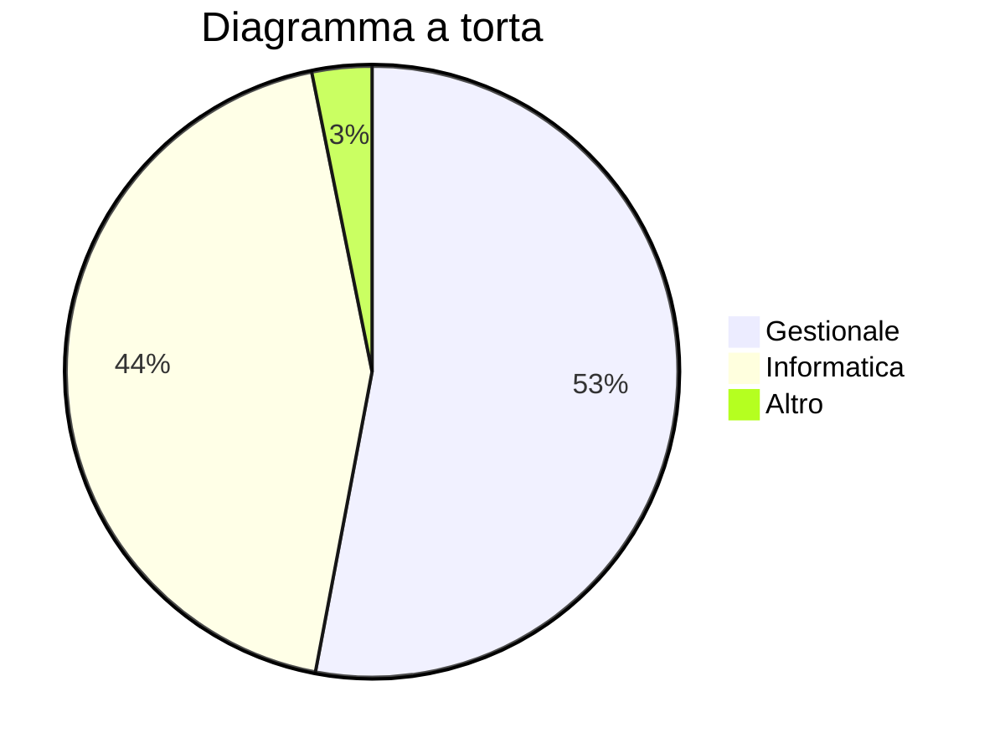
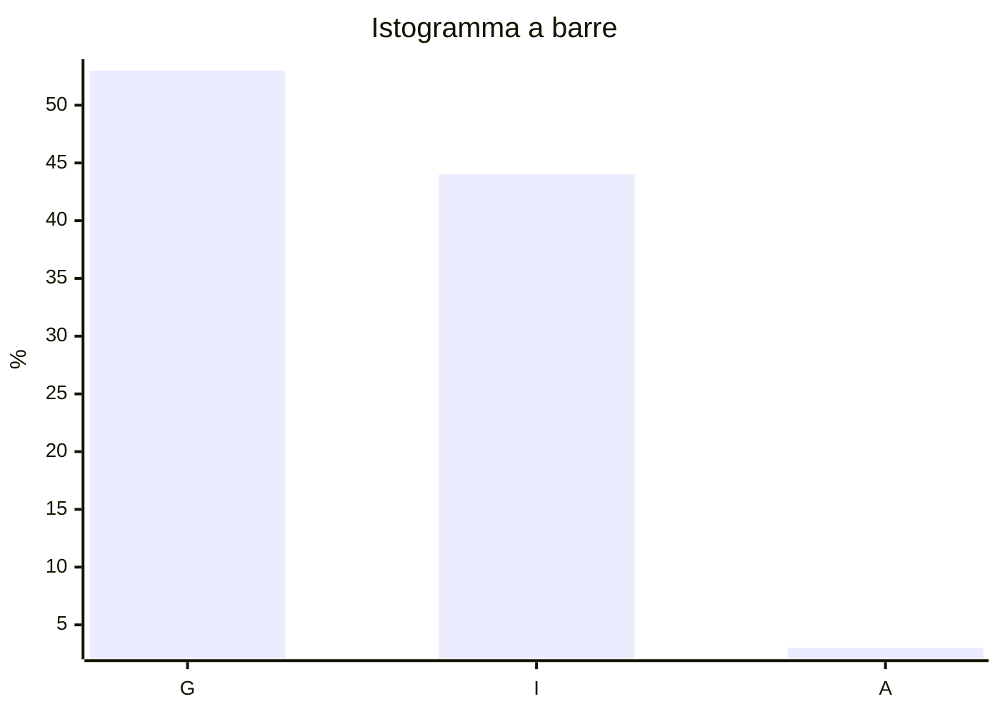
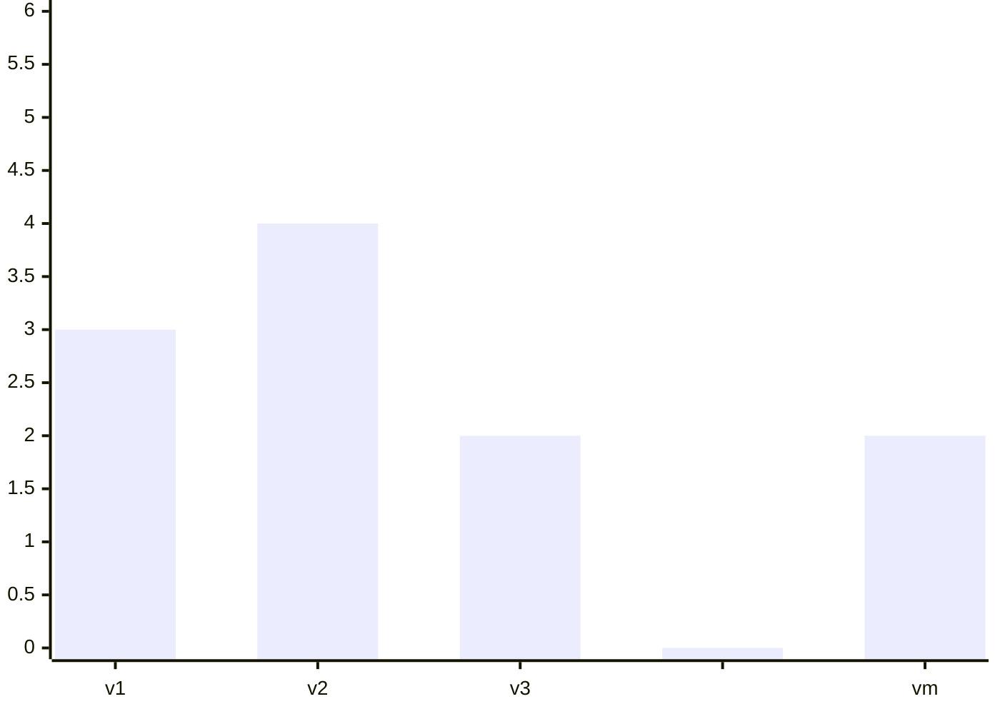

## Frequenza relativa
$\displaystyle f_m=\frac{n_m}n=(\frac{n_m}n\cdot100)\%$
$f_1,\ldots,f_m\in[0,1]$
$f_1+f_2+\ldots+f_m=1$

# Grafici
### Diagramma a torta

### Istogramma a barre



## Tabella a una via

| $x_l$    | $y_l$    | $f_i$    |
| -------- | -------- | -------- |
| $x_1$    | $y_1$    | $f_1$    |
| $\vdots$ | $\vdots$ | $\vdots$ |
| $x_n$    | $y_n$    | $f_n$    |

e.g.
## Tabella a due vie

| $\begin{array}{c}&&y_l\\x_l\end{array}$ | $w_1$    | $\dots$ | $w_j$    | $\dots$ | $w_k$ |
| --------------------------------------- | -------- | ------- | -------- | ------- | ----- |
| $v_1$                                   | $n_{11}$ |         |          |         |       |
| $\vdots$                                |          |         |          |         |       |
| $v_i$                                   |          |         | $n_{ij}$ |         |       |
| $\vdots$                                |          |         |          |         |       |
| $v_m$                                   |          |         |          |         |       |
e.g.

| $\begin{array}{c}&&x_l\\y_l\end{array}$ | Variabile $2_1$ | Variabile $2_2$ | Variabile $2_3$ |     | Variabile $2$ |
| --------------------------------------- | --------------- | --------------- | --------------- | --- | ------------- |
| Variabile $1_1$                         | $1$             | $2$             | $3$             |     | $6$           |
| Variabile $1_2$                         | $1$             | $3$             | $5$             |     | $9$           |
|                                         |                 |                 |                 |     |               |
| Variabile $1$                           | $2$             | $5$             | $8$             |     | $15$          |
Distribuzione marginale di $x_l$

| $w_l$           | $n_l$ |
| --------------- | ----- |
| Variabile $1_1$ | $6$   |
| Variabile $1_2$ | $9$   |

Tabella a due vie (Frequenze relative)

| $\begin{array}{c}&&x_l\\y_l\end{array}$ | Variabile $2_1$ | Variabile $2_2$ | Variabile $2_3$ |     | Variabile $2$ |
| --------------------------------------- | --------------- | --------------- | --------------- | --- | ------------- |
| Variabile $1_1$                         | $6.7\%$         | $13.3\%$        | $20\%$          |     | $40\%$        |
| Variabile $1_2$                         | $6.7\%$         | $20\%$          | $33.3\%$        |     | $60\%$        |
|                                         |                 |                 |                 |     |               |
| Variabile $1$                           | $13.3\%$        | $33.3\%$        | $53.3\%$        |     | $100\%$       |

Profilo riga

| $\begin{array}{c}&&x_l\\y_l\end{array}$ | Variabile $2_1$ | Variabile $2_2$ | Variabile $2_3$ |     | Variabile $2$ |
| --------------------------------------- | --------------- | --------------- | --------------- | --- | ------------- |
| Variabile $1_1$                         | $16.7\%$        | $33.3\%$        | $50\%$          |     | $100\%$       |
| Variabile $1_2$                         | $11.1\%$        | $33.3\%$        | $55.5\%$        |     | $100\%$       |
Profilo colonna

| $\begin{array}{c}&&x_l\\y_l\end{array}$ | Variabile $2_1$ | Variabile $2_2$ | Variabile $2_3$ |
| --------------------------------------- | --------------- | --------------- | --------------- |
| Variabile $1_1$                         | $50\%$          | $40\%$          | $37.5\%$        |
| Variabile $1_2$                         | $50\%$          | $60\%$          | $62.5\%$        |
|                                         |                 |                 |                 |
| Variabile $1$                           | $100\%$         | $100\%$         | $100\%$         |

$n_{1,1}=\#\{l=1,\ldots,n | x_l=v_1\ y_l=w_1\}$
$n_{i,j}=\#\{l=s,\ldots,n | x_l=v_i\ y_l=w_s\}$

$f_{i,j}=\frac{n_{i,j}}n$   Frequenze relative

$i=\text{indice di riga}\rightarrow x_l$
$j=\text{indice di colonna}\rightarrow y_l$

$n_{:k}=n_{1k}+n_{2k}+\ldots+n_{ik}$
$i=1,\ldots,m$
## Regola del prodotto
$f_{j\mid i}=\frac{n_{ij}}{n_{i:}}=\frac{f_{ij}}{f_{i:}}$
$f_{i\mid j}=\frac{n_{ij}}{n_{:j}}=\frac{f_{ij}}{f_{:j}}$

$f_{ij}=f_{j\mid i}\cdot f_{i:}$
$f_{ij}=f_{i\mid j}\cdot f_{:j}$

$\begin{array}{c}f_{ij}&=&\text{frequenza relativa unità sperimentali}&&\begin{array}{c}x_l=w_i\\y_l=w_j\end{array}\\&=&(\underbrace{\text{frequenza relativa }y_l=w_j\text{ dato il sottocampione}}_{f_{j\mid i}}\text{ }x_l=v_i)\cdot(\underbrace{\text{frequenza relativa } x_l}_{f_{i:}}=v_i)\end{array}$

### Formula prodotto
$f_{i,j}=f_{j\mid i}\cdot f_{i:}\Rightarrow\text{frequenza congiunta = (frequenza condizionata di }y_l\text{ dato }x_l=v_i)\cdot(\text{frequenza marginale di }x_l=v_i)$
$x_l=v_i$
$y_l=w_j$
$f_{i,j}=\text{frequenza relativa congiunte di }x_l\text{ e }y_l$

$f_{j\mid i}=\text{frequenza (relativa) di }y_l=w_j\text{ dato (il sottocampione) }x_l=v_j=\text{frequenza di }y_l\text{ condizionata a }x_l=v_i$

## Funzione di distribuzione cumulata
$x_l\text{ variabile quantitativa}$
$x_l\in\{v_1,\ldots,v_n\}$

| $v_i$   | $n_i$   | $f_i$   |
| ------- | ------- | ------- |
| $v_1$   | $n_1$   | $f_1$   |
| $v_2$   | $n_2$   | $f_2$   |
| $v_3$   | $n_3$   | $f_3$   |
| $\dots$ | $\dots$ | $\dots$ |
| $v_m$   | $n_m$   | $f_m$   |



$F:\mathbb R\to \mathbb R$
$\displaystyle F(x)=\frac{\#\{l=1,\ldots,n|x_l\le x\}}n$

```mermaid
xychart-beta
    title " "
    x-axis [0, v1, v1, v2, v2, v3, v3, " ", " ", vm, vm, x]
    y-axis "F(x)" 0 --> 28
    line [0, 0, 3, 3, 7, 7, 9, 9, 25, 25, 26, 26, 26]
```

| $x$     | $F(x)$                |
| ------- | --------------------- |
| $v_1$   | $f_1$                 |
| $v_2$   | $f_1+f_2$             |
| $v_3$   | $f_1+f_2+f_3$         |
| $\dots$ |                       |
| $v_m$   | $f_1+f_2+\dots+f_n=1$ |

# Indici statistici
## Media (empirica)

$\overline x=\frac{x_1+x_2+\ldots+x_n}n=\frac{n_1v_1+n_2v_2+\ldots+n_mv_m}n=f_1v_1+f_2v_2+\ldots+f_mv_m$

$\sigma^2=\frac{(x_1-\overline x)^2+(x_2-\overline x)^2+\ldots+(x_n-\overline x)^2}n\ \ \ \ \text{varianza (della popolazione)}$
$s^2=\frac{(x_1-\overline x)^2+(x_2-\overline x)^2+\ldots+(x_n-\overline x)^2}{n-1}\ \ \ \ \text{varianza (del campione)}$
 
e.g.
$I\text{ studente}$
$x_1=24,x_2=24,\ldots,x_{10}=24$
$\overline x=24$
$\sigma^2=\frac{(x_1-\overline x)^2+(x_2-\overline x)^2+\ldots+(x_n-\overline x)^2}n=\frac{(\cancel{24}-\cancel{24})^2}{10}=0$

$II\text{ studente}$
$x_1=18,x_2=18,\ldots,x_5=18,x_6=30,\ldots,x_{10}=30$
$\overline x=24$
$\sigma^2=\frac{\overbrace{(18-24)^2+\ldots+(18-24)^2}^5+\overbrace{(30-24)^2+\ldots+(30-24)^2}^5}{10}=\frac5{10}\overbrace{36}^{6^2}+\frac5{10}36=36$
$\sigma=6$


$\overline{xy}=\frac{x_1y_1+\ldots+x_ny_n}n$

### LSM
$y=\frac{\sigma_y}{\sigma_x}\rho_{x,y}(x-\overline x)+\overline y$

$\displaystyle\underbrace{\rho_{x,y}}_{\text{coefficiente di correlazione}}=\frac{\overline{(xy)}-(\overline x)(\overline y)}{\sigma_x\sigma_y}$


## e.g.

| $\begin{array}{c}&y\\x\end{array}$ | $-1$                            | $0$                            | $1$                            |     | $f_{i:}$     |
| ---------------------------------- | ------------------------------- | ------------------------------ | ------------------------------ | --- | ------------ |
| $1$                                | $\frac1{10}\ ^{\color{#9B82F1}-1}$ | $\frac2{10}\ ^{\color{#9B82F1}0}$ | $\frac3{10}\ ^{\color{#9B82F1}1}$ |     | $\frac6{10}$ |
| $2$                                | $\frac3{10}\ ^{\color{#9B82F1}-2}$ | $\frac1{10}\ ^{\color{#9B82F1}0}$ | $0\ ^{\color{#9B82F1}2}$          |     | $\frac4{10}$ |
|                                    |                                 |                                |                                |     |              |
| $f_{:j}$                           | $\frac4{10}$                    | $\frac3{10}$                   | $\frac3{10}$                   |     | $1$          |
$\overline x=\frac6{10}1+2\frac4{10}=\frac{14}{10}=1.4$
$\overline y=\frac4{10}(-1)+\cancel{\frac{3}{10}0}+\frac{3}{10}1=-\frac1{10}=-0.1$


${\sigma_x}^2\frac6{25}\ \ \ \ \ \ \ \ \sigma_x=\frac{\sqrt6}5\approx0.49$
${\sigma_y}^2=\frac{69}{100}\ \ \ \ \ \ \ \ \sigma_y=\frac{\sqrt{69}}{10}\approx0.83$

$\overline{xy}=\frac1{10}({\color{#9B82F1}{-1}})+\frac3{10}({\color{#9B82F1}{-2}})+\frac3{10}({\color{#9B82F1}1})=-\frac45$

$\displaystyle\rho_{xy}=\frac{-\frac45-\frac{14}{10}\left(-\frac1{10}\right)}{\frac{\sqrt6}5\frac{\sqrt{69}}{10}}=-\frac{13}{3\sqrt{46}}\approx-0.6389$


# Probabilità
## Evento
$\Omega=\text{Spazio campionario: Insieme di tutti i possibili risultati}$

$\begin{array}{l}\text{Lancio di moneta}&\Omega=\{T,C\}\\\text{Lancio del dado}&\Omega=\{1,2,3,4,5,6\}\\\text{Voti statistica}&\Omega=\{18,19,\ldots,30,30\text{ e lode}\}\\\text{Altezza studenti}&\Omega=[0,+\infty)\end{array}$

Un evento $E$ è un sottoinsieme di $\Omega$
$E\subseteq\Omega$
$E$ è una collezione di possibili risultati

Dato un evento $E\subseteq\Omega$, se esce il risultato $\omega\in\Omega$
- $\omega\in E\qquad E\text{ è accaduto}$
- $\omega\notin E\qquad E\text{ non è accaduto}$

$\Omega=\text{Evento certo (tutti i possibili risultati)}$
$\emptyset=\text{Evento impossibile}$
$E\in\Omega\qquad \overline E=\{\omega\in\Omega|w\notin E\}=\text{Evento opposto}$

$E$ ed $F$ due eventi
$E\cap F=\{\omega\in\Omega\ |\ \omega\in E\ \cap \ \omega\in F\}\quad\text{Evento congiunto}$
$E\cup F=\{\omega\in\Omega\ |\ \omega\in E\ \cup \ \omega\in F\}\quad\text{Evento unione}$

$\mathbb P[E]=\mathbb P(E)=\text{Probabilità dell'evento }E\text{ tale che:}\quad\begin{array}{l}\mathbb P[\Omega]=1&100\%\\E\subseteq\Omega&0\le\mathbb P[E]\le 1\\\text{se }E\ \cap F=\varnothing&\mathbb P[E\ \cup F]=\mathbb P[E]+\mathbb P[F]\end{array}$

$\Omega$ ha area $1\times 1=1$
$\mathbb P[E]$ come "area"$\quad0\le\underbrace{\mathbb P[E]}_{\text{area}}\le 1$

$E\ \cap F=\varnothing\Rightarrow\mathbb P[E\ \cup F]=\mathbb P[E] + \mathbb P[F]$
$E\ \cap F\ne\varnothing\Rightarrow\mathbb P[E\ \cup F]\ne\mathbb P[E] + \mathbb P[F]$

Uno spazio di probabilità si dice **finito** se lo spazio campionario $\Omega$ ha un numero finito di elementi  $\Omega=\{\omega_1,\ldots,\omega_n\}\quad\omega_i\neq\omega_j\quad i\ne j\quad n\in\mathbb N$

La probabilità di un evento è nota conoscendo la probabilità dei possibili risultati

| $\omega$   | $\mathbb P[\{\omega\}]$ |
| ---------- | ----------------------- |
| $\omega_1$ | $\mathbb P_1$           |
| $\omega_2$ | $\mathbb P_2$           |
| $\vdots$   | $\vdots$                |
| $\omega_n$ | $\mathbb P_n$           |
(distribuzione di probabilità)


Per $\mathbb P_n\ge 0\quad\mathbb P_1+\mathbb P_2+\ldots+\mathbb P_n=1\Rightarrow \underset{i=1,\ldots,n}{0\le\mathbb P_i\le1}$
$M=\#E$
$\mathbb P[E]=\{\omega_{i_1},\ldots,\omega_{i_M}\}=\mathbb P[\{\omega_{i_1}\}]+\ldots+\mathbb P[\{\omega_{i_M}\}]=p_{i_1}+\ldots+p_{i_M}$
$E=\{\omega_2,\omega_2\}\quad\mathbb P[E]=p_2+p_3$

### Esempio

### Coefficiente binomiale
$n,k\in\mathbb N\quad 0\le k\le n$

$\displaystyle n\choose k=\frac{n!}{k!(n-k)!}$

### Proprietà
- ${n\choose {n}}={n\choose{0}}=1$
- ${n\choose k}={n\choose n-k}$
- ${n\choose k}={n-1\choose k-1}+{n-1\choose k}$
- $(a+b)^n=\sum\limits_{k=0}^{n}{n\choose k}a^kb^{n-k}$
- 
## Calcolo combinatorio
$n\text{ oggetti distinti}$
$k\text{ estrazioni}$

Modalità di estrazione
1) Estrazione senza ripetizioni
2) Estrazione con ripetizione

Modalità di memorizzazione del risultato
1) Si tiene conto dell'ordine (permutazioni)
2) Non si tiene conto dell'ordine (combinazioni) $n\choose k$

Il calcolo combinatorio conta in quanti modi posso fare le estrazioni
$n=\text{numero oggetti}\quad k=\text{numero estrazioni (lunghezza)}$
 
1) Permutazioni (ordine si) senza ripetizioni (no permutazione)
$k\le n\qquad\text{numero modi}=n(n-1)\ldots(n-k+1)$
2) Permutazioni con ripetizioni
$\text{numero modi}=\underbrace{n\cdot\ldots\cdot n}_{k\text{ volte}}=n^k$

Se $k=n$ permutazioni a lunghezza $n=\text{permutazioni}$
$\#\text{nomi}=n(n-1)\ldots 1=n!$


## Probabilità condizionata
### Definizione
**Probabilità condizionata di $F$ dato $E$
Dati due eventi $E,\ F$
$\mathbb P[F|E]=\frac{\mathbb P[E\cap F]}{\mathbb P[E]}$

### Osservazione
Se $\mathbb P[E]=0\rightarrow E\cap F\subseteq E\Rightarrow\mathbb P[E\cap F]=0$

$\mathbb P[F|E]=\frac{\mathbb P[E\cap F]}{\mathbb P[E]}=\frac00=0$

### Proprietà
- Dati due eventi $E,\ F$
$\mathbb P[E\cap F]=\mathbb P[E]\cdot \mathbb P[F|E]$

- Data una famiglia di eventi $E_1,\ E_2,\ \ldots,\ E_n$
$\mathbb P[E_1\cap E_2\cap\ldots\cap E_n]=\mathbb P[E_1]\cdot \mathbb P[E_2|E_1]\cdot \mathbb P[E_3|E_1\cap E_2]\cdot\ldots\cdot \mathbb P[E_n|E_1\cap E_2\cap\ldots\cap E_{n-1}]$

## Formula della probabilità totale
1) Dati due eventi $E$ e $F$
$\mathbb P[F]=\mathbb P[E]\cdot \mathbb P[F|E]+\mathbb P[\overline E]\cdot\mathbb P[F|\overline E]$

### Esempio 1
Estraggo $2$ carte consecutivamente da un mazzo di $52$ carte con $4$ semi senza rimettere le carte estratte nel mazzo.
Qual'è la probabilità che la seconda carta sia $\clubsuit$?

$\mathbb P[\underbrace{2^a\ \clubsuit}_F]=\mathbb P[\underbrace{1^a\ \clubsuit}_E]\cdot \mathbb P[\underbrace{2^a\ \clubsuit\ |\ 1^a\ \clubsuit}_{F|E}]+\mathbb P[\underbrace{1^a\ \cancel\clubsuit}_{\overline E}]\cdot \mathbb P[\underbrace{2^a\ \clubsuit\ |\ 1^a\ \cancel\clubsuit}_{F|\overline E}]=\frac{13}{52}\frac{12}{51}+\frac{39}{52}\frac{13}{51}=\frac{13}{52}\frac{12}{51}+\frac{13}{52}\frac{39}{51}=\frac{13}{52}\frac{12+39}{51}=\frac{13}{52}\frac{\cancel{51}}{\cancel{51}}=\frac{13}{52}=\frac14=\mathbb P[1^a\ \clubsuit]$

2) Una famiglia $E_1,\ldots,E_n$ di eventi a due a due disgiunti $E_i\cap E_j=\emptyset\ \ i\ne j$ e $\Omega=E_1\cup E_2\cup\ldots\cup E_n$ e un evento $F$
$\mathbb P[F]=\mathbb P[E_1]\cdot \mathbb P[F|E_1]+\mathbb P[E_2]\cdot \mathbb P[F|E_2]+\ldots+\mathbb P[E_n]\cdot \mathbb P[F|E_n]$

### Esempio 2
Lancio un dado equilibrato con le facce numerate da $1$ a $6$. In bae al risultato ottenuto lancio una moneta equilibrata tante volte quanto è il risultato del dado. Qual'è la probabilità di ottenere, esattamente, $4$ teste?

$\mathbb P[^"1^"]=\ldots=\mathbb P[^"6^"]=\frac16$
$\mathbb P[4\ T|^"1^"]=\mathbb P[4\ T|^"2^"]=\mathbb P[4\ T|^"3^"]=0$

$\displaystyle\mathbb P[4\ T|^"4^"]=\frac{4\choose 0}{2^4}=\frac1{16}$

$\displaystyle\mathbb P[4\ T|^"5^"]=\frac{5\choose 1}{2^5}=\frac5{32}$

$\displaystyle\mathbb P[4\ T|^"6^"]=\frac{6\choose 2}{2^6}=\frac{15}{64}$


$\mathbb P[4\ T]=\mathbb P[^"1^"]\cdot\mathbb P[4\ T|^"1^"]+\ldots+\mathbb P[^"6^"]\cdot\mathbb P[4\ T|^"6^"]=\frac16\cdot0+\frac16\cdot0+\frac16\cdot0+\frac16\frac1{16}+\frac16\frac5{32}+\frac16+\frac{15}{64}$


## Formula di Bayes
$\mathbb P[{\color{#C7F}E}\cap {\color{#4C4}F}]=\mathbb P[{\color{#C7F}E}]\cdot \mathbb P[{\color{#4C4}F}|{\color{#C7F}E}]=\mathbb P[{\color{#4C4}F}]\cdot\mathbb P[{\color{#C7F}E}|{\color{#4C4}F}]$


# Esercizio
In un’urna ci sono 15 palline rosse e 6 blu. Viene lanciata una moneta equilibrata, se esce
Testa si estraggono 4 palline senza rimpiazzo se esce Croce se ne estraggono 5 senza rimpiazzo
a) sapendo che è uscita Testa, qual è la probabilità che siano state estratte esattamente 3 palline
rosse ?
b) qual è la probabilità che siano state estratte esattamente 3 palline rosse ?
c) sapendo che sono state estratte esattamente 3 palline rosse, qual è la probabilità che sia uscita
Testa ?
a)
$$P(3R \mid T) = \frac{\binom{15}{3}\binom{6}{1}}{\binom{21}{4}} = \frac{26}{57}$$

b)
$$P(3R \mid C) = \frac{\binom{15}{3}\binom{6}{2}}{\binom{21}{5}} = \frac{325}{969}$$


$$P(3R) = 0.5 \cdot \frac{26}{57} + 0.5 \cdot \frac{325}{969} = \frac{767}{1938}$$

c)
$$P(T \mid 3R) = \frac{P(3R \mid T) \cdot P(T)}{P(3R)} = \frac{34}{59}$$