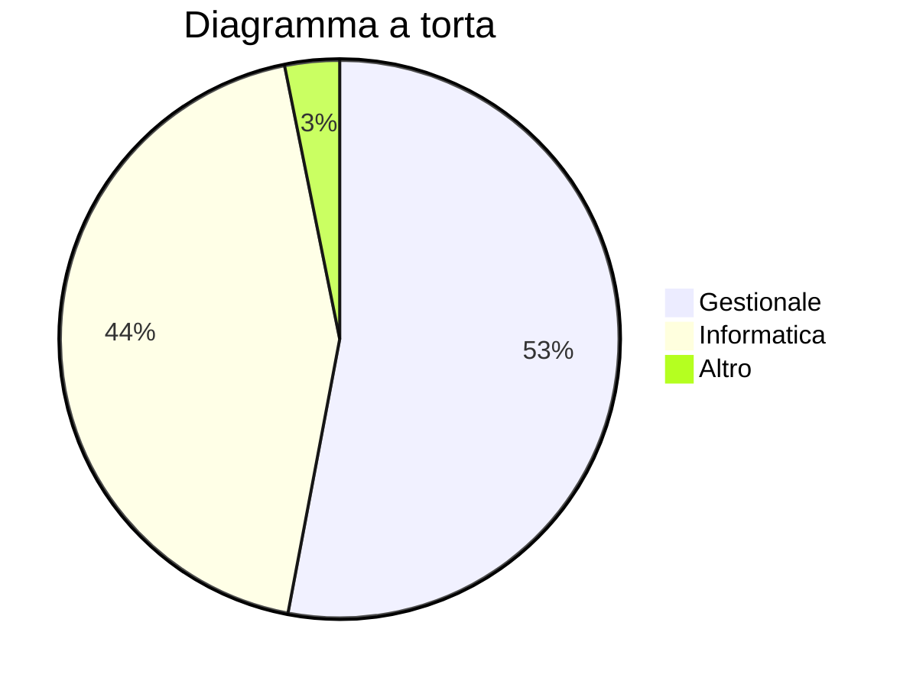
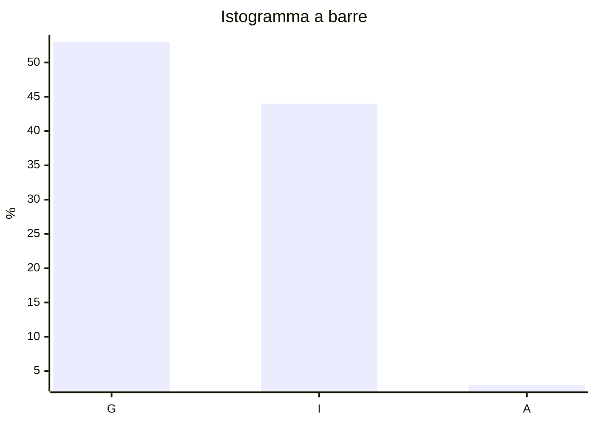
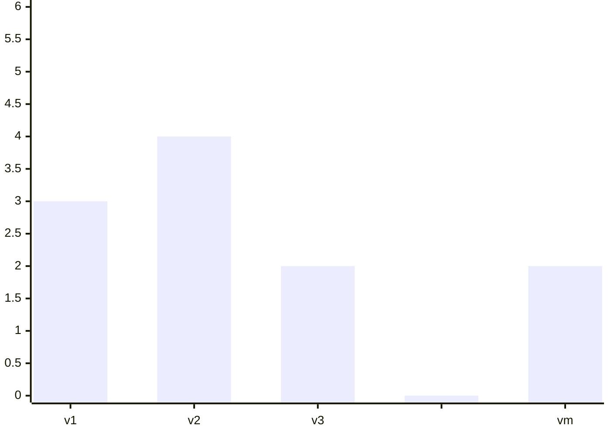

Dati
Database/Campione/Training set

# Concetti base

$n=\text{numerosità del campione}$
$\text{Unità sperimentale} (l) = \text{Elemento del database}\ \ \ \ \ \ \ \ l=1,\ldots,n\ \ \ \ \text{singolo elemento campione}$
$x_l=\text{informazione}$
$x_l=\underline{\textbf{variabile}}$

Variabili quantitative
$x_l\in\mathbb R\ \ \ \ x_l\in\mathbb R^n$

Variabili qualitative
$x_l\in\mathcal D\ \ \ \ \mathcal D=\text{Dizionario}$

| $1$     |     |
| ------- | --- |
| $2$     |     |
| $\dots$ |     |
| $n-1$   |     |
| $n$     |     |

Lista studenti corso
Campione = Studenti statistica
$n=253$
$l = \text{Studente (riga Excel)}$
$x_l=({\underbrace{\text{matricola}}_\text{quantitativa},\  \underbrace{\text{nome studente}}_{\text{qualitativa}},\ \underbrace{\text{codice corso di studio}}_{\text{quantitativa}}, \underbrace{\text{anno di corso}}_{\text{quantitativa}}, \underbrace{\text{nazionalità}}_{\text{qualitativa}}})$
$x_l=\text{matricola}\in\mathbb R$
$x_l=\text{corso di laurea}$
$x_l\in\{\text{ingengeria gestionale, ingegneria informatica}\}$

ImageNet
$n\approx 14\cdot10^6$
$l = \text{Immagine}$
$x_l=(\text{immagine digitale, contenuto semantico})$
$x_l=\text{immagine}\in\mathbb R^{256\times256}$
$x_l=\text{contenuto specifico}$
$x_l\in\{\text{pesci, gatti, cani},\ldots\}$


Studenti corso
$x_l\ \ \ \ l=1,\ldots,n\ \ \ \ \text{variabile}\ \begin{cases}\text{qualitativa}\\\\\underset{x_l\in\mathbb R}{\text{quantitativa}}\end{cases}\ \ \ \ (\text{colonna Excel})$

$x_l=\text{corso di studi}$
$x_l\in\{\text{gestionale, informatica, altro}\}\ \ \ \ l=\overset{n=253}{1,\ldots,n}$

###### Valori distinti
$x_l=\text{anno di corso}$
$x_l\in\{\underset{v_1}1,\ \underset{v_2}2,\ \underset{v_3}3,\ \underset{v_4}{>3}\}$

###### Valori distinti della variabile $x_l$
$x_l\in\{v_1,\ldots,v_m\}$
$m\le n$
$v_i\ne v_s\ \ \ \ i\ne s$

$\begin{array}{l}l = \text{unità sperimentale}&&l=1,\ldots,n\\i = \text{valori distinti}&&i=1,\ldots,m\end{array}$

$n_1=\#\{l=1,\ldots,n|x_l=v_1\}$
$n_2=\#\{l=1,\ldots,n|x_l=v_2\}$
$\dots$
$n_m=\#\{l=1,\ldots,n|x_l=v_m\}$

$\#A=\underbrace{\text{numero di elementi di A}}_{\text{cardinalità}}$

$v_1,v_2,\ldots,v_m$
$n_1,n_2,\ldots,n_m$
$n_1,\ldots,n_v,\ldots,n_m\in\mathbb N$
## Frequenza relativa
$f_1=\frac{n_1}n$
$f_2=\frac{n_2}n$
$f_m=\frac{n_m}n$
$f_1,\ldots,f_m\in[0,1]$
Si possono esprimere in percentuale
$f_1+f_2+\ldots+f_m=1$

### Esempio
$x_l=\text{corso di studi}$
$l=1,\ldots,\overset n {253}$

$x_l\in\{\underset G {\text{gestionale}},\underset I {\text{informatica}}, \underset A {\text{altro}}\}$

$\begin{array}{c}v_1=\text{gestionale}&v_2=\text{informatica}&v_3=\text{altro}\\n_1=134&n_2=111&n_3=8\\f_1=\frac{134}{253}=0.5296\ldots\approx0.53=53\%&f_2\approx44\%&f_3\approx3\%\end{array}\ \ \ \ \text{frequenze assolute}$

$n_1+n_2+n_3=n$
$f_1+f_2+f_3=1$

# Grafici

## Diagramma a torta



## Istogramma a barre



## Tabella a una via

$x_l=\text{corso di studi}$
$y_l=\text{nazionalità}$

$x_l=\{\text{gestionale, informatica, altro}\}$
$y_l=\{\text{italiana, straniera}\}$

$n_i=\text{frequenze assolute}$
$f_i=\text{frequenze relative}$

| $x_l$       | $y_l$ | $f_i$ |
| ----------- | ----- | ----- |
| Gestionale  | 134   | 53%   |
| Informatica | 111   | 44%   |
| Altro       | 8     | 3%    |

## Tabella a due vie

| $\begin{array}{c}&&x_l\\y_l\end{array}$ | $\overset{v_1}G$ | $\overset{v_2}I$ | $\overset{v_3}A$ |     | $y_l$ |
| --------------------------------------- | ---------------- | ---------------- | ---------------- | --- | ----- |
| Italiana                                | $127$            | $101$            | $6$              |     | $234$ |
| Straniera                               | $7$              | $10$             | $2$              |     | $19$  |
|                                         |                  |                  |                  |     |       |
| $x_l$                                   | $134$            | $111$            | $8$              |     | $253$ |
Distribuzione marginale di $x_l$


| $w_l$     | $n_l$ |
| --------- | ----- |
| Italiana  | 234   |
| Straniera | 19    |

Tabella a due vie (Frequenze relative)

| $\begin{array}{c}&&x_l\\y_l\end{array}$ | $G$                          | $I$    | $A$   |     | $y_l$   |
| --------------------------------------- | ---------------------------- | ------ | ----- | --- | ------- |
| Italiana                                | $\frac{127}{234}\approx50\%$ | $40\%$ | $2\%$ |     | $92\%$  |
| Straniera                               | $3\%$                        | $4\%$  | $1\%$ |     | $8\%$   |
|                                         |                              |        |       |     |         |
| $x_l$                                   | $53\%$                       | $44\%$ | $3\%$ |     | $100\%$ |
Tabella a una via


$w_1=\text{italiana}$
$w_2=\text{stranieta}$

$v_1=\text{gestionale}$
$v_2=\text{informatica}$
$v_3=\text{altro}$

Una riga: sottocampione
e.g. sottocampione nazionalità italiana

| $\begin{array}{c}&&x_l\\y_l\end{array}$ | $\overset{v_1}G$ | $\overset{v_2}I$ | $\overset{v_3}A$ |     | $y_l$ |
| --------------------------------------- | ---------------- | ---------------- | ---------------- | --- | ----- |
| Italiana                                | $127$            | $101$            | $6$              |     | $234$ |

Sottocampione nazionalità italiana e sottocampioni stranieri

| $\begin{array}{c}&&x_l\\y_l\end{array}$ | $\overset{v_1}G$             | $\overset{v_2}I$ | $\overset{v_3}A$ |     | $y_l$   |
| --------------------------------------- | ---------------------------- | ---------------- | ---------------- | --- | ------- |
| Italiana                                | $\frac{127}{234}\approx54\%$ | $43\%$           | $3\%$            |     | $100\%$ |
| Straniera                               | $\frac{7}{19}\approx37\%$    | $53\%$           | $10\%$           |     | $100\%$ |
Frequenze relative del corso di studi data la **nazionalità**


Sottocampione corso gestionale + sottocampione informatica + sottocampione altro

| $\begin{array}{c}&&x_l\\y_l\end{array}$ | $\overset{v_1}G$ | $\overset{v_2}I$ | $\overset{v_3}A$ |
| --------------------------------------- | ---------------- | ---------------- | ---------------- |
| Italiana                                | $95\%$           | $91\%$           | $75\%$           |
| Straniera                               | $5\%$            | $9\%$            | $25\%$           |
|                                         |                  |                  |                  |
| $x_l$                                   | $100\%$          | $100\%$          | $100\%$          |
Frequenza relativa della nazionalità dato il **corso di studi**


| $\begin{array}{c}&&x_l\\y_l\end{array}$ | $G$                          | $I$    | $A$   |     | $y_l$   |
| --------------------------------------- | ---------------------------- | ------ | ----- | --- | ------- |
| Italiana                                | $\frac{127}{234}\approx50\%$ | $40\%$ | $2\%$ |     | $92\%$  |
| Straniera                               | $3\%$                        | $4\%$  | $1\%$ |     | $8\%$   |
|                                         |                              |        |       |     |         |
| $x_l$                                   | $53\%$                       | $44\%$ | $3\%$ |     | $100\%$ |

$x_l\in\{v_1,\ldots,v_m\}$
$y_l\in\{w_1,\ldots,w_k\}$

$\begin{array}{l}l=1,\ldots,n\\v_i&i=1,\ldots,m\\w_j&j=1,\ldots,k\end{array}$

$n=253$
$m=3$
$k=2$

Tabella a due vie

Frequenze assolute

| $\begin{array}{c}&&y_l\\x_l\end{array}$ | $w_1$    | $\dots$ | $w_j$    | $\dots$ | $w_k$ |
| --------------------------------------- | -------- | ------- | -------- | ------- | ----- |
| $v_1$                                   | $n_{11}$ |         |          |         |       |
| $\vdots$                                |          |         |          |         |       |
| $v_i$                                   |          |         | $n_{ij}$ |         |       |
| $\vdots$                                |          |         |          |         |       |
| $v_m$                                   |          |         |          |         |       |


$n_{1,1}=\#\{l=1,\ldots,n | x_l=v_1\ y_l=w_1\}$
$n_{i,j}=\#\{l=s,\ldots,n | x_l=v_i\ y_l=w_s\}$

$f_{i,j}=\frac{n_{i,j}}n$   Frequenze relative

$i=\text{indice di riga}\rightarrow x_l$
$j=\text{indice di colonna}\rightarrow y_l$

$n_{:k}=n_{1k}+n_{2k}+\ldots+n_{ik}$
$i=1,\ldots,m$

| $v_i$    | $n_i$    |
| -------- | -------- |
| $v_1$    | $n_{1i}$ |
| $\vdots$ | $\vdots$ |
| $v_n$    | $n_{mi}$ |
$\text{Marginale riga}\leftrightarrow\text{tabella una via }x_l$


$\text{Marginale colonna}\leftrightarrow\text{tabella una via }y_l$


$n_{i,j}\text{ frequenze assolute}\ \ \ \ \begin{array}{l}i=1,\ldots,n&x_l\in\{v_1,\ldots,v_n\}\\j=1,\ldots,k&y_l\in\{w_1,\ldots,w_n\}\end{array}$


$f_{i,j}=\frac{n_{i,j}}n$  Frequenze relative

$\begin{cases}n_{i:}=n_{i1}+\ldots+n_{ik}&\text{marginale riga}\\f_{i:}=f_{i1}+\ldots+f_{ik}&\text{tabella una via}x_l\end{cases}\ \ \ \ i=1,\ldots,m$

$\begin{cases}n_{:j}=n_{1j}+\ldots+n_{mj}&\text{marginale riga}\\f_{:j}=f_{1j}+\ldots+f_{mj}&\text{tabella una via}y_l\end{cases}\ \ \ \ j=1,\ldots,k$


| $\begin{array}{c}&&y_l\\x_l\end{array}$ | $w_1$     | $\dots$   | $w_k$     |     |          |
| --------------------------------------- | --------- | --------- | --------- | --- | -------- |
| $v_1$                                   | $n_{1,1}$ |           | $n_{1,k}$ |     | $n_{1:}$ |
| $\vdots$                                |           | $n_{i,j}$ |           |     | $n_{i:}$ |
| $v_m$                                   | $n_{m,1}$ |           | $n_{m,k}$ |     | $n_{m:}$ |
|                                         |           |           |           |     |          |
|                                         | $n_{:1}$  | $n_{:j}$  | $n_{:k}$  |     |          |


$f_{i\mid j}=\frac{n_{ij}}{n_:j}$  Profilo colonna  ($j$ sottocampione)

$f_{j\mid i}=\frac{n_{ij}}{n_i:}$  Profilo riga  ($i$ sottocampione)

# Regola del prodotto
$f_{j\mid i}=\frac{n_{ij}}{n_{i:}}=\frac{f_{ij}}{f_{i:}}$
$f_{i\mid j}=\frac{n_{ij}}{n_{:j}}=\frac{f_{ij}}{f_{:j}}$

$f_{ij}=f_{j\mid i}\cdot f_{i:}$
$f_{ij}=f_{i\mid j}\cdot f_{:j}$

$\begin{array}{c}f_{ij}&=&\text{frequenza relativa unità sperimentali}&&\begin{array}{c}x_l=w_i\\y_l=w_j\end{array}\\&=&(\underbrace{\text{frequenza relativa }y_l=w_j\text{ dato il sottocampione}}_{f_{j\mid i}}\text{ }x_l=v_i)\cdot(\underbrace{\text{frequenza relativa } x_l}_{f_{i:}}=v_i)\end{array}$

## Formula prodotto
$f_{i,j}=f_{j\mid i}\cdot f_{i:}\Rightarrow\text{frequenza congiunta = (frequenza condizionata di }y_l\text{ dato }x_l=v_i)\cdot(\text{frequenza marginale di }x_l=v_i)$
$x_l=v_i$
$y_l=w_j$
$f_{i,j}=\text{frequenza relativa congiunte di }x_l\text{ e }y_l$

$f_{j\mid i}=\text{frequenza (relativa) di }y_l=w_j\text{ dato (il sottocampione) }x_l=v_j=\text{frequenza di }y_l\text{ condizionata a }x_l=v_i$


# Funzione di distribuzione cumulata
$x_l\text{ variabile quantitativa}$
$x_l\in\{v_1,\ldots,v_n\}$

| $v_i$   | $n_i$   | $f_i$   |
| ------- | ------- | ------- |
| $v_1$   | $n_1$   | $f_1$   |
| $v_2$   | $n_2$   | $f_2$   |
| $v_3$   | $n_3$   | $f_3$   |
| $\dots$ | $\dots$ | $\dots$ |
| $v_m$   | $n_m$   | $f_m$   |




$F:\mathbb R\to \mathbb R$
$\displaystyle F(x)=\frac{\#\{l=1,\ldots,n|x_l\le x\}}n$

```mermaid
xychart-beta
    title " "
    x-axis [0, v1, v1, v2, v2, v3, v3, " ", " ", vm, vm, x]
    y-axis "F(x)" 0 --> 28
    line [0, 0, 3, 3, 7, 7, 9, 9, 25, 25, 26, 26, 26]
```

| $x$     | $F(x)$                |
| ------- | --------------------- |
| $v_1$   | $f_1$                 |
| $v_2$   | $f_1+f_2$             |
| $v_3$   | $f_1+f_2+f_3$         |
| $\dots$ |                       |
| $v_m$   | $f_1+f_2+\dots+f_nm1$ |
