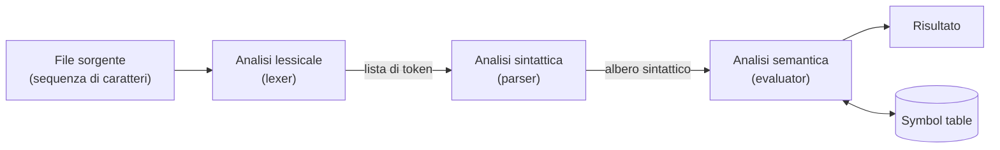
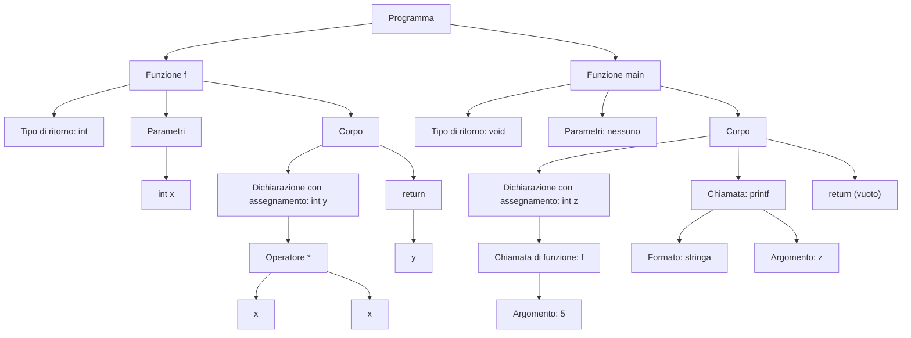

---

## lezione: 2 data: 2026-09-24 argomenti: [architettura di un interprete, analisi lessicale, analisi sintattica, analisi semantica, symbol table, alfabeti, stringhe, linguaggi formali, operazioni sui linguaggi, word problem, tecniche deduttive, induzione]

---
# Lezione 2 — Architettura di un interprete e fondamenti dei linguaggi formali

La lezione riprende il problema posto alla fine della [[Lezione 01 - Presentazione del corso|prima lezione]]: costruire un interprete. Lo fa in due tempi. Nella prima parte, «tecnologica», mostra come la letteratura sui compilatori scompone il problema in tre fasi: analisi lessicale, sintattica e semantica. Nella seconda parte, sulle slide _Argomenti preliminari_, introduce i concetti di alfabeto, stringa e linguaggio, con l'obiettivo di mostrare che le tre fasi risolvono, dal punto di vista teorico, **lo stesso problema**: il _word problem_.

Il docente precisa che lo scopo non è ancora spiegare come si fa il progetto, ma far capire perché il corso è impostato in questo modo. Non bisogna quindi preoccuparsi se qualche dettaglio sfugge: conta la visione d'insieme, che verrà ripresa più volte.

## Il programma di riferimento

Il punto di partenza è un piccolo programma in stile C/C++, simile a quello delle dispense, scritto alla lavagna:

```cpp
int f(int x){
    int y = x * x;
    return y;
}

void main(){
    int z = f(5);
    printf("Il quadrato di 5 è %d", z);
    return ;
}
```

La funzione `f` calcola il quadrato del suo argomento; `main` la invoca con argomento 5, memorizza il risultato in `z` e lo stampa. Eseguito, il programma produce `Il quadrato di 5 è 25`.

> [!warning] Discrepanza tra le fonti: 
> `void main` La versione alla lavagna, riportata anche negli appunti manuali, usa `void main()` e `return ;`. Una delle note manuali riporta invece `int main()` con `return 0;`. Ai fini della lezione la differenza è irrilevante. Va però ricordato che lo standard C++ richiede che `main` restituisca `int`, e che `printf` richiede l'inclusione di `<cstdio>`. Un programma da compilare davvero userebbe quindi `int main()`.

L'obiettivo non è interpretare _questo_ programma, né sue piccole variazioni (sostituire `x * x` con `2 * x`, per esempio), cosa che si potrebbe fare con un programma banale. L'obiettivo è gestire **un'intera classe di programmi**, scritti in un opportuno sottoinsieme del C++. Si può immaginare un sottoinsieme con le sole operazioni sugli interi, senza numeri in virgola mobile né stringhe, con funzioni, stampa, magari lettura di valori e cicli come `while` e `for`.

Un compilatore completo per il C++ è un lavoro di anni per gruppi numerosi di persone: compilatori come GCC sono il frutto di decenni di sviluppo. Il corso trascura inoltre tutta la parte di generazione del codice macchina. Un sottoinsieme ristretto del linguaggio, però, rende il problema alla portata di un progetto.

## Scomporre il problema

Davanti a un problema difficile, la strategia ingegneristica è **scomporlo in sottoproblemi più semplici**. Il docente lo dice con un'immagine popolare: un elefante si mangia un boccone alla volta. Lo stesso principio è già noto dall'hardware. Dai flip-flop e dalle reti combinatorie si costruisce un'ALU. Aggiungendo registri e un'unità di controllo si ottiene un microprocessore. Con il microprocessore e altri circuiti si arriva al calcolatore completo. Chi assembla un PC lavora a livello di processore, scheda madre e disco, e ignora la complessità interna di ciascun componente: esiste una gerarchia di livelli di astrazione.

Il software funziona allo stesso modo. I programmi di Fondamenti di Informatica 1 (cercare un elemento in una stringa, concatenare stringhe, moltiplicare matrici lette da file) sono l'equivalente di una singola porta logica. Un interprete è un'applicazione più grande, paragonabile alla progettazione di una scheda video. Uno degli obiettivi del corso è proprio portare gli studenti un livello più in alto.

Per scomporre il problema dell'interprete il docente richiama l'analisi grammaticale e l'analisi logica studiate a scuola. Un linguaggio di programmazione differisce da un linguaggio naturale perché ha sintassi e semantica definite con precisione, ma l'approccio è lo stesso. Prima si riconoscono le **parole**: davanti alla parola inesistente «brignac» un parlante italiano si accorge subito che qualcosa non va. Poi si verifica che le parole formino **frasi** ben costruite. Infine si attribuisce un **significato** alle frasi. Ne risultano tre fasi in cascata:



Il docente sottolinea che questa organizzazione non è un'invenzione sua: è ciò che si trova in letteratura, frutto di circa settant'anni di esperienza nella costruzione di interpreti e compilatori. Tutti gli interpreti sono fatti così, a meno di dettagli che verranno visti in seguito.

## Prima fase: analisi lessicale

### Parole e token

La prima fase è l'**analisi lessicale**, svolta da un modulo chiamato _lexer_ (da _lexical analyzer_). Il suo compito è individuare le **parole** del programma. Nel linguaggio di programmazione le parole non sono soltanto quelle che intuitivamente chiameremmo tali. `int` è una parola del linguaggio, che indica un tipo; `f` è un **identificatore**, cioè il nome scelto dal programmatore per la funzione. Anche la parentesi tonda aperta è una parola, benché si sia portati a considerarla un segno di interpunzione: la si indica con `lp` (_left parenthesis_). Analogamente `rp` è la parentesi tonda chiusa, `lb` e `rb` (_left/right brace_) le parentesi graffe aperta e chiusa. Le parole riservate del linguaggio, come `return`, sono dette **parole chiave** (_keyword_, `kw`).

Ogni parola riconosciuta diventa un **token** (in italiano a volte «gettone», o elemento lessicale). Un token è una piccola struttura composta in genere da due attributi:

1. il **lessema**, cioè la stringa di caratteri effettivamente presente nel sorgente (per esempio `int`, `f`, `(`);
2. il **tag** (etichetta), cioè la categoria lessicale a cui il lessema appartiene (per esempio `tipo`, `id`, `lp`).

Per alcune categorie, come le parentesi o il punto e virgola, il lessema è determinato dal tag stesso, e si può scrivere il token indicando solo il tag: `(lp)` anziché `((, lp)`. È per questo che il docente dice che il token si compone di lessema e tag «il più delle volte».

### Il lexer in azione

Applicato alla funzione `f`, il lexer produce la seguente sequenza di token:

|Lessema|Tag|Significato|
|---|---|---|
|`int`|`tipo`|tipo di ritorno|
|`f`|`id`|identificatore (nome della funzione)|
|`(`|`lp`|parentesi tonda aperta|
|`int`|`tipo`|tipo del parametro|
|`x`|`id`|identificatore (nome del parametro)|
|`)`|`rp`|parentesi tonda chiusa|
|`{`|`lb`|parentesi graffa aperta|
|`int`|`tipo`|tipo della variabile|
|`y`|`id`|identificatore|
|`=`|`eq`|assegnamento|
|`x`|`id`|identificatore|
|`*`|`times`|moltiplicazione|
|`x`|`id`|identificatore|
|`;`|`colon`|punto e virgola|
|`return`|`kw`|parola chiave|
|`y`|`id`|identificatore|
|`;`|`colon`|punto e virgola|
|`}`|`rb`|parentesi graffa chiusa|

In forma compatta, riga per riga:

```text
(int, tipo) (f, id) (lp) (int, tipo) (x, id) (rp) (lb)
(int, tipo) (y, id) (eq) (x, id) (times) (x, id) (colon)
(return, kw) (y, id) (colon)
(rb)
```

La disposizione su righe serve solo alla leggibilità: l'output del lexer è un'unica **sequenza lineare** di token, che si può pensare come una lista o un vettore.

> [!warning] Discrepanze negli appunti manuali 
> Negli appunti scritti a mano la lista di token della prima riga omette il token `(lp)` dopo `(f, id)`; la sequenza corretta è quella riportata sopra. In un'altra nota manuale la parentesi tonda chiusa `)` è etichettata `RB`: va etichettata `rp`, perché `rb` indica la graffa chiusa. Infine, il tag `colon` per il punto e virgola è quello usato a lezione. In inglese il punto e virgola è però _semicolon_, mentre _colon_ indica i due punti. Il nome di un tag è una scelta arbitraria, ma conviene sapere che la denominazione corretta è _semicolon_.

### Lo spazio bianco

Oltre a riconoscere i token, il lexer **elimina lo spazio bianco**: spazi, tabulazioni, ritorni a capo. Nel file sorgente lo spazio bianco serve a rendere il programma leggibile per un essere umano, ma al calcolatore interessano solo le parole.

Lo spazio bianco non è però sempre irrilevante. Tra `int` e `f` almeno uno spazio è indispensabile: scrivendo `intf` il compilatore non riconosce più due parole distinte e segnala un errore. Il lexer usa quindi lo spazio bianco per **separare** i token, e solo dopo lo scarta. Altri spazi e ritorni a capo sono invece superflui. Dopo una parentesi graffa, per esempio, l'andata a capo non è necessaria, e in C++ si potrebbe scrivere l'intero programma su una riga, rendendolo però incomprensibile a un lettore umano. In altri linguaggi le regole cambiano: in Python i blocchi sono delimitati dall'indentazione, e se questa manca l'interprete segnala un errore.

> [!tip] Approfondimento — Lo spazio bianco in Python #approfondimento In Python l'indentazione fa parte della sintassi, quindi il lexer non può semplicemente scartarla. Secondo il manuale di riferimento del linguaggio, il lexer confronta il livello di indentazione di ogni riga logica con i livelli precedenti, conservati su una pila. Quando il livello aumenta genera un token speciale `INDENT`, quando diminuisce uno o più token `DEDENT` [@python-lexical]. In questo modo il parser riceve la struttura a blocchi come se fosse delimitata da parentesi, e il resto della catena funziona come per il C++.

### Errori lessicali e collocazione dei dati

Il lexer è anche il primo punto in cui si può rilevare un errore: se il sorgente contiene un simbolo o una sequenza di caratteri che non corrisponde ad alcun token lecito, l'analisi lessicale fallisce.

Il file sorgente risiede normalmente su disco. La lista di token prodotta dal lexer risiede invece **in memoria**, nelle strutture dati dell'interprete. Il docente osserva che scrivere un lexer è già alla portata di chi ha superato Fondamenti 1. Occorre cercare gli spazi e sapere com'è fatto un identificatore, com'è fatto un tipo, quali simboli di punteggiatura sono ammessi. Tutto dipende dalla definizione del linguaggio, che per ora resta informale. Un lexer non risolve ancora il problema, ma ne rimuove una parte: il formato «umano» del sorgente sparisce, e restano parole certificate come lecite. Nei compilatori reali c'è perfino una fase precedente: il compilatore C++ esegue prima il **preprocessore**, che espande le direttive come `#define` e `#include`.

> [!tip] Approfondimento — Come potrebbe apparire un token in C++ #approfondimento Un'implementazione minimale della struttura descritta a lezione potrebbe essere la seguente. È solo un'illustrazione: le scelte effettive dipenderanno dal linguaggio del progetto.
> 
> ```cpp
> #include <string>
> #include <vector>
> 
> enum class Tag { Tipo, Id, Kw, Num, LP, RP, LB, RB, Eq, Times, Semicolon };
> 
> struct Token {
>     std::string lessema;  // la stringa estratta dal sorgente, es. "int"
>     Tag tag;              // la categoria lessicale, es. Tag::Tipo
> };
> 
> // L'output del lexer: la sequenza dei token, in memoria
> std::vector<Token> tokens = {
>     {"int", Tag::Tipo}, {"f", Tag::Id}, {"(", Tag::LP},
>     {"int", Tag::Tipo}, {"x", Tag::Id}, {")", Tag::RP}, {"{", Tag::LB}
> };
> ```

## Seconda fase: analisi sintattica

### Perché le parole non bastano

Una sequenza di token corretti non è necessariamente un programma corretto. Si consideri la sequenza

```text
void x } ; int )
```

Ogni elemento è un token lecito del C++, quindi il lexer la accetta senza obiezioni. Ma la sequenza non forma un programma sintatticamente corretto, e un compilatore C++ la rifiuterebbe. Serve dunque una seconda fase, l'**analisi sintattica**, svolta da un modulo chiamato _parser_.

### La grammatica

Come qualcuno deve aver stabilito quali sono i token del linguaggio, così qualcuno deve aver stabilito com'è fatto, in generale, un programma sintatticamente corretto: serve una **grammatica**. Un frammento di grammatica, scritto alla lavagna come esempio, è il seguente:

```bnf
<funzione>   := <tipo> <id> lp <param> rp <blocco>
<blocco>     := lb <istruzioni> rb
<istruzioni> := ε | <istruzione> <istruzioni>
<istruzione> := ...
```

La prima regola dice che una funzione è formata da un tipo, un identificatore, una parentesi tonda aperta, i parametri, una parentesi tonda chiusa e un blocco. La seconda dice che un blocco è una sequenza di istruzioni racchiusa tra graffe. La terza è la più interessante: un elenco di istruzioni è **vuoto** ($\epsilon$) oppure è un'istruzione **seguita da un altro elenco di istruzioni**. La regola è _ricorsiva_: con una definizione finita descrive sequenze di istruzioni di lunghezza arbitraria. Le definizioni ricorsive torneranno nella parte sulle tecniche deduttive.

Il docente avverte di non prendere questa grammatica come quella effettiva del C++: è solo un esempio di ciò che c'è dietro, e scriverla per intero richiederebbe molto più spazio.

> [!warning] Discrepanza negli appunti manuali Negli appunti scritti a mano la regola per `<istruzioni>` compare come `tab <istruzione> <istruzionbi>`. Dalla trascrizione risulta invece che un elenco di istruzioni «è vuoto oppure è un'istruzione seguita da altre istruzioni». Il simbolo letto come «tab» è quindi il simbolo di stringa vuota, riportato correttamente in un'altra nota manuale.

> [!tip] Approfondimento — La notazione BNF #approfondimento La notazione usata alla lavagna, con le categorie sintattiche tra parentesi angolari e un simbolo di definizione, è una variante della **Backus-Naur Form** (BNF), introdotta per descrivere la sintassi del linguaggio ALGOL 60 [@naur1963]. Nella BNF il simbolo di definizione è `::=` e le alternative si separano con `|`. Le grammatiche verranno formalizzate nel corso; la notazione usata a lezione ne è un'anticipazione informale.

### Grammatiche informali e formali

Nessuno ci ha mai insegnato formalmente la grammatica dell'italiano o delle espressioni aritmetiche. Alle elementari la maestra corregge i temi; alle medie si introducono le variabili nelle espressioni algebriche; alle superiori arrivano le espressioni fratte, poi derivate e integrali. Ogni passaggio ha una sua sintassi, trasmessa sempre per via informale. Anche il C++, a Fondamenti di Informatica, è stato spiegato così: «c'è sempre una funzione `main`, che si scrive `int` o `void`, `main`, parentesi tonde, graffa aperta, istruzioni, graffa chiusa; le istruzioni possono essere dichiarazioni o assegnamenti...».

Un calcolatore, invece, ha bisogno di sapere _esattamente_ qual è il problema, e qualcuno deve prendersi la briga di scrivere la grammatica in modo formale. Per tutti i linguaggi di programmazione esiste una grammatica formale, e lo stesso vale per linguaggi che non sono di programmazione, come l'HTML, che il browser interpreta e visualizza. In generale, **tutto ciò che un programma deve elaborare ammette una definizione formale** di questo tipo.

### La struttura gerarchica e l'albero sintattico

La grammatica rivela una **struttura gerarchica**. Un programma è composto da funzioni. Ogni funzione ha un'intestazione, o firma, e un corpo. Il corpo è composto da istruzioni, e ogni istruzione può a sua volta contenerne altre: un ciclo `for` ha al suo interno un blocco che può contenere altri `for`. Con le classi del C++ la gerarchia si arricchisce (classi composte da membri e metodi), ma resta una gerarchia. Il fatto che `main` sia una funzione speciale è invece una questione semantica, non sintattica.

Il compito del parser è quindi:

> [!important] Compito del parser Trovare, **se esiste**, la corrispondenza tra la lista di token e la struttura sintattica definita dalla grammatica, mettendo in evidenza la gerarchia del programma.

Se la corrispondenza esiste, il parser abbandona la struttura lineare della lista e produce una struttura ramificata: l'**albero sintattico** (più in generale un _grafo_). Le liste dinamiche viste a Fondamenti sono strutture sequenziali; gli alberi, che verranno studiati nella parte su algoritmi e strutture dati, sono strutture ramificate. Per il programma di riferimento l'albero è il seguente:



Si noti come l'espressione `x * x` diventi un nodo operatore con due figli: la gerarchia dell'albero rappresenta anche la struttura delle espressioni, non solo quella delle istruzioni.

A differenza del lexer, scrivere un parser con le sole conoscenze di Fondamenti 1 non è immediato, sia perché la tecnica non è ancora stata vista, sia perché mancano diversi concetti. Il corso mostrerà che non è troppo difficile e che si può fare in modo efficiente.

## Terza fase: analisi semantica e valutazione

### Sintassi e semantica

Dopo le prime due fasi sappiamo che tutte le parole sono corrette e che le frasi sono costruite correttamente. Resta il **significato**. La sintassi riguarda la forma delle cose, la semantica il loro significato; la terza fase è quindi l'**analisi semantica**, che in un interprete coincide con la **valutazione** (_evaluation_) del programma ed è svolta da un modulo chiamato _evaluator_.

### Visitare l'albero

> [!important] Definizione: valutazione L'evaluator **visita** l'albero sintattico, cioè lo percorre sistematicamente nodo per nodo, associando a ogni nodo la semantica definita per il costrutto sintattico che quel nodo rappresenta.

Visitando il programma di riferimento, l'evaluator incontra per prima la definizione di `f`. Non ha senso valutarne subito il corpo: una funzione si esegue quando viene _chiamata_, non quando viene definita. L'evaluator deve solo ricordarsi che `f` è stata dichiarata e definita. Per farlo usa una struttura dati fondamentale, la **symbol table** (tabella dei simboli), mantenuta in memoria. In essa registra il nome `f`, il fatto che si tratta di una funzione, i suoi parametri (un `int`) e il tipo del valore restituito (`int`).

Passando a `main`, che è invece da eseguire, l'evaluator trova la dichiarazione di una variabile intera `z` a cui assegnare il valore di `f(5)`. `f` non è una parola chiave né un token predefinito del linguaggio: è un identificatore. L'evaluator lo cerca nella symbol table e scopre che è una funzione da `int` a `int`. Dato che dispone dell'intero da passarle, visita il corpo di `f` e calcola il risultato.

> [!example] Traccia della valutazione
> 
> 1. Visita della definizione di `f`: nessuna esecuzione; si registra `f` nella symbol table.
> 2. Inizio di `main`: si incontra `int z = f(5)`; per calcolare il valore si cerca `f` nella symbol table.
> 3. Chiamata `f(5)`: il parametro formale `x` riceve il valore 5.
> 4. Visita del corpo di `f`: `y` riceve il valore di `x * x`, cioè 25; l'istruzione `return y` restituisce 25.
> 5. Ritorno in `main`: `z` riceve 25.
> 6. Visita della chiamata a `printf`: si stampa il messaggio con il valore di `z`, ottenendo `Il quadrato di 5 è 25`.
> 
> |Momento|Nome|Categoria|Tipo|Informazione associata|
> |---|---|---|---|---|
> |Passo 1|`f`|funzione|da `int` a `int`|parametro `x`, riferimento al corpo|
> |Passo 3|`x`|parametro, locale a `f`|`int`|5|
> |Passo 4|`y`|variabile locale a `f`|`int`|25|
> |Passo 5|`z`|variabile locale a `main`|`int`|25|

Il docente segnala una complicazione: le variabili sono **locali** alle funzioni. `x` e `y` esistono solo durante l'esecuzione di `f`, e due funzioni diverse possono usare lo stesso nome per variabili distinte. L'architettura reale della symbol table è quindi più articolata di un'unica tabella, per esempio con una tabella per ogni blocco. Inoltre il parser potrebbe già restituire, insieme all'albero, una symbol table parzialmente compilata. In ogni caso, l'evaluator visita l'albero, costruisce o interroga la symbol table e produce il risultato. Le strutture dati necessarie non sono ancora state studiate: verranno introdotte nella parte di C++ del corso.

> [!important] Le tre fasi dell'interprete
> 
> - **Lexer**: trasforma la sequenza di caratteri del sorgente in una sequenza di token (lessema + tag), eliminando lo spazio bianco e rilevando i simboli illeciti. Lavora su strutture lineari.
> - **Parser**: verifica che la sequenza di token rispetti la grammatica e la trasforma in un albero sintattico che ne esprime la gerarchia.
> - **Evaluator**: visita l'albero associando a ogni nodo la semantica del suo costrutto, servendosi della symbol table, e produce il risultato.

## Dall'interprete alla teoria

Il docente chiude la parte tecnologica con l'affermazione che motiva tutta la teoria del corso: **lexer, parser ed evaluator risolvono lo stesso problema**. Più in generale, dal punto di vista teorico tutti i programmi sono la stessa cosa; ciò che fa la differenza è la _macchina_ su cui vengono eseguiti.

Per arrivarci servono alcuni concetti formali. Restano infatti domande aperte. Che cosa stabilisce che `int` è un token? `int` è una parola chiave del C e del Java, ma non del Python, dove le variabili non si dichiarano con un tipo. Che cosa stabilisce com'è fatta una funzione, un programma, un'istruzione? In tutti i casi serve la **definizione di un linguaggio**: il linguaggio dei token, il linguaggio dei programmi e, come si vedrà, altri ancora.

## Alfabeti e stringhe

### Alfabeto

> [!important] Definizione: alfabeto Un **alfabeto** è un insieme **finito e non vuoto** di simboli. Si denota di solito con la lettera greca maiuscola $\Sigma$.

Il concetto è più generale dell'alfabeto delle lingue naturali. Sono alfabeti l'alfabeto binario $\Sigma = {0, 1}$, già incontrato nelle reti logiche, l'insieme delle lettere minuscole $\Sigma = {a, b, c, \dots, z}$ e l'insieme di tutti i caratteri ASCII.

### Stringa

> [!important] Definizione: stringa Una **stringa** (o parola) su un alfabeto $\Sigma$ è una sequenza **finita** di simboli di $\Sigma$.

La finitezza è essenziale. Esiste una parte dell'informatica teorica che studia stringhe infinite, ma è materia da laurea magistrale e il corso non se ne occupa. Gli esempi familiari sono molti: un identificatore C++ è una stringa sull'alfabeto ASCII, e un intero programma C++ è una singola, lunga stringa sullo stesso alfabeto. Anche la lista di token prodotta dal lexer è una stringa, i cui simboli sono token.

La **stringa vuota** è la stringa con zero occorrenze di simboli e si denota con $\epsilon$. In C++ corrisponde al letterale `""`, due virgolette senza nulla in mezzo.

### Lunghezza

> [!important] Definizione: lunghezza di una stringa La **lunghezza** di una stringa $w$, denotata $|w|$, è il numero di _posizioni_ occupate dai simboli nella stringa.

Il docente insiste sul termine «posizioni». Parlare di «numero di simboli» sarebbe ambiguo, perché si potrebbe intendere il numero di simboli _distinti_, e allora la stringa $010$ risulterebbe lunga 2. La definizione formale elimina l'ambiguità: le ripetizioni contano, quindi $|010| = 3$ e $|0110| = 4$, mentre $|\epsilon| = 0$.

### Potenze di un alfabeto

> [!important] Definizione: potenza di un alfabeto $\Sigma^k$ è l'insieme (finito) delle stringhe di lunghezza esattamente $k$ composte da simboli di $\Sigma$.

Con $\Sigma = {0, 1}$ si ha:

$$ \Sigma^0 = {\epsilon}, \qquad \Sigma^1 = {0, 1}, \qquad \Sigma^2 = {00, 01, 10, 11}. $$

Che $\Sigma^0 = {\epsilon}$ è una **convenzione**: l'unica stringa di lunghezza zero è la stringa vuota. A rigore $\Sigma$ è un insieme di simboli e $\Sigma^1$ un insieme di stringhe di lunghezza 1, ma le due cose si identificano senza ambiguità.

La domanda posta sulle slide è quante stringhe contenga $\Sigma^3$ per l'alfabeto binario. La risposta è $8$, perché con $n$ bit si formano $2^n$ configurazioni distinte. In generale, scegliendo indipendentemente uno dei $|\Sigma|$ simboli per ciascuna delle $k$ posizioni, si ottiene

$$ |\Sigma^k| = |\Sigma|^k, $$

che per $k = 0$ dà correttamente $|\Sigma^0| = 1$.

### Chiusura di Kleene e chiusura positiva

L'insieme di **tutte** le stringhe su $\Sigma$ si denota $\Sigma^*$ (si legge «sigma star») ed è l'unione di tutte le potenze:

$$ \Sigma^* = \Sigma^0 \cup \Sigma^1 \cup \Sigma^2 \cup \cdots = \bigcup_{k=0}^{\infty} \Sigma^k . $$

$\Sigma^*$ è un insieme **infinito**, anche se ogni sua stringa è finita: per ogni lunghezza $k$ esistono stringhe di quella lunghezza, ma nessuna stringa ha lunghezza infinita. Talvolta serve l'insieme delle stringhe **non vuote**, denotato $\Sigma^+$:

$$ \Sigma^+ = \Sigma^1 \cup \Sigma^2 \cup \Sigma^3 \cup \cdots = \bigcup_{k=1}^{\infty} \Sigma^k , \qquad \Sigma^* = \Sigma^+ \cup {\epsilon}. $$

Poiché ogni stringa di $\Sigma^k$ con $k \geq 1$ ha lunghezza almeno 1, la stringa vuota non appartiene mai a $\Sigma^+$, e $\Sigma^+ = \Sigma^* \setminus {\epsilon}$.

### Concatenazione di stringhe

> [!important] Definizione: concatenazione Se $x = a_1 a_2 \dots a_i$ e $y = b_1 b_2 \dots b_j$ sono stringhe, la loro **concatenazione** $xy$ è la stringa ottenuta ponendo una copia di $y$ immediatamente dopo una copia di $x$: $$xy = a_1 a_2 \dots a_i , b_1 b_2 \dots b_j .$$

La notazione è la semplice giustapposizione. Per esempio, con $x = 01101$ e $y = 110$ si ha $xy = 01101110$. È la stessa operazione che in C++ si esegue sulle stringhe di testo, per esempio unendo «ciao» e «mondo». Si osservi che $|xy| = |x| + |y|$.

La stringa vuota è l'**elemento identità** della concatenazione: per ogni stringa $x$ vale

$$ x\epsilon = \epsilon x = x . $$

> [!warning] Discrepanze negli appunti manuali Gli appunti _Alfabeti e stringhe_ contengono alcune imprecisioni da correggere:
> 
> - la stringa vuota è indicata come $\Sigma = {\epsilon}$: la scrittura corretta è $\Sigma^0 = {\epsilon}$, perché un alfabeto, per definizione non vuoto di simboli, non contiene $\epsilon$;
> - $\Sigma^n$ è descritto come «alfabeto di dimensione $n$»: indica invece l'insieme delle stringhe di lunghezza $n$ sull'alfabeto $\Sigma$;
> - $\Sigma^*$ e $\Sigma^+$ sono scritti con il simbolo di sommatoria e con la lettera minuscola $\sigma$: si tratta di **unioni** di insiemi, $\bigcup_{k=0}^{\infty} \Sigma^k$ e $\bigcup_{k=1}^{\infty} \Sigma^k$.

## Linguaggi

### Definizione

> [!important] Definizione: linguaggio Dato un alfabeto $\Sigma$, un **linguaggio** su $\Sigma$ è un qualsiasi insieme di stringhe $L$ tale che $L \subseteq \Sigma^*$.

Un linguaggio si ottiene quindi in tre passi: si fissa un alfabeto, si considerano tutte le stringhe costruibili su di esso e se ne individua un sottoinsieme. L'inclusione non è necessariamente stretta: anche $\Sigma^*$ stesso è un linguaggio.

Un linguaggio può essere **infinito** pur avendo un alfabeto finito. L'esempio più significativo è quello dei programmi C++ sintatticamente corretti. L'alfabeto, cioè l'insieme dei token del C++, è finito, ma i modi di combinarli in programmi corretti sono infiniti. Allo stesso tempo basta un numero **finito** di regole grammaticali per descrivere esattamente quali programmi sono corretti. Questo vale per il C++ come per il Python e per qualunque altro linguaggio di programmazione: specifica finita, linguaggio infinito.

### Esempi

- L'insieme delle parole del dizionario italiano, sull'alfabeto delle lettere.
- L'insieme dei programmi C++ sintatticamente corretti.
- L'insieme delle stringhe formate da $n$ zeri seguiti da $n$ uni, con $n \geq 0$: ${\epsilon, 01, 0011, 000111, \dots}$.
- L'insieme delle stringhe con un numero uguale di zeri e di uni: ${\epsilon, 01, 10, 0011, 0101, 1001, \dots}$.
- L'insieme $L_p$ dei numeri binari il cui valore è primo: $L_p = {10, 11, 101, 111, 1011, \dots}$, cioè 2, 3, 5, 7, 11, ...
- Il **linguaggio vuoto** $L_\emptyset = \emptyset$, che non contiene alcuna stringa.
- Il linguaggio $L_\epsilon = {\epsilon}$, che contiene soltanto la stringa vuota.

L'esempio di $L_p$ mostra già la potenza del concetto. Stabilire se una stringa appartiene a $L_p$ significa stabilire se il numero che essa rappresenta in binario è primo: un problema di programmazione noto è diventato una questione di appartenenza a un linguaggio.

> [!important] Linguaggio vuoto e linguaggio della stringa vuota $L_\emptyset \neq L_\epsilon$. Il linguaggio vuoto non contiene stringhe e ha cardinalità 0; $L_\epsilon$ contiene una stringa, quella vuota, e ha cardinalità 1.

### Operazioni sui linguaggi

Poiché un linguaggio è un insieme di stringhe, si possono applicare le operazioni insiemistiche, a cui si aggiungono operazioni specifiche.

L'**unione** contiene le stringhe che appartengono ad almeno uno dei due linguaggi:

$$ L \cup M = { w \mid w \in L \text{ oppure } w \in M }. $$

La **concatenazione** non ha un analogo nella teoria degli insiemi. Contiene tutte le stringhe formate da un prefisso preso dal primo linguaggio seguito da un suffisso preso dal secondo:

$$ L.M = LM = { w \mid w = xy,\ x \in L,\ y \in M }. $$

Per esempio, con $L = {a, ab}$ e $M = {b, c}$ si ottiene $LM = {ab, ac, abb, abc}$. Per linguaggi finiti vale $|LM| \leq |L| \cdot |M|$, e l'uguaglianza non è garantita: coppie diverse possono produrre la stessa stringa. Con $L = {a, ab}$ e $M = {b, bb}$, per esempio, sia $a \cdot bb$ sia $ab \cdot b$ danno $abb$.

Le **potenze** di un linguaggio si definiscono ricorsivamente tramite la concatenazione:

$$ L^0 = {\epsilon}, \qquad L^1 = L, \qquad L^{k+1} = L.L^k . $$

La **chiusura di Kleene** è l'unione di tutte le potenze:

$$ L^* = \bigcup_{i=0}^{\infty} L^i . $$

Le notazioni sono coerenti con quelle viste per gli alfabeti. Se si considera $\Sigma$ come il linguaggio delle sue stringhe di lunghezza 1, le sue potenze sono proprio i $\Sigma^k$ e la sua chiusura è $\Sigma^_$. Per esempio, con $L = {01}$ si ottiene $L^_ = {\epsilon, 01, 0101, 010101, \dots}$.

### Leggi algebriche

Le operazioni sui linguaggi soddisfano le seguenti leggi, che il docente invita a tenere come riferimento:

|Legge|Formula|
|---|---|
|Commutatività dell'unione|$L \cup M = M \cup L$|
|Associatività dell'unione|$(L \cup M) \cup N = L \cup (M \cup N)$|
|Associatività della concatenazione|$(L.M).N = L.(M.N)$|
|Non commutatività della concatenazione|esistono $L, M$ con $L.M \neq M.L$|
|Identità per l'unione|$\emptyset \cup L = L \cup \emptyset = L$|
|Identità (sinistra e destra) per la concatenazione|${\epsilon}L = L{\epsilon} = L$|
|Elemento assorbente (sinistro e destro) per la concatenazione|$\emptyset L = L\emptyset = \emptyset$|
|Distributività a sinistra della concatenazione sull'unione|$L(M \cup N) = LM \cup LN$|
|Distributività a destra della concatenazione sull'unione|$(M \cup N)L = ML \cup NL$|
|Idempotenza dell'unione|$L \cup L = L$|
|Chiusure di $\emptyset$ e di ${\epsilon}$|$\emptyset^* = {\epsilon}$, ${\epsilon}^* = {\epsilon}$|
|Chiusura positiva|$L^+ = LL^* = L^_L$, e $L^_ = L^+ \cup {\epsilon}$|
|Idempotenza della chiusura|$(L^_)^_ = L^*$|

Le prime due leggi sono quelle dell'algebra degli insiemi. Le altre meritano un commento.

La concatenazione è associativa ma **non commutativa**. Con l'esempio precedente, $L = {a, ab}$ e $M = {b, c}$, si ha $ML = {ba, bab, ca, cab}$, diverso da $LM = {ab, ac, abb, abc}$. Con un esempio ancora più semplice, ${0}{1} = {01} \neq {10} = {1}{0}$.

Il ruolo di ${\epsilon}$ come identità discende dal fatto che $\epsilon$ è l'identità della concatenazione di stringhe: concatenare $\epsilon$ a ogni stringa di $L$ restituisce le stesse stringhe.

Che $\emptyset$ sia **assorbente** si dimostra direttamente dalla definizione. Una stringa $w$ appartiene a $L\emptyset$ se e solo se esistono $x \in L$ e $y \in \emptyset$ tali che $w = xy$. La condizione è una congiunzione («$x$ nel primo linguaggio **e** $y$ nel secondo»), e la seconda parte è sempre falsa perché $\emptyset$ non ha elementi. Nessuna stringa soddisfa la condizione, quindi $L\emptyset = \emptyset$; simmetricamente $\emptyset L = \emptyset$. È la stessa situazione dell'aritmetica, in cui lo zero è assorbente per la moltiplicazione.

> [!warning] Discrepanza tra trascrizione e slide Nella trascrizione, al termine della spiegazione sull'elemento assorbente, si legge che concatenando il linguaggio vuoto con un altro linguaggio «si ottiene sempre lo stesso linguaggio». Si tratta con ogni probabilità di un lapsus o di un errore di trascrizione. Le slide e il ragionamento esposto subito prima concordano: il risultato è sempre il **linguaggio vuoto**.

Le due leggi sulle chiusure di $\emptyset$ e di ${\epsilon}$ evidenziano un fatto curioso. I due linguaggi sono diversi, ma hanno la stessa chiusura. In entrambi i casi la potenza zero vale ${\epsilon}$ per definizione. Per $\emptyset$ tutte le potenze successive sono vuote, perché $\emptyset$ è assorbente; per ${\epsilon}$ tutte le potenze valgono ancora ${\epsilon}$. L'unione dà quindi ${\epsilon}$ in entrambi i casi.

Il docente chiama $L^+$ chiusura «transitiva» e $L^_$ chiusura «riflessiva e transitiva». La legge $L^+ = LL^_ = L^_L$ dice che le stringhe della chiusura positiva si ottengono anteponendo o posponendo un elemento di $L$ a una stringa di $L^_$. Infine, la chiusura è **idempotente**: chiudere una chiusura non aggiunge nulla.

> [!example] Dimostrazione della distributività a sinistra Si vuole provare che $L(M \cup N) = LM \cup LN$. Per una stringa $w$ valgono le seguenti equivalenze: $$ \begin{aligned} w \in L(M \cup N) &\iff \exists x \in L,\ \exists y \in M \cup N : w = xy \ &\iff \exists x \in L,\ \exists y : w = xy \text{ e } (y \in M \text{ oppure } y \in N) \ &\iff (\exists x \in L,\ \exists y \in M : w = xy) \text{ oppure } (\exists x \in L,\ \exists y \in N : w = xy) \ &\iff w \in LM \text{ oppure } w \in LN \iff w \in LM \cup LN . \end{aligned} $$ I due insiemi hanno gli stessi elementi e sono quindi uguali. La distributività a destra si prova allo stesso modo.

> [!tip] Approfondimento — $\Sigma^+$ e $L^+$ non si comportano allo stesso modo #approfondimento Per un alfabeto vale sempre $\epsilon \notin \Sigma^+$, come visto sopra. Per un linguaggio qualsiasi non è così. Se $\epsilon \in L$, allora $\epsilon \in L^1 = L \subseteq L^+$, e la chiusura positiva coincide con quella di Kleene. Per esempio, con $L = {\epsilon, a}$ si ottiene $L^+ = L^* = {a}^_$. La relazione $L^_ = L^+ \cup {\epsilon}$ vale in ogni caso [@hopcroft2007]. L'uguaglianza $L^+ = L^* \setminus {\epsilon}$ vale invece solo quando $\epsilon \notin L$, e in particolare vale per gli alfabeti.

## Il word problem

### Definizione

Siamo ora in grado di formulare il problema che, secondo il docente, rappresenta in generale tutti i problemi dell'informatica.

> [!important] Definizione: word problem (problema della parola) Dato un alfabeto $\Sigma$ e un linguaggio $L \subseteq \Sigma^_$, stabilire se una stringa $w \in \Sigma^_$ è un elemento di $L$.

Si tratta di un **problema di decisione**: la risposta è sempre sì oppure no. Alcuni esempi mostrano quanto sia generale.

- Se $L_p$ è l'insieme dei numeri binari il cui valore è primo, decidere se $w \in L_p$, con $w \in {0,1}^*$, equivale a decidere se il valore di $w$ è primo.
- Se $L_e$ è l'insieme dei numeri binari il cui valore è pari, decidere se $w \in L_e$ equivale a decidere se il valore di $w$ è pari, cioè ciò che si fa verificando che il resto della divisione per 2 sia zero. Si osservi che in binario un numero è pari se e solo se la sua ultima cifra è 0.
- Se $L_{id}$ è l'insieme degli identificatori validi per una variabile C++, decidere se una stringa ASCII $w$ appartiene a $L_{id}$ equivale a decidere se $w$ è un identificatore corretto.

### Le tre fasi dell'interprete come word problem

L'ultimo esempio riporta all'interprete. Quando si progetta l'analisi lessicale si dispone della definizione di tutte le categorie di token. Si conosce il linguaggio degli identificatori, il linguaggio delle parole chiave (l'elenco delle stringhe riservate), il linguaggio dei segni di interpunzione (parentesi, punto e virgola, ecc.). **Fare analisi lessicale significa risolvere un insieme di word problem**. Se il word problem fallisce per ogni categoria, la parola non è un token lecito; se ha successo per una categoria, il token viene messo da parte con il tag corrispondente.

Anche l'**analisi sintattica** è un word problem, ma su un alfabeto diverso. I «mattoncini» con cui si costruisce un token sono i caratteri; i mattoncini con cui si costruisce un programma sono i token. Per il parser l'alfabeto è l'insieme dei token, e il linguaggio è quello dei programmi definito dalla grammatica: infinito, ma descritto da un numero finito di regole. Costruire un parser equivale a risolvere il word problem per questo linguaggio.

Infine anche l'**analisi semantica** è un word problem. Si consideri il linguaggio dei programmi in cui ogni identificatore usato è stato prima dichiarato. Riconoscerlo significa riconoscere le stringhe in cui una certa parola compare una prima volta (la dichiarazione), poi ci sono altri simboli qualsiasi, poi ricompare la stessa parola (l'uso). Stabilire se gli identificatori sono stati dichiarati è dunque la soluzione di un word problem.

|Fase|Alfabeto|Linguaggio|Domanda|
|---|---|---|---|
|Analisi lessicale|caratteri (ASCII)|identificatori, parole chiave, punteggiatura... (un linguaggio per categoria di token)|questa sequenza di caratteri è un token valido, e di quale categoria?|
|Analisi sintattica|token|programmi definiti dalla grammatica|questa sequenza di token è un programma ben formato?|
|Analisi semantica|token|programmi che rispettano i vincoli semantici (es. dichiarazione prima dell'uso)|il programma ha senso?|

### Potenza di calcolo e modelli di macchina

Le tre istanze del word problem non richiedono la stessa **potenza di calcolo**. Il termine non si riferisce a megahertz o megabyte, ma a un concetto che verrà definito nel corso: ciò che una certa classe di macchine è in grado di riconoscere. Per l'analisi lessicale basta la potenza di calcolo delle **macchine a stati finiti** già incontrate in Reti logiche, che nel corso si chiameranno _automi a stati finiti_. È una potenza inferiore a quella dei calcolatori, anche se i calcolatori sono costruiti con esse. Anche per l'analisi sintattica non serve tutta la potenza di un calcolatore. Per problemi più sofisticati, come quello semantico, serve qualcosa di più potente.

Il corso percorrerà questa scala di modelli a partire dalla settimana successiva, cominciando dagli automi a stati finiti, fino ad arrivare alla «madre di tutti i modelli di computazione»: la **macchina di Turing**. È il formalismo equivalente a ciò che c'è dentro una CPU, e per questo i calcolatori reali vengono anche detti macchine di von Neumann. Un processore è abbastanza potente da risolvere anche i word problem più semplici, e infatti su di esso si può scrivere un interprete che implementa tutte e tre le fasi. Per quanto se ne sa oggi, la macchina di Turing è il modello di macchina più potente mai realizzato. Su di esso si dimostrerà il risultato anticipato nella prima lezione: una macchina di quel tipo non può dimostrare in generale la correttezza di un'altra macchina dello stesso tipo, né la propria. In casi specifici la verifica è possibile, ma per alcuni problemi richiede risorse proibitive.

> [!tip] Approfondimento — Quale macchina per quale fase #approfondimento La corrispondenza che il corso costruirà è quella classica della teoria dei linguaggi formali e della costruzione dei compilatori [@hopcroft2007; @aho2007]. Le categorie di token di un linguaggio di programmazione sono in genere **linguaggi regolari**, riconoscibili da automi a stati finiti. La struttura sintattica dei programmi è descritta da **grammatiche libere dal contesto**, riconoscibili da **automi a pila**, cioè automi a stati finiti dotati di una memoria a pila illimitata. Alcuni vincoli, come la dichiarazione prima dell'uso, non sono esprimibili nemmeno con una grammatica libera dal contesto. Astraendo, corrispondono a linguaggi del tipo ${wcw \mid w \in {a, b}^*}$, in cui una stringa deve ricomparire identica più avanti: è proprio la forma descritta a lezione, e si dimostra che questo linguaggio non è libero dal contesto [@aho2007]. Per questo i compilatori verificano tali vincoli nella fase semantica, con strutture dati come la symbol table, anziché nella grammatica.

> [!tip] Approfondimento — Turing, von Neumann e i calcolatori reali #approfondimento La macchina di Turing fu introdotta da Alan Turing nel 1936 come modello astratto di calcolo [@turing1936]. Il documento del 1945 in cui John von Neumann descrive l'architettura del calcolatore EDVAC, con programma e dati nella stessa memoria, è all'origine dell'espressione «architettura di von Neumann» [@vonneumann1945]. L'osservazione del docente secondo cui il processore è, a rigore, una particolare macchina a stati finiti ha un fondamento preciso. Un calcolatore reale ha una memoria finita, e quindi un numero finito, benché astronomico, di configurazioni possibili. Lo si modella comunque come una macchina di Turing perché la memoria può essere estesa a piacere e, per i problemi di interesse, il suo limite non è la caratteristica rilevante. Il rapporto tra macchine di Turing e calcolatori reali è discusso in [@hopcroft2007].

Il docente conclude che tutto ciò che si fa in informatica può essere ricondotto a pochi concetti: alfabeto, stringa come sequenza di simboli, linguaggio come insieme di stringhe che «accettiamo», e macchine che risolvono il word problem. I token corretti, i programmi corretti, gli identificatori dichiarati prima dell'uso, le funzioni dichiarate prima della chiamata sono tutti linguaggi, e la soluzione dei relativi word problem compone l'infrastruttura informatica che usiamo. L'obiettivo del corso è uscire dalla triennale sapendo che cosa c'è dietro dal punto di vista matematico: che cosa si può fare, che cosa non si può fare, e perché.

## Tecniche deduttive

> [!warning] Parte delle slide non trattata a lezione La terza sezione delle slide _Argomenti preliminari_ (slide 15–32) non è stata spiegata in aula: il docente ha dichiarato che per l'obiettivo della lezione bastavano le prime due. Il contenuto che segue è sviluppato dalle slide. Se l'argomento verrà ripreso in una lezione successiva, questa sezione andrà integrata con quanto detto in aula.

Le tecniche deduttive sono gli strumenti con cui, nel resto del corso, si dimostreranno le proprietà di linguaggi e macchine. Il loro legame con la prima parte della lezione è più stretto di quanto sembri: le definizioni ricorsive e l'induzione strutturale sono esattamente ciò che serve per ragionare su grammatiche come quella vista per il parser.

### Enunciati, ipotesi e regole

Un **enunciato** è un'affermazione che può essere vera o falsa. «Tutti i numeri naturali dispari sono primi» è un enunciato falso. «La somma dei primi $k$ numeri naturali dispari è uguale a $k^2$» e «se $x \in \mathbb{N}$ e $x \geq 4$, allora $2^x \geq x^2$» sono enunciati la cui verità va stabilita, e verrà dimostrata più avanti. Le **ipotesi** sono enunciati assunti come veri. Le **regole deduttive** consentono di **derivare** un nuovo enunciato da un insieme di enunciati. Per esempio, dagli enunciati «$A$» e «$A$ implica $B$» si deriva «$B$» (_modus ponens_), e dagli enunciati «$A$» e «$B$» si deriva «$A$ e $B$».

### Dimostrazioni deduttive

> [!important] Definizione: dimostrazione Una **dimostrazione** è una sequenza di enunciati in cui ciascun enunciato è un'ipotesi oppure il risultato dell'applicazione di una regola deduttiva a uno o più enunciati precedenti. L'enunciato $A$ **deriva** dall'enunciato $B$ se $A = B$ oppure se $A$ è dimostrato a partire da $B$.

Un teorema nella forma «se $H$ allora $C$» si dimostra con una sequenza che parte dall'ipotesi iniziale $H$ e contiene $C$ tra gli enunciati derivati. Un teorema nella forma «$A$ se e solo se $B$» richiede due dimostrazioni: «se $A$ allora $B$» e «se $B$ allora $A$».

### Regole di introduzione e di eliminazione

Le regole deduttive di base si dividono in due famiglie. Le regole di **introduzione** producono un enunciato che contiene un connettivo logico in più. Le regole di **eliminazione** partono da un enunciato con un connettivo e lo «smontano»:

|Connettivo|Introduzione|Eliminazione|
|---|---|---|
|Congiunzione («$A$ e $B$»)|da $A$ e da $B$ si deriva «$A$ e $B$»|da «$A$ e $B$» si derivano sia $A$ sia $B$|
|Disgiunzione («$A$ o $B$»)|da $A$ si deriva «$A$ o $B$»|da «$A$ o $B$», se si deriva $C$ sia assumendo solo $A$ sia assumendo solo $B$, si deriva $C$|
|Implicazione («$A$ implica $B$»)|se assumendo $A$ si deriva $B$, si deriva «$A$ implica $B$» e si scarica l'assunzione $A$|da $A$ e «$A$ implica $B$» si deriva $B$ (_modus ponens_)|
|Negazione|—|da «non $A$», se $A$ equivale a «non $B$», si deriva $B$|

Alcune regole meritano un commento. L'eliminazione della disgiunzione è il **ragionamento per casi**: se $C$ segue in ogni caso possibile, allora segue. L'introduzione dell'implicazione è ciò che si fa ogni volta che si dimostra un teorema «se $H$ allora $C$»: si assume $H$ in via provvisoria, si deriva $C$, e alla fine si conclude l'implicazione senza più dipendere dall'assunzione. La regola sulla negazione è la **doppia negazione**: se $A$ equivale a «non $B$», allora «non $A$» equivale a «non non $B$», cioè a $B$.

### Quantificatori

I **quantificatori** estendono o restringono la portata di un enunciato rispetto a un insieme di individui. Dato un insieme $S$ e una proprietà $P$ sui suoi elementi:

- il quantificatore **universale** $\forall s \in S.P(s)$ afferma che $P$ vale per tutti gli elementi di $S$;
- il quantificatore **esistenziale** $\exists s \in S.P(s)$ afferma che esiste almeno un elemento di $S$ per cui vale $P$.

Le slide riportano tre proprietà. Se $S = \emptyset$, $\forall s.P(s)$ è banalmente vera e $\exists s.P(s)$ è banalmente falsa: non c'è alcun elemento che possa violare la proprietà universale, né alcun elemento che possa testimoniare quella esistenziale. Se $\forall s.P(s)$ è vera e $S \neq \emptyset$, allora anche $\exists s.P(s)$ è vera. Se $\exists s.P(s)$ è falsa, allora $\forall s.\overline{P}(s)$ è vera, dove $\overline{P}$ è la proprietà che vale esattamente quando $P$ non vale. Le slide aggiungono la condizione $S \neq \emptyset$, che però non è necessaria: se $S$ è vuoto, l'enunciato universale è vero comunque.

L'ultima proprietà è un caso della **dualità tra quantificatori**: negare un esistenziale equivale ad affermare un universale negato, e simmetricamente negare un universale equivale ad affermare un esistenziale negato. È il fondamento della tecnica del controesempio, vista più avanti.

Gli esempi delle slide sono i seguenti. «Esiste almeno un numero naturale divisibile per 2» si scrive $\exists n \in \mathbb{N}.(n \bmod 2) = 0$, dove $\bmod$ indica il resto della divisione intera. «Tutti i numeri naturali hanno un successore» si scrive $\forall n \in \mathbb{N}.(n + 1) \in \mathbb{N}$.

> [!warning] Discrepanze nelle slide Nella slide sugli esempi di quantificatori, la frase «Non tutti i numeri naturali sono dispari» è accompagnata dall'affermazione che l'enunciato $\forall n \in \mathbb{N}.(n \bmod 2) = 0$ è falso. Quella formula afferma però che tutti i naturali sono _pari_, e la sua falsità esprime «non tutti i naturali sono pari». La formalizzazione coerente con la frase è che sia falso $\forall n \in \mathbb{N}.(n \bmod 2) = 1$, o equivalentemente, per dualità, che sia vero $\exists n \in \mathbb{N}.(n \bmod 2) = 0$. Entrambe le affermazioni sono vere, ma non sono la stessa affermazione. Nella slide sulle proprietà dei quantificatori, inoltre, $\forall s.P(S)$ e $\exists s.P(S)$ vanno letti $\forall s.P(s)$ e $\exists s.P(s)$.

### Dimostrazione per assurdo e controesempio

La **riduzione ad assurdo** è una tecnica per dimostrare un teorema «se $H$ allora $C$». Si assumono vera $H$ e falsa $C$, e da questi enunciati si derivano due enunciati $A$ e $B$ in **contraddizione**, cioè tali che $A$ comporta la negazione di $B$ e viceversa. Dato che un insieme di ipotesi che porta a una contraddizione non può essere tutto vero, e $H$ è assunta vera, deve essere falsa la negazione di $C$: quindi $C$ è vera.

Per mostrare che un enunciato universale è **falso** basta invece un singolo esempio. «Tutti i numeri naturali dispari sono primi» è falso perché 9 è dispari ($9 / 2 = 4$ con resto 1) ma non è primo ($9 = 3^2$). In generale, per dimostrare falso «tutti gli elementi $x$ di $S$ hanno la proprietà $P$» basta trovare un $s^* \in S$ per cui $P$ non vale. Un tale $s^*$ si chiama **controesempio** della proprietà $P$. È la dualità tra quantificatori in azione: $\neg \forall s.P(s)$ equivale a $\exists s.\overline{P}(s)$.

### Induzione matematica

Enunciati come «per ogni numero naturale $n$, $1 + 3 + \dots + (2n - 1) = n^2$» non si possono verificare caso per caso, perché i casi sono infiniti. Lo strumento adatto è l'induzione.

> [!important] Definizione: dimostrazione per induzione Una dimostrazione per induzione di un enunciato $\forall n.P(n)$, con $n \in \mathbb{N}$, comprende:
> 
> - il **caso base**: la dimostrazione che $P(n_0)$ è vera per un certo $n_0 \geq 0$;
> - il **passo induttivo**: la dimostrazione che, per ogni $n \geq n_0$, se $P(n)$ è vera (**ipotesi induttiva**) allora anche $P(n+1)$ è vera.
> 
> Insieme, i due passi garantiscono che $P(n)$ valga per ogni $n \geq n_0$.

L'idea è quella di una catena di tessere del domino. Il caso base fa cadere la prima tessera; il passo induttivo garantisce che ogni tessera che cade faccia cadere la successiva.

> [!example] Somma dei primi $n$ naturali **Enunciato.** Per ogni $n \geq 1$, $\displaystyle\sum_{i=1}^{n} i = \frac{n(n+1)}{2}$.
> 
> **Base** ($n = 1$). $\sum_{i=1}^{1} i = 1$ e $\frac{1 \cdot 2}{2} = 1$: $P(1)$ è vera.
> 
> **Passo.** Si assume $\sum_{i=1}^{n} i = \frac{n(n+1)}{2}$ e si calcola: $$ \begin{aligned} \sum_{i=1}^{n+1} i &= (n+1) + \sum_{i=1}^{n} i \ &= (n+1) + \frac{n(n+1)}{2} && \text{(ipotesi induttiva)} \ &= \frac{2(n+1) + n(n+1)}{2} = \frac{n^2 + 3n + 2}{2} \ &= \frac{(n+1)(n+2)}{2} = \frac{(n+1)\big((n+1)+1\big)}{2}, \end{aligned} $$ che è esattamente $P(n+1)$.
> 
> Le slide scrivono le somme partendo da $i = 0$: il termine aggiunto vale zero e non cambia nulla.

> [!example] $2^x \geq x^2$ per $x \geq 4$ **Enunciato.** Per ogni $x \in \mathbb{N}$ con $x \geq 4$, vale $2^x \geq x^2$.
> 
> Prima di dimostrarlo conviene osservare perché il caso base è proprio 4:
> 
> |$x$|0|1|2|3|4|5|6|
> |---|--:|--:|--:|--:|--:|--:|--:|
> |$x^2$|0|1|4|9|16|25|36|
> |$2^x$|1|2|4|8|16|32|64|
> 
> La disuguaglianza vale per $x = 0, 1, 2$ ma è falsa per $x = 3$, quindi l'induzione non può partire prima di 4.
> 
> **Base** ($x = 4$). $2^4 = 16 = 4^2$.
> 
> **Passo.** Si assume $2^x \geq x^2$ con $x \geq 4$ e si vuole $2^{x+1} \geq (x+1)^2$. Per l'ipotesi induttiva, $2^{x+1} = 2 \cdot 2^x \geq 2x^2$. Basta allora mostrare che $2x^2 \geq (x+1)^2$: $$ 2x^2 \geq x^2 + 2x + 1 \iff x^2 \geq 2x + 1 \iff x \geq 2 + \frac{1}{x}, $$ dove l'ultimo passaggio divide per $x > 0$. Se $x \geq 4$ allora $\frac{1}{x} \leq \frac{1}{4}$, quindi $2 + \frac{1}{x} \leq 2{,}25 \leq x$. Concatenando, $2^{x+1} \geq 2x^2 \geq (x+1)^2$.

> [!warning] Discrepanza nella slide Nel passo induttivo di questo esempio la slide giustifica $2 \cdot 2^x \geq 2 \cdot x^2$ «dalla base induttiva». La giustificazione corretta è l'**ipotesi induttiva** $2^x \geq x^2$: il caso base riguarda solo $x = 4$.

> [!example] Somma dei primi $n$ dispari Le slide citano questo enunciato come esempio senza dimostrarlo. La dimostrazione è la seguente.
> 
> **Enunciato.** Per ogni $n \geq 1$, $\displaystyle\sum_{k=1}^{n} (2k - 1) = n^2$.
> 
> **Base** ($n = 1$). $2 \cdot 1 - 1 = 1 = 1^2$.
> 
> **Passo.** Assumendo $\sum_{k=1}^{n} (2k-1) = n^2$: $$ \sum_{k=1}^{n+1} (2k - 1) = n^2 + \big(2(n+1) - 1\big) = n^2 + 2n + 1 = (n+1)^2 . $$

### Definizioni ricorsive

Molte strutture, sia algoritmi sia dati, si definiscono **ricorsivamente**. Una definizione ricorsiva si compone di due parti:

1. la definizione dei **casi base**, cioè le strutture atomiche;
2. la definizione delle **operazioni** che consentono di costruire strutture complesse a partire da strutture più semplici.

Le stringhe stesse ammettono una definizione di questo tipo. Una stringa $s$ su un alfabeto $\Sigma$ è:

- la stringa vuota, $s = \epsilon$, oppure
- $s = at$, cioè un simbolo $a \in \Sigma$ seguito da una stringa $t$.

Si confronti questa definizione con la regola della grammatica vista per il parser: `<istruzioni> := ε | <istruzione> <istruzioni>`. La forma è identica: un caso base vuoto e un caso ricorsivo in cui un elemento precede una struttura dello stesso tipo. Le regole di una grammatica sono, in effetti, definizioni ricorsive.

Anche le espressioni aritmetiche si definiscono ricorsivamente:

- **caso base**: qualunque numero è un'espressione;
- **caso induttivo**: se $E$ e $F$ sono espressioni, lo sono anche $E + F$, $E \cdot F$ ed $(E)$.

Sono espressioni, per esempio, $3 + (4 \cdot 2)$ e $(2 \cdot (5 + 7)) \cdot 4$. Anche questa definizione è, di fatto, una grammatica.

### Induzione strutturale

L'induzione si estende dalle strutture «numeriche» a qualunque struttura definita ricorsivamente.

> [!important] Definizione: induzione strutturale Una dimostrazione per induzione strutturale di un enunciato $\forall s.P(s)$, dove $s$ varia su una struttura definita ricorsivamente, comprende:
> 
> - il **caso base**: la dimostrazione che $P(s_0)$ è vera per ogni struttura atomica $s_0$;
> - il **passo induttivo**: assumendo che l'enunciato valga per le strutture $s$ a partire dalle quali se ne costruisce una nuova, la dimostrazione che vale anche per la struttura $s'$ ottenuta applicando gli operatori di costruzione.

> [!example] Bilanciamento delle parentesi **Teorema.** Ogni espressione aritmetica ha un numero uguale di parentesi aperte e chiuse.
> 
> Indicando con $a(E)$ e $c(E)$ il numero di parentesi aperte e chiuse in $E$, si vuole $a(E) = c(E)$ per ogni espressione.
> 
> **Base.** Un numero non contiene parentesi: $a = c = 0$.
> 
> **Passo.** Un'espressione $E'$ si costruisce da espressioni più semplici in tre modi, e per le espressioni componenti si assume la proprietà.
> 
> - $E' = E + F$: per ipotesi $a(E) = c(E)$ e $a(F) = c(F)$; il simbolo $+$ non aggiunge parentesi, quindi $a(E') = a(E) + a(F) = c(E) + c(F) = c(E')$.
> - $E' = E \cdot F$: stesso ragionamento.
> - $E' = (E)$: per ipotesi $a(E) = c(E)$, e $E'$ contiene una parentesi aperta e una chiusa in più, quindi $a(E') = a(E) + 1 = c(E) + 1 = c(E')$.
> 
> In tutti i casi il bilanciamento è preservato, e il teorema vale per ogni espressione.

## Riepilogo

Un interprete si costruisce scomponendo il problema in tre fasi. L'**analisi lessicale** trasforma i caratteri del sorgente in una sequenza di token (lessema e tag), eliminando lo spazio bianco. L'**analisi sintattica** verifica che la sequenza di token rispetti una grammatica e la trasforma in un albero sintattico. L'**analisi semantica** visita l'albero, attribuisce un significato a ogni nodo con l'aiuto della symbol table e produce il risultato.

La teoria fornisce il linguaggio comune per descrivere queste fasi. Un alfabeto è un insieme finito e non vuoto di simboli; una stringa è una sequenza finita di simboli; un linguaggio è un sottoinsieme di $\Sigma^*$, eventualmente infinito anche se descritto da regole finite. Sui linguaggi sono definite unione, concatenazione (associativa ma non commutativa, con identità ${\epsilon}$ ed elemento assorbente $\emptyset$), potenze e chiusura di Kleene. Il **word problem**, cioè stabilire se $w \in L$, unifica le tre fasi dell'interprete: cambiano l'alfabeto, il linguaggio e la potenza di calcolo necessaria, dagli automi a stati finiti fino alla macchina di Turing. Le tecniche deduttive (regole di inferenza, quantificatori, assurdo, controesempio, induzione matematica e strutturale), presenti nelle slide ma non ancora trattate in aula, sono gli strumenti con cui il corso dimostrerà le proprietà di linguaggi e macchine.