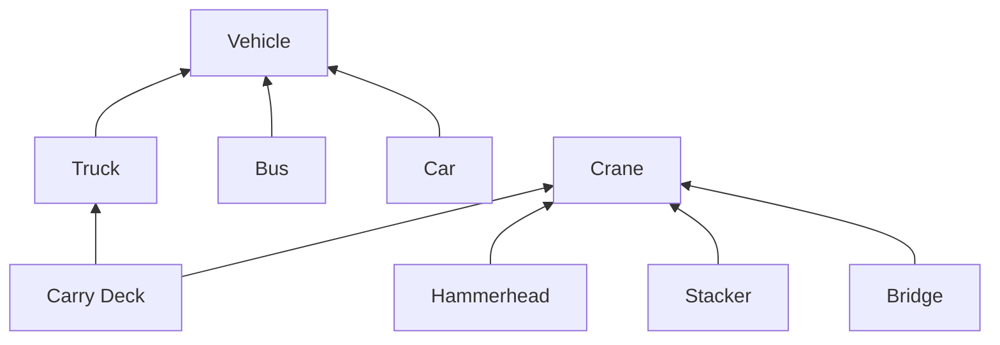
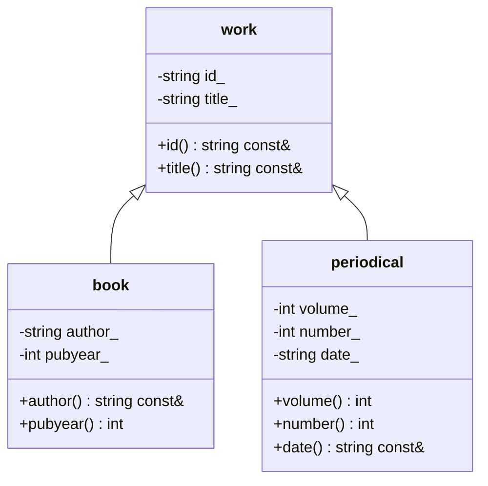

---

## lezione: 3 data: 2026-09-30 argomenti: [libro di testo, classi e oggetti, ereditarietà, relazioni d'ordine, DAG e alberi, ereditarietà multipla, principio di sostituzione di Liskov, polimorfismo, classi derivate in C++, default e delete, class e struct, costruttori e distruttori, passaggio per valore e per riferimento]

---
# Lezione 3 — Programmazione orientata agli oggetti: l'ereditarietà in C++

Nelle prime settimane il corso alterna due tipi di lezione: quella del mercoledì è dedicata al C++, quella del giovedì all'informatica teorica. Questa è la prima lezione di C++. Le lezioni di programmazione hanno un **obiettivo minimo** dichiarato: fornire tutto ciò che serve per realizzare bene il progetto, cioè l'interprete. Le slide essenziali, circa sei lezioni, sono già pubblicate. Se avanzerà tempo, il docente ha in serbo altri argomenti, non necessari per il progetto. Più avanti non si parlerà solo di programmazione ma anche di **progettazione**.

Il docente sottolinea che tutto ciò che si vede in queste lezioni si trasferisce direttamente nell'interprete: non ci sono argomenti di contorno. L'ereditarietà, in particolare, servirà a gestire le strutture dati del progetto.

## Il libro di testo e il metodo di studio

Le slide di C++ sono tratte dal libro di Ray Lischner, _Exploring C++20_ [@lischner2020], di cui riprendono esempi e filo del discorso. Il libro è in inglese, e per questo anche le slide lo sono; la lezione si svolge in italiano. Il docente lo ha messo a disposizione su AulaWeb per uso personale, da non diffondere, e lo presenta come il sostituto del «docente di cattedra» di un tempo. Un tempo c'erano un professore che teneva la teoria e un assistente che svolgeva gli esercizi; oggi c'è un solo docente, e il libro ne colma le lacune.

Il libro non è diviso in capitoli ma in _explorations_, ciascuna dedicata a un concetto; in tutto sono una settantina. Il corso parte dall'**Exploration 37**, cioè circa da metà libro, perché le prime 36 trattano argomenti in gran parte già visti a Fondamenti di Informatica. Alcune verranno riprese con dei «flashback»: per esempio quella sulle funzioni anonime e quella sulle mappe, che servono per le tabelle dei simboli. Il docente raccomanda comunque con insistenza di rileggere le prime 36 explorations. Il libro segue lo standard C++20, mentre a Fondamenti si è probabilmente usato un C++ più classico, e alcune cose potrebbero essere nuove o fatte in modo diverso. Nulla vieta, inoltre, di leggere in anticipo anche le explorations che verranno trattate a lezione, o quelle che il corso non riuscirà a coprire.

Il docente aggiunge un'opinione personale sulla didattica: il C++ è uno dei linguaggi più difficili con cui imparare a programmare, e in altri corsi di laurea si usa Python, molto più gentile per un'introduzione. Per un'applicazione di grandi dimensioni, invece, sceglierebbe il C++, Rust o Java, ma non Python.

Il docente invita anche a usare il codice delle slide come test personale. Chi ha seguito Fondamenti di Informatica dovrebbe capirlo quasi tutto. Le parti nuove vengono spiegate a lezione; se invece risultano oscure parti che dovrebbero essere note, vanno recuperate da soli, a partire dalle explorations iniziali del libro.

## Classi, oggetti, attributi e metodi

L'Exploration 37 parte da una domanda: quali sono le somiglianze e le differenze tra un libro e una rivista? La programmazione orientata agli oggetti (_object-oriented programming_, OOP) risponde rappresentando libri e riviste come **classi**. Una classe descrive gli attributi e le azioni comuni a tutti gli oggetti di quel tipo. Un **oggetto** è un'_istanza_ della classe, cioè un esemplare concreto. Esiste una sola classe libro, ma molti oggetti libro.

Il rapporto tra classe e oggetto ricalca quello tra tipo e variabile nella programmazione tradizionale: come `int` è un tipo e una variabile intera ne è un esemplare, così una classe è l'analogo di un tipo e un oggetto è una variabile di quella classe.

Gli **attributi** (in inglese _attributes_ o _fields_, in italiano anche campi) descrivono le caratteristiche dell'oggetto. Una classe persona, per esempio, avrà nome, cognome e data di nascita. I valori contenuti negli attributi costituiscono lo **stato** dell'oggetto: in un database corrisponderebbero ai campi di un record. I **metodi** (_actions_) sono le funzioni definite nella classe. Descrivono il **comportamento** dell'oggetto, cioè come agisce o come si interagisce con esso, e possono modificarne lo stato. Nella classe persona un metodo potrebbe impostare il nome.

Il discorso si fa più interessante quando una classe realizza una struttura dati, come uno stack, una lista o un vettore. In quel caso gli attributi contengono la struttura interna usata per memorizzare i dati, e i metodi sono le operazioni per accedervi: aggiungere, togliere o cercare un elemento.

## L'ereditarietà

### L'idea

Fin qui nulla di nuovo rispetto a Fondamenti. Il passo successivo è ragionare sulla **gerarchia** che esiste tra classi simili. Come libri e riviste, le classi hanno elementi distintivi ma anche elementi in comune.

L'esempio classico è la tassonomia naturalistica. Gli animali si dividono grossolanamente in mammiferi e uccelli. I mammiferi si specializzano a loro volta, per esempio in carnivori e ungulati, e così via: scendendo nella gerarchia la specializzazione cresce. Un gatto domestico non è un leone, ma i due si somigliano: sono entrambi felini, carnivori e mammiferi. Il comportamento sociale di un gatto e quello di un leone differiscono, ma alcuni attributi e comportamenti si ritrovano in entrambi.

> [!important] Definizione: ereditarietà Nella programmazione orientata agli oggetti, se una classe $A$ **deriva** (o **eredita**) da una classe $B$, allora $A$ possiede **almeno** tutti i comportamenti (metodi) e gli attributi (campi) di $B$.

La parola «almeno» è essenziale: la classe derivata può aggiungere attributi e metodi propri, ma non può perdere quelli della classe da cui deriva.

Un esempio informatico è il **contenitore** (_container_): qualunque struttura in cui si possano inserire dati, cercarli e cancellarli. Una lista è un modo di realizzare un contenitore, e così un vettore. Anche una stringa lo è, ma può contenere solo caratteri, mentre un contenitore in generale può contenere dati di qualunque tipo. Dire che una classe è un contenitore significa garantire che possiede almeno i metodi per inserire, togliere e cercare. Definendo queste operazioni nella classe contenitore, si stabilisce che tutte le classi che ne derivano le possiedono.

Per descrivere la relazione esistono più espressioni, che il corso userà come sinonimi:

|Espressione|Significato|
|---|---|
|$A$ è derivata da $B$ / $A$ eredita da $B$|$A$ ha almeno gli attributi e i metodi di $B$|
|$A$ è una **sottoclasse** di $B$|$A$ è la classe più specifica|
|$B$ è la **superclasse** (o classe base) di $A$|$B$ è la classe più generale|
|$A$ è una **specializzazione** di $B$|$A$ restringe e arricchisce $B$|

### L'ereditarietà come relazione

L'ereditarietà è una **relazione** tra classi, e quindi tra tutti gli oggetti di quelle classi. Il docente richiama le proprietà con cui si classificano le relazioni, viste nei corsi del primo anno. Data una relazione $R$ su un insieme $S$, cioè un sottoinsieme $R \subseteq S \times S$, si scrive $a,R,b$ per indicare che la coppia $(a, b)$ appartiene a $R$. La relazione si dice:

- **riflessiva** se $a,R,a$ per ogni $a \in S$;
- **simmetrica** se $a,R,b$ implica $b,R,a$;
- **antisimmetrica** se $a,R,b$ e $b,R,a$ insieme implicano $a = b$;
- **transitiva** se $a,R,b$ e $b,R,c$ implicano $a,R,c$.

Gli esempi discussi in aula riguardano i numeri naturali. L'**uguaglianza** è riflessiva ($a = a$), simmetrica (se $a = b$ allora $b = a$) e transitiva (se $a = b$ e $b = c$ allora $a = c$). La relazione **maggiore o uguale** ($\geq$) è riflessiva e transitiva ma non simmetrica: $5 \geq 3$, ma non $3 \geq 5$. È invece antisimmetrica: $a \geq b$ e $b \geq a$ possono valere insieme solo se $a = b$.

> [!warning] Discrepanza negli appunti manuali Negli appunti scritti a mano si legge «antisimmetrica: un'uguaglianza che sia riflessiva, transitiva, ma non vere entrambe». La formulazione va corretta. Antisimmetria significa che $a,R,b$ e $b,R,a$ non possono valere insieme se non quando $a = b$. L'esempio della relazione riflessiva e transitiva ma non simmetrica è $\geq$, non una forma di uguaglianza.

L'ereditarietà soddisfa due di queste proprietà, come riportano le slide:

- è **antisimmetrica**: se $A$ eredita da $B$, allora $B$ non può ereditare da $A$, cioè non possono esserci circolarità;
- è **transitiva**: se $A$ eredita da $B$ e $C$ eredita da $A$, allora $C$ eredita da $B$. Se il leone è un mammifero e il mammifero è un animale, il leone è un animale.

> [!tip] Approfondimento — Ordine parziale e ordine stretto #approfondimento Le slide affermano che l'ereditarietà definisce un **ordine parziale**. In senso tecnico, un ordine parziale è una relazione riflessiva, antisimmetrica e transitiva, come $\geq$ o l'inclusione tra insiemi. L'ereditarietà propriamente detta non è riflessiva, perché una classe non eredita da sé stessa: è **irriflessiva** e transitiva, cioè un ordine parziale **stretto**, come $>$. Da irriflessività e transitività segue anche l'**asimmetria**: $A$ eredita da $B$ e $B$ eredita da $A$ non possono mai valere insieme, perché per transitività $A$ erediterebbe da sé stessa. Per ottenere un ordine parziale in senso tecnico basta considerare la relazione «$A$ coincide con $B$ oppure eredita da $B$». La differenza è la stessa che passa tra $>$ e $\geq$ e non cambia nulla di quanto detto a lezione.

### Gerarchie di classi: DAG e alberi

Le gerarchie di classi si rappresentano come **grafi**. Dal punto di vista algebrico, un grafo è un insieme di **nodi** e un insieme di coppie di nodi, dette **archi**. Graficamente è il solito diagramma di cerchi o rettangoli collegati da frecce, già incontrato per esempio negli schemi dei circuiti digitali o nei diagrammi a blocchi di Teoria dei Sistemi. I grafi sono pervasivi in informatica e torneranno nel secondo semestre.

Un grafo è **diretto** se gli archi hanno un verso, cioè sono frecce da un nodo a un altro, e **aciclico** se non contiene cicli. Un grafo diretto aciclico si chiama **DAG** (_Directed Acyclic Graph_). Le gerarchie di ereditarietà sono DAG: le frecce vanno dalla sottoclasse alla superclasse, e l'antisimmetria esclude i cicli.

L'esempio delle slide considera due famiglie di classi. I **veicoli** comprendono automobili, autobus e autocarri; le **gru** comprendono gru a ponte, gru impilatrici (_stacker_) e gru a torre (_hammerhead_). L'**autogru** (_carry deck_) è sia un veicolo, perché ha cabina di guida, ruote, sterzo e un motore per spostarsi, sia una gru, perché ha braccio, paranco e motori o sistemi idraulici per sollevare i carichi. Nelle slide l'autogru eredita dagli autocarri e dalle gru.



Una classe che eredita da più classi distinte realizza l'**ereditarietà multipla**. Se la si vieta, ogni classe ha al più una superclasse diretta e la gerarchia diventa un **albero**. In informatica un albero è un grafo particolare che si disegna con la radice in alto, come l'albero delle cartelle di un file system, con la directory principale (_root_) in cima e le sottocartelle sotto. Il C++ consente l'ereditarietà multipla; Java no, almeno per le classi (la consente per le interfacce, un argomento che il corso non tratta).

L'ereditarietà si può vedere anche come una relazione tra **insiemi**. I veicoli formano un insieme, gli autocarri ne sono un sottoinsieme, e le autogru sono un sottoinsieme sia degli autocarri sia delle gru. Per questo la relazione di ereditarietà si chiama anche relazione **is-a** («è un»): un'autogru _è un_ veicolo, _è un_ autocarro ed _è una_ gru.

### Il principio di sostituzione di Liskov

Il principio alla base della buona programmazione orientata agli oggetti si deve a Barbara Liskov e Jeannette Wing.

> [!important] Principio di sostituzione di Liskov Se $A$ eredita da $B$, qualunque porzione di codice che lavora con istanze di $B$ deve funzionare allo stesso modo con istanze di $A$. In altre parole, gli oggetti della classe base possono sempre essere sostituiti con oggetti delle classi derivate.

La condizione riguarda il codice scritto **bene** in stile orientato agli oggetti. Il C++ supporta questo stile, ma nulla impedisce di scrivere in C++ programmi che non hanno nulla di orientato agli oggetti. Se il codice fa appello soltanto ai metodi della superclasse, al posto di un oggetto della superclasse si può mettere un oggetto di qualunque sottoclasse, e tutti gli oggetti delle sottoclassi vengono trattati in modo indifferente.

L'esempio del docente è quello dei programmi di disegno di diagrammi, come PowerPoint o Visio. Si immagini una classe generale _shape_ (forma) con un'azione `draw` che disegna la forma sullo schermo. L'applicazione deve ridisegnare le forme continuamente: quando si chiude e si riapre la finestra (dietro le quinte il contenuto grafico sparisce e va ridisegnato), quando si riorganizza il diagramma, quando si copia e incolla una selezione. Le forme concrete sono cerchi, rettangoli, frecce e così via, tutte sottoclassi di _shape_. Se l'applicazione tiene una lista $L$ delle forme presenti sullo schermo, ridisegnarle tutte significa scorrere la lista e chiamare `draw` su ciascun elemento:

```pseudo
per ogni forma s nella lista L:
    s.draw()        // ogni forma sa disegnarsi a modo suo
```

Non importa se $s$ è un cerchio, un rettangolo o una freccia. `draw` esiste nella classe base, quindi esiste in tutte le sottoclassi; ciascuna lo realizza a modo suo, ma tutte lo possiedono. In termini informatici, **ogni oggetto sa come disegnarsi**. Senza ereditarietà occorrerebbe tenere traccia del tipo di ogni forma e scrivere una catena di condizioni: se è un rettangolo disegnalo come rettangolo, se è una freccia disegnala come freccia, e così via.

Il vantaggio diventa evidente quando si aggiunge una nuova forma, anche una forma di fantasia. Se la nuova classe deriva da _shape_, possiede `draw`, e il ciclo precedente funziona senza modifiche. Il codice diventa **facilmente estensibile, più manutenibile e meno soggetto a errori**.

Il principio si applica a ciò che è definito nella superclasse. Le sottoclassi hanno anche metodi specifici: la freccia avrà un metodo per impostare il punto iniziale e quello finale, il rettangolo per impostare centro, base e altezza, il cerchio per impostare centro e raggio. Questi metodi non si possono chiamare attraverso l'interfaccia di _shape_; il problema si può gestire con i _design pattern_, che verranno visti più avanti.

> [!warning] Anticipazione Il meccanismo del ciclo su `draw` è l'obiettivo, ma in C++ non funziona automaticamente. Ridefinire un metodo con lo stesso nome nella sottoclasse non basta (si veda la sezione [[#Funzioni membro ereditate e visibilità]]): servono le **funzioni virtuali** e l'accesso agli oggetti tramite riferimenti o puntatori, argomento dell'Exploration 39 e della prossima lezione di C++.

> [!tip] Approfondimento — La formulazione di Liskov e Wing #approfondimento Il principio prende il nome da Barbara Liskov, vincitrice del premio Turing, e la formulazione più citata è quella dell'articolo scritto con Jeannette Wing nel 1994 [@liskov1994]. Il requisito di sottotipo vi è enunciato così: se $\varphi(x)$ è una proprietà dimostrabile per gli oggetti $x$ di tipo $T$, allora $\varphi(y)$ deve essere vera per gli oggetti $y$ di tipo $S$, quando $S$ è un sottotipo di $T$. La formulazione mette in luce che il principio riguarda il **comportamento** e non solo la sintassi. Non basta che la sottoclasse abbia i metodi con gli stessi nomi: deve anche rispettarne il significato. Il collegamento con le dimostrazioni, tema centrale del corso, è diretto.

Il docente inquadra l'OOP nella storia della programmazione. Si è partiti dall'assembly e dal cosiddetto _spaghetti code_, il codice con salti incontrollati. Poi è venuta la programmazione modulare basata sulle funzioni, come nel C, e quindi i **moduli**, che raccolgono funzionalità correlate: ogni `#include` di `<cstdio>` o `<vector>` importa un modulo con compiti ben precisi. Infine si è voluto lavorare con oggetti. Molti software moderni sono organizzati così. Nelle librerie per interfacce grafiche tutto è un _widget_ (bottone, finestra, area di disegno) e i widget si compongono. Le librerie di _machine learning_ come PyTorch o TensorFlow trattano una rete neurale come un insieme di oggetti: cambiando l'architettura della rete, il codice per l'addestramento resta lo stesso. La _Standard Template Library_ (STL) del C++, quella di `vector`, è costruita con template, oggetti e classi derivate. Scrivere un buon programma orientato agli oggetti non è però immediato: richiede riflessione, e il primo programma che si scrive raramente ha già queste caratteristiche.

### Polimorfismo

A Fondamenti, con i template, si è visto quello che si può chiamare **polimorfismo statico**. Con lo stesso template si può creare un vettore, uno stack o una lista di interi, di stringhe o di altri stack, ma la scelta avviene **a tempo di compilazione**: il compilatore guarda come è stato istanziato il template e genera il codice corrispondente.

Qui interessa invece il **polimorfismo dinamico**, detto anche **polimorfismo di sottotipo** (_subtype polymorphism_).

> [!important] Polimorfismo di sottotipo Un oggetto di una classe base è **polimorfo**: può «trasformarsi» in un oggetto di una qualunque delle sue sottoclassi. Un oggetto di classe _mammifero_ può contenere un cane, un gatto o una persona, ma non una roccia, un albero o un uccello. In C++ una variabile di tipo classe base $B$ può riferirsi a un oggetto di classe $B$ o a un oggetto di un qualunque tipo derivato da $B$.

Le slide avvertono che in C++ questo meccanismo ha delle **limitazioni**. Il motivo, spiega il docente, è che Bjarne Stroustrup, il creatore del C++, ha spesso privilegiato l'efficienza rispetto all'eleganza. Ciò che in Java avviene automaticamente, in C++ va richiesto esplicitamente, e le prossime lezioni mostreranno come.

> [!tip] Approfondimento — Il principio di zero overhead #approfondimento La scelta di Stroustrup ha un nome preciso: il **principio di zero overhead**. Stroustrup lo formula in due parti: ciò che non si usa non si paga, e ciò che si usa non potrebbe essere scritto a mano in modo più efficiente [@stroustrup2012]. Per questo il polimorfismo dinamico, che ha un piccolo costo a ogni chiamata, in C++ non è attivo per default: va chiesto esplicitamente con le funzioni virtuali. In Java invece i metodi sono polimorfi per default e gli oggetti si manipolano sempre tramite riferimenti.

## L'ereditarietà in C++

L'Exploration 38 traduce questi concetti in codice. Il filo conduttore è di nuovo quello dei libri e delle riviste: una classe base `work` (opera) e due classi derivate, `book` (libro) e `periodical` (periodico).

### La classe base `work`

```cpp
#include <string>
#include <string_view>

class work {
  public:
    work() = default;
    work(work const& w) = default;
    work(std::string_view id, std::string_view title)
      : id_{id}, title_{title} {}
    std::string const& id() const { return id_; }
    std::string const& title() const { return title_; }
  private:
    std::string id_;
    std::string title_;
};
```

La classe ha una parte `private`, con due attributi, e una parte `public`, che costituisce l'**interfaccia**: i costruttori e i metodi. Ogni elemento di queste poche righe merita un commento.

**I costruttori.** Un costruttore è il metodo con lo stesso nome della classe, che inizializza l'oggetto. Ci sono tre costruttori:

1. il **costruttore di default**, `work()`, che non riceve argomenti;
2. il **costruttore di copia**, `work(work const& w)`, che crea un oggetto copiandone un altro. Il parametro è un **riferimento costante**: l'oggetto originale viene passato per riferimento, quindi senza copiarlo (efficiente), e non può essere modificato (sicuro);
3. un costruttore **personalizzato** (_custom_), che riceve identificativo e titolo e li assegna agli attributi tramite la **lista di inizializzazione dei membri**, introdotta dai due punti dopo la firma. Il corpo del costruttore è vuoto.

La parola chiave **`= default`** dopo i primi due costruttori è nuova rispetto a Fondamenti. Dice al compilatore che vanno bene il costruttore di default e quello di copia che genererebbe da solo. Si potrebbe obiettare che, senza scrivere nulla, il compilatore li genererebbe comunque. La differenza è di chiarezza: scrivendo `= default` il programmatore dichiara che la scelta è consapevole e che non si è dimenticato di quei costruttori. Il docente insisterà molto su questo punto: è sempre bene dichiarare esplicitamente che cosa si vuole fare dei vari costruttori. Al posto di `default` si possono scrivere anche altre cose, come si vedrà tra poco.

**L'inizializzazione con le graffe.** Gli attributi sono inizializzati con la sintassi `id_{id}`. Le graffe, che a Fondamenti si sono probabilmente usate solo per inizializzare gli array, si possono usare per qualunque tipo. È la forma di inizializzazione preferibile: si chiama inizializzazione uniforme (_uniform initialization_), e il docente la consiglia anche per ragioni di efficienza. Nel codice del corso verrà usata sempre.

> [!warning] Precisazione sullo standard A lezione si dice che l'inizializzazione con le graffe per tutti i tipi è disponibile «a partire dal C++20». In realtà la _list-initialization_ esiste dal **C++11** [@cppref-listinit]. Il libro usa il C++20, e la sintassi è valida a maggior ragione.

> [!tip] Approfondimento — Perché le graffe #approfondimento Oltre all'uniformità della sintassi, la ragione più concreta per preferire le graffe è che vietano le **conversioni di restringimento** (_narrowing conversions_), cioè le conversioni implicite che possono perdere informazione. Per esempio `int x{1.5};` non compila, perché convertire un `double` in `int` tronca la parte decimale, mentre `int x = 1.5;` compila e assegna silenziosamente 1 [@cppref-listinit]. L'errore emerge quindi a tempo di compilazione invece che durante l'esecuzione.

**`std::string_view`.** I parametri del costruttore personalizzato sono di tipo `std::string_view`, introdotto con lo standard C++17. È un oggetto leggero che dà accesso **in sola lettura** a una sequenza di caratteri, senza possederla né copiarla [@cppref-stringview]. È un'alternativa al passaggio di una `std::string const&`. Il libro usa `string_view`, ma il docente non dà indicazioni generali: a seconda dell'implementazione può convenire l'una o l'altra soluzione, e va valutato caso per caso.

**`std::string` invece di `char*`.** `std::string` è la classe della libreria standard per le stringhe, cioè sequenze indicizzate di caratteri. Offre costruttori, accesso agli elementi per indice, primo e ultimo carattere, lunghezza, test di stringa vuota, inserimento, cancellazione e concatenazione. I metodi si trovano nella documentazione online, e il docente non intende elencarli a lezione. Le stringhe in stile C (`char*`) e i puntatori torneranno utili in Sistemi Operativi, dove si programma in C. Nel progetto di questo corso conviene invece usare `std::string`, che è più facile da usare e più completa: dimenticare i `char*` qui vale «punti in più, non punti in meno».

**I metodi `const`.** I due metodi `id()` e `title()` restituiscono gli attributi. Il loro codice è banale, ma la firma contiene due usi di `const` con significati diversi.

Il `const` **dopo** il nome del metodo dichiara che il metodo non modifica lo stato dell'oggetto. Ne segue che il metodo si può chiamare anche su un oggetto dichiarato costante (`work const w{...};`). Se il metodo modificasse un attributo, il compilatore rifiuterebbe quel `const`. Vale anche il viceversa, ed è il motivo per cui conviene scriverlo: se il `const` mancasse, anche un metodo che di fatto non modifica nulla non si potrebbe chiamare su oggetti costanti, e dichiarare oggetti `work` costanti diventerebbe inutile.

Il `const&` **nel tipo restituito** è più sottile. Per capirlo, il docente esamina le due alternative.

- **Togliere `const` e lasciare `&`**, cioè restituire `std::string&`. Si restituirebbe un riferimento modificabile a un attributo privato, una specie di puntatore che permette di cambiarne il contenuto dall'esterno. Questo contraddice il `const` del metodo, che promette di non modificare l'oggetto, e il compilatore protesta. Con il compilatore GCC l'errore suona come «binding reference of type `std::string&` to `const std::string` discards qualifiers».
- **Togliere anche `&`**, cioè restituire `std::string`. Il codice compila, ma in C++ il valore restituito viene passato **per copia**: si crea un nuovo oggetto, magari temporaneo, chiamando il costruttore di copia. È un'operazione potenzialmente costosa, che alloca memoria. Se la stringa contenesse l'intera _Divina Commedia_, si copierebbe l'intera _Divina Commedia_ a ogni lettura del titolo.

Il riferimento costante risolve entrambi i problemi. Non viola l'**incapsulamento**, perché chi riceve il riferimento non può modificare l'attributo privato. È compatibile con il `const` del metodo, ed è efficiente, perché non chiama il costruttore di copia. È la stessa regola, già vista a Fondamenti, per cui un oggetto che una funzione non deve modificare va passato per riferimento costante. Il docente sottolinea che la regola vale **in ingresso e in uscita**.

Questa attenzione all'efficienza, osserva il docente, ha radici storiche. Quando il C++ è nato non c'erano gigabyte di memoria: i personal computer con MS-DOS lavoravano con 640 KB, meno di un file audio di oggi. Stroustrup ha quindi dovuto porsi il problema di non sprecare né memoria né tempo.

> [!important] Validità del riferimento restituito Un riferimento restituito in questo modo resta valido solo finché esiste l'oggetto a cui appartiene l'attributo. Se l'oggetto viene distrutto, il riferimento diventa «pendente» (_dangling_) e usarlo è un errore. Con gli oggetti automatici di questa lezione il problema non si pone, ma va tenuto presente.

**La convenzione sui nomi.** L'autore del libro distingue gli attributi da variabili e parametri con un trattino basso **finale** (`id_`, `title_`). Il trattino basso **iniziale** è invece pericoloso, perché coincide con lo schema di nomi che il compilatore e la libreria standard usano per i propri identificatori interni.

> [!tip] Approfondimento — Identificatori riservati #approfondimento Lo standard riserva all'implementazione gli identificatori che contengono un doppio trattino basso, quelli che iniziano con un trattino basso seguito da una lettera maiuscola e, nel namespace globale, tutti quelli che iniziano con un trattino basso. Un programma che li usa è mal formato, e il compilatore non è tenuto a segnalarlo [@cppref-identifiers]. Il suffisso `_` del libro evita il problema alla radice.

**Oggetti immutabili.** Gli attributi sono privati: dato un oggetto `w`, non si può scrivere `w.id_ = "..."`. Si possono leggere tramite i metodi di accesso, ma non esistono metodi per modificarli. Gli oggetti `work` sono quindi **immutabili**: una volta creati, il loro stato non cambia più. Ne segue una conseguenza curiosa: un oggetto creato con il costruttore di default resta per sempre con identificativo e titolo vuoti. Il costruttore di default, infatti, chiama il costruttore di default di `std::string`, che crea una stringa vuota. L'immutabilità è una **scelta di progetto**, non un obbligo, e si vedranno altri casi.

### Le classi derivate `book` e `periodical`

```cpp
class book : public work {
  public:
    book() : work{}, author_{}, pubyear_{} {}
    book(book const& b) = default;
    book(std::string_view id, std::string_view title,
         std::string_view author, int pubyear)
      : work{id, title}, author_{author}, pubyear_{pubyear} {}
    std::string const& author() const { return author_; }
    int pubyear() const { return pubyear_; }
  private:
    std::string author_;
    int pubyear_;
};
```

**La sintassi dell'ereditarietà.** Per dichiarare che `book` eredita da `work` si scrivono, dopo il nome della classe, i due punti e il nome della classe base, preceduto da un modificatore di accesso. I modificatori sono quelli già noti: `public`, `protected` e `private`. Con l'ereditarietà **pubblica** tutti gli attributi e i metodi pubblici di `work` sono pubblici anche in `book`. Un `book` ha quindi i metodi `id()` e `title()`, oltre ai propri `author()` e `pubyear()`.

**Il costruttore della classe derivata.** Il costruttore di default di `book` chiama esplicitamente il costruttore di `work`. Poi inizializza a vuoto la stringa `author_` e a zero l'anno di pubblicazione: le graffe vuote applicate a un `int` producono il valore 0. Il costruttore di copia è `= default`. Il costruttore personalizzato è la vera novità: per gli attributi ereditati **deve richiamare il costruttore della classe base** (`work{id, title}`) nella lista di inizializzazione. Solo dopo inizializza i propri attributi specifici. Anche gli oggetti `book` sono immutabili.

In sintesi, le novità sono due: la sintassi con cui si dichiara l'ereditarietà, e la chiamata al costruttore della classe base dal costruttore della classe derivata.

La classe `periodical` è «sorella» di `book`: deriva anch'essa da `work` e non introduce nulla di nuovo.

```cpp
class periodical : public work {
  public:
    periodical() : work{}, volume_{0}, number_{0}, date_{} {}
    periodical(periodical const& p) = default;
    periodical(std::string_view id, std::string_view title,
               int volume, int number, std::string_view date)
      : work{id, title}, volume_{volume}, number_{number}, date_{date} {}
    int volume() const { return volume_; }
    int number() const { return number_; }
    std::string const& date() const { return date_; }
  private:
    int volume_;
    int number_;
    std::string date_;
};
```

La gerarchia risultante è un DAG, e più precisamente un albero, con `work` come radice:



Il principio di sostituzione si vede già all'opera: una funzione scritta per `work` accetta anche un `book`.

```cpp
#include <iostream>

void stampa(work const& w) {
    std::cout << w.id() << " " << w.title() << "\n";
}

int main() {
    book const b{"0001", "Exploring C++20", "Lischner", 2020};
    stampa(b);                                   // un book dove serve un work
    std::cout << b.author() << " " << b.pubyear() << "\n";
}
```

### Ereditarietà pubblica e privata

Il docente avverte che, se si omette `public`, il codice compila lo stesso, ma per una classe dichiarata con `class` l'ereditarietà è **privata** per default. I membri pubblici della classe base diventano allora privati nella classe derivata: si possono usare dall'interno della classe derivata, ma non dall'esterno su un oggetto della classe derivata. Viene così a cadere il principio di sostituzione. Le slide 30 e 31, non proiettate in aula, approfondiscono proprio questo punto:

```cpp
class base {
  public:
    base(int v) : value_{v} {}
    int value() const { return value_; }
  private:
    int value_;
};

class derived : base {          // manca public: ereditarietà privata
  public:
    derived() : base{42} {}
};

int main() {
    base b{42};
    int x{b.value()};           // corretto
    derived d{};
    int y{d.value()};           // errore: value() è privato in derived
}
```

L'ultima riga non compila, perché `value()` è privato in `derived`. In generale l'ereditarietà è pubblica quando la classe derivata è dichiarata con `struct` oppure quando la classe base è preceduta da `public`, ed è privata quando la classe derivata è dichiarata con `class` oppure quando la base è preceduta da `private`. Con l'ereditarietà pubblica i membri della base mantengono nella classe derivata lo stesso livello di accesso. Di norma l'ereditarietà che interessa è quella pubblica.

### `class` e `struct`

La parola chiave `struct` esiste fin dal C, dove serviva ad aggregare informazioni eterogenee, come un record: solo dati, nessun metodo. Il C++ l'ha ereditata, e in C++ `struct` e `class` hanno quasi lo stesso significato. L'unica differenza è il livello di accesso di default: in una `class` attributi e metodi sono **privati** salvo indicazione contraria, in una `struct` sono **pubblici**. Lo stesso vale, come visto, per l'ereditarietà.

La convenzione suggerita è di usare `class`, a meno che l'oggetto serva solo a tenere insieme dati eterogenei senza esporre alcun «meccanismo». Una persona descritta solo dai dati anagrafici, senza metodi diversi dalla lettura e scrittura dei campi, si fa con una `struct`. Non servono metodi di accesso, e si risparmiano codice e tempo; e meno codice si scrive, meno errori si commettono. L'incapsulamento va usato quando serve. Anche se l'ambiente di sviluppo genera da solo i metodi di accesso, restano comunque codice in più da leggere.

L'incapsulamento serve invece quando l'oggetto ha un meccanismo interno da proteggere: una lista, uno stack, un albero. Si vuole che l'utente non veda la struttura interna e soprattutto che non ci faccia affidamento, perché in una versione successiva potrebbe cambiare. Il docente usa l'analogia della batteria. Chi la vende mostra i due morsetti, e dentro potrebbe esserci anche un criceto che corre sulla ruota: all'utente non deve importare. Chi costruisce un mantenitore di carica deve conoscere al più la tecnologia della batteria (AGM, litio, eccetera), perché la carica cambia a seconda della tecnologia; il resto dell'interno non gli serve. Così l'incapsulamento preserva il meccanismo interno e garantisce la **modularità**.

### `default`, `delete` e costruttori personalizzati

Per ciascun costruttore ci sono tre possibilità.

- **`= default`**: si accetta il comportamento predefinito del C++ per l'inizializzazione, qualunque esso sia, dichiarando che la scelta è voluta.
- **`= delete`**: si **elimina** il costruttore. Con `work() = delete;` l'inizializzazione di default non è più possibile, e per creare un oggetto bisogna usare un altro costruttore. Se non ce ne sono altri, la classe non si può istanziare affatto.
- **Codice esplicito**: si fornisce un'implementazione personalizzata.

Lo stesso vale per il costruttore di copia. Eliminandolo, per esempio per ragioni di efficienza, gli oggetti della classe non si potranno mai passare per copia ma solo per riferimento. Entrambe le forme, `= default` e `= delete`, sono disponibili dal C++11 [@cppref-function].

> [!warning] Precisazione: classi da usare solo come base A lezione si osserva che una classe di cui non si possono creare oggetti potrebbe servire come classe base pura. Va notato però che una classe i cui costruttori sono tutti eliminati non può fare nemmeno da classe base, perché il costruttore di una classe derivata deve poter chiamare un costruttore della base. Per impedire la creazione di oggetti di una classe permettendone la derivazione, il C++ offre le **classi astratte**, trattate nella seconda parte dello stesso pacchetto di slide (Exploration 39).

### Ordine di costruzione

Quando si costruisce un oggetto di una classe derivata, quali costruttori vengono chiamati, e in che ordine? L'esempio delle slide usa tre `struct` in catena:

```cpp
#include <iostream>

struct top {
    top() { std::cout << "top\n"; }
};
struct middle : public top {
    middle() { std::cout << "middle\n"; }
};
struct bottom : public middle {
    bottom() { std::cout << "bottom\n"; }
};

int main() {
    bottom d;
}
```

L'output è `top`, `middle`, `bottom`: la costruzione procede **dalla classe base verso la classe derivata**. È naturale: la parte della classe base, nell'esempio di prima gli attributi di `work`, è il nucleo comune su cui poggiano gli attributi aggiunti dalle classi derivate. È meglio che il codice non si affidi a questo ordine, ma l'ordine è garantito: se proprio serve, ci si può contare.

> [!important] Mai output nei costruttori La nota della slide è esplicita: l'esempio serve solo a mostrare l'ordine delle chiamate. Non si deve **mai** scrivere sullo standard output dentro un costruttore o un altro metodo, se non per un debug temporaneo, e anche in quel caso sono preferibili altri strumenti. Il docente scherza: se lo si facesse a un colloquio di lavoro citando le sue slide, il candidato non verrebbe assunto e il docente passerebbe per sprovveduto.

### Funzioni membro ereditate e visibilità

Una classe derivata eredita tutti i membri della classe base. Se $A$ eredita pubblicamente da $B$:

- gli oggetti di $A$ possiedono tutti i metodi e gli attributi pubblici di $B$;
- i metodi di $A$ possono chiamare qualunque metodo pubblico di $B$ e accedere ai suoi attributi pubblici;
- i metodi di $A$ **non** possono chiamare i metodi privati di $B$ né accedere ai suoi attributi privati: ciò che $B$ dichiara privato è inaccessibile anche alle sottoclassi.

Per un livello intermedio esiste la parola chiave **`protected`**. Un membro protetto non è accessibile a chi usa gli oggetti della classe, ma è accessibile alle classi che ne ereditano. `protected` definisce quindi un livello di visibilità intermedio tra `public` e `private`.

Infine, se $A$ definisce una funzione membro con lo stesso nome di una funzione di $B$, la funzione di $A$ **mette in ombra** (_shadows_) quella di $B$: le chiamate a quel nome sugli oggetti di $A$ si riferiscono alla definizione di $A$. Questo non realizza ancora il meccanismo polimorfo del ciclo su `draw`: se si accede all'oggetto come oggetto della classe base, viene chiamata la versione della base. Per il polimorfismo vero servono le funzioni virtuali.

> [!tip] Approfondimento — La messa in ombra nasconde tutti gli overload #approfondimento La regola ha una conseguenza che sorprende spesso: un nome dichiarato nella classe derivata nasconde **tutti** i membri con lo stesso nome della classe base, compresi gli overload con parametri diversi [@cppref-lookup]. Nell'esempio seguente `a.f(2.5)` chiama `A::f(int)`, convertendo 2.5 in 2, anche se in `B` esiste una versione per `double`:
> 
> ```cpp
> #include <iostream>
> struct B {
>     void f(int)    { std::cout << "B::f(int)\n"; }
>     void f(double) { std::cout << "B::f(double)\n"; }
> };
> struct A : B {
>     void f(int)    { std::cout << "A::f(int)\n"; }
> };
> int main() {
>     A a;
>     a.f(1);       // A::f(int)
>     a.f(2.5);     // A::f(int): B::f(double) è nascosta
>     a.B::f(2.5);  // B::f(double): chiamata qualificata
> }
> ```
> 
> Per riportare in visibilità gli overload della base si scrive `using B::f;` dentro `A`.

### Oggetti automatici e distruttori

Ogni oggetto ha una **durata di vita** (_life span_), dalla costruzione alla distruzione. Finora si sono considerati solo **oggetti automatici**, cioè oggetti allocati nell'ambito di visibilità (_scope_) in cui sono dichiarati. Un oggetto automatico inizia a vivere quando l'esecuzione raggiunge la sua dichiarazione, e in quel momento viene chiamato il costruttore. Smette di vivere quando termina lo scope in cui è dichiarato, per esempio all'uscita dalla funzione, e in quel momento viene chiamato il **distruttore**. Il distruttore è un metodo che si può definire per eseguire operazioni di pulizia.

Con l'ereditarietà, i distruttori vengono chiamati nell'ordine **inverso** a quello dei costruttori:

```cpp
#include <iostream>

struct top {
    top()  { std::cout << "top\n"; }
    ~top() { std::cout << "~top\n"; }
};
struct middle : public top {
    middle()  { std::cout << "middle\n"; }
    ~middle() { std::cout << "~middle\n"; }
};
struct bottom : public middle {
    bottom()  { std::cout << "bottom\n"; }
    ~bottom() { std::cout << "~bottom\n"; }
};

int main() {
    bottom d;
}
```

L'output è `top`, `middle`, `bottom`, `~bottom`, `~middle`, `~top`. L'immagine del docente è quella di un edificio: si costruisce dalle fondamenta al tetto e si demolisce dal tetto alle fondamenta. Anche qui vale l'avvertenza di non scrivere output nei distruttori.

### Costruttori, distruttori e passaggio dei parametri

L'ultimo esempio della lezione è volutamente artificiale. Serve a capire **quando** vengono chiamati costruttori e distruttori, e la differenza tra **passaggio per valore** e **passaggio per riferimento**, in presenza di ereditarietà. La classe `base` contiene un valore numerico e un metodo per incrementarlo; la classe `derived` non aggiunge metodi. Tre funzioni esterne alle due classi creano un `derived`, incrementano un `base` passato per valore e incrementano un `base` passato per riferimento. Come nota il docente, l'esempio è pieno di output nei costruttori che in un programma vero non dovrebbero esserci.

```cpp
#include <iostream>

class base {
  public:
    base(int value) : value_{value} {
        std::cout << "base(" << value << ")\n";
    }
    base() : base{0} { std::cout << "base()\n"; }      // delega a base(int)
    base(base const& copy) : value_{copy.value_} {     // copia personalizzata
        std::cout << "copy base(" << value_ << ")\n";
    }
    ~base() { std::cout << "~base(" << value_ << ")\n"; }
    int value() const { return value_; }
    base& operator++() { ++value_; return *this; }     // overloading di ++
  private:
    int value_;
};

class derived : public base {
  public:
    derived(int value) : base{value} {
        std::cout << "derived(" << value << ")\n";
    }
    derived() : base{} { std::cout << "derived()\n"; }
    derived(derived const& copy) : base{copy} {        // riusa la copia di base
        std::cout << "copy derived(" << value() << ")\n";
    }
    ~derived() { std::cout << "~derived(" << value() << ")\n"; }
};

derived make_derived() { return derived{42}; }
base increment(base b) { ++b; return b; }              // per valore
void increment_reference(base& b) { ++b; }             // per riferimento
```

Alcuni dettagli del codice meritano attenzione.

- Il costruttore di default di `base` **delega** al costruttore con parametro: `base() : base{0}` esegue prima `base(0)` e poi il proprio corpo.
- L'operatore di pre-incremento `++` è ridefinito (_operator overloading_, già visto a Fondamenti). Il docente sottolinea che va scritto proprio così: restituisce un **riferimento all'oggetto stesso** (`*this`), perché il risultato potrebbe essere a sua volta oggetto di ulteriori incrementi, come in `++(++b)`.
- Il costruttore di copia di `derived` riusa quello di `base`, passandogli l'oggetto `copy`: un `derived` si può passare dove è atteso un riferimento a `base`.

> [!warning] Discrepanze nel codice delle slide Nelle slide 19 e 22 alcune stringhe sono racchiuse tra virgolette tipografiche (“top\n"), probabilmente inserite automaticamente da PowerPoint. Non sono valide in C++ e vanno sostituite con le virgolette dritte, come nel codice di questa nota. Nella slide 25, inoltre, la stringa stampata dal costruttore di copia di `derived` non chiude la parentesi («`copy derived(` ... `\n`»). Qui è corretta; nell'esecuzione dell'esempio quel costruttore non viene comunque mai chiamato.

Il programma principale e il suo output sono i seguenti:

```cpp
int main() {
    derived d{make_derived()};
    base b{increment(d)};
    increment_reference(d);
    increment_reference(b);
    derived a(d.value() + b.value());
}
```

|Istruzione|Output|Spiegazione|
|---|---|---|
|`derived d{make_derived()};`|`base(42)`<br>`derived(42)`|costruzione di un `derived`: prima la parte `base`, poi la parte `derived`. Nessuna copia (si veda l'approfondimento)|
|`base b{increment(d)};`|`copy base(42)`|`d` è passato **per valore** a un parametro di tipo `base`: si copia la sola parte `base` di `d`|
||`copy base(43)`|il parametro, incrementato a 43, viene restituito **per valore**: nuova copia, che diventa `b`|
||`~base(43)`|il parametro della funzione viene distrutto|
|`increment_reference(d);`|nessuno|passaggio per riferimento: nessun oggetto creato; `d` vale ora 43|
|`increment_reference(b);`|nessuno|`b` vale ora 44|
|`derived a(d.value() + b.value());`|`base(87)`<br>`derived(87)`|$43 + 44 = 87$|
|fine di `main`|`~derived(87)`<br>`~base(87)`|distruzione di `a`, l'ultimo oggetto creato|
||`~base(44)`|distruzione di `b`|
||`~derived(43)`<br>`~base(43)`|distruzione di `d`, il primo oggetto creato|

Le osservazioni del docente sono tre.

La prima riguarda il **passaggio per valore**. Passare `d` a `increment` per valore scatena una chiamata al costruttore di copia in ingresso, una in uscita e un distruttore. Il passaggio per riferimento a `increment_reference` non provoca alcuna chiamata. Gli oggetti locali vengono distrutti in ordine inverso rispetto alla loro creazione: prima `a`, poi `b`, infine `d`.

La seconda riguarda il **polimorfismo**. In entrambe le chiamate a `increment_reference` si è passato una volta un `derived` e una volta un `base`, e tutto ha funzionato perché si è usato un **riferimento**. Il polimorfismo, cioè la possibilità di usare gli oggetti derivati come se fossero della classe base, in C++ funziona solo tramite **riferimenti o puntatori**. Con gli oggetti passati per valore non funziona, e la ragione è ancora l'efficienza. In Java questa distinzione non esiste, perché tutti gli oggetti sono manipolati tramite riferimenti. Il tema verrà ripreso nella prossima lezione di C++.

La terza riguarda le **prestazioni**. Con l'ereditarietà le inefficienze del passaggio per valore si moltiplicano: ogni copia di un oggetto derivato coinvolge i costruttori di copia e i distruttori di tutti i livelli della gerarchia. Qui i livelli erano due; con tre, quattro o cinque livelli le chiamate crescono. Ogni chiamata di funzione ha un costo in tempo e in carico per il processore, come si vedrà anche in Sistemi Operativi, salvo che il compilatore la espanda in linea (_inline_). L'indicazione del docente è pragmatica. In prima battuta conviene scrivere codice chiaro, appoggiandosi agli oggetti della STL, che sono progettati bene e hanno tutti i costruttori necessari. In fase di ottimizzazione, quando si cercano le prestazioni, questi sono i punti a cui fare attenzione.

> [!tip] Approfondimento — Perché `make_derived` non produce copie #approfondimento Si potrebbe pensare che `make_derived` costruisca un `derived` temporaneo e che `d` ne sia poi una copia. Dal C++17, invece, quando un oggetto viene inizializzato con un valore temporaneo dello stesso tipo, come quello restituito da `return derived{42};`, l'elisione della copia è **obbligatoria**. L'oggetto viene costruito direttamente nella sua destinazione finale [@cppref-elision]. Per confronto, si può compilare lo stesso programma con GCC in modalità C++14 e con l'opzione `-fno-elide-constructors`, che disattiva le elisioni allora facoltative. L'output si allunga: per `make_derived` compaiono due serie in più di `copy base(42)`, `copy derived(42)`, `~derived(42)` e `~base(42)`, e per `increment` una copia in più del valore restituito.
> 
> Diverso è il caso di `return b;` in `increment`. Lì `b` è un **parametro** della funzione, e per i parametri l'elisione non è ammessa [@cppref-elision]. Per questo compare `copy base(43)`.

> [!tip] Approfondimento — Lo _slicing_ #approfondimento Nella chiamata `increment(d)` il parametro è di tipo `base`, e il costruttore di copia di `base` copia soltanto la parte `base` di `d`: la parte specifica di `derived` va persa. Il fenomeno si chiama **slicing** («affettamento»), ed è la ragione concreta per cui il polimorfismo richiede riferimenti o puntatori. Le slide 45 e 46 dello stesso pacchetto («References and slices») lo trattano in dettaglio.

## In sintesi

L'ereditarietà permette di organizzare le classi in gerarchie: una sottoclasse possiede almeno gli attributi e i metodi della superclasse e può aggiungerne di propri. Come relazione è antisimmetrica e transitiva, quindi le gerarchie sono DAG, o alberi se l'ereditarietà multipla è vietata. Il principio di sostituzione di Liskov chiede che il codice scritto per una classe funzioni con tutte le sue sottoclassi. È ciò che rende estensibile il codice orientato agli oggetti, ed è alla base del polimorfismo di sottotipo, che in C++ richiede però funzioni virtuali e riferimenti o puntatori.

In C++ l'ereditarietà si dichiara con `class derivata : public base`, e il costruttore della classe derivata deve chiamare quello della classe base. I costruttori si dichiarano esplicitamente con `= default`, `= delete` o con codice proprio. La costruzione procede dalla base alla classe derivata, la distruzione all'inverso. I membri privati della base restano inaccessibili alle sottoclassi, quelli protetti no, e un metodo con lo stesso nome nella sottoclasse mette in ombra quello della base. Infine, il passaggio per valore copia e distrugge oggetti a ogni livello della gerarchia, mentre il passaggio per riferimento non crea oggetti. La prossima lezione di C++ affronterà le funzioni virtuali (Exploration 39).