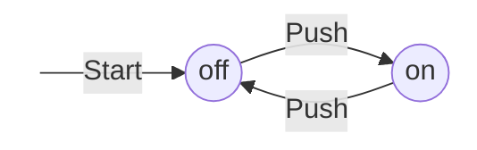
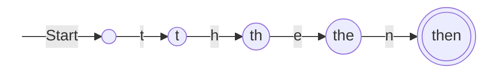
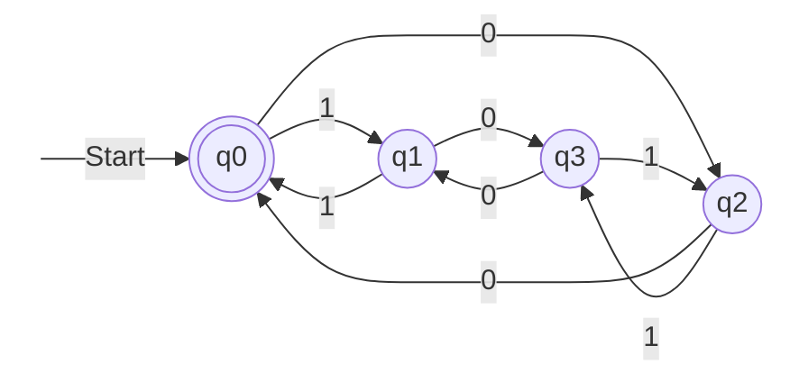
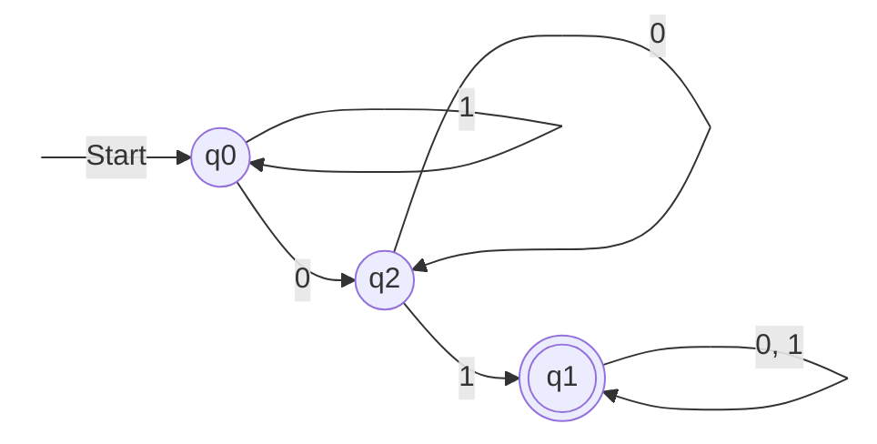
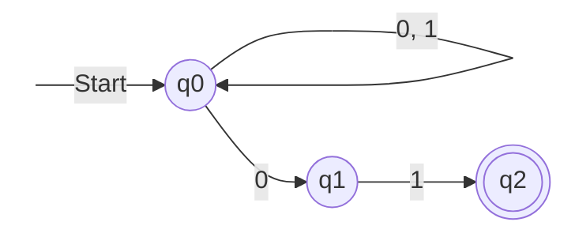

---

## lezione: 4 data: 2026-10-01 argomenti: [correzione delle leggi algebriche, dimostrazioni, regole deduttive, quantificatori, dimostrazione per assurdo, controesempio, induzione matematica, definizioni ricorsive, induzione strutturale, linguaggi regolari, automi a stati finiti deterministici, funzione di transizione estesa, determinismo, automi a stati finiti non deterministici]

---
# Lezione 4 — Tecniche deduttive e automi a stati finiti

La lezione di teoria riprende dove si era fermata la [[Zen/Anno 2/Algoritmi e Computazione/generated/Lezione 2 - CLAUDE|Lezione 2 - CLAUDE]] e si articola in tre parti. Si apre con la correzione di un errore nelle slide sulle leggi algebriche dei linguaggi. Segue la terza sezione delle slide _Argomenti preliminari_ (slide 15–32), dedicata alle **tecniche deduttive**, che nella lezione 2 era stata saltata. Infine inizia il primo blocco vero e proprio di informatica teorica, i **linguaggi regolari** (slide 1–18 del pacchetto _Linguaggi regolari_): automi a stati finiti deterministici e non deterministici.

## Una correzione alle slide: l'elemento assorbente

Il docente segnala che sul sito del corso c'è una versione aggiornata delle slide _Argomenti preliminari_. Nella versione proiettata in aula durante la lezione 2, la legge sull'elemento assorbente diceva che concatenare l'insieme vuoto con un linguaggio restituisce il linguaggio stesso ($\emptyset L = L\emptyset = L$). È un errore. La concatenazione è definita da una congiunzione: una stringa $w$ appartiene a $LM$ se il suo prefisso $x$ sta in $L$ **e** il suo suffisso $y$ sta in $M$. Se uno dei due linguaggi è vuoto, la seconda condizione non può mai essere soddisfatta, e il risultato è l'insieme vuoto:

$$ \emptyset L = L \emptyset = \emptyset . $$

La dimostrazione completa è nella nota della lezione 2. La copia delle slide allegata al materiale di questa lezione riporta già la versione corretta.

Il docente ricorda che il materiale del corso è in fase di definizione, perché questo è il primo anno del corso nella forma attuale, e che qualche errore («glitch») è inevitabile. Alla fine di ogni semestre il materiale sarà completo e corretto. Nel frattempo chiede agli studenti di segnalare gli errori che individuano, in aula o per email.

## Perché le dimostrazioni

Prima di affrontare le tecniche deduttive, il docente chiarisce il loro peso nel corso. Una buona parte del corso consiste in dimostrazioni. Nelle due o tre domande di ciascuno scritto verrà chiesto quasi sempre di dimostrare qualcosa: per esempio di costruire un oggetto, come un automa, e poi di dimostrare che è effettivamente ciò che si voleva costruire.

Le dimostrazioni, insiste il docente, non sono «roba da matematici»: sono roba da ingegneri. Oggi un assistente di intelligenza artificiale scrive codice, e chi non sa né programmare bene né dimostrare rischia di essere inutile. Inoltre un enunciato senza dimostrazione resta «appeso», affidato soltanto alla memoria; con la dimostrazione si capisce perché è vero. Molto di ciò che segue dovrebbe essere già noto dalle superiori e dai corsi di Analisi e Geometria, e va inteso come ripasso.

## Tecniche deduttive

### Enunciati, ipotesi e regole

Un **enunciato** è un'affermazione che può essere vera o falsa. Anche un enunciato falso resta un enunciato. «Tutti i numeri naturali dispari sono primi» è falso, ma anche la sua falsità va dimostrata. In aula la dimostrazione è stata costruita insieme agli studenti: 3, 5 e 7 sono primi, ma 9 è dispari e non è primo. Esiste quindi almeno un numero dispari che non è primo, e l'enunciato è falso. Si sarebbero potuti scegliere anche 15 o 33. Si tratta di un teorema a tutti gli effetti, dimostrato esibendo un esempio contrario.

Altri enunciati sono più difficili, come «la somma dei primi $k$ numeri naturali dispari è uguale a $k^2$». Si possono provare alcuni casi e constatare che sembrano funzionare. Se l'enunciato è falso, basta trovare un caso in cui non vale; se è vero, va dimostrato.

> [!warning] Fare esempi non è dimostrare 
> Il docente riporta un errore frequente negli scritti: alla richiesta di dimostrare un enunciato universale, si risponde che «funziona per 1, funziona per 2, funziona per 3, quindi si vede che funziona per tutti». **Questa non è una dimostrazione.** Un numero finito di verifiche non copre gli infiniti casi di un enunciato universale.

In una dimostrazione si parte da **ipotesi**, cioè enunciati assunti come veri, e si arriva alle conclusioni applicando **regole deduttive**, che permettono di derivare un enunciato da altri enunciati. Il docente osserva che sono regole che chiunque abbia «cablate in testa», in quanto capace di ragionare. Due esempi:

- dagli enunciati «$A$» e «$A$ implica $B$» si deriva «$B$» (_modus ponens_). Per esempio, dalla proprietà transitiva: se $a \geq b$ e $b \geq c$, allora $a \geq c$;
- dagli enunciati «$A$» e «$B$» si deriva «$A$ e $B$». Da «2 è pari» e «2 è primo» si deriva «2 è pari ed è primo».

### Dimostrazioni deduttive

> [!important] Definizione: dimostrazione 
> Una **dimostrazione** è una sequenza di enunciati in cui ciascun enunciato è un'ipotesi oppure il risultato dell'applicazione di una regola deduttiva a uno o più enunciati precedenti. L'enunciato $A$ **deriva** dall'enunciato $B$ se $A = B$ oppure se $A$ è dimostrato a partire da $B$.

Alcuni autori rappresentano le dimostrazioni come alberi anziché come sequenze; il corso usa la forma più semplice. Un teorema nella forma «se $H$ allora $C$» si dimostra assumendo l'ipotesi $H$ e derivandone $C$. Un teorema nella forma «$A$ se e solo se $B$» esprime un'equivalenza logica e richiede due dimostrazioni, una per ciascuna «freccia»: «se $A$ allora $B$» e «se $B$ allora $A$».

### Regole di introduzione e di eliminazione

Le regole deduttive si potrebbero introdurre in modo formale, ma servirebbe un corso dedicato. Il docente si limita a una presentazione informale delle regole che qualcuno chiama di **deduzione naturale**. Sono le regole usate in tutte le dimostrazioni del corso, e dovrebbero risultare ragionevoli. Si dividono in due famiglie.

Le **regole di eliminazione** partono da un enunciato che contiene un connettivo logico e producono un enunciato in cui il connettivo è stato eliminato. Le **regole di introduzione** fanno il contrario: producono un enunciato con un connettivo in più.

|Connettivo|Introduzione|Eliminazione|
|---|---|---|
|Congiunzione («$A$ e $B$»)|da $A$ e da $B$ si deriva «$A$ e $B$»|da «$A$ e $B$» si derivano sia $A$ sia $B$|
|Disgiunzione («$A$ o $B$»)|da $A$ si deriva «$A$ o $B$»|da «$A$ o $B$», se si deriva $C$ sia assumendo solo $A$ sia assumendo solo $B$, si deriva $C$|
|Implicazione («$A$ implica $B$»)|se assumendo $A$ si deriva $B$, si deriva «$A$ implica $B$» e si scarica l'assunzione $A$|da $A$ e «$A$ implica $B$» si deriva $B$ (_modus ponens_)|
|Negazione|—|da «non $A$», se $A$ equivale a «non $B$», si deriva $B$|

Il docente commenta le regole con esempi.

- **Eliminazione della congiunzione.** Se si sa che 2 è pari e primo, si può usare separatamente il fatto che 2 è pari, o il fatto che 2 è primo, a seconda di ciò che serve.
- **Eliminazione della disgiunzione.** È la più complicata ed è il **ragionamento per casi**. Se si sa che «2 è pari oppure è primo», si esamina che cosa segue assumendo che 2 sia pari e che cosa segue assumendo che 2 sia primo. Se in entrambi i casi si arriva alla stessa conclusione, la conclusione vale. La «o» è **inclusiva**: non esclude che i due enunciati siano veri insieme, come in questo esempio.
- **Doppia negazione.** Negare un enunciato che è a sua volta una negazione restituisce l'enunciato di partenza: dire che non è vero che 2 non è primo equivale a dire che 2 è primo. La trascrizione riporta l'esempio senza la seconda negazione, evidentemente per un lapsus.
- **Introduzione della disgiunzione.** Se $A$ è vero, «$A$ o $B$» è vero qualunque sia la verità di $B$.
- **Introduzione dell'implicazione.** È ciò che si fa ogni volta che si dimostra un teorema «se $H$ allora $C$». Si assume $H$ in via provvisoria, si deriva $C$, e si conclude l'implicazione, che non dipende più dall'assunzione.

I passi logici delle dimostrazioni che si incontreranno nelle dispense saranno quasi sempre riconducibili a queste regole: sono il criterio con cui un ragionamento si può ritenere corretto.

> [!tip] Approfondimento — Le origini della deduzione naturale #approfondimento 
> Il nome «deduzione naturale» risale a Gerhard Gentzen, che nel 1935 presentò un sistema formale in cui ogni connettivo è governato proprio da una regola di introduzione e da una di eliminazione [@gentzen1935]. L'obiettivo dichiarato era formalizzare il modo in cui i matematici ragionano effettivamente, da cui l'aggettivo «naturale». La regola sulla doppia negazione è caratteristica della logica **classica**. Nella logica intuizionista, che non la ammette in generale, da «non non $B$» non si può concludere $B$.

### Quantificatori

Spesso non si ragiona solo su enunciati veri o falsi, ma su elementi di un dominio. «Tutti i numeri pari sono divisibili per 2» richiede il concetto di «tutti». Così anche «ogni funzione derivabile è continua», che vale solo in un verso: non ogni funzione continua è derivabile, quindi vale il «se» ma non il «se e solo se». Un enunciato come «esiste una funzione continua che non è derivabile» richiede invece il concetto di «esiste». Un esempio è il valore assoluto $|x|$, continuo ovunque ma non derivabile nell'origine.

I **quantificatori** estendono o restringono la portata di un enunciato rispetto a un insieme di individui. Dato un insieme $S$ e una proprietà $P$ sui suoi elementi:

- il quantificatore **universale** $\forall s \in S.P(s)$ afferma che $P$ vale per tutti gli elementi di $S$;
- il quantificatore **esistenziale** $\exists s \in S.P(s)$ afferma che esiste almeno un elemento di $S$ per cui vale $P$.

In Analisi si usa anche $\exists!$, «esiste uno e un solo elemento», che in questo corso non servirà.

Le slide riportano tre proprietà. La prima riguarda l'insieme vuoto: se $S = \emptyset$, l'enunciato $\forall s.P(s)$ è banalmente vero e $\exists s.P(s)$ è banalmente falso. Non c'è alcun elemento che possa violare la proprietà universale, né alcun elemento che possa testimoniare quella esistenziale. Il docente avverte che con insiemi vuoti e quantificatori bisogna fare attenzione, perché succedono cose controintuitive. La seconda: se $\forall s.P(s)$ è vero e $S$ non è vuoto, allora anche $\exists s.P(s)$ è vero, perché se tutti gli elementi hanno la proprietà e ce n'è almeno uno, quello la possiede. La terza: se $\exists s.P(s)$ è falso, allora $\forall s.\overline{P}(s)$ è vero, dove $\overline{P}$ è la proprietà che vale esattamente quando $P$ non vale. Le slide aggiungono la condizione $S \neq \emptyset$, che per questa proprietà non è necessaria: se $S$ è vuoto, l'enunciato universale è vero comunque. In aula il docente ne trae la conseguenza che, se $S$ non è vuoto, non tutti gli elementi di $S$ hanno la proprietà $P$.

Le proprietà rimandano alla **dualità tra quantificatori**: negare un enunciato universale equivale ad affermare un esistenziale negato, e viceversa.

$$ \neg, \forall s.P(s) \iff \exists s.\overline{P}(s), \qquad \neg, \exists s.P(s) \iff \forall s.\overline{P}(s) . $$

L'esempio del docente è il primo enunciato della lezione: se esiste un numero dispari che non è primo, allora non tutti i numeri dispari sono primi.

Gli esempi delle slide formalizzano alcune frasi. «Esiste almeno un numero naturale divisibile per 2» si scrive $\exists n \in \mathbb{N}.(n \bmod 2) = 0$, dove $n \bmod 2$ è il resto della divisione intera per 2, la stessa operazione dei contatori modulo visti in Reti logiche. «Tutti i numeri naturali hanno un successore» si scrive $\forall n \in \mathbb{N}.(n + 1) \in \mathbb{N}$, assumendo che $+$ denoti la somma.

> [!warning] Discrepanze nelle slide La slide 23 accompagna la frase «Non tutti i numeri naturali sono dispari» con l'affermazione che l'enunciato $\forall n \in \mathbb{N}.(n \bmod 2) = 0$ è falso. In aula il docente la legge così: è falso che tutti i naturali abbiano resto 0, cioè esiste un naturale con resto diverso da 0. Quella formula, però, afferma che tutti i naturali sono _pari_, e la sua falsità esprime «non tutti i naturali sono pari». La formalizzazione coerente con la frase della slide è che sia falso $\forall n \in \mathbb{N}.(n \bmod 2) = 1$, o equivalentemente, per dualità, che sia vero $\exists n \in \mathbb{N}.(n \bmod 2) = 0$. Le due affermazioni sono entrambe vere, ma non sono la stessa affermazione. Nella slide 22, inoltre, $\forall s.P(S)$ e $\exists s.P(S)$ vanno letti $\forall s.P(s)$ e $\exists s.P(s)$.

### Dimostrazione per assurdo

La **riduzione ad assurdo** è una tecnica per dimostrare un teorema «se $H$ allora $C$».

1. Si assumono vera $H$ e falsa $C$.
2. Da questi enunciati si derivano almeno due enunciati $A$ e $B$ in **contraddizione**, cioè tali che $A$ comporta la negazione di $B$ e viceversa.

Un insieme di assunzioni che porta a una contraddizione non può essere tutto vero. Poiché $H$ è assunta vera, l'assunzione falsa deve essere la negazione di $C$, e quindi $C$ è vera.

L'esempio del docente è il teorema «se una funzione è derivabile, allora è continua». Per assurdo si assume che la funzione sia derivabile ma non continua, e si arriva a una contraddizione. In aula la dimostrazione è solo impostata; la si completa così.

> [!example] Una funzione derivabile è continua **Teorema.** Se $f$ è derivabile in $x_0$, allora è continua in $x_0$.
> 
> **Dimostrazione per assurdo.** Si assume che $f$ sia derivabile in $x_0$ ma non continua in $x_0$. La non continuità significa che non vale $\lim_{x \to x_0} \big(f(x) - f(x_0)\big) = 0$. Per $x \neq x_0$ si può però scrivere $$ f(x) - f(x_0) = \frac{f(x) - f(x_0)}{x - x_0} \cdot (x - x_0) . $$ Per la derivabilità, il primo fattore tende al numero finito $f'(x_0)$; il secondo tende a 0. Per il teorema sul limite del prodotto, $\lim_{x \to x_0} \big(f(x) - f(x_0)\big) = f'(x_0) \cdot 0 = 0$. Questo contraddice l'assunzione di non continuità, quindi $f$ è continua in $x_0$.

### Il controesempio

Per dimostrare che un enunciato del tipo «tutti gli elementi $x$ dell'insieme $S$ hanno la proprietà $P$» è **falso**, basta trovare un elemento $s^* \in S$ per cui $P$ non vale. Un tale $s^*$ si chiama **controesempio** della proprietà $P$. Nell'esempio di inizio lezione, 9 è un controesempio dell'enunciato «tutti i numeri naturali dispari sono primi»: 9 è dispari, perché $9/2 = 4$ con resto 1, e non è primo, perché $9 = 3^2$.

Il docente osserva che il controesempio è, in qualche modo, una riduzione ad assurdo. Si assume l'enunciato universale, lo si applica al caso particolare $s^_$ e si ottiene un enunciato che contraddice ciò che si sa di $s^_$. Nell'esempio, dall'enunciato universale segue che 9 è primo, ma $9 = 3 \cdot 3$. In termini di quantificatori, il controesempio dimostra direttamente $\exists s.\overline{P}(s)$, che per dualità equivale a $\neg,\forall s.P(s)$.

### Induzione matematica

Enunciati come «per ogni numero naturale $n$, $1 + 3 + \dots + (2n-1) = n^2$» o «per ogni numero naturale $n$, $\sum_{i=0}^{n} i = \frac{n(n+1)}{2}$» non si possono verificare caso per caso, perché i casi sono infiniti. Lo strumento adatto è il **principio di induzione**, già visto in Analisi.

Il docente sottolinea perché l'induzione funziona sui numeri naturali e non sui reali. I naturali sono **generati induttivamente**: si parte da 0 e ogni naturale si ottiene dal precedente prendendone il successore. I reali non si possono generare in questo modo, un tema che tornerà con le macchine di Turing e la decidibilità.

> [!important] Definizione: dimostrazione per induzione Una dimostrazione per induzione di un enunciato $\forall n.P(n)$, con $n \in \mathbb{N}$, comprende:
> 
> - il **caso base**: la dimostrazione che $P(n_0)$ è vera per un certo $n_0 \geq 0$ (che può essere 0, 1 o qualunque numero da cui si voglia partire);
> - il **passo induttivo**: la dimostrazione che, per ogni $n \geq n_0$, se $P(n)$ è vera (**ipotesi induttiva**) allora anche $P(n+1)$ è vera.
> 
> Insieme, i due passi garantiscono che $P(n)$ valga per ogni $n \geq n_0$.

L'immagine è quella di una fila di tessere del domino. Il caso base fa cadere la prima tessera; il passo induttivo garantisce che ogni tessera che cade faccia cadere la successiva. Il ragionamento sembra circolare, perché nel passo si usa la proprietà per dimostrare la proprietà, ma non lo è: si usa $P(n)$ per dimostrare $P(n+1)$, mai $P(n+1)$ per dimostrare sé stessa.

In aula il docente formula l'ipotesi induttiva come «la proprietà è vera **fino a** $n$». È la variante detta **induzione completa** (o forte), in cui si assume $P(k)$ per tutti i $k$ con $n_0 \leq k \leq n$. Le due forme sono equivalenti, e quella completa è comoda quando $P(n+1)$ dipende da casi precedenti diversi da $P(n)$. Sarà la forma naturale nell'induzione strutturale.

> [!example] Somma dei primi $n$ naturali **Enunciato.** Per ogni $n \geq 1$, $\displaystyle\sum_{i=1}^{n} i = \frac{n(n+1)}{2}$.
> 
> **Base** ($n = 1$). $\sum_{i=1}^{1} i = 1$ e $\frac{1 \cdot 2}{2} = 1$: $P(1)$ è vera.
> 
> **Passo.** Si assume $\sum_{i=1}^{n} i = \frac{n(n+1)}{2}$ e si calcola: $$ \begin{aligned} \sum_{i=1}^{n+1} i &= (n+1) + \sum_{i=1}^{n} i \ &= (n+1) + \frac{n(n+1)}{2} && \text{(ipotesi induttiva)} \ &= \frac{2(n+1) + n(n+1)}{2} = \frac{n^2 + 3n + 2}{2} \ &= \frac{(n+1)(n+2)}{2} = \frac{(n+1)\big((n+1)+1\big)}{2}, \end{aligned} $$ che è esattamente $P(n+1)$.
> 
> Il docente segnala che nella slide 27 l'enunciato parte da $i = 1$, mentre nella dimostrazione le somme partono da $i = 0$: bisognerebbe usare lo stesso estremo ovunque. L'incoerenza non ha conseguenze, perché il termine $i = 0$ vale zero e $\sum_{i=0}^{n} i = \sum_{i=1}^{n} i$. Il docente aggiunge che questa sommatoria tornerà nell'analisi degli algoritmi.

> [!example] $2^x \geq x^2$ per $x \geq 4$ **Enunciato.** Per ogni $x \in \mathbb{N}$ con $x \geq 4$, vale $2^x \geq x^2$.
> 
> Prima di dimostrarlo conviene osservare perché il caso base è proprio 4:
> 
> |$x$|0|1|2|3|4|5|6|
> |---|--:|--:|--:|--:|--:|--:|--:|
> |$x^2$|0|1|4|9|16|25|36|
> |$2^x$|1|2|4|8|16|32|64|
> 
> La disuguaglianza vale per $x = 0, 1, 2$ ma è falsa per $x = 3$, quindi l'induzione non può partire prima di 4.
> 
> **Base** ($x = 4$). $2^4 = 16$ e $4^2 = 16$: i due membri sono uguali, e la disuguaglianza vale.
> 
> **Passo.** Si assume $2^x \geq x^2$ con $x \geq 4$ e si vuole $2^{x+1} \geq (x+1)^2$. Per le proprietà delle potenze e per l'ipotesi induttiva, $2^{x+1} = 2 \cdot 2^x \geq 2x^2$. Basta allora mostrare che $2x^2 \geq (x+1)^2$: $$ 2x^2 \geq x^2 + 2x + 1 \iff x^2 \geq 2x + 1 \iff x \geq 2 + \frac{1}{x}, $$ dove l'ultimo passaggio divide per $x$, lecito perché $x \geq 4 > 0$. Se $x \geq 4$ allora $\frac{1}{x} \leq \frac{1}{4}$ (al crescere del denominatore la frazione diminuisce), quindi $2 + \frac{1}{x} \leq 2{,}25 \leq x$. Concatenando, $2^{x+1} \geq 2x^2 \geq (x+1)^2$.

> [!warning] Discrepanza nella slide Nel passo induttivo di questo esempio la slide 28 giustifica $2 \cdot 2^x \geq 2 \cdot x^2$ «dalla base induttiva». La giustificazione corretta, quella data a voce dal docente, è l'**ipotesi induttiva** $2^x \geq x^2$: il caso base riguarda solo $x = 4$.

> [!example] Somma dei primi $n$ dispari Le slide citano questo enunciato come esempio senza dimostrarlo, e non è stato dimostrato in aula. La dimostrazione è la seguente.
> 
> **Enunciato.** Per ogni $n \geq 1$, $\displaystyle\sum_{k=1}^{n} (2k - 1) = n^2$.
> 
> **Base** ($n = 1$). $2 \cdot 1 - 1 = 1 = 1^2$.
> 
> **Passo.** Assumendo $\sum_{k=1}^{n} (2k-1) = n^2$: $$ \sum_{k=1}^{n+1} (2k - 1) = n^2 + \big(2(n+1) - 1\big) = n^2 + 2n + 1 = (n+1)^2 . $$

### Definizioni ricorsive

Perché l'induzione interessa a un informatico? Perché tutte le strutture dell'informatica sono **definite ricorsivamente**, o induttivamente: i due termini qui sono sinonimi.

> [!important] Definizione ricorsiva Una definizione ricorsiva di una struttura si compone di due parti:
> 
> 1. la definizione dei **casi base**, cioè le strutture atomiche;
> 2. la definizione delle **operazioni** che consentono di costruire strutture complesse a partire da strutture più semplici.

Una stringa, per esempio, si può definire come una sequenza di caratteri, ma anche ricorsivamente. Una stringa $s$ su un alfabeto $\Sigma$ è:

- la stringa vuota, $s = \epsilon$, oppure
- $s = at$, cioè un simbolo $a \in \Sigma$ seguito da una stringa $t$.

Allo stesso modo si definiscono liste, alberi e grafi: praticamente tutte le strutture dati dell'informatica. Anche i numeri naturali sono definiti così: 0 è un naturale, e il successore di un naturale è un naturale. È questa definizione a rendere possibile il principio di induzione.

La definizione ricorsiva delle stringhe ha la stessa forma della regola della grammatica vista per il parser nella lezione 2, `<istruzioni> := ε | <istruzione> <istruzioni>`: un caso base vuoto e un caso ricorsivo in cui un elemento precede una struttura dello stesso tipo. Le regole di una grammatica sono, in effetti, definizioni ricorsive.

Anche le **espressioni aritmetiche** si definiscono ricorsivamente:

- **caso base**: qualunque numero è un'espressione (1, 2, 27, 35...);
- **caso induttivo**: se $E$ e $F$ sono espressioni, lo sono anche $E + F$, $E \cdot F$ ed $(E)$.

Il docente precisa che per semplicità si limita a somma, prodotto e parentesi; si potrebbero aggiungere sottrazione e divisione. Sono espressioni, per esempio, $3 + (4 \cdot 2)$ e $(2 \cdot (5 + 7)) \cdot 4$. Qui non si ragiona sui numeri ma sulla **struttura**: un'espressione è una stringa di simboli con una forma determinata, e la definizione ricorsiva descrive quella forma. Le espressioni accompagneranno tutta la prima metà del corso.

### Induzione strutturale

Come le strutture si definiscono in modo analogo ai naturali, così esiste per esse un analogo del principio di induzione: l'**induzione strutturale**, «parente stretta» dell'induzione matematica. Servirà moltissimo, sia nella parte di informatica teorica sia in quella sugli algoritmi.

> [!important] Definizione: induzione strutturale Una dimostrazione per induzione strutturale di un enunciato $\forall s.P(s)$, dove $s$ varia su una struttura definita ricorsivamente, comprende:
> 
> - il **caso base**: la dimostrazione che $P(s_0)$ è vera per ogni struttura atomica $s_0$;
> - il **passo induttivo**: assumendo che l'enunciato valga per le strutture a partire dalle quali se ne costruisce una nuova, la dimostrazione che vale anche per la struttura $s'$ ottenuta applicando gli operatori di costruzione.

C'è una differenza da tenere presente rispetto ai naturali. Un naturale si costruisce dal precedente in un solo modo, prendendone il successore. Le strutture possono invece avere più operatori di costruzione, e il passo induttivo deve coprirli **tutti**.

> [!example] Bilanciamento delle parentesi **Teorema.** Ogni espressione aritmetica ha un numero uguale di parentesi aperte e chiuse.
> 
> Si considerano solo parentesi tonde. Indicando con $a(E)$ e $c(E)$ il numero di parentesi aperte e chiuse in $E$, si vuole $a(E) = c(E)$ per ogni espressione.
> 
> **Base.** Le strutture atomiche sono i numeri, che non contengono parentesi: $a = c = 0$, e la proprietà è banalmente vera.
> 
> **Passo.** Un'espressione $E'$ si costruisce da espressioni più semplici, cioè con meno simboli, in esattamente tre modi, e per le espressioni componenti si assume la proprietà.
> 
> - $E' = E + F$. Per ipotesi induttiva $E$ contiene $n$ parentesi aperte e $n$ chiuse, $F$ ne contiene $m$ aperte e $m$ chiuse. Il simbolo $+$ non aggiunge parentesi, quindi $E'$ ne contiene $n + m$ aperte e $n + m$ chiuse.
> - $E' = E \cdot F$: stesso ragionamento.
> - $E' = (E)$. Per ipotesi $E$ contiene $n$ parentesi aperte e $n$ chiuse; $E'$ ne aggiunge una aperta e una chiusa, quindi ne contiene $n + 1$ aperte e $n + 1$ chiuse.
> 
> In tutti i casi il bilanciamento è preservato. Ogni espressione costruita con le regole date ha quindi le parentesi bilanciate.

Il docente insiste che molte dimostrazioni del corso saranno per induzione, numerica o strutturale. Lo schema è sempre lo stesso: si dimostra la proprietà per le strutture atomiche, oppure per 0 o 1 se si parla di numeri, e poi si dimostra che la proprietà si trasmette alle strutture composte.

Il docente annuncia infine che nelle slide _Argomenti preliminari_ aggiungerà una parte su **grafi e alberi**, oggi assente. Intende inoltre registrare una lezione introduttiva con tutti questi contenuti preliminari, da mettere a disposizione come materiale asincrono anche per gli anni successivi.

## Linguaggi regolari

### Il quadro generale

Il docente riassume il percorso. Con i simboli di un alfabeto si formano le stringhe, e gli insiemi di stringhe sono i linguaggi. Il problema principale di un informatico è capire se una stringa appartiene o no a un linguaggio: il **word problem**. Questo comporta due compiti distinti:

1. imparare a **descrivere** i linguaggi, cioè a dire come è fatto un linguaggio;
2. imparare a **risolvere** il word problem per un linguaggio dato.

Esistono diverse **classi di linguaggi**, che richiedono approcci diversi, fino alle classi più generali. Queste ultime richiedono la **macchina di Turing**, che è di fatto il modello della CPU di un calcolatore. Il corso parte dal modello di calcolo più semplice, gli **automi a stati finiti**, e procede per gradi verso il modello più potente. Come già detto nella lezione 2, «potenza» non va intesa in megahertz o terabyte di RAM, ma come capacità di risolvere determinate classi di problemi; il significato preciso diventerà chiaro durante il corso.

Per i linguaggi regolari i due compiti sono svolti da due strumenti:

- le **espressioni regolari** **descrivono** i linguaggi regolari;
- gli **automi a stati finiti** **calcolano**: sono la macchina, il programma, che risolve il word problem per un linguaggio regolare.

La potenza degli automi a stati finiti è necessaria e sufficiente per risolvere il word problem dei linguaggi regolari. La potenza espressiva delle espressioni regolari è necessaria e sufficiente per descriverli. Sono, dice il docente, due facce della stessa medaglia.

Le tappe del corso ricalcano le tre fasi dell'interprete viste nella lezione 2, che sono tre istanze del word problem:

|Fase dell'interprete|Classe di linguaggi|Modello di calcolo|
|---|---|---|
|Analisi lessicale|linguaggi regolari|automi a stati finiti|
|Analisi sintattica|linguaggi liberi dal contesto|automi a pila (_pushdown_)|
|Analisi semantica (valutazione)|linguaggi contestuali|macchina di Turing|

Tutto, alla fine, gira sulla CPU. Ma sapere che per una fase basta un modello più semplice aiuta a essere **parchi** nell'uso delle risorse, o «sostenibili», per usare un aggettivo moderno. Per l'analisi lessicale non serve la piena potenza di calcolo, e gli algoritmi saranno più semplici. Per l'analisi sintattica saranno un po' più complicati, ma non troppo. Solo per l'analisi semantica servirà qualcosa che non si può fare con procedure più semplici. I modelli più potenti possono sempre **simulare** quelli più semplici: sulla CPU si può realizzare un automa a stati finiti, come il simulatore di macchine a stati usato in Reti logiche, o un automa a pila. Il docente promette di ripetere questo parallelo «fino alla nausea», perché è il fondamento della disciplina.

> [!tip] Approfondimento — La gerarchia di Chomsky #approfondimento La scala di classi di linguaggi che il corso percorrerà è nota come **gerarchia di Chomsky**, dal lavoro del linguista Noam Chomsky sulle proprietà formali delle grammatiche [@chomsky1959]. La gerarchia comprende quattro classi, ciascuna contenuta propriamente nella successiva. Si parte dai linguaggi regolari (tipo 3) e si sale ai linguaggi liberi dal contesto (tipo 2), ai linguaggi contestuali (_context-sensitive_, tipo 1) e infine ai linguaggi generati da grammatiche senza restrizioni (tipo 0), che sono quelli riconosciuti dalle macchine di Turing. I linguaggi contestuali sono quindi una classe intermedia, strettamente contenuta in quella riconosciuta dalle macchine di Turing. Il manuale di Hopcroft, Motwani e Ullman tratta in dettaglio i linguaggi regolari, quelli liberi dal contesto e le macchine di Turing [@hopcroft2007].

### Dove si usano gli automi a stati finiti

Gli automi a stati finiti sono il modello di molti sistemi:

- i **circuiti digitali**, visti in Reti logiche;
- gli **analizzatori lessicali**, come anticipato nella lezione 2;
- la **ricerca di parole chiave nei testi**: quando si cerca una stringa in un elaboratore di testi, internamente si risolve proprio un word problem di questo tipo;
- il **software a stati finiti**, come i **protocolli di comunicazione**. Il modo in cui i calcolatori si scambiano informazioni si descrive spesso con una macchina a stati: si apre la comunicazione, si riceve la conferma di ricezione (_acknowledge_), si invia un byte, si attende la conferma.

Gli automi a stati finiti sono un altro nome delle **macchine a stati finiti** viste in Reti logiche. Il docente avverte che la notazione sarà diversa e che qui interessa solo l'aspetto teorico. Tutta la parte di sintesi, cioè la rete combinatoria, i latch e gli altri aspetti elettronici, non interessa. Il modello ha comunque sostanzialmente la stessa potenza delle macchine a stati di Reti logiche. Una differenza di impostazione va però tenuta presente. Le macchine di Reti logiche producono un'uscita a ogni passo; gli automi di questo corso sono **accettatori**, e la loro unica «uscita» è la risposta finale: la stringa letta appartiene o no al linguaggio.

Le slide mostrano due esempi informali. Il primo è l'automa di un **interruttore** on/off: due stati, `off` (iniziale) e `on`, e un solo simbolo, _Push_, che fa passare dall'uno all'altro.



Il docente osserva che questo non è esattamente un automa a stati finiti come lo si intenderà nel corso. Non ha uno stato finale, e può ricevere una sequenza infinita di _Push_. Gli automi del corso leggono invece stringhe, che per definizione sono **finite** anche se l'alfabeto può produrne infinite.

Il secondo esempio è l'automa che **riconosce la parola chiave `then`**. Gli stati portano come nome il prefisso letto finora, e l'ultimo stato, disegnato con un doppio cerchio, è lo stato finale.



Si «dà da mangiare» all'automa una sequenza di caratteri ASCII. Se, dopo averli consumati tutti, l'automa si trova nello stato finale, la parola chiave è stata riconosciuta. In altre parole, l'automa ha risolto il word problem per il linguaggio formato dall'unica stringa `then`. Questo collega gli automi all'analisi lessicale. Il docente si affida per ora all'intuizione: a rigore questo automa non rispetta la definizione che segue, perché non specifica le transizioni per tutti i simboli, e il problema verrà ripreso più avanti (slide 19–20).

### Automi a stati finiti deterministici

> [!important] Definizione: automa a stati finiti deterministico (DFA) Un automa a stati finiti deterministico (_Deterministic Finite-state Automaton_, DFA) è una quintupla $$A = (Q, \Sigma, \delta, q_0, F)$$ dove:
> 
> - $Q$ è un insieme **finito** di **stati**;
> - $\Sigma$ è un **alfabeto** finito di simboli in input;
> - $\delta : Q \times \Sigma \to Q$ è la **funzione di transizione**;
> - $q_0 \in Q$ è lo **stato iniziale**;
> - $F \subseteq Q$ è l'insieme degli **stati finali** (o di accettazione).

Il docente invita a «metabolizzare» la definizione, perché questi simboli accompagneranno tutto il corso. Ogni componente ha una giustificazione intuitiva.

- **Gli stati** $Q$ ci sono come in ogni macchina a stati, e sono in numero finito: è un automa _a stati finiti_.
- **L'alfabeto** $\Sigma$ serve perché gli automi risolvono il word problem, cioè decidono se una stringa su un certo alfabeto appartiene a un linguaggio. L'automa «mastica» stringhe fatte con i simboli di $\Sigma$.
- **La funzione di transizione** $\delta$ è il cuore dell'automa. Il suo dominio è il **prodotto cartesiano** $Q \times \Sigma$, quindi è una funzione di due variabili: a ogni coppia (stato, simbolo) associa lo stato in cui l'automa si porta. È una funzione **totale**: per ogni stato e per ogni simbolo è definito dove si va a finire. Quando l'automa consuma un simbolo passa da uno stato a un altro, da lì consuma il simbolo successivo, e così via.
- **Lo stato iniziale** $q_0$ è quello in cui l'automa si trova quando lo si «accende». È **uno solo**, e questo è importante: altrimenti l'automa non sarebbe più deterministico.
- **Gli stati finali** $F$ sono un sottoinsieme di $Q$. Se, dopo aver letto tutta la stringa, l'automa si trova in uno di questi stati, la stringa è **accettata**: «accettazione» nel senso di accoglimento, non nel senso dell'accetta.

### La computazione di un DFA

Informalmente, la computazione procede così:

1. l'automa si accende nello stato $q_0$ e considera una stringa $w$ sull'alfabeto $\Sigma$;
2. dato lo stato corrente $q$, consuma un carattere $a$ di $w$ ed effettua la transizione nello stato $\delta(q, a)$;
3. quando $w$ è stata consumata completamente, se lo stato corrente appartiene a $F$ la stringa è **accettata**, altrimenti è **rifiutata**.

Per fare dimostrazioni serve però una definizione formale della computazione. La funzione $\delta$ descrive un singolo «scatto» dell'automa, cioè la lettura di un simbolo. Serve una funzione che descriva la lettura di un'intera stringa.

> [!important] Definizione: funzione di transizione estesa Dato un DFA $A = (Q, \Sigma, \delta, q_0, F)$, la funzione di transizione si estende a una funzione $\hat{\delta} : Q \times \Sigma^* \to Q$ (si legge «delta cappello») definita per induzione sulla stringa:
> 
> - **base**: $\hat{\delta}(q, \epsilon) = q$;
> - **passo**: per $a \in \Sigma$ e $w \in \Sigma^*$, $\hat{\delta}(q, wa) = \delta\big(\hat{\delta}(q, w), a\big)$.

Il dominio di $\hat{\delta}$ è il prodotto cartesiano di $Q$ con $\Sigma^*$, l'insieme di tutte le stringhe sull'alfabeto (la chiusura riflessiva e transitiva di $\Sigma$). Quindi $\hat{\delta}$ prende uno stato e una stringa, cioè potenzialmente molti scatti, e restituisce lo stato in cui l'automa arriva.

La definizione si legge così.

- **Base.** Se l'automa è nello stato $q$ e non consuma simboli, cioè riceve la stringa vuota, resta in $q$. Un automa appena acceso che riceve la stringa vuota resta nello stato iniziale.
- **Passo.** Per leggere una stringa che termina con il simbolo $a$, preceduto dalla stringa $w$, l'automa prima consuma tutta $w$ e arriva nello stato $p = \hat{\delta}(q, w)$; poi, dato che resta $a$, effettua la transizione $\delta(p, a)$. Iterando, $w$ sarà a sua volta della forma $w'b$, e così via finché la stringa residua non diventa $\epsilon$, cioè il caso base.

Il docente avverte che nel corso sarà quasi tutto definito induttivamente, e la ragione è proprio poter poi fare le dimostrazioni per induzione. Si osservi anche che $\hat{\delta}$ è coerente con $\delta$ sulle stringhe di un solo simbolo: $\hat{\delta}(q, a) = \delta\big(\hat{\delta}(q, \epsilon), a\big) = \delta(q, a)$.

### Il linguaggio di un DFA e i linguaggi regolari

> [!important] Definizione: accettazione e linguaggio di un DFA Una stringa $w \in \Sigma^*$ è **accettata** dal DFA $A$ se e solo se $\hat{\delta}(q_0, w) \in F$. Il **linguaggio accettato** da $A$ è $$L(A) = { w \mid \hat{\delta}(q_0, w) \in F } .$$

Un automa definisce dunque un linguaggio, ma in modo **operazionale**: non con una descrizione esplicita né con un insieme di regole, ma implicitamente, computazionalmente. Il linguaggio dell'automa è l'insieme di tutte le parole che l'automa accetta, e l'automa risolve il word problem per quel linguaggio.

> [!important] Definizione: linguaggio regolare Un linguaggio $L$ è **regolare** se e solo se esiste un DFA $A$ tale che $L = L(A)$. I linguaggi regolari sono quindi tutti e soli i linguaggi accettati dagli automi a stati finiti deterministici.

La domanda naturale è se tutti i linguaggi siano regolari, e la risposta è no: molti linguaggi interessanti non lo sono. Per esempio, si scoprirà che il linguaggio delle **espressioni aritmetiche** non è regolare. Per definire le parole chiave o gli identificatori di un linguaggio di programmazione bastano i linguaggi regolari. Un identificatore inizia con una lettera e prosegue con lettere o cifre (semplificando: in C++ sono ammessi anche i trattini bassi [@cppref-identifiers]). Per le espressioni aritmetiche del C++, invece, i linguaggi regolari non bastano. Gli automi a stati finiti sono quindi un modello meno potente delle CPU, ma definiscono una classe di linguaggi interessante, per la quale le risorse di calcolo necessarie si possono delimitare con precisione.

### Esempio: numero pari di zeri e di uni

Il primo DFA di esempio accetta tutte e sole le stringhe sull'alfabeto ${0, 1}$ con un **numero pari di zeri e un numero pari di uni**: una specie di controllore di parità. Ha quattro stati; lo stato iniziale $q_0$ è anche l'unico stato finale. Nel diagramma di transizione lo stato iniziale è indicato dalla freccia _Start_ e gli stati finali da un doppio cerchio.



La funzione di transizione si può rappresentare anche in forma **tabulare**. Le righe sono gli stati, le colonne i simboli; la freccia indica lo stato iniziale e l'asterisco gli stati finali:

|$\delta$|0|1|
|---|---|---|
|$\star \to q_0$|$q_2$|$q_1$|
|$q_1$|$q_3$|$q_0$|
|$q_2$|$q_0$|$q_3$|
|$q_3$|$q_1$|$q_2$|

Per leggere l'automa «da informatici», cioè capirne il programma, conviene attribuire un significato a ciascuno stato. Ogni stato ricorda la parità degli zeri e degli uni letti finora:

|Stato|Zeri letti|Uni letti|
|---|---|---|
|$q_0$|pari|pari|
|$q_1$|pari|dispari|
|$q_2$|dispari|pari|
|$q_3$|dispari|dispari|

Leggere un 1 cambia la parità degli uni e lascia invariata quella degli zeri: fa passare da $q_0$ a $q_1$ e viceversa, e da $q_2$ a $q_3$ e viceversa. Leggere uno 0 cambia la parità degli zeri: scambia $q_0$ con $q_2$ e $q_1$ con $q_3$. Si accetta solo in $q_0$, dove entrambe le parità sono pari.

> [!warning] Discrepanza tra trascrizione e slide Nella descrizione a voce dell'automa alcune transizioni risultano confuse. Per esempio, la trascrizione dice che da $q_3$ con un 1 si torna in $q_0$, mentre secondo la tabella della slide si va in $q_2$. Fa fede la tabella, riportata sopra.

Il docente osserva che lo schema si generalizza a qualunque condizione su un numero finito di conteggi, per esempio «esattamente tre zeri e tre uni», anche se non sempre nel modo più efficiente.

> [!example] Computazione su $110101$ La stringa $110101$ contiene quattro uni e due zeri, quindi dovrebbe essere accettata. Seguendo la tabella, l'automa attraversa gli stati $$ q_0 \xrightarrow{1} q_1 \xrightarrow{1} q_0 \xrightarrow{0} q_2 \xrightarrow{1} q_3 \xrightarrow{0} q_1 \xrightarrow{1} q_0 , $$ quindi $\hat{\delta}(q_0, 110101) = q_0 \in F$, e la stringa è accettata.

> [!example] Perché l'automa è corretto (dimostrazione non svolta in aula) L'interpretazione degli stati si può dimostrare per induzione sulla lunghezza della stringa. È un primo esempio dello schema che il docente annuncia per il corso: costruire un automa e poi dimostrare che accetta il linguaggio voluto.
> 
> **Enunciato.** Per ogni $w \in {0,1}^*$, $\hat{\delta}(q_0, w)$ è lo stato della tabella corrispondente alle parità di zeri e di uni di $w$.
> 
> **Base.** $w = \epsilon$ contiene zero zeri e zero uni, entrambi pari, e $\hat{\delta}(q_0, \epsilon) = q_0$.
> 
> **Passo.** Sia $w = xa$, e si assuma l'enunciato per $x$, cioè che $p = \hat{\delta}(q_0, x)$ codifichi le parità di $x$. Per definizione $\hat{\delta}(q_0, xa) = \delta(p, a)$. Se $a = 1$, la parità degli uni di $xa$ è opposta a quella di $x$ e quella degli zeri è uguale; dalla tabella, $\delta(p, 1)$ è proprio lo stato con la parità degli uni scambiata. Il caso $a = 0$ è simmetrico.
> 
> **Conclusione.** $w \in L(A)$ se e solo se $\hat{\delta}(q_0, w) = q_0$, cioè se e solo se $w$ ha un numero pari di zeri e di uni.

### Esempio: stringhe che contengono 01

Il secondo DFA accetta il linguaggio $$ L = { x01y : x, y \in {0, 1}^* }, $$ cioè tutte le stringhe binarie che contengono $01$ come sottostringa. L'automa è $A = ({q_0, q_1, q_2}, {0, 1}, \delta, q_0, {q_1})$, con la seguente tabella di transizione:

|$\delta$|0|1|
|---|---|---|
|$\to q_0$|$q_2$|$q_0$|
|$\star q_1$|$q_1$|$q_1$|
|$q_2$|$q_2$|$q_1$|



La lettura del docente è la seguente. In $q_0$ gli uni non interessano, e l'automa vi resta. Appena arriva uno 0 passa in $q_2$, lo stato che ricorda di aver appena letto uno 0, e vi resta finché continuano ad arrivare zeri. Appena arriva un 1, la sottostringa $01$ è stata letta e l'automa passa in $q_1$. Lì resta qualunque cosa segua, perché ciò che viene dopo non conta più. Gli stati hanno quindi questo significato: $q_0$ indica che $01$ non è ancora comparso e l'ultimo simbolo non è 0; $q_2$ che $01$ non è ancora comparso e l'ultimo simbolo è 0; $q_1$ che $01$ è già comparso.

> [!example] Computazione di $\hat{\delta}(q_0, 001)$ svolta alla lavagna 
> La stringa $001$ appartiene a $L$ con $x = 0$ e $y = \epsilon$. Applicando ripetutamente il passo della definizione di $\hat{\delta}$, la computazione si «srotola» fino al caso base: $$ \begin{aligned} \hat{\delta}(q_0, 001) &= \delta\big(\hat{\delta}(q_0, 00), 1\big) \ &= \delta\Big(\delta\big(\hat{\delta}(q_0, 0), 0\big), 1\Big) \ &= \delta\Big(\delta\big(\delta(\hat{\delta}(q_0, \epsilon), 0), 0\big), 1\Big) . \end{aligned} $$ Ora compaiono solo applicazioni di $\delta$, che si valutano dall'interno verso l'esterno: $\hat{\delta}(q_0, \epsilon) = q_0$ per il caso base, poi $\delta(q_0, 0) = q_2$, $\delta(q_2, 0) = q_2$, $\delta(q_2, 1) = q_1$. Quindi $\hat{\delta}(q_0, 001) = q_1 \in F$, e la stringa è accettata.

> [!warning] Discrepanza negli appunti manuali Nel disegno Excalidraw della lezione, l'ultima riga del calcolo contiene $\delta(q_0, \epsilon)$. Va scritto $\hat{\delta}(q_0, \epsilon)$: la funzione $\delta$ è definita solo su singoli simboli, mentre la stringa vuota è il caso base di $\hat{\delta}$. Nel disegno manca inoltre il passaggio intermedio $\hat{\delta}(q_0, 0) = \delta(\hat{\delta}(q_0, \epsilon), 0)$, riportato sopra.

Una computazione si può quindi vedere in due modi. Il primo è come un **percorso nel grafo** del diagramma di transizione, ed è il più intuitivo: è quello a cui ci si rifà per capire che cosa fa un automa. Il secondo è come lo **srotolamento della definizione ricorsiva** di $\hat{\delta}$, ed è quello che si usa, spesso implicitamente, nelle dimostrazioni. Dimostrare che un automa riconosce un certo linguaggio richiede in genere un'induzione basata sulla definizione di $\hat{\delta}$.

### Esercizi proposti

Il docente propone di specificare i DFA per i seguenti linguaggi sull'alfabeto ${0, 1}$. Le soluzioni verranno svolte insieme nella prossima lezione. Il consiglio è di affrontarli come macchine a stati, cioè disegnando cerchi e frecce: il «pallogramma», come lo chiamava un vecchio docente del professore.

1. L'insieme di tutte le stringhe che finiscono con $00$.
2. L'insieme di tutte le stringhe con tre zeri consecutivi.
3. L'insieme delle stringhe con $011$ come sottostringa.
4. L'insieme delle stringhe che cominciano o finiscono (o entrambe le cose) con $01$.

I primi due sono abbastanza facili, gli altri un po' più complicati. Le soluzioni proposte qui sotto sono ripiegate, per poter provare prima da soli. Sono state verificate confrontando il comportamento di ciascun automa con la definizione del linguaggio su tutte le stringhe di lunghezza fino a 12. Quelle presentate a lezione potrebbero differire nella forma, per esempio nei nomi degli stati, pur essendo equivalenti.

> [!example]- Soluzione dell'esercizio 1 (finiscono con 00) Gli stati ricordano quanti zeri consecutivi chiudono la stringa letta finora, fino a un massimo di due: $s_0$ nessuno (o stringa vuota), $s_1$ esattamente uno, $s_2$ almeno due. Un 1 riporta sempre in $s_0$.
> 
> |$\delta$|0|1|
> |---|---|---|
> |$\to s_0$|$s_1$|$s_0$|
> |$s_1$|$s_2$|$s_0$|
> |$\star s_2$|$s_2$|$s_0$|
> 
> ```mermaid
> graph LR
>     S(( )) -->|Start| s0((s0))
>     s0 -->|1| s0
>     s0 -->|0| s1((s1))
>     s1 -->|1| s0
>     s1 -->|0| s2(((s2)))
>     s2 -->|0| s2
>     s2 -->|1| s0
>     style S fill:none,stroke:none
> ```

> [!example]- Soluzione dell'esercizio 2 (tre zeri consecutivi) Gli stati contano gli zeri consecutivi appena letti, finché non diventano tre: da quel momento l'automa resta nello stato finale $a_3$, qualunque cosa segua.
> 
> |$\delta$|0|1|
> |---|---|---|
> |$\to a_0$|$a_1$|$a_0$|
> |$a_1$|$a_2$|$a_0$|
> |$a_2$|$a_3$|$a_0$|
> |$\star a_3$|$a_3$|$a_3$|
> 
> ```mermaid
> graph LR
>     S(( )) -->|Start| a0((a0))
>     a0 -->|1| a0
>     a0 -->|0| a1((a1))
>     a1 -->|1| a0
>     a1 -->|0| a2((a2))
>     a2 -->|1| a0
>     a2 -->|0| a3(((a3)))
>     a3 -->|0, 1| a3
>     style S fill:none,stroke:none
> ```

> [!example]- Soluzione dell'esercizio 3 (011 come sottostringa) Gli stati ricordano il più lungo prefisso di $011$ con cui termina la stringa letta: $b_0$ nessuno, $b_1$ la stringa termina con $0$, $b_2$ termina con $01$, $b_3$ la sottostringa $011$ è già comparsa. Il punto delicato è cosa fare quando la lettura «si interrompe». Da $b_2$ con uno 0 non si torna in $b_0$ ma in $b_1$, perché quello 0 può essere l'inizio di una nuova occorrenza. Per lo stesso motivo da $b_1$ con uno 0 si resta in $b_1$.
> 
> |$\delta$|0|1|
> |---|---|---|
> |$\to b_0$|$b_1$|$b_0$|
> |$b_1$|$b_1$|$b_2$|
> |$b_2$|$b_1$|$b_3$|
> |$\star b_3$|$b_3$|$b_3$|
> 
> ```mermaid
> graph LR
>     S(( )) -->|Start| b0((b0))
>     b0 -->|1| b0
>     b0 -->|0| b1((b1))
>     b1 -->|0| b1
>     b1 -->|1| b2((b2))
>     b2 -->|0| b1
>     b2 -->|1| b3(((b3)))
>     b3 -->|0, 1| b3
>     style S fill:none,stroke:none
> ```

> [!example]- Soluzione dell'esercizio 4 (cominciano o finiscono con 01) L'automa ha due «rami».
> 
> Il primo verifica l'inizio: $c_0$ è lo stato iniziale, $c_1$ indica che si è letto $0$ come primo simbolo, $c_2$ che la stringa comincia con $01$. In $c_2$ la stringa è accettata comunque prosegua, e l'automa vi resta.
> 
> Se l'inizio non è $01$, si passa al secondo ramo, che verifica la fine come nell'esempio delle slide ma senza fermarsi alla prima occorrenza: $d_0$ indica che l'ultimo simbolo non è 0, $d_1$ che l'ultimo simbolo è 0, $d_2$ che la stringa finisce con $01$. Da $d_2$ un nuovo simbolo fa perdere la terminazione $01$.
> 
> Gli stati finali sono $c_2$ e $d_2$. La stringa vuota è rifiutata, perché $c_0$ non è finale.
> 
> |$\delta$|0|1|
> |---|---|---|
> |$\to c_0$|$c_1$|$d_0$|
> |$c_1$|$d_1$|$c_2$|
> |$\star c_2$|$c_2$|$c_2$|
> |$d_0$|$d_1$|$d_0$|
> |$d_1$|$d_1$|$d_2$|
> |$\star d_2$|$d_1$|$d_0$|
> 
> ```mermaid
> graph LR
>     S(( )) -->|Start| c0((c0))
>     c0 -->|0| c1((c1))
>     c0 -->|1| d0((d0))
>     c1 -->|1| c2(((c2)))
>     c1 -->|0| d1((d1))
>     c2 -->|0, 1| c2
>     d0 -->|1| d0
>     d0 -->|0| d1
>     d1 -->|0| d1
>     d1 -->|1| d2(((d2)))
>     d2 -->|0| d1
>     d2 -->|1| d0
>     style S fill:none,stroke:none
> ```

## Determinismo e non determinismo

### Che cosa significa «deterministico»

Prima di introdurre il secondo tipo di automa, il docente si sofferma sull'aggettivo «deterministico», anche nel suo senso filosofico. Una scelta è deterministica se, a parità di stato delle cose e di scelte disponibili, si compie sempre la stessa scelta. È esattamente il comportamento del DFA: in un dato stato, letto un dato simbolo, va in uno e un solo stato. Non c'è scampo.

Anche i calcolatori sono deterministici, salvo guasti hardware. Inserito un comando, ci si aspetta che, a parità di comando e di condizioni al contorno, il risultato sia sempre lo stesso. Persino i generatori di numeri «casuali» usati a Fondamenti sono in realtà **pseudo-casuali**: fornendo lo stesso seme (_seed_) si ottiene la stessa sequenza. E anche un numero ottenuto da una sorgente esterna, come il numero di pacchetti inviati in rete in quel momento, sarebbe lo stesso se quel numero fosse lo stesso. Le macchine a stati di Reti logiche erano deterministiche: per chi progetta hardware il non determinismo è un incubo, perché significa un circuito che ogni tanto risponde in un modo e ogni tanto in un altro.

In informatica teorica, invece, il **non determinismo**, cioè la possibilità di fare ora una cosa ora un'altra, è un concetto interessante che porterà in luoghi interessanti. Tornerà con gli automi a pila e con le macchine di Turing. Con le macchine di Turing è legato a uno dei più importanti problemi aperti della matematica e dell'informatica, per la cui soluzione è in palio un premio da un milione di dollari.

> [!tip] Approfondimento — Il premio da un milione di dollari #approfondimento Il problema a cui allude il docente è **P contro NP**. Detto in breve: se verificare che una soluzione è corretta è facile, è facile anche trovarla? È uno dei sette **problemi del millennio** annunciati dal Clay Mathematics Institute il 24 maggio 2000, ciascuno con un premio di un milione di dollari [@clay-millennium]. Il problema risulta tuttora irrisolto. La classe NP verrà definita nel secondo semestre proprio a partire dalle macchine di Turing non deterministiche.

### Automi a stati finiti non deterministici

> [!important] Definizione: automa a stati finiti non deterministico (NFA) Un automa a stati finiti non deterministico (_Nondeterministic Finite-state Automaton_, NFA) è una quintupla $$A = (Q, \Sigma, \delta, q_0, F)$$ in cui $Q$, $\Sigma$, $q_0$ e $F$ hanno lo stesso significato che nel DFA, mentre $$\delta : Q \times \Sigma \to 2^Q$$ è una funzione di transizione da uno stato e un simbolo a un **insieme di stati**.

Fin qui tutto è come prima: insieme finito di stati, alfabeto, stato iniziale, stati finali. È la funzione $\delta$ a diventare non deterministica. Il simbolo $2^Q$ indica l'**insieme delle parti** di $Q$, cioè l'insieme di tutti i suoi sottoinsiemi (si veda la nota [[Nozioni di base (compendio)]]). Contiene l'insieme vuoto, che è sottoinsieme di qualunque insieme, $Q$ stesso e tutti i sottoinsiemi intermedi. I sottoinsiemi sono tanti: se $|Q| = n$, allora $|2^Q| = 2^n$. Con due elementi, per esempio, i sottoinsiemi sono quattro: il vuoto, i due singoletti e l'insieme intero.

Il docente fa notare il parallelo con le stringhe di bit. Con $n$ bit si formano $2^n$ stringhe, tante quanti i sottoinsiemi di un insieme di $n$ elementi. Se si interpreta ogni bit come «l'elemento c'è» o «l'elemento non c'è», ogni stringa individua esattamente un sottoinsieme: con due bit, $00$, $01$, $10$ e $11$ corrispondono ai quattro sottoinsiemi.

> [!warning] Discrepanza nelle slide La slide 13 aggiunge che $\delta$ si può vedere anche come una «relazione di transizione $\delta : Q \times \Sigma \subseteq Q$». La notazione non è corretta. Una relazione tra stati, simboli e stati è un sottoinsieme del prodotto cartesiano $Q \times \Sigma \times Q$, e si scrive quindi $\delta \subseteq Q \times \Sigma \times Q$. La terna $(q, a, p)$ appartiene alla relazione se e solo se $p \in \delta(q, a)$ nella formulazione funzionale.

Graficamente, il non determinismo si manifesta in uno stato da cui escono **più transizioni etichettate con lo stesso simbolo**. Nell'automa seguente, in $q_0$ con il simbolo 0 si può restare in $q_0$ oppure andare in $q_1$, e la scelta è arbitraria.



Il docente lo descrive con una battuta. Il DFA è «serio»: se è in $q_0$ e gli arriva uno 0, va in $q_1$ oppure resta in $q_0$, ma non tutte e due. L'NFA è un po' «farfallone»: con uno 0 può restare in $q_0$ o andare in $q_1$, sceglie lui.

### La computazione di un NFA, informalmente

L'automa precedente accetta tutte e sole le stringhe che **finiscono con $01$**. Che cosa significa, però, che una stringa è accettata? Per il DFA si consuma la stringa e si guarda lo stato in cui si arriva. Per l'NFA «consumare la stringa» si può fare in molti modi diversi. Data la stringa $00101$, per esempio, si può decidere di restare sempre in $q_0$, e si arriva in fondo in $q_0$, che non è finale. Oppure si può andare in $q_1$ al primo 0 e restare bloccati (_stuck_) al secondo 0, perché da $q_1$ non esce alcuna transizione con 0. Tra tutte le sequenze di transizioni possibili, però, ce n'è una che conduce allo stato finale. Si resta in $q_0$ fino agli ultimi due simboli, poi si va in $q_1$ con lo 0 e in $q_2$ con l'1.

Le slide rappresentano tutte le «tracce» possibili su $00101$:

|Simbolo letto|—|0|0|1|0|1|
|---|---|---|---|---|---|---|
|Stati raggiungibili|$q_0$|$q_0$, $q_1$|$q_0$, $q_1$|$q_0$, $q_2$|$q_0$, $q_1$|$q_0$, $q_2$|

A ogni 0 la traccia che resta in $q_0$ genera anche una traccia verso $q_1$. Le tracce che si trovano in $q_1$ quando arriva uno 0, o in $q_2$ quando arriva un simbolo qualsiasi, si bloccano.

> [!important] Accettazione in un NFA (informalmente) Una stringa è accettata da un NFA se **esiste** almeno una traccia, cioè una sequenza di transizioni, che dopo aver consumato tutta la stringa termina in uno stato finale. Altrimenti è rifiutata.

Il docente ammette che la cosa sorprende. Calata su un circuito, significherebbe che il dispositivo una volta fa una cosa e una volta un'altra, e che bisogna aspettare che «indovini» la scelta giusta, cosa che potrebbe non succedere mai. L'NFA è quindi un **dispositivo puramente teorico**. Ha però proprietà interessanti, e uno spoiler: questo non determinismo si rivelerà meno potente di quanto sembri.

> [!tip] Approfondimento — L'origine degli automi non deterministici #approfondimento Gli automi non deterministici furono introdotti da Michael Rabin e Dana Scott nell'articolo del 1959 _Finite Automata and Their Decision Problems_ [@rabin1959]. Lo stesso lavoro mostra che ogni NFA si può trasformare in un DFA equivalente, il risultato che il corso vedrà tra poco con la **costruzione per sottoinsiemi**. Per quell'articolo, e in particolare per l'idea delle macchine non deterministiche, i due autori ricevettero il premio Turing nel 1976 [@acm-rabin1976].

### La computazione di un NFA, formalmente

Anche per l'NFA la funzione di transizione si estende alle stringhe. Poiché da uno stato e un simbolo si arriva in un **insieme** di stati, da uno stato e una stringa si arriverà, in generale, in un insieme di stati.

> [!important] Definizione: funzione di transizione estesa di un NFA Dato un NFA $A = (Q, \Sigma, \delta, q_0, F)$, la funzione $\delta : Q \times \Sigma \to 2^Q$ si estende a $\hat{\delta} : Q \times \Sigma^* \to 2^Q$ come segue:
> 
> - **base**: $\hat{\delta}(q, \epsilon) = {q}$;
> - **passo**: per $a \in \Sigma$ e $w \in \Sigma^*$, se $\hat{\delta}(q, w) = {p_1, p_2, \dots, p_k}$, allora $$\hat{\delta}(q, wa) = \bigcup_{i=1}^{k} \delta(p_i, a) .$$

Il docente richiama l'attenzione sul caso base: la stringa vuota non porta nello stato $q$ ma nell'insieme ${q}$, il **singoletto** che contiene solo $q$. La ragione è il **tipo** della funzione: $\hat{\delta}$ restituisce insiemi di stati, e restituire uno stato sarebbe un errore di tipo. È esattamente il controllo che fa un compilatore: se una funzione dichiara di restituire un insieme di stati e se ne restituisce uno solo, il compilatore segnala un tipo sbagliato. Uno degli scopi del corso, dice il docente, è far «innamorare» di queste finezze.

Il passo si legge così. Consumata la stringa $w$, l'automa si trova in un insieme di stati, cioè in tutti i «mondi possibili». Per consumare il simbolo $a$ si considera **ogni** stato di quell'insieme, si guarda dove porta $a$ a partire da quello stato, e si raccolgono tutti i risultati. Il modo giusto di immaginare la computazione di un NFA non è quindi una scelta casuale di uno stato alla volta. L'automa evolve da un insieme di stati a un altro insieme di stati: si muove su una **frontiera** di stati, come se esplorasse contemporaneamente tutte le possibilità. Questa chiave di lettura è anche quella che mostrerà perché la potenza del non determinismo non è così «tremenda» come sembra.

> [!important] Definizione: accettazione e linguaggio di un NFA Una stringa $w \in \Sigma^*$ è **accettata** dall'NFA $A$ se $\hat{\delta}(q_0, w) \cap F \neq \emptyset$, cioè se almeno uno degli stati raggiungibili da $q_0$ leggendo $w$ è finale. Il **linguaggio accettato** da $A$ è $$L(A) = { w \mid \hat{\delta}(q_0, w) \cap F \neq \emptyset } .$$

L'intersezione non vuota con $F$ è la traduzione formale di «esiste almeno un percorso che porta in uno stato finale».

> [!tip] Approfondimento — Esplorare tutti gli stati raggiungibili #approfondimento Il docente osserva che ragionare per insiemi di stati è fondamentale anche nel suo lavoro di ricerca. Quando non interessa una singola computazione ma tutte quelle possibili, si calcola l'insieme degli stati raggiungibili dallo stato iniziale, poi quelli raggiungibili da questi, e così via. Si verifica quindi se tra essi compare uno stato indesiderato, che segnala un comportamento scorretto del sistema. È l'idea alla base del **model checking**, la tecnica di verifica automatica di sistemi hardware e software. Per averne fatto una tecnologia di verifica molto efficace e ampiamente adottata nell'industria, Edmund Clarke, Allen Emerson e Joseph Sifakis hanno ricevuto il premio Turing 2007 [@acm-turing2007].

### Esempio: stringhe che finiscono con 01

L'NFA dell'esempio precedente è $A = ({q_0, q_1, q_2}, {0, 1}, \delta, q_0, {q_2})$, con la funzione di transizione tabulata:

|$\delta$|0|1|
|---|---|---|
|$\to q_0$|${q_0, q_1}$|${q_0}$|
|$q_1$|$\emptyset$|${q_2}$|
|$\star q_2$|$\emptyset$|$\emptyset$|

Nella tabella ogni casella contiene un **insieme**. Anche quando la transizione porta in un solo stato, si scrive il singoletto, per lo stesso motivo di tipo visto sopra. Nel diagramma le transizioni verso l'insieme vuoto sono semplicemente **omesse**: da $q_1$ con lo 0 non esce alcuna freccia, e infatti in tabella c'è $\emptyset$. In un DFA, invece, le transizioni non si possono omettere formalmente, perché $\delta$ deve dire per ogni stato e ogni simbolo dove si va. Le slide successive (19–20) mostreranno in quali casi si accetta di ometterle anche nei DFA.

> [!example] Computazione di $\hat{\delta}(q_0, 00101)$ Applicando la definizione simbolo per simbolo, si ritrovano le colonne della tabella delle tracce: $$ \begin{aligned} \hat{\delta}(q_0, \epsilon) &= {q_0} \ \hat{\delta}(q_0, 0) &= \delta(q_0, 0) = {q_0, q_1} \ \hat{\delta}(q_0, 00) &= \delta(q_0, 0) \cup \delta(q_1, 0) = {q_0, q_1} \cup \emptyset = {q_0, q_1} \ \hat{\delta}(q_0, 001) &= \delta(q_0, 1) \cup \delta(q_1, 1) = {q_0} \cup {q_2} = {q_0, q_2} \ \hat{\delta}(q_0, 0010) &= \delta(q_0, 0) \cup \delta(q_2, 0) = {q_0, q_1} \cup \emptyset = {q_0, q_1} \ \hat{\delta}(q_0, 00101) &= \delta(q_0, 1) \cup \delta(q_1, 1) = {q_0} \cup {q_2} = {q_0, q_2} \end{aligned} $$ Poiché ${q_0, q_2} \cap {q_2} = {q_2} \neq \emptyset$, la stringa $00101$ è accettata.

### La dimostrazione di correttezza dell'NFA

> [!warning] Dimostrazione solo mostrata in aula Il docente ha solo mostrato questa dimostrazione (slide 17–18), rimandandone lo svolgimento alla lezione della settimana successiva. La versione qui sotto completa lo schema delle slide e andrà confrontata con quella presentata in aula. La dimostrazione è anche sul libro da cui sono tratte le slide.

Si vuole dimostrare che l'NFA precedente accetta esattamente il linguaggio ${x01 : x \in \Sigma^*}$ delle stringhe che finiscono con $01$. La prova è per induzione sulla lunghezza di $w$, e dimostra contemporaneamente tre enunciati, uno per ogni stato:

1. per ogni $w \in \Sigma^*$, $q_0 \in \hat{\delta}(q_0, w)$;
2. $q_1 \in \hat{\delta}(q_0, w)$ se e solo se $w$ finisce con $0$, cioè $w = x0$;
3. $q_2 \in \hat{\delta}(q_0, w)$ se e solo se $w$ finisce con $01$, cioè $w = x01$.

L'enunciato 3 è quello che interessa: dice che $\hat{\delta}(q_0, w) \cap F \neq \emptyset$, cioè $q_2 \in \hat{\delta}(q_0, w)$, esattamente quando $w$ finisce con $01$. Gli enunciati 1 e 2 servono come «appoggio» per dimostrarlo. È tipico: per dimostrare la correttezza di un automa si caratterizza il significato di **ogni** stato.

> [!warning] Discrepanza nelle slide La slide 17 numera gli enunciati 1, 2 e 3, mentre la slide 18 li richiama come (0), (1) e (2): l'enunciato «(0)» della slide 18 è l'1 della slide 17, e così via. Qui si usa la numerazione della slide 17.

> [!example] Dimostrazione **Base** ($|w| = 0$, cioè $w = \epsilon$). Per definizione $\hat{\delta}(q_0, \epsilon) = {q_0}$.
> 
> - Enunciato 1: $q_0 \in {q_0}$, quindi vale.
> - Enunciati 2 e 3: entrambi i lati delle equivalenze sono falsi. Da una parte $q_1, q_2 \notin {q_0}$; dall'altra $\epsilon$ non finisce né con $0$ né con $01$. Un'equivalenza tra due enunciati falsi è vera.
> 
> **Passo.** Sia $w = xa$, con $a \in {0, 1}$ e $|x| = n$, e si assuma che i tre enunciati valgano per $x$. Sia $S = \hat{\delta}(q_0, x)$; per definizione $\hat{\delta}(q_0, xa) = \bigcup_{p \in S} \delta(p, a)$.
> 
> - **Enunciato 1.** Per ipotesi induttiva $q_0 \in S$, e dalla tabella $q_0 \in \delta(q_0, a)$ per entrambi i simboli. Quindi $q_0 \in \hat{\delta}(q_0, xa)$.
> - **Enunciato 2, da destra a sinistra.** Se $xa$ finisce con $0$, allora $a = 0$. Poiché $q_0 \in S$ e $q_1 \in \delta(q_0, 0)$, si ha $q_1 \in \hat{\delta}(q_0, xa)$.
> - **Enunciato 2, da sinistra a destra.** Se $q_1 \in \hat{\delta}(q_0, xa)$, allora $q_1 \in \delta(p, a)$ per qualche $p \in S$. Dalla tabella, l'unica transizione che entra in $q_1$ parte da $q_0$ con il simbolo $0$, quindi $a = 0$ e $xa$ finisce con $0$.
> - **Enunciato 3, da destra a sinistra.** Se $xa$ finisce con $01$, allora $a = 1$ e $x$ finisce con $0$. Per ipotesi induttiva (enunciato 2 applicato a $x$) $q_1 \in S$. Poiché $\delta(q_1, 1) = {q_2}$, si ha $q_2 \in \hat{\delta}(q_0, xa)$.
> - **Enunciato 3, da sinistra a destra.** Se $q_2 \in \hat{\delta}(q_0, xa)$, allora $q_2 \in \delta(p, a)$ per qualche $p \in S$. L'unica transizione che entra in $q_2$ parte da $q_1$ con il simbolo $1$, quindi $a = 1$ e $q_1 \in S$. Per ipotesi induttiva (enunciato 2 applicato a $x$) $x$ finisce con $0$, e quindi $xa = x1$ finisce con $01$.
> 
> **Conclusione.** Per l'enunciato 3, $w \in L(A)$ se e solo se $q_2 \in \hat{\delta}(q_0, w)$, cioè se e solo se $w$ finisce con $01$.

Il docente ricorda infine che le slide di questa parte seguono fedelmente un libro in inglese, mostrato in aula; gli esempi coincidono con quelli dei capitoli 1 e 2 di Hopcroft, Motwani e Ullman [@hopcroft2007]. Le slide sulle macchine di Turing e sulla complessità potrebbero invece provenire da un altro testo. Chi trova le slide troppo sintetiche può ricorrere al libro, la cui struttura le slide ricalcano: come nelle lezioni di C++, il libro fa da «docente di cattedra».

## In sintesi

La lezione ha corretto la legge dell'elemento assorbente ($\emptyset L = L\emptyset = \emptyset$) e ha passato in rassegna gli strumenti deduttivi del corso. Una dimostrazione è una sequenza di enunciati ottenuti da ipotesi tramite regole di introduzione ed eliminazione dei connettivi. I quantificatori universale ed esistenziale sono legati dalla dualità, che giustifica la tecnica del controesempio. Si sono visti la riduzione ad assurdo e l'induzione, numerica sui naturali e strutturale sulle strutture definite ricorsivamente, come stringhe ed espressioni. Fare esempi, per quanti siano, non è dimostrare un enunciato universale.

Con i linguaggi regolari inizia la scalata dei modelli di calcolo, parallela alle fasi dell'interprete. Un DFA è una quintupla $(Q, \Sigma, \delta, q_0, F)$ con una funzione di transizione totale $\delta : Q \times \Sigma \to Q$. La sua computazione è descritta dalla funzione estesa $\hat{\delta}$, definita per induzione, e il linguaggio accettato è $L(A) = {w \mid \hat{\delta}(q_0, w) \in F}$. I linguaggi regolari sono quelli accettati da qualche DFA. Un NFA differisce solo nella funzione di transizione, che restituisce insiemi di stati ($\delta : Q \times \Sigma \to 2^Q$). La sua computazione evolve su una frontiera di stati, e una stringa è accettata se $\hat{\delta}(q_0, w) \cap F \neq \emptyset$, cioè se esiste un percorso verso uno stato finale. La prossima lezione di teoria riprenderà la dimostrazione di correttezza dell'NFA e gli esercizi; si vedrà poi che il non determinismo non aumenta la potenza degli automi a stati finiti.