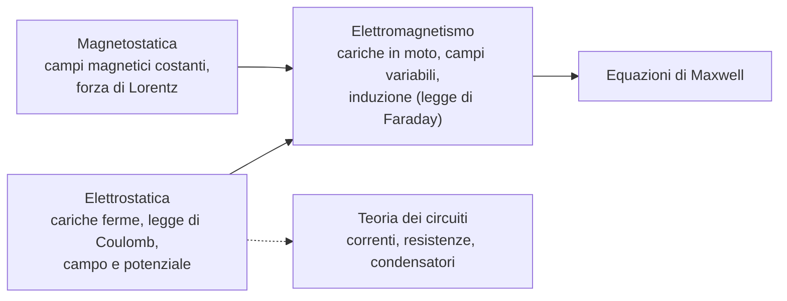
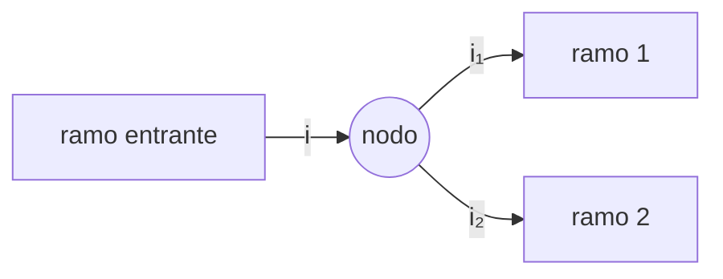

---

## corso: Fisica 2 lezione: 1 data: 2026-09-22 argomenti: [organizzazione del corso, elettrizzazione per strofinio, conduttori e isolanti, carica indotta, legge di Coulomb, corrente elettrica, conservazione della carica, principio di sovrapposizione] bibliography: fisica2.bib tags: [fisica2]

---

# Lezione 1 — Carica elettrica e legge di Coulomb

La prima lezione si apre con le informazioni organizzative e con una panoramica del programma, poi entra nell'elettrostatica seguendo il percorso storico della disciplina. Si parte dagli esperimenti qualitativi che hanno rivelato l'esistenza di una forza nuova, non riconducibile alla meccanica di Newton. Da questi si ricava l'esistenza di due tipi di carica. Si arriva poi alla legge di Coulomb, che descrive quantitativamente l'interazione tra cariche, e alle sue prime conseguenze: la definizione di corrente elettrica, la conservazione della carica e il principio di sovrapposizione.

## Organizzazione del corso

### Modalità d'esame

L'esame è quello tradizionale di fisica generale: una prova scritta seguita da una prova orale. Lo scritto è condizione necessaria per l'orale, e non basta sostenerlo: bisogna superarlo. Le date del calendario esami sono quelle degli scritti. Sono fisse, perché richiedono la prenotazione di un'aula per tutti gli iscritti. L'orale si svolge pochi giorni dopo la correzione, tipicamente due o tre, con un minimo di flessibilità secondo la disponibilità del docente e degli studenti. Durante l'anno ci sono cinque appelli scritti: uno a gennaio, uno a febbraio, due tra giugno e luglio e uno a settembre. Non sono previste prove parziali. Comunicazioni e informazioni generali sul corso (lista dei libri, modalità d'esame) passano tutte dalla pagina AulaWeb, a cui conviene iscriversi.

### Libri di testo

Fisica Generale 2 è un corso standard, insegnato sostanzialmente allo stesso modo da circa cinquant'anni. Per questo il docente non impone un testo: va bene qualsiasi libro universitario di fisica generale 2, anche un'edizione di dieci anni fa, perché gli argomenti non sono cambiati. Tra i più noti cita il Halliday–Resnick (la trascrizione non permette di ricostruire con certezza i coautori dell'edizione nominata); la lista completa è su AulaWeb. Il libro è complementare alle lezioni ed è più esteso: in 60 ore non si riesce a svolgere un corso completo di elettromagnetismo, quindi alcuni capitoli vengono semplificati o ridotti. Un'avvertenza sul livello: alcuni testi di fisica generale sono pensati per i corsi di laurea in Fisica e risultano più avanzati del necessario. In caso di dubbio sulla scelta si può chiedere direttamente al docente.

### Il ruolo degli esercizi

Il docente lo indica come il messaggio più importante della lezione: la fisica non si capisce senza fare esercizi, e senza esercizi non si supera lo scritto, che consiste proprio nel risolverne. Il metodo suggerito è studiare la teoria di un capitolo e poi risolvere uno dopo l'altro gli esercizi di fine capitolo, che nei testi universitari vanno da qualche unità a un centinaio. I primi risultano difficili, poi diventano via via più semplici; dopo una decina la tipologia è padroneggiata. A lezione, per ogni argomento, vengono svolti da due a cinque esercizi rappresentativi, concentrati per quanto possibile nella lezione del venerdì. Non esauriscono però tutte le tipologie che si possono incontrare.

## Panoramica del programma e metodo

Il corso tratta l'elettromagnetismo classico, in quattro blocchi principali più una parte complementare.

L'**elettrostatica** studia i fenomeni legati al campo elettrico prodotto da cariche ferme, a partire dalla legge di Coulomb, e prosegue con il potenziale e la fenomenologia collegata. La **magnetostatica** studia campi magnetici fermi e costanti nel tempo, ad esempio il moto di una particella carica che entra con una certa velocità in un campo magnetico (forza di Lorentz). L'**elettromagnetismo** unisce le due parti. Quando cariche e campi sono statici, campo elettrico e campo magnetico si possono trattare separatamente. Quando le cariche si muovono o i campi variano nel tempo, i due campi si rivelano manifestazioni dello stesso fenomeno fisico e vanno studiati insieme, come accade nell'induzione descritta dalla legge di Faraday. La sintesi formale sono le **equazioni di Maxwell**: quattro equazioni che descrivono tutti i fenomeni elettromagnetici classici.

Accanto a questi blocchi, per circa due settimane, si affronta la **teoria dei circuiti**: correnti, resistenze e condensatori. Si studia come si comportano questi elementi quando sono collegati, come si calcolano correnti ed energie dissipate e come si riduce un circuito complesso a uno più semplice equivalente. È una parte più applicativa e meno legata al nucleo concettuale del corso.

Sul metodo, il docente premette una scelta precisa. La dimostrazione generale di teoremi come quello di Gauss o quello di Ampère richiede strumenti matematici (divergenza, rotore, integrali di superficie) che si sviluppano nel corso di Metodi Matematici. Il corso non può né darli per scontati né introdurli per mancanza di tempo. I teoremi verranno quindi mostrati in casi particolari, verificando che lì valgono, senza dimostrazioni generali. Spesso, inoltre, si partirà da un problema concreto la cui soluzione permette di discutere la teoria: un campo magnetico variabile nel tempo, ad esempio, sarà lo spunto per introdurre la legge di Faraday–Lenz.

## Le prime evidenze sperimentali: l'elettrizzazione per strofinio

L'elettrostatica nasce da esperimenti che mostravano l'esistenza di una forza non prevista dalla meccanica newtoniana. L'apparato tipico è semplice. Una bacchetta è sospesa a un filo per il suo centro, così da poter ruotare liberamente attorno al punto di sospensione ed essere sensibile anche a forze molto deboli. Una seconda bacchetta, tenuta in mano, viene avvicinata alla prima, e si osserva se quella sospesa si mette a ruotare.

### Le tre osservazioni

L'esperimento si ripete in tre varianti, che danno tre esiti distinti.

1. **Bacchette non strofinate.** Avvicinando due bacchette di plastica che non sono state trattate in alcun modo, non succede nulla: la bacchetta sospesa resta ferma e non c'è forza né attrattiva né repulsiva.
2. **Bacchette strofinate con lo stesso materiale.** Se entrambe le bacchette vengono strofinate con lo stesso materiale (entrambe con la seta, oppure entrambe con la pelle), la bacchetta sospesa ruota allontanandosi da quella in mano: le due bacchette si **respingono**.
3. **Bacchette strofinate con materiali diversi.** Se una viene strofinata con la seta e l'altra con la pelle, la bacchetta sospesa ruota in verso opposto, avvicinandosi: le due bacchette si **attraggono**.

La rotazione della bacchetta sospesa rivela che su di essa agisce una forza. Per il terzo principio della dinamica, sulla bacchetta tenuta in mano agisce una forza uguale e opposta. Non la si avverte perché è troppo debole per essere percepita da chi tiene la bacchetta.

> [!tip] Schema consigliato In questo punto sarebbe utile uno schizzo in Excalidraw con le due coppie di bacchette (stesso materiale e materiali diversi) e il verso di rotazione della bacchetta sospesa. Un disegno di questo tipo si trova nella prima pagina dei tuoi appunti a mano.

### Interpretazione: esistono due tipi di carica

Le tre osservazioni si spiegano ammettendo che la materia contenga due tipi di carica elettrica, che chiamiamo **positiva** e **negativa**. Una bacchetta non strofinata è **neutra**: contiene moltissime cariche di entrambi i tipi, in numero uguale, e quindi non ha carica netta. Lo strofinio rompe questo equilibrio. Oggi sappiamo cosa accade a livello microscopico, cosa che all'epoca dei primi esperimenti non si sapeva: si osservavano solo gli effetti macroscopici. La seta strappa alla bacchetta una parte delle cariche negative, che restano sulla seta; la bacchetta si trova con un eccesso di cariche positive ed è carica positivamente. La pelle, al contrario, cede cariche negative alla bacchetta, che si trova con un eccesso di cariche negative ed è carica negativamente.

Con questa interpretazione i risultati sperimentali si riassumono così: due bacchette strofinate con lo stesso materiale acquistano carica dello stesso segno e si respingono; due bacchette strofinate con materiali diversi acquistano cariche di segno opposto e si attraggono. Lo stesso vale sia per due cariche positive sia per due cariche negative.

> [!important] Legge qualitativa dell'interazione elettrica Esistono due tipi di carica elettrica, positiva e negativa. Cariche dello stesso segno si **respingono**, cariche di segno opposto si **attraggono**. Un corpo neutro contiene cariche dei due tipi in quantità uguali.

### Il segno delle cariche è una convenzione

L'assegnazione dei nomi "positiva" e "negativa" è arbitraria. Ciò che conta fisicamente è solo distinguere i due tipi e sapere che tipi uguali si respingono e tipi opposti si attraggono. In linea di principio l'elettrone potrebbe essere considerato una carica positiva: è solo una convenzione stabilita storicamente. Questa arbitrarietà ha una conseguenza che rivedremo: il verso della **corrente elettrica** è definito convenzionalmente come il verso di moto delle cariche positive. Nei conduttori metallici, però, le cariche che si muovono sono gli elettroni, che sono negativi. La convenzione fu fissata quando non si sapeva ancora quali cariche fossero effettivamente in moto.

> [!tip] Approfondimento — L'origine dei segni "più" e "meno" #approfondimento La notazione positivo/negativo per l'elettricità fu introdotta da Benjamin Franklin nel 1747. Franklin chiamò positivo il vetro strofinato, che secondo la sua teoria acquistava un eccesso di "fluido elettrico". Oggi sappiamo che il vetro strofinato perde elettroni: la scelta di Franklin è il motivo per cui gli elettroni, cioè le cariche che effettivamente si muovono nei metalli, risultano negativi e la corrente convenzionale scorre in verso opposto al loro moto [@jensen2005]. Il segno che un materiale acquista per strofinio dipende dalla coppia di materiali a contatto. Per questo i testi presentano spesso l'esperimento con vetro e seta (il vetro si carica positivamente) e con plastica o ambra e pelle (la plastica si carica negativamente). Nell'esempio della lezione conta il principio, non la coppia specifica di materiali.

## Conduttori, isolanti, semiconduttori, superconduttori

Per capire il fenomeno successivo, la carica indotta, serve classificare i materiali secondo la facilità con cui le cariche possono muoversi al loro interno.

|Classe|Mobilità delle cariche|Esempio|
|---|---|---|
|Conduttori|Cariche libere di muoversi|Rame|
|Isolanti|Nessun trasporto di carica in condizioni ordinarie|Plastica|
|Semiconduttori|Comportamento intermedio, con una soglia|Silicio|
|Superconduttori|Resistenza nulla a bassissima temperatura|Mercurio|

Nei **conduttori** le cariche sono mobili: è facile spostarle e in alcuni casi estrarle dal materiale. Nei metalli gli elettroni sono liberi di muoversi, e per questo un metallo trasporta la corrente con bassa resistenza. Il rame ne è un esempio tipico ed è il materiale con cui si realizzano comunemente i fili.

Negli **isolanti** le cariche non riescono a spostarsi e quindi non c'è trasporto di corrente. La plastica è un ottimo isolante. Solo sotto campi elettrici fortissimi anche in un isolante le cariche possono iniziare a muoversi (si parla di _rottura dielettrica_: l'isolante perde le sue proprietà e lascia passare una scarica), ma in condizioni ordinarie il trasporto di carica è assente.

I **semiconduttori**, come il silicio, hanno un comportamento intermedio, e proprio per questo sono interessanti. Al di sotto di una certa soglia di energia, o di potenziale applicato, non trasportano praticamente carica. Superata la soglia, il trasporto diventa abbastanza efficiente. Questa risposta a soglia li rende la base di tutte le applicazioni tecnologiche dell'elettronica.

I **superconduttori** sono una classe ancora più particolare. Un buon conduttore trasporta bene la corrente ma presenta sempre una resistenza: i fili percorsi da corrente si scaldano e dissipano energia. Un superconduttore, invece, al di sotto di una temperatura molto bassa ha resistenza nulla. Gli esempi storici sono metalli, come il mercurio, che diventano superconduttori se raffreddati a temperature prossime allo zero assoluto. L'esperimento tipico usa un anello di mercurio in cui si inietta una corrente. A temperatura ordinaria la corrente viene dissipata in breve tempo e si annulla. Abbassando la temperatura sotto la soglia, la corrente iniettata continua a circolare per settimane o mesi senza dissipazione apprezzabile, perché la resistenza è andata a zero.

Nel seguito del corso, cioè nell'elettromagnetismo classico, ci interessano soprattutto **conduttori e isolanti**. Su questa distinzione si basano, ad esempio, la distribuzione delle cariche nei materiali e le applicazioni della legge di Gauss.

> [!tip] Approfondimento — La scoperta della superconduttività #approfondimento A lezione la scoperta è datata "1913, se non sbaglio", e la temperatura citata è resa in modo incomprensibile dalla trascrizione. Le ricostruzioni storiche collocano la scoperta l'8 aprile 1911 nel laboratorio di Heike Kamerlingh Onnes a Leida. La resistenza di un campione di mercurio scompariva intorno a 4,2 K, circa −269 °C. Il 1913 è l'anno del premio Nobel a Kamerlingh Onnes, assegnato per le sue ricerche sulle basse temperature, che avevano portato alla liquefazione dell'elio, più che per la superconduttività in sé. La persistenza di correnti senza forza elettromotrice in circuiti superconduttori, cioè l'esperimento dell'anello descritto a lezione, fu riportata dallo stesso gruppo nel 1914 [@vanDelft2010].

## La carica indotta

Negli esperimenti precedenti entrambe le bacchette venivano strofinate, e lo sperimentatore poteva scegliere se caricarle con cariche dello stesso segno o di segno opposto. Esiste però un fenomeno affine in cui la bacchetta sospesa non viene strofinata affatto. Per spiegarlo serve proprio la distinzione tra conduttori e isolanti.

Si lascia neutra la bacchetta sospesa e si strofina solo quella tenuta in mano, che si carica, ad esempio positivamente. L'esito dipende dal materiale della bacchetta sospesa.

- Se la bacchetta sospesa è di **plastica** (isolante), avvicinando la bacchetta carica non succede nulla.
- Se la bacchetta sospesa è di un materiale **conduttore**, viene attratta da quella carica, pur restando complessivamente neutra.

### Spiegazione microscopica

La bacchetta neutra contiene cariche positive e negative in numero uguale. Se è un isolante, le cariche non possono spostarsi. Avvicinando la bacchetta positiva, le cariche negative vengono attratte e quelle positive respinte, ma le due forze, grosso modo, si compensano e non si osserva alcun effetto macroscopico.

Se la bacchetta è un conduttore, le cariche sono libere di muoversi. Le cariche negative, che sappiamo essere quelle mobili, vengono attratte dalla bacchetta positiva e si spostano verso l'estremità più vicina. All'estremità opposta resta un eccesso di cariche positive. Il numero totale di cariche non cambia, perché la bacchetta non ne ha scambiate con l'esterno, quindi resta globalmente neutra. Le cariche si sono però ridistribuite: la bacchetta si comporta in modo effettivo come un oggetto con due poli, uno negativo vicino alla bacchetta carica e uno positivo lontano. Il polo di segno opposto, più vicino, viene attratto; quello dello stesso segno, più lontano, viene respinto. Poiché l'interazione si indebolisce con la distanza, come mostrerà quantitativamente la legge di Coulomb, prevale l'attrazione, e la bacchetta sospesa ruota verso quella carica.

Lo stesso ragionamento vale se la bacchetta in mano è carica negativamente. Le cariche negative mobili vengono respinte verso l'estremità lontana, quella vicina resta positiva, e di nuovo i poli più vicini hanno segno opposto: la forza è ancora attrattiva e la rotazione avviene nello stesso verso.

> [!important] Carica indotta Avvicinando un corpo carico a un conduttore neutro, le cariche mobili del conduttore si ridistribuiscono: sul lato più vicino si accumula carica di segno opposto a quella del corpo inducente, sul lato lontano carica dello stesso segno. Il conduttore resta globalmente neutro, ma viene attratto. Rispetto all'elettrizzazione per strofinio ci sono due differenze:
> 
> 1. il fenomeno richiede un **conduttore**, perché le cariche devono potersi spostare;
> 2. la forza dovuta alla carica indotta è **sempre attrattiva**, qualunque sia il segno della carica inducente.

> [!tip] Schema consigliato La ridistribuzione delle cariche nella bacchetta conduttrice (prima e dopo l'avvicinamento) si presta a uno schizzo in Excalidraw. Una versione è nella prima pagina dei tuoi appunti a mano, nella sezione "Carica indotta".

> [!tip] Approfondimento — Gli isolanti non sono del tutto insensibili #approfondimento Nel modello della lezione un isolante neutro non risente della bacchetta carica. In realtà anche negli isolanti la distribuzione di carica di ogni molecola si deforma leggermente in presenza di un corpo carico: il materiale si _polarizza_. Ne nasce un'attrazione molto più debole di quella osservata nei conduttori. È lo stesso meccanismo per cui un pettine strofinato attira piccoli pezzi di carta. I testi di Fisica 2 trattano questo fenomeno nel capitolo sui dielettrici.

## La legge di Coulomb

Fin qui la descrizione è stata qualitativa: sappiamo se due cariche si attraggono o si respingono, ma non quanto. Il passaggio a una descrizione quantitativa si deve al fisico francese Charles-Augustin de Coulomb. Lavorando con piccole sfere cariche, Coulomb non si limitò a constatare attrazione e repulsione, ma ricavò la legge che dà l'intensità della forza tra due cariche.

> [!tip] Approfondimento — La bilancia di torsione #approfondimento Coulomb presentò i risultati nel "Premier mémoire sur l'électricité et le magnétisme", relativo all'anno 1785 delle memorie dell'Académie royale des sciences e pubblicato nel 1788. Lo strumento era una bilancia di torsione: un filo metallico che, torcendosi, esercita una forza di reazione proporzionale all'angolo di torsione. Misurando l'angolo, Coulomb poteva misurare la forza di repulsione tra sfere cariche dello stesso segno e stabilire la dipendenza dall'inverso del quadrato della distanza [@coulomb1785].

### Enunciato

Date due cariche puntiformi $q_1$ e $q_2$ poste a distanza $r$, la forza che la carica 2 esercita sulla carica 1 è

> [!important] Legge di Coulomb $$ \vec F_{1,2} = k,\frac{q_1, q_2}{r^2},\hat r $$ dove $q_1$ e $q_2$ sono le cariche, $r$ è la loro distanza, $k$ è la **costante elettrostatica** e $\hat r$ è il versore della congiungente le due cariche.

La notazione $\vec F_{1,2}$ va letta come la forza agente sulla particella 1 generata dall'interazione con la particella 2. Per il terzo principio della dinamica, la forza che la 1 esercita sulla 2 è uguale e opposta: $\vec F_{2,1} = -\vec F_{1,2}$.

### Richiamo: le grandezze vettoriali

La forza è un **vettore**, e questo va tenuto sempre presente. Un vettore è definito solo quando ne sono specificate tre caratteristiche:

1. il **modulo**, cioè l'intensità;
2. la **direzione**, cioè la retta lungo cui agisce;
3. il **verso**, cioè quale dei due orientamenti possibili lungo quella retta.

La legge di Coulomb è un'equazione vettoriale e contiene tutte e tre le informazioni. Conviene però separarle. Il modulo si indica con $|\vec F|$, oppure semplicemente con la stessa lettera senza freccia, $F$.

### Il modulo

> [!important] Modulo della forza di Coulomb $$ |\vec F| = F = k,\frac{|q_1|,|q_2|}{r^2} $$

Il modulo è direttamente proporzionale alle cariche: cariche più grandi si attraggono o si respingono con una forza più intensa. È inversamente proporzionale al quadrato della distanza: a parità di cariche, allontanandole la forza si indebolisce, e raddoppiando la distanza si riduce a un quarto. Negli appunti il modulo compare anche come $k,q_1 q_2/r^2$, senza valori assoluti. È coerente con la lezione purché si ricordi che l'informazione sul segno, cioè attrazione o repulsione, viene trattata a parte, nel verso.

### Direzione e verso

La **direzione** della forza è sempre quella della retta congiungente le due cariche. Il **verso** dipende dal segno del prodotto $q_1 q_2$:

|$q_1$|$q_2$|$q_1 q_2$|Forza|
|---|---|---|---|
|$+$|$+$|$+$|repulsiva|
|$-$|$-$|$+$|repulsiva|
|$+$|$-$|$-$|attrattiva|

Prodotto positivo significa repulsione: cariche uguali si respingono, sia che siano entrambe positive sia entrambe negative, perché il prodotto di due numeri negativi è positivo. Prodotto negativo significa attrazione.

Nella forma vettoriale queste informazioni sono contenute nel **versore** $\hat r$. Un versore è un vettore di modulo unitario, ottenuto dividendo un vettore per il suo modulo, $\hat r = \vec r / |\vec r|$, dove $\vec r$ è il vettore lungo la congiungente. In questo modo il modulo $k,|q_1||q_2|/r^2$ resta separato da tutta l'informazione vettoriale, cioè direzione e verso, affidata a $\hat r$ e al segno del prodotto delle cariche. Perché il segno funzioni correttamente, per la forza $\vec F_{1,2}$ il versore $\hat r$ va orientato dalla carica 2 verso la carica 1. Se $q_1 q_2 > 0$ la forza punta lungo $\hat r$, cioè via dalla carica 2 (repulsione). Se $q_1 q_2 < 0$ punta in verso opposto, cioè verso la carica 2 (attrazione).

> [!warning] Precisazione terminologica sugli appunti Negli appunti (.md) e in un passaggio della trascrizione si legge che "la direzione dipende dal prodotto fra le cariche". Secondo le definizioni date a lezione, la direzione è sempre quella della congiungente: ciò che dipende dal segno del prodotto è il **verso**.

### Unità di misura e costanti

L'unità di misura della carica elettrica nel Sistema Internazionale è il **coulomb**, simbolo $\mathrm C$. La costante elettrostatica vale

$$ k = 8{,}99\times 10^{9}\ \frac{\mathrm{N,m^2}}{\mathrm{C^2}} $$

ed è un dato da prendere così com'è. La costante si può scrivere in una forma alternativa:

> [!important] Forma equivalente della legge di Coulomb $$ k = \frac{1}{4\pi\varepsilon_0} \qquad\Longrightarrow\qquad \vec F_{1,2} = \frac{1}{4\pi\varepsilon_0},\frac{q_1,q_2}{r^2},\hat r, \qquad \varepsilon_0 = 8{,}85\times 10^{-12}\ \frac{\mathrm{C^2}}{\mathrm{N,m^2}} $$ dove $\varepsilon_0$ è la **costante dielettrica** (o permittività) **del vuoto**.

Usare $k$ o $\varepsilon_0$ è del tutto equivalente: è la stessa legge con la costante riscritta in un altro modo. La forma con $\varepsilon_0$ è quella che compare nelle equazioni di Maxwell, dove $\varepsilon_0$ risulta legata alla velocità della luce nel vuoto. La specificazione "del vuoto" serve a distinguerla dalla costante che caratterizza la propagazione nei materiali. Per gli scopi attuali basta sapere che la legge di Coulomb si può scrivere in entrambi i modi.

> [!warning] Discrepanza sul valore di $\varepsilon_0$ Negli appunti (.md e a mano) si legge $\varepsilon_0 = 8{,}88\times10^{-12}\ \mathrm{C^2/(N,m^2)}$. In quel punto la trascrizione è incomprensibile e non permette di verificare cosa sia stato detto. Il valore corretto è $\varepsilon_0 \simeq 8{,}85\times10^{-12}\ \mathrm{C^2/(N,m^2)}$. Lo si verifica anche dalla relazione con $k$: $1/(4\pi \cdot 8{,}99\times10^{9}) \simeq 8{,}85\times10^{-12}$.

> [!tip] Approfondimento — $\varepsilon_0$ e la velocità della luce #approfondimento 
> La relazione accennata a lezione è $c = 1/\sqrt{\varepsilon_0,\mu_0}$, dove $\mu_0$ è la permeabilità magnetica del vuoto, una costante che comparirà nella parte di magnetismo. È uno dei risultati che emergono dalle equazioni di Maxwell.

### Analogia con la legge di gravitazione universale

La struttura della legge di Coulomb ricorda da vicino quella della gravitazione universale di Newton,

$$ F_g = G,\frac{m_1, m_2}{r^2}, $$

con le masse al posto delle cariche e la costante di gravitazione $G$ al posto della costante elettrostatica $k$. Anche la direzione è la stessa, cioè la congiungente dei due corpi, e anche la dipendenza dalla distanza è la stessa, l'inverso del quadrato. Le implicazioni fisiche sono però molto diverse. Le masse sono sempre positive, quindi la forza gravitazionale è sempre attrattiva. Le cariche possono avere entrambi i segni, quindi la forza elettrica può essere sia attrattiva sia repulsiva.

> [!tip] Approfondimento — Quanto è più intensa la forza elettrica? #approfondimento 
> Per due protoni il rapporto tra forza elettrica e forza gravitazionale non dipende dalla distanza, perché entrambe vanno come $1/r^2$: $$ \frac{F_e}{F_g} = \frac{k,e^2}{G,m_p^2} = \frac{(8{,}99\times10^{9})(1{,}602\times10^{-19})^2}{(6{,}674\times10^{-11})(1{,}673\times10^{-27})^2} \approx 1{,}2\times10^{36} $$ con $e$ carica elementare e $m_p$ massa del protone. La gravità domina su scala astronomica solo perché i corpi macroscopici sono quasi perfettamente neutri, e le enormi forze elettriche tra le loro cariche si compensano.

## La corrente elettrica

Il coulomb è un'unità difficile da realizzare e misurare direttamente. È legato alla carica dell'elettrone, che è piccolissima: per un corpo macroscopico, stabilire con precisione quanta carica possiede è complicato. Si ricorre allora a una grandezza derivata, molto più comoda da misurare: la **corrente elettrica**.

> [!important] Corrente elettrica $$ i = \frac{dq}{dt} $$ La corrente è la derivata della carica rispetto al tempo. La sua unità di misura è l'**ampere**: $$ 1\ \mathrm A = 1\ \frac{\mathrm C}{\mathrm s} $$

Ogni volta che la carica contenuta in una regione di spazio varia nel tempo, c'è una corrente elettrica. Un ampere corrisponde al passaggio di un coulomb al secondo. Si può anche invertire la relazione: misurare una corrente è molto più preciso che misurare direttamente una carica. Quando il coulomb è difficile da misurare, conviene quindi passare dall'ampere e ricavare la carica dalla corrente, con $1\ \mathrm C = 1\ \mathrm{A\cdot s}$. Quale strada convenga dipende naturalmente dalla situazione.

> [!tip] Approfondimento — Ampere, coulomb e carica elementare nel SI attuale #approfondimento Dal 20 maggio 2019, con la revisione del Sistema Internazionale, l'ampere è definito fissando il valore numerico esatto della carica elementare: $e = 1{,}602,176,634\times10^{-19}\ \mathrm C$. La definizione precedente dell'ampere, in vigore dal 1948, è stata abrogata. Il coulomb resta un'unità derivata, $1\ \mathrm C = 1\ \mathrm{A,s}$, coerentemente con quanto detto a lezione [@bipm2019]. Le cariche usate negli esercizi della lezione successiva, $1{,}6\times10^{-19}\ \mathrm C$ e $3{,}2\times10^{-19}\ \mathrm C$, corrispondono a $e$ e $2e$.

## Conservazione della carica e della corrente

Una delle leggi fondamentali della natura stabilisce che la carica si conserva.

> [!important] Principio di conservazione della carica La carica elettrica totale si conserva: non può essere né creata né distrutta, ma solo spostata da un punto all'altro.

Possiamo trasportare carica, ad esempio facendo scorrere una corrente, ma la carica totale deve restare la stessa. Questo principio ha una conseguenza diretta sulla corrente. Si consideri un filo conduttore che a un certo punto si divide in due rami. Il punto di diramazione si chiama **nodo**. Se nel nodo entra una corrente $i$ e nei due rami escono le correnti $i_1$ e $i_2$, necessariamente

$$ i = i_1 + i_2 . $$

In generale, la somma delle correnti entranti in un nodo è uguale alla somma delle correnti uscenti. Se così non fosse, ad esempio se entrasse più corrente di quanta ne esce, nel nodo verrebbe distrutta carica, oppure creata nel caso opposto. Un nodo di un circuito non può accumulare carica, e la conservazione lo vieta. La conservazione della carica è l'assunzione fisica di base; la conservazione della corrente ai nodi ne è una conseguenza.

> [!tip] Approfondimento — Anticipazione sui circuiti #approfondimento Nella parte del corso dedicata ai circuiti, questa relazione è nota come legge dei nodi, o prima legge di Kirchhoff.

## Il principio di sovrapposizione

L'ultima osservazione della lezione riguarda i sistemi con più di due cariche. Si considerino $n$ cariche puntiformi $q_1, q_2, \dots, q_n$ e ci si chieda quale forza agisca su una di esse, ad esempio la carica 1. Chiamiamo questa forza totale $\vec F_{1,\text{netta}}$. Le forze di Coulomb soddisfano il **principio di sovrapposizione**: la forza netta sulla carica 1 è la somma vettoriale delle forze di Coulomb che ciascuna delle altre cariche esercita su di essa, calcolate come se le altre non ci fossero.

> [!important] Principio di sovrapposizione per le forze di Coulomb $$ \vec F_{1,\text{netta}} = \vec F_{1,2} + \vec F_{1,3} + \dots + \vec F_{1,n} $$ e in generale, per la carica $i$-esima, $$ \vec F_{i,\text{netta}} = \sum_{\substack{j=1 \ j\neq i}}^{n} \vec F_{i,j} = k \sum_{\substack{j=1 \ j\neq i}}^{n} \frac{q_i, q_j}{r_{ij}^2},\hat r_{ij} $$ dove $r_{ij}$ è la distanza tra le cariche $i$ e $j$ e $\hat r_{ij}$ il versore della loro congiungente, orientato dalla carica $j$ verso la carica $i$.

In pratica il principio dice di calcolare con la legge di Coulomb, una per una, le forze dovute alle singole cariche, ciascuna con il proprio modulo, la propria direzione lungo la congiungente e il proprio verso, e poi sommarle **come vettori**. La formula vale per qualsiasi carica del sistema. Cambia solo l'insieme dei termini della somma, che comprende tutte le cariche tranne quella su cui si calcola la forza.

### Esempio qualitativo con tre cariche

Si considerino tre cariche disposte ai vertici di un triangolo: $q_1$ positiva, $q_2$ negativa e $q_3$ positiva, con la carica 2 nel vertice superiore.

**Forza sulla carica 1.** La carica 2 ha segno opposto, quindi $\vec F_{1,2}$ è attrattiva: è diretta lungo la congiungente 1–2, verso la carica 2, con modulo $k,|q_1||q_2|/r_{12}^2$. La carica 3 ha lo stesso segno, quindi $\vec F_{1,3}$ è repulsiva: è diretta lungo la congiungente 1–3, in verso opposto alla carica 3, con modulo $k,|q_1||q_3|/r_{13}^2$. La forza netta si ottiene sommando i due vettori con la **regola del parallelogramma**: si costruisce il parallelogramma che ha i due vettori come lati consecutivi, e la risultante è la diagonale uscente dal punto di applicazione. Se le cariche 2 e 3 fossero bloccate e la 1 libera, la carica 1 inizierebbe a muoversi nella direzione e nel verso di questa risultante.

**Forza sulla carica 2.** Con la stessa configurazione si può calcolare la forza netta sulla carica 2:

$$ \vec F_{2,\text{netta}} = \vec F_{2,1} + \vec F_{2,3} = k,\frac{q_2, q_1}{r_{21}^2},\hat r_{21} + k,\frac{q_2, q_3}{r_{23}^2},\hat r_{23}. $$

Entrambe le forze sono attrattive, perché la carica 2 è negativa mentre la 1 e la 3 sono positive. Una punta verso la carica 1 e l'altra verso la carica 3; la risultante, ottenuta ancora con la regola del parallelogramma, è compresa tra le due direzioni. Per simmetria la distanza $r_{12}$ coincide con $r_{21}$: cambia solo quale carica si sta considerando come "bersaglio" della forza.

La somma è stata eseguita qui per via grafica. La somma analitica, che passa dalla scomposizione dei vettori in componenti, è stata svolta negli esercizi della lezione successiva: si veda [[Fisica 2 - Lezione 02 - Campo elettrico e dipolo]].

> [!tip] Schema consigliato La costruzione con il parallelogramma per le cariche 1 e 2 è nella seconda pagina dei tuoi appunti a mano. Riprodurla in Excalidraw, con i vettori colorati per sorgente, aiuta a fissare la procedura.