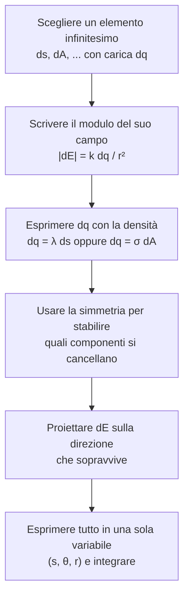

---

## corso: Fisica 2 lezione: 3 data: 2026-09-29 argomenti: [distribuzioni continue di carica, densità di carica lineare, densità di carica superficiale, campo di un anello carico, campo di un arco di circonferenza, campo di un disco carico, piano infinito carico] bibliography: fisica2.bib tags: [fisica2]

---

# Lezione 3 — Campo elettrico di distribuzioni continue di carica

Nelle lezioni precedenti il campo elettrico è stato calcolato per insiemi finiti di cariche puntiformi, sommando i contributi delle singole cariche con il principio di sovrapposizione. Questa lezione affronta il caso, molto più frequente nella pratica, in cui la carica è distribuita con continuità su una linea o su una superficie. Il metodo è sempre lo stesso: si suddivide la distribuzione in elementi infinitesimi, a ciascuno dei quali si applica la legge di Coulomb, e poi si sommano i contributi con un integrale. Il metodo viene applicato a tre casi in cui il calcolo si può portare a termine analiticamente: l'**anello carico**, l'**arco di circonferenza** e il **disco carico**. Dal disco si ricava infine, come caso limite, il **piano infinito**, che genera un campo uniforme.

## Dalle cariche puntiformi alle distribuzioni continue

> [!warning] Sezione ricostruita — inizio La trascrizione comincia a metà della premessa generale con cui il docente introduce il metodo ("...a qualsiasi configurazione di carica"). I due paragrafi seguenti ricostruiscono quella premessa, in modo coerente con quanto svolto nel resto della lezione.

Per un sistema di $n$ cariche puntiformi il campo in un punto è la somma vettoriale dei campi delle singole cariche, $\vec E = \sum_i k,q_i,\hat r_i / r_i^2$. Quando la carica è distribuita in modo continuo, ad esempio lungo un filo o su una lastra, non si può più elencare le cariche una per una. Si immagina allora di suddividere la distribuzione in elementi così piccoli che ciascuno, con carica $dq$, si possa trattare come una carica puntiforme. Il campo infinitesimo generato da un elemento è dato dalla legge di Coulomb, e la somma su tutti gli elementi diventa un integrale:

$$ d\vec E = k,\frac{dq}{r^2},\hat r \qquad\Longrightarrow\qquad \vec E = \int d\vec E = k\int \frac{dq}{r^2},\hat r , $$

dove $r$ è la distanza tra l'elemento e il punto in cui si calcola il campo, e $\hat r$ il versore diretto dall'elemento verso quel punto.

L'integrale è **vettoriale**: elementi diversi danno contributi con direzioni diverse. In pratica si scompone $d\vec E$ in componenti e si integra ciascuna separatamente. La carica $dq$ si esprime con una **densità di carica**, che descrive come la carica è distribuita: lineare $\lambda$ per una distribuzione lungo una linea, superficiale $\sigma$ per una superficie e, per completezza, volumica $\rho$ per un volume. Così $dq = \lambda,ds$, $dq = \sigma,dA$ oppure $dq = \rho,dV$. In questa lezione si usano le prime due.

> [!warning] Sezione ricostruita — fine

Il docente sottolinea che l'idea vale per qualsiasi configurazione di carica, ma che il calcolo si può portare fino in fondo analiticamente solo quando la distribuzione possiede una certa **simmetria**. Senza simmetria, come dice lui, "siamo fregati": le componenti del campo non si semplificano e l'integrale non si risolve in forma chiusa. Per questo si studiano casi particolari, la distribuzione su un anello e quella su un disco, in cui la simmetria permette di arrivare a una formula esplicita.

Lo schema seguente riassume il procedimento, che il docente ricapitola alla fine del secondo esercizio con le parole "il trucchetto è sempre lo stesso".



## Il campo di un anello carico sull'asse

### Impostazione e densità di carica lineare

Si consideri un anello circolare di raggio $R$, carico positivamente in modo uniforme. Si vuole calcolare il campo elettrico in un punto $P$ che si trova sull'**asse dell'anello**, cioè sulla retta perpendicolare al piano dell'anello e passante per il suo centro, a distanza $z$ dal centro.

L'anello è un oggetto sostanzialmente unidimensionale: la carica è distribuita lungo una curva, la circonferenza. La grandezza che la descrive è la **densità di carica lineare**.

> [!important] Densità di carica lineare $$ \lambda = \frac{dq}{ds} \qquad \left[\frac{\mathrm C}{\mathrm m}\right] $$ In generale è la derivata della carica rispetto alla lunghezza e dice come varia la carica lungo la linea. Se la distribuzione è **uniforme**, la densità è costante ed è il rapporto tra carica totale e lunghezza totale: $\lambda = Q/L$.

Una densità uniforme significa, ad esempio, che ogni metro di linea porta la stessa carica. Se la distribuzione non è uniforme bisogna tenere la definizione differenziale, perché $\lambda$ cambia da punto a punto. Dalla definizione segue la relazione che serve nel calcolo:

$$ dq = \lambda,ds . $$

### Il contributo di un singolo elemento

Si prende un elemento dell'anello di lunghezza $ds$. Se l'anello è carico uniformemente, l'elemento contiene la carica $dq = \lambda,ds$, piccola a piacere: per avere una carica ancora più piccola basta prendere un elemento più corto. Se l'elemento è abbastanza piccolo lo si può trattare come una carica puntiforme e applicargli la legge di Coulomb. In generale questo non sarebbe lecito per un oggetto esteso, ma lo diventa nel limite infinitesimo. Il problema del continuo di carica è così ricondotto a qualcosa che conosciamo: il campo di una carica puntiforme.

La distanza $r$ tra l'elemento e il punto $P$ si ricava dal triangolo rettangolo che ha per cateti il raggio $R$ e l'altezza $z$:

$$ r^2 = R^2 + z^2 . $$

Il modulo del campo generato in $P$ dall'elemento è quindi

$$ |d\vec E| = k,\frac{dq}{r^2} = k,\frac{\lambda,ds}{R^2+z^2}. $$

In questa espressione tutto è noto: il raggio $R$ e la densità $\lambda$ sono dati del problema, e $z$ è la distanza a cui si vuole il campo.

### Direzione del campo: il ruolo della simmetria

Il campo è un vettore, e non basta il modulo: servono anche direzione e verso. Poiché deriva dalla legge di Coulomb, il campo dell'elemento ne eredita la direzione. È diretto lungo la congiungente tra l'elemento $ds$ e il punto $P$, con verso uscente dalla carica, che è positiva.

Qui interviene la simmetria. L'anello è circolare e carico uniformemente, quindi per ogni elemento $ds$ esiste un elemento uguale nella posizione diametralmente opposta, che contiene la stessa carica e si trova alla stessa distanza $r$ da $P$. I due elementi generano in $P$ campi di **uguale modulo**, ma con direzioni diverse, simmetriche rispetto all'asse. Scomponendo ciascun campo in una componente lungo l'asse $z$ e una perpendicolare all'asse, si vede che:

- le **componenti lungo $z$** sono concordi e si **sommano**;
- le **componenti perpendicolari** all'asse sono uguali in modulo e opposte in verso, quindi si **annullano**.

Lo stesso vale per ogni coppia di elementi opposti. Il campo totale sull'asse ha quindi **solo la componente lungo $z$**, e basta calcolare quella.

> [!tip] Schema consigliato La sezione dell'anello con i due elementi opposti, i rispettivi $d\vec E$ e la loro scomposizione in componente assiale e trasversale si presta a uno schizzo in Excalidraw. Una versione è nella prima pagina dei tuoi appunti a mano della lezione 3.

### Proiezione sull'asse e integrazione

La componente lungo $z$ del campo di un elemento si ottiene moltiplicando il modulo per il coseno dell'angolo $\theta$ tra $d\vec E$ e l'asse:

$$ dE_z = |d\vec E|\cos\theta . $$

L'angolo va espresso con i dati del problema. Nello stesso triangolo rettangolo di prima, $\theta$ è l'angolo in $P$ tra l'asse e la congiungente con l'elemento. Il cateto adiacente è $z$ e l'ipotenusa è $r$:

$$ \cos\theta = \frac{z}{r} = \frac{z}{\left(R^2+z^2\right)^{1/2}} . $$

Sostituendo, gli esponenti al denominatore si sommano, $1 + \tfrac12 = \tfrac32$:

$$ dE_z = k,\frac{\lambda,ds}{R^2+z^2}\cdot\frac{z}{\left(R^2+z^2\right)^{1/2}} = k,\frac{\lambda,z,ds}{\left(R^2+z^2\right)^{3/2}} . $$

Questa è la componente lungo l'asse del campo generato da un singolo elemento. Per avere il campo totale si sommano, cioè si integrano, i contributi di tutti gli elementi dell'anello. $k$, $\lambda$, $z$ ed $R$ non dipendono dalla posizione dell'elemento lungo l'anello, quindi escono dall'integrale. Resta l'integrale di $ds$ su tutta la circonferenza, che è semplicemente la sua lunghezza, $2\pi R$:

$$ E_z = \oint dE_z = \frac{k,\lambda,z}{\left(R^2+z^2\right)^{3/2}}\oint ds = \frac{k,\lambda,z,(2\pi R)}{\left(R^2+z^2\right)^{3/2}} . $$

Se la densità è uniforme, la carica totale dell'anello è $Q = \lambda\cdot 2\pi R$, e il risultato si può scrivere in funzione di $Q$.

> [!important] Campo di un anello carico uniformemente, sull'asse $$ E_z = \frac{k,\lambda,(2\pi R),z}{\left(R^2+z^2\right)^{3/2}} = \frac{k,Q,z}{\left(R^2+z^2\right)^{3/2}} $$ Il campo è diretto lungo l'asse dell'anello: per $Q>0$ punta in verso uscente dall'anello.

Le due forme sono equivalenti, e la scelta dipende dai dati del problema. Se è nota la densità di carica si usa la forma con $\lambda$. Se è detto, ad esempio, che l'anello è caricato uniformemente con carica totale $Q$, si usa la forma con $Q$.

### Limite a grande distanza

Si consideri il caso $z \gg R$: l'anello è piccolo e lo si osserva da grande distanza. Allora a maggior ragione $z^2 \gg R^2$, e al denominatore si può approssimare $R^2 + z^2 \simeq z^2$:

$$ E_z \simeq \frac{k,Q,z}{\left(z^2\right)^{3/2}} = \frac{k,Q,z}{z^3} = \frac{k,Q}{z^2} \qquad (z \gg R). $$

È il campo di una carica puntiforme $Q$, cioè il campo previsto dalla legge di Coulomb. La matematica conferma l'intuizione: un anello piccolo visto da lontano non mostra la sua struttura, e lo si può approssimare con una carica puntiforme che porta tutta la carica dell'anello.

### Limiti di validità del risultato

Il docente sottolinea che il calcolo si basa su due condizioni molto vincolanti.

1. **La distribuzione è circolare e uniforme**, quindi il problema è perfettamente simmetrico.
2. **Il punto si trova sull'asse** dell'anello.

Rispettate queste due condizioni, $z$ è arbitrario: il risultato vale vicino come lontano dall'anello. Se si viola una delle due, il calcolo analitico diventa impraticabile. In un punto fuori dall'asse le componenti trasversali non si cancellano più, e il campo ha componenti lungo $x$, $y$ e $z$. Se l'anello viene deformato in un'ellisse, la simmetria si perde, e anche sull'asse il campo non è più diretto solo lungo $z$. Con un'ellisse, osserva il docente, forse ci si può ancora cavare d'impaccio sfruttando i suoi due assi di simmetria, ma il calcolo diventa comunque difficile.

L'aspetto positivo è che il risultato, una volta ricavato, non va ricalcolato ogni volta: il campo di un anello sul suo asse è dato dalla formula trovata. L'idea alla base del calcolo, cioè elemento infinitesimo, legge di Coulomb, somma vettoriale e integrazione, vale invece per qualsiasi distribuzione, anche quando l'integrale non si sa risolvere analiticamente.

> [!tip] Approfondimento — Andamento del campo lungo l'asse #approfondimento La formula contiene altre due informazioni.
> 
> - **Nel centro dell'anello ($z = 0$) il campo è nullo.** Lo si vede dalla formula, ma anche dalla simmetria: nel centro ogni elemento ha l'elemento opposto alla stessa distanza, e i loro campi, entrambi nel piano dell'anello, si cancellano completamente.
> - **Il modulo è massimo a $z = R/\sqrt2$.** Annullando la derivata, $\dfrac{d}{dz}\dfrac{z}{(R^2+z^2)^{3/2}} = \dfrac{R^2 - 2z^2}{(R^2+z^2)^{5/2}} = 0$ dà $z = R/\sqrt2$, dove $E_z = \dfrac{2}{3\sqrt3},\dfrac{kQ}{R^2} \simeq 0{,}385,\dfrac{kQ}{R^2}$.
> 
> Per $z<0$, cioè dall'altra parte dell'anello, la formula dà $E_z<0$: il campo punta ancora in verso uscente dall'anello, questa volta lungo $-z$. Il grafico riporta $E_z R^2/(kQ)$ in funzione di $z/R$.
> 
> ```chart
> type: line
> labels: [0, 0.25, 0.5, 0.75, 1, 1.25, 1.5, 1.75, 2, 2.25, 2.5, 2.75, 3]
> series:
>   - title: Anello, E_z R²/(kQ) in funzione di z/R
>     data: [0, 0.2283, 0.3578, 0.3840, 0.3536, 0.3047, 0.2560, 0.2137, 0.1789, 0.1507, 0.1281, 0.1098, 0.0949]
> tension: 0.3
> width: 80%
> labelColors: false
> fill: false
> beginAtZero: true
> ```

> [!warning] Discrepanze negli appunti (.md) sull'anello Nel file "Campo elettrico.md" ci sono alcuni refusi, assenti negli appunti a mano:
> 
> - "$|k| = k,ds/r^2$" va letto $|d\vec E| = k,\lambda,ds/r^2$;
> - l'integrale è scritto $\int_0^{\pi/2} ds$, ma va esteso a tutta la circonferenza, $\oint ds = 2\pi R$. Il risultato $2\pi R$ riportato subito dopo è corretto;
> - la grandezza integrata è chiamata $F_z$, mentre si tratta del campo $E_z$.

## Esercizio — Arco di circonferenza carico negativamente

> [!example] Testo Un arco di circonferenza di raggio $r$, che sottende un angolo totale di $120^\circ$, cioè $60^\circ$ da ciascuna parte dell'asse di simmetria, è carico uniformemente con carica totale $-Q$. Determinare il campo elettrico nel centro $P$ della circonferenza.

Questa volta la circonferenza non è completa, quindi la formula dell'anello non si può usare: non c'è più la simmetria per rotazione. Per fortuna, però, il campo è richiesto nel centro della circonferenza, e l'arco resta simmetrico rispetto alla sua bisettrice. L'idea è esattamente la stessa di prima.

**Il contributo di un elemento.** Un elemento di lunghezza $ds$ contiene la carica $dq = \lambda,ds$. Il suo campo in $P$ ha modulo

$$ |d\vec E| = k,\frac{|dq|}{r^2} = k,\frac{|\lambda|,ds}{r^2}, $$

dove $r$ è ora il raggio della circonferenza: tutti gli elementi dell'arco si trovano alla stessa distanza dal centro. Si usa il modulo di $\lambda$ perché il verso viene stabilito separatamente: la carica è negativa, quindi il campo di ogni elemento è **entrante** nell'elemento, cioè punta da $P$ verso l'elemento.

**La simmetria.** Si sceglie l'asse $x$ lungo la bisettrice dell'arco, orientato da $P$ verso l'arco, e l'asse $y$ perpendicolare. Per ogni elemento $dq$ della metà superiore esiste un elemento speculare nella metà inferiore. Hanno la stessa carica, perché la distribuzione è uniforme e gli elementi sono uguali, e la stessa distanza $r$ da $P$, quindi i loro campi hanno lo stesso modulo. Scomponendoli lungo $x$ e lungo $y$, le **componenti lungo $y$ si cancellano**, una verso l'alto e l'altra verso il basso, mentre le **componenti lungo $x$ si sommano**. Il campo totale è quindi diretto solo lungo $x$, verso l'arco.

**Proiezione.** Detto $\theta$ l'angolo che la congiungente tra $P$ e l'elemento forma con l'asse $x$, l'unica componente che sopravvive è

$$ dE_x = |d\vec E|\cos\theta = k,\frac{|\lambda|,ds}{r^2}\cos\theta . $$

**Da lunghezza ad angolo.** Per integrare bisogna esprimere $ds$ in funzione di $\theta$. Il docente ricava la relazione con un argomento geometrico: per angoli piccoli il tratto di arco si confonde con il cateto di un triangolo rettangolo, per cui $r\sin\theta = s$. Al primo ordine dello sviluppo di Taylor $\sin\theta \simeq \theta$, quindi $r,\theta = s$. Passando agli infinitesimi:

$$ ds = r,d\theta . $$

Sostituendo, un fattore $r$ si semplifica con il denominatore:

$$ dE_x = k,|\lambda|,\frac{r,d\theta}{r^2}\cos\theta = \frac{k,|\lambda|}{r}\cos\theta,d\theta . $$

> [!tip] Approfondimento — La relazione $ds = r,d\theta$ è esatta #approfondimento L'argomento del docente con il triangolo e l'approssimazione $\sin\theta\simeq\theta$ è un modo intuitivo per arrivarci. Per un arco di circonferenza la relazione $s = r,\theta$ vale però esattamente per qualsiasi angolo, purché $\theta$ sia misurato in **radianti**: è la definizione stessa di radiante. Da qui $ds = r,d\theta$ senza approssimazioni. Ne segue che nell'integrale gli estremi vanno pensati in radianti, $\pm\pi/3$. Il risultato numerico non cambia, perché alla fine si valuta solo il seno di quegli angoli.

**Integrazione.** $k$, $|\lambda|$ ed $r$ sono costanti ed escono dall'integrale. Resta l'integrale del coseno tra gli estremi dell'arco:

$$ E_x = \int dE_x = \frac{k,|\lambda|}{r}\int_{-60^\circ}^{+60^\circ}\cos\theta,d\theta = \frac{k,|\lambda|}{r}\Big[\sin\theta\Big]_{-60^\circ}^{+60^\circ} = \frac{k,|\lambda|}{r}\Big(\sin 60^\circ - \sin(-60^\circ)\Big). $$

Il seno è una funzione dispari, $\sin(-\theta) = -\sin\theta$, quindi la differenza vale due volte $\sin 60^\circ = \sqrt3/2$:

$$ E_x = \frac{k,|\lambda|}{r}\cdot 2\cdot\frac{\sqrt3}{2} = \sqrt3,\frac{k,|\lambda|}{r} \simeq 1{,}73,\frac{k,|\lambda|}{r}. $$

> [!important] Risultato dell'esercizio $$ |\vec E(P)| = \sqrt3,\frac{k,|\lambda|}{r}, \qquad |\lambda| = \frac{Q}{\frac{2\pi}{3}r} = \frac{3Q}{2\pi r} \quad\Longrightarrow\quad |\vec E(P)| = \frac{3\sqrt3}{2\pi},\frac{kQ}{r^2} \simeq 0{,}83,\frac{kQ}{r^2} $$ Il campo è diretto lungo la bisettrice dell'arco, da $P$ **verso l'arco**, perché la carica è negativa.

La seconda forma si ottiene ricordando che l'arco di $120^\circ = 2\pi/3$ ha lunghezza $\tfrac{2\pi}{3}r$. È utile se il dato è la carica totale invece della densità. Il docente riassume: si prende un elemento, si scrive il suo campo, si sfruttano le simmetrie per semplificare le componenti, e alla fine c'è sempre un integrale da svolgere.

> [!tip] Approfondimento — Un controllo di plausibilità #approfondimento Ripetendo il calcolo per un arco generico di semiampiezza $\alpha$ (in radianti) e carica totale $Q$ in modulo, si trova $$ |\vec E(P)| = \frac{2k|\lambda|\sin\alpha}{r} = \frac{kQ}{r^2},\frac{\sin\alpha}{\alpha}. $$ Per $\alpha\to0$ l'arco si riduce a un punto, $\sin\alpha/\alpha\to1$, e si ritrova il campo $kQ/r^2$ di una carica puntiforme. Per $\alpha = \pi$ l'arco diventa una circonferenza completa e il campo nel centro si annulla, in accordo con la formula dell'anello per $z = 0$. Per $\alpha = \pi/3$ si ottiene $\sin(\pi/3)/(\pi/3)\simeq0{,}83$, come sopra. Il campo è minore di quello di una carica puntiforme alla stessa distanza perché i contributi dei vari elementi non sono tutti paralleli.

### Variante: arco con una metà positiva e una negativa

Il docente accenna, senza svolgerla, a una variante: l'arco è sempre omogeneo, ma una metà ha carica positiva $+Q$ e l'altra carica negativa $-Q$. Il calcolo è del tutto analogo, cioè elementi, componenti e integrazione. Cambia però la **direzione** del campo, ed è questo che va notato. Si prendono di nuovo due elementi simmetrici rispetto alla bisettrice. Quello della metà positiva genera in $P$ un campo **uscente** dall'elemento; quello della metà negativa un campo **entrante** nell'elemento. I moduli sono uguali, ma ora sono le componenti **lungo la bisettrice** a cancellarsi, mentre quelle **perpendicolari** alla bisettrice si sommano. Il campo risultante in $P$ è perpendicolare all'asse di simmetria ed è diretto dalla metà positiva verso quella negativa.

Il messaggio del docente è che l'approccio si applica a qualsiasi configurazione, ma va determinato ogni volta anche il verso, perché il campo esce dalle cariche positive ed entra in quelle negative.

> [!tip] Approfondimento — Il modulo nella variante (non svolto a lezione) #approfondimento Con densità $\pm\lambda$ sulle due metà e semiampiezza $\alpha$, le componenti perpendicolari alla bisettrice valgono $\tfrac{k|\lambda|}{r}\sin\theta,d\theta$ e si sommano per le due metà: $$ |\vec E(P)| = 2,\frac{k|\lambda|}{r}\int_0^{\alpha}\sin\theta,d\theta = \frac{2k|\lambda|}{r}\left(1-\cos\alpha\right), $$ che per l'arco di $120^\circ$ ($\alpha = 60^\circ$) dà $|\vec E(P)| = k|\lambda|/r$.

> [!tip] Schema consigliato I due casi dell'arco, tutto negativo e metà positivo/metà negativo, con i campi dei due elementi simmetrici affiancati, rendono subito evidente quali componenti si cancellano. Sono disegnati nella prima pagina dei tuoi appunti a mano, e riprodurli in Excalidraw con i colori delle cariche è un buon esercizio.

## Il campo di un disco carico sull'asse

### Densità di carica superficiale

Si consideri ora un **disco**, cioè un cerchio pieno, di raggio $R$, carico positivamente in modo uniforme. Si vuole il campo in un punto $P$ sul suo asse, a distanza $z$ dal centro. La differenza rispetto all'anello è che la carica è distribuita su una superficie e non lungo una linea, e la grandezza che la descrive è la **densità di carica superficiale**.

> [!important] Densità di carica superficiale $$ \sigma = \frac{dq}{dA} \qquad \left[\frac{\mathrm C}{\mathrm m^2}\right] $$ È la derivata della carica rispetto all'area, e le sue dimensioni sono una carica divisa per una lunghezza al quadrato. Se la distribuzione è uniforme, $\sigma = Q/A$, con $A$ l'area totale. Da qui $dq = \sigma,dA$.

> [!warning] Notazione negli appunti Sia nel file .md sia negli appunti a mano la definizione è scritta "$d\sigma = dq/dA$". La densità è $\sigma$ stessa, non il suo differenziale: $\sigma = dq/dA$. Nel file .md la relazione $dq = \sigma,dA$ compare inoltre come "$dq = 6dA$" e, poco più sotto, $dr$ come "$di$", refusi dovuti alla trascrizione dei simboli.

### Scomposizione del disco in anelli concentrici

L'idea è esattamente la stessa di prima, ma si può sfruttare quanto già calcolato. Invece di suddividere il disco in elementi puntiformi, lo si suddivide in **anelli concentrici** sottilissimi. Si prende un anello di raggio $r$ e spessore infinitesimo $dr$, con il raggio $r$ misurato dal centro del disco. Questo anello genera in $P$ un campo che conosciamo già. Per simmetria è diretto solo lungo l'asse $z$, e il suo modulo è dato dalla formula dell'anello con la carica $dq$ dell'anello sottile al posto di $Q$:

$$ dE = k,\frac{z,dq}{\left(z^2+r^2\right)^{3/2}} . $$

Il docente sottolinea una differenza importante. Nella formula dell'anello il raggio $R$ era fissato: era il raggio dell'unico anello considerato. Qui invece $r$ è una **variabile**: indica quale anello si sta considerando, e andrà integrata da $0$ a $R$ per descrivere tutto il disco. Con questa sostituzione la formula si usa così com'è.

### L'area della corona circolare

Resta da esprimere $dq = \sigma,dA$, e quindi l'area $dA$ dell'anello sottile, che si chiama **corona circolare**. Il docente mostra due modi.

- **Geometrico.** Si prendono due circonferenze concentriche di raggio $r$ e $r + dr$. L'area compresa tra le due, se lo spessore è infinitesimo, è la lunghezza della circonferenza moltiplicata per lo spessore: $dA = 2\pi r,dr$. Si può pensare di "srotolare" la corona in un rettangolo di base $2\pi r$ e altezza $dr$.
- **Analitico.** L'area di un cerchio di raggio $r$ è $A = \pi r^2$. Differenziando entrambi i membri, la derivata di $r^2$ è $2r$, e quindi $dA = 2\pi r,dr$.

I due ragionamenti portano allo stesso risultato, uno con un'immagine geometrica e l'altro con il calcolo differenziale. La carica della corona è quindi

$$ dq = \sigma,2\pi r,dr , $$

e il campo da essa generato sull'asse è

$$ dE = k,\frac{z,\sigma,2\pi r,dr}{\left(z^2+r^2\right)^{3/2}} . $$

### Integrazione

Il campo totale si ottiene integrando i contributi di tutte le corone, da $r=0$ a $r=R$. Si portano fuori dall'integrale le costanti $k$, $\sigma$, $z$ e $\pi$, scrivendo $2\pi r = \pi\cdot 2r$:

$$ E = \int_0^R k,\sigma,z,\frac{2\pi r}{\left(z^2+r^2\right)^{3/2}},dr = \pi k\sigma z\int_0^R \frac{2r}{\left(z^2+r^2\right)^{3/2}},dr . $$

L'integrale sembra complicato, ma non lo è, osserva il docente: al numeratore compare $2r,dr$, che è esattamente il differenziale di $z^2 + r^2$, perché $z$ è costante. Lo si può vedere come l'integrale di una potenza della variabile $z^2+r^2$, oppure fare esplicitamente il cambio di variabile

$$ x = z^2 + r^2, \qquad dx = 2r,dr , $$

che lo trasforma nell'integrale di una potenza con esponente $-\tfrac32$. Si applica la regola $\int x^n dx = \frac{x^{n+1}}{n+1}$, valida per $n\neq-1$: qui $n+1 = -\tfrac12$, quindi si divide per $-\tfrac12$, cioè si moltiplica per $-2$:

$$ \int x^{-3/2},dx = \frac{x^{-1/2}}{-\tfrac12} = -2,x^{-1/2} = -\frac{2}{\sqrt{z^2+r^2}} . $$

Tornando all'integrale definito e valutando tra gli estremi:

$$ \begin{aligned} E &= \pi k\sigma z\left[-\frac{2}{\sqrt{z^2+r^2}}\right]_0^R = -2\pi k\sigma z\left(\frac{1}{\sqrt{R^2+z^2}} - \frac{1}{z}\right) \[4pt] &= 2\pi k\sigma z\left(\frac{1}{z} - \frac{1}{\sqrt{R^2+z^2}}\right) = 2\pi k\sigma\left(1 - \frac{z}{\sqrt{R^2+z^2}}\right). \end{aligned} $$

Per $r = R$ si ottiene $1/\sqrt{R^2+z^2}$; per $r = 0$ resta solo $z^2$ sotto radice, quindi $1/z$. Nell'ultimo passaggio il segno meno è stato portato dentro la parentesi, invertendo l'ordine dei termini, e si è raccolto $z$.

> [!important] Campo di un disco carico uniformemente, sull'asse $$ E = 2\pi k\sigma\left(1 - \frac{z}{\sqrt{R^2+z^2}}\right) $$ Il campo è diretto lungo l'asse del disco, uscente dal disco per $\sigma>0$. Come per l'anello, il risultato vale **solo sull'asse**.

> [!warning] Discrepanza negli appunti (.md) sul disco Nel file "Campo elettrico.md" la primitiva è scritta $\left[x^{-1/2}\right]$, senza il fattore $-2$. Di conseguenza il passaggio successivo, $2\pi k\sigma z\left(\frac{1}{\sqrt{R^2+Z^2}} - \frac1Z\right)$, ha il segno sbagliato, anche se il risultato finale è corretto. Negli appunti a mano il fattore $-\tfrac12$ al denominatore e il segno sono giusti.

## Il piano infinito carico

Il risultato del disco vale per un disco di dimensione finita. Cosa succede se il raggio diventa sempre più grande? Nel limite $R\to\infty$ il disco diventa un **piano infinito**. Fisicamente questo limite significa $R \gg z$: si guarda una lastra carica enorme da una distanza molto piccola rispetto alle sue dimensioni. Vicino al centro, lungo l'asse, la si può considerare di raggio infinito.

Per $R\gg z$ si approssima prima il denominatore, $\sqrt{R^2+z^2}\simeq R$, e poi si fa tendere $R$ all'infinito:

$$ \frac{z}{\sqrt{R^2+z^2}} \simeq \frac{z}{R} \xrightarrow{;R\to\infty;} 0 \qquad\Longrightarrow\qquad E = 2\pi k\sigma . $$

> [!important] Campo di un piano infinito carico uniformemente $$ E = 2\pi k\sigma = \frac{\sigma}{2\varepsilon_0} $$ Il campo è perpendicolare al piano, uscente per $\sigma>0$ ed entrante per $\sigma<0$. Il suo modulo **non dipende dalla distanza** dal piano: è uniforme.

L'uguaglianza con $\sigma/(2\varepsilon_0)$ segue da $k = 1/(4\pi\varepsilon_0)$: $2\pi k\sigma = 2\pi\sigma/(4\pi\varepsilon_0) = \sigma/(2\varepsilon_0)$. È la forma che si incontra più spesso nei testi e che uscirà dal teorema di Gauss.

Il risultato è notevole: il campo di un piano infinito è **costante**. Non dipende dalla distanza $z$ né, ovviamente, da un raggio che non c'è più. Era stato anticipato nella [[Fisica 2 - Lezione 02 - Campo elettrico e dipolo|lezione 2]], e qui lo si è ricavato come caso limite del disco. Ha una conseguenza pratica: per generare un campo elettrico costante si usa una lastra carica molto estesa. Se ci si trova abbastanza vicino e lontano dai bordi, gli effetti dei bordi si possono trascurare. Il docente anticipa che lo stesso risultato si otterrà con il **teorema di Gauss**, in modo ancora più semplice.

Il grafico confronta il campo del disco con quello del piano infinito, entrambi in unità di $2\pi k\sigma$, in funzione di $z/R$. Molto vicino al disco, per $z\ll R$, i due campi coincidono. Allontanandosi, il campo del disco decresce: a $z = R$ si è già ridotto a meno del 30% del valore del piano.

```chart
type: line
labels: [0, 0.25, 0.5, 0.75, 1, 1.25, 1.5, 1.75, 2, 2.25, 2.5, 2.75, 3]
series:
  - title: Disco, E/(2πkσ)
    data: [1, 0.7575, 0.5528, 0.4000, 0.2929, 0.2191, 0.1679, 0.1318, 0.1056, 0.0862, 0.0715, 0.0602, 0.0513]
  - title: Piano infinito, E/(2πkσ)
    data: [1, 1, 1, 1, 1, 1, 1, 1, 1, 1, 1, 1, 1]
tension: 0.3
width: 80%
labelColors: false
fill: false
beginAtZero: true
```

> [!tip] Approfondimento — Il disco visto da lontano #approfondimento Come per l'anello, si può controllare il limite opposto, $z\gg R$. Con lo sviluppo $(1+x)^{-1/2}\simeq 1-\tfrac{x}{2}$ per $x = R^2/z^2 \ll 1$: $$ 1 - \frac{z}{\sqrt{z^2+R^2}} = 1 - \left(1+\frac{R^2}{z^2}\right)^{-1/2} \simeq \frac{R^2}{2z^2} \quad\Longrightarrow\quad E \simeq 2\pi k\sigma,\frac{R^2}{2z^2} = \frac{k,(\sigma\pi R^2)}{z^2} = \frac{kQ}{z^2}, $$ con $Q = \sigma\pi R^2$ carica totale del disco. Da lontano il disco si comporta come una carica puntiforme. La stessa formula descrive quindi due regimi opposti: piano infinito da vicino, carica puntiforme da lontano.