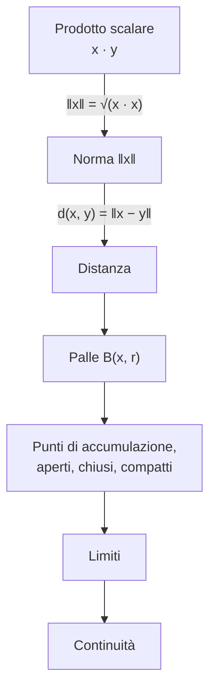

---

## corso: "Metodi Matematici per l'Ingegneria" lezione: 1 data: 2026-09-24 docente: Nicola Pinamonti argomenti: [informazioni sul corso, funzioni di più variabili, spazio Rn, norma, distanza, prodotto scalare, disuguaglianza di Cauchy-Schwarz, topologia di Rn, limiti, continuità] fonti: [trascrizione, appunti manuali, dispensa Morro] tags: [metodi-matematici, lezione]

---

# Lezione 1 — Lo spazio $\mathbb{R}^n$, funzioni di più variabili, limiti e continuità

La prima lezione apre il corso con le informazioni organizzative e poi entra nel primo grande blocco del programma, il calcolo differenziale per funzioni di più variabili. Prima di poter parlare di derivate occorre però fissare il linguaggio: che cosa si intende per funzione da un sottoinsieme di $\mathbb{R}^n$ a $\mathbb{R}^m$, quali strutture possiede lo spazio $\mathbb{R}^n$ (norma, distanza, prodotto scalare) e quali nozioni "topologiche" (palle, punti di accumulazione, insiemi aperti, chiusi e compatti) permettono di dare senso ai concetti di limite e di continuità. La lezione si chiude con un esempio di verifica di un limite in $\mathbb{R}^3$ tramite la definizione.

> [!note] Convenzioni di notazione usate in queste note 
> I vettori di $\mathbb{R}^n$ sono indicati in grassetto ($\mathbf{x}, \mathbf{y}, \mathbf{h}, \mathbf{v}$), le loro componenti in carattere normale ($x_1, \dots, x_n$). Un punto "fissato", che a lezione viene chiamato _x segnato_, è indicato con $\hat{\mathbf{x}}$, in accordo con gli appunti manuali. Gli scalari reali sono indicati con lettere greche o con $t, h$ quando hanno il ruolo di parametri.

## Informazioni sul corso

### Docenti, orario e organizzazione

Il corso è tenuto da due docenti. La prima parte, che copre i primi due punti del programma per circa 35 ore e si estende all'incirca fino a novembre, è svolta dal prof. **Nicola Pinamonti**; la seconda parte è affidata al prof. **Marco Benini**. Le lezioni si tengono il lunedì dalle 16 alle 19 e il venerdì dalle 14 alle 16, con inizio dopo il consueto quarto d'ora accademico. Per la lezione del lunedì il docente ha chiesto agli studenti, tramite i rappresentanti, di indicare se preferiscono una sola pausa a metà lezione oppure più pause. Il docente ha anche dichiarato l'intenzione di collocare gli argomenti più impegnativi nelle prime ore, lasciando l'ultima ora del lunedì a esercizi o a parti meno faticose, quando possibile.

Le lezioni si svolgono alla lavagna, senza slide. Sulla pagina AulaWeb del corso sono disponibili delle note di riferimento; per chi desidera approfondire viene consigliato il testo di Analisi 2 di Bacciotti e Ricci (_Lezioni di analisi matematica 2_, Levrotto & Bella) [@bacciottiricci]. Per comunicazioni o per fissare un ricevimento si può scrivere al docente, i cui contatti sono sulla sua pagina personale.

### Modalità d'esame

Sono previsti otto appelli: tipicamente tre tra gennaio e febbraio, quattro tra giugno e luglio e uno a settembre. Il docente ha sottolineato che, dato l'alto numero di studenti, non sarà possibile organizzare appelli straordinari.

L'esame consiste nella risoluzione di un esercizio scelto tra quelli "tipici" che verranno svolti durante il corso. Terminata la risoluzione, la soluzione viene letta insieme ai docenti e seguono alcune domande sugli argomenti presentati a lezione. La durata indicativa è di 40–45 minuti per studente. Nella pratica più studenti vengono esaminati contemporaneamente; negli anni passati quasi tutti gli appelli si sono conclusi in giornata, e solo in pochi casi è stato necessario proseguire il giorno successivo.

### Programma

Il programma è articolato in quattro parti.

1. **Calcolo differenziale per funzioni di più variabili.** Alcuni concetti sono già noti dal corso di Analisi 1, ma qui vengono ripresi e approfonditi, superando la restrizione a funzioni reali di una variabile reale e trattando funzioni di più variabili a valori vettoriali.
2. **Integrazione di funzioni di più variabili.** Le funzioni di più variabili permettono di descrivere curve e superfici nello spazio: non si tratterà solo di calcolare aree sotto il grafico di una funzione, come in Analisi 1, ma anche lunghezze di curve e aree di superfici immerse nello spazio. Fanno parte di questa sezione i teoremi della divergenza e del rotore, fondamentali, ad esempio, per comprendere la forma integrale delle equazioni di Maxwell.
3. **Serie di Fourier.** Lo strumento è centrale nella teoria dei segnali. L'interesse del corso non è tanto scrivere la serie o calcolarne i coefficienti, quanto capire _quando_ e _in che senso_ la serie approssima davvero un segnale, e quali condizioni fini garantiscono la convergenza.
4. **Analisi complessa**, cioè lo studio delle funzioni di variabile complessa. Questo capitolo fornisce tecniche più efficienti per calcolare integrali altrimenti inaccessibili; l'esempio emblematico è l'integrale della funzione _sinc_, $\int_{-\infty}^{+\infty} \frac{\sin x}{x},dx$, sul quale i metodi di Analisi 1 (integrazione per parti e simili) falliscono.

> [!tip] Approfondimento — Il valore dell'integrale della sinc #approfondimento 
> Con il teorema dei residui e il lemma di Jordan, che verranno trattati nella parte di analisi complessa, si ottiene $$\int_{-\infty}^{+\infty} \frac{\sin x}{x},dx = \pi .$$ La dispensa di riferimento svolge esattamente questo calcolo nel paragrafo dedicato alla funzione sinc, e ne deduce che la sinc normalizzata $\operatorname{sinc} x = \frac{\sin \pi x}{\pi x}$ ha integrale su $\mathbb{R}$ uguale a 1 [@morro2023, §6.7.2].

## Funzioni di più variabili a valori vettoriali

### Definizione

L'oggetto di studio del corso sono le funzioni (dette anche mappe o applicazioni) che il docente descrive come "macchinette": a ogni elemento di un insieme di partenza, il **dominio** $D$, associano uno e un solo elemento di un insieme di arrivo. La novità rispetto ad Analisi 1 è duplice: il dominio è un sottoinsieme di $\mathbb{R}^n$, e i valori assunti non sono necessariamente numeri reali ma possono essere collezioni ordinate di numeri reali, cioè elementi di $\mathbb{R}^m$.

> [!important] Definizione — Funzione di più variabili 
> Una funzione $f : D \subseteq \mathbb{R}^n \to \mathbb{R}^m$ è una legge che a ogni $\mathbf{x} \in D$ associa un unico elemento di $\mathbb{R}^m$: $$\forall, \mathbf{x} \in D \quad \exists!, \mathbf{y} \in \mathbb{R}^m \ : \ f(\mathbf{x}) = \mathbf{y}.$$

### Esempi dalla fisica

Le funzioni di questo tipo compaiono continuamente nella descrizione del mondo fisico. Si pensi alla temperatura di un'aula: fissato un sistema di riferimento con tre assi $x, y, z$, ogni punto della stanza è individuato da una terna $(x, y, z)$ e, con un termometro sufficientemente preciso, a ciascun punto si può associare il valore della temperatura in quel punto. Si ottiene così una funzione $T : D \subseteq \mathbb{R}^3 \to \mathbb{R}$ il cui valore è uno **scalare**, cioè un singolo numero reale (una volta fissata l'unità di misura).

La situazione è più ricca se si vuole descrivere come si muove l'aria nella stessa stanza. In ogni punto le particelle che compongono l'aria hanno una velocità, cioè una direzione di moto e un'intensità: per descriverla servono tre numeri, le tre componenti del vettore velocità. La funzione che a ogni punto associa la velocità dell'aria è quindi del tipo $\mathbf{v} : D \subseteq \mathbb{R}^3 \to \mathbb{R}^3$, una funzione **a valori vettoriali**. Lo stesso accade per il campo elettrico e il campo magnetico, che associano a ogni punto dello spazio un vettore. Il potenziale della forza gravitazionale, una volta fissato il riferimento, è invece di nuovo una funzione da una regione di $\mathbb{R}^3$ in $\mathbb{R}$.

### La "dichiarazione" di una funzione

Il docente insiste su un punto concettuale: la scrittura $f : D \subseteq \mathbb{R}^n \to \mathbb{R}^m$ contiene già un'informazione precisa, cioè _di che tipo_ sono gli oggetti che si possono dare in ingresso alla funzione (elementi di $D$, quindi $n$-uple) e di che tipo è il risultato (elementi di $\mathbb{R}^m$). È l'analogo matematico della **dichiarazione** di una funzione in un linguaggio di programmazione, dove si specificano il tipo degli argomenti e il tipo del valore restituito. Se si passa a una funzione un argomento del tipo sbagliato, ad esempio un singolo numero dove è richiesto un vettore di $\mathbb{R}^n$, il programma non compila; allo stesso modo il ragionamento matematico non può proseguire. La **definizione** vera e propria della funzione, cioè la regola che assegna il valore, è un passo successivo.

```c
/* Analogia (illustrativa): dichiarazioni in C */
double temperatura(const double p[3]);             /* T : R^3 -> R   (valori scalari)    */
void   velocita(const double p[3], double v[3]);  /* v : R^3 -> R^3 (valori vettoriali) */
/* temperatura(2.5);  -> errore di compilazione: tipo dell'argomento sbagliato */
```

## Richiami sullo spazio $\mathbb{R}^n$

Per lavorare con queste funzioni bisogna sapere con che cosa si sta lavorando, esattamente come in programmazione occorre conoscere i tipi di dato. Il docente dedica quindi una parte della lezione a un breve ripasso dei concetti di geometria relativi a $\mathbb{R}^n$.

### $n$-uple e notazioni

$\mathbb{R}^n$ è l'insieme delle $n$-uple ordinate di numeri reali. Un suo elemento è $$\mathbf{x} = (x_1, x_2, \dots, x_n), \qquad x_i \in \mathbb{R} \quad \forall, i \in {1, \dots, n}.$$

Nel corso si useranno, a seconda della comodità, diverse notazioni equivalenti per lo stesso oggetto: $\underline{x}$, $\vec{x}$, $\mathbf{x}$, oppure semplicemente $x$ quando non c'è ambiguità. Le componenti si possono elencare in riga, $(x_1, \dots, x_n)$, oppure in colonna, $$\mathbf{x} = \begin{pmatrix} x_1 \ x_2 \ \vdots \ x_n \end{pmatrix},$$ forma che risulta più comoda quando si usa il calcolo matriciale.

### Struttura di spazio vettoriale e base canonica

$\mathbb{R}^n$ è uno **spazio vettoriale**: i suoi elementi si possono sommare, moltiplicare per scalari e quindi combinare linearmente. Dati $\mathbf{x} = (x_1, \dots, x_n)$, $\mathbf{y} = (y_1, \dots, y_n)$ e $\lambda_1, \lambda_2 \in \mathbb{R}$, la combinazione lineare si calcola componente per componente: $$\lambda_1 \mathbf{x} + \lambda_2 \mathbf{y} = (\lambda_1 x_1 + \lambda_2 y_1, \ \dots, \ \lambda_1 x_n + \lambda_2 y_n) \in \mathbb{R}^n.$$

La dimensione di $\mathbb{R}^n$ è $n$, cioè il numero di componenti che si possono scegliere liberamente. Una base naturale è la **base canonica** ${\mathbf{e}_i}_{i \in {1, \dots, n}}$, in cui il vettore $\mathbf{e}_i$ ha la componente $i$-esima uguale a 1 e tutte le altre nulle: $$\mathbf{e}_1 = \begin{pmatrix} 1 \ 0 \ \vdots \ 0 \end{pmatrix}, \quad \mathbf{e}_2 = \begin{pmatrix} 0 \ 1 \ \vdots \ 0 \end{pmatrix}, \quad \dots, \quad \mathbf{e}_n = \begin{pmatrix} 0 \ 0 \ \vdots \ 1 \end{pmatrix}.$$

Dire che si tratta di una base significa che ogni vettore si scrive in modo unico come combinazione lineare dei suoi elementi. Per la base canonica i coefficienti della scomposizione sono proprio le componenti del vettore: $$\mathbf{x} = x_1 \mathbf{e}_1 + x_2 \mathbf{e}_2 + \dots + x_n \mathbf{e}_n = \sum_{i=1}^{n} x_i \mathbf{e}_i .$$ La scrittura con la sommatoria è compatta e verrà usata spesso.

### Norma

Per misurare la "lunghezza" di un vettore $\mathbf{x} \in \mathbb{R}^n$ si generalizza il teorema di Pitagora a $n$ dimensioni: si sommano i quadrati delle componenti e si estrae la radice.

> [!important] Definizione — Norma (modulo) euclidea $$\lVert \mathbf{x} \rVert = \sqrt{x_1^2 + x_2^2 + \dots + x_n^2} = \sqrt{\sum_{i=1}^{n} x_i^2}.$$ Si usa anche la notazione $|\mathbf{x}|$ e il nome _modulo_ di $\mathbf{x}$.

Questa operazione è un esempio di **norma**, cioè una funzione che soddisfa le seguenti tre proprietà, che sono esattamente quelle richieste a qualunque norma.

**Positività.** Per ogni $\mathbf{x}$ si ha $\lVert \mathbf{x} \rVert \ge 0$; inoltre $\lVert \mathbf{x} \rVert = 0$ se e solo se $\mathbf{x} = \mathbf{0}$, cioè l'unico vettore di lunghezza nulla è l'origine.

**Omogeneità.** Per ogni $\lambda \in \mathbb{R}$ e ogni $\mathbf{x} \in \mathbb{R}^n$, $$\lVert \lambda \mathbf{x} \rVert = |\lambda| , \lVert \mathbf{x} \rVert .$$ Moltiplicare un vettore per $\lambda$ lo allunga o lo accorcia di un fattore $|\lambda|$ (ed eventualmente ne inverte il verso). Il docente osserva che si tratta di "un pezzettino di linearità", che però funziona solo con il valore assoluto di $\lambda$ e solo rispetto alla moltiplicazione per scalari: in generale la norma di una somma _non_ è la somma delle norme.

**Disuguaglianza triangolare.** Per ogni $\mathbf{x}, \mathbf{y} \in \mathbb{R}^n$, $$\lVert \mathbf{x} + \mathbf{y} \rVert \le \lVert \mathbf{x} \rVert + \lVert \mathbf{y} \rVert .$$ Disegnando $\mathbf{x}$ e $\mathbf{y}$ con la regola del parallelogramma, $\mathbf{x} + \mathbf{y}$ è la diagonale: la sua lunghezza non supera la somma delle lunghezze dei due lati, come in ogni triangolo.

### Distanza

La norma permette di misurare non solo la lunghezza dei vettori ma anche la distanza tra due punti. Per misurare la distanza tra $\mathbf{x}$ e $\mathbf{y}$ si costruisce il vettore che va dall'uno all'altro e se ne misura la lunghezza.

> [!important] Definizione — Distanza euclidea $$d(\mathbf{x}, \mathbf{y}) = \lVert \mathbf{x} - \mathbf{y} \rVert, \qquad \mathbf{x}, \mathbf{y} \in \mathbb{R}^n .$$

Le proprietà della norma si traducono in tre proprietà della distanza. È **positiva**: $d(\mathbf{x}, \mathbf{y}) \ge 0$ per ogni coppia di punti, e $d(\mathbf{x}, \mathbf{y}) = 0$ se e solo se $\mathbf{x} = \mathbf{y}$. È **simmetrica**: $d(\mathbf{x}, \mathbf{y}) = d(\mathbf{y}, \mathbf{x})$, perché scambiare $\mathbf{x}$ e $\mathbf{y}$ equivale a moltiplicare il vettore $\mathbf{x} - \mathbf{y}$ per $-1$ e, per omogeneità, $\lVert -(\mathbf{x} - \mathbf{y}) \rVert = |-1|, \lVert \mathbf{x} - \mathbf{y} \rVert$. Infine soddisfa la **disuguaglianza triangolare**: per ogni $\mathbf{x}, \mathbf{y}, \mathbf{z} \in \mathbb{R}^n$ $$d(\mathbf{x}, \mathbf{y}) \le d(\mathbf{x}, \mathbf{z}) + d(\mathbf{z}, \mathbf{y}),$$ che discende da quella della norma scrivendo $\mathbf{x} - \mathbf{y} = (\mathbf{x} - \mathbf{z}) + (\mathbf{z} - \mathbf{y})$: passare per un punto intermedio $\mathbf{z}$ non può accorciare il percorso.

### Prodotto scalare

$\mathbb{R}^n$ è dotato in modo naturale di un **prodotto scalare**, indicato con un punto, che prende una coppia di vettori e restituisce uno scalare.

> [!important] Definizione — Prodotto scalare standard $$\cdot \ : \ \mathbb{R}^n \times \mathbb{R}^n \to \mathbb{R}, \qquad \mathbf{x} \cdot \mathbf{y} = x_1 y_1 + x_2 y_2 + \dots + x_n y_n = \sum_{i=1}^{n} x_i y_i .$$

Il prodotto scalare è una forma **bilineare, simmetrica e definita positiva**.

La **bilinearità** significa che il prodotto è lineare in ciascuno dei due argomenti separatamente. Per il primo argomento, dati $\mathbf{x}_1, \mathbf{x}_2, \mathbf{y} \in \mathbb{R}^n$ e $\alpha_1, \alpha_2 \in \mathbb{R}$, si può calcolare prima la combinazione lineare e poi il prodotto, oppure distribuire il prodotto sulla somma: $$(\alpha_1 \mathbf{x}_1 + \alpha_2 \mathbf{x}_2) \cdot \mathbf{y} = \alpha_1 , (\mathbf{x}_1 \cdot \mathbf{y}) + \alpha_2 , (\mathbf{x}_2 \cdot \mathbf{y}),$$ e la stessa proprietà vale per il secondo argomento (altrimenti il prodotto sarebbe soltanto lineare e non bilineare).

La **simmetria**, $\mathbf{x} \cdot \mathbf{y} = \mathbf{y} \cdot \mathbf{x}$, è immediata: i termini $x_i y_i$ sono prodotti di numeri reali, che commutano.

L'essere **definito positivo** significa che $\mathbf{x} \cdot \mathbf{x} \ge 0$ per ogni $\mathbf{x}$, e che $\mathbf{x} \cdot \mathbf{x} = 0$ solo se $\mathbf{x} = \mathbf{0}$. Del resto $\mathbf{x} \cdot \mathbf{x} = \sum_i x_i^2$, per cui il prodotto scalare di un vettore con sé stesso è il quadrato della sua norma: $$\mathbf{x} \cdot \mathbf{x} = \lVert \mathbf{x} \rVert^2 .$$ Questo legame tra prodotto scalare e norma è quello che viene usato nella dimostrazione seguente.

### La disuguaglianza di Cauchy–Schwarz

Norma e prodotto scalare "si comportano bene" l'una rispetto all'altro, nel senso precisato dalla seguente proposizione.

> [!important] Proposizione — Disuguaglianza di Cauchy–Schwarz Per ogni $\mathbf{x}, \mathbf{y} \in \mathbb{R}^n$ $$|\mathbf{x} \cdot \mathbf{y}| \le \lVert \mathbf{x} \rVert , \lVert \mathbf{y} \rVert .$$

In parole: il prodotto scalare di due vettori è un numero il cui valore assoluto è controllato dal prodotto delle lunghezze dei due vettori.

**Dimostrazione.** Se uno dei due vettori è nullo la tesi è ovvia, perché entrambi i membri valgono zero. Si suppone allora $\mathbf{y} \neq \mathbf{0}$. L'idea è sfruttare la positività del prodotto scalare: per ogni $\lambda \in \mathbb{R}$ il vettore $\mathbf{x} + \lambda \mathbf{y}$ ha prodotto scalare non negativo con sé stesso. Sviluppando con la bilinearità e la simmetria (il "prodotto misto" compare due volte) si ottiene, per ogni $\lambda \in \mathbb{R}$, $$\begin{aligned} 0 \le (\mathbf{x} + \lambda \mathbf{y}) \cdot (\mathbf{x} + \lambda \mathbf{y}) &= \mathbf{x} \cdot \mathbf{x} + 2\lambda , (\mathbf{x} \cdot \mathbf{y}) + \lambda^2 , \mathbf{y} \cdot \mathbf{y} \ &= \lVert \mathbf{y} \rVert^2 \lambda^2 + 2 (\mathbf{x} \cdot \mathbf{y}) , \lambda + \lVert \mathbf{x} \rVert^2 . \end{aligned}$$

L'espressione ottenuta, pensata come funzione di $\lambda$, è un polinomio di secondo grado: il suo grafico è una parabola, rivolta verso l'alto perché il coefficiente $\lVert \mathbf{y} \rVert^2$ è strettamente positivo. Il fatto che il polinomio sia non negativo per _ogni_ $\lambda$ significa che la parabola non scende mai sotto l'asse delle ascisse: al più lo tocca in un punto. Questo è possibile solo se l'equazione associata non ha due radici reali distinte, cioè se il **discriminante** è minore o uguale a zero: $$\Delta = 4 (\mathbf{x} \cdot \mathbf{y})^2 - 4 \lVert \mathbf{x} \rVert^2 \lVert \mathbf{y} \rVert^2 \le 0 .$$

Rileggendo questa condizione si ottiene $(\mathbf{x} \cdot \mathbf{y})^2 \le \lVert \mathbf{x} \rVert^2 \lVert \mathbf{y} \rVert^2$ e, estraendo la radice quadrata (la radice di un quadrato è il valore assoluto), la tesi: $$|\mathbf{x} \cdot \mathbf{y}| \le \lVert \mathbf{x} \rVert , \lVert \mathbf{y} \rVert . \qquad$$

> [!warning] Discrepanza tra fonti: valore assoluto Nella versione Markdown degli appunti l'ultimo passaggio è scritto senza valore assoluto, $(\mathbf{x} \cdot \mathbf{y}) \le \lVert \mathbf{x} \rVert \lVert \mathbf{y} \rVert$, e nello sviluppo manca un quadrato su $\lambda$ davanti a $\lVert \mathbf{y} \rVert^2$. La trascrizione e gli appunti scritti a mano riportano correttamente $\lambda^2$ e il valore assoluto, che è essenziale: la disuguaglianza senza modulo è più debole e non controlla i prodotti scalari negativi.

> [!tip] Approfondimento — Caso di uguaglianza e disuguaglianza triangolare #approfondimento 
> La stessa dimostrazione dice anche _quando_ vale l'uguaglianza. Se $\mathbf{y} \neq \mathbf{0}$, si ha $|\mathbf{x} \cdot \mathbf{y}| = \lVert \mathbf{x} \rVert \lVert \mathbf{y} \rVert$ esattamente quando $\Delta = 0$, cioè quando la parabola ha una radice (doppia) $\lambda_0$. In quel caso $\lVert \mathbf{x} + \lambda_0 \mathbf{y} \rVert^2 = 0$, quindi $\mathbf{x} = -\lambda_0 \mathbf{y}$: l'uguaglianza vale se e solo se i due vettori sono paralleli.
> 
> Cauchy–Schwarz fornisce inoltre una dimostrazione della disuguaglianza triangolare per la norma: $$\lVert \mathbf{x} + \mathbf{y} \rVert^2 = \lVert \mathbf{x} \rVert^2 + 2, \mathbf{x} \cdot \mathbf{y} + \lVert \mathbf{y} \rVert^2 \le \lVert \mathbf{x} \rVert^2 + 2 \lVert \mathbf{x} \rVert \lVert \mathbf{y} \rVert + \lVert \mathbf{y} \rVert^2 = \big( \lVert \mathbf{x} \rVert + \lVert \mathbf{y} \rVert \big)^2 ,$$ da cui la tesi estraendo la radice. Entrambi i risultati, insieme a una dimostrazione alternativa di Cauchy–Schwarz basata sulla scomposizione di $\mathbf{x}$ in una parte parallela e una ortogonale a $\mathbf{y}$, si trovano nel primo paragrafo della dispensa di riferimento [@morro2023, §1.1].

Lo schema seguente riassume la catena di strutture costruite finora e il loro ruolo nel resto della lezione: ciascuna è definita a partire dalla precedente.



## Dominio, immagine e componenti di una funzione

Si torna ora alle funzioni $f : D \subseteq \mathbb{R}^n \to \mathbb{R}^m$. Il docente le rappresenta disegnando da una parte della lavagna $\mathbb{R}^n$, con dentro il dominio $D$ (che può avere forme qualsiasi, ad esempio una regione "compatta" più un punto isolato), e dall'altra $\mathbb{R}^m$, dove finiscono i valori della funzione.

Il **dominio** $D$ è l'insieme in cui la funzione è definita. Non è detto che tutti i punti di $\mathbb{R}^m$ siano raggiunti dalla funzione, e in generale non lo saranno: l'insieme dei valori effettivamente assunti si chiama immagine.

> [!important] Definizione — Immagine di una funzione L'immagine di $D$ tramite $f$, o immagine di $f$, è $$f(D) = { \mathbf{y} \in \mathbb{R}^m \ : \ \exists, \mathbf{x} \in D \text{ tale che } f(\mathbf{x}) = \mathbf{y} }.$$

> [!warning] Discrepanza tra fonti: refuso negli appunti Nella versione Markdown degli appunti l'immagine è scritta come sottoinsieme di $\mathbb{R}^n$ e la condizione $f(\mathbf{x}) = \mathbf{y}$ è spostata fuori dall'insieme. Trascrizione e appunti a mano concordano sulla forma corretta riportata sopra: l'immagine è un sottoinsieme dello spazio di arrivo $\mathbb{R}^m$.

Un'osservazione molto importante riguarda la struttura dei valori. Se $\mathbf{x} \in D$, il valore $f(\mathbf{x})$ è un elemento di $\mathbb{R}^m$, quindi una $m$-upla di numeri reali: $$f(\mathbf{x}) = \big( f_1(\mathbf{x}), , f_2(\mathbf{x}), , \dots, , f_m(\mathbf{x}) \big).$$ Ciascuna **componente** $f_i$ è a sua volta una funzione, che prende in ingresso gli stessi elementi del dominio ma restituisce un numero reale: $$f_i : D \subseteq \mathbb{R}^n \to \mathbb{R}, \qquad i \in {1, \dots, m}.$$ Le funzioni a valori vettoriali non sono quindi altro che **collezioni di $m$ funzioni a valori reali**. Questa proprietà verrà usata spesso: invece di studiare direttamente una funzione a valori vettoriali, molte volte basterà conoscere le proprietà delle sue componenti per trarre le conclusioni desiderate.

## Nozioni topologiche in $\mathbb{R}^n$

Un dominio formato da una regione "tutta attaccata", in cui ci si può spostare con continuità da un punto all'altro, è ben diverso da un dominio che contiene anche un punto isolato. Per distinguere queste situazioni, e soprattutto per dare senso alla nozione di limite, servono alcune definizioni di carattere topologico, cioè legate ai concetti di vicinanza e di "stare dentro" o "stare sul bordo" di un insieme. Tutte si basano sulla distanza introdotta sopra.

### Intorno sferico (palla)

> [!important] Definizione — Intorno sferico (palla aperta) Dati $\mathbf{x} \in \mathbb{R}^n$ e $r > 0$, l'intorno sferico di centro $\mathbf{x}$ e raggio $r$, detto anche palla di centro $\mathbf{x}$ e raggio $r$, è $$B(\mathbf{x}, r) = { \mathbf{y} \in \mathbb{R}^n \ : \ \lVert \mathbf{x} - \mathbf{y} \rVert < r }.$$

La palla è l'insieme dei punti che distano da $\mathbf{x}$ meno di $r$; dipende quindi dal centro e dal raggio. In $\mathbb{R}$ è l'intervallo aperto $(x - r, x + r)$, in $\mathbb{R}^2$ è un disco, in $\mathbb{R}^3$ è l'interno di una sfera. È importante che nella definizione compaia il **minore stretto**: la "buccia" della palla, cioè la sfera dei punti a distanza esattamente $r$ dal centro, **non** appartiene all'intorno sferico.

### Punti di accumulazione

> [!important] Definizione — Punto di accumulazione Siano $A \subseteq \mathbb{R}^n$ e $\mathbf{x} \in \mathbb{R}^n$. Il punto $\mathbf{x}$ è un punto di accumulazione per $A$ se $$\forall, r > 0 \qquad \big( B(\mathbf{x}, r) \setminus {\mathbf{x}} \big) \cap A \neq \varnothing .$$

L'idea è la seguente: si prende una palla centrata nel punto da testare, si "fa un buco" nel centro togliendo il punto stesso, e si guarda se rimangono elementi di $A$. Il punto è di accumulazione se questo accade _comunque piccolo_ sia il raggio: per quanto ci si restringa attorno a $\mathbf{x}$, si trovano sempre punti di $A$ diversi da $\mathbf{x}$. Il raggio deve essere strettamente positivo, altrimenti la palla sarebbe vuota e la condizione non avrebbe senso.

Il docente esamina tre tipi di punti, illustrati nella figura seguente.

<svg viewBox="0 0 560 300" width="560" style="display:block;margin:1em auto;max-width:100%;height:auto;font-family:inherit" xmlns="http://www.w3.org/2000/svg"><path d="M 70,160 C 70,60 220,40 300,80 C 380,120 370,235 280,255 C 190,275 70,250 70,160 Z" fill="currentColor" fill-opacity="0.08" stroke="currentColor" stroke-width="1.6" stroke-dasharray="6 4"/><text x="110" y="110" font-size="18" text-anchor="start" fill="currentColor" font-style="italic">A</text><circle cx="180" cy="170" r="42" fill="#3b82f6" fill-opacity="0.12" stroke="#3b82f6" stroke-width="1.6"/><circle cx="180" cy="170" r="3.5" fill="currentColor"/><text x="180" y="228" font-size="12" text-anchor="middle" fill="currentColor">interno</text><circle cx="300" cy="80" r="34" fill="#3b82f6" fill-opacity="0.12" stroke="#3b82f6" stroke-width="1.6"/><circle cx="300" cy="80" r="3.5" fill="currentColor"/><text x="340" y="40" font-size="12" text-anchor="start" fill="currentColor">di frontiera: di accumulazione,</text><text x="340" y="56" font-size="12" text-anchor="start" fill="currentColor">ma non interno</text><circle cx="460" cy="190" r="30" fill="#3b82f6" fill-opacity="0.12" stroke="#3b82f6" stroke-width="1.6"/><circle cx="460" cy="190" r="3.5" fill="currentColor"/><text x="460" y="240" font-size="12" text-anchor="middle" fill="currentColor">isolato: appartiene ad A,</text><text x="460" y="256" font-size="12" text-anchor="middle" fill="currentColor">non è di accumulazione</text></svg>

Un punto che sta "ben dentro" la regione è di accumulazione: qualunque palla centrata in esso, anche bucata nel centro, contiene altri punti di $A$. Un punto isolato invece non lo è: scegliendo una palla abbastanza piccola e togliendo il centro si butta via l'unico elemento di $A$ presente, e l'intersezione è vuota. Un punto che appartiene ad $A$ ma non è di accumulazione si dice appunto **punto isolato**.

Il caso più interessante è quello di un punto sul bordo della regione (cioè un punto tale che ogni palla centrata in esso contiene sia punti di $A$ sia punti del complementare). Comunque si scelga il raggio, da una parte della palla non c'è nulla di $A$, ma dall'altra parte c'è sempre qualcosa: l'intersezione non è mai vuota, quindi il punto è di accumulazione. Questo vale **sia che il punto del bordo appartenga ad $A$, sia che non vi appartenga**: un punto di accumulazione non deve necessariamente stare nell'insieme.

> [!example] Esempio — 
> Un punto di accumulazione che non appartiene all'insieme Si consideri la palla $B(\mathbf{y}, R)$ e un punto $\mathbf{x}$ sulla sua sfera di bordo, cioè con $\lVert \mathbf{x} - \mathbf{y} \rVert = R$. Per la definizione di palla, con il minore stretto, $\mathbf{x} \notin B(\mathbf{y}, R)$. Tuttavia ogni palla centrata in $\mathbf{x}$, comunque piccola e anche privata del centro, interseca $B(\mathbf{y}, R)$. Quindi $\mathbf{x}$ è punto di accumulazione per $B(\mathbf{y}, R)$ pur non appartenendovi.

### Insiemi limitati

> [!important] Definizione — Insieme limitato $A \subseteq \mathbb{R}^n$ è limitato se esiste $M > 0$ tale che $A \subseteq B(\mathbf{0}, M)$.

Un insieme è limitato se lo si può racchiudere in una palla centrata nell'origine, pur di prenderla abbastanza grande.

### Insiemi aperti e chiusi

> [!important] Definizione — Insieme aperto $A \subseteq \mathbb{R}^n$ è aperto se per ogni $\mathbf{x} \in A$ esiste $r > 0$ tale che $B(\mathbf{x}, r) \subseteq A$.

Il raggio può dipendere dal punto e può essere piccolo quanto serve. Una regione senza il suo bordo è aperta: da qualunque punto si riesce sempre a isolare una pallina interamente contenuta nell'insieme; avvicinandosi al bordo basta prendere palline più piccole. Se però l'insieme contenesse un punto del bordo, in quel punto non si troverebbe nessun raggio adatto, perché ogni palla centrata lì "sborda" fuori dall'insieme. Un aperto, quindi, non contiene nessuno dei suoi punti di bordo.

> [!important] Definizione — Insieme chiuso $A \subseteq \mathbb{R}^n$ è chiuso se il suo complementare $A^{c} = \mathbb{R}^n \setminus A$ è aperto.

Ad esempio, una palla a cui si aggiunge la sua sfera di bordo è un insieme chiuso, perché il suo complementare è aperto. Come si vede da questi esempi, l'essere aperto o chiuso dipende in modo cruciale da ciò che succede sul bordo dell'insieme.

### Insiemi compatti

> [!important] Definizione — Insieme compatto $A \subseteq \mathbb{R}^n$ è compatto se è chiuso e limitato.

I compatti sono molto importanti perché molti teoremi dell'analisi li riguardano. Il docente cita come esempio il **teorema di Weierstrass**: una funzione continua a valori reali definita su un compatto ammette sempre massimo e minimo.

### Esempi

Le definizioni si possono verificare su alcuni insiemi semplici. In $\mathbb{R}$ le palle sono intervalli aperti simmetrici rispetto al centro, e questo rende i controlli immediati.

L'intervallo $(a, b) \subseteq \mathbb{R}$, con estremi esclusi, è aperto: attorno a ogni suo punto si trova un intervallino simmetrico interamente contenuto in $(a, b)$. L'intervallo $[a, b]$, con gli estremi inclusi, è chiuso (il suo complementare $(-\infty, a) \cup (b, +\infty)$ è aperto) e limitato, quindi compatto. L'intervallo $[a, b)$ non è né aperto né chiuso: non è aperto perché nessun intervallo centrato in $a$ è contenuto in $[a, b)$; non è chiuso perché il complementare $(-\infty, a) \cup [b, +\infty)$ non è aperto nel punto $b$. Essendo $a$ e $b$ finiti, è comunque limitato.

In $\mathbb{R}^n$ la palla $B(\mathbf{x}, r)$ è un insieme aperto. Se invece si prendono i punti a distanza da $\mathbf{x}$ _minore o uguale_ a $r$, cioè si aggiunge la sfera di bordo, si ottiene la **palla chiusa**, indicata con una barra: $$\overline{B(\mathbf{x}, r)} = { \mathbf{y} \in \mathbb{R}^n \ : \ \lVert \mathbf{x} - \mathbf{y} \rVert \le r },$$ che è un insieme chiuso.

|Insieme|Aperto|Chiuso|Limitato|Compatto|
|:--|:-:|:-:|:-:|:-:|
|$(a, b) \subseteq \mathbb{R}$|sì|no|sì|no|
|$[a, b] \subseteq \mathbb{R}$|no|sì|sì|sì|
|$[a, b) \subseteq \mathbb{R}$|no|no|sì|no|
|$B(\mathbf{x}, r) \subseteq \mathbb{R}^n$|sì|no|sì|no|
|$\overline{B(\mathbf{x}, r)} \subseteq \mathbb{R}^n$|no|sì|sì|sì|

> [!warning] Discrepanza tra fonti: l'intervallo $[a, b)$ In questo punto la trascrizione è confusa ("non è chiuso ma è anche aperto"). Gli appunti a mano riportano che $[a, b)$ "non è né aperto né chiuso, è limitato", che è la conclusione corretta e coerente con le definizioni; negli appunti in Markdown l'insieme è indicato per refuso come sottoinsieme di $\mathbb{R}^n$ anziché di $\mathbb{R}$.

> [!tip] Approfondimento — Perché la palla è aperta #approfondimento A lezione il fatto che $B(\mathbf{x}, r)$ sia aperta è stato dato come evidente; la verifica usa la disuguaglianza triangolare. Sia $\mathbf{y} \in B(\mathbf{x}, r)$ e sia $\rho = r - \lVert \mathbf{y} - \mathbf{x} \rVert > 0$. Per ogni $\mathbf{z} \in B(\mathbf{y}, \rho)$ si ha $$\lVert \mathbf{z} - \mathbf{x} \rVert \le \lVert \mathbf{z} - \mathbf{y} \rVert + \lVert \mathbf{y} - \mathbf{x} \rVert < \rho + \lVert \mathbf{y} - \mathbf{x} \rVert = r,$$ quindi $B(\mathbf{y}, \rho) \subseteq B(\mathbf{x}, r)$: ogni punto della palla ha attorno a sé una palla più piccola ancora contenuta in essa. È lo stesso argomento con cui si dimostra che ogni intorno è un insieme aperto [@rudin1976, Teor. 2.19].

> [!tip] Approfondimento — Compattezza, Heine–Borel e Weierstrass #approfondimento Nella topologia generale la compattezza si definisce in un altro modo (ogni ricoprimento dell'insieme con aperti ammette un sottoricoprimento finito). In $\mathbb{R}^n$ questa definizione è equivalente all'essere chiuso e limitato: è il contenuto del **teorema di Heine–Borel** [@rudin1976, Teor. 2.41], che giustifica la definizione operativa usata a lezione. Il teorema di Weierstrass citato dal docente, nella forma "una funzione reale continua su un compatto assume massimo e minimo", è enunciato e dimostrato in [@rudin1976, pp. 89–90].
> 
> Si noti anche che "aperto" e "chiuso" non sono nozioni opposte: $[a, b)$ non è né l'uno né l'altro, mentre l'insieme vuoto e l'intero $\mathbb{R}^n$ sono contemporaneamente aperti e chiusi (ciascuno è il complementare dell'altro, ed entrambi sono aperti in base alla definizione).

## Limiti di funzioni di più variabili

Le nozioni topologiche servono, in ultima analisi, per descrivere il comportamento di una funzione vicino a un punto prefissato, cioè per costruire l'operazione di limite.

> [!important] Definizione — Limite Siano $f : A \subseteq \mathbb{R}^n \to \mathbb{R}^m$ e $\hat{\mathbf{x}} \in \mathbb{R}^n$ un punto di accumulazione per $A$. Si dice che $\mathbf{L} \in \mathbb{R}^m$ è il limite di $f$ per $\mathbf{x}$ che tende a $\hat{\mathbf{x}}$, e si scrive $$\lim_{\mathbf{x} \to \hat{\mathbf{x}}} f(\mathbf{x}) = \mathbf{L},$$ se $$\forall, \varepsilon > 0 \ \ \exists, \delta_\varepsilon > 0 \ \text{ tale che } \ \forall, \mathbf{x} \in A, \quad 0 < \lVert \mathbf{x} - \hat{\mathbf{x}} \rVert < \delta_\varepsilon \ \Longrightarrow \ \lVert f(\mathbf{x}) - \mathbf{L} \rVert < \varepsilon .$$

La definizione dice che, fissata una tolleranza $\varepsilon$ sui valori della funzione, si deve saper trovare una soglia di vicinanza $\delta_\varepsilon$ tale che tutti i punti del dominio abbastanza vicini a $\hat{\mathbf{x}}$, cioè a distanza minore di $\delta_\varepsilon$, abbiano immagine distante da $\mathbf{L}$ meno di $\varepsilon$. In pratica, **verificare un limite significa costruire una regola che a ogni $\varepsilon$ assegna un $\delta_\varepsilon$** che "fa il gioco".

Alcuni dettagli della definizione meritano attenzione. Le due norme vivono in spazi diversi: $\lVert \mathbf{x} - \hat{\mathbf{x}} \rVert$ è calcolata in $\mathbb{R}^n$, $\lVert f(\mathbf{x}) - \mathbf{L} \rVert$ in $\mathbb{R}^m$. La condizione $0 < \lVert \mathbf{x} - \hat{\mathbf{x}} \rVert$ esclude il punto $\hat{\mathbf{x}}$ stesso: il limite descrive il comportamento della funzione _vicino_ a $\hat{\mathbf{x}}$, e non dipende dal valore in $\hat{\mathbf{x}}$, che potrebbe anche non essere definito. È proprio per questo che si richiede che $\hat{\mathbf{x}}$ sia un punto di accumulazione del dominio: deve esserci la garanzia di trovare punti di $A$ diversi da $\hat{\mathbf{x}}$ arbitrariamente vicini a esso, altrimenti la definizione sarebbe priva di contenuto.

## Continuità

> [!important] Definizione — Funzione continua Siano $f : D \subseteq \mathbb{R}^n \to \mathbb{R}^m$ e $\hat{\mathbf{x}} \in D$ un punto di accumulazione per $D$. La funzione $f$ è continua in $\hat{\mathbf{x}}$ se $$\lim_{\mathbf{x} \to \hat{\mathbf{x}}} f(\mathbf{x}) = f(\hat{\mathbf{x}}).$$ Se $f$ è continua in ogni punto di un insieme $A$ (i cui punti sono tutti di accumulazione), si dice che $f$ è continua in $A$.

Rispetto alla definizione di limite, qui il punto $\hat{\mathbf{x}}$ deve appartenere al dominio, perché il valore $f(\hat{\mathbf{x}})$ deve esistere, e il limite deve coincidere con esso. Per verificare la continuità in un punto basta quindi controllare un limite; per la continuità su un insieme bisogna controllare che questo accada in tutti i suoi punti.

## Esempio svolto: verifica di un limite in $\mathbb{R}^3$

> [!example] Esempio — Limite all'origine di una funzione razionale Si consideri la funzione $f : \mathbb{R}^3 \setminus {\mathbf{0}} \to \mathbb{R}$ $$f(x, y, z) = \frac{x, y, z^3}{x^4 + y^4 + z^4},$$ definita ovunque tranne nell'origine, dove il denominatore si annulla. L'origine è un punto di accumulazione del dominio, e si vuole verificare che $$\lim_{\mathbf{x} = (x, y, z) \to \mathbf{0}} f(\mathbf{x}) = 0 .$$
> 
> **Idea: separare distanza e direzione.** Ogni $\mathbf{x} \neq \mathbf{0}$ si scrive come $\mathbf{x} = t, \mathbf{v}$, con $$t = \lVert \mathbf{x} \rVert > 0, \qquad \mathbf{v} = \frac{\mathbf{x}}{\lVert \mathbf{x} \rVert} = (a, b, c), \qquad \lVert \mathbf{v} \rVert = \sqrt{a^2 + b^2 + c^2} = 1 .$$ Il parametro $t$ misura la distanza dall'origine, il versore $\mathbf{v}$ (vettore di norma 1) la direzione. La divisione per $\lVert \mathbf{x} \rVert$ è lecita proprio perché l'origine è esclusa dal dominio.
> 
> **Raccolta delle potenze di $t$.** Sostituendo $x = ta$, $y = tb$, $z = tc$: $$f(\mathbf{x}) = \frac{(ta)(tb)(tc)^3}{(ta)^4 + (tb)^4 + (tc)^4} = \frac{t^5}{t^4} \cdot \frac{a, b, c^3}{a^4 + b^4 + c^4} = t \cdot g(\mathbf{v}), \qquad g(a, b, c) = \frac{a, b, c^3}{a^4 + b^4 + c^4}.$$ Il numeratore è omogeneo di grado $1 + 1 + 3 = 5$ e il denominatore di grado 4, quindi resta una sola potenza di $t$.
> 
> **Stima uniforme nella direzione.** Poiché $\mathbf{v}$ ha norma 1, la funzione $g$ è limitata: esiste una costante $C > 0$, indipendente da $\mathbf{v}$, tale che $|g(\mathbf{v})| \le C$ per ogni versore $\mathbf{v}$ (il docente ha lasciato agli studenti la ricerca di una costante, suggerendo che $C = 5$ funziona). Ne segue $$|f(\mathbf{x})| \le C, t = C, \lVert \mathbf{x} \rVert \qquad \forall, \mathbf{x} \neq \mathbf{0}.$$
> 
> **Scelta di $\delta_\varepsilon$.** Dato $\varepsilon > 0$ si sceglie $\delta_\varepsilon = \varepsilon / C$. Allora $$0 < \lVert \mathbf{x} - \mathbf{0} \rVert < \delta_\varepsilon \ \Longrightarrow \ |f(\mathbf{x}) - 0| \le C \lVert \mathbf{x} \rVert < C \cdot \frac{\varepsilon}{C} = \varepsilon ,$$ che è esattamente la definizione di limite con $L = 0$.

> [!example] Verifica della costante $C$ (esercizio lasciato a lezione, svolgimento non fatto in aula) Sulla sfera unitaria si ha $|a|, |b|, |c| \le 1$, quindi il numeratore soddisfa $|a, b, c^3| \le 1$. Per il denominatore si può usare proprio la disuguaglianza di Cauchy–Schwarz vista in questa lezione, applicata ai vettori $(1, 1, 1)$ e $(a^2, b^2, c^2)$: $$1 = (a^2 + b^2 + c^2)^2 = \big( (1, 1, 1) \cdot (a^2, b^2, c^2) \big)^2 \le \lVert (1, 1, 1) \rVert^2 , \lVert (a^2, b^2, c^2) \rVert^2 = 3, (a^4 + b^4 + c^4).$$ Quindi $a^4 + b^4 + c^4 \ge \tfrac{1}{3}$ e $$|g(a, b, c)| \le \frac{1}{1/3} = 3 .$$ La costante $C = 3$ funziona, e a maggior ragione funziona $C = 5$ come suggerito dal docente; qualunque costante valida va bene ai fini della dimostrazione.

> [!warning] Note sulle fonti di questo esempio Nel testo della trascrizione la funzione viene inizialmente letta come "$x y z$ alla seconda", ma tutto il calcolo successivo (il fattore $(tc)^3$ e il conteggio "1 + 1 + 3 = 5" delle potenze di $t$) e entrambe le versioni degli appunti usano $z^3$, adottato qui. La trascrizione della lezione si interrompe subito dopo "dato $\varepsilon$": la scelta finale $\delta_\varepsilon = \varepsilon / C$ e la conclusione sono riprese dagli appunti manuali.

> [!tip] Approfondimento — Perché serve una stima uniforme in tutte le direzioni #approfondimento Il punto cruciale dell'esempio è che la costante $C$ non dipende dalla direzione $\mathbf{v}$. Non basta infatti verificare che la funzione tenda al valore cercato lungo ogni retta passante per il punto. Si consideri $$h(x, y) = \frac{x^2 y}{x^4 + y^2}, \qquad (x, y) \neq (0, 0).$$ Lungo l'asse $x = 0$ la funzione è nulla, e lungo ogni retta $y = m x$ si ha $h(x, mx) = \dfrac{m x}{x^2 + m^2} \to 0$ per $x \to 0$. Eppure lungo la parabola $y = x^2$ vale $h(x, x^2) = \dfrac{x^4}{2 x^4} = \dfrac{1}{2}$ per ogni $x \neq 0$, quindi il limite nell'origine non esiste. Nella scrittura $\mathbf{x} = t\mathbf{v}$ con $\mathbf{v} = (a, b)$ si trova $h(t\mathbf{v}) = \dfrac{t, a^2 b}{t^2 a^4 + b^2}$: per ogni direzione fissata con $b \neq 0$ tende a zero, ma non esiste alcuna costante $C$ con $|h(t\mathbf{v})| \le C, t$ valida per tutte le direzioni: scegliendo, per ogni $t$, una direzione con $b = t,a^2$ (cioè avvicinandosi all'origine lungo la parabola) il valore resta $\tfrac{1}{2}$, mentre $C,t \to 0$. Il metodo visto a lezione funziona proprio perché fornisce una maggiorazione di questo tipo, uniforme in $\mathbf{v}$.