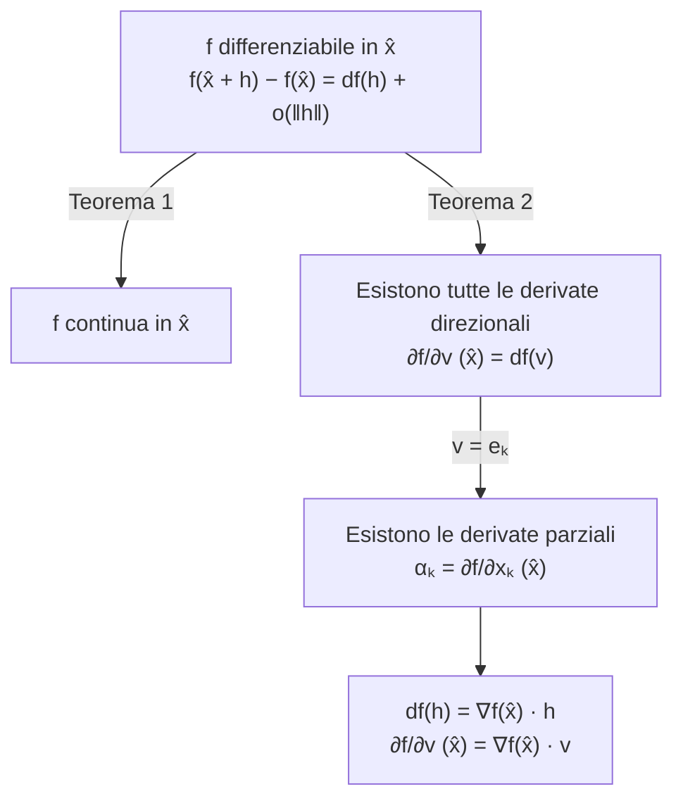

---

## corso: "Metodi Matematici per l'Ingegneria" lezione: 2 data: 2026-09-25 docente: Nicola Pinamonti argomenti: [grafico di una funzione, curve e campi vettoriali, punti interni, derivate parziali, derivate direzionali, differenziale, differenziabilità e continuità, gradiente] fonti: [trascrizione, appunti manuali, dispensa Morro] tags: [metodi-matematici, lezione]

---
# Lezione 2 — Grafici, derivate parziali e direzionali, differenziale

La seconda lezione completa il discorso sulla rappresentazione delle funzioni di più variabili, introducendo il grafico e alcuni modi alternativi di visualizzarle (immagine di una curva, campo vettoriale), e poi affronta il problema centrale del calcolo differenziale: capire quando una funzione di più variabili si può approssimare, vicino a un punto, con una funzione lineare. A questo scopo si definiscono le derivate parziali, le derivate direzionali e il differenziale, e si dimostrano i primi due teoremi che li collegano: una funzione differenziabile è continua e ammette derivate in tutte le direzioni, calcolabili tramite il gradiente.

## Richiamo della lezione precedente

Il docente riprende brevemente il punto di partenza della [[MM L01 - Spazio Rn, limiti e continuità|lezione 1]]. Per assegnare una funzione di più variabili a valori vettoriali occorre prima di tutto "dichiararla", cioè scrivere $f : D \subseteq \mathbb{R}^n \to \mathbb{R}^m$, dove $D$, sottoinsieme di $\mathbb{R}^n$ (lo spazio delle $n$-uple di numeri reali), è il dominio. Applicando la funzione a ogni elemento del dominio si ottiene l'immagine $f(D) = { \mathbf{y} \in \mathbb{R}^m : \exists, \mathbf{x} \in D,\ f(\mathbf{x}) = \mathbf{y} }$, cioè il sottoinsieme del **codominio** $\mathbb{R}^m$ formato dai vettori effettivamente raggiunti dalla funzione.

## Il grafico di una funzione

Oltre all'immagine, un oggetto fondamentale associato a una funzione è il suo grafico, un insieme che deve contenere al suo interno l'informazione sia sul dominio sia sui valori assunti.

> [!important] Definizione — Grafico Il grafico di $f : D \subseteq \mathbb{R}^n \to \mathbb{R}^m$ è l'insieme $G_f = \big\{ \big( \mathbf{x}, f(\mathbf{x}) \big) \in \mathbb{R}^{n+m} : \mathbf{x} \in D \big\} \subseteq \mathbb{R}^n \times \mathbb{R}^m$.


Ogni elemento del grafico si ottiene mettendo uno accanto all'altro il punto $\mathbf{x}$, descritto da $n$ numeri reali, e il valore $f(\mathbf{x})$, descritto da $m$ numeri reali: in tutto $n + m$ numeri, cioè un punto di $\mathbb{R}^{n+m}$. Rappresentare visivamente $\mathbb{R}^{n+m}$ è però in generale impossibile, e una rappresentazione sensata del grafico si ha **solo quando $n + m \le 3$**. I casi rappresentabili sono i seguenti.

### Caso $n = 1$, $m = 1$

È il caso noto da Analisi 1: il grafico è formato dalle coppie $(x, f(x))$ con $x \in D \subseteq \mathbb{R}$. Si fissa il dominio sull'asse delle ascisse e, per ogni suo punto, si riporta sull'asse delle ordinate il valore $y = f(x)$, ottenendo una curva nel piano.

### Caso $n = 2$, $m = 1$: superfici

Per una funzione a valori scalari definita su un dominio di $\mathbb{R}^2$, il generico elemento del dominio è una coppia $(x_1, x_2)$ e il grafico è formato dalle terne $\big(x_1, x_2, f(x_1, x_2)\big) \in \mathbb{R}^3$, al variare di $(x_1, x_2) \in D$. Per disegnarlo si individua il dominio nel piano orizzontale $x_1 x_2$ (il piano $z = 0$ passante per l'origine) e, sopra ciascun punto, si riporta lungo l'asse verticale il valore della funzione. Si ottiene una **superficie** nello spazio tridimensionale. Per renderne visibile la forma si disegnano di solito su di essa le curve ottenute tenendo fissa una delle due variabili: le curve a $x_2$ costante e quelle a $x_1$ costante formano una sorta di reticolo sulla superficie.

> [!tip] Schema consigliato In questo punto sarebbe utile uno schizzo a mano (ad esempio con Excalidraw) di una superficie $z = f(x_1, x_2)$ sopra un dominio del piano, con il reticolo delle curve a $x_1$ costante e a $x_2$ costante: è la stessa figura che servirà più avanti per interpretare le derivate parziali.

### Caso $n = 1$, $m = 2$: grafico e immagine di una curva

Si consideri ora una funzione $f : D \subseteq \mathbb{R} \to \mathbb{R}^2$, che a ogni $t$ del dominio associa una coppia di numeri, ad esempio $$f(t) = \big( f_1(t), f_2(t) \big) = \big( t^2, \ \sin t \big).$$ Anche qui $n + m = 3$ e il grafico si può disegnare: è l'insieme $$G_f = \big\{ \big( t, f_1(t), f_2(t) \big) \ : \ t \in D \big\} \subseteq \mathbb{R}^3,$$ in cui la prima coordinata è il punto del dominio e le altre due sono i valori delle componenti. Facendo variare $t$ si ottiene una curva che vive nello spazio tridimensionale.

Spesso, però, interessa di più la coppia $\big(f_1(t), f_2(t)\big)$ che il modo in cui essa dipende da $t$. In tal caso conviene "dimenticare" la variabile $t$ e disegnare soltanto l'**immagine** $f(D)$, ponendo $x = f_1(t)$ e $y = f_2(t)$ nel piano. Se la funzione è continua, come in questo esempio, al variare di $t$ si ottiene una curva continua nel piano: la funzione diventa una **curva**, e la dipendenza da $t$ indica soltanto _come_ la curva viene percorsa al variare del parametro.

<svg viewBox="0 0 560 290" width="560" style="display:block;margin:1em auto;max-width:100%;height:auto;font-family:inherit" xmlns="http://www.w3.org/2000/svg"><line x1="30.8" y1="145" x2="558.8" y2="145" stroke="currentColor" stroke-width="1.2"/><polygon points="558.8,145 552.6,148.3 552.6,141.7" fill="currentColor"/><line x1="50" y1="275" x2="50" y2="13" stroke="currentColor" stroke-width="1.2"/><polygon points="50,13 53.3,19.2 46.7,19.2" fill="currentColor"/><text x="558.8" y="165" font-size="12" text-anchor="end" fill="currentColor">x = f₁(t) = t²</text><text x="58" y="17" font-size="12" text-anchor="start" fill="currentColor">y = f₂(t) = sin t</text><line x1="44.2" y1="45" x2="55.8" y2="45" stroke="currentColor"/><text x="38" y="49" font-size="11" text-anchor="end" fill="currentColor">1</text><line x1="44.2" y1="245" x2="55.8" y2="245" stroke="currentColor"/><text x="38" y="249" font-size="11" text-anchor="end" fill="currentColor">-1</text><polyline points="523.7,145 515.9,147.6 508.1,150.2 500.4,152.8 492.7,155.5 485.1,158.1 477.6,160.6 470.1,163.2 462.7,165.8 455.3,168.3 448.1,170.9 440.9,173.4 433.7,175.9 426.7,178.4 419.6,180.8 412.7,183.3 405.8,185.7 399,188.1 392.3,190.4 385.6,192.7 379,195 372.4,197.2 366,199.5 359.5,201.6 353.2,203.8 346.9,205.9 340.7,207.9 334.5,209.9 328.5,211.9 322.4,213.8 316.5,215.7 310.6,217.5 304.8,219.3 299,221 293.3,222.7 287.7,224.3 282.1,225.9 276.6,227.4 271.2,228.9 265.8,230.3 260.6,231.6 255.3,232.9 250.2,234.1 245.1,235.3 240,236.4 235.1,237.4 230.2,238.4 225.3,239.3 220.5,240.1 215.8,240.9 211.2,241.6 206.6,242.2 202.1,242.8 197.7,243.3 193.3,243.8 189,244.1 184.8,244.5 180.6,244.7 176.5,244.9 172.4,245 168.4,245 164.5,245 160.7,244.9 156.9,244.7 153.2,244.5 149.5,244.1 145.9,243.8 142.4,243.3 139,242.8 135.6,242.2 132.2,241.6 129,240.9 125.8,240.1 122.7,239.3 119.6,238.4 116.6,237.4 113.7,236.4 110.8,235.3 108,234.1 105.3,232.9 102.6,231.6 100,230.3 97.5,228.9 95,227.4 92.6,225.9 90.3,224.3 88,222.7 85.8,221 83.7,219.3 81.6,217.5 79.6,215.7 77.7,213.8 75.8,211.9 74,209.9 72.2,207.9 70.6,205.9 68.9,203.8 67.4,201.6 65.9,199.5 64.5,197.2 63.2,195 61.9,192.7 60.7,190.4 59.5,188.1 58.4,185.7 57.4,183.3 56.4,180.8 55.6,178.4 54.7,175.9 54,173.4 53.3,170.9 52.7,168.3 52.1,165.8 51.6,163.2 51.2,160.6 50.8,158.1 50.5,155.5 50.3,152.8 50.1,150.2 50,147.6 50,145 50,142.4 50.1,139.8 50.3,137.2 50.5,134.5 50.8,131.9 51.2,129.4 51.6,126.8 52.1,124.2 52.7,121.7 53.3,119.1 54,116.6 54.7,114.1 55.6,111.6 56.4,109.2 57.4,106.7 58.4,104.3 59.5,101.9 60.7,99.6 61.9,97.3 63.2,95 64.5,92.8 65.9,90.5 67.4,88.4 68.9,86.2 70.6,84.1 72.2,82.1 74,80.1 75.8,78.1 77.7,76.2 79.6,74.3 81.6,72.5 83.7,70.7 85.8,69 88,67.3 90.3,65.7 92.6,64.1 95,62.6 97.5,61.1 100,59.7 102.6,58.4 105.3,57.1 108,55.9 110.8,54.7 113.7,53.6 116.6,52.6 119.6,51.6 122.7,50.7 125.8,49.9 129,49.1 132.2,48.4 135.6,47.8 139,47.2 142.4,46.7 145.9,46.2 149.5,45.9 153.2,45.5 156.9,45.3 160.7,45.1 164.5,45 168.4,45 172.4,45 176.5,45.1 180.6,45.3 184.8,45.5 189,45.9 193.3,46.2 197.7,46.7 202.1,47.2 206.6,47.8 211.2,48.4 215.8,49.1 220.5,49.9 225.3,50.7 230.2,51.6 235.1,52.6 240,53.6 245.1,54.7 250.2,55.9 255.3,57.1 260.6,58.4 265.8,59.7 271.2,61.1 276.6,62.6 282.1,64.1 287.7,65.7 293.3,67.3 299,69 304.8,70.7 310.6,72.5 316.5,74.3 322.4,76.2 328.5,78.1 334.5,80.1 340.7,82.1 346.9,84.1 353.2,86.2 359.5,88.4 366,90.5 372.4,92.8 379,95 385.6,97.3 392.3,99.6 399,101.9 405.8,104.3 412.7,106.7 419.6,109.2 426.7,111.6 433.7,114.1 440.9,116.6 448.1,119.1 455.3,121.7 462.7,124.2 470.1,126.8 477.6,129.4 485.1,131.9 492.7,134.5 500.4,137.2 508.1,139.8 515.9,142.4 523.7,145" fill="none" stroke="#3b82f6" stroke-width="2.2"/><polygon points="158.4,245 168.1,239.8 168.1,250.2" fill="#3b82f6"/><polygon points="178.4,45 168.7,50.2 168.7,39.8" fill="#3b82f6"/><circle cx="50" cy="145" r="4" fill="currentColor"/><text x="60" y="163" font-size="12" text-anchor="start" fill="currentColor">t = 0</text><circle cx="523.7" cy="145" r="4" fill="currentColor"/><text x="519.7" y="127" font-size="12" text-anchor="end" fill="currentColor">t = ±π</text><text x="170" y="35" font-size="12" text-anchor="middle" fill="currentColor">t ∈ (0, π)</text><text x="170" y="267" font-size="12" text-anchor="middle" fill="currentColor">t ∈ (−π, 0)</text></svg>

La figura mostra l'immagine di $f(t) = (t^2, \sin t)$ per $t \in [-\pi, \pi]$ (l'intervallo è stato scelto qui a scopo illustrativo). Le frecce indicano il verso di percorrenza: per $t$ da $-\pi$ a $0$ si percorre l'arco inferiore da $(\pi^2, 0)$ verso l'origine, per $t$ da $0$ a $\pi$ l'arco superiore dall'origine di nuovo verso $(\pi^2, 0)$. L'immagine passa due volte per il punto $(\pi^2, 0)$, in corrispondenza di $t = -\pi$ e $t = \pi$: è un'informazione che il grafico in $\mathbb{R}^3$ conserva (i due punti $(\mp\pi, \pi^2, 0)$ sono distinti) e che l'immagine invece perde.

> [!warning] Discrepanza tra fonti: prima componente dell'esempio In questo punto la trascrizione è poco leggibile e sembra indicare $t^4$ come prima componente; entrambe le versioni degli appunti riportano $t^2$, adottato qui. Il docente ha comunque presentato la funzione come un esempio qualsiasi ("o cose di questo tipo"), quindi la scelta non incide sul contenuto.

### Campi vettoriali: mettere in evidenza il dominio

Un ultimo modo di rappresentare queste funzioni mette in evidenza il dominio anziché l'immagine. Un **campo vettoriale** è una funzione $f : D \subseteq \mathbb{R}^2 \to \mathbb{R}^2$ (più in generale da $\mathbb{R}^n$ in $\mathbb{R}^n$), che a ogni punto del piano associa un vettore. Come esempio il docente sceglie $$f(x_1, x_2) = (-x_2, \ x_1), \qquad \text{cioè} \qquad f_1(x_1, x_2) = -x_2, \quad f_2(x_1, x_2) = x_1 .$$ La scrittura $f : D \subseteq \mathbb{R}^2 \to \mathbb{R}^2$ è la dichiarazione della funzione, quella esplicita è la sua definizione.

Per rappresentarlo si disegna il dominio nel piano $x_1 x_2$ e in ciascun punto (o in un campione rappresentativo di punti) si disegna una freccia **applicata in quel punto** che rappresenta il vettore $f(x_1, x_2)$. In questo esempio il vettore associato al punto $(x_1, x_2)$ si ottiene ruotando di $90^\circ$ in senso antiorario il vettore posizione del punto. Lo si verifica direttamente: $$f(\mathbf{x}) \cdot \mathbf{x} = -x_2 x_1 + x_1 x_2 = 0, \qquad \lVert f(\mathbf{x}) \rVert = \sqrt{x_2^2 + x_1^2} = \lVert \mathbf{x} \rVert,$$ quindi in ogni punto il vettore è ortogonale al raggio e ha la stessa lunghezza del vettore posizione: le frecce sono tangenti alle circonferenze centrate nell'origine e si allungano allontanandosi da essa.

<svg viewBox="0 0 380 380" width="380" style="display:block;margin:1em auto;max-width:100%;height:auto;font-family:inherit" xmlns="http://www.w3.org/2000/svg"><circle cx="190" cy="190" r="70" fill="none" stroke="currentColor" stroke-opacity="0.35" stroke-dasharray="4 4"/><circle cx="190" cy="190" r="140" fill="none" stroke="currentColor" stroke-opacity="0.35" stroke-dasharray="4 4"/><line x1="8" y1="190" x2="372" y2="190" stroke="currentColor" stroke-width="1.1"/><polygon points="372,190 365.8,193.3 365.8,186.7" fill="currentColor"/><line x1="190" y1="372" x2="190" y2="8" stroke="currentColor" stroke-width="1.1"/><polygon points="190,8 193.3,14.2 186.7,14.2" fill="currentColor"/><text x="372" y="208" font-size="13" text-anchor="end" fill="currentColor">x₁</text><text x="198" y="14" font-size="13" text-anchor="start" fill="currentColor">x₂</text><circle cx="50" cy="330" r="2" fill="currentColor"/><line x1="50" y1="330" x2="87.8" y2="367.8" stroke="#3b82f6" stroke-width="1.8"/><polygon points="87.8,367.8 81.1,365.8 85.8,361.1" fill="#3b82f6"/><circle cx="50" cy="260" r="2" fill="currentColor"/><line x1="50" y1="260" x2="68.9" y2="297.8" stroke="#3b82f6" stroke-width="1.8"/><polygon points="68.9,297.8 63.2,293.7 69.1,290.8" fill="#3b82f6"/><circle cx="50" cy="190" r="2" fill="currentColor"/><line x1="50" y1="190" x2="50" y2="227.8" stroke="#3b82f6" stroke-width="1.8"/><polygon points="50,227.8 46.7,221.6 53.3,221.6" fill="#3b82f6"/><circle cx="50" cy="120" r="2" fill="currentColor"/><line x1="50" y1="120" x2="31.1" y2="157.8" stroke="#3b82f6" stroke-width="1.8"/><polygon points="31.1,157.8 30.9,150.8 36.8,153.7" fill="#3b82f6"/><circle cx="50" cy="50" r="2" fill="currentColor"/><line x1="50" y1="50" x2="12.2" y2="87.8" stroke="#3b82f6" stroke-width="1.8"/><polygon points="12.2,87.8 14.2,81.1 18.9,85.8" fill="#3b82f6"/><circle cx="120" cy="330" r="2" fill="currentColor"/><line x1="120" y1="330" x2="157.8" y2="348.9" stroke="#3b82f6" stroke-width="1.8"/><polygon points="157.8,348.9 150.8,349.1 153.7,343.2" fill="#3b82f6"/><circle cx="120" cy="260" r="2" fill="currentColor"/><line x1="120" y1="260" x2="138.9" y2="278.9" stroke="#3b82f6" stroke-width="1.8"/><polygon points="138.9,278.9 132.2,276.9 136.9,272.2" fill="#3b82f6"/><circle cx="120" cy="190" r="2" fill="currentColor"/><line x1="120" y1="190" x2="120" y2="208.9" stroke="#3b82f6" stroke-width="1.8"/><polygon points="120,208.9 116.7,202.7 123.3,202.7" fill="#3b82f6"/><circle cx="120" cy="120" r="2" fill="currentColor"/><line x1="120" y1="120" x2="101.1" y2="138.9" stroke="#3b82f6" stroke-width="1.8"/><polygon points="101.1,138.9 103.1,132.2 107.8,136.9" fill="#3b82f6"/><circle cx="120" cy="50" r="2" fill="currentColor"/><line x1="120" y1="50" x2="82.2" y2="68.9" stroke="#3b82f6" stroke-width="1.8"/><polygon points="82.2,68.9 86.3,63.2 89.2,69.1" fill="#3b82f6"/><circle cx="190" cy="330" r="2" fill="currentColor"/><line x1="190" y1="330" x2="227.8" y2="330" stroke="#3b82f6" stroke-width="1.8"/><polygon points="227.8,330 221.6,333.3 221.6,326.7" fill="#3b82f6"/><circle cx="190" cy="260" r="2" fill="currentColor"/><line x1="190" y1="260" x2="208.9" y2="260" stroke="#3b82f6" stroke-width="1.8"/><polygon points="208.9,260 202.7,263.3 202.7,256.7" fill="#3b82f6"/><circle cx="190" cy="120" r="2" fill="currentColor"/><line x1="190" y1="120" x2="171.1" y2="120" stroke="#3b82f6" stroke-width="1.8"/><polygon points="171.1,120 177.3,116.7 177.3,123.3" fill="#3b82f6"/><circle cx="190" cy="50" r="2" fill="currentColor"/><line x1="190" y1="50" x2="152.2" y2="50" stroke="#3b82f6" stroke-width="1.8"/><polygon points="152.2,50 158.4,46.7 158.4,53.3" fill="#3b82f6"/><circle cx="260" cy="330" r="2" fill="currentColor"/><line x1="260" y1="330" x2="297.8" y2="311.1" stroke="#3b82f6" stroke-width="1.8"/><polygon points="297.8,311.1 293.7,316.8 290.8,310.9" fill="#3b82f6"/><circle cx="260" cy="260" r="2" fill="currentColor"/><line x1="260" y1="260" x2="278.9" y2="241.1" stroke="#3b82f6" stroke-width="1.8"/><polygon points="278.9,241.1 276.9,247.8 272.2,243.1" fill="#3b82f6"/><circle cx="260" cy="190" r="2" fill="currentColor"/><line x1="260" y1="190" x2="260" y2="171.1" stroke="#3b82f6" stroke-width="1.8"/><polygon points="260,171.1 263.3,177.3 256.7,177.3" fill="#3b82f6"/><circle cx="260" cy="120" r="2" fill="currentColor"/><line x1="260" y1="120" x2="241.1" y2="101.1" stroke="#3b82f6" stroke-width="1.8"/><polygon points="241.1,101.1 247.8,103.1 243.1,107.8" fill="#3b82f6"/><circle cx="260" cy="50" r="2" fill="currentColor"/><line x1="260" y1="50" x2="222.2" y2="31.1" stroke="#3b82f6" stroke-width="1.8"/><polygon points="222.2,31.1 229.2,30.9 226.3,36.8" fill="#3b82f6"/><circle cx="330" cy="330" r="2" fill="currentColor"/><line x1="330" y1="330" x2="367.8" y2="292.2" stroke="#3b82f6" stroke-width="1.8"/><polygon points="367.8,292.2 365.8,298.9 361.1,294.2" fill="#3b82f6"/><circle cx="330" cy="260" r="2" fill="currentColor"/><line x1="330" y1="260" x2="348.9" y2="222.2" stroke="#3b82f6" stroke-width="1.8"/><polygon points="348.9,222.2 349.1,229.2 343.2,226.3" fill="#3b82f6"/><circle cx="330" cy="190" r="2" fill="currentColor"/><line x1="330" y1="190" x2="330" y2="152.2" stroke="#3b82f6" stroke-width="1.8"/><polygon points="330,152.2 333.3,158.4 326.7,158.4" fill="#3b82f6"/><circle cx="330" cy="120" r="2" fill="currentColor"/><line x1="330" y1="120" x2="311.1" y2="82.2" stroke="#3b82f6" stroke-width="1.8"/><polygon points="311.1,82.2 316.8,86.3 310.9,89.2" fill="#3b82f6"/><circle cx="330" cy="50" r="2" fill="currentColor"/><line x1="330" y1="50" x2="292.2" y2="12.2" stroke="#3b82f6" stroke-width="1.8"/><polygon points="292.2,12.2 298.9,14.2 294.2,18.9" fill="#3b82f6"/></svg>

Nella figura le frecce sono riscalate di un fattore comune per non sovrapporsi; le circonferenze tratteggiate mostrano la struttura "rotatoria" del campo. Rappresentazioni di questo tipo sono molto comuni, ad esempio nelle mappe dei moti dell'atmosfera o nei grafici dello spazio delle fasi che si ottengono studiando equazioni differenziali.

> [!warning] Discrepanza tra fonti: definizione del campo Nella versione Markdown degli appunti la prima riga riporta $f(x_1, x_2) = (-x_1, x_2)$, in contraddizione con le righe successive degli stessi appunti ($f_1 = -x_2$, $f_2 = x_1$). La trascrizione ("assegna meno $x_2$ alla prima componente e $x_1$ alla seconda") e gli appunti a mano confermano $f(x_1, x_2) = (-x_2, x_1)$.

### Dimensioni maggiori

Per una funzione da $\mathbb{R}^n$ in $\mathbb{R}^m$ con $n$ e $m$ generici, e in particolare quando $n + m > 3$, non esiste un modo di rappresentarla graficamente in modo diretto: viviamo in uno spazio tridimensionale, e aggiungendo il tempo (ad esempio con un'animazione) si arriva al più a quattro dimensioni. Nonostante questo, grafico, immagine e dominio continuano ad avere perfettamente senso come insiemi, e si possono descrivere e studiare anche se non si possono disegnare.

## Verso la linearizzazione

Proprio perché in dimensione alta queste funzioni sono difficili da visualizzare, e anche da maneggiare, un'idea molto utile nella pratica è sostituire localmente la funzione con un'approssimazione più semplice. Una funzione può avere un grafico pieno di "pieghe", ma vicino a un punto fissato si può cercare di approssimarla con una funzione lineare, cioè di **linearizzarla**. L'obiettivo della parte successiva della lezione è capire _quando_ questa linearizzazione è possibile; per farlo servono le derivate e il differenziale.

Si studiano per ora funzioni **a valori reali**, $f : D \subseteq \mathbb{R}^n \to \mathbb{R}$. Non è una vera restrizione: come visto nella lezione precedente, una funzione a valori vettoriali è una collezione di funzioni a valori reali, le sue componenti.

## Punti interni

Per calcolare una derivata bisogna valutare la funzione in tutta una serie di punti vicini a quello di interesse, spostandosi in ogni direzione: serve quindi che tutti questi punti stiano nel dominio. Questo motiva la seguente definizione.

> [!important] Definizione — Punto interno Un punto $\hat{\mathbf{x}} \in D$ è interno a $D$ se esiste $r > 0$ tale che $B(\hat{\mathbf{x}}, r) \subseteq D$. L'insieme dei punti interni di $D$ si indica con $\mathring{D}$.

Un punto è interno se "sta ben dentro" il dominio, cioè se attorno a esso si può costruire una pallina, magari di raggio molto piccolo, interamente contenuta in $D$ (si veda la figura nella [[MM L01 - Spazio Rn, limiti e continuità#Punti di accumulazione|lezione 1]]). Un punto isolato del dominio appartiene a $D$ ma non è interno, perché nessuna palla centrata in esso, per quanto piccola, resta contenuta nel dominio. Un punto del bordo è di accumulazione, come visto nella lezione precedente, ma non è interno: per quanto piccola si prenda la palla, circa metà di essa sta fuori dal dominio.

Due osservazioni collegano questa definizione a quelle della lezione 1. Un insieme è aperto esattamente quando tutti i suoi punti sono interni, cioè quando $D = \mathring{D}$. Inoltre ogni punto interno è anche un punto di accumulazione: se $B(\hat{\mathbf{x}}, r) \subseteq D$, ogni palla centrata in $\hat{\mathbf{x}}$, privata del centro, contiene punti di $B(\hat{\mathbf{x}}, r)$ diversi da $\hat{\mathbf{x}}$, quindi punti di $D$. Questo fatto verrà usato nella dimostrazione del primo teorema sulla differenziabilità.

## Derivate parziali

### Definizione

L'idea è guardare la funzione lungo una sola delle direzioni coordinate. Si fissa un punto $\hat{\mathbf{x}}$ del dominio e, invece di far variare tutte le coordinate, si fa variare soltanto la $k$-esima, tenendo bloccate tutte le altre: il punto del dominio si muove allora lungo una retta parallela all'asse $x_k$, e sul grafico si percorre la curva corrispondente. La prima cosa che interessa di questa curva è la sua pendenza nel punto considerato.

> [!important] Definizione — Derivata parziale Siano $f : D \subseteq \mathbb{R}^n \to \mathbb{R}$, $\hat{\mathbf{x}} \in \mathring{D}$ e $k \in {1, \dots, n}$. La derivata parziale di $f$ rispetto a $x_k$ nel punto $\hat{\mathbf{x}}$ è $$\frac{\partial f}{\partial x_k}(\hat{\mathbf{x}}) = \lim_{h \to 0} \frac{f(\hat{x}_1, \dots, \hat{x}_{k-1}, \ \hat{x}_k + h, \ \hat{x}_{k+1}, \dots, \hat{x}_n) - f(\hat{\mathbf{x}})}{h},$$ se il limite esiste (ed è finito).

Come ogni derivata, è il limite di un rapporto incrementale: si valuta la funzione nel punto in cui solo la $k$-esima coordinata è stata spostata di $h$, si sottrae il valore in $\hat{\mathbf{x}}$, si divide per $h$ e si passa al limite per $h \to 0$. Il limite può esistere oppure no; se esiste, è la derivata parziale.

Guardando bene la definizione, si vede che non si sta facendo nulla di nuovo rispetto ad Analisi 1. Tenendo fisse tutte le coordinate tranne la $k$-esima si costruisce una funzione di **una sola variabile reale**, $$\varphi(y) = f(\hat{x}_1, \dots, \hat{x}_{k-1}, \ y, \ \hat{x}_{k+1}, \dots, \hat{x}_n),$$ definita su un intervallo attorno a $\hat{x}_k$, e la derivata parziale è semplicemente la derivata ordinaria di questa funzione: $\frac{\partial f}{\partial x_k}(\hat{\mathbf{x}}) = \varphi'(\hat{x}_k)$. In pratica, per calcolare una derivata parziale si trattano tutte le variabili diverse da $x_k$ come costanti e si deriva rispetto a $x_k$ con le regole usuali.

**Notazioni equivalenti.** La stessa derivata si indica anche con $\partial_k f(\hat{\mathbf{x}})$, con $\partial_{x_k} f(\hat{\mathbf{x}})$ (notazione usata nella dispensa), con $D_{x_k} f(\hat{\mathbf{x}})$ oppure, soprattutto nei testi meno recenti, con $f_{x_k}(\hat{\mathbf{x}})$.

### Interpretazione geometrica

Poiché la derivata parziale è la derivata della funzione di una variabile $\varphi$, la sua interpretazione è quella nota: è la **pendenza della retta tangente** al grafico di $\varphi$ nel punto $\hat{x}_k$, cioè della retta che meglio approssima la funzione vicino a quel punto.

<svg viewBox="0 0 560 300" width="560" style="display:block;margin:1em auto;max-width:100%;height:auto;font-family:inherit" xmlns="http://www.w3.org/2000/svg"><line x1="29" y1="260" x2="561" y2="260" stroke="currentColor" stroke-width="1.2"/><polygon points="561,260 554.8,263.3 554.8,256.7" fill="currentColor"/><line x1="50" y1="274" x2="50" y2="11.5" stroke="currentColor" stroke-width="1.2"/><polygon points="50,11.5 53.3,17.7 46.7,17.7" fill="currentColor"/><text x="561" y="280" font-size="13" text-anchor="end" fill="currentColor">xₖ</text><text x="58" y="17.5" font-size="12" text-anchor="start" fill="currentColor">φ(xₖ) = f(x̂₁, …, xₖ, …, x̂ₙ)</text><polyline points="64,172 66.3,170 68.6,168 70.9,166 73.2,163.9 75.5,161.8 77.9,159.7 80.2,157.6 82.5,155.5 84.8,153.4 87.1,151.3 89.4,149.1 91.7,147 94,144.9 96.3,142.7 98.7,140.6 101,138.4 103.3,136.3 105.6,134.1 107.9,132 110.2,129.9 112.5,127.8 114.8,125.7 117.1,123.6 119.4,121.5 121.8,119.4 124.1,117.4 126.4,115.4 128.7,113.4 131,111.4 133.3,109.4 135.6,107.5 137.9,105.6 140.2,103.7 142.5,101.9 144.8,100 147.2,98.3 149.5,96.5 151.8,94.8 154.1,93.1 156.4,91.5 158.7,89.9 161,88.3 163.3,86.8 165.6,85.3 167.9,83.9 170.3,82.5 172.6,81.1 174.9,79.8 177.2,78.6 179.5,77.3 181.8,76.2 184.1,75.1 186.4,74 188.7,73 191.1,72.1 193.4,71.1 195.7,70.3 198,69.5 200.3,68.7 202.6,68.1 204.9,67.4 207.2,66.8 209.5,66.3 211.8,65.8 214.2,65.4 216.5,65.1 218.8,64.7 221.1,64.5 223.4,64.3 225.7,64.2 228,64.1 230.3,64 232.6,64.1 234.9,64.2 237.3,64.3 239.6,64.5 241.9,64.7 244.2,65 246.5,65.4 248.8,65.8 251.1,66.2 253.4,66.7 255.7,67.3 258,67.9 260.4,68.5 262.7,69.2 265,70 267.3,70.8 269.6,71.6 271.9,72.5 274.2,73.4 276.5,74.4 278.8,75.4 281.1,76.4 283.4,77.5 285.8,78.6 288.1,79.8 290.4,81 292.7,82.2 295,83.5 297.3,84.8 299.6,86.1 301.9,87.4 304.2,88.8 306.6,90.2 308.9,91.6 311.2,93.1 313.5,94.5 315.8,96 318.1,97.5 320.4,99.1 322.7,100.6 325,102.1 327.3,103.7 329.7,105.3 332,106.8 334.3,108.4 336.6,110 338.9,111.6 341.2,113.2 343.5,114.8 345.8,116.4 348.1,118 350.4,119.6 352.8,121.1 355.1,122.7 357.4,124.3 359.7,125.8 362,127.3 364.3,128.9 366.6,130.4 368.9,131.9 371.2,133.3 373.5,134.8 375.9,136.2 378.2,137.6 380.5,139 382.8,140.3 385.1,141.6 387.4,142.9 389.7,144.2 392,145.4 394.3,146.6 396.6,147.7 399,148.8 401.3,149.9 403.6,151 405.9,152 408.2,152.9 410.5,153.8 412.8,154.7 415.1,155.5 417.4,156.3 419.7,157.1 422.1,157.7 424.4,158.4 426.7,159 429,159.5 431.3,160 433.6,160.5 435.9,160.9 438.2,161.2 440.5,161.5 442.8,161.7 445.2,161.9 447.5,162 449.8,162.1 452.1,162.1 454.4,162.1 456.7,162 459,161.8 461.3,161.6 463.6,161.4 465.9,161 468.3,160.7 470.6,160.2 472.9,159.8 475.2,159.2 477.5,158.6 479.8,158 482.1,157.3 484.4,156.5 486.7,155.7 489,154.9 491.4,154 493.7,153 496,152 498.3,150.9 500.6,149.8 502.9,148.6 505.2,147.4 507.5,146.1 509.8,144.8 512.1,143.5 514.5,142.1 516.8,140.6 519.1,139.1 521.4,137.6 523.7,136 526,134.4" fill="none" stroke="currentColor" stroke-width="2"/><line x1="64" y1="124.6" x2="302" y2="26.2" stroke="#3b82f6" stroke-width="1.6" stroke-dasharray="7 4"/><line x1="190" y1="260" x2="190" y2="72.5" stroke="currentColor" stroke-opacity="0.5" stroke-dasharray="3 3"/><text x="190" y="278" font-size="13" text-anchor="middle" fill="currentColor">x̂ₖ</text><line x1="190" y1="72.5" x2="260" y2="72.5" stroke="currentColor" stroke-opacity="0.6" stroke-dasharray="3 3"/><line x1="260" y1="72.5" x2="260" y2="43.5" stroke="currentColor" stroke-opacity="0.6" stroke-dasharray="3 3"/><text x="225" y="88.5" font-size="12" text-anchor="middle" fill="currentColor">1</text><text x="266" y="62" font-size="12" text-anchor="start" fill="currentColor">φ′(x̂ₖ)</text><line x1="190" y1="72.5" x2="260" y2="43.5" stroke="#e05a47" stroke-width="2.4"/><polygon points="260,43.5 253.6,51.2 250,42.6" fill="#e05a47"/><circle cx="190" cy="72.5" r="4" fill="currentColor"/><text x="252" y="29.5" font-size="12" text-anchor="end" fill="#e05a47">(1, φ′(x̂ₖ))</text><text x="306" y="30.2" font-size="12" text-anchor="start" fill="#3b82f6">retta tangente</text></svg>

Il grafico di $\varphi$ è la curva $y \mapsto \big(y, \varphi(y)\big)$; derivandola rispetto a $y$ si ottiene il **vettore tangente** $\big(1, \varphi'(\hat{x}_k)\big)$, con componente 1 nella direzione dell'asse e componente $\varphi'(\hat{x}_k)$ in quella verticale (il vettore rosso in figura).

Questo punto di vista si generalizza al grafico di $f$ in $\mathbb{R}^{n+1}$. La curva ottenuta muovendosi lungo l'asse $x_k$ è $y \mapsto \big(\hat{x}_1, \dots, y, \dots, \hat{x}_n, \varphi(y)\big)$: derivando, tutte le componenti fissate danno zero, la $k$-esima dà 1 e l'ultima dà la derivata parziale. Il vettore tangente al grafico è quindi $$\mathbf{v}_k = \Big( \underbrace{0, \dots, 0}_{k-1}, \ 1, \ \underbrace{0, \dots, 0}_{n-k}, \ \frac{\partial f}{\partial x_k}(\hat{\mathbf{x}}) \Big) \in \mathbb{R}^{n+1}, \qquad k = 1, \dots, n .$$

Facendo variare $k$ si ottengono $n$ vettori, tanti quante sono le dimensioni del dominio. Se esistono, essi sono **linearmente indipendenti**, perché le loro prime $n$ componenti sono i vettori della base canonica (la posizione dell'1 si sposta al variare di $k$), e sono **tangenti al grafico**. Le derivate parziali servono quindi a costruire vettori tangenti al grafico. Se la funzione è "buona", e più precisamente, come si vedrà, se è differenziabile, le combinazioni lineari di questi vettori generano l'**iperpiano tangente** al grafico nel punto $\big(\hat{\mathbf{x}}, f(\hat{\mathbf{x}})\big)$, cioè il piano tangente nel caso $n = 2$.

> [!tip] Approfondimento — Il piano tangente per $n = 2$ #approfondimento Per $f(x, y)$ in un punto $(\hat{x}, \hat{y})$ i due vettori tangenti sono $\mathbf{v}_1 = (1, 0, \partial_x f)$ e $\mathbf{v}_2 = (0, 1, \partial_y f)$, con le derivate calcolate in $(\hat{x}, \hat{y})$. Il piano che essi generano, passante per $\big(\hat{x}, \hat{y}, f(\hat{x}, \hat{y})\big)$, ha equazione $$z = f(\hat{x}, \hat{y}) + \partial_x f(\hat{x}, \hat{y}),(x - \hat{x}) + \partial_y f(\hat{x}, \hat{y}),(y - \hat{y}),$$ e la sua normale è parallela a $\mathbf{v}_1 \times \mathbf{v}_2 = (-\partial_x f, \ -\partial_y f, \ 1)$. La dispensa di riferimento mostra che, per una funzione differenziabile, questo è il piano "di miglior contatto" con la superficie, cioè il piano tangente, e lo scrive con la normale $(\partial_x f, \partial_y f, -1)$, parallela a quella trovata qui [@morro2023, §1.3.1].

### Un esempio di calcolo

> [!example] Esempio — Derivate parziali di $f(x, y) = e^{xy}, y$ Sia $f : \mathbb{R}^2 \to \mathbb{R}$, $f(x, y) = e^{xy}, y$.
> 
> Per derivare rispetto a $x$ si tratta $y$ come un parametro fissato e si deriva come in Analisi 1: il fattore $y$ è una costante moltiplicativa e la derivata di $e^{xy}$ rispetto a $x$ è $y, e^{xy}$, quindi $$\frac{\partial f}{\partial x}(x, y) = y \cdot y, e^{xy} = y^2 e^{xy}.$$
> 
> Per derivare rispetto a $y$ si tratta invece $x$ come parametro. Ora la $y$ compare in entrambi i fattori, e serve la regola di derivazione del prodotto (regola di Leibniz): la derivata del primo fattore è $x, e^{xy}$, quella del secondo è 1, quindi $$\frac{\partial f}{\partial y}(x, y) = x, e^{xy} \cdot y + e^{xy} \cdot 1 = e^{xy},(1 + xy).$$

> [!warning] Discrepanza tra fonti: testo dell'esempio Nella versione Markdown degli appunti la funzione è scritta per refuso come $y^{xy} y$. La trascrizione, gli appunti a mano e le derivate calcolate negli stessi appunti indicano chiaramente $f(x, y) = e^{xy}, y$.

## Derivate direzionali

### Definizione

Le derivate parziali descrivono la variazione della funzione lungo rette parallele agli assi. Può essere utile, però, fissare un punto e calcolare una derivata lungo una retta passante per esso con direzione qualsiasi. Si ottiene così la derivata direzionale.

> [!important] Definizione — Derivata direzionale Siano $f : D \subseteq \mathbb{R}^n \to \mathbb{R}$, $\hat{\mathbf{x}} \in \mathring{D}$ e $\mathbf{v} \in \mathbb{R}^n$ con $\mathbf{v} \neq \mathbf{0}$. La derivata di $f$ nella direzione $\mathbf{v}$ nel punto $\hat{\mathbf{x}}$ è $$\frac{\partial f}{\partial \mathbf{v}}(\hat{\mathbf{x}}) = \lim_{t \to 0} \frac{f(\hat{\mathbf{x}} + t\mathbf{v}) - f(\hat{\mathbf{x}})}{t},$$ se il limite esiste.

La retta lungo cui ci si muove è descritta dalla mappa $t \mapsto \hat{\mathbf{x}} + t\mathbf{v}$: per $t = 0$ si è in $\hat{\mathbf{x}}$, e al variare di $t$ ci si sposta lungo la retta passante per $\hat{\mathbf{x}}$ con direzione $\mathbf{v}$. Il rapporto incrementale è costruito proprio con questo parametro $t$.

Le derivate parziali sono casi particolari di derivate direzionali, calcolate lungo i vettori della base canonica: muoversi lungo l'asse $x_k$ significa muoversi nella direzione di $\mathbf{e}_k$, quindi per costruzione $$\frac{\partial f}{\partial x_k}(\hat{\mathbf{x}}) = \frac{\partial f}{\partial \mathbf{e}_k}(\hat{\mathbf{x}}), \qquad \mathbf{e}_k = \Big( \underbrace{0, \dots, 0}_{k-1}, \ 1, \ \underbrace{0, \dots, 0}_{n-k} \Big).$$

Il docente segnala una convenzione di notazione da tenere presente: quando "al denominatore" del simbolo di derivata compare un **vettore**, come $\partial \mathbf{v}$, si tratta di una derivata direzionale; quando compare una **componente**, come $\partial x_k$, si tratta di una derivata parziale.

### Comportamento rispetto al riscalamento della direzione

Che cosa succede alla derivata direzionale se si allunga o si accorcia il vettore che indica la direzione? Siano $\hat{\mathbf{x}} \in \mathring{D}$, $\mathbf{v} \neq \mathbf{0}$ e $\mathbf{u} = \lambda \mathbf{v}$ con $\lambda \in \mathbb{R}$, $\lambda \neq 0$. Il vettore $\mathbf{u}$ ha la stessa direzione di $\mathbf{v}$; la lunghezza cambia di un fattore $|\lambda|$ e, se $\lambda < 0$, cambia anche il verso.

> [!important] Proposizione — Omogeneità della derivata direzionale Se $\mathbf{u} = \lambda \mathbf{v}$ con $\lambda \neq 0$, allora $$\frac{\partial f}{\partial \mathbf{u}}(\hat{\mathbf{x}}) = \lambda , \frac{\partial f}{\partial \mathbf{v}}(\hat{\mathbf{x}}),$$ nel senso che l'una esiste se e solo se esiste l'altra, e in tal caso vale l'uguaglianza.

**Dimostrazione.** Si parte dalla definizione e si sostituisce $\mathbf{u} = \lambda\mathbf{v}$. L'idea è "spostare" il fattore $\lambda$ dal vettore al parametro: per farlo, ogni $t$ che compare nella formula deve essere accompagnato dal suo $\lambda$, quindi si moltiplica e si divide per $\lambda$ e si rinomina $h = t\lambda$: $$\begin{aligned} \frac{\partial f}{\partial \mathbf{u}}(\hat{\mathbf{x}}) &= \lim_{t \to 0} \frac{f(\hat{\mathbf{x}} + t\lambda\mathbf{v}) - f(\hat{\mathbf{x}})}{t} = \lim_{t \to 0} \lambda , \frac{f\big(\hat{\mathbf{x}} + (t\lambda)\mathbf{v}\big) - f(\hat{\mathbf{x}})}{t\lambda} \ &= \lambda \lim_{h \to 0} \frac{f(\hat{\mathbf{x}} + h\mathbf{v}) - f(\hat{\mathbf{x}})}{h} = \lambda , \frac{\partial f}{\partial \mathbf{v}}(\hat{\mathbf{x}}). \end{aligned}$$ Il cambio di variabile è lecito perché, essendo $\lambda \neq 0$ fissato, $h = t\lambda$ tende a zero se e solo se $t$ tende a zero, ed è non nullo se e solo se lo è $t$. $\blacksquare$

In parole: se si allunga di un fattore $\lambda$ il vettore lungo cui si deriva, la derivata direzionale risulta moltiplicata per lo stesso fattore.

> [!tip] Approfondimento — Derivate lungo versori #approfondimento La proprietà appena dimostrata mostra che il valore di $\frac{\partial f}{\partial \mathbf{v}}$ dipende dalla lunghezza di $\mathbf{v}$, non solo dalla sua direzione. Per questo molti testi definiscono la derivata direzionale solo lungo **versori** ($\lVert \mathbf{e} \rVert = 1$): in questo modo il numero ottenuto misura la rapidità di variazione di $f$ per unità di lunghezza percorsa, e ha un significato geometrico intrinseco. È la scelta fatta nella dispensa di riferimento, che richiede $|\mathbf{e}| = 1$ "per facilitare l'interpretazione geometrica" [@morro2023, §1.3]. Con la definizione data a lezione, valida per ogni $\mathbf{v} \neq \mathbf{0}$, si passa da un vettore qualsiasi al versore corrispondente semplicemente dividendo per $\lVert \mathbf{v} \rVert$.

## Il differenziale

### Il caso di una variabile

Si parte dal caso semplice di una funzione $g : D \subseteq \mathbb{R} \to \mathbb{R}$ e di un punto $x \in \mathring{D}$, interno al dominio. Per descrivere la funzione vicino a $x$ ci si sposta di un incremento $h$ e si confronta il valore $g(x + h)$ con $g(x)$. Lo strumento è lo **sviluppo di Taylor al primo ordine**: $$g(x + h) - g(x) = g'(x), h + r(h), \qquad r(h) = o(h).$$

> [!important] Definizione — "o piccolo" Si scrive $r(h) = o(h)$ per $h \to 0$ se $$\lim_{h \to 0} \frac{r(h)}{|h|} = 0 .$$

Dire che il resto è un "o piccolo di $h$" significa che si annulla **più velocemente** di $h$: non solo tende a zero, ma continua a tendere a zero anche dopo averlo diviso per $|h|$. È il senso in cui lo sviluppo di Taylor arrestato al primo ordine è "giusto fino all'ordine $h$": l'errore commesso è di ordine superiore.

Per visualizzare il concetto si può considerare (esempio aggiunto a scopo illustrativo) $g(x) = e^x$ nel punto $x = 0$. Poiché $g(0) = g'(0) = 1$, il resto è $r(h) = e^h - 1 - h$, e il rapporto $r(h)/h$ tende a zero al diminuire di $h$:

```chart
type: bar
labels: ["h = 1", "h = 0.5", "h = 0.25", "h = 0.1", "h = 0.05", "h = 0.01"]
series:
  - title: "r(h)/h per g(x) = e^x in x = 0"
    data: [0.7183, 0.2974, 0.1361, 0.0517, 0.0254, 0.0050]
width: 70%
beginAtZero: true
```

Il termine $g'(x), h$ fornisce la **migliore approssimazione lineare** della funzione vicino a $x$. Troncando lo sviluppo e buttando via il resto si costruisce la funzione approssimante $$\tilde{g}(\tilde{x}) = g(x) + g'(x),(\tilde{x} - x),$$ il cui grafico è la retta tangente (la tilde serve a non confondere la variabile con il simbolo di derivata). Il vantaggio di questa espressione è che dipende in modo lineare dall'incremento $\tilde{x} - x$, e le funzioni lineari sono molto più semplici da studiare delle funzioni generali.

> [!note] Precisazione terminologica A rigore $\tilde{g}$ è una funzione _affine_ di $\tilde{x}$ (lineare più una costante); è _lineare_ la sua dipendenza dall'incremento $\tilde{x} - x$, ed è in questo senso che si parla di approssimazione lineare.

Per le funzioni di una variabile, quindi, l'approssimazione lineare è data immediatamente dalla derivata. Per le funzioni di più variabili il legame tra la funzione e la sua approssimazione lineare è più sofisticato: **non bastano le derivate parziali**, e serve una nozione nuova.

### Differenziabilità in più variabili

> [!important] Definizione — Funzione differenziabile Siano $f : D \subseteq \mathbb{R}^n \to \mathbb{R}$ e $\hat{\mathbf{x}} \in \mathring{D}$. La funzione $f$ è differenziabile in $\hat{\mathbf{x}}$ se esiste una funzione **lineare** $\varphi : \mathbb{R}^n \to \mathbb{R}$ tale che $$f(\hat{\mathbf{x}} + \mathbf{h}) - f(\hat{\mathbf{x}}) = \varphi(\mathbf{h}) + o(\lVert \mathbf{h} \rVert)$$ per $\mathbf{h} \in \mathbb{R}^n$ con $\hat{\mathbf{x}} + \mathbf{h} \in D$, dove $\displaystyle \lim_{\mathbf{h} \to \mathbf{0}} \frac{o(\lVert \mathbf{h} \rVert)}{\lVert \mathbf{h} \rVert} = 0$.

A parole: $f$ è differenziabile in un punto interno del dominio se esiste una mappa lineare che ne rappresenta l'approssimazione, nel senso che l'incremento della funzione coincide con il valore della mappa lineare sull'incremento $\mathbf{h}$, a meno di un resto trascurabile rispetto a $\lVert \mathbf{h} \rVert$. Geometricamente, come annotato negli appunti, una funzione è differenziabile quando ammette un (iper)piano tangente al grafico. Poiché il resto è un o piccolo, la definizione si può scrivere equivalentemente come un limite: $$\lim_{\mathbf{h} \to \mathbf{0}} \frac{f(\hat{\mathbf{x}} + \mathbf{h}) - f(\hat{\mathbf{x}}) - \varphi(\mathbf{h})}{\lVert \mathbf{h} \rVert} = 0 .$$

### La struttura dell'applicazione lineare: il differenziale

Il punto essenziale della definizione è che $\varphi$ sia **lineare**: con le funzioni lineari si lavora facilmente, con quelle generali no. Che $\varphi : \mathbb{R}^n \to \mathbb{R}$ sia lineare significa che per ogni $a_1, a_2 \in \mathbb{R}$ e $\mathbf{h}_1, \mathbf{h}_2 \in \mathbb{R}^n$ $$\varphi(a_1 \mathbf{h}_1 + a_2 \mathbf{h}_2) = a_1, \varphi(\mathbf{h}_1) + a_2, \varphi(\mathbf{h}_2).$$

Poiché ogni vettore si decompone sulla base canonica, per conoscere un'applicazione lineare **basta sapere che cosa fa sui vettori della base**: tutta l'informazione è contenuta lì. Infatti, scrivendo $\mathbf{h} = \sum_{i=1}^n h_i \mathbf{e}_i$ e ponendo $\alpha_i = \varphi(\mathbf{e}_i)$, la linearità dà $$\varphi(\mathbf{h}) = \varphi\Big( \sum_{i=1}^{n} h_i \mathbf{e}_i \Big) = \sum_{i=1}^{n} h_i, \varphi(\mathbf{e}_i) = \sum_{i=1}^{n} \alpha_i, h_i .$$ Le $h_i$ sono le componenti del generico incremento $\mathbf{h}$, mentre gli $\alpha_i$ sono i numeri che descrivono l'applicazione lineare: formano un **covettore**, cioè un vettore riga che rappresenta una funzione lineare a valori reali. Come noto dal corso di geometria, ogni applicazione lineare è descritta da una matrice; qui, andando da $\mathbb{R}^n$ in $\mathbb{R}$, la matrice ha dimensioni $1 \times n$ e il calcolo di $\varphi(\mathbf{h})$ è un prodotto riga per colonna: $$\varphi(\mathbf{h}) = \begin{pmatrix} \alpha_1 & \alpha_2 & \cdots & \alpha_n \end{pmatrix} \begin{pmatrix} h_1 \ h_2 \ \vdots \ h_n \end{pmatrix}.$$

> [!important] Definizione — Differenziale Se $f$ è differenziabile in $\hat{\mathbf{x}}$, l'applicazione lineare $\varphi$ della definizione si chiama **differenziale** di $f$ in $\hat{\mathbf{x}}$ e si indica con $d_{\hat{\mathbf{x}}} f$: $$\varphi(\mathbf{h}) = (d_{\hat{\mathbf{x}}} f), \mathbf{h} = \sum_{i=1}^{n} \alpha_i, h_i .$$

Nel caso di una sola variabile l'informazione contenuta nel differenziale coincide con quella della derivata: il differenziale di $g$ in $x$ è la mappa lineare $h \mapsto g'(x), h$, e in una dimensione essere derivabile ed essere differenziabile sono la stessa cosa.

### Derivabilità e differenziabilità: un legame non banale

In più dimensioni, invece, il rapporto tra "$f$ è derivabile", nel senso che ammette le derivate parziali, e "$f$ è differenziabile" non è più biunivoco: le due proprietà "non vanno del tutto d'accordo", e bisogna capire con precisione in che modo sono collegate. La lezione stabilisce i primi due risultati in questa direzione.

## Teorema 1: la differenziabilità implica la continuità

> [!important] Teorema — Differenziabilità $\Rightarrow$ continuità Siano $f : D \subseteq \mathbb{R}^n \to \mathbb{R}$, $\hat{\mathbf{x}} \in \mathring{D}$ e $f$ differenziabile in $\hat{\mathbf{x}}$. Allora $f$ è continua in $\hat{\mathbf{x}}$.

**Dimostrazione.** Bisogna verificare che $\lim_{\mathbf{x} \to \hat{\mathbf{x}}} f(\mathbf{x}) = f(\hat{\mathbf{x}})$. Il limite ha senso perché $\hat{\mathbf{x}}$, essendo interno, è un punto di accumulazione del dominio, quindi si può usare la definizione di limite della lezione precedente.

Si scrive il generico punto come $\mathbf{x} = \hat{\mathbf{x}} + \mathbf{h}$, cioè $\mathbf{h} = \mathbf{x} - \hat{\mathbf{x}}$. Questo è sempre possibile e si può andare avanti e indietro tra le due descrizioni: l'informazione contenuta in $\mathbf{x}$ e quella contenuta in $\mathbf{h}$ sono la stessa, e $\mathbf{x} \to \hat{\mathbf{x}}$ equivale a $\mathbf{h} \to \mathbf{0}$. La tesi diventa quindi $$\lim_{\mathbf{h} \to \mathbf{0}} \big[ f(\hat{\mathbf{x}} + \mathbf{h}) - f(\hat{\mathbf{x}}) \big] = 0 .$$

Per ipotesi $f$ è differenziabile, quindi $$\lim_{\mathbf{h} \to \mathbf{0}} \big[ f(\hat{\mathbf{x}} + \mathbf{h}) - f(\hat{\mathbf{x}}) \big] = \lim_{\mathbf{h} \to \mathbf{0}} \Big[ (d_{\hat{\mathbf{x}}} f), \mathbf{h} + \frac{o(\lVert \mathbf{h} \rVert)}{\lVert \mathbf{h} \rVert}, \lVert \mathbf{h} \rVert \Big].$$ Il primo addendo è una funzione lineare di $\mathbf{h}$, $\sum_i \alpha_i h_i$, che tende a zero quando $\mathbf{h} \to \mathbf{0}$ (in $\mathbf{h} = \mathbf{0}$ vale 0, e ogni componente $h_i$ tende a zero). Nel secondo addendo, che è stato moltiplicato e diviso per $\lVert \mathbf{h} \rVert$, il rapporto $o(\lVert \mathbf{h} \rVert)/\lVert \mathbf{h} \rVert$ tende a zero per definizione di o piccolo, e anche $\lVert \mathbf{h} \rVert$ tende a zero. Il limite vale quindi $0$, cioè $f$ è continua in $\hat{\mathbf{x}}$. $\blacksquare$

> [!tip] Approfondimento — Una stima quantitativa del termine lineare #approfondimento Il fatto che il termine lineare tenda a zero si può rendere quantitativo con la disuguaglianza di Cauchy–Schwarz della lezione 1: posto $\vec{\alpha} = (\alpha_1, \dots, \alpha_n)$, $$\big| (d_{\hat{\mathbf{x}}} f), \mathbf{h} \big| = |\vec{\alpha} \cdot \mathbf{h}| \le \lVert \vec{\alpha} \rVert , \lVert \mathbf{h} \rVert ,$$ da cui $|f(\hat{\mathbf{x}} + \mathbf{h}) - f(\hat{\mathbf{x}})| \le \Big( \lVert \vec{\alpha} \rVert + \dfrac{|o(\lVert \mathbf{h} \rVert)|}{\lVert \mathbf{h} \rVert} \Big) \lVert \mathbf{h} \rVert \to 0$. È la dimostrazione proposta nella dispensa di riferimento [@morro2023, §1.3.1], dove la costante corrispondente a $\lVert \vec{\alpha} \rVert$ è scritta, per un evidente refuso, senza il quadrato all'interno della sommatoria: la forma corretta è $\big( \sum_i |\alpha_i|^2 \big)^{1/2}$.

> [!tip] Approfondimento — Il viceversa non vale \#approfondimento Il teorema, letto "al contrario", fornisce un criterio negativo: una funzione non continua in un punto non può essere differenziabile in quel punto. La dispensa di riferimento propone la funzione $f(x, y) = \begin{cases} \dfrac{xy}{x^2 + y^2} & (x, y) \neq (0, 0) \\[2mm] 0 & (x, y) = (0, 0) \end{cases}$ che ha entrambe le derivate parziali nell'origine (sugli assi la funzione è identicamente nulla, quindi $\partial_x f(0,0) = \partial_y f(0,0) = 0$) ma non è continua in $(0,0)$, perché lungo la retta $y = x$ vale costantemente $\tfrac{1}{2}$ [@morro2023, §1.3.1]. Per il teorema appena dimostrato, quindi, non è differenziabile nell'origine: l'esistenza delle derivate parziali non basta a garantire la differenziabilità, e in più variabili non garantisce nemmeno la continuità. Il legame preciso tra queste nozioni verrà approfondito nelle lezioni successive.

## Teorema 2: la differenziabilità implica l'esistenza delle derivate direzionali

> [!important] Teorema — Differenziabilità $\Rightarrow$ derivate direzionali Siano $f : D \subseteq \mathbb{R}^n \to \mathbb{R}$, $\hat{\mathbf{x}} \in \mathring{D}$ e $f$ differenziabile in $\hat{\mathbf{x}}$. Allora per ogni $\mathbf{v} \in \mathbb{R}^n$, $\mathbf{v} \neq \mathbf{0}$, esiste la derivata direzionale $\frac{\partial f}{\partial \mathbf{v}}(\hat{\mathbf{x}})$ e vale $$\frac{\partial f}{\partial \mathbf{v}}(\hat{\mathbf{x}}) = (d_{\hat{\mathbf{x}}} f), \mathbf{v} = \sum_{i=1}^{n} \alpha_i, v_i .$$ In particolare esistono tutte le derivate parziali, e i coefficienti del differenziale sono proprio le derivate parziali: $$\alpha_k = \frac{\partial f}{\partial x_k}(\hat{\mathbf{x}}), \qquad k = 1, \dots, n .$$

Il teorema rassicura: se la funzione ammette l'approssimazione lineare, allora le derivate in qualunque direzione ci sono, e sono determinate dal differenziale.

**Dimostrazione.** Si fissa $\mathbf{v} \neq \mathbf{0}$ e si deve mostrare che esiste il limite $$\lim_{t \to 0} \frac{f(\hat{\mathbf{x}} + t\mathbf{v}) - f(\hat{\mathbf{x}})}{t}.$$ Invece di calcolarlo direttamente si usa l'ipotesi di differenziabilità, che per ogni incremento $\mathbf{h}$ dà $f(\hat{\mathbf{x}} + \mathbf{h}) - f(\hat{\mathbf{x}}) = (d_{\hat{\mathbf{x}}} f), \mathbf{h} + o(\lVert \mathbf{h} \rVert)$. Il punto è collegare l'incremento $\mathbf{h}$ allo spostamento $t\mathbf{v}$ lungo la retta: si sceglie quindi $\mathbf{h} = t\mathbf{v}$, con $\mathbf{v}$ fissato una volta per tutte. Usando la linearità del differenziale e il fatto che $\lVert t\mathbf{v} \rVert = |t|, \lVert \mathbf{v} \rVert$ con $\lVert \mathbf{v} \rVert \neq 0$ costante, si ottiene $$f(\hat{\mathbf{x}} + t\mathbf{v}) - f(\hat{\mathbf{x}}) = (d_{\hat{\mathbf{x}}} f)(t\mathbf{v}) + o(\lVert t\mathbf{v} \rVert) = t, (d_{\hat{\mathbf{x}}} f), \mathbf{v} + o(t).$$ Dividendo per $t \neq 0$: $$\frac{f(\hat{\mathbf{x}} + t\mathbf{v}) - f(\hat{\mathbf{x}})}{t} = (d_{\hat{\mathbf{x}}} f), \mathbf{v} + \frac{o(t)}{t}.$$ A destra il primo termine non dipende più da $t$, mentre il secondo tende a zero per $t \to 0$. Più precisamente, detto $\omega(\mathbf{h})$ il resto della definizione di differenziabilità, $$\left| \frac{\omega(t\mathbf{v})}{t} \right| = \frac{|\omega(t\mathbf{v})|}{\lVert t\mathbf{v} \rVert}, \lVert \mathbf{v} \rVert \xrightarrow[t \to 0]{} 0 \cdot \lVert \mathbf{v} \rVert = 0 ,$$ perché $t\mathbf{v} \to \mathbf{0}$. Quindi il limite del rapporto incrementale **esiste** e vale $$\frac{\partial f}{\partial \mathbf{v}}(\hat{\mathbf{x}}) = \lim_{t \to 0} \frac{f(\hat{\mathbf{x}} + t\mathbf{v}) - f(\hat{\mathbf{x}})}{t} = (d_{\hat{\mathbf{x}}} f), \mathbf{v} = \sum_{i=1}^{n} \alpha_i, v_i .$$

Per l'ultima affermazione si sceglie $\mathbf{v} = \mathbf{e}_k$. La derivata nella direzione $\mathbf{e}_k$ è la derivata parziale rispetto a $x_k$, e poiché $\mathbf{e}_k$ ha tutte le componenti nulle tranne la $k$-esima, che vale 1, nella somma sopravvive solo il termine $\alpha_k$: $$\frac{\partial f}{\partial x_k}(\hat{\mathbf{x}}) = \frac{\partial f}{\partial \mathbf{e}_k}(\hat{\mathbf{x}}) = \sum_{i=1}^{n} \alpha_i, (\mathbf{e}_k)_i = \alpha_k . \qquad \blacksquare$$

## Il gradiente

> [!important] Definizione — Gradiente Sia $f : D \subseteq \mathbb{R}^n \to \mathbb{R}$ derivabile (cioè dotata di tutte le derivate parziali) in $\hat{\mathbf{x}} \in \mathring{D}$. Il gradiente di $f$ in $\hat{\mathbf{x}}$ è il vettore $$\nabla f(\hat{\mathbf{x}}) = \left( \frac{\partial f}{\partial x_1}(\hat{\mathbf{x}}), \ \frac{\partial f}{\partial x_2}(\hat{\mathbf{x}}), \ \dots, \ \frac{\partial f}{\partial x_n}(\hat{\mathbf{x}}) \right) = \sum_{i=1}^{n} \frac{\partial f}{\partial x_i}(\hat{\mathbf{x}}), \mathbf{e}_i \in \mathbb{R}^n .$$

Le componenti del gradiente sono le derivate parziali. Se $f$ è derivabile in tutti i punti interni del dominio, il gradiente è definito in ciascuno di essi: $\nabla$ è allora un **operatore**, cioè una "macchinetta" che prende una funzione a valori scalari e restituisce una funzione a valori vettoriali, $\mathbf{x} \mapsto \nabla f(\mathbf{x})$.

Per il teorema 2, se $f$ è differenziabile in $\hat{\mathbf{x}}$ i coefficienti $\alpha_i$ del differenziale coincidono con le derivate parziali, cioè con le componenti del gradiente. Il differenziale si scrive allora come prodotto scalare con il gradiente: $$(d_{\hat{\mathbf{x}}} f), \mathbf{h} = \nabla f(\hat{\mathbf{x}}) \cdot \mathbf{h} = \sum_{i=1}^{n} \frac{\partial f}{\partial x_i}(\hat{\mathbf{x}}), h_i ,$$ e in particolare ogni derivata direzionale si calcola con la formula $$\frac{\partial f}{\partial \mathbf{v}}(\hat{\mathbf{x}}) = \nabla f(\hat{\mathbf{x}}) \cdot \mathbf{v} .$$ L'approssimazione lineare di una funzione differenziabile assume così la forma esplicita $$f(\hat{\mathbf{x}} + \mathbf{h}) = f(\hat{\mathbf{x}}) + \nabla f(\hat{\mathbf{x}}) \cdot \mathbf{h} + o(\lVert \mathbf{h} \rVert).$$

> [!tip] Approfondimento — Il gradiente indica la direzione di massima crescita #approfondimento Combinando la formula $\frac{\partial f}{\partial \mathbf{v}} = \nabla f \cdot \mathbf{v}$ con la disuguaglianza di Cauchy–Schwarz e con il suo caso di uguaglianza (lezione 1) si ottiene il significato geometrico del gradiente. Per ogni versore $\mathbf{v}$, $$\frac{\partial f}{\partial \mathbf{v}}(\hat{\mathbf{x}}) = \nabla f(\hat{\mathbf{x}}) \cdot \mathbf{v} \le \lVert \nabla f(\hat{\mathbf{x}}) \rVert , \lVert \mathbf{v} \rVert = \lVert \nabla f(\hat{\mathbf{x}}) \rVert ,$$ con uguaglianza, se $\nabla f(\hat{\mathbf{x}}) \neq \mathbf{0}$, solo per $\mathbf{v} = \nabla f(\hat{\mathbf{x}}) / \lVert \nabla f(\hat{\mathbf{x}}) \rVert$. Tra tutte le direzioni unitarie, quella del gradiente è quindi quella lungo cui una funzione differenziabile cresce più rapidamente, con rapidità pari a $\lVert \nabla f(\hat{\mathbf{x}}) \rVert$; nella direzione opposta decresce più rapidamente, e nelle direzioni ortogonali al gradiente la derivata direzionale è nulla.

## Quadro riassuntivo

La lezione si chiude con una sintesi di quanto stabilito: se $f$ è differenziabile in un punto interno, cioè ammette un'approssimazione lineare, allora esiste il differenziale, la funzione è continua, esistono le derivate in tutte le direzioni e il differenziale è descritto dal gradiente. Lo schema riassume le implicazioni dimostrate; le frecce vanno lette in un solo verso.

