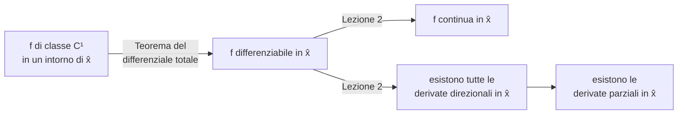
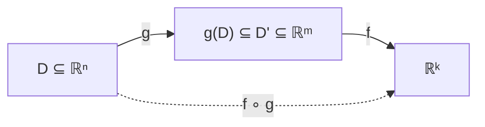

---

## corso: "Metodi Matematici per l'Ingegneria" lezione: 3 data: 2026-09-28 docente: Nicola Pinamonti argomenti: [derivabilità e differenziabilità, controesempio, teorema del differenziale totale, classe C1, funzioni a valori vettoriali, matrice jacobiana, regola della catena, teorema del valor medio] fonti: [trascrizione, appunti manuali, dispensa Morro] tags: [metodi-matematici, lezione]

---
# Lezione 3 — Differenziabilità: controesempi, condizione sufficiente, Jacobiana e regola della catena

La lezione chiarisce fino in fondo il rapporto tra derivabilità e differenziabilità. Un esempio esplicito mostra che una funzione può avere tutte le derivate direzionali in un punto senza essere differenziabile; un teorema fornisce poi una condizione sufficiente, la continuità delle derivate parziali, che nella pratica è il modo standard per verificare la differenziabilità. Nella seconda parte i concetti vengono estesi alle funzioni a valori vettoriali, il che porta alla matrice jacobiana e alla regola di derivazione delle funzioni composte (regola della catena). La lezione si chiude con l'enunciato del teorema del valor medio in più variabili.

## Comunicazioni organizzative

Su richiesta di alcuni studenti che dopo la lezione del venerdì devono seguire una lezione di fisica, la lezione del venerdì inizierà alle 14:00 esatte e terminerà alle 15:45, con un quarto d'ora di pausa. La lezione del lunedì inizierà alle 16:00 con l'obiettivo di terminare alle 18:30, anch'essa con un quarto d'ora di pausa.

## Richiamo della lezione precedente

Nella [[MM L02 - Derivate e differenziale|lezione 2]] si è visto che se $f : D \subseteq \mathbb{R}^n \to \mathbb{R}$ è differenziabile in un punto interno $\hat{\mathbf{x}}$, cioè è approssimabile linearmente vicino a quel punto, allora valgono due fatti: $f$ è **continua** in $\hat{\mathbf{x}}$, e $f$ è **derivabile** in $\hat{\mathbf{x}}$ in ogni direzione, quindi in particolare ammette tutte le derivate parziali, con $\frac{\partial f}{\partial \mathbf{v}}(\hat{\mathbf{x}}) = \nabla f(\hat{\mathbf{x}}) \cdot \mathbf{v}$.

Sarebbe comodo che valesse anche il viceversa, cioè che per verificare la differenziabilità bastasse calcolare le derivate. Questo **non è vero**: la freccia "differenziabile $\Rightarrow$ derivabile" non si può invertire, neppure se si richiede l'esistenza delle derivate in _tutte_ le direzioni. Per controllare se una funzione di più variabili è approssimabile linearmente bisogna dimostrare che è differenziabile, non basta calcolarne le derivate.

## Un controesempio: tutte le derivate direzionali, ma nessuna differenziabilità

### La funzione

Si consideri $f : \mathbb{R}^2 \to \mathbb{R}$ definita da $$f(x, y) = \begin{cases} \dfrac{x^2 y}{x^2 + y^2} & (x, y) \neq (0, 0), \mskip{15mu} 0 \cdot (x, y) = (0, 0). \end{cases}$$ Il valore nell'origine è fissato "a mano", perché lì il denominatore si annulla e la formula non avrebbe senso. Fuori dall'origine la funzione è un rapporto di polinomi con denominatore non nullo, quindi non presenta difficoltà di sorta: è continua e si può derivare quante volte si vuole. L'unico punto da studiare è l'origine.

### Continuità nell'origine

Bisogna verificare che $\lim_{(x, y) \to (0, 0)} f(x, y) = f(0, 0) = 0$, cioè che $$\forall, \varepsilon > 0 \ \ \exists, \delta_\varepsilon > 0 \ : \ 0 < \lVert (x, y) \rVert < \delta_\varepsilon \ \Longrightarrow \ |f(x, y)| < \varepsilon .$$

Come nella [[Zen/Anno 2/Metodi Matematici/generated/Lezione 1 - CLAUDE|Lezione 1 - CLAUDE]] (esempio del limite in $\mathbb{R}^3$), si separa l'informazione sulla distanza dall'origine da quella sulla direzione: per $\mathbf{x} = (x, y) \neq \mathbf{0}$ si scrive $\mathbf{x} = t,\mathbf{v}$ con $$t = \lVert \mathbf{x} \rVert > 0, \qquad \mathbf{v} = \frac{\mathbf{x}}{\lVert \mathbf{x} \rVert} = (\alpha, \beta), \qquad \alpha^2 + \beta^2 = 1 .$$ La condizione $\lVert \mathbf{v} \rVert = 1$ implica in particolare che $\alpha$ e $\beta$ non si annullano contemporaneamente e che $|\alpha|, |\beta| \le 1$. Sostituendo $x = t\alpha$, $y = t\beta$: $$f(\mathbf{x}) = \frac{t^2 \alpha^2 \cdot t\beta}{t^2 \alpha^2 + t^2 \beta^2} = \frac{t^3}{t^2} \cdot \frac{\alpha^2 \beta}{\underbrace{\alpha^2 + \beta^2}_{=,1}} = t, \alpha^2 \beta .$$ Poiché $|\alpha^2 \beta| \le 1$, si ottiene $|f(\mathbf{x})| \le t = \lVert \mathbf{x} \rVert$ per ogni $\mathbf{x} \neq \mathbf{0}$. Fissato $\varepsilon > 0$ basta allora scegliere $\delta_\varepsilon = \varepsilon$: $$0 < \lVert \mathbf{x} \rVert < \delta_\varepsilon \ \Longrightarrow \ |f(\mathbf{x})| \le \lVert \mathbf{x} \rVert < \delta_\varepsilon = \varepsilon .$$ Il limite vale quindi 0 e **$f$ è continua nell'origine**, e dunque su tutto $\mathbb{R}^2$.

> [!note] Precisazione sulla costante 
> A lezione il docente osserva che il caso peggiore $|\alpha^2 \beta| = 1$ non può realizzarsi (richiederebbe $|\alpha| = |\beta| = 1$, incompatibile con $\alpha^2 + \beta^2 = 1$), per cui la disuguaglianza è in realtà stretta. Ai fini della dimostrazione basta la stima $|\alpha^2\beta| \le 1$; il massimo effettivo di $|\alpha^2 \beta|$ sulla circonferenza unitaria è $\frac{2}{3\sqrt{3}} \approx 0{,}385$.

### Derivate direzionali nell'origine

Si fissa una direzione $\mathbf{w} = (\alpha, \beta) \neq \mathbf{0}$; questa volta non si richiede che $\mathbf{w}$ abbia norma 1, ma solo che non sia degenere, cioè che $\alpha$ e $\beta$ non siano entrambi nulli. Per definizione (e ricordando che $f(\mathbf{0}) = 0$): $$\frac{\partial f}{\partial \mathbf{w}}(\mathbf{0}) = \lim_{t \to 0} \frac{f(\mathbf{0} + t\mathbf{w}) - f(\mathbf{0})}{t} = \lim_{t \to 0} \frac{f(t\alpha, t\beta)}{t}.$$ Sostituendo: $$\frac{f(t\alpha, t\beta)}{t} = \frac{1}{t} \cdot \frac{t^3 \alpha^2 \beta}{t^2 (\alpha^2 + \beta^2)} = \frac{\alpha^2 \beta}{\alpha^2 + \beta^2}.$$ Il rapporto incrementale non dipende più da $t$, quindi il limite è banale, e il denominatore non si annulla perché $\mathbf{w} \neq \mathbf{0}$. Si conclude che $$\forall, \mathbf{w} = (\alpha, \beta) \neq \mathbf{0} \qquad \exists, \frac{\partial f}{\partial \mathbf{w}}(\mathbf{0}) = \frac{\alpha^2 \beta}{\alpha^2 + \beta^2}.$$

Alcuni casi particolari:

- direzione $\mathbf{e}_1 = (1, 0)$: $\dfrac{\partial f}{\partial x}(\mathbf{0}) = \dfrac{1 \cdot 0}{1} = 0$;
- direzione $\mathbf{e}_2 = (0, 1)$: $\dfrac{\partial f}{\partial y}(\mathbf{0}) = \dfrac{0 \cdot 1}{1} = 0$;
- direzione $\mathbf{e}_1 + \mathbf{e}_2 = (1, 1)$: $\dfrac{\partial f}{\partial (\mathbf{e}_1 + \mathbf{e}_2)}(\mathbf{0}) = \dfrac{1 \cdot 1}{1 + 1} = \dfrac{1}{2}$.

### La funzione non è differenziabile nell'origine

Si supponga per assurdo che $f$ sia differenziabile in $\mathbf{0}$. Allora esiste il differenziale $d_{\mathbf{0}} f : \mathbb{R}^2 \to \mathbb{R}$ e, per il teorema visto nella lezione 2, ogni derivata direzionale si ottiene applicando il differenziale, la cui rappresentazione matriciale è il gradiente: $$\frac{\partial f}{\partial \mathbf{w}}(\mathbf{0}) = (d_{\mathbf{0}} f), \mathbf{w} = \nabla f(\mathbf{0}) \cdot \mathbf{w} = \frac{\partial f}{\partial x}(\mathbf{0}), w_1 + \frac{\partial f}{\partial y}(\mathbf{0}), w_2 = 0 \cdot w_1 + 0 \cdot w_2 = 0 .$$ Tutte le derivate direzionali dovrebbero quindi essere nulle. Ma si è appena calcolato che nella direzione $(1, 1)$ la derivata vale $\tfrac{1}{2} \neq 0$: **assurdo**. L'ipotesi è falsa, e $f$ **non è differenziabile nell'origine**, pur essendo continua e pur avendo tutte le derivate direzionali.

> [!important] Morale dell'esempio 
> L'esistenza delle derivate parziali non garantisce l'esistenza delle derivate direzionali; e anche se esistono tutte le derivate direzionali, non è detto che la funzione sia differenziabile, cioè linearizzabile.

### Interpretazione geometrica

Il docente suggerisce di disegnare questa funzione con un programma di grafica: il grafico è continuo, ma nell'origine si vede una sorta di piega, "come un lenzuolo in cui si infila un dito", e lì la funzione non è approssimabile con un piano.

<svg viewBox="0 0 560 420" width="560" style="display:block;margin:1em auto;max-width:100%;height:auto;font-family:inherit" xmlns="http://www.w3.org/2000/svg"><polyline points="380.7,282.4 389,280.3 397,278.1 404.7,275.7 412,273.2 419,270.5 425.5,267.8 431.7,264.8 437.5,261.8 442.9,258.7 447.8,255.4 452.2,252.1 456.2,248.7 459.6,245.2 462.6,241.6 465.1,238 467.1,234.4 468.6,230.7 469.5,227 470,223.2 469.9,219.5 469.3,215.8 468.2,212.1 466.5,208.4 464.4,204.8 461.7,201.2 458.5,197.7 454.9,194.2 450.8,190.8 446.2,187.5 441.1,184.3 435.6,181.2 429.7,178.2 423.4,175.3 416.7,172.6 409.6,169.9 402.1,167.5 394.3,165.2 386.2,163 377.9,161 369.2,159.2 360.3,157.5 351.2,156 341.9,154.7 332.4,153.6 322.7,152.6 313,151.9 303.2,151.4 293.3,151 283.3,150.8 273.4,150.9 263.4,151.1 253.6,151.5 243.7,152.1 234,152.9 224.4,153.9 215,155.1 205.8,156.5 196.7,158 187.9,159.7 179.3,161.6 171,163.7 163,165.9 155.3,168.3 148,170.8 141,173.5 134.5,176.2 128.3,179.2 122.5,182.2 117.1,185.3 112.2,188.6 107.8,191.9 103.8,195.3 100.4,198.8 97.4,202.4 94.9,206 92.9,209.6 91.4,213.3 90.5,217 90,220.8 90.1,224.5 90.7,228.2 91.8,231.9 93.5,235.6 95.6,239.2 98.3,242.8 101.5,246.3 105.1,249.8 109.2,253.2 113.8,256.5 118.9,259.7 124.4,262.8 130.3,265.8 136.6,268.7 143.3,271.4 150.4,274.1 157.9,276.5 165.7,278.8 173.8,281 182.1,283 190.8,284.8 199.7,286.5 208.8,288 218.1,289.3 227.6,290.4 237.3,291.4 247,292.1 256.8,292.6 266.7,293 276.7,293.2 286.6,293.1 296.6,292.9 306.4,292.5 316.3,291.9 326,291.1 335.6,290.1 345,288.9 354.2,287.5 363.3,286 372.1,284.3 380.7,282.4" fill="currentColor" fill-opacity="0.05" stroke="currentColor" stroke-opacity="0.35" stroke-dasharray="4 4"/><line x1="154.1" y1="146.5" x2="410.9" y2="300.5" stroke="currentColor" stroke-width="1.1"/><polygon points="410.9,300.5 403.9,300.1 407.3,294.5" fill="currentColor"/><text x="416.9" y="304.5" font-size="13" text-anchor="start" fill="currentColor" font-style="italic">x</text><line x1="78.6" y1="269.1" x2="489.5" y2="173" stroke="currentColor" stroke-width="1.1"/><polygon points="489.5,173 484.2,177.6 482.7,171.2" fill="currentColor"/><text x="495.5" y="177" font-size="13" text-anchor="start" fill="currentColor" font-style="italic">y</text><line x1="280" y1="222" x2="280" y2="47.2" stroke="currentColor" stroke-width="1.1"/><polygon points="280,47.2 283.3,53.4 276.7,53.4" fill="currentColor"/><text x="286" y="51.2" font-size="13" text-anchor="start" fill="currentColor" font-style="italic">z</text><polyline points="330.3,252.2 333.1,246.6 335.8,241 338.5,235.5 341.1,230 343.6,224.7 346,219.6 348.3,214.6 350.6,209.9 352.8,205.5 354.9,201.3 356.9,197.5 358.8,194.1 360.6,191 362.3,188.2 363.9,185.9 365.4,183.9 366.8,182.3 368.1,181.1 369.3,180.3 370.4,179.8 371.3,179.7 372.2,180 372.9,180.5 373.6,181.3 374.1,182.3 374.5,183.6 374.8,185.1 374.9,186.7 375,188.4 374.9,190.2 374.8,192.1 374.5,193.9 374.1,195.7 373.6,197.5 372.9,199.1 372.2,200.6 371.3,201.9 370.4,203 369.3,203.9 368.1,204.5 366.8,204.8 365.4,204.9 363.9,204.6 362.3,204 360.6,203.1 358.8,201.9 356.9,200.4 354.9,198.6 352.8,196.4 350.6,194 348.3,191.3 346,188.4 343.6,185.3 341.1,181.9 338.5,178.5 335.8,174.9 333.1,171.2 330.3,167.5 327.5,163.8 324.6,160.1 321.6,156.5 318.6,153 315.6,149.6 312.5,146.5 309.4,143.5 306.2,140.9 303,138.5 299.8,136.5 296.5,134.9 293.2,133.6 289.9,132.7 286.6,132.3 283.3,132.3 280,132.7 276.7,133.6 273.4,134.9 270.1,136.7 266.8,138.9 263.5,141.6 260.2,144.6 257,148.1 253.8,151.9 250.6,156.1 247.5,160.5 244.4,165.3 241.4,170.3 238.4,175.4 235.4,180.8 232.5,186.3 229.7,191.8 226.9,197.4 224.2,203 221.5,208.5 218.9,214 216.4,219.3 214,224.4 211.7,229.4 209.4,234.1 207.2,238.5 205.1,242.7 203.1,246.5 201.2,249.9 199.4,253 197.7,255.8 196.1,258.1 194.6,260.1 193.2,261.7 191.9,262.9 190.7,263.7 189.6,264.2 188.7,264.3 187.8,264 187.1,263.5 186.4,262.7 185.9,261.7 185.5,260.4 185.2,258.9 185.1,257.3 185,255.6 185.1,253.8 185.2,251.9 185.5,250.1 185.9,248.3 186.4,246.5 187.1,244.9 187.8,243.4 188.7,242.1 189.6,241 190.7,240.1 191.9,239.5 193.2,239.2 194.6,239.1 196.1,239.4 197.7,240 199.4,240.9 201.2,242.1 203.1,243.6 205.1,245.4 207.2,247.6 209.4,250 211.7,252.7 214,255.6 216.4,258.7 218.9,262.1 221.5,265.5 224.2,269.1 226.9,272.8 229.7,276.5 232.5,280.2 235.4,283.9 238.4,287.5 241.4,291 244.4,294.4 247.5,297.5 250.6,300.5 253.8,303.1 257,305.5 260.2,307.5 263.5,309.1 266.8,310.4 270.1,311.3 273.4,311.7 276.7,311.7 280,311.3 283.3,310.4 286.6,309.1 289.9,307.3 293.2,305.1 296.5,302.4 299.8,299.4 303,295.9 306.2,292.1 309.4,287.9 312.5,283.5 315.6,278.7 318.6,273.7 321.6,268.6 324.6,263.2 327.5,257.7 330.3,252.2" fill="none" stroke="currentColor" stroke-opacity="0.55" stroke-width="1.2"/><polyline points="380.7,282.4 386.2,271.2 391.7,260 397,248.9 402.1,238.1 407.1,227.4 412,217.1 416.7,207.2 421.2,197.8 425.5,189 429.7,180.7 433.7,173.1 437.5,166.1 441.1,159.9 444.5,154.4 447.8,149.7 450.8,145.8 453.6,142.6 456.2,140.2 458.5,138.6 460.7,137.7 462.6,137.5 464.4,137.9 465.8,139 467.1,140.6 468.2,142.7 469,145.3 469.5,148.2 469.9,151.4 470,154.9 469.9,158.5 469.5,162.2 469,165.9 468.2,169.5 467.1,173 465.8,176.2 464.4,179.2 462.6,181.8 460.7,184 458.5,185.7 456.2,187 453.6,187.6 450.8,187.7 447.8,187.2 444.5,186.1 441.1,184.3 437.5,181.9 433.7,178.8 429.7,175.1 425.5,170.8 421.2,166 416.7,160.6 412,154.8 407.1,148.5 402.1,141.9 397,134.9 391.7,127.7 386.2,120.4 380.7,113 375,105.5 369.2,98.1 363.3,90.9 357.3,83.9 351.2,77.2 345,70.9 338.7,65.1 332.4,59.8 326,55.1 319.5,51.1 313,47.7 306.4,45.2 299.9,43.5 293.3,42.6 286.6,42.5 280,43.4 273.4,45.2 266.7,47.8 260.1,51.4 253.6,55.8 247,61.1 240.5,67.3 234,74.2 227.6,81.8 221.3,90.1 215,99 208.8,108.5 202.7,118.5 196.7,128.9 190.8,139.6 185,150.5 179.3,161.6 173.8,172.8 168.3,184 163,195.1 157.9,205.9 152.9,216.6 148,226.9 143.3,236.8 138.8,246.2 134.5,255 130.3,263.3 126.3,270.9 122.5,277.9 118.9,284.1 115.5,289.6 112.2,294.3 109.2,298.2 106.4,301.4 103.8,303.8 101.5,305.4 99.3,306.3 97.4,306.5 95.6,306.1 94.2,305 92.9,303.4 91.8,301.3 91,298.7 90.5,295.8 90.1,292.6 90,289.1 90.1,285.5 90.5,281.8 91,278.1 91.8,274.5 92.9,271 94.2,267.8 95.6,264.8 97.4,262.2 99.3,260 101.5,258.3 103.8,257 106.4,256.4 109.2,256.3 112.2,256.8 115.5,257.9 118.9,259.7 122.5,262.1 126.3,265.2 130.3,268.9 134.5,273.2 138.8,278 143.3,283.4 148,289.2 152.9,295.5 157.9,302.1 163,309.1 168.3,316.3 173.8,323.6 179.3,331 185,338.5 190.8,345.9 196.7,353.1 202.7,360.1 208.8,366.8 215,373.1 221.3,378.9 227.6,384.2 234,388.9 240.5,392.9 247,396.3 253.6,398.8 260.1,400.5 266.7,401.4 273.4,401.5 280,400.6 286.6,398.8 293.3,396.2 299.9,392.6 306.4,388.2 313,382.9 319.5,376.7 326,369.8 332.4,362.2 338.7,353.9 345,345 351.2,335.5 357.3,325.5 363.3,315.1 369.2,304.4 375,293.5 380.7,282.4" fill="none" stroke="currentColor" stroke-opacity="0.55" stroke-width="1.2"/><line x1="179.3" y1="161.6" x2="380.7" y2="282.4" stroke="#3b82f6" stroke-width="1.4" stroke-opacity="0.85"/><line x1="141" y1="241.5" x2="419" y2="202.5" stroke="#3b82f6" stroke-width="1.4" stroke-opacity="0.85"/><line x1="112.2" y1="294.3" x2="447.8" y2="149.7" stroke="#3b82f6" stroke-width="1.4" stroke-opacity="0.85"/><line x1="94.9" y1="305.6" x2="465.1" y2="138.4" stroke="#3b82f6" stroke-width="1.4" stroke-opacity="0.85"/><line x1="90.1" y1="285.5" x2="469.9" y2="158.5" stroke="#3b82f6" stroke-width="1.4" stroke-opacity="0.85"/><line x1="98.3" y1="261" x2="461.7" y2="183" stroke="#3b82f6" stroke-width="1.4" stroke-opacity="0.85"/><line x1="118.9" y1="259.7" x2="441.1" y2="184.3" stroke="#3b82f6" stroke-width="1.4" stroke-opacity="0.85"/><line x1="150.4" y1="292.3" x2="409.6" y2="151.7" stroke="#3b82f6" stroke-width="1.4" stroke-opacity="0.85"/><line x1="190.8" y1="345.9" x2="369.2" y2="98.1" stroke="#3b82f6" stroke-width="1.4" stroke-opacity="0.85"/><line x1="237.3" y1="391" x2="322.7" y2="53" stroke="#3b82f6" stroke-width="1.4" stroke-opacity="0.85"/><line x1="286.6" y1="398.8" x2="273.4" y2="45.2" stroke="#3b82f6" stroke-width="1.4" stroke-opacity="0.85"/><line x1="335.6" y1="358.1" x2="224.4" y2="85.9" stroke="#3b82f6" stroke-width="1.4" stroke-opacity="0.85"/><line x1="94.9" y1="305.6" x2="465.1" y2="138.4" stroke="#e05a47" stroke-width="2.6"/><text x="473.1" y="134.4" font-size="12" text-anchor="start" fill="#e05a47">direzione (1, 1)</text><circle cx="280" cy="222" r="3.5" fill="currentColor"/><text x="16" y="24" font-size="11" text-anchor="start" fill="currentColor">scala verticale amplificata ×1,6</text></svg>

La figura (aggiunta a scopo illustrativo) rende evidente il motivo. Dal calcolo precedente $f(t\mathbf{v}) = t, f(\mathbf{v})$ per ogni $t$: il grafico è formato da **segmenti rettilinei passanti per l'origine** (in blu), uno per ogni direzione, ciascuno con la propria pendenza $\frac{\partial f}{\partial \mathbf{w}}(\mathbf{0})$. Se $f$ fosse differenziabile, tutte queste rette dovrebbero stare nello stesso piano, il piano tangente; poiché il gradiente è nullo, l'unico candidato sarebbe il piano orizzontale $z = 0$ (il disco tratteggiato). Ma la retta nella direzione $(1, 1)$, in rosso, sale con pendenza non nulla. In termini algebrici: per una funzione differenziabile la mappa $\mathbf{w} \mapsto \frac{\partial f}{\partial \mathbf{w}}(\hat{\mathbf{x}})$ deve essere **lineare** (è il differenziale), mentre qui $\mathbf{w} \mapsto \frac{\alpha^2 \beta}{\alpha^2 + \beta^2}$ non lo è. Questo fornisce un test rapido: se le derivate direzionali esistono ma non dipendono linearmente dalla direzione, la funzione non è differenziabile.

## Una condizione sufficiente per la differenziabilità

L'esempio mostra che le sole derivate non bastano. Serve un criterio che, a partire da proprietà delle derivate parziali, garantisca la differenziabilità; questo criterio è il teorema seguente, spesso chiamato **teorema del differenziale totale**.

> [!important] Teorema — Condizione sufficiente per la differenziabilità 
> Siano $f : D \subseteq \mathbb{R}^n \to \mathbb{R}$ e $\hat{\mathbf{x}} \in \mathring{D}$, con $r > 0$ tale che $B(\hat{\mathbf{x}}, r) \subseteq D$. Se $f$ ammette tutte le derivate parziali in $B(\hat{\mathbf{x}}, r)$ e le derivate parziali sono continue, allora $f$ è differenziabile in $\hat{\mathbf{x}}$.

### Dimostrazione (caso $n = 2$)

Il docente svolge la dimostrazione nel caso di due variabili, perché permette di capire dove interviene in modo essenziale la continuità delle derivate. Si indica il punto con $\hat{\mathbf{x}} = (\hat{x}, \hat{y})$ e il punto vicino con $(\hat{x} + h, \hat{y} + k)$, con $\lVert (h, k) \rVert < r$.

**Idea: muoversi lungo le direzioni coordinate.** Le uniche informazioni disponibili riguardano le derivate rispetto a $x$ e rispetto a $y$, quindi conviene andare da $(\hat{x}, \hat{y})$ a $(\hat{x} + h, \hat{y} + k)$ con un percorso che si muove prima solo lungo $x$ e poi solo lungo $y$, passando per il punto intermedio $(\hat{x} + h, \hat{y})$. Tutto il percorso resta nella palla $B(\hat{\mathbf{x}}, r)$, perché ogni suo punto dista dal centro al più $\sqrt{h^2 + k^2} < r$.

<svg viewBox="0 0 520 300" width="520" style="display:block;margin:1em auto;max-width:100%;height:auto;font-family:inherit" xmlns="http://www.w3.org/2000/svg"><line x1="40" y1="270" x2="500" y2="270" stroke="currentColor" stroke-width="1.1"/><polygon points="500,270 493.8,273.3 493.8,266.7" fill="currentColor"/><line x1="60" y1="285" x2="60" y2="20" stroke="currentColor" stroke-width="1.1"/><polygon points="60,20 63.3,26.2 56.7,26.2" fill="currentColor"/><text x="500" y="290" font-size="13" text-anchor="end" fill="currentColor" font-style="italic">x</text><text x="70" y="28" font-size="13" text-anchor="start" fill="currentColor" font-style="italic">y</text><line x1="130" y1="220" x2="400" y2="70" stroke="currentColor" stroke-opacity="0.4" stroke-dasharray="5 4"/><line x1="130" y1="220" x2="396" y2="220" stroke="#3b82f6" stroke-width="2.2"/><polygon points="396,220 387.2,224.7 387.2,215.3" fill="#3b82f6"/><line x1="400" y1="220" x2="400" y2="74" stroke="#e05a47" stroke-width="2.2"/><polygon points="400,74 404.7,82.8 395.3,82.8" fill="#e05a47"/><circle cx="130" cy="220" r="4" fill="currentColor"/><circle cx="400" cy="220" r="4" fill="currentColor"/><circle cx="400" cy="70" r="4" fill="currentColor"/><text x="124" y="242" font-size="13" text-anchor="middle" fill="currentColor">(x̂, ŷ)</text><text x="406" y="242" font-size="13" text-anchor="middle" fill="currentColor">(x̂ + h, ŷ)</text><text x="410" y="62" font-size="13" text-anchor="start" fill="currentColor">(x̂ + h, ŷ + k)</text><circle cx="250" cy="220" r="3.5" fill="#3b82f6"/><text x="250" y="210" font-size="12" text-anchor="middle" fill="#3b82f6">(η, ŷ)</text><circle cx="400" cy="130" r="3.5" fill="#e05a47"/><text x="410" y="134" font-size="12" text-anchor="start" fill="#e05a47">(x̂ + h, ξ)</text><text x="250" y="242" font-size="12" text-anchor="middle" fill="#3b82f6">1° tratto: varia solo x</text><text x="410" y="168" font-size="12" text-anchor="start" fill="#e05a47">2° tratto:</text><text x="410" y="184" font-size="12" text-anchor="start" fill="#e05a47">varia solo y</text></svg>

Aggiungendo e sottraendo il valore nel punto intermedio: $$f(\hat{x} + h, \hat{y} + k) - f(\hat{x}, \hat{y}) = \underbrace{\big[ f(\hat{x} + h, \hat{y} + k) - f(\hat{x} + h, \hat{y}) \big]}_{\text{varia solo } y} + \underbrace{\big[ f(\hat{x} + h, \hat{y}) - f(\hat{x}, \hat{y}) \big]}_{\text{varia solo } x}.$$

**Primo addendo.** Si considera la funzione di una variabile $\varphi(y) = f(\hat{x} + h, y)$, con $y$ nell'intervallo di estremi $\hat{y}$ e $\hat{y} + k$. Si è bloccata un'entrata di $f$ e si lascia variare l'altra; poiché la derivata parziale rispetto a $y$ esiste in tutta la palla, $\varphi$ è derivabile (quindi anche continua) sull'intervallo. Valgono le ipotesi del **teorema di Lagrange** in una variabile, noto da Analisi 1: esiste $\xi$ compreso tra $\hat{y}$ e $\hat{y} + k$ tale che $$f(\hat{x} + h, \hat{y} + k) - f(\hat{x} + h, \hat{y}) = \varphi(\hat{y} + k) - \varphi(\hat{y}) = \varphi'(\xi), k = \frac{\partial f}{\partial y}(\hat{x} + h, \xi), k .$$

**Secondo addendo.** Con lo stesso ragionamento, la funzione $\psi(x) = f(x, \hat{y})$, con $x$ tra $\hat{x}$ e $\hat{x} + h$, soddisfa le ipotesi di Lagrange, e quindi esiste $\eta$ compreso tra $\hat{x}$ e $\hat{x} + h$ tale che $$f(\hat{x} + h, \hat{y}) - f(\hat{x}, \hat{y}) = \psi(\hat{x} + h) - \psi(\hat{x}) = \frac{\partial f}{\partial x}(\eta, \hat{y}), h .$$

**Il punto chiave: la continuità delle derivate.** Le derivate non sono calcolate in $(\hat{x}, \hat{y})$, ma nei punti intermedi $(\hat{x} + h, \xi)$ e $(\eta, \hat{y})$. Quando $(h, k) \to (0, 0)$, però, questi punti tendono a $(\hat{x}, \hat{y})$, e la **continuità** delle derivate parziali permette di sostituire i valori nei punti intermedi con quelli in $(\hat{x}, \hat{y})$ commettendo un errore che tende a zero: $$\frac{\partial f}{\partial y}(\hat{x} + h, \xi) = \frac{\partial f}{\partial y}(\hat{x}, \hat{y}) + \varepsilon_2(h, k), \qquad \frac{\partial f}{\partial x}(\eta, \hat{y}) = \frac{\partial f}{\partial x}(\hat{x}, \hat{y}) + \varepsilon_1(h, k),$$ con $\varepsilon_1, \varepsilon_2 \to 0$ per $(h, k) \to (0, 0)$. Il docente indica quantità di questo tipo con la notazione $o(1)$, "o piccolo di 1": quantità che tendono a zero senza bisogno di dividere per nulla.

**Conclusione.** Mettendo insieme i pezzi: $$f(\hat{x} + h, \hat{y} + k) - f(\hat{x}, \hat{y}) = \frac{\partial f}{\partial x}(\hat{x}, \hat{y}), h + \frac{\partial f}{\partial y}(\hat{x}, \hat{y}), k + \underbrace{\varepsilon_1(h, k), h + \varepsilon_2(h, k), k}_{=:\ R(h, k)} .$$ I primi due termini sono una funzione lineare di $(h, k)$, cioè $\nabla f(\hat{x}, \hat{y}) \cdot (h, k)$. Il resto è trascurabile rispetto a $\lVert (h, k) \rVert$: poiché $|h|, |k| \le \lVert (h, k) \rVert$, $$\frac{|R(h, k)|}{\lVert (h, k) \rVert} \le |\varepsilon_1(h, k)| + |\varepsilon_2(h, k)| \xrightarrow[(h, k) \to (0, 0)]{} 0,$$ cioè $R(h, k) = o\big(\sqrt{h^2 + k^2}\big)$: un o piccolo di 1 moltiplicato per $h$ (o per $k$) è un o piccolo di $\lVert (h, k) \rVert$. Esiste dunque un'applicazione lineare che approssima l'incremento a meno di un o piccolo, e $f$ è differenziabile in $(\hat{x}, \hat{y})$. $\blacksquare$

Ciò che ha permesso di ottenere il differenziale sono state due proprietà: l'**esistenza** delle derivate parziali in un intorno (per applicare Lagrange) e la loro **continuità** (per riportare le derivate nel punto $\hat{\mathbf{x}}$). Senza continuità la conclusione non vale, ed è proprio ciò che va storto nel controesempio: lì le derivate parziali non sono continue nell'origine. Lo si verifica direttamente (calcolo aggiunto): per $(x, y) \neq (0, 0)$ $$\frac{\partial f}{\partial x}(x, y) = \frac{2xy(x^2 + y^2) - x^2 y \cdot 2x}{(x^2 + y^2)^2} = \frac{2 x y^3}{(x^2 + y^2)^2},$$ che lungo la bisettrice $y = x$ vale costantemente $\frac{2x^4}{4x^4} = \frac{1}{2}$, mentre $\frac{\partial f}{\partial x}(0, 0) = 0$.

> [!tip] Approfondimento — Il caso generale e un'ipotesi più debole #approfondimento Per $n$ variabili la dimostrazione è identica: si va da $\hat{\mathbf{x}}$ a $\mathbf{x}$ cambiando una coordinata alla volta, si scrive l'incremento come somma "telescopica" di $n$ incrementi lungo gli assi e si applica Lagrange a ciascuno; è la dimostrazione proposta nella dispensa di riferimento [@morro2023, §1.3.1]. Si osservi inoltre che nell'argomento la continuità delle derivate parziali è stata usata solo **nel punto** $\hat{\mathbf{x}}$ (per far tendere i valori nei punti intermedi a quelli in $\hat{\mathbf{x}}$): basta quindi che le derivate parziali esistano in un intorno e siano continue in $\hat{\mathbf{x}}$.

### Funzioni di classe $C^1$ e quadro delle implicazioni

Una funzione definita su un aperto $A$ le cui derivate parziali esistono e sono continue in tutto $A$ si dice **di classe $C^1$** su $A$ (o _differenziabile con continuità_), e si scrive $f \in C^1(A)$. Per il teorema appena dimostrato, una funzione di classe $C^1$ è differenziabile in ogni punto di $A$. La catena di implicazioni ottenuta finora è la seguente; nessuna freccia si può invertire.

> [!tip] Approfondimento — Un controesempio per ogni freccia #approfondimento Le funzioni incontrate finora (e una nuova) mostrano che nessuna implicazione è invertibile; in tutti i casi la funzione vale 0 nell'origine e il punto studiato è l'origine.
> 
> |Funzione per $(x, y) \neq (0, 0)$|Cosa possiede|Cosa le manca|Dove|
> |:--|:--|:--|:--|
> |$\dfrac{xy}{x^2 + y^2}$|derivate parziali (nulle)|derivate direzionali, continuità|lezione 2|
> |$\dfrac{x^2 y}{x^4 + y^2}$|tutte le derivate direzionali|continuità, differenziabilità|lezione 1|
> |$\dfrac{x^2 y}{x^2 + y^2}$|continuità, tutte le derivate direzionali|differenziabilità|questa lezione|
> |$(x^2 + y^2) \sin \dfrac{1}{\sqrt{x^2 + y^2}}$|differenziabilità|derivate parziali continue|nuovo|
> 
> Per la seconda riga: con $\mathbf{v} = (a, b)$ si ha $\frac{h(t\mathbf{v})}{t} = \frac{a^2 b}{t^2 a^4 + b^2} \to \frac{a^2}{b}$ se $b \neq 0$, e $0$ se $b = 0$, quindi tutte le derivate direzionali esistono, ma lungo la parabola $y = x^2$ la funzione vale $\tfrac{1}{2}$. Per la prima riga, lungo $(1, 1)$ il rapporto incrementale è $\frac{1/2}{t}$, che diverge. Per l'ultima riga: $|f(\mathbf{x})| \le \lVert \mathbf{x} \rVert^2 = o(\lVert \mathbf{x} \rVert)$, quindi $f$ è differenziabile nell'origine con differenziale nullo; ma per $\mathbf{x} \neq \mathbf{0}$, posto $\rho = \lVert \mathbf{x} \rVert$, $$\frac{\partial f}{\partial x}(x, y) = 2x \sin\frac{1}{\rho} - \frac{x}{\rho} \cos\frac{1}{\rho},$$ che lungo il semiasse $y = 0$, $x > 0$ diventa $2x \sin\frac{1}{x} - \cos\frac{1}{x}$ e non ha limite per $x \to 0^+$. Dunque la condizione $C^1$ è sufficiente ma non necessaria per la differenziabilità.

## Funzioni a valori vettoriali

Si passa ora a funzioni $f : D \subseteq \mathbb{R}^n \to \mathbb{R}^m$. Come anticipato nella lezione 1, una tale funzione è una collezione di $m$ funzioni reali $f_1, \dots, f_m$, e quasi tutto ciò che si è visto si estende "componente per componente".

### Limiti

Sia $\hat{\mathbf{x}}$ un punto di accumulazione di $D$ e $\mathbf{L} = (L_1, \dots, L_m) \in \mathbb{R}^m$. Calcolare il limite di tutta la funzione equivale a calcolare il limite di ciascuna componente: $$\lim_{\mathbf{x} \to \hat{\mathbf{x}}} f(\mathbf{x}) = \mathbf{L} \quad \Longleftrightarrow \quad \lim_{\mathbf{x} \to \hat{\mathbf{x}}} f_i(\mathbf{x}) = L_i \quad \forall, i \in {1, \dots, m}.$$

> [!tip] Approfondimento — Perché basta controllare le componenti #approfondimento L'equivalenza segue da due disuguaglianze elementari tra la norma di un vettore e le sue componenti: per ogni $\mathbf{u} \in \mathbb{R}^m$ $$|u_i| \le \lVert \mathbf{u} \rVert \le |u_1| + |u_2| + \dots + |u_m| .$$ Applicandole a $\mathbf{u} = f(\mathbf{x}) - \mathbf{L}$: se la norma tende a zero tende a zero ogni componente (prima disuguaglianza); se ogni componente tende a zero tende a zero la somma, e quindi la norma (seconda disuguaglianza, che discende dalla disuguaglianza triangolare scrivendo $\mathbf{u} = \sum_i u_i \mathbf{e}_i$).

> [!warning] Discrepanza tra fonti: indice delle componenti Negli appunti in Markdown l'equivalenza è scritta "per ogni $i \in {1, \dots, n}$". Le componenti di una funzione a valori in $\mathbb{R}^m$ sono $m$, come detto anche a lezione ("e le componenti sono $m$").

### Derivate direzionali

Lo stesso vale per le derivate direzionali, che sono limiti di rapporti incrementali. Per $\mathbf{v} \neq \mathbf{0}$ e $\hat{\mathbf{x}}$ interno: $$\frac{\partial f}{\partial \mathbf{v}}(\hat{\mathbf{x}}) = \lim_{t \to 0} \frac{f(\hat{\mathbf{x}} + t\mathbf{v}) - f(\hat{\mathbf{x}})}{t} = \left( \frac{\partial f_1}{\partial \mathbf{v}}(\hat{\mathbf{x}}), \ \frac{\partial f_2}{\partial \mathbf{v}}(\hat{\mathbf{x}}), \ \dots, \ \frac{\partial f_m}{\partial \mathbf{v}}(\hat{\mathbf{x}}) \right).$$ Calcolare una derivata direzionale di una funzione a valori vettoriali equivale a calcolare $m$ derivate direzionali, una per ogni componente.

### Differenziabilità e matrice jacobiana

> [!important] Definizione — Differenziabilità per funzioni a valori vettoriali Siano $f : D \subseteq \mathbb{R}^n \to \mathbb{R}^m$ e $\hat{\mathbf{x}} \in \mathring{D}$. La funzione $f$ è differenziabile in $\hat{\mathbf{x}}$ se esiste un'applicazione **lineare** $\varphi : \mathbb{R}^n \to \mathbb{R}^m$ tale che $$f(\mathbf{x}) - f(\hat{\mathbf{x}}) = \varphi(\mathbf{x} - \hat{\mathbf{x}}) + o(\lVert \mathbf{x} - \hat{\mathbf{x}} \rVert), \qquad \text{dove} \quad \lim_{\mathbf{x} \to \hat{\mathbf{x}}} \frac{o(\lVert \mathbf{x} - \hat{\mathbf{x}} \rVert)}{\lVert \mathbf{x} - \hat{\mathbf{x}} \rVert} = \mathbf{0}.$$ L'applicazione $\varphi$ è il **differenziale** di $f$ in $\hat{\mathbf{x}}$: $\varphi(\mathbf{h}) = (d_{\hat{\mathbf{x}}} f), \mathbf{h}$, con $\mathbf{h} \in \mathbb{R}^n$.

L'unica differenza rispetto al caso scalare è che ora l'applicazione lineare arriva in $\mathbb{R}^m$ e il resto è un vettore di $\mathbb{R}^m$. Scrivendo la definizione componente per componente si vede che **$f$ è differenziabile in $\hat{\mathbf{x}}$ se e solo se lo è ciascuna delle sue componenti** $f_1, \dots, f_m$.

Come ogni applicazione lineare da $\mathbb{R}^n$ in $\mathbb{R}^m$, il differenziale è descritto da una matrice. Questa deve ricevere vettori colonna di dimensione $n$ e restituire vettori colonna di dimensione $m$, quindi ha **$m$ righe e $n$ colonne**.

> [!important] Definizione — Matrice jacobiana La matrice che rappresenta $d_{\hat{\mathbf{x}}} f$ si chiama matrice jacobiana di $f$ in $\hat{\mathbf{x}}$ e si indica con $J_{\hat{\mathbf{x}}} f$: $$J_{\hat{\mathbf{x}}} f = \begin{pmatrix} \dfrac{\partial f_1}{\partial x_1} & \dfrac{\partial f_1}{\partial x_2} & \cdots & \dfrac{\partial f_1}{\partial x_n} \[2mm] \dfrac{\partial f_2}{\partial x_1} & \dfrac{\partial f_2}{\partial x_2} & \cdots & \dfrac{\partial f_2}{\partial x_n} \[1mm] \vdots & \vdots & \ddots & \vdots \[1mm] \dfrac{\partial f_m}{\partial x_1} & \dfrac{\partial f_m}{\partial x_2} & \cdots & \dfrac{\partial f_m}{\partial x_n} \end{pmatrix}, \qquad \big( J_{\hat{\mathbf{x}}} f \big)_{jk} = \frac{\partial f_j}{\partial x_k}(\hat{\mathbf{x}}),$$ con tutte le derivate calcolate in $\hat{\mathbf{x}}$.

La struttura della matrice si legge in due modi. La **$j$-esima riga** è il gradiente della $j$-esima componente, $\nabla f_j(\hat{\mathbf{x}})$: è coerente con il fatto che il differenziale della funzione reale $f_j$ è descritto dal suo gradiente. La **$k$-esima colonna** è il vettore delle derivate parziali di tutte le componenti rispetto a $x_k$, cioè $\frac{\partial f}{\partial x_k}(\hat{\mathbf{x}}) \in \mathbb{R}^m$. In sintesi: il differenziale di una funzione a valori reali è descritto da un vettore riga (il gradiente), quello di una funzione a valori vettoriali da una matrice, ciascuna riga della quale è un gradiente.

> [!example] Esempio (aggiunto) — La Jacobiana delle coordinate polari La funzione $g(r, \theta) = (r \cos\theta, \ r \sin\theta)$, definita per $r > 0$, che verrà usata in un esercizio della lezione 4, ha componenti $g_1 = r\cos\theta$ e $g_2 = r\sin\theta$. La sua Jacobiana è la matrice $2 \times 2$ $$J_{(r, \theta)}, g = \begin{pmatrix} \dfrac{\partial g_1}{\partial r} & \dfrac{\partial g_1}{\partial \theta} \[2mm] \dfrac{\partial g_2}{\partial r} & \dfrac{\partial g_2}{\partial \theta} \end{pmatrix} = \begin{pmatrix} \cos\theta & -r \sin\theta \ \sin\theta & r \cos\theta \end{pmatrix}.$$ La prima riga è $\nabla g_1$, la seconda $\nabla g_2$; la prima colonna è $\frac{\partial g}{\partial r}$, la seconda $\frac{\partial g}{\partial \theta}$.

> [!warning] Discrepanza tra fonti: righe e colonne 
> Negli appunti in Markdown compare "$k$-esima riga di $J_{\hat{\mathbf{x}}} f$ è $\frac{\partial f}{\partial x_k}$": si tratta della $k$-esima **colonna**, come indicato a lezione. Nella trascrizione la matrice è descritta come "con $m$ righe e $m$ colonne", evidente errore di trascrizione: le righe sono $m$ (una per componente) e le colonne $n$ (una per variabile).

## Regola della catena (derivazione delle funzioni composte)

### Quando si può comporre

Ora le funzioni da comporre sono funzioni di più variabili, e bisogna fare attenzione a domini e codomini. Siano $$g : D \subseteq \mathbb{R}^n \to \mathbb{R}^m, \qquad f : D' \subseteq \mathbb{R}^m \to \mathbb{R}^k .$$ Si vuole applicare prima $g$ e poi $f$. Perché questo abbia senso, ogni punto in cui $g$ manda gli elementi di $D$ deve stare nel dominio di $f$: occorre che $$g(D) \subseteq D' .$$ Sotto questa ipotesi ha senso calcolare $f\big(g(\mathbf{x})\big)$ per ogni $\mathbf{x} \in D$, e si definisce la **funzione composta** $f \circ g : D \to \mathbb{R}^k$, $(f \circ g)(\mathbf{x}) = f\big(g(\mathbf{x})\big)$. La condizione $g(D) \subseteq D'$ è necessaria: se $g$ portasse qualche punto fuori dal dominio di $f$, non si potrebbe più applicare $f$.

### Il teorema

> [!important] Teorema — Regola della catena 
> Siano $g : D \subseteq \mathbb{R}^n \to \mathbb{R}^m$ e $f : D' \subseteq \mathbb{R}^m \to \mathbb{R}$ con $g(D) \subseteq D'$. Se $g$ è differenziabile in $\hat{\mathbf{x}}$ e $f$ è differenziabile in $\hat{\mathbf{y}} = g(\hat{\mathbf{x}})$, allora $f \circ g$ è differenziabile in $\hat{\mathbf{x}}$ e $$d_{\hat{\mathbf{x}}} (f \circ g) = d_{g(\hat{\mathbf{x}})} f \circ d_{\hat{\mathbf{x}}}, g .$$ In forma matriciale il gradiente della composta è il prodotto riga per colonna $$\nabla (f \circ g)(\hat{\mathbf{x}}) = \nabla f\big(g(\hat{\mathbf{x}})\big); J_{\hat{\mathbf{x}}}, g ,$$ e in componenti $$f\big(g(\mathbf{x})\big) - f\big(g(\hat{\mathbf{x}})\big) = \sum_{j=1}^{m} \sum_{k=1}^{n} \frac{\partial f}{\partial y_j}\big(g(\hat{\mathbf{x}})\big), \frac{\partial g_j}{\partial x_k}(\hat{\mathbf{x}}), (\mathbf{x} - \hat{\mathbf{x}})_k + o(\lVert \mathbf{x} - \hat{\mathbf{x}} \rVert).$$

Il docente considera, per semplicità, il caso in cui $f$ è a valori reali. La forma matriciale è facile da ricordare: il gradiente di $f$ è un vettore riga con $m$ componenti, la Jacobiana di $g$ è una matrice $m \times n$, e il loro prodotto è un vettore riga con $n$ componenti, come deve essere il gradiente di una funzione definita su un sottoinsieme di $\mathbb{R}^n$. Le dimensioni "si incastrano" in un solo modo possibile.

La forma in componenti dice la stessa cosa indice per indice, e fornisce la regola pratica: **si deriva la funzione esterna $f$ rispetto alle sue variabili $y_j$, si derivano le corrispondenti componenti $g_j$ della funzione interna rispetto alle $x_k$, si moltiplica e si somma su $j$**. Due regole mnemoniche per non sbagliare gli indici: la derivata rispetto a $y_j$ va moltiplicata per la derivata della componente $g_j$ con lo stesso indice; la derivata rispetto a $x_k$ va moltiplicata per la componente $(\mathbf{x} - \hat{\mathbf{x}})_k$ con lo stesso indice. L'indice $k$ corre su $1, \dots, n$ (le variabili del dominio di $g$), l'indice $j$ su $1, \dots, m$ (le componenti di $g$, cioè le variabili di $f$). Le derivate di $g$ sono calcolate in $\hat{\mathbf{x}}$, quelle di $f$ in $g(\hat{\mathbf{x}})$. In particolare, la derivata parziale della composta rispetto a $x_k$ è $$\frac{\partial (f \circ g)}{\partial x_k}(\hat{\mathbf{x}}) = \sum_{j=1}^{m} \frac{\partial f}{\partial y_j}\big(g(\hat{\mathbf{x}})\big), \frac{\partial g_j}{\partial x_k}(\hat{\mathbf{x}}),$$ che è la generalizzazione della regola di derivazione delle funzioni composte nota da Analisi 1.

Se anche $f$ è a valori vettoriali, $f : D' \to \mathbb{R}^k$, basta applicare il risultato a ciascuna componente $f_i$: si ottiene $J_{\hat{\mathbf{x}}}(f \circ g) = J_{g(\hat{\mathbf{x}})} f ; J_{\hat{\mathbf{x}}}, g$, prodotto di una matrice $k \times m$ per una $m \times n$.

### Dimostrazione

L'idea è semplice: si scrive la differenziabilità di $f$, vi si inserisce la differenziabilità di $g$, e il risultato "viene da solo".

**Differenziabilità di $f$ in $\hat{\mathbf{y}}$.** Poiché $f$ è a valori reali, il suo differenziale è descritto dal gradiente. Per comodità di calcolo il docente scrive il resto non come un generico o piccolo, ma mettendo in evidenza le componenti $(\mathbf{y} - \hat{\mathbf{y}})_j$: $$f(\mathbf{y}) - f(\hat{\mathbf{y}}) = \sum_{j=1}^{m} \Big[ \frac{\partial f}{\partial y_j}(\hat{\mathbf{y}}) + \lambda_j(\mathbf{y}) \Big] (\mathbf{y} - \hat{\mathbf{y}})_j, \qquad \lim_{\mathbf{y} \to \hat{\mathbf{y}}} \lambda_j(\mathbf{y}) = 0 .$$ I numeri $\lambda_j(\mathbf{y})$ rappresentano l'errore commesso: sono degli "o piccolo di 1", e moltiplicati per le componenti di $\mathbf{y} - \hat{\mathbf{y}}$ forniscono un o piccolo di $\lVert \mathbf{y} - \hat{\mathbf{y}} \rVert$.

> [!note] Perché si può scrivere il resto in questa forma Se $\omega(\mathbf{y}) = o(\lVert \mathbf{y} - \hat{\mathbf{y}} \rVert)$ è il resto della definizione, basta porre, per $\mathbf{y} \neq \hat{\mathbf{y}}$, $\lambda_j(\mathbf{y}) = \omega(\mathbf{y}), \dfrac{(\mathbf{y} - \hat{\mathbf{y}})_j}{\lVert \mathbf{y} - \hat{\mathbf{y}} \rVert^2}$ e $\lambda_j(\hat{\mathbf{y}}) = 0$. Allora $\sum_j \lambda_j (\mathbf{y} - \hat{\mathbf{y}})_j = \omega(\mathbf{y})$ e $|\lambda_j(\mathbf{y})| \le \dfrac{|\omega(\mathbf{y})|}{\lVert \mathbf{y} - \hat{\mathbf{y}} \rVert} \to 0$.

**Differenziabilità di $g$ in $\hat{\mathbf{x}}$.** Una funzione a valori vettoriali è differenziabile se e solo se lo sono le sue componenti, quindi per ogni $j$ vale una scrittura analoga, questa volta con una famiglia di errori a due indici: $$g_j(\mathbf{x}) - g_j(\hat{\mathbf{x}}) = \sum_{k=1}^{n} \Big[ \frac{\partial g_j}{\partial x_k}(\hat{\mathbf{x}}) + \Lambda_{jk}(\mathbf{x}) \Big] (\mathbf{x} - \hat{\mathbf{x}})_k, \qquad \lim_{\mathbf{x} \to \hat{\mathbf{x}}} \Lambda_{jk}(\mathbf{x}) = 0 .$$

**Sostituzione.** Si pone $\mathbf{y} = g(\mathbf{x})$ e $\hat{\mathbf{y}} = g(\hat{\mathbf{x}})$ nella prima formula e, al posto di $(\mathbf{y} - \hat{\mathbf{y}})_j = g_j(\mathbf{x}) - g_j(\hat{\mathbf{x}})$, si inserisce la seconda: $$f\big(g(\mathbf{x})\big) - f\big(g(\hat{\mathbf{x}})\big) = \sum_{j=1}^{m} \Big[ \frac{\partial f}{\partial y_j}(\hat{\mathbf{y}}) + \lambda_j\big(g(\mathbf{x})\big) \Big] \sum_{k=1}^{n} \Big[ \frac{\partial g_j}{\partial x_k}(\hat{\mathbf{x}}) + \Lambda_{jk}(\mathbf{x}) \Big] (\mathbf{x} - \hat{\mathbf{x}})_k .$$ Moltiplicando "primo pezzo per primo pezzo" e tenendo da parte tutto il resto: $$f\big(g(\mathbf{x})\big) - f\big(g(\hat{\mathbf{x}})\big) = \sum_{j=1}^{m} \sum_{k=1}^{n} \frac{\partial f}{\partial y_j}(\hat{\mathbf{y}}), \frac{\partial g_j}{\partial x_k}(\hat{\mathbf{x}}), (\mathbf{x} - \hat{\mathbf{x}})_k + \sum_{k=1}^{n} c_k(\mathbf{x}), (\mathbf{x} - \hat{\mathbf{x}})_k ,$$ dove $$c_k(\mathbf{x}) = \sum_{j=1}^{m} \Big[ \frac{\partial f}{\partial y_j}(\hat{\mathbf{y}}), \Lambda_{jk}(\mathbf{x}) + \lambda_j\big(g(\mathbf{x})\big), \frac{\partial g_j}{\partial x_k}(\hat{\mathbf{x}}) + \lambda_j\big(g(\mathbf{x})\big), \Lambda_{jk}(\mathbf{x}) \Big].$$

**I resti sono trascurabili.** Ogni termine di $c_k(\mathbf{x})$ contiene un fattore $\Lambda_{jk}(\mathbf{x})$, che tende a zero per $\mathbf{x} \to \hat{\mathbf{x}}$, oppure un fattore $\lambda_j\big(g(\mathbf{x})\big)$. Anche quest'ultimo tende a zero: $g$ è differenziabile, quindi continua, in $\hat{\mathbf{x}}$, per cui quando $\mathbf{x} \to \hat{\mathbf{x}}$ si ha $\mathbf{y} = g(\mathbf{x}) \to \hat{\mathbf{y}}$ e $\lambda_j(\mathbf{y}) \to 0$. Quindi $c_k(\mathbf{x}) \to 0$ e, moltiplicato per $(\mathbf{x} - \hat{\mathbf{x}})_k$, produce un o piccolo di $\lVert \mathbf{x} - \hat{\mathbf{x}} \rVert$ (per Cauchy–Schwarz, $\big|\sum_k c_k (\mathbf{x} - \hat{\mathbf{x}})_k\big| \le \lVert \mathbf{c}(\mathbf{x}) \rVert, \lVert \mathbf{x} - \hat{\mathbf{x}} \rVert$). Resta esattamente la formula dell'enunciato: l'approssimazione lineare di $f \circ g$ in $\hat{\mathbf{x}}$ è data dal gradiente di $f$ in $g(\hat{\mathbf{x}})$ moltiplicato per la Jacobiana di $g$ in $\hat{\mathbf{x}}$, applicati al vettore colonna $\mathbf{x} - \hat{\mathbf{x}}$. $\blacksquare$

> [!tip] Approfondimento — La stessa dimostrazione nella dispensa #approfondimento La dispensa di riferimento dimostra la regola della catena con la stessa tecnica, scrivendo gli errori come coefficienti $\lambda_i$ e $\Lambda_{ik}$ che tendono a zero e ricavando come corollario la formula $\partial_{u_j} h = \sum_i (\partial_{x_i} f)(\partial_{u_j} g_i)$ per le derivate parziali della composta [@morro2023, §1.3.2].

### Derivate direzionali di funzioni composte

Nelle ipotesi del teorema, la derivata della composta in una direzione $\mathbf{v} \in \mathbb{R}^n$, $\mathbf{v} \neq \mathbf{0}$, si ottiene applicando il differenziale (lezione 2): $$\frac{\partial (f \circ g)}{\partial \mathbf{v}}(\hat{\mathbf{x}}) = \big( d_{\hat{\mathbf{x}}} (f \circ g) \big), \mathbf{v} = \sum_{j=1}^{m} \sum_{k=1}^{n} \frac{\partial f}{\partial y_j}\big(g(\hat{\mathbf{x}})\big), \frac{\partial g_j}{\partial x_k}(\hat{\mathbf{x}}), v_k .$$ Anche qui gli indici si accoppiano in modo obbligato, perché si stanno calcolando prodotti riga per colonna.

Un caso particolare molto utile, che verrà usato nella dimostrazione del teorema del valor medio e della formula di Taylor, è quello in cui la funzione interna è una curva, cioè $n = 1$: se $\mathbf{x} : I \subseteq \mathbb{R} \to \mathbb{R}^m$ è differenziabile e $h(t) = f\big(\mathbf{x}(t)\big)$, la regola della catena dà $$h'(t) = \sum_{j=1}^{m} \frac{\partial f}{\partial y_j}\big(\mathbf{x}(t)\big), x_j'(t) = \nabla f\big(\mathbf{x}(t)\big) \cdot \mathbf{x}'(t).$$ Per una retta $\mathbf{x}(t) = \hat{\mathbf{x}} + t\mathbf{v}$ si ha $\mathbf{x}'(t) = \mathbf{v}$ e si ritrova $h'(0) = \nabla f(\hat{\mathbf{x}}) \cdot \mathbf{v} = \frac{\partial f}{\partial \mathbf{v}}(\hat{\mathbf{x}})$.

> [!warning] Discrepanza tra fonti e note sulla registrazione Negli appunti in Markdown la formula in componenti della regola della catena contiene alcuni refusi di parentesi, ma è strutturalmente quella riportata sopra. La trascrizione della lezione si interrompe proprio all'inizio della dimostrazione del teorema del valor medio, enunciato qui sotto; la dimostrazione riportata è quindi ricostruita, seguendo la strategia che il docente stesso descrive nella lezione 4 ("abbiamo costruito il segmento che congiunge i due punti, una funzione di una variabile che lo parametrizza, l'abbiamo composta con la funzione e poi derivata").

## Il teorema del valor medio in più variabili

Il docente richiama infine un risultato che servirà, ad esempio, per scrivere lo sviluppo di Taylor di una funzione di più variabili: la versione multidimensionale del teorema di Lagrange.

Dati due punti $\hat{\mathbf{x}}, \mathbf{x} \in \mathbb{R}^n$, il **segmento** che li congiunge è l'insieme $$S(\hat{\mathbf{x}}, \mathbf{x}) = { \hat{\mathbf{x}} + t,(\mathbf{x} - \hat{\mathbf{x}}) \ : \ t \in [0, 1] }.$$

> [!important] Teorema — Valor medio (Lagrange in più variabili) 
> Siano $f : D \subseteq \mathbb{R}^n \to \mathbb{R}$ e $\hat{\mathbf{x}}, \mathbf{x} \in D$ tali che il segmento $S(\hat{\mathbf{x}}, \mathbf{x})$ sia contenuto in $D$ e che $f$ sia differenziabile in ogni punto del segmento. Allora esiste un punto $\mathbf{z}$ interno al segmento (cioè diverso dagli estremi) tale che $$f(\mathbf{x}) - f(\hat{\mathbf{x}}) = \sum_{j=1}^{n} \frac{\partial f}{\partial x_j}(\mathbf{z}), (\mathbf{x} - \hat{\mathbf{x}})_j = (d_{\mathbf{z}} f)(\mathbf{x} - \hat{\mathbf{x}}) = \nabla f(\mathbf{z}) \cdot (\mathbf{x} - \hat{\mathbf{x}}).$$ (A lezione il punto intermedio è indicato con $\hat{\mathbf{y}}$.)

La formula assomiglia alla definizione di differenziabilità, ma differisce per due aspetti importanti. Le derivate non sono calcolate nel punto $\hat{\mathbf{x}}$, ma in un punto **interno al segmento**, come nel teorema di Lagrange in una variabile; e soprattutto **non c'è alcun resto**: la formula è esatta. Il gradiente valutato nel punto intermedio, moltiplicato per $\mathbf{x} - \hat{\mathbf{x}}$, ricostruisce esattamente la differenza dei valori agli estremi.

> [!warning] Sezione ricostruita — inizio Contenuto ricostruito per colmare una lacuna della trascrizione: la registrazione si interrompe all'inizio della dimostrazione.

**Dimostrazione.** Il segmento è un oggetto unidimensionale, e l'idea è ricondursi al teorema di Lagrange per funzioni da un intervallo di $\mathbb{R}$ in $\mathbb{R}$. Si parametrizza il segmento con la funzione $$\mathbf{y}(t) = \hat{\mathbf{x}} + t,(\mathbf{x} - \hat{\mathbf{x}}), \qquad t \in [0, 1],$$ che vale $\hat{\mathbf{x}}$ per $t = 0$ e $\mathbf{x}$ per $t = 1$, ed è lineare in $t$ con derivata costante $\mathbf{y}'(t) = \mathbf{x} - \hat{\mathbf{x}}$. Si compone con $f$, ottenendo una funzione di una sola variabile reale: $$h(t) = f\big(\mathbf{y}(t)\big), \qquad t \in [0, 1].$$ Poiché $f$ è differenziabile in ogni punto del segmento, per la regola della catena (nel caso particolare della curva visto sopra) $h$ è derivabile su $[0, 1]$, quindi anche continua, con $$h'(t) = \nabla f\big(\mathbf{y}(t)\big) \cdot \mathbf{y}'(t) = \sum_{j=1}^{n} \frac{\partial f}{\partial x_j}\big(\mathbf{y}(t)\big), (\mathbf{x} - \hat{\mathbf{x}})_j .$$ Il teorema di Lagrange in una variabile garantisce l'esistenza di $\tau \in (0, 1)$ tale che $h(1) - h(0) = h'(\tau),(1 - 0)$. Ponendo $\mathbf{z} = \mathbf{y}(\tau)$, che è interno al segmento perché $0 < \tau < 1$, e ricordando che $h(1) = f(\mathbf{x})$ e $h(0) = f(\hat{\mathbf{x}})$, si ottiene la tesi: $$f(\mathbf{x}) - f(\hat{\mathbf{x}}) = h'(\tau) = \nabla f(\mathbf{z}) \cdot (\mathbf{x} - \hat{\mathbf{x}}). \qquad$$ È la stessa dimostrazione proposta nella dispensa di riferimento.

> [!warning] Sezione ricostruita — fine

> [!tip] Approfondimento — Niente valor medio esatto per funzioni a valori vettoriali #approfondimento 
> Il teorema riguarda funzioni a **valori reali**. Per una funzione a valori vettoriali lo si può applicare a ogni componente, ma il punto intermedio cambia in generale da una componente all'altra, e non esiste un unico punto per cui la formula valga per tutto il vettore. Un esempio con dominio unidimensionale: $f(t) = (\cos t, \sin t)$ su $[0, 2\pi]$ soddisfa $f(2\pi) - f(0) = \mathbf{0}$, ma $f'(t) = (-\sin t, \cos t)$ ha norma 1 per ogni $t$, quindi non esiste alcun $\tau$ con $f(2\pi) - f(0) = 2\pi, f'(\tau)$.

