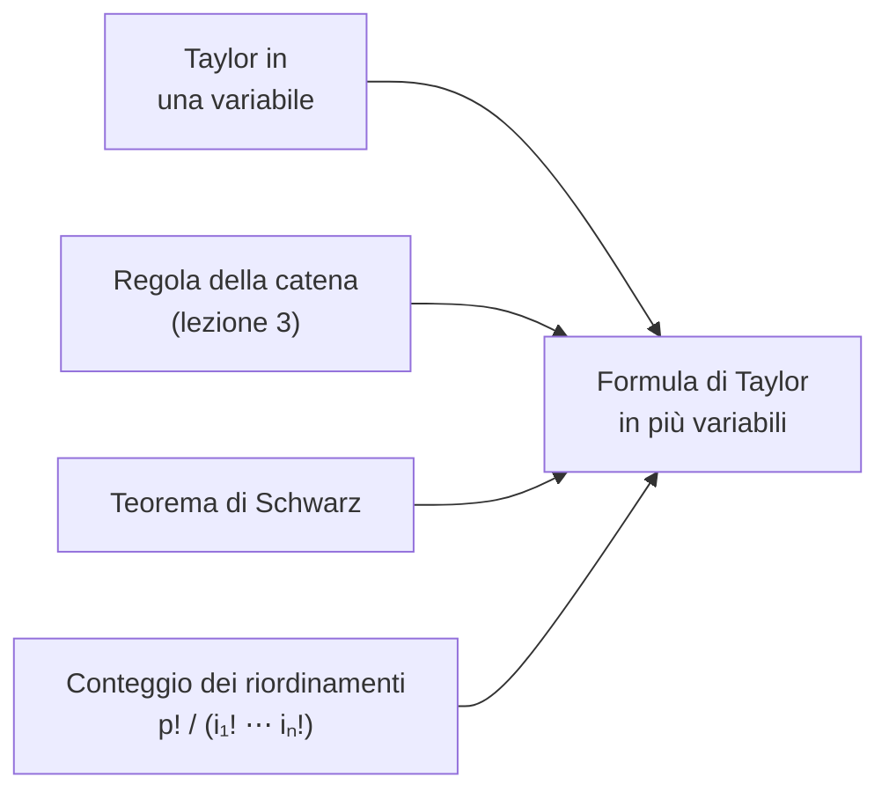

---

## corso: "Metodi Matematici per l'Ingegneria" lezione: 4 data: 2026-10-02 docente: Nicola Pinamonti argomenti: [derivate di ordine superiore, classi Ck, teorema di Schwarz, esercizi su derivate miste, regola della catena in coordinate polari, formula di Taylor in più variabili, polinomio di Taylor] fonti: [trascrizione, appunti manuali, dispensa Morro] tags: [metodi-matematici, lezione]

---
# Lezione 4 — Derivate di ordine superiore, teorema di Schwarz e formula di Taylor

La lezione affronta le derivate di ordine superiore al primo. Il primo risultato è il teorema di Schwarz, che stabilisce quando l'ordine in cui si calcolano le derivate parziali non conta. Seguono due esercizi di calcolo: le derivate seconde miste di una funzione e la regola della catena applicata al passaggio in coordinate polari. La seconda parte è dedicata alla formula di Taylor in più variabili: il polinomio che approssima una funzione vicino a un punto non solo al primo ordine, come il differenziale, ma fino a un ordine $k$ prefissato. La dimostrazione mette insieme quasi tutto ciò che è stato visto finora.

> [!warning] Nota sulla registrazione La registrazione della lezione inizia a dimostrazione del teorema di Schwarz già avviata. L'enunciato del teorema, la definizione della quantità $\Delta(h, k)$ e l'inizio della dimostrazione sono ripresi dagli appunti manuali (scritti a mano e in Markdown). Le definizioni preliminari sulle derivate di ordine superiore, presupposte nel seguito ma non presenti nel materiale, sono ricostruite e segnalate come tali.

## Derivate parziali di ordine superiore

> [!warning] Sezione ricostruita — inizio Contenuto ricostruito per colmare una lacuna della trascrizione: le definizioni seguenti sono presupposte dall'enunciato del teorema di Schwarz.

Sia $f : A \to \mathbb{R}$, con $A \subseteq \mathbb{R}^n$ aperto, e si supponga che la derivata parziale $\frac{\partial f}{\partial x_j}$ esista in ogni punto di $A$. Essa è allora a sua volta una funzione $A \to \mathbb{R}$, e si può chiedere se abbia delle derivate parziali. La derivata di $\frac{\partial f}{\partial x_j}$ rispetto a $x_i$, se esiste, è una **derivata parziale seconda** di $f$: $$\frac{\partial^2 f}{\partial x_i, \partial x_j} = \frac{\partial}{\partial x_i} \left( \frac{\partial f}{\partial x_j} \right).$$ La convenzione è che si deriva **prima rispetto alla variabile scritta più a destra**: $\frac{\partial^2 f}{\partial y, \partial x}$ indica la derivata rispetto a $y$ della derivata rispetto a $x$. Se $i = j$ si scrive $\frac{\partial^2 f}{\partial x_i^2}$; se $i \neq j$ la derivata si dice **mista**. Una funzione di $n$ variabili ha in generale $n^2$ derivate seconde. Iterando si definiscono le derivate parziali di ordine $r$, $\frac{\partial^r f}{\partial x_{i_r} \cdots \partial x_{i_1}}$, ottenute derivando $r$ volte, ogni volta rispetto a una variabile [@morro2023, §1.3].

> [!important] Definizione — Classi $C^k$ Sia $A \subseteq \mathbb{R}^n$ aperto. Si dice che $f : A \to \mathbb{R}$ è **di classe $C^k$** su $A$, e si scrive $f \in C^k(A)$, se tutte le derivate parziali di $f$ fino all'ordine $k$ esistono e sono continue in $A$. Le funzioni continue costituiscono la classe $C^0(A)$; se $f$ ammette derivate continue di ogni ordine si scrive $f \in C^\infty(A)$.

In particolare $f \in C^2(A)$, come annotato negli appunti, significa che $f$ ammette tutte le derivate parziali fino all'ordine 2 e che queste sono continue. Per il teorema del differenziale totale della [[MM L03 - Differenziabilità, Jacobiana e regola della catena|lezione 3]], una funzione di classe $C^1$ è differenziabile; una funzione di classe $C^2$ è differenziabile e ha derivate prime a loro volta differenziabili.

> [!warning] Sezione ricostruita — fine

## Il teorema di Schwarz

Le derivate seconde miste $\frac{\partial^2 f}{\partial x_i \partial x_j}$ e $\frac{\partial^2 f}{\partial x_j \partial x_i}$ sono ottenute derivando nello stesso insieme di variabili ma in ordine diverso, e a priori potrebbero differire. Il teorema di Schwarz dà una condizione sotto cui coincidono.

> [!important] Teorema — Schwarz Siano $A$ un aperto di $\mathbb{R}^n$ e $f : A \to \mathbb{R}$ di classe $C^2(A)$. Allora per ogni $\mathbf{x} \in A$ e per ogni $i, j \in {1, \dots, n}$ $$\frac{\partial^2 f}{\partial x_i, \partial x_j}(\mathbf{x}) = \frac{\partial^2 f}{\partial x_j, \partial x_i}(\mathbf{x}).$$

### Dimostrazione (caso bidimensionale)

Si considera $f(x, y)$ e un punto $(\hat{x}, \hat{y}) \in A$. Poiché $A$ è aperto, per $h, k \neq 0$ abbastanza piccoli il rettangolo di vertici $(\hat{x}, \hat{y})$ e $(\hat{x} + h, \hat{y} + k)$ è contenuto in $A$. L'idea è costruire una quantità che coinvolga i valori di $f$ nei quattro vertici del rettangolo e che "contenga" una derivata seconda mista calcolata in due modi diversi.

<svg viewBox="0 0 460 270" width="460" style="display:block;margin:1em auto;max-width:100%;height:auto;font-family:inherit" xmlns="http://www.w3.org/2000/svg"><line x1="30" y1="240" x2="440" y2="240" stroke="currentColor" stroke-width="1.1"/><polygon points="440,240 433.8,243.3 433.8,236.7" fill="currentColor"/><line x1="50" y1="255" x2="50" y2="15" stroke="currentColor" stroke-width="1.1"/><polygon points="50,15 53.3,21.2 46.7,21.2" fill="currentColor"/><text x="440" y="258" font-size="13" text-anchor="end" fill="currentColor" font-style="italic">x</text><text x="60" y="24" font-size="13" text-anchor="start" fill="currentColor" font-style="italic">y</text><rect x="130" y="70" width="200" height="120" fill="#3b82f6" fill-opacity="0.07" stroke="currentColor" stroke-opacity="0.5" stroke-dasharray="5 4"/><circle cx="130" cy="190" r="4" fill="currentColor"/><text x="120" y="210" font-size="12" text-anchor="end" fill="currentColor">(x̂, ŷ)</text><circle cx="114" cy="176" r="9" fill="none" stroke="#3b82f6" stroke-width="1.5"/><text x="114" y="181" font-size="14" text-anchor="middle" fill="#3b82f6">+</text><circle cx="330" cy="190" r="4" fill="currentColor"/><text x="340" y="210" font-size="12" text-anchor="start" fill="currentColor">(x̂ + h, ŷ)</text><circle cx="346" cy="176" r="9" fill="none" stroke="#e05a47" stroke-width="1.5"/><text x="346" y="181" font-size="14" text-anchor="middle" fill="#e05a47">−</text><circle cx="130" cy="70" r="4" fill="currentColor"/><text x="120" y="60" font-size="12" text-anchor="end" fill="currentColor">(x̂, ŷ + k)</text><circle cx="114" cy="86" r="9" fill="none" stroke="#e05a47" stroke-width="1.5"/><text x="114" y="91" font-size="14" text-anchor="middle" fill="#e05a47">−</text><circle cx="330" cy="70" r="4" fill="currentColor"/><text x="340" y="60" font-size="12" text-anchor="start" fill="currentColor">(x̂ + h, ŷ + k)</text><circle cx="346" cy="86" r="9" fill="none" stroke="#3b82f6" stroke-width="1.5"/><text x="346" y="91" font-size="14" text-anchor="middle" fill="#3b82f6">+</text><text x="230" y="62" font-size="13" text-anchor="middle" fill="currentColor" font-style="italic">h</text><text x="342" y="136" font-size="13" text-anchor="start" fill="currentColor" font-style="italic">k</text></svg>

Si definisce la combinazione, con i segni indicati in figura, $$\Delta(h, k) = f(\hat{x} + h, \hat{y} + k) - f(\hat{x} + h, \hat{y}) - f(\hat{x}, \hat{y} + k) + f(\hat{x}, \hat{y}),$$ e ci si chiede se esista il limite $$\lim_{\substack{(h, k) \to (0, 0) \ h, k \neq 0}} \frac{\Delta(h, k)}{h k}.$$ Per rispondere si usa **due volte** il teorema di Lagrange in una variabile, prima in una direzione e poi nell'altra.

**Primo passo: Lagrange in $x$.** Si blocca la $y$ e si considera la funzione della sola $x$ $$\varphi(x) = f(x, \hat{y} + k) - f(x, \hat{y}), \qquad x \in I = [\hat{x}, \hat{x} + h]$$ (o $[\hat{x} + h, \hat{x}]$ se $h < 0$). Valutandola agli estremi si ritrovano esattamente i quattro termini di $\Delta$: $\varphi(\hat{x} + h) - \varphi(\hat{x}) = \Delta(h, k)$. La funzione $\varphi$ è somma di funzioni di classe $C^2$ con una variabile bloccata, quindi è continua e derivabile (anzi due volte) su $I$. Per il teorema di Lagrange esiste $a$ nell'intervallo aperto tra $\hat{x}$ e $\hat{x} + h$ tale che $$\Delta(h, k) = \varphi'(a), h = \left[ \frac{\partial f}{\partial x}(a, \hat{y} + k) - \frac{\partial f}{\partial x}(a, \hat{y}) \right] h .$$

**Secondo passo: Lagrange in $y$.** Si guarda ora la funzione $y \mapsto \frac{\partial f}{\partial x}(a, y)$ sull'intervallo $[\hat{y}, \hat{y} + k]$. Poiché $f \in C^2$, essa è continua e derivabile, con derivata $\frac{\partial}{\partial y} \frac{\partial f}{\partial x}(a, y)$, quindi soddisfa a sua volta le ipotesi di Lagrange: esiste $b$ nell'intervallo aperto tra $\hat{y}$ e $\hat{y} + k$ tale che $$\frac{\partial f}{\partial x}(a, \hat{y} + k) - \frac{\partial f}{\partial x}(a, \hat{y}) = \frac{\partial^2 f}{\partial y, \partial x}(a, b), k .$$ Mettendo insieme i due passi (senza dimenticare il fattore $h$): $$\Delta(h, k) = \frac{\partial^2 f}{\partial y, \partial x}(a, b), h k \qquad \Longrightarrow \qquad \frac{\Delta(h, k)}{hk} = \frac{\partial^2 f}{\partial y, \partial x}(a, b).$$

**Terzo passo: passaggio al limite.** I punti $a$ e $b$ dipendono da $h$ e $k$, ma sono intrappolati negli intervalli tra $\hat{x}$ e $\hat{x} + h$ e tra $\hat{y}$ e $\hat{y} + k$. Quando $h \to 0$ l'intervallo si schiaccia e $a \to \hat{x}$; quando $k \to 0$, $b \to \hat{y}$. Quindi $(a, b) \to (\hat{x}, \hat{y})$, e per la **continuità della derivata seconda** $\frac{\partial^2 f}{\partial y \partial x}$: $$\lim_{\substack{(h, k) \to (0, 0) \ h, k \neq 0}} \frac{\Delta(h, k)}{hk} = \frac{\partial^2 f}{\partial y, \partial x}(\hat{x}, \hat{y}).$$ Si sono ottenuti due risultati: il limite esiste, e coincide con la derivata seconda calcolata prima rispetto a $x$ e poi rispetto a $y$.

**Quarto passo: lo stesso conto nell'altro ordine.** Combinando i quattro punti in modo diverso, cioè bloccando questa volta la $x$, si definisce $$\psi(y) = f(\hat{x} + h, y) - f(\hat{x}, y), \qquad \Delta(h, k) = \psi(\hat{y} + k) - \psi(\hat{y}),$$ come si verifica sostituendo nella definizione di $\Delta$. Ripetendo l'analisi precedente con i ruoli di $x$ e $y$ scambiati si ottiene $$\lim_{\substack{(h, k) \to (0, 0) \ h, k \neq 0}} \frac{\Delta(h, k)}{hk} = \frac{\partial^2 f}{\partial x, \partial y}(\hat{x}, \hat{y}).$$

**Conclusione.** Lo stesso limite è stato calcolato in due modi; per l'**unicità del limite** i due risultati coincidono: $$\frac{\partial^2 f}{\partial x, \partial y}(\hat{x}, \hat{y}) = \frac{\partial^2 f}{\partial y, \partial x}(\hat{x}, \hat{y}). \qquad \blacksquare$$

Per $n$ variabili il ragionamento è lo stesso: per confrontare le derivate miste in $x_i$ e $x_j$ si tengono bloccate tutte le altre variabili e ci si riduce al caso di due variabili. La dispensa di riferimento dimostra il teorema con un argomento analogo, basato sulla stessa combinazione dei valori nei quattro vertici del rettangolo, e osserva che più in generale, se $f$ e le sue derivate fino all'ordine $r$ sono continue, scambiando l'ordine di derivazione il risultato non cambia [@morro2023, §1.3].

È la **regolarità** della funzione ad aver permesso di arrivare al risultato. Se la funzione non fosse di classe $C^2$, ad esempio se le derivate seconde esistessero ma non fossero continue, non sarebbe più detto che si possa scambiare l'ordine di derivazione: lo scambio delle derivate va fatto con attenzione.

> [!tip] Approfondimento — Un controesempio al teorema senza continuità #approfondimento Si consideri $$f(x, y) = \begin{cases} \dfrac{xy,(x^2 - y^2)}{x^2 + y^2} & (x, y) \neq (0, 0), \[2mm] 0 & (x, y) = (0, 0). \end{cases}$$ Sull'asse $y$, per $y \neq 0$: $\dfrac{\partial f}{\partial x}(0, y) = \displaystyle\lim_{h \to 0} \frac{f(h, y)}{h} = \lim_{h \to 0} \frac{y,(h^2 - y^2)}{h^2 + y^2} = -y$, e lo stesso valore vale anche per $y = 0$ (perché $f(h, 0) = 0$). Quindi $\frac{\partial f}{\partial x}(0, y) = -y$ e $$\frac{\partial^2 f}{\partial y, \partial x}(0, 0) = -1 .$$ Analogamente $\dfrac{\partial f}{\partial y}(x, 0) = \displaystyle\lim_{k \to 0} \frac{f(x, k)}{k} = x$, da cui $$\frac{\partial^2 f}{\partial x, \partial y}(0, 0) = +1 .$$ Le derivate miste esistono ma sono diverse: le derivate seconde di questa funzione non sono continue nell'origine, e il teorema di Schwarz non si applica.

## Esercizio: derivate seconde miste

> [!example] Esercizio — Derivate di $f(x, y) = x^2, e^{x - y} \sin(1/y)$ **Dominio.** La funzione ha senso finché $y \neq 0$, quindi il dominio è $D = { (x, y) \in \mathbb{R}^2 : y \neq 0 }$, il piano privato dell'asse delle $x$ (la retta $y = 0$). È un insieme aperto, e su di esso $f$ è di classe $C^\infty$, perché composta di funzioni elementari regolari.
> 
> **Derivata rispetto a $x$.** Si tratta $y$ come una costante: $\sin(1/y)$ è un fattore costante, e la $x$ compare in due punti, $x^2$ ed $e^{x-y}$. Con la regola del prodotto (si deriva il primo fattore lasciando il resto, poi il secondo): $$\frac{\partial f}{\partial x} = 2x, e^{x - y} \sin\frac{1}{y} + x^2 e^{x - y} \sin\frac{1}{y} = (2x + x^2), e^{x - y} \sin\frac{1}{y}.$$
> 
> **Derivata rispetto a $y$.** Ora $x^2$ è una costante e la $y$ compare sia nell'esponenziale sia nel seno. La derivata di $e^{x - y}$ rispetto a $y$ è $-e^{x - y}$; quella di $\sin(1/y)$, per la regola della catena, è $\cos(1/y) \cdot \left( -\frac{1}{y^2} \right)$. Quindi $$\frac{\partial f}{\partial y} = x^2 \left[ -e^{x - y} \sin\frac{1}{y} - e^{x - y} \cos\frac{1}{y} \cdot \frac{1}{y^2} \right] = -x^2 e^{x - y} \left( \sin\frac{1}{y} + \frac{1}{y^2} \cos\frac{1}{y} \right).$$
> 
> **Derivata mista.** Per il teorema di Schwarz (la funzione è $C^2$ sull'aperto $D$) la si può calcolare in due modi equivalenti. Si parte dalla forma compatta di $\frac{\partial f}{\partial x}$: il fattore $(2x + x^2)$ non dipende da $y$, e la derivata rispetto a $y$ di $e^{x-y}\sin(1/y)$ è già stata calcolata sopra. Quindi $$\frac{\partial^2 f}{\partial y, \partial x} = (2x + x^2) \left[ -e^{x - y} \sin\frac{1}{y} - e^{x - y} \cos\frac{1}{y} \cdot \frac{1}{y^2} \right] = -(2x + x^2), e^{x - y} \left( \sin\frac{1}{y} + \frac{1}{y^2} \cos\frac{1}{y} \right).$$ Derivando invece $\frac{\partial f}{\partial y}$ rispetto a $x$, poiché $\frac{\partial}{\partial x}\big(x^2 e^{x - y}\big) = (2x + x^2) e^{x - y}$, si ritrova la stessa espressione, come previsto dal teorema.

> [!warning] Discrepanza tra fonti: derivate dell'esercizio Negli appunti in Markdown la derivata rispetto a $y$ e la derivata mista contengono il prodotto $-\sin(1/y)\cos(1/y),y^{-2}$ al posto della somma $-\sin(1/y) - \cos(1/y), y^{-2}$; gli appunti scritti a mano e la trascrizione riportano la forma corretta, adottata qui. Inoltre nella trascrizione il dominio è descritto come privato della retta "$x = 0$": entrambe le versioni degli appunti indicano correttamente $y \neq 0$, cioè la retta $y = 0$.

## Esercizio: regola della catena in coordinate polari

> [!example] Esercizio — Derivata di una funzione composta Si considerano $$f : \mathbb{R}^2 \to \mathbb{R}, \quad f(x, y) = e^{x^2 + y^2}, x, \qquad g : D \to \mathbb{R}^2, \quad g(r, \theta) = (r\cos\theta, \ r\sin\theta),$$ con $D = { (r, \theta) \in \mathbb{R}^2 : r > 0 }$. La funzione $g$ descrive il passaggio alle **coordinate polari**: cambiare variabili non è altro che comporre due funzioni. La composta è $f \circ g : D \to \mathbb{R}$ e, sostituendo $x = r\cos\theta$, $y = r\sin\theta$ e usando $\cos^2\theta + \sin^2\theta = 1$, $$(f \circ g)(r, \theta) = f\big(g(r, \theta)\big) = e^{r^2}, r\cos\theta .$$ Si vuole calcolare $\frac{\partial (f \circ g)}{\partial r}$.
> 
> **Con la regola della catena.** La $f$ dipende da $r$ attraverso entrambe le componenti di $g$; si deriva la funzione esterna rispetto alle sue variabili $x, y$ e si moltiplica per le derivate delle componenti corrispondenti di $g$ rispetto a $r$: $$\frac{\partial (f \circ g)}{\partial r} = \frac{\partial f}{\partial x}, \frac{\partial g_1}{\partial r} + \frac{\partial f}{\partial y}, \frac{\partial g_2}{\partial r}.$$ Le derivate di $f$ si calcolano con la regola del prodotto e la regola della catena in una variabile: $$\frac{\partial f}{\partial x} = e^{x^2 + y^2}, 2x \cdot x + e^{x^2 + y^2} = e^{x^2 + y^2}(2x^2 + 1), \qquad \frac{\partial f}{\partial y} = e^{x^2 + y^2}, 2y, x ,$$ mentre $\frac{\partial g_1}{\partial r} = \cos\theta$ e $\frac{\partial g_2}{\partial r} = \sin\theta$. Le derivate di $f$ vanno valutate in $g(r, \theta)$, cioè sostituendo $x = r\cos\theta$ e $y = r\sin\theta$: $$\begin{aligned} \frac{\partial (f \circ g)}{\partial r} &= e^{r^2}\big(2r^2\cos^2\theta + 1\big)\cos\theta + e^{r^2}\big(2 r^2 \sin\theta\cos\theta\big)\sin\theta \ &= e^{r^2}\cos\theta,\big(2r^2\cos^2\theta + 2r^2\sin^2\theta + 1\big) = e^{r^2},(2r^2 + 1)\cos\theta . \end{aligned}$$
> 
> **Verifica diretta.** Derivando l'espressione esplicita della composta: $\frac{\partial}{\partial r}\big(e^{r^2} r\cos\theta\big) = \big(2r \cdot r, e^{r^2} + e^{r^2}\big)\cos\theta = e^{r^2}(2r^2 + 1)\cos\theta$, lo stesso risultato.

Il docente commenta che in questo caso comporre e poi derivare era facile, e coincide con quanto prevede la regola della catena. La regola resta comunque fondamentale perché in molti casi la composizione esplicita non è affatto semplice, e allora derivare con la regola della catena è quasi sempre più efficiente.

> [!example] Verifica aggiuntiva (non svolta a lezione) — Derivata rispetto a $\theta$ Con le stesse derivate di $f$ e con $\frac{\partial g_1}{\partial \theta} = -r\sin\theta$, $\frac{\partial g_2}{\partial \theta} = r\cos\theta$ (la seconda colonna della Jacobiana delle coordinate polari, vista nella lezione 3): $$\frac{\partial (f \circ g)}{\partial \theta} = e^{r^2}(2r^2\cos^2\theta + 1)(-r\sin\theta) + e^{r^2}(2r^2\sin\theta\cos\theta)(r\cos\theta) = -e^{r^2}, r\sin\theta ,$$ perché i termini con $2r^3\cos^2\theta\sin\theta$ si cancellano. Direttamente: $\frac{\partial}{\partial \theta}\big(e^{r^2} r\cos\theta\big) = -e^{r^2} r\sin\theta$.

> [!warning] Discrepanza tra fonti: refusi nell'esercizio Negli appunti in Markdown compaiono alcuni refusi: $\frac{\partial g_1}{\partial r}$ al posto di $\frac{\partial g_2}{\partial r}$ nel secondo addendo, $e^{e^2}$ al posto di $e^{r^2}$ e, nella sostituzione, $(2r^2\sin^2\theta)\sin\theta$ al posto di $(2r^2\sin^2\theta)\cos\theta$. Gli appunti scritti a mano e la trascrizione riportano le forme corrette.

## La formula di Taylor in più variabili

### Motivazione

Se $f : D \subseteq \mathbb{R}^n \to \mathbb{R}$ è differenziabile in $\hat{\mathbf{x}}$, vicino a $\hat{\mathbf{x}}$ la si può scrivere come $$f(\mathbf{x}) = f(\hat{\mathbf{x}}) + (d_{\hat{\mathbf{x}}} f)(\mathbf{x} - \hat{\mathbf{x}}) + o(\lVert \mathbf{x} - \hat{\mathbf{x}} \rVert).$$ Dimenticando l'errore, si ottiene la migliore approssimazione di $f$ vicino a $\hat{\mathbf{x}}$ che ha le stesse derivate prime: geometricamente, l'iperpiano tangente al grafico. Spesso però interessa un'approssimazione che abbia in comune con $f$ anche le derivate di ordine superiore. Come in Analisi 1, lo strumento è la formula di Taylor, che approssima la funzione con un **polinomio** nelle componenti di $\mathbf{x} - \hat{\mathbf{x}}$ fino a un certo ordine $k$. I polinomi sono comodi: si derivano e si integrano facilmente.

### L'enunciato

> [!important] Teorema — Formula di Taylor in più variabili Siano $f : D \subseteq \mathbb{R}^n \to \mathbb{R}$ e $\hat{\mathbf{x}}, \mathbf{x} \in D$. Si supponga che esista un aperto $U \subseteq D$ contenente il segmento $S(\hat{\mathbf{x}}, \mathbf{x})$ e che $f \in C^k(U)$. Allora $$f(\mathbf{x}) = P_k(\hat{\mathbf{x}}, \mathbf{x}) + R,$$ dove $P_k$ è il **polinomio di Taylor di ordine $k$** centrato in $\hat{\mathbf{x}}$, $$P_k(\hat{\mathbf{x}}, \mathbf{x}) = \sum_{p=0}^{k} \ \sum_{(i_1, \dots, i_n) \in \mathcal{I}_p} \frac{1}{i_1!, i_2! \cdots i_n!}\ \partial_1^{,i_1} \partial_2^{,i_2} \cdots \partial_n^{,i_n} f(\hat{\mathbf{x}})\ (x_1 - \hat{x}_1)^{i_1} (x_2 - \hat{x}_2)^{i_2} \cdots (x_n - \hat{x}_n)^{i_n},$$ $$\mathcal{I}_p = { (i_1, \dots, i_n) \in \mathbb{N}^n \ : \ i_1 + i_2 + \dots + i_n = p },$$ e il resto è un o piccolo della $k$-esima potenza della distanza: $$R = o(\lVert \mathbf{x} - \hat{\mathbf{x}} \rVert^k), \qquad \lim_{\mathbf{x} \to \hat{\mathbf{x}}} \frac{R}{\lVert \mathbf{x} - \hat{\mathbf{x}} \rVert^k} = 0 .$$ Se inoltre $f \in C^{k+1}(U)$, esiste $\mathbf{x}_0 \in S(\hat{\mathbf{x}}, \mathbf{x})$ tale che il resto si scrive (**resto di Lagrange**) $$R = \sum_{(i_1, \dots, i_n) \in \mathcal{I}_{k+1}} \frac{1}{i_1! \cdots i_n!}\ \partial_1^{,i_1} \cdots \partial_n^{,i_n} f(\mathbf{x}_0)\ (x_1 - \hat{x}_1)^{i_1} \cdots (x_n - \hat{x}_n)^{i_n}.$$

### Come si legge la formula

La notazione è pesante ma il contenuto è semplice. Il simbolo $\partial_j^{,i_j}$ indica che si deriva $i_j$ volte rispetto alla variabile $x_j$ (con $\partial_j^{,0}$ = nessuna derivata). Ogni addendo del polinomio corrisponde quindi a una scelta di quante volte derivare rispetto a ciascuna variabile: $i_1$ volte rispetto a $x_1$, $i_2$ volte rispetto a $x_2$, e così via. A quella derivata, calcolata in $\hat{\mathbf{x}}$, corrisponde il monomio $(x_1 - \hat{x}_1)^{i_1} \cdots (x_n - \hat{x}_n)^{i_n}$, in cui ciascuna differenza compare tante volte quante sono le derivate fatte nella variabile corrispondente, diviso per $i_1! \cdots i_n!$. Gli esponenti $i_j$ sono numeri naturali, e possono essere zero. Ad esempio, se $i_1 = 1$ si deriva una volta rispetto alla prima variabile e si moltiplica una volta per $x_1 - \hat{x}_1$; se $i_2 = 2$ si deriva due volte rispetto alla seconda e si moltiplica per $(x_2 - \hat{x}_2)^2$, dividendo per $2! = 2$.

Il numero $p = i_1 + \dots + i_n$ è l'**ordine totale** della derivata, e anche il grado del monomio. L'insieme $\mathcal{I}_p$ raccoglie tutte le scelte con ordine totale $p$, e la somma esterna su $p$ da $0$ a $k$ garantisce che il polinomio abbia grado al più $k$: se si controllano le derivate solo fino all'ordine $k$, non si possono avere $k$ derivate in una variabile e altre $k$ in un'altra, ma la somma di tutte le derivate deve essere al più $k$. Il docente riassume così: la formula non è altro che lo sviluppo di Taylor in una variabile fatto nella prima variabile, nella seconda, nella terza e così via, messi insieme in modo che la somma degli ordini non superi mai $k$; da qui i molti fattoriali.

Nel caso $n = 2$, $k = 2$, con $(x, y)$ al posto di $(x_1, x_2)$ e $\hat{\mathbf{x}} = (\hat{x}, \hat{y})$, gli addendi sono i seguenti.

|$p$|$(i_1, i_2)$|Coefficiente $\frac{1}{i_1!, i_2!}$|Derivata|Monomio|
|:-:|:-:|:-:|:--|:--|
|0|$(0, 0)$|$1$|$f(\hat{\mathbf{x}})$|$1$|
|1|$(1, 0)$|$1$|$\frac{\partial f}{\partial x}(\hat{\mathbf{x}})$|$(x - \hat{x})$|
|1|$(0, 1)$|$1$|$\frac{\partial f}{\partial y}(\hat{\mathbf{x}})$|$(y - \hat{y})$|
|2|$(2, 0)$|$\frac{1}{2}$|$\frac{\partial^2 f}{\partial x^2}(\hat{\mathbf{x}})$|$(x - \hat{x})^2$|
|2|$(1, 1)$|$1$|$\frac{\partial^2 f}{\partial x, \partial y}(\hat{\mathbf{x}})$|$(x - \hat{x})(y - \hat{y})$|
|2|$(0, 2)$|$\frac{1}{2}$|$\frac{\partial^2 f}{\partial y^2}(\hat{\mathbf{x}})$|$(y - \hat{y})^2$|

Quindi $$P_2 = f + \frac{\partial f}{\partial x}(x - \hat{x}) + \frac{\partial f}{\partial y}(y - \hat{y}) + \frac{1}{2}\frac{\partial^2 f}{\partial x^2}(x - \hat{x})^2 + \frac{\partial^2 f}{\partial x, \partial y}(x - \hat{x})(y - \hat{y}) + \frac{1}{2}\frac{\partial^2 f}{\partial y^2}(y - \hat{y})^2 ,$$ con tutte le derivate calcolate in $\hat{\mathbf{x}}$. Il coefficiente del termine misto è $\frac{1}{1!,1!} = 1$, non $\frac{1}{2}$: è il punto su cui, avverte il docente, si sbaglia più spesso.

Il significato della formula è il seguente: $P_k$ è il polinomio di grado al più $k$ che **meglio approssima** $f$ vicino a $\hat{\mathbf{x}}$; tutte le sue derivate parziali in $\hat{\mathbf{x}}$, fino all'ordine $k$, coincidono con quelle di $f$, e l'errore è trascurabile rispetto a $\lVert \mathbf{x} - \hat{\mathbf{x}} \rVert^k$. Se $f$ è di classe $C^{k+1}$, si può calcolare una derivata in più e il resto ammette l'espressione migliore di Lagrange, in cui le derivate di ordine $k+1$ sono calcolate in un punto $\mathbf{x}_0$ del segmento, come nel teorema di Lagrange.

> [!tip] Approfondimento — Una notazione più compatta: i multi-indici #approfondimento La formula diventa molto più leggibile con la notazione a **multi-indici**, non usata a lezione ma diffusa nei testi. Un multi-indice è una $n$-upla $\alpha = (i_1, \dots, i_n)$ di naturali, e si pone $$|\alpha| = i_1 + \dots + i_n, \qquad \alpha! = i_1! \cdots i_n!, \qquad \partial^\alpha f = \partial_1^{,i_1} \cdots \partial_n^{,i_n} f, \qquad \mathbf{h}^\alpha = h_1^{,i_1} \cdots h_n^{,i_n}.$$ Con $\mathbf{h} = \mathbf{x} - \hat{\mathbf{x}}$ la formula di Taylor diventa $$f(\hat{\mathbf{x}} + \mathbf{h}) = \sum_{|\alpha| \le k} \frac{\partial^\alpha f(\hat{\mathbf{x}})}{\alpha!}, \mathbf{h}^\alpha + o(\lVert \mathbf{h} \rVert^k),$$ formalmente identica alla formula in una variabile $\sum_{p \le k} \frac{f^{(p)}(\hat{x})}{p!} h^p$.
> 
> All'ordine 2 si può scrivere tutto in forma matriciale: posto $H_f(\hat{\mathbf{x}})$ la matrice delle derivate seconde, $\big(H_f\big)_{ij} = \frac{\partial^2 f}{\partial x_i \partial x_j}(\hat{\mathbf{x}})$ (detta **matrice hessiana**, simmetrica per il teorema di Schwarz), $$P_2 = f(\hat{\mathbf{x}}) + \nabla f(\hat{\mathbf{x}}) \cdot \mathbf{h} + \frac{1}{2}, \mathbf{h}^{\mathsf{T}} H_f(\hat{\mathbf{x}}), \mathbf{h} .$$ Il termine misto compare due volte nel prodotto $\mathbf{h}^{\mathsf T} H_f \mathbf{h}$ (posizioni $(1, 2)$ e $(2, 1)$), e il $\frac{1}{2}$ davanti lo riporta a coefficiente 1, coerentemente con la tabella. La dispensa di riferimento usa questa forma quadratica nello studio dei massimi e minimi [@morro2023, §1.5].

> [!warning] Discrepanza tra fonti: la formula negli appunti Negli appunti in Markdown la scrittura del polinomio è incompleta (lo si dichiara esplicitamente). Negli appunti a mano mancano i fattoriali $\frac{1}{i_1! \cdots i_n!}$ nel polinomio $P_k$, e nel resto di Lagrange il denominatore è scritto come somma $i_1! + \dots + i_n!$ anziché come prodotto $i_1! \cdots i_n!$. Le formule riportate sopra seguono la trascrizione ("i numeri sono $i_1$ fattoriale, puntini, $i_n$ fattoriale, come nella formula di Taylor ordinaria") e sono coerenti con la dispensa di riferimento [@morro2023, §1.4].

### Dimostrazione

La formula è più facile da dimostrare che da scrivere. La tecnica è la stessa usata per il teorema del valor medio nella [[MM L03 - Differenziabilità, Jacobiana e regola della catena|lezione 3]]: ci si riconduce a ciò che si sa già per le funzioni di una sola variabile, parametrizzando il segmento, componendo con $f$ e applicando la formula di Taylor in una variabile.



**Parametrizzazione del segmento.** Sia $L = \lVert \mathbf{x} - \hat{\mathbf{x}} \rVert$ e si consideri $\mathbf{y} : [0, L] \to D$, $$\mathbf{y}(t) = \hat{\mathbf{x}} + t, \frac{\mathbf{x} - \hat{\mathbf{x}}}{L}.$$ Si ha $\mathbf{y}(0) = \hat{\mathbf{x}}$ e $\mathbf{y}(L) = \mathbf{x}$: al variare di $t$ si percorre il segmento da $\hat{\mathbf{x}}$ a $\mathbf{x}$ (con velocità unitaria). La funzione è lineare in $t$, quindi regolarissima: la derivata prima è il vettore costante $\frac{\mathbf{x} - \hat{\mathbf{x}}}{L}$, le derivate successive sono nulle.

**Riduzione a una variabile.** Si pone $$h(t) = f\big(\mathbf{y}(t)\big), \qquad h : [0, L] \to \mathbb{R}.$$ Composizione di una funzione di classe $C^k$ con una funzione lineare, $h$ è di classe $C^k$, e vale $h(0) = f(\hat{\mathbf{x}})$, $h(L) = f(\mathbf{x})$. Si può allora applicare la formula di Taylor in una variabile: $$h(t) = \sum_{p=0}^{k} \frac{h^{(p)}(0)}{p!}, t^p + R .$$ Non resta che calcolare le derivate $h^{(p)}$ con la regola della catena e valutare tutto in $t = L$.

**Derivate di $h$.** La $h$ dipende dal tempo attraverso $\mathbf{y}$. Per la regola della catena (caso della curva): $$h'(t) = \sum_{i=1}^{n} \frac{\partial f}{\partial x_i}\big(\mathbf{y}(t)\big), y_i'(t) = \sum_{i=1}^{n} \frac{\partial f}{\partial x_i}\big(\mathbf{y}(t)\big), \frac{(\mathbf{x} - \hat{\mathbf{x}})_i}{L}.$$ Per la derivata seconda si osserva dove compare il tempo: il fattore $\frac{(\mathbf{x} - \hat{\mathbf{x}})_i}{L}$ è costante, e $t$ compare solo nella derivata $\frac{\partial f}{\partial x_i}$ composta con $\mathbf{y}$. Si applica di nuovo la regola della catena a questa funzione composta: $$h''(t) = \sum_{i=1}^{n} \sum_{j=1}^{n} \frac{\partial^2 f}{\partial x_j, \partial x_i}\big(\mathbf{y}(t)\big), \frac{(\mathbf{x} - \hat{\mathbf{x}})_i, (\mathbf{x} - \hat{\mathbf{x}})_j}{L^2}.$$ Iterando, ogni derivazione aggiunge una somma, una derivata parziale e un fattore $\frac{(\mathbf{x} - \hat{\mathbf{x}})_j}{L}$: $$h^{(p)}(t) = \sum_{j_1 = 1}^{n} \cdots \sum_{j_p = 1}^{n} \frac{\partial^p f}{\partial x_{j_1} \cdots \partial x_{j_p}}\big(\mathbf{y}(t)\big), \frac{(\mathbf{x} - \hat{\mathbf{x}})_{j_1} \cdots (\mathbf{x} - \hat{\mathbf{x}})_{j_p}}{L^p}.$$

**Riordinamento delle derivate.** Questa formula è corretta ma diversa da quella dell'enunciato: le derivate compaiono "in disordine", ad esempio prima rispetto a $x_1$, poi a $x_3$, poi di nuovo a $x_1$, poi a $x_7$. Poiché $f \in C^k$, il **teorema di Schwarz** permette di scambiare l'ordine di derivazione: in ogni addendo si calcolano prima tutte le derivate rispetto a $x_1$, poi tutte quelle rispetto a $x_2$, e così via. Un addendo dipende allora solo da _quante volte_ compare ciascuna variabile, cioè dalla $n$-upla $(i_1, \dots, i_n)$ con $i_1 + \dots + i_n = p$, e la somma su $j_1, \dots, j_p$ si trasforma in una somma su $\mathcal{I}_p$. Occorre però contare quante sequenze ordinate $(j_1, \dots, j_p)$ danno la stessa $n$-upla.

Nel caso di due variabili e due derivate le sequenze possibili sono quattro: $$\partial_1\partial_1 + \partial_1\partial_2 + \partial_2\partial_1 + \partial_2\partial_2 \ = \ \partial_1^2 + 2,\partial_1\partial_2 + \partial_2^2 ,$$ perché $\partial_1\partial_2$ e $\partial_2\partial_1$ coincidono per Schwarz e vanno contate due volte, mentre $\partial_1^2$ e $\partial_2^2$ una volta sola. In generale il numero di modi di ordinare $p$ derivate, di cui $i_1$ rispetto a $x_1$, …, $i_n$ rispetto a $x_n$, senza distinguere tra loro le derivate nella stessa direzione, è il **coefficiente multinomiale** $$\frac{p!}{i_1!, i_2! \cdots i_n!} .$$ Quindi $$h^{(p)}(t) = \sum_{(i_1, \dots, i_n) \in \mathcal{I}_p} \frac{p!}{i_1! \cdots i_n!}\ \partial_1^{,i_1} \cdots \partial_n^{,i_n} f\big(\mathbf{y}(t)\big)\ \frac{(x_1 - \hat{x}_1)^{i_1} \cdots (x_n - \hat{x}_n)^{i_n}}{L^p}.$$ Per $n = 2$ e $p = 2$ si ritrovano i coefficienti $1, 2, 1$ dello sviluppo precedente.

**Conclusione.** Si valuta $h^{(p)}$ in $t = 0$, dove $\mathbf{y}(0) = \hat{\mathbf{x}}$, e si pone $t = L$ nella formula di Taylor per $h$. Nell'addendo di ordine $p$ il fattore $t^p = L^p$ si semplifica con il $L^p$ al denominatore, e il $p!$ del coefficiente multinomiale si semplifica con il $\frac{1}{p!}$ della formula in una variabile: $$\frac{h^{(p)}(0)}{p!}, L^p = \sum_{(i_1, \dots, i_n) \in \mathcal{I}_p} \frac{1}{i_1! \cdots i_n!}\ \partial_1^{,i_1} \cdots \partial_n^{,i_n} f(\hat{\mathbf{x}})\ (x_1 - \hat{x}_1)^{i_1} \cdots (x_n - \hat{x}_n)^{i_n}.$$ Sommando su $p$ da $0$ a $k$ e ricordando che $h(L) = f(\mathbf{x})$ si ottiene esattamente $P_k(\hat{\mathbf{x}}, \mathbf{x})$. $\blacksquare$

Le espressioni del resto discendono allo stesso modo dalle formule del resto in una variabile. Ad esempio, se $f \in C^{k+1}(U)$ il resto di Lagrange in una variabile è $\frac{h^{(k+1)}(\tau)}{(k+1)!}L^{k+1}$ con $\tau \in (0, L)$, e la stessa sostituzione produce il resto di Lagrange dell'enunciato con $\mathbf{x}_0 = \mathbf{y}(\tau)$ [@morro2023, §1.4].

Ricapitolando, i risultati usati sono la formula di Taylor in una variabile, la derivazione delle funzioni composte, lo scambio dell'ordine di derivazione (Schwarz) e il conteggio dei riordinamenti, che è la parte concettualmente più delicata: capire che tra la formula "disordinata" e quella dell'enunciato c'è di mezzo un riordinamento, e che il coefficiente $\frac{p!}{i_1! \cdots i_n!}$ conta i modi di farlo.

## Esempio: polinomio di Taylor di ordine 2

> [!example] Esempio — Polinomio di Taylor (Maclaurin) di ordine 2 di $f(x, y) = e^{x - y}(\sin x + 1)$ in $(0, 0)$ Lo sviluppo di Taylor centrato nell'origine si chiama anche **sviluppo di Maclaurin**. Per scrivere $P_2$ servono tutte le derivate fino all'ordine 2, calcolate in $(0, 0)$.
> 
> **Ordine 0.** $f(0, 0) = e^0 (\sin 0 + 1) = 1$.
> 
> **Ordine 1.** Derivando rispetto a $x$ (la $x$ compare in entrambi i fattori, regola del prodotto) e rispetto a $y$ (la $y$ compare solo nell'esponenziale): $$\frac{\partial f}{\partial x} = e^{x - y}(\sin x + 1 + \cos x), \qquad \frac{\partial f}{\partial y} = -e^{x - y}(\sin x + 1).$$
> 
> **Ordine 2.** La funzione è di classe $C^\infty$, quindi vale Schwarz e basta calcolare una sola derivata mista: $$\begin{aligned} \frac{\partial^2 f}{\partial x^2} &= e^{x - y}(\sin x + 1 + \cos x) + e^{x - y}(\cos x - \sin x) = e^{x - y}(2\cos x + 1), \ \frac{\partial^2 f}{\partial y^2} &= e^{x - y}(\sin x + 1), \ \frac{\partial^2 f}{\partial x, \partial y} &= \frac{\partial}{\partial x}\Big[ -e^{x - y}(\sin x + 1) \Big] = -e^{x - y}(\sin x + 1 + \cos x). \end{aligned}$$
> 
> **Valori nell'origine.**
> 
> |$f$|$\partial_x f$|$\partial_y f$|$\partial^2_{xx} f$|$\partial^2_{yy} f$|$\partial^2_{xy} f$|
> |:-:|:-:|:-:|:-:|:-:|:-:|
> |$1$|$2$|$-1$|$3$|$1$|$-2$|
> 
> **Polinomio.** Con i coefficienti della tabella della sezione precedente ($\frac{1}{2}$ per le derivate seconde pure, $1$ per la mista): $$\begin{aligned} P_2(x, y) &= f(0,0) + \partial_x f(0,0), x + \partial_y f(0,0), y + \tfrac{1}{2}, \partial^2_{xx} f(0,0), x^2 + \tfrac{1}{2}, \partial^2_{yy} f(0,0), y^2 + \partial^2_{xy} f(0,0), xy \ &= 1 + 2x - y + \frac{3}{2}x^2 + \frac{1}{2}y^2 - 2xy . \end{aligned}$$ Questo polinomio approssima la funzione per punti vicini all'origine a meno di un resto $o(x^2 + y^2)$, e tutte le sue derivate fino al secondo ordine in $(0,0)$ coincidono con quelle di $f$.

> [!example] Controllo alternativo (non svolto a lezione) — Prodotto di sviluppi in una variabile Lo stesso risultato si ottiene moltiplicando sviluppi noti di una variabile e tenendo solo i termini di grado $\le 2$. Con $e^u = 1 + u + \frac{u^2}{2} + o(u^2)$ per $u = x - y$ e $\sin x + 1 = 1 + x + o(x^2)$: $$\Big[ 1 + (x - y) + \tfrac{1}{2}(x - y)^2 \Big](1 + x) = 1 + 2x - y + \tfrac{3}{2}x^2 - 2xy + \tfrac{1}{2}y^2 + (\text{termini di grado} \ge 3).$$ È un metodo spesso più rapido, utile anche per controllare i coefficienti calcolati con le derivate. In forma matriciale, $\nabla f(0,0) = (2, -1)$ e $H_f(0,0) = \begin{pmatrix} 3 & -2 \ -2 & 1 \end{pmatrix}$, e $\frac{1}{2}(3x^2 - 4xy + y^2)$ riproduce i termini di secondo grado.

Il grafico seguente (aggiunto a scopo illustrativo) confronta la funzione e il suo polinomio di Taylor lungo l'asse $y = 0$, dove $f(x, 0) = e^x(\sin x + 1)$ e $P_2(x, 0) = 1 + 2x + \frac{3}{2}x^2$: le due curve sono praticamente indistinguibili vicino all'origine e si separano allontanandosi da essa.

```chart
type: line
labels: ["-1", "-0.75", "-0.5", "-0.25", "0", "0.25", "0.5", "0.75", "1"]
series:
  - title: "f(x, 0) = e^x (sin x + 1)"
    data: [0.058, 0.150, 0.316, 0.586, 1.000, 1.602, 2.439, 3.560, 5.006]
  - title: "P2(x, 0) = 1 + 2x + 1.5x^2"
    data: [0.500, 0.344, 0.375, 0.594, 1.000, 1.594, 2.375, 3.344, 4.500]
width: 80%
fill: false
beginAtZero: false
```

> [!warning] Discrepanza tra fonti: derivata mista dell'esempio Negli appunti in Markdown la derivata mista è scritta come $-e^{x-y}(\sin x + 1)$, senza il termine $\cos x$ (il valore $-2$ nell'origine è però riportato correttamente). Gli appunti a mano riportano $-e^{x-y}(\sin x + 1 + \cos x)$, che è la forma corretta. Verso la fine della registrazione il docente corregge alla lavagna un coefficiente del polinomio; il risultato finale coincide con quello degli appunti e con il controllo alternativo.