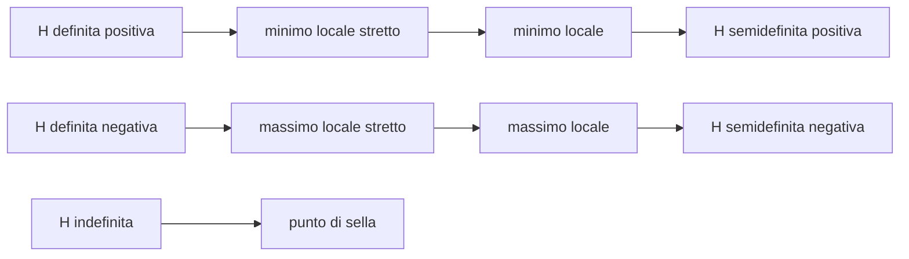

---

## corso: "Metodi Matematici per l'Ingegneria" lezione: 5 data: 2026-10-05 docente: Nicola Pinamonti argomenti: [punti critici, massimi e minimi locali, matrice hessiana, matrici definite e semidefinite, condizioni necessarie e sufficienti, punto di sella, criterio di Sylvester, derivazione sotto il segno di integrale, continuità uniforme] fonti: [trascrizione, appunti manuali, note del docente, dispensa Morro] tags: [metodi-matematici, lezione]
---
# Lezione 5 — Massimi e minimi, matrice hessiana, derivazione sotto il segno di integrale

Il titolo della lezione è "massimi e minimi". Si vuole capire come trovare i punti in cui una funzione di più variabili ha un massimo o un minimo locale e come riconoscerli. La strategia ricalca quella di Analisi 1: prima si individuano i candidati, i punti in cui il gradiente si annulla, poi se ne studia il carattere con le derivate seconde, raccolte nella **matrice hessiana**. Gli strumenti sono la formula di Taylor della [[MM L04 - Teorema di Schwarz e formula di Taylor|lezione 4]] e alcuni fatti di algebra lineare sulle matrici simmetriche. Nella seconda parte due esempi mostrano i limiti del criterio, e un esercizio completo ne mostra l'uso. Nell'ultimo quarto d'ora si dimostra quando si può derivare sotto il segno di integrale, risultato che richiede la nozione di **continuità uniforme**.

> [!note] Fonti di questa lezione Da questa lezione è disponibile anche la versione ufficiale delle note del docente (_Note del corso Metodi Matematici per l'Ingegneria_, a.a. 2026-2027, versione del 2 ottobre 2026), citate come [@pinamonti2026]. Essendo materiale del docente, sono la fonte di riferimento per enunciati e definizioni. Le figure di questa nota non provengono dalle note (che non ne contengono) ma sono state costruite per rappresentare ciò che il docente descrive e disegna alla lavagna.

## Punti critici

Il docente apre la lezione con un disegno: una funzione di due variabili il cui grafico, sopra il dominio, ha l'aspetto di un "paraboloide" rivolto verso il basso in una zona e di una conca in un'altra. Nei punti più alti e più bassi di queste zone la funzione ha un massimo o un minimo locale, e il piano tangente al grafico è orizzontale: tutte le derivate, in tutte le direzioni, si annullano.

<svg viewBox="0 0 560 360" width="560" style="display:block;margin:1em auto;max-width:100%;height:auto;font-family:inherit" xmlns="http://www.w3.org/2000/svg"><polyline points="-6.9,231.4 -3.3,229 0.3,226.5 3.8,224.1 7.4,221.7 10.9,219.3 14.5,216.9 18,214.5 21.6,212.2 25.2,209.9 28.7,207.7 32.3,205.4 35.8,203.2 39.4,201.1 43,199 46.5,196.9 50.1,194.8 53.6,192.7 57.2,190.7 60.8,188.7 64.3,186.7 67.9,184.7 71.4,182.6 75,180.5 78.6,178.4 82.1,176.3 85.7,174 89.2,171.8 92.8,169.4 96.4,167 99.9,164.5 103.5,161.9 107,159.2 110.6,156.5 114.2,153.7 117.7,150.8 121.3,147.9 124.8,145 128.4,142 131.9,139 135.5,136 139.1,133 142.6,130.1 146.2,127.1 149.7,124.1 153.3,121.2 156.9,118.3 160.4,115.5 164,112.7 167.5,109.9 171.1,107.1 174.7,104.4 178.2,101.7 181.8,99 185.3,96.4 188.9,93.8 192.5,91.2 196,88.6 199.6,86 203.1,83.5" fill="none" stroke="currentColor" stroke-width="0.9" stroke-opacity="0.45"/><polyline points="15.9,236.9 19.4,234.5 23,232.2 26.5,229.8 30.1,227.5 33.7,225.3 37.2,223 40.8,220.9 44.3,218.8 47.9,216.8 51.5,214.8 55,212.9 58.6,211.1 62.1,209.4 65.7,207.7 69.3,206.2 72.8,204.6 76.4,203.2 79.9,201.7 83.5,200.3 87.1,198.9 90.6,197.5 94.2,196 97.7,194.4 101.3,192.8 104.9,191.1 108.4,189.2 112,187.2 115.5,185 119.1,182.7 122.6,180.2 126.2,177.5 129.8,174.7 133.3,171.7 136.9,168.5 140.4,165.2 144,161.8 147.6,158.4 151.1,154.8 154.7,151.3 158.2,147.7 161.8,144.1 165.4,140.5 168.9,136.9 172.5,133.4 176,130 179.6,126.6 183.2,123.4 186.7,120.2 190.3,117 193.8,114 197.4,111 201,108.1 204.5,105.2 208.1,102.4 211.6,99.6 215.2,96.9 218.7,94.3 222.3,91.6 225.9,89" fill="none" stroke="currentColor" stroke-width="0.9" stroke-opacity="0.45"/><polyline points="38.6,242.6 42.2,240.3 45.7,238.1 49.3,235.9 52.8,233.7 56.4,231.7 60,229.8 63.5,227.9 67.1,226.2 70.6,224.6 74.2,223.2 77.8,221.9 81.3,220.8 84.9,219.8 88.4,218.9 92,218.2 95.6,217.6 99.1,217.1 102.7,216.6 106.2,216.2 109.8,215.8 113.3,215.4 116.9,214.9 120.5,214.2 124,213.4 127.6,212.4 131.1,211.1 134.7,209.6 138.3,207.8 141.8,205.6 145.4,203.1 148.9,200.2 152.5,197.1 156.1,193.6 159.6,189.8 163.2,185.9 166.7,181.6 170.3,177.3 173.9,172.8 177.4,168.2 181,163.6 184.5,159 188.1,154.4 191.7,149.9 195.2,145.5 198.8,141.2 202.3,137 205.9,133 209.4,129.1 213,125.4 216.6,121.8 220.1,118.4 223.7,115.1 227.2,111.9 230.8,108.8 234.4,105.9 237.9,103 241.5,100.1 245,97.4 248.6,94.7" fill="none" stroke="currentColor" stroke-width="0.9" stroke-opacity="0.45"/><polyline points="61.3,248.4 64.9,246.2 68.5,244.1 72,242.1 75.6,240.3 79.1,238.6 82.7,237 86.2,235.6 89.8,234.4 93.4,233.5 96.9,232.7 100.5,232.2 104,232 107.6,231.9 111.2,232.2 114.7,232.6 118.3,233.3 121.8,234.1 125.4,235 129,236 132.5,237 136.1,237.9 139.6,238.7 143.2,239.3 146.8,239.6 150.3,239.5 153.9,239.1 157.4,238.2 161,236.8 164.6,234.8 168.1,232.3 171.7,229.2 175.2,225.7 178.8,221.5 182.4,217 185.9,212 189.5,206.7 193,201.1 196.6,195.3 200.1,189.3 203.7,183.3 207.3,177.3 210.8,171.4 214.4,165.6 217.9,159.9 221.5,154.4 225.1,149.2 228.6,144.2 232.2,139.4 235.7,134.9 239.3,130.6 242.9,126.6 246.4,122.8 250,119.1 253.5,115.7 257.1,112.4 260.7,109.3 264.2,106.2 267.8,103.3 271.3,100.4" fill="none" stroke="currentColor" stroke-width="0.9" stroke-opacity="0.45"/><polyline points="84.1,254.2 87.6,252.1 91.2,250.2 94.7,248.5 98.3,246.9 101.9,245.4 105.4,244.3 109,243.3 112.5,242.7 116.1,242.3 119.7,242.3 123.2,242.6 126.8,243.3 130.3,244.3 133.9,245.6 137.5,247.2 141,249.1 144.6,251.3 148.1,253.6 151.7,256 155.3,258.4 158.8,260.7 162.4,262.8 165.9,264.7 169.5,266.1 173.1,267.1 176.6,267.5 180.2,267.2 183.7,266.2 187.3,264.5 190.8,262 194.4,258.7 198,254.7 201.5,249.9 205.1,244.5 208.6,238.6 212.2,232.1 215.8,225.2 219.3,218.1 222.9,210.8 226.4,203.3 230,195.9 233.6,188.6 237.1,181.4 240.7,174.5 244.2,167.9 247.8,161.5 251.4,155.5 254.9,149.8 258.5,144.5 262,139.5 265.6,134.9 269.2,130.5 272.7,126.4 276.3,122.6 279.8,119 283.4,115.6 286.9,112.3 290.5,109.2 294.1,106.2" fill="none" stroke="currentColor" stroke-width="0.9" stroke-opacity="0.45"/><polyline points="106.8,259.8 110.4,257.8 113.9,256 117.5,254.3 121,252.9 124.6,251.7 128.2,250.7 131.7,250 135.3,249.6 138.8,249.6 142.4,250 146,250.8 149.5,251.9 153.1,253.5 156.6,255.5 160.2,257.8 163.7,260.4 167.3,263.3 170.9,266.4 174.4,269.6 178,272.8 181.5,275.9 185.1,278.8 188.7,281.3 192.2,283.4 195.8,284.9 199.3,285.8 202.9,285.8 206.5,285.1 210,283.5 213.6,281 217.1,277.6 220.7,273.3 224.3,268.2 227.8,262.3 231.4,255.8 234.9,248.7 238.5,241.1 242.1,233.3 245.6,225.1 249.2,216.9 252.7,208.7 256.3,200.6 259.9,192.7 263.4,185.1 267,177.7 270.5,170.8 274.1,164.2 277.6,158 281.2,152.2 284.8,146.8 288.3,141.8 291.9,137.2 295.4,132.8 299,128.8 302.6,125 306.1,121.4 309.7,118.1 313.2,114.9 316.8,111.8" fill="none" stroke="currentColor" stroke-width="0.9" stroke-opacity="0.45"/><polyline points="129.5,264.9 133.1,262.9 136.7,261.1 140.2,259.3 143.8,257.8 147.3,256.4 150.9,255.3 154.4,254.5 158,253.9 161.6,253.7 165.1,253.8 168.7,254.3 172.2,255.1 175.8,256.3 179.4,257.9 182.9,259.8 186.5,262 190,264.4 193.6,267 197.2,269.7 200.7,272.4 204.3,275 207.8,277.4 211.4,279.4 215,281.1 218.5,282.3 222.1,282.8 225.6,282.7 229.2,281.8 232.8,280.1 236.3,277.6 239.9,274.3 243.4,270.2 247,265.3 250.6,259.7 254.1,253.5 257.7,246.8 261.2,239.7 264.8,232.3 268.3,224.7 271.9,217 275.5,209.3 279,201.7 282.6,194.3 286.1,187.1 289.7,180.2 293.3,173.6 296.8,167.4 300.4,161.5 303.9,156 307.5,150.9 311.1,146.1 314.6,141.7 318.2,137.5 321.7,133.6 325.3,129.9 328.9,126.4 332.4,123.1 336,120 339.5,117" fill="none" stroke="currentColor" stroke-width="0.9" stroke-opacity="0.45"/><polyline points="152.3,269.6 155.8,267.4 159.4,265.3 162.9,263.3 166.5,261.3 170.1,259.5 173.6,257.9 177.2,256.4 180.7,255 184.3,253.9 187.9,253 191.4,252.3 195,251.8 198.5,251.5 202.1,251.4 205.7,251.6 209.2,251.9 212.8,252.4 216.3,252.9 219.9,253.6 223.5,254.2 227,254.8 230.6,255.2 234.1,255.5 237.7,255.5 241.2,255.2 244.8,254.5 248.4,253.5 251.9,251.9 255.5,249.9 259,247.4 262.6,244.4 266.2,240.9 269.7,237 273.3,232.6 276.8,227.9 280.4,222.9 284,217.6 287.5,212.1 291.1,206.5 294.6,200.9 298.2,195.3 301.8,189.7 305.3,184.2 308.9,178.9 312.4,173.7 316,168.8 319.6,164 323.1,159.5 326.7,155.2 330.2,151.1 333.8,147.2 337.4,143.5 340.9,140 344.5,136.7 348,133.4 351.6,130.4 355.1,127.4 358.7,124.5 362.3,121.7" fill="none" stroke="currentColor" stroke-width="0.9" stroke-opacity="0.45"/><polyline points="175,274 178.6,271.5 182.1,269 185.7,266.4 189.2,263.9 192.8,261.4 196.4,258.9 199.9,256.4 203.5,253.9 207,251.4 210.6,248.9 214.2,246.4 217.7,243.9 221.3,241.4 224.8,238.9 228.4,236.4 231.9,233.9 235.5,231.3 239.1,228.8 242.6,226.3 246.2,223.8 249.7,221.3 253.3,218.8 256.9,216.3 260.4,213.8 264,211.3 267.5,208.8 271.1,206.3 274.7,203.8 278.2,201.3 281.8,198.7 285.3,196.2 288.9,193.7 292.5,191.2 296,188.7 299.6,186.2 303.1,183.7 306.7,181.2 310.3,178.7 313.8,176.2 317.4,173.7 320.9,171.2 324.5,168.7 328.1,166.1 331.6,163.6 335.2,161.1 338.7,158.6 342.3,156.1 345.8,153.6 349.4,151.1 353,148.6 356.5,146.1 360.1,143.6 363.6,141.1 367.2,138.6 370.8,136.1 374.3,133.6 377.9,131 381.4,128.5 385,126" fill="none" stroke="currentColor" stroke-width="0.9" stroke-opacity="0.45"/><polyline points="197.7,278.3 201.3,275.5 204.9,272.6 208.4,269.6 212,266.6 215.5,263.3 219.1,260 222.6,256.5 226.2,252.8 229.8,248.9 233.3,244.8 236.9,240.5 240.4,236 244,231.2 247.6,226.3 251.1,221.1 254.7,215.8 258.2,210.3 261.8,204.7 265.4,199.1 268.9,193.5 272.5,187.9 276,182.4 279.6,177.1 283.2,172.1 286.7,167.4 290.3,163 293.8,159.1 297.4,155.6 301,152.6 304.5,150.1 308.1,148.1 311.6,146.5 315.2,145.5 318.8,144.8 322.3,144.5 325.9,144.5 329.4,144.8 333,145.2 336.5,145.8 340.1,146.4 343.7,147.1 347.2,147.6 350.8,148.1 354.3,148.4 357.9,148.6 361.5,148.5 365,148.2 368.6,147.7 372.1,147 375.7,146.1 379.3,145 382.8,143.6 386.4,142.1 389.9,140.5 393.5,138.7 397.1,136.7 400.6,134.7 404.2,132.6 407.7,130.4" fill="none" stroke="currentColor" stroke-width="0.9" stroke-opacity="0.45"/><polyline points="220.5,283 224,280 227.6,276.9 231.1,273.6 234.7,270.1 238.3,266.4 241.8,262.5 245.4,258.3 248.9,253.9 252.5,249.1 256.1,244 259.6,238.5 263.2,232.6 266.7,226.4 270.3,219.8 273.9,212.9 277.4,205.7 281,198.3 284.5,190.7 288.1,183 291.7,175.3 295.2,167.7 298.8,160.3 302.3,153.2 305.9,146.5 309.4,140.3 313,134.7 316.6,129.8 320.1,125.7 323.7,122.4 327.2,119.9 330.8,118.2 334.4,117.3 337.9,117.2 341.5,117.7 345,118.9 348.6,120.6 352.2,122.6 355.7,125 359.3,127.6 362.8,130.3 366.4,133 370,135.6 373.5,138 377.1,140.2 380.6,142.1 384.2,143.7 387.8,144.9 391.3,145.7 394.9,146.2 398.4,146.3 402,146.1 405.6,145.5 409.1,144.7 412.7,143.6 416.2,142.2 419.8,140.7 423.3,138.9 426.9,137.1 430.5,135.1" fill="none" stroke="currentColor" stroke-width="0.9" stroke-opacity="0.45"/><polyline points="243.2,288.2 246.8,285.1 250.3,281.9 253.9,278.6 257.4,275 261,271.2 264.6,267.2 268.1,262.8 271.7,258.2 275.2,253.2 278.8,247.8 282.4,242 285.9,235.8 289.5,229.2 293,222.3 296.6,214.9 300.1,207.3 303.7,199.4 307.3,191.3 310.8,183.1 314.4,174.9 317.9,166.7 321.5,158.9 325.1,151.3 328.6,144.2 332.2,137.7 335.7,131.8 339.3,126.7 342.9,122.4 346.4,119 350,116.5 353.5,114.9 357.1,114.2 360.7,114.2 364.2,115.1 367.8,116.6 371.3,118.7 374.9,121.2 378.5,124.1 382,127.2 385.6,130.4 389.1,133.6 392.7,136.7 396.3,139.6 399.8,142.2 403.4,144.5 406.9,146.5 410.5,148.1 414,149.2 417.6,150 421.2,150.4 424.7,150.4 428.3,150 431.8,149.3 435.4,148.3 439,147.1 442.5,145.7 446.1,144 449.6,142.2 453.2,140.2" fill="none" stroke="currentColor" stroke-width="0.9" stroke-opacity="0.45"/><polyline points="265.9,293.8 269.5,290.8 273.1,287.7 276.6,284.4 280.2,281 283.7,277.4 287.3,273.6 290.8,269.5 294.4,265.1 298,260.5 301.5,255.5 305.1,250.2 308.6,244.5 312.2,238.5 315.8,232.1 319.3,225.5 322.9,218.6 326.4,211.4 330,204.1 333.6,196.7 337.1,189.2 340.7,181.9 344.2,174.8 347.8,167.9 351.4,161.4 354.9,155.5 358.5,150.1 362,145.3 365.6,141.3 369.2,138 372.7,135.5 376.3,133.8 379.8,132.8 383.4,132.5 386.9,132.9 390.5,133.9 394.1,135.3 397.6,137.2 401.2,139.3 404.7,141.6 408.3,144 411.9,146.4 415.4,148.7 419,150.9 422.5,152.8 426.1,154.4 429.7,155.7 433.2,156.7 436.8,157.4 440.3,157.7 443.9,157.7 447.5,157.3 451,156.7 454.6,155.7 458.1,154.6 461.7,153.1 465.3,151.5 468.8,149.8 472.4,147.9 475.9,145.8" fill="none" stroke="currentColor" stroke-width="0.9" stroke-opacity="0.45"/><polyline points="288.7,299.6 292.2,296.7 295.8,293.8 299.3,290.7 302.9,287.6 306.5,284.3 310,280.9 313.6,277.2 317.1,273.4 320.7,269.4 324.3,265.1 327.8,260.6 331.4,255.8 334.9,250.8 338.5,245.6 342.1,240.1 345.6,234.4 349.2,228.6 352.7,222.7 356.3,216.7 359.9,210.7 363.4,204.7 367,198.9 370.5,193.3 374.1,188 377.6,183 381.2,178.5 384.8,174.3 388.3,170.8 391.9,167.7 395.4,165.2 399,163.2 402.6,161.8 406.1,160.9 409.7,160.5 413.2,160.4 416.8,160.7 420.4,161.3 423.9,162.1 427.5,163 431,164 434.6,165 438.2,165.9 441.7,166.7 445.3,167.4 448.8,167.8 452.4,168.1 456,168 459.5,167.8 463.1,167.3 466.6,166.5 470.2,165.6 473.8,164.4 477.3,163 480.9,161.4 484.4,159.7 488,157.9 491.5,155.9 495.1,153.8 498.7,151.6" fill="none" stroke="currentColor" stroke-width="0.9" stroke-opacity="0.45"/><polyline points="311.4,305.3 315,302.6 318.5,299.9 322.1,297 325.6,294.1 329.2,291.2 332.8,288.1 336.3,284.9 339.9,281.6 343.4,278.2 347,274.6 350.6,270.9 354.1,267 357.7,263 361.2,258.8 364.8,254.5 368.3,250.1 371.9,245.6 375.5,241 379,236.4 382.6,231.8 386.1,227.2 389.7,222.7 393.3,218.4 396.8,214.1 400.4,210.2 403.9,206.4 407.5,202.9 411.1,199.8 414.6,196.9 418.2,194.4 421.7,192.2 425.3,190.4 428.9,188.9 432.4,187.6 436,186.6 439.5,185.8 443.1,185.1 446.7,184.6 450.2,184.2 453.8,183.8 457.3,183.4 460.9,182.9 464.4,182.4 468,181.8 471.6,181.1 475.1,180.2 478.7,179.2 482.2,178.1 485.8,176.8 489.4,175.4 492.9,173.8 496.5,172.1 500,170.2 503.6,168.3 507.2,166.3 510.7,164.1 514.3,161.9 517.8,159.7 521.4,157.4" fill="none" stroke="currentColor" stroke-width="0.9" stroke-opacity="0.45"/><polyline points="334.1,311 337.7,308.4 341.3,305.7 344.8,303.1 348.4,300.4 351.9,297.6 355.5,294.8 359,291.9 362.6,289 366.2,286 369.7,283 373.3,279.8 376.8,276.6 380.4,273.4 384,270 387.5,266.6 391.1,263.1 394.6,259.5 398.2,255.9 401.8,252.3 405.3,248.7 408.9,245.2 412.4,241.6 416,238.2 419.6,234.8 423.1,231.5 426.7,228.3 430.2,225.3 433.8,222.5 437.4,219.8 440.9,217.3 444.5,215 448,212.8 451.6,210.8 455.1,208.9 458.7,207.2 462.3,205.6 465.8,204 469.4,202.5 472.9,201.1 476.5,199.7 480.1,198.3 483.6,196.8 487.2,195.4 490.7,193.8 494.3,192.3 497.9,190.6 501.4,188.9 505,187.1 508.5,185.2 512.1,183.2 515.7,181.2 519.2,179.1 522.8,177 526.3,174.7 529.9,172.5 533.5,170.2 537,167.8 540.6,165.5 544.1,163.1" fill="none" stroke="currentColor" stroke-width="0.9" stroke-opacity="0.45"/><polyline points="356.9,316.5 360.4,314 364,311.4 367.5,308.8 371.1,306.2 374.7,303.6 378.2,301 381.8,298.3 385.3,295.6 388.9,292.9 392.5,290.1 396,287.3 399.6,284.5 403.1,281.7 406.7,278.8 410.3,275.9 413.8,272.9 417.4,269.9 420.9,267 424.5,264 428.1,261 431.6,258 435.2,255 438.7,252.1 442.3,249.2 445.8,246.3 449.4,243.5 453,240.8 456.5,238.1 460.1,235.5 463.6,233 467.2,230.6 470.8,228.2 474.3,226 477.9,223.7 481.4,221.6 485,219.5 488.6,217.4 492.1,215.3 495.7,213.3 499.2,211.3 502.8,209.3 506.4,207.3 509.9,205.2 513.5,203.1 517,201 520.6,198.9 524.2,196.8 527.7,194.6 531.3,192.3 534.8,190.1 538.4,187.8 542,185.5 545.5,183.1 549.1,180.7 552.6,178.3 556.2,175.9 559.7,173.5 563.3,171 566.9,168.6" fill="none" stroke="currentColor" stroke-width="0.9" stroke-opacity="0.45"/><polyline points="-6.9,231.4 -0.7,232.9 5.5,234.4 11.6,235.9 17.8,237.4 24,238.9 30.1,240.5 36.3,242 42.5,243.6 48.6,245.1 54.8,246.7 60.9,248.3 67.1,249.9 73.3,251.4 79.4,253 85.6,254.6 91.8,256.1 97.9,257.6 104.1,259.1 110.3,260.6 116.4,262 122.6,263.4 128.8,264.8 134.9,266.1 141.1,267.4 147.3,268.6 153.4,269.9 159.6,271 165.8,272.2 171.9,273.4 178.1,274.6 184.2,275.7 190.4,276.9 196.6,278.1 202.7,279.3 208.9,280.6 215.1,281.9 221.2,283.2 227.4,284.5 233.6,285.9 239.7,287.4 245.9,288.8 252.1,290.3 258.2,291.8 264.4,293.4 270.6,294.9 276.7,296.5 282.9,298.1 289.1,299.7 295.2,301.2 301.4,302.8 307.5,304.4 313.7,305.9 319.9,307.5 326,309 332.2,310.5 338.4,312 344.5,313.5 350.7,315 356.9,316.5" fill="none" stroke="currentColor" stroke-width="0.9" stroke-opacity="0.45"/><polyline points="6.3,222.4 12.4,224 18.6,225.5 24.8,227.1 30.9,228.7 37.1,230.4 43.2,232.1 49.4,233.8 55.6,235.5 61.7,237.2 67.9,239 74.1,240.7 80.2,242.5 86.4,244.3 92.6,246 98.7,247.8 104.9,249.4 111.1,251.1 117.2,252.6 123.4,254.1 129.6,255.6 135.7,256.9 141.9,258.1 148.1,259.2 154.2,260.3 160.4,261.2 166.5,262.1 172.7,262.9 178.9,263.6 185,264.4 191.2,265.1 197.4,265.8 203.5,266.6 209.7,267.4 215.9,268.2 222,269.2 228.2,270.2 234.4,271.4 240.5,272.6 246.7,273.9 252.9,275.3 259,276.8 265.2,278.4 271.4,280 277.5,281.7 283.7,283.4 289.8,285.2 296,286.9 302.2,288.7 308.3,290.5 314.5,292.2 320.7,294 326.8,295.7 333,297.4 339.2,299.1 345.3,300.7 351.5,302.3 357.7,303.9 363.8,305.5 370,307" fill="none" stroke="currentColor" stroke-width="0.9" stroke-opacity="0.45"/><polyline points="19.4,213.7 25.5,215.3 31.7,217.1 37.9,218.8 44,220.7 50.2,222.6 56.4,224.5 62.5,226.5 68.7,228.6 74.9,230.7 81,232.8 87.2,235 93.4,237.2 99.5,239.4 105.7,241.5 111.9,243.6 118,245.5 124.2,247.4 130.4,249.1 136.5,250.7 142.7,252 148.8,253.2 155,254.1 161.2,254.9 167.3,255.4 173.5,255.7 179.7,255.9 185.8,255.9 192,255.7 198.2,255.6 204.3,255.4 210.5,255.2 216.7,255.1 222.8,255.1 229,255.2 235.2,255.6 241.3,256.1 247.5,256.8 253.7,257.8 259.8,258.9 266,260.3 272.1,261.8 278.3,263.5 284.5,265.4 290.6,267.4 296.8,269.5 303,271.6 309.1,273.8 315.3,275.9 321.5,278.1 327.6,280.3 333.8,282.4 340,284.4 346.1,286.4 352.3,288.4 358.5,290.3 364.6,292.1 370.8,293.9 377,295.6 383.1,297.3" fill="none" stroke="currentColor" stroke-width="0.9" stroke-opacity="0.45"/><polyline points="32.5,205.3 38.7,207.2 44.8,209.2 51,211.3 57.2,213.5 63.3,215.8 69.5,218.3 75.7,220.8 81.8,223.5 88,226.3 94.2,229.1 100.3,232 106.5,234.9 112.7,237.8 118.8,240.6 125,243.3 131.1,245.8 137.3,248.1 143.5,250.1 149.6,251.7 155.8,253 162,253.9 168.1,254.3 174.3,254.3 180.5,253.9 186.6,253.1 192.8,252 199,250.6 205.1,248.9 211.3,247.1 217.5,245.3 223.6,243.5 229.8,241.9 236,240.5 242.1,239.3 248.3,238.5 254.4,238.1 260.6,238.1 266.8,238.6 272.9,239.5 279.1,240.7 285.3,242.4 291.4,244.4 297.6,246.7 303.8,249.2 309.9,251.9 316.1,254.7 322.3,257.6 328.4,260.5 334.6,263.4 340.8,266.2 346.9,269 353.1,271.6 359.3,274.2 365.4,276.6 371.6,278.9 377.7,281.2 383.9,283.3 390.1,285.3 396.2,287.2" fill="none" stroke="currentColor" stroke-width="0.9" stroke-opacity="0.45"/><polyline points="45.6,197.4 51.8,199.6 58,202.1 64.1,204.7 70.3,207.4 76.5,210.4 82.6,213.6 88.8,217 95,220.6 101.1,224.4 107.3,228.3 113.4,232.2 119.6,236.2 125.8,240.2 131.9,244 138.1,247.7 144.3,251 150.4,253.9 156.6,256.3 162.8,258.1 168.9,259.3 175.1,259.7 181.3,259.4 187.4,258.3 193.6,256.5 199.8,254 205.9,250.9 212.1,247.3 218.3,243.3 224.4,239.1 230.6,234.8 236.7,230.6 242.9,226.7 249.1,223.1 255.2,220 261.4,217.5 267.6,215.7 273.7,214.6 279.9,214.3 286.1,214.7 292.2,215.9 298.4,217.7 304.6,220.1 310.7,223 316.9,226.3 323.1,229.9 329.2,233.8 335.4,237.7 341.6,241.7 347.7,245.7 353.9,249.6 360,253.4 366.2,257 372.4,260.3 378.5,263.5 384.7,266.5 390.9,269.3 397,271.9 403.2,274.3 409.4,276.6" fill="none" stroke="currentColor" stroke-width="0.9" stroke-opacity="0.45"/><polyline points="58.8,189.8 64.9,192.5 71.1,195.5 77.3,198.7 83.4,202.2 89.6,206.1 95.7,210.2 101.9,214.7 108.1,219.5 114.2,224.5 120.4,229.7 126.6,235.1 132.7,240.5 138.9,245.8 145.1,251 151.2,255.8 157.4,260.1 163.6,263.8 169.7,266.8 175.9,268.8 182.1,269.8 188.2,269.7 194.4,268.4 200.6,265.9 206.7,262.3 212.9,257.7 219,252.1 225.2,245.7 231.4,238.8 237.5,231.5 243.7,224 249.9,216.7 256,209.8 262.2,203.4 268.4,197.8 274.5,193.1 280.7,189.5 286.9,187.1 293,185.8 299.2,185.7 305.4,186.7 311.5,188.7 317.7,191.6 323.9,195.3 330,199.7 336.2,204.5 342.3,209.6 348.5,215 354.7,220.4 360.8,225.8 367,231 373.2,236 379.3,240.8 385.5,245.3 391.7,249.4 397.8,253.2 404,256.8 410.2,260 416.3,262.9 422.5,265.6" fill="none" stroke="currentColor" stroke-width="0.9" stroke-opacity="0.45"/><polyline points="71.9,182.4 78,185.5 84.2,189 90.4,192.9 96.5,197.2 102.7,201.9 108.9,207 115,212.6 121.2,218.6 127.4,224.9 133.5,231.5 139.7,238.3 145.9,245.2 152,252 158.2,258.5 164.4,264.6 170.5,270 176.7,274.5 182.9,278 189,280.2 195.2,281 201.3,280.3 207.5,278 213.7,274.1 219.8,268.7 226,261.8 232.2,253.6 238.3,244.4 244.5,234.4 250.7,223.8 256.8,213.1 263,202.6 269.2,192.6 275.3,183.3 281.5,175.2 287.7,168.3 293.8,162.8 300,159 306.2,156.7 312.3,156 318.5,156.8 324.6,159 330.8,162.5 337,167 343.1,172.4 349.3,178.5 355.5,185 361.6,191.8 367.8,198.6 374,205.4 380.1,212.1 386.3,218.4 392.5,224.4 398.6,229.9 404.8,235.1 411,239.8 417.1,244.1 423.3,248 429.5,251.5 435.6,254.6" fill="none" stroke="currentColor" stroke-width="0.9" stroke-opacity="0.45"/><polyline points="85,174.5 91.2,178 97.3,181.9 103.5,186.3 109.7,191.2 115.8,196.5 122,202.4 128.2,208.9 134.3,215.8 140.5,223.1 146.7,230.8 152.8,238.7 159,246.7 165.2,254.6 171.3,262.1 177.5,269.1 183.6,275.4 189.8,280.5 196,284.4 202.1,286.8 208.3,287.5 214.5,286.4 220.6,283.3 226.8,278.3 233,271.5 239.1,262.8 245.3,252.7 251.5,241.2 257.6,228.8 263.8,215.8 270,202.6 276.1,189.7 282.3,177.2 288.5,165.8 294.6,155.6 300.8,147 306.9,140.2 313.1,135.2 319.3,132.1 325.4,131 331.6,131.7 337.8,134.1 343.9,138 350.1,143.1 356.3,149.4 362.4,156.4 368.6,163.9 374.8,171.8 380.9,179.8 387.1,187.7 393.3,195.4 399.4,202.7 405.6,209.6 411.8,216 417.9,222 424.1,227.3 430.2,232.2 436.4,236.6 442.6,240.5 448.7,244" fill="none" stroke="currentColor" stroke-width="0.9" stroke-opacity="0.45"/><polyline points="98.1,165.7 104.3,169.4 110.5,173.5 116.6,178 122.8,183.1 129,188.8 135.1,195 141.3,201.7 147.5,209 153.6,216.7 159.8,224.8 165.9,233.1 172.1,241.5 178.3,249.8 184.4,257.7 190.6,265.1 196.8,271.6 202.9,277 209.1,281.1 215.3,283.5 221.4,284.2 227.6,282.9 233.8,279.5 239.9,274.1 246.1,266.7 252.3,257.5 258.4,246.6 264.6,234.3 270.8,221 276.9,207.1 283.1,192.9 289.2,179 295.4,165.7 301.6,153.4 307.7,142.5 313.9,133.3 320.1,125.9 326.2,120.5 332.4,117.1 338.6,115.8 344.7,116.5 350.9,118.9 357.1,123 363.2,128.4 369.4,134.9 375.6,142.3 381.7,150.2 387.9,158.5 394.1,166.9 400.2,175.2 406.4,183.3 412.5,191 418.7,198.3 424.9,205 431,211.2 437.2,216.9 443.4,222 449.5,226.5 455.7,230.6 461.9,234.3" fill="none" stroke="currentColor" stroke-width="0.9" stroke-opacity="0.45"/><polyline points="111.3,156 117.4,159.5 123.6,163.4 129.8,167.8 135.9,172.7 142.1,178 148.2,184 154.4,190.4 160.6,197.3 166.7,204.6 172.9,212.3 179.1,220.2 185.2,228.2 191.4,236.1 197.6,243.6 203.7,250.6 209.9,256.9 216.1,262 222.2,265.9 228.4,268.3 234.6,269 240.7,267.9 246.9,264.8 253.1,259.8 259.2,253 265.4,244.4 271.5,234.2 277.7,222.8 283.9,210.3 290,197.4 296.2,184.2 302.4,171.2 308.5,158.8 314.7,147.3 320.9,137.2 327,128.5 333.2,121.7 339.4,116.7 345.5,113.6 351.7,112.5 357.9,113.2 364,115.6 370.2,119.5 376.4,124.6 382.5,130.9 388.7,137.9 394.8,145.4 401,153.3 407.2,161.3 413.3,169.2 419.5,176.9 425.7,184.2 431.8,191.1 438,197.6 444.2,203.5 450.3,208.8 456.5,213.7 462.7,218.1 468.8,222 475,225.5" fill="none" stroke="currentColor" stroke-width="0.9" stroke-opacity="0.45"/><polyline points="124.4,145.4 130.5,148.5 136.7,152 142.9,155.9 149,160.2 155.2,164.9 161.4,170.1 167.5,175.6 173.7,181.6 179.9,187.9 186,194.6 192.2,201.4 198.4,208.2 204.5,215 210.7,221.5 216.9,227.6 223,233 229.2,237.5 235.4,241 241.5,243.2 247.7,244 253.8,243.3 260,241 266.2,237.2 272.3,231.7 278.5,224.8 284.7,216.7 290.8,207.4 297,197.4 303.2,186.9 309.3,176.2 315.5,165.6 321.7,155.6 327.8,146.4 334,138.2 340.2,131.3 346.3,125.9 352.5,122 358.7,119.7 364.8,119 371,119.8 377.1,122 383.3,125.5 389.5,130 395.6,135.4 401.8,141.5 408,148 414.1,154.8 420.3,161.7 426.5,168.5 432.6,175.1 438.8,181.4 445,187.4 451.1,193 457.3,198.1 463.5,202.8 469.6,207.1 475.8,211 482,214.5 488.1,217.6" fill="none" stroke="currentColor" stroke-width="0.9" stroke-opacity="0.45"/><polyline points="137.5,134.4 143.7,137.1 149.8,140 156,143.2 162.2,146.8 168.3,150.6 174.5,154.7 180.7,159.2 186.8,164 193,169 199.2,174.2 205.3,179.6 211.5,185 217.7,190.4 223.8,195.5 230,200.3 236.1,204.7 242.3,208.4 248.5,211.3 254.6,213.3 260.8,214.3 267,214.2 273.1,212.9 279.3,210.5 285.5,206.9 291.6,202.2 297.8,196.6 304,190.2 310.1,183.3 316.3,176 322.5,168.5 328.6,161.2 334.8,154.3 341,147.9 347.1,142.3 353.3,137.7 359.4,134.1 365.6,131.6 371.8,130.3 377.9,130.2 384.1,131.2 390.3,133.2 396.4,136.2 402.6,139.9 408.8,144.2 414.9,149 421.1,154.2 427.3,159.5 433.4,164.9 439.6,170.3 445.8,175.5 451.9,180.5 458.1,185.3 464.3,189.8 470.4,193.9 476.6,197.8 482.7,201.3 488.9,204.5 495.1,207.5 501.2,210.2" fill="none" stroke="currentColor" stroke-width="0.9" stroke-opacity="0.45"/><polyline points="150.6,123.4 156.8,125.7 163,128.1 169.1,130.7 175.3,133.5 181.5,136.5 187.6,139.7 193.8,143 200,146.6 206.1,150.4 212.3,154.3 218.4,158.3 224.6,162.3 230.8,166.2 236.9,170.1 243.1,173.7 249.3,177 255.4,179.9 261.6,182.3 267.8,184.1 273.9,185.3 280.1,185.7 286.3,185.4 292.4,184.3 298.6,182.5 304.8,180 310.9,176.9 317.1,173.3 323.3,169.4 329.4,165.2 335.6,160.9 341.7,156.7 347.9,152.7 354.1,149.1 360.2,146 366.4,143.5 372.6,141.7 378.7,140.6 384.9,140.3 391.1,140.7 397.2,141.9 403.4,143.7 409.6,146.1 415.7,149 421.9,152.3 428.1,156 434.2,159.8 440.4,163.8 446.6,167.8 452.7,171.7 458.9,175.6 465,179.4 471.2,183 477.4,186.4 483.5,189.6 489.7,192.6 495.9,195.3 502,197.9 508.2,200.4 514.4,202.6" fill="none" stroke="currentColor" stroke-width="0.9" stroke-opacity="0.45"/><polyline points="163.8,112.8 169.9,114.7 176.1,116.7 182.3,118.8 188.4,121.1 194.6,123.4 200.7,125.8 206.9,128.4 213.1,131 219.2,133.8 225.4,136.6 231.6,139.5 237.7,142.4 243.9,145.3 250.1,148.1 256.2,150.8 262.4,153.3 268.6,155.6 274.7,157.6 280.9,159.3 287.1,160.5 293.2,161.4 299.4,161.9 305.6,161.9 311.7,161.5 317.9,160.7 324,159.5 330.2,158.1 336.4,156.5 342.5,154.7 348.7,152.9 354.9,151.1 361,149.4 367.2,148 373.4,146.9 379.5,146.1 385.7,145.7 391.9,145.7 398,146.1 404.2,147 410.4,148.3 416.5,149.9 422.7,151.9 428.9,154.2 435,156.7 441.2,159.4 447.3,162.2 453.5,165.1 459.7,168 465.8,170.9 472,173.7 478.2,176.5 484.3,179.2 490.5,181.7 496.7,184.2 502.8,186.5 509,188.7 515.2,190.8 521.3,192.8 527.5,194.7" fill="none" stroke="currentColor" stroke-width="0.9" stroke-opacity="0.45"/><polyline points="176.9,102.7 183,104.4 189.2,106.1 195.4,107.9 201.5,109.7 207.7,111.6 213.9,113.6 220,115.6 226.2,117.6 232.4,119.7 238.5,121.9 244.7,124.1 250.9,126.2 257,128.4 263.2,130.5 269.4,132.6 275.5,134.6 281.7,136.5 287.9,138.2 294,139.7 300.2,141.1 306.3,142.2 312.5,143.2 318.7,143.9 324.8,144.4 331,144.8 337.2,144.9 343.3,144.9 349.5,144.8 355.7,144.6 361.8,144.4 368,144.3 374.2,144.1 380.3,144.1 386.5,144.3 392.7,144.6 398.8,145.1 405,145.9 411.2,146.8 417.3,148 423.5,149.3 429.6,150.9 435.8,152.6 442,154.5 448.1,156.4 454.3,158.5 460.5,160.6 466.6,162.8 472.8,165 479,167.2 485.1,169.3 491.3,171.4 497.5,173.5 503.6,175.5 509.8,177.4 516,179.3 522.1,181.2 528.3,182.9 534.5,184.7 540.6,186.3" fill="none" stroke="currentColor" stroke-width="0.9" stroke-opacity="0.45"/><polyline points="190,93 196.2,94.5 202.3,96.1 208.5,97.7 214.7,99.3 220.8,100.9 227,102.6 233.2,104.3 239.3,106 245.5,107.8 251.7,109.5 257.8,111.3 264,113.1 270.2,114.8 276.3,116.6 282.5,118.3 288.6,120 294.8,121.6 301,123.2 307.1,124.7 313.3,126.1 319.5,127.4 325.6,128.6 331.8,129.8 338,130.8 344.1,131.8 350.3,132.6 356.5,133.4 362.6,134.2 368.8,134.9 375,135.6 381.1,136.4 387.3,137.1 393.5,137.9 399.6,138.8 405.8,139.7 411.9,140.8 418.1,141.9 424.3,143.1 430.4,144.4 436.6,145.9 442.8,147.4 448.9,148.9 455.1,150.6 461.3,152.2 467.4,154 473.6,155.7 479.8,157.5 485.9,159.3 492.1,161 498.3,162.8 504.4,164.5 510.6,166.2 516.8,167.9 522.9,169.6 529.1,171.3 535.2,172.9 541.4,174.5 547.6,176 553.7,177.6" fill="none" stroke="currentColor" stroke-width="0.9" stroke-opacity="0.45"/><polyline points="203.1,83.5 209.3,85 215.5,86.5 221.6,88 227.8,89.5 234,91 240.1,92.5 246.3,94.1 252.5,95.6 258.6,97.2 264.8,98.8 270.9,100.3 277.1,101.9 283.3,103.5 289.4,105.1 295.6,106.6 301.8,108.2 307.9,109.7 314.1,111.2 320.3,112.6 326.4,114.1 332.6,115.5 338.8,116.8 344.9,118.1 351.1,119.4 357.3,120.7 363.4,121.9 369.6,123.1 375.8,124.3 381.9,125.4 388.1,126.6 394.2,127.8 400.4,129 406.6,130.1 412.7,131.4 418.9,132.6 425.1,133.9 431.2,135.2 437.4,136.6 443.6,138 449.7,139.4 455.9,140.9 462.1,142.4 468.2,143.9 474.4,145.4 480.6,147 486.7,148.6 492.9,150.1 499.1,151.7 505.2,153.3 511.4,154.9 517.5,156.4 523.7,158 529.9,159.5 536,161.1 542.2,162.6 548.4,164.1 554.5,165.6 560.7,167.1 566.9,168.6" fill="none" stroke="currentColor" stroke-width="0.9" stroke-opacity="0.45"/><polyline points="294.1,121.8 357.8,136.8 394.5,110.9 330.8,95.9 294.1,121.8" fill="#e05a47" fill-opacity="0.12" stroke="#e05a47" stroke-width="1.4" stroke-opacity="0.9" stroke-dasharray="4 3"/><circle cx="344.3" cy="116.4" r="4.5" fill="#e05a47"/><text x="344.3" y="86.4" font-size="12" text-anchor="middle" fill="#e05a47">massimo locale</text><polyline points="165.5,289.1 229.2,304.1 265.9,278.2 202.2,263.2 165.5,289.1" fill="#3b82f6" fill-opacity="0.12" stroke="#3b82f6" stroke-width="1.4" stroke-opacity="0.9" stroke-dasharray="4 3"/><circle cx="215.7" cy="283.6" r="4.5" fill="#3b82f6"/><text x="215.7" y="323.6" font-size="12" text-anchor="middle" fill="#3b82f6">minimo locale</text><text x="16" y="22" font-size="11" text-anchor="start" fill="currentColor">piani tangenti orizzontali: ∇f = 0</text></svg>

La figura (costruita qui a scopo illustrativo) mostra il grafico di $f(x, y) = x, e^{-(x^2 + y^2)}$, che ha un massimo locale in $\left(\tfrac{1}{\sqrt 2}, 0\right)$ e un minimo locale in $\left(-\tfrac{1}{\sqrt 2}, 0\right)$; in entrambi i punti il piano tangente è orizzontale.

Per poter calcolare le derivate serve un po' di regolarità. Si lavora su un dominio **aperto**, così che ogni punto sia interno, e con funzioni di **classe $C^1$**: le derivate parziali esistono e sono continue, e quindi, per il teorema del differenziale totale della [[MM L03 - Differenziabilità, Jacobiana e regola della catena|lezione 3]], la funzione è differenziabile in ogni punto.

> [!important] Definizione — Punto critico (o stazionario) Sia $f : D \subseteq \mathbb{R}^n \to \mathbb{R}$ di classe $C^1$, con $D$ aperto. Un punto $\hat{\mathbf{x}} \in D$ è un **punto critico**, o **stazionario** (i due termini sono sinonimi), per $f$ se $$\nabla f(\hat{\mathbf{x}}) = \mathbf{0}, \qquad \text{cioè} \qquad \frac{\partial f}{\partial x_1}(\hat{\mathbf{x}}) = 0, \ \ \frac{\partial f}{\partial x_2}(\hat{\mathbf{x}}) = 0, \ \ \dots, \ \ \frac{\partial f}{\partial x_n}(\hat{\mathbf{x}}) = 0 .$$

Poiché il differenziale è descritto dal gradiente, chiedere che il gradiente sia nullo equivale a chiedere che il differenziale sia nullo, e quindi che siano nulle tutte le derivate direzionali. La condizione $\nabla f = \mathbf{0}$ consiste di $n$ equazioni nelle $n$ incognite $\hat{x}_1, \dots, \hat{x}_n$; il sistema può avere più soluzioni, e tutte sono candidati.

## Massimi e minimi locali

> [!important] Definizione — Minimi e massimi locali Sia $f : D \subseteq \mathbb{R}^n \to \mathbb{R}$ con $D$ aperto e sia $\hat{\mathbf{x}} \in D$.
> 
> - $\hat{\mathbf{x}}$ è un punto di **minimo locale** se esiste $r > 0$ tale che $f(\mathbf{x}) \ge f(\hat{\mathbf{x}})$ per ogni $\mathbf{x} \in B(\hat{\mathbf{x}}, r)$.
> - $\hat{\mathbf{x}}$ è un punto di **massimo locale** se esiste $r > 0$ tale che $f(\mathbf{x}) \le f(\hat{\mathbf{x}})$ per ogni $\mathbf{x} \in B(\hat{\mathbf{x}}, r)$.
> - $\hat{\mathbf{x}}$ è un punto di **minimo locale stretto** se esiste $r > 0$ tale che $f(\mathbf{x}) > f(\hat{\mathbf{x}})$ per ogni $\mathbf{x} \in B(\hat{\mathbf{x}}, r) \setminus {\hat{\mathbf{x}}}$.
> - $\hat{\mathbf{x}}$ è un punto di **massimo locale stretto** se esiste $r > 0$ tale che $f(\mathbf{x}) < f(\hat{\mathbf{x}})$ per ogni $\mathbf{x} \in B(\hat{\mathbf{x}}, r) \setminus {\hat{\mathbf{x}}}$.

L'idea è naturale: un punto è di minimo locale se si riesce a trovare una pallina, magari piccola ma di raggio non nullo, in cui la funzione non assume mai valori più piccoli di quello in $\hat{\mathbf{x}}$. Le definizioni senza aggettivo, però, non sono del tutto soddisfacenti. Per una funzione costante, ad esempio $f \equiv 1$, **ogni** punto è contemporaneamente di minimo e di massimo locale, perché in qualunque palla la funzione vale sempre lo stesso valore. Per escludere situazioni di questo tipo si aggiunge l'aggettivo **stretto**: la disuguaglianza deve essere stretta in tutti i punti della palla diversi da $\hat{\mathbf{x}}$ (in $\hat{\mathbf{x}}$ stesso, ovviamente, la funzione assume il proprio valore).

Queste definizioni sono **locali**: riguardano quello che succede in un intorno del punto. Per passare da proprietà locali a proprietà globali bisogna analizzare anche quello che succede sul bordo del dominio e confrontare tra loro tutti i punti di massimo e di minimo trovati.

> [!tip] Approfondimento — Dal locale al globale #approfondimento Se la funzione è continua su un insieme **compatto** $K$, per il teorema di Weierstrass ricordato nella [[MM L01 - Spazio Rn, limiti e continuità|lezione 1]] essa ammette massimo e minimo **assoluti** su $K$. Un punto di massimo o minimo assoluto che si trovi all'interno di $K$, dove $f$ è di classe $C^1$, è in particolare un estremo locale, quindi un punto critico per il teorema seguente. I candidati a essere estremi assoluti sono dunque i punti critici interni e i punti del bordo, che vanno studiati a parte; il confronto dei valori di $f$ su tutti i candidati decide quale sia il massimo e quale il minimo.

Le definizioni, così come sono date, non sono operative: per verificare che un punto sia di minimo bisognerebbe confrontare il valore della funzione in tutti i punti di un intorno. Si cercano allora condizioni che coinvolgano solo quantità calcolabili nel punto, come le derivate. Il primo risultato dice dove cercare.

## Condizione necessaria del primo ordine

> [!important] Proposizione — Gli estremi locali sono punti critici Sia $f : D \subseteq \mathbb{R}^n \to \mathbb{R}$ di classe $C^1$ con $D$ aperto. Se $\hat{\mathbf{x}} \in D$ è un punto di massimo o di minimo locale, allora $\hat{\mathbf{x}}$ è un punto critico: $\nabla f(\hat{\mathbf{x}}) = \mathbf{0}$ [@pinamonti2026, Prop. 1.2.2].

**Dimostrazione.** Si studia il caso del minimo (quello del massimo è analogo) e la derivata rispetto alla prima coordinata (le altre si trattano allo stesso modo). Come spesso accade, ci si riconduce a una funzione di una variabile: $$g(y) = f(y, \hat{x}_2, \hat{x}_3, \dots, \hat{x}_n), \qquad y \in I,$$ dove $I$ è un intervallo attorno a $\hat{x}_1$ (esiste perché $D$ è aperto). Al posto della prima coordinata si mette la variabile $y$, le altre restano bloccate. Si ha $g'(\hat{x}_1) = \frac{\partial f}{\partial x_1}(\hat{\mathbf{x}})$, e $g$ è di classe $C^1$ perché lo è $f$.

Poiché $f$ ha un minimo locale in $\hat{\mathbf{x}}$, la funzione $g$ ha un minimo locale in $\hat{x}_1$: esiste $\alpha > 0$ tale che $$g(y) - g(\hat{x}_1) \ge 0 \qquad \text{per } y \in (\hat{x}_1 - \alpha, \hat{x}_1 + \alpha).$$ D'altra parte, per il teorema di Lagrange esiste $\xi$ compreso tra $\hat{x}_1$ e $y$ tale che $$0 \le g(y) - g(\hat{x}_1) = g'(\xi), (y - \hat{x}_1).$$ Si distinguono due casi. Se $y > \hat{x}_1$, allora $y - \hat{x}_1 > 0$ e quindi $g'(\xi) \ge 0$, con $\xi \in (\hat{x}_1, y)$: alla destra di $\hat{x}_1$ ci sono punti, arbitrariamente vicini, in cui la derivata è $\ge 0$. Se $y < \hat{x}_1$, allora $y - \hat{x}_1 < 0$ e quindi $g'(\xi) \le 0$, con $\xi \in (y, \hat{x}_1)$: alla sinistra ci sono punti in cui la derivata è $\le 0$. Facendo tendere $y$ a $\hat{x}_1$, anche $\xi$ viene schiacciato su $\hat{x}_1$. Poiché $g'$ è **continua**, il suo valore in $\hat{x}_1$ è limite sia di valori $\ge 0$ sia di valori $\le 0$: una funzione continua che è positiva da una parte e negativa dall'altra deve passare per lo zero, e quindi $g'(\hat{x}_1) = 0$, cioè $\frac{\partial f}{\partial x_1}(\hat{\mathbf{x}}) = 0$. Ripetendo l'argomento per ogni coordinata si ottiene $\nabla f(\hat{\mathbf{x}}) = \mathbf{0}$. $\blacksquare$

> [!tip] Approfondimento — Basta l'esistenza delle derivate parziali #approfondimento La continuità delle derivate non è indispensabile per questo risultato. Se in $\hat{\mathbf{x}}$ esiste $g'(\hat{x}_1)$, il rapporto incrementale $\frac{g(y) - g(\hat{x}_1)}{y - \hat{x}_1}$ è $\ge 0$ per $y > \hat{x}_1$ e $\le 0$ per $y < \hat{x}_1$ (il numeratore è $\ge 0$); passando al limite da destra e da sinistra si ottiene $g'(\hat{x}_1) \ge 0$ e $g'(\hat{x}_1) \le 0$. È il ragionamento del teorema di Fermat in una variabile, e mostra che in un estremo locale interno si annulla ogni derivata parziale che esiste.

La proposizione dice che, se si cercano i massimi e i minimi locali, questi vanno cercati tra i punti critici. Il viceversa non vale: un punto critico può non essere né di massimo né di minimo, come si vedrà. Un punto critico che non è né di massimo né di minimo locale si chiama **punto di sella**.

## Lo sviluppo al secondo ordine e la matrice hessiana

Sia ora $f$ di classe $C^2$ e $\hat{\mathbf{x}}$ un punto critico. Per capire come si comporta la funzione vicino a $\hat{\mathbf{x}}$ si usa lo sviluppo di Taylor della lezione 4, fino all'ordine 2: $$f(\mathbf{x}) = f(\hat{\mathbf{x}}) + \nabla f(\hat{\mathbf{x}}) \cdot (\mathbf{x} - \hat{\mathbf{x}}) + f_2(\mathbf{x}) + o(\lVert \mathbf{x} - \hat{\mathbf{x}} \rVert^2),$$ dove il resto soddisfa $\lim_{\mathbf{x} \to \hat{\mathbf{x}}} \frac{o(\lVert \mathbf{x} - \hat{\mathbf{x}} \rVert^2)}{\lVert \mathbf{x} - \hat{\mathbf{x}} \rVert^2} = 0$ e $f_2$ è il contributo di ordine 2 del polinomio di Taylor: $$f_2(\mathbf{x}) = \sum_{\substack{(i_1, \dots, i_n) \in \mathbb{N}^n \ i_1 + \dots + i_n = 2}} \frac{1}{i_1! \cdots i_n!}, \partial_1^{,i_1} \cdots \partial_n^{,i_n} f(\hat{\mathbf{x}}), (x_1 - \hat{x}_1)^{i_1} \cdots (x_n - \hat{x}_n)^{i_n}.$$

Scritta così la formula è scomoda. Conviene "fare un passo indietro" rispetto al riordinamento della lezione 4: invece di contare quante derivate si fanno rispetto a ciascuna variabile, si sommano semplicemente su tutte le coppie di indici, come nella formula per $h''(t)$ ottenuta durante la dimostrazione della formula di Taylor. Il riordinamento visto allora mostra che le due scritture coincidono, e qui si ottiene $$f_2(\mathbf{x}) = \frac{1}{2} \sum_{i=1}^{n} \sum_{j=1}^{n} \frac{\partial^2 f}{\partial x_i, \partial x_j}(\hat{\mathbf{x}}), (\mathbf{x} - \hat{\mathbf{x}})_i, (\mathbf{x} - \hat{\mathbf{x}})_j .$$ Ad esempio per $n = 2$, con $\mathbf{h} = \mathbf{x} - \hat{\mathbf{x}}$, la doppia somma dà $\frac{1}{2}\big( f_{xx} h_1^2 + 2 f_{xy} h_1 h_2 + f_{yy} h_2^2 \big)$, in accordo con la tabella della lezione 4. I coefficienti $\frac{\partial^2 f}{\partial x_i \partial x_j}(\hat{\mathbf{x}})$ formano una matrice quadrata.

> [!important] Definizione — Matrice hessiana Sia $f : D \subseteq \mathbb{R}^n \to \mathbb{R}$ di classe $C^2$ sull'aperto $D$. La matrice $n \times n$ $$H = H^f_{\hat{\mathbf{x}}}, \qquad H_{ij} = \frac{\partial^2 f}{\partial x_i, \partial x_j}(\hat{\mathbf{x}}),$$ si chiama **matrice hessiana** di $f$ in $\hat{\mathbf{x}}$ [@pinamonti2026, Def. 1.2.10]. Per il teorema di Schwarz, essendo $f \in C^2$, la matrice hessiana è **simmetrica**: $H_{ij} = H_{ji}$.

Con questa notazione $f_2(\mathbf{x}) = \frac{1}{2}, (\mathbf{x} - \hat{\mathbf{x}}) \cdot H (\mathbf{x} - \hat{\mathbf{x}})$. Se $\hat{\mathbf{x}}$ è critico il termine col gradiente sparisce, e resta $$f(\mathbf{x}) - f(\hat{\mathbf{x}}) = \frac{1}{2}, (\mathbf{x} - \hat{\mathbf{x}}) \cdot H (\mathbf{x} - \hat{\mathbf{x}}) + o(\lVert \mathbf{x} - \hat{\mathbf{x}} \rVert^2).$$ Il primo termine che può dire qualcosa sul **segno** di $f(\mathbf{x}) - f(\hat{\mathbf{x}})$, e quindi sul carattere del punto, è proprio il termine con l'hessiana. Dividendo per $\lVert \mathbf{x} - \hat{\mathbf{x}} \rVert^2$ il resto tende a zero e, poiché il termine quadratico è bilineare, si può dividere ciascun fattore $\mathbf{x} - \hat{\mathbf{x}}$ per la sua norma: ciò che conta è il segno di $\mathbf{v} \cdot H \mathbf{v}$ al variare del vettore unitario $\mathbf{v}$. Questa intuizione va resa precisa, e serve un po' di linguaggio sulle matrici.

## Matrici definite, semidefinite e indefinite

> [!important] Definizione — Carattere di una matrice quadrata Sia $A$ una matrice quadrata $n \times n$.
> 
> - $A$ è **semidefinita positiva** se $\mathbf{v} \cdot A\mathbf{v} \ge 0$ per ogni $\mathbf{v} \in \mathbb{R}^n$.
> - $A$ è **semidefinita negativa** se $\mathbf{v} \cdot A\mathbf{v} \le 0$ per ogni $\mathbf{v} \in \mathbb{R}^n$.
> - $A$ è **definita positiva** (in senso stretto) se è semidefinita positiva e inoltre $\mathbf{v} \cdot A\mathbf{v} = 0 \Rightarrow \mathbf{v} = \mathbf{0}$; equivalentemente, $\mathbf{v} \cdot A\mathbf{v} > 0$ per ogni $\mathbf{v} \neq \mathbf{0}$.
> - $A$ è **definita negativa** (in senso stretto) se $-A$ è definita positiva.
> - $A$ è **indefinita** se esistono $\mathbf{v}, \mathbf{w}$ con $\mathbf{v} \cdot A\mathbf{v} > 0$ e $\mathbf{w} \cdot A\mathbf{w} < 0$.

L'espressione $\mathbf{v} \cdot A\mathbf{v}$ si ottiene applicando la matrice al vettore $\mathbf{v}$ (si ottiene un altro vettore di $\mathbb{R}^n$, perché $A$ è quadrata) e facendo il prodotto scalare con $\mathbf{v}$; si chiama **forma quadratica** associata ad $A$. La cosa importante è che le condizioni vanno verificate per **tutti** i vettori. Per la definitezza in senso stretto c'è una condizione in più da controllare: per $\mathbf{v} = \mathbf{0}$ la forma quadratica vale ovviamente zero, e bisogna verificare che sia l'**unico** vettore per cui ciò accade.

Per le matrici simmetriche, come l'hessiana di una funzione $C^2$, tutto si legge sugli **autovalori**. Una matrice simmetrica è diagonalizzabile e ammette una base ortonormale di autovettori (teorema spettrale, dal corso di geometria); il suo carattere non dipende dalla base, e nella base degli autovettori la forma quadratica diventa una somma di quadrati pesati dagli autovalori (lo si vede nella dimostrazione del teorema più avanti). Ne segue che, per $A$ simmetrica con autovalori $\lambda_1, \dots, \lambda_n$ (contati con molteplicità):

|Carattere di $A$|Autovalori|
|:--|:--|
|definita positiva|tutti $\lambda_i > 0$|
|semidefinita positiva|tutti $\lambda_i \ge 0$|
|definita negativa|tutti $\lambda_i < 0$|
|semidefinita negativa|tutti $\lambda_i \le 0$|
|indefinita|almeno un $\lambda_i > 0$ e almeno un $\lambda_j < 0$|

Il docente raccomanda, quando la matrice è **diagonale**, di non scrivere il polinomio caratteristico: gli autovalori sono direttamente gli elementi sulla diagonale.

## Condizione necessaria del secondo ordine

> [!important] Proposizione — Condizione necessaria Sia $f : D \subseteq \mathbb{R}^n \to \mathbb{R}$ di classe $C^2$ sull'aperto $D$ e sia $\hat{\mathbf{x}}$ un punto critico.
> 
> - Se $\hat{\mathbf{x}}$ è di minimo locale, allora $H^f_{\hat{\mathbf{x}}}$ è **semidefinita positiva**.
> - Se $\hat{\mathbf{x}}$ è di massimo locale, allora $H^f_{\hat{\mathbf{x}}}$ è **semidefinita negativa**.
> 
> [@pinamonti2026, Prop. 1.2.3]

**Dimostrazione (caso del minimo).** Bisogna verificare che tutti gli autovalori dell'hessiana $H = H^f_{\hat{\mathbf{x}}}$ siano $\ge 0$. Sia $\lambda$ un autovalore generico; poiché $H$ è simmetrica a valori reali, esiste un autovettore associato $\mathbf{v} \neq \mathbf{0}$, cioè $H\mathbf{v} = \lambda\mathbf{v}$: applicare la matrice a $\mathbf{v}$ produce un vettore con la stessa direzione, allungato o accorciato.

Ci si muove da $\hat{\mathbf{x}}$ nella direzione di $\mathbf{v}$ e si considera la funzione di una variabile $$g(t) = f(\hat{\mathbf{x}} + t\mathbf{v}).$$ Poiché $\hat{\mathbf{x}}$ è critico per $f$, il punto $t = 0$ è critico per $g$: $g'(0) = \frac{\partial f}{\partial \mathbf{v}}(\hat{\mathbf{x}}) = 0$. Lo sviluppo di Taylor di $f$ attorno a $\hat{\mathbf{x}}$, con incremento $t\mathbf{v}$, dà (il termine col gradiente è nullo) $$g(t) = f(\hat{\mathbf{x}}) + \frac{1}{2}, (t\mathbf{v}) \cdot H (t\mathbf{v}) + o(t^2),$$ dove l'errore è un o piccolo di $\lVert t\mathbf{v} \rVert^2$, cioè di $t^2$, perché $\mathbf{v} \neq \mathbf{0}$ è fissato. Raccogliendo $t^2$ per bilinearità: $$g(t) - g(0) = \frac{t^2}{2}, \mathbf{v} \cdot H\mathbf{v} + o(t^2).$$ Poiché $\hat{\mathbf{x}}$ è di minimo locale, per $t$ abbastanza piccolo il membro di sinistra è $\ge 0$. Dividendo per $t^2 > 0$ (con $t \neq 0$) la disuguaglianza si conserva: $$0 \le \frac{g(t) - g(0)}{t^2} = \frac{1}{2}, \mathbf{v} \cdot H\mathbf{v} + \frac{o(t^2)}{t^2}.$$ Passando al limite per $t \to 0$ il primo termine a destra non dipende da $t$ e il secondo tende a zero; il limite di quantità non negative è non negativo, quindi $$0 \le \frac{1}{2}, \mathbf{v} \cdot H\mathbf{v} = \frac{1}{2}, \mathbf{v} \cdot \lambda \mathbf{v} = \frac{\lambda}{2}, \lVert \mathbf{v} \rVert^2 .$$ Poiché $\mathbf{v} \neq \mathbf{0}$ si può dividere per $\lVert \mathbf{v} \rVert^2$ e si ottiene $\lambda \ge 0$. Essendo $\lambda$ un autovalore generico, $H$ è semidefinita positiva. Il caso del massimo è analogo. $\blacksquare$

Sarebbe bello poter invertire l'implicazione, ma **non si può**: la semidefinitezza non basta, come mostreranno gli esempi. Serve una richiesta più forte.

## Condizione sufficiente del secondo ordine

> [!important] Teorema — Condizione sufficiente Sia $f : D \subseteq \mathbb{R}^n \to \mathbb{R}$ di classe $C^2$ sull'aperto $D$ e sia $\hat{\mathbf{x}} \in D$ un punto critico.
> 
> - Se $H^f_{\hat{\mathbf{x}}}$ è **definita positiva** in senso stretto, $\hat{\mathbf{x}}$ è un punto di **minimo locale stretto**.
> - Se $H^f_{\hat{\mathbf{x}}}$ è **definita negativa** in senso stretto, $\hat{\mathbf{x}}$ è un punto di **massimo locale stretto**.
> - Se $H^f_{\hat{\mathbf{x}}}$ è **indefinita** (ha autovalori di segno opposto), $\hat{\mathbf{x}}$ non è né di massimo né di minimo: è un **punto di sella**.
> 
> [@pinamonti2026, Teor. 1.2.8]

Nei primi due casi si è fortunati: la condizione dice automaticamente che il punto è un estremo locale **stretto**.

> [!note] Sul terzo punto A lezione il terzo caso è enunciato richiedendo che gli autovalori siano tutti diversi da zero, alcuni positivi e alcuni negativi. In realtà basta che ci sia almeno un autovalore positivo e almeno uno negativo, anche se altri sono nulli (si veda l'approfondimento più avanti). Nelle note del docente il terzo punto compare con un refuso ("indefinita positiva"): si intende "indefinita".

### Un lemma sulle matrici simmetriche

La dimostrazione del primo punto usa una stima della forma quadratica. Sia $H$ simmetrica definita positiva con autovalori $\lambda_1, \dots, \lambda_n$, tutti strettamente positivi, e sia $\lambda = \min_i \lambda_i > 0$ (il minimo esiste: sono un numero finito di numeri). Allora $$\mathbf{v} \cdot H\mathbf{v} \ \ge\ \lambda, \lVert \mathbf{v} \rVert^2 \qquad \forall, \mathbf{v} \in \mathbb{R}^n .$$

Per dimostrarlo si usa che $H$, essendo simmetrica, ammette una **base ortonormale di autovettori** $\mathbf{e}_1, \dots, \mathbf{e}_n$, con $H\mathbf{e}_i = \lambda_i \mathbf{e}_i$ e $\mathbf{e}_i \cdot \mathbf{e}_j = \delta_{ij}$ (il simbolo di Kronecker $\delta_{ij}$ vale 1 se $i = j$ e 0 altrimenti). Si decompone $\mathbf{v} = \sum_i c_i \mathbf{e}_i$; per linearità $$H\mathbf{v} = \sum_{i} c_i, H\mathbf{e}_i = \sum_i c_i \lambda_i, \mathbf{e}_i ,$$ cioè la matrice allunga o accorcia ciascuna componente di $\mathbf{v}$ nella base degli autovettori del corrispondente autovalore. Allora, per bilinearità del prodotto scalare e ortonormalità della base, $$\mathbf{v} \cdot H\mathbf{v} = \sum_{j} \sum_{i} c_j, c_i, \lambda_i, \mathbf{e}_j \cdot \mathbf{e}_i = \sum_j \sum_i c_j c_i \lambda_i, \delta_{ij} = \sum_{i} \lambda_i, c_i^2 \ \ge\ \lambda \sum_i c_i^2 = \lambda, \lVert \mathbf{v} \rVert^2 ,$$ dove la delta di Kronecker ha "mangiato" una delle due somme e nell'ultimo passaggio si è usato che i coefficienti rispetto a una base ortonormale hanno somma dei quadrati pari alla norma al quadrato. $\blacksquare$

### Dimostrazione del primo punto

Bisogna trovare un intorno di $\hat{\mathbf{x}}$ in cui $f(\mathbf{x}) - f(\hat{\mathbf{x}}) > 0$ per ogni $\mathbf{x} \neq \hat{\mathbf{x}}$. Si pone $\mathbf{h} = \mathbf{x} - \hat{\mathbf{x}}$. Per lo sviluppo di Taylor (il gradiente è nullo) e per il lemma: $$f(\hat{\mathbf{x}} + \mathbf{h}) - f(\hat{\mathbf{x}}) = \frac{1}{2}, \mathbf{h} \cdot H\mathbf{h} + o(\lVert \mathbf{h} \rVert^2) \ \ge\ \frac{\lambda}{2}, \lVert \mathbf{h} \rVert^2 + o(\lVert \mathbf{h} \rVert^2).$$ Il primo termine è strettamente positivo per $\mathbf{h} \neq \mathbf{0}$, ma il resto potrebbe essere negativo e "mangiarsi" la positività di $\lambda$. È questa, sottolinea il docente, la parte delicata di tutta la lezione. L'unica informazione sul resto è che $$\lim_{\mathbf{h} \to \mathbf{0}} \frac{o(\lVert \mathbf{h} \rVert^2)}{\lVert \mathbf{h} \rVert^2} = 0,$$ cioè: per ogni $\varepsilon > 0$ esiste $\delta_\varepsilon > 0$ tale che, se $0 < \lVert \mathbf{h} \rVert < \delta_\varepsilon$, allora $|o(\lVert \mathbf{h} \rVert^2)| < \varepsilon, \lVert \mathbf{h} \rVert^2$. Si sceglie allora $\varepsilon$ **più piccolo di $\lambda/2$**, in modo che il resto, anche se avesse segno negativo, non possa mai cancellare completamente $\frac{\lambda}{2}\lVert \mathbf{h} \rVert^2$. Con il corrispondente $\delta_\varepsilon$, per ogni $\mathbf{x} = \hat{\mathbf{x}} + \mathbf{h}$ nella palla $B(\hat{\mathbf{x}}, \delta_\varepsilon)$, $\mathbf{x} \neq \hat{\mathbf{x}}$: $$f(\hat{\mathbf{x}} + \mathbf{h}) - f(\hat{\mathbf{x}}) \ \ge\ \frac{\lambda}{2}\lVert \mathbf{h} \rVert^2 - \varepsilon, \lVert \mathbf{h} \rVert^2 = \Big( \frac{\lambda}{2} - \varepsilon \Big) \lVert \mathbf{h} \rVert^2 > 0 .$$ Si è trovata la palla cercata, e $\hat{\mathbf{x}}$ è di minimo locale stretto. Il secondo punto segue applicando il primo a $-f$. $\blacksquare$

> [!tip] Approfondimento — Dimostrazione del terzo punto #approfondimento Nelle note del docente la verifica del terzo punto è lasciata al lettore [@pinamonti2026, Teor. 1.2.8]. Siano $\lambda_+ > 0$ e $\lambda_- < 0$ due autovalori di $H$, con autovettori $\mathbf{v}_+$ e $\mathbf{v}_-$. Ripetendo il calcolo della condizione necessaria lungo le rette $t \mapsto \hat{\mathbf{x}} + t\mathbf{v}_\pm$: $$f(\hat{\mathbf{x}} + t\mathbf{v}_\pm) - f(\hat{\mathbf{x}}) = \frac{t^2}{2}, \lambda_\pm \lVert \mathbf{v}_\pm \rVert^2 + o(t^2).$$ Per $t \neq 0$ abbastanza piccolo il segno è quello di $\lambda_\pm$: lungo $\mathbf{v}_+$ la funzione cresce, lungo $\mathbf{v}_-$ decresce. Ogni palla centrata in $\hat{\mathbf{x}}$ contiene quindi punti in cui $f > f(\hat{\mathbf{x}})$ e punti in cui $f < f(\hat{\mathbf{x}})$, e $\hat{\mathbf{x}}$ non è né di massimo né di minimo. Non serve che gli altri autovalori siano non nulli.

### Il quadro complessivo

Per un punto critico $\hat{\mathbf{x}}$ di una funzione $C^2$ si hanno le implicazioni seguenti, nessuna delle quali si può invertire. Non è vero che per determinare il carattere di un punto critico basti sempre studiare l'hessiana: se si è fortunati l'hessiana dà l'informazione (definita o indefinita), ma se è solo semidefinita non si può concludere nulla.

## Perché "semidefinita" non basta: due esempi

Il docente propone due funzioni che hanno lo stesso punto critico e la **stessa** matrice hessiana, ma comportamenti opposti: $$f(x, y) = x^2 + y^4, \qquad g(x, y) = x^2 - y^4 .$$

**Punti critici.** $\nabla f = (2x, \ 4y^3)$ e $\nabla g = (2x, \ -4y^3)$ si annullano entrambi solo nell'origine.

**Hessiane.** Per $f$: $\frac{\partial^2 f}{\partial x^2} = 2$, $\frac{\partial^2 f}{\partial y^2} = 12y^2$, $\frac{\partial^2 f}{\partial x \partial y} = 0$. Per $g$ cambia solo il segno di $\frac{\partial^2 g}{\partial y^2} = -12 y^2$, che però nell'origine vale zero. Quindi $$H^f_{\mathbf{0}} = H^g_{\mathbf{0}} = \begin{pmatrix} 2 & 0 \ 0 & 0 \end{pmatrix}.$$ La matrice è diagonale, gli autovalori sono $2$ e $0$: è **semidefinita positiva** ma non definita. Il teorema non permette di concludere, e infatti i due punti hanno carattere diverso.

<svg viewBox="0 0 640 360" width="640" style="display:block;margin:1em auto;max-width:100%;height:auto;font-family:inherit" xmlns="http://www.w3.org/2000/svg"><polyline points="31.9,161.1 33.7,166.7 35.4,171.7 37.2,176.1 39,179.9 40.8,183.1 42.6,185.9 44.4,188.3 46.2,190.2 48,191.7 49.8,192.9 51.5,193.8 53.3,194.5 55.1,194.8 56.9,195 58.7,194.9 60.5,194.7 62.3,194.4 64.1,193.9 65.9,193.3 67.6,192.6 69.4,191.8 71.2,191 73,190.2 74.8,189.3 76.6,188.3 78.4,187.4 80.2,186.4 82,185.5 83.7,184.5 85.5,183.6 87.3,182.6 89.1,181.7 90.9,180.7 92.7,179.7 94.5,178.7 96.3,177.7 98.1,176.7 99.8,175.6 101.6,174.4 103.4,173.2 105.2,171.9 107,170.4 108.8,168.9 110.6,167.2 112.4,165.3 114.2,163.3 115.9,161 117.7,158.4 119.5,155.6 121.3,152.5 123.1,149 124.9,145.2 126.7,141 128.5,136.3 130.3,131.1 132,125.4 133.8,119.1 135.6,112.2 137.4,104.6" fill="none" stroke="currentColor" stroke-width="0.9" stroke-opacity="0.4"/><polyline points="44.4,180 46.2,185.7 48,190.7 49.8,195 51.6,198.8 53.4,202.1 55.2,204.9 57,207.2 58.7,209.1 60.5,210.7 62.3,211.9 64.1,212.8 65.9,213.4 67.7,213.8 69.5,213.9 71.3,213.9 73,213.7 74.8,213.3 76.6,212.8 78.4,212.2 80.2,211.5 82,210.8 83.8,209.9 85.6,209.1 87.4,208.2 89.1,207.3 90.9,206.3 92.7,205.4 94.5,204.4 96.3,203.5 98.1,202.5 99.9,201.5 101.7,200.6 103.5,199.6 105.2,198.7 107,197.7 108.8,196.6 110.6,195.6 112.4,194.5 114.2,193.3 116,192.1 117.8,190.8 119.6,189.4 121.3,187.8 123.1,186.1 124.9,184.3 126.7,182.2 128.5,179.9 130.3,177.4 132.1,174.6 133.9,171.4 135.7,168 137.4,164.1 139.2,159.9 141,155.2 142.8,150 144.6,144.3 146.4,138 148.2,131.1 150,123.6" fill="none" stroke="currentColor" stroke-width="0.9" stroke-opacity="0.4"/><polyline points="57,196.1 58.8,201.8 60.6,206.7 62.4,211.1 64.1,214.9 65.9,218.2 67.7,221 69.5,223.3 71.3,225.2 73.1,226.8 74.9,228 76.7,228.9 78.5,229.5 80.2,229.9 82,230 83.8,230 85.6,229.7 87.4,229.4 89.2,228.9 91,228.3 92.8,227.6 94.6,226.9 96.3,226 98.1,225.2 99.9,224.3 101.7,223.4 103.5,222.4 105.3,221.5 107.1,220.5 108.9,219.6 110.7,218.6 112.4,217.6 114.2,216.7 116,215.7 117.8,214.7 119.6,213.7 121.4,212.7 123.2,211.7 125,210.6 126.8,209.4 128.5,208.2 130.3,206.9 132.1,205.5 133.9,203.9 135.7,202.2 137.5,200.3 139.3,198.3 141.1,196 142.9,193.5 144.6,190.6 146.4,187.5 148.2,184.1 150,180.2 151.8,176 153.6,171.3 155.4,166.1 157.2,160.4 159,154.1 160.7,147.2 162.5,139.7" fill="none" stroke="currentColor" stroke-width="0.9" stroke-opacity="0.4"/><polyline points="69.5,209.4 71.3,215 73.1,220 74.9,224.4 76.7,228.1 78.5,231.4 80.3,234.2 82.1,236.5 83.9,238.5 85.6,240 87.4,241.2 89.2,242.1 91,242.7 92.8,243.1 94.6,243.3 96.4,243.2 98.2,243 100,242.6 101.7,242.1 103.5,241.5 105.3,240.9 107.1,240.1 108.9,239.3 110.7,238.4 112.5,237.5 114.3,236.6 116.1,235.7 117.8,234.7 119.6,233.8 121.4,232.8 123.2,231.8 125,230.9 126.8,229.9 128.6,229 130.4,228 132.2,227 133.9,226 135.7,224.9 137.5,223.8 139.3,222.7 141.1,221.5 142.9,220.1 144.7,218.7 146.5,217.2 148.3,215.5 150,213.6 151.8,211.5 153.6,209.2 155.4,206.7 157.2,203.9 159,200.8 160.8,197.3 162.6,193.5 164.4,189.2 166.1,184.5 167.9,179.3 169.7,173.6 171.5,167.4 173.3,160.5 175.1,152.9" fill="none" stroke="currentColor" stroke-width="0.9" stroke-opacity="0.4"/><polyline points="82.1,219.8 83.9,225.4 85.7,230.4 87.5,234.8 89.3,238.6 91.1,241.8 92.8,244.6 94.6,246.9 96.4,248.9 98.2,250.4 100,251.6 101.8,252.5 103.6,253.1 105.4,253.5 107.2,253.7 108.9,253.6 110.7,253.4 112.5,253 114.3,252.5 116.1,252 117.9,251.3 119.7,250.5 121.5,249.7 123.3,248.8 125,247.9 126.8,247 128.6,246.1 130.4,245.1 132.2,244.2 134,243.2 135.8,242.2 137.6,241.3 139.4,240.3 141.1,239.4 142.9,238.4 144.7,237.4 146.5,236.4 148.3,235.3 150.1,234.2 151.9,233.1 153.7,231.9 155.5,230.5 157.2,229.1 159,227.6 160.8,225.9 162.6,224 164.4,221.9 166.2,219.6 168,217.1 169.8,214.3 171.5,211.2 173.3,207.7 175.1,203.9 176.9,199.6 178.7,194.9 180.5,189.7 182.3,184 184.1,177.8 185.9,170.9 187.6,163.3" fill="none" stroke="currentColor" stroke-width="0.9" stroke-opacity="0.4"/><polyline points="94.7,227.3 96.5,233 98.2,238 100,242.3 101.8,246.1 103.6,249.4 105.4,252.2 107.2,254.5 109,256.4 110.8,258 112.6,259.2 114.3,260.1 116.1,260.7 117.9,261.1 119.7,261.2 121.5,261.2 123.3,261 125.1,260.6 126.9,260.1 128.7,259.5 130.4,258.8 132.2,258.1 134,257.2 135.8,256.4 137.6,255.5 139.4,254.6 141.2,253.6 143,252.7 144.8,251.7 146.5,250.8 148.3,249.8 150.1,248.8 151.9,247.9 153.7,246.9 155.5,245.9 157.3,245 159.1,243.9 160.9,242.9 162.6,241.8 164.4,240.6 166.2,239.4 168,238.1 169.8,236.7 171.6,235.1 173.4,233.4 175.2,231.5 177,229.5 178.7,227.2 180.5,224.7 182.3,221.9 184.1,218.7 185.9,215.3 187.7,211.4 189.5,207.2 191.3,202.5 193.1,197.3 194.8,191.6 196.6,185.3 198.4,178.4 200.2,170.9" fill="none" stroke="currentColor" stroke-width="0.9" stroke-opacity="0.4"/><polyline points="107.2,232.1 109,237.7 110.8,242.7 112.6,247 114.4,250.8 116.2,254.1 118,256.9 119.8,259.2 121.5,261.1 123.3,262.7 125.1,263.9 126.9,264.8 128.7,265.4 130.5,265.8 132.3,265.9 134.1,265.9 135.9,265.7 137.6,265.3 139.4,264.8 141.2,264.2 143,263.5 144.8,262.8 146.6,262 148.4,261.1 150.2,260.2 152,259.3 153.7,258.3 155.5,257.4 157.3,256.4 159.1,255.5 160.9,254.5 162.7,253.6 164.5,252.6 166.3,251.6 168,250.7 169.8,249.7 171.6,248.7 173.4,247.6 175.2,246.5 177,245.4 178.8,244.1 180.6,242.8 182.4,241.4 184.1,239.8 185.9,238.1 187.7,236.3 189.5,234.2 191.3,231.9 193.1,229.4 194.9,226.6 196.7,223.4 198.5,220 200.2,216.1 202,211.9 203.8,207.2 205.6,202 207.4,196.3 209.2,190 211,183.1 212.8,175.6" fill="none" stroke="currentColor" stroke-width="0.9" stroke-opacity="0.4"/><polyline points="119.8,233.9 121.6,239.6 123.4,244.5 125.2,248.9 126.9,252.7 128.7,256 130.5,258.8 132.3,261.1 134.1,263 135.9,264.6 137.7,265.8 139.5,266.7 141.3,267.3 143,267.7 144.8,267.8 146.6,267.8 148.4,267.5 150.2,267.2 152,266.7 153.8,266.1 155.6,265.4 157.4,264.7 159.1,263.8 160.9,263 162.7,262.1 164.5,261.2 166.3,260.2 168.1,259.3 169.9,258.3 171.7,257.4 173.5,256.4 175.2,255.4 177,254.5 178.8,253.5 180.6,252.5 182.4,251.5 184.2,250.5 186,249.5 187.8,248.4 189.6,247.2 191.3,246 193.1,244.7 194.9,243.3 196.7,241.7 198.5,240 200.3,238.1 202.1,236.1 203.9,233.8 205.7,231.3 207.4,228.4 209.2,225.3 211,221.9 212.8,218 214.6,213.8 216.4,209.1 218.2,203.9 220,198.2 221.8,191.9 223.5,185 225.3,177.5" fill="none" stroke="currentColor" stroke-width="0.9" stroke-opacity="0.4"/><polyline points="132.4,233 134.1,238.6 135.9,243.6 137.7,247.9 139.5,251.7 141.3,255 143.1,257.8 144.9,260.1 146.7,262 148.5,263.6 150.2,264.8 152,265.7 153.8,266.3 155.6,266.7 157.4,266.8 159.2,266.8 161,266.6 162.8,266.2 164.5,265.7 166.3,265.1 168.1,264.4 169.9,263.7 171.7,262.9 173.5,262 175.3,261.1 177.1,260.2 178.9,259.2 180.6,258.3 182.4,257.3 184.2,256.4 186,255.4 187.8,254.5 189.6,253.5 191.4,252.5 193.2,251.6 195,250.6 196.7,249.6 198.5,248.5 200.3,247.4 202.1,246.3 203.9,245 205.7,243.7 207.5,242.3 209.3,240.7 211.1,239 212.8,237.2 214.6,235.1 216.4,232.8 218.2,230.3 220,227.5 221.8,224.3 223.6,220.9 225.4,217.1 227.2,212.8 228.9,208.1 230.7,202.9 232.5,197.2 234.3,190.9 236.1,184 237.9,176.5" fill="none" stroke="currentColor" stroke-width="0.9" stroke-opacity="0.4"/><polyline points="144.9,229.1 146.7,234.8 148.5,239.8 150.3,244.1 152.1,247.9 153.9,251.2 155.6,254 157.4,256.3 159.2,258.2 161,259.8 162.8,261 164.6,261.9 166.4,262.5 168.2,262.9 170,263 171.7,263 173.5,262.8 175.3,262.4 177.1,261.9 178.9,261.3 180.7,260.6 182.5,259.9 184.3,259.1 186.1,258.2 187.8,257.3 189.6,256.4 191.4,255.4 193.2,254.5 195,253.5 196.8,252.6 198.6,251.6 200.4,250.7 202.2,249.7 203.9,248.7 205.7,247.8 207.5,246.8 209.3,245.7 211.1,244.7 212.9,243.6 214.7,242.4 216.5,241.2 218.3,239.9 220,238.5 221.8,236.9 223.6,235.2 225.4,233.4 227.2,231.3 229,229 230.8,226.5 232.6,223.7 234.4,220.5 236.1,217.1 237.9,213.2 239.7,209 241.5,204.3 243.3,199.1 245.1,193.4 246.9,187.1 248.7,180.2 250.5,172.7" fill="none" stroke="currentColor" stroke-width="0.9" stroke-opacity="0.4"/><polyline points="157.5,222.5 159.3,228.1 161,233.1 162.8,237.5 164.6,241.3 166.4,244.5 168.2,247.3 170,249.6 171.8,251.6 173.6,253.1 175.4,254.3 177.1,255.2 178.9,255.8 180.7,256.2 182.5,256.4 184.3,256.3 186.1,256.1 187.9,255.7 189.7,255.3 191.5,254.7 193.2,254 195,253.2 196.8,252.4 198.6,251.5 200.4,250.6 202.2,249.7 204,248.8 205.8,247.8 207.6,246.9 209.3,245.9 211.1,245 212.9,244 214.7,243 216.5,242.1 218.3,241.1 220.1,240.1 221.9,239.1 223.7,238 225.4,236.9 227.2,235.8 229,234.6 230.8,233.2 232.6,231.8 234.4,230.3 236.2,228.6 238,226.7 239.8,224.6 241.5,222.3 243.3,219.8 245.1,217 246.9,213.9 248.7,210.4 250.5,206.6 252.3,202.3 254.1,197.6 255.9,192.5 257.6,186.7 259.4,180.5 261.2,173.6 263,166" fill="none" stroke="currentColor" stroke-width="0.9" stroke-opacity="0.4"/><polyline points="170,213 171.8,218.6 173.6,223.6 175.4,228 177.2,231.8 179,235 180.8,237.8 182.6,240.1 184.3,242.1 186.1,243.6 187.9,244.8 189.7,245.7 191.5,246.3 193.3,246.7 195.1,246.9 196.9,246.8 198.7,246.6 200.4,246.2 202.2,245.8 204,245.2 205.8,244.5 207.6,243.7 209.4,242.9 211.2,242 213,241.1 214.8,240.2 216.5,239.3 218.3,238.3 220.1,237.4 221.9,236.4 223.7,235.5 225.5,234.5 227.3,233.5 229.1,232.6 230.9,231.6 232.6,230.6 234.4,229.6 236.2,228.5 238,227.4 239.8,226.3 241.6,225.1 243.4,223.7 245.2,222.3 247,220.8 248.7,219.1 250.5,217.2 252.3,215.1 254.1,212.8 255.9,210.3 257.7,207.5 259.5,204.4 261.3,200.9 263,197.1 264.8,192.8 266.6,188.1 268.4,183 270.2,177.2 272,171 273.8,164.1 275.6,156.5" fill="none" stroke="currentColor" stroke-width="0.9" stroke-opacity="0.4"/><polyline points="182.6,200.6 184.4,206.3 186.2,211.3 188,215.6 189.7,219.4 191.5,222.7 193.3,225.5 195.1,227.8 196.9,229.7 198.7,231.3 200.5,232.5 202.3,233.4 204.1,234 205.8,234.4 207.6,234.5 209.4,234.5 211.2,234.3 213,233.9 214.8,233.4 216.6,232.8 218.4,232.1 220.2,231.4 221.9,230.6 223.7,229.7 225.5,228.8 227.3,227.9 229.1,226.9 230.9,226 232.7,225 234.5,224.1 236.3,223.1 238,222.2 239.8,221.2 241.6,220.2 243.4,219.3 245.2,218.3 247,217.2 248.8,216.2 250.6,215.1 252.4,213.9 254.1,212.7 255.9,211.4 257.7,210 259.5,208.4 261.3,206.7 263.1,204.9 264.9,202.8 266.7,200.5 268.5,198 270.2,195.2 272,192 273.8,188.6 275.6,184.7 277.4,180.5 279.2,175.8 281,170.6 282.8,164.9 284.6,158.6 286.3,151.7 288.1,144.2" fill="none" stroke="currentColor" stroke-width="0.9" stroke-opacity="0.4"/><polyline points="31.9,161.1 34.4,165.2 37,169.1 39.5,173 42.1,176.7 44.6,180.3 47.2,183.8 49.8,187.2 52.3,190.5 54.9,193.6 57.4,196.6 60,199.5 62.5,202.3 65.1,205 67.6,207.5 70.2,210 72.7,212.3 75.3,214.5 77.9,216.6 80.4,218.5 83,220.4 85.5,222.1 88.1,223.7 90.6,225.2 93.2,226.6 95.7,227.8 98.3,229 100.8,230 103.4,230.9 106,231.7 108.5,232.4 111.1,232.9 113.6,233.4 116.2,233.7 118.7,233.9 121.3,234 123.8,233.9 126.4,233.8 128.9,233.5 131.5,233.1 134.1,232.6 136.6,232 139.2,231.2 141.7,230.4 144.3,229.4 146.8,228.3 149.4,227.1 151.9,225.8 154.5,224.3 157,222.8 159.6,221.1 162.2,219.3 164.7,217.4 167.3,215.3 169.8,213.2 172.4,210.9 174.9,208.5 177.5,206 180,203.4 182.6,200.6" fill="none" stroke="currentColor" stroke-width="0.9" stroke-opacity="0.4"/><polyline points="40.7,182.9 43.2,187 45.8,190.9 48.3,194.8 50.9,198.5 53.4,202.1 56,205.6 58.5,209 61.1,212.3 63.7,215.4 66.2,218.4 68.8,221.3 71.3,224.1 73.9,226.8 76.4,229.3 79,231.8 81.5,234.1 84.1,236.3 86.6,238.4 89.2,240.3 91.8,242.2 94.3,243.9 96.9,245.5 99.4,247 102,248.4 104.5,249.6 107.1,250.8 109.6,251.8 112.2,252.7 114.7,253.5 117.3,254.2 119.9,254.7 122.4,255.2 125,255.5 127.5,255.7 130.1,255.8 132.6,255.7 135.2,255.6 137.7,255.3 140.3,254.9 142.8,254.4 145.4,253.8 148,253 150.5,252.2 153.1,251.2 155.6,250.1 158.2,248.9 160.7,247.6 163.3,246.1 165.8,244.5 168.4,242.9 171,241.1 173.5,239.1 176.1,237.1 178.6,235 181.2,232.7 183.7,230.3 186.3,227.8 188.8,225.2 191.4,222.4" fill="none" stroke="currentColor" stroke-width="0.9" stroke-opacity="0.4"/><polyline points="49.5,192.8 52,196.8 54.6,200.8 57.1,204.7 59.7,208.4 62.2,212 64.8,215.5 67.3,218.9 69.9,222.1 72.5,225.3 75,228.3 77.6,231.2 80.1,234 82.7,236.6 85.2,239.2 87.8,241.6 90.3,243.9 92.9,246.1 95.4,248.2 98,250.2 100.6,252 103.1,253.8 105.7,255.4 108.2,256.9 110.8,258.2 113.3,259.5 115.9,260.6 118.4,261.7 121,262.6 123.5,263.4 126.1,264 128.7,264.6 131.2,265 133.8,265.3 136.3,265.5 138.9,265.6 141.4,265.6 144,265.4 146.5,265.2 149.1,264.8 151.6,264.3 154.2,263.6 156.8,262.9 159.3,262 161.9,261.1 164.4,260 167,258.8 169.5,257.4 172.1,256 174.6,254.4 177.2,252.7 179.7,250.9 182.3,249 184.9,247 187.4,244.8 190,242.6 192.5,240.2 195.1,237.7 197.6,235 200.2,232.3" fill="none" stroke="currentColor" stroke-width="0.9" stroke-opacity="0.4"/><polyline points="58.3,195 60.8,199 63.4,203 65.9,206.9 68.5,210.6 71,214.2 73.6,217.7 76.1,221.1 78.7,224.3 81.2,227.5 83.8,230.5 86.4,233.4 88.9,236.2 91.5,238.8 94,241.4 96.6,243.8 99.1,246.2 101.7,248.4 104.2,250.4 106.8,252.4 109.3,254.2 111.9,256 114.5,257.6 117,259.1 119.6,260.5 122.1,261.7 124.7,262.9 127.2,263.9 129.8,264.8 132.3,265.6 134.9,266.2 137.4,266.8 140,267.2 142.6,267.5 145.1,267.7 147.7,267.8 150.2,267.8 152.8,267.6 155.3,267.4 157.9,267 160.4,266.5 163,265.8 165.5,265.1 168.1,264.2 170.7,263.3 173.2,262.2 175.8,261 178.3,259.6 180.9,258.2 183.4,256.6 186,254.9 188.5,253.1 191.1,251.2 193.6,249.2 196.2,247 198.8,244.8 201.3,242.4 203.9,239.9 206.4,237.2 209,234.5" fill="none" stroke="currentColor" stroke-width="0.9" stroke-opacity="0.4"/><polyline points="67,192.8 69.6,196.9 72.2,200.9 74.7,204.7 77.3,208.4 79.8,212.1 82.4,215.6 84.9,218.9 87.5,222.2 90,225.3 92.6,228.3 95.1,231.3 97.7,234 100.3,236.7 102.8,239.3 105.4,241.7 107.9,244 110.5,246.2 113,248.3 115.6,250.3 118.1,252.1 120.7,253.8 123.3,255.4 125.8,256.9 128.4,258.3 130.9,259.6 133.5,260.7 136,261.7 138.6,262.6 141.1,263.4 143.7,264.1 146.2,264.7 148.8,265.1 151.4,265.4 153.9,265.6 156.5,265.7 159,265.6 161.6,265.5 164.1,265.2 166.7,264.8 169.2,264.3 171.8,263.7 174.3,263 176.9,262.1 179.5,261.1 182,260 184.6,258.8 187.1,257.5 189.7,256 192.2,254.5 194.8,252.8 197.3,251 199.9,249.1 202.4,247 205,244.9 207.6,242.6 210.1,240.2 212.7,237.7 215.2,235.1 217.8,232.4" fill="none" stroke="currentColor" stroke-width="0.9" stroke-opacity="0.4"/><polyline points="75.8,188.7 78.4,192.8 81,196.8 83.5,200.6 86.1,204.3 88.6,207.9 91.2,211.4 93.7,214.8 96.3,218.1 98.8,221.2 101.4,224.2 103.9,227.1 106.5,229.9 109.1,232.6 111.6,235.1 114.2,237.6 116.7,239.9 119.3,242.1 121.8,244.2 124.4,246.1 126.9,248 129.5,249.7 132,251.3 134.6,252.8 137.2,254.2 139.7,255.5 142.3,256.6 144.8,257.6 147.4,258.5 149.9,259.3 152.5,260 155,260.5 157.6,261 160.1,261.3 162.7,261.5 165.3,261.6 167.8,261.5 170.4,261.4 172.9,261.1 175.5,260.7 178,260.2 180.6,259.6 183.1,258.9 185.7,258 188.2,257 190.8,255.9 193.4,254.7 195.9,253.4 198.5,251.9 201,250.4 203.6,248.7 206.1,246.9 208.7,245 211.2,242.9 213.8,240.8 216.3,238.5 218.9,236.1 221.5,233.6 224,231 226.6,228.3" fill="none" stroke="currentColor" stroke-width="0.9" stroke-opacity="0.4"/><polyline points="84.6,184.1 87.2,188.1 89.7,192.1 92.3,195.9 94.9,199.7 97.4,203.3 100,206.8 102.5,210.1 105.1,213.4 107.6,216.5 110.2,219.6 112.7,222.5 115.3,225.3 117.8,227.9 120.4,230.5 123,232.9 125.5,235.2 128.1,237.4 130.6,239.5 133.2,241.5 135.7,243.3 138.3,245.1 140.8,246.7 143.4,248.2 145.9,249.5 148.5,250.8 151.1,251.9 153.6,253 156.2,253.9 158.7,254.7 161.3,255.3 163.8,255.9 166.4,256.3 168.9,256.6 171.5,256.8 174.1,256.9 176.6,256.9 179.2,256.7 181.7,256.4 184.3,256.1 186.8,255.6 189.4,254.9 191.9,254.2 194.5,253.3 197,252.4 199.6,251.3 202.2,250 204.7,248.7 207.3,247.3 209.8,245.7 212.4,244 214.9,242.2 217.5,240.3 220,238.3 222.6,236.1 225.1,233.8 227.7,231.5 230.3,229 232.8,226.3 235.4,223.6" fill="none" stroke="currentColor" stroke-width="0.9" stroke-opacity="0.4"/><polyline points="93.4,179.3 96,183.4 98.5,187.4 101.1,191.2 103.7,194.9 106.2,198.5 108.8,202 111.3,205.4 113.9,208.7 116.4,211.8 119,214.8 121.5,217.7 124.1,220.5 126.6,223.2 129.2,225.7 131.8,228.2 134.3,230.5 136.9,232.7 139.4,234.8 142,236.7 144.5,238.6 147.1,240.3 149.6,241.9 152.2,243.4 154.7,244.8 157.3,246 159.9,247.2 162.4,248.2 165,249.1 167.5,249.9 170.1,250.6 172.6,251.1 175.2,251.6 177.7,251.9 180.3,252.1 182.8,252.2 185.4,252.1 188,252 190.5,251.7 193.1,251.3 195.6,250.8 198.2,250.2 200.7,249.4 203.3,248.6 205.8,247.6 208.4,246.5 210.9,245.3 213.5,244 216.1,242.5 218.6,241 221.2,239.3 223.7,237.5 226.3,235.6 228.8,233.5 231.4,231.4 233.9,229.1 236.5,226.7 239,224.2 241.6,221.6 244.2,218.8" fill="none" stroke="currentColor" stroke-width="0.9" stroke-opacity="0.4"/><polyline points="102.2,174 104.8,178.1 107.3,182.1 109.9,185.9 112.4,189.6 115,193.2 117.6,196.7 120.1,200.1 122.7,203.4 125.2,206.5 127.8,209.5 130.3,212.4 132.9,215.2 135.4,217.9 138,220.4 140.5,222.9 143.1,225.2 145.7,227.4 148.2,229.5 150.8,231.4 153.3,233.3 155.9,235 158.4,236.6 161,238.1 163.5,239.5 166.1,240.8 168.6,241.9 171.2,242.9 173.8,243.8 176.3,244.6 178.9,245.3 181.4,245.8 184,246.3 186.5,246.6 189.1,246.8 191.6,246.9 194.2,246.8 196.7,246.7 199.3,246.4 201.9,246 204.4,245.5 207,244.9 209.5,244.1 212.1,243.3 214.6,242.3 217.2,241.2 219.7,240 222.3,238.7 224.9,237.2 227.4,235.7 230,234 232.5,232.2 235.1,230.3 237.6,228.2 240.2,226.1 242.7,223.8 245.3,221.4 247.8,218.9 250.4,216.3 253,213.5" fill="none" stroke="currentColor" stroke-width="0.9" stroke-opacity="0.4"/><polyline points="111,166.7 113.6,170.8 116.1,174.8 118.7,178.6 121.2,182.4 123.8,186 126.4,189.5 128.9,192.8 131.5,196.1 134,199.2 136.6,202.3 139.1,205.2 141.7,207.9 144.2,210.6 146.8,213.2 149.3,215.6 151.9,217.9 154.5,220.1 157,222.2 159.6,224.2 162.1,226 164.7,227.7 167.2,229.4 169.8,230.8 172.3,232.2 174.9,233.5 177.4,234.6 180,235.6 182.6,236.5 185.1,237.3 187.7,238 190.2,238.6 192.8,239 195.3,239.3 197.9,239.5 200.4,239.6 203,239.6 205.5,239.4 208.1,239.1 210.7,238.7 213.2,238.2 215.8,237.6 218.3,236.9 220.9,236 223.4,235 226,233.9 228.5,232.7 231.1,231.4 233.6,230 236.2,228.4 238.8,226.7 241.3,224.9 243.9,223 246.4,221 249,218.8 251.5,216.5 254.1,214.1 256.6,211.6 259.2,209 261.7,206.3" fill="none" stroke="currentColor" stroke-width="0.9" stroke-opacity="0.4"/><polyline points="119.8,155.1 122.4,159.2 124.9,163.2 127.5,167 130,170.7 132.6,174.4 135.1,177.8 137.7,181.2 140.3,184.5 142.8,187.6 145.4,190.6 147.9,193.5 150.5,196.3 153,199 155.6,201.6 158.1,204 160.7,206.3 163.2,208.5 165.8,210.6 168.4,212.5 170.9,214.4 173.5,216.1 176,217.7 178.6,219.2 181.1,220.6 183.7,221.9 186.2,223 188.8,224 191.3,224.9 193.9,225.7 196.5,226.4 199,226.9 201.6,227.4 204.1,227.7 206.7,227.9 209.2,228 211.8,227.9 214.3,227.8 216.9,227.5 219.4,227.1 222,226.6 224.6,226 227.1,225.3 229.7,224.4 232.2,223.4 234.8,222.3 237.3,221.1 239.9,219.8 242.4,218.3 245,216.8 247.5,215.1 250.1,213.3 252.7,211.4 255.2,209.3 257.8,207.2 260.3,204.9 262.9,202.5 265.4,200 268,197.4 270.5,194.7" fill="none" stroke="currentColor" stroke-width="0.9" stroke-opacity="0.4"/><polyline points="128.6,135.8 131.2,139.9 133.7,143.9 136.3,147.7 138.8,151.5 141.4,155.1 143.9,158.6 146.5,161.9 149,165.2 151.6,168.3 154.2,171.4 156.7,174.3 159.3,177.1 161.8,179.7 164.4,182.3 166.9,184.7 169.5,187 172,189.2 174.6,191.3 177.2,193.3 179.7,195.1 182.3,196.8 184.8,198.5 187.4,200 189.9,201.3 192.5,202.6 195,203.7 197.6,204.7 200.1,205.7 202.7,206.4 205.3,207.1 207.8,207.7 210.4,208.1 212.9,208.4 215.5,208.6 218,208.7 220.6,208.7 223.1,208.5 225.7,208.2 228.2,207.9 230.8,207.3 233.4,206.7 235.9,206 238.5,205.1 241,204.1 243.6,203 246.1,201.8 248.7,200.5 251.2,199.1 253.8,197.5 256.3,195.8 258.9,194 261.5,192.1 264,190.1 266.6,187.9 269.1,185.6 271.7,183.2 274.2,180.7 276.8,178.1 279.3,175.4" fill="none" stroke="currentColor" stroke-width="0.9" stroke-opacity="0.4"/><polyline points="137.4,104.6 140,108.7 142.5,112.7 145.1,116.5 147.6,120.3 150.2,123.9 152.7,127.4 155.3,130.7 157.8,134 160.4,137.1 163,140.2 165.5,143.1 168.1,145.9 170.6,148.5 173.2,151.1 175.7,153.5 178.3,155.8 180.8,158 183.4,160.1 185.9,162.1 188.5,163.9 191.1,165.6 193.6,167.3 196.2,168.7 198.7,170.1 201.3,171.4 203.8,172.5 206.4,173.5 208.9,174.5 211.5,175.2 214,175.9 216.6,176.5 219.2,176.9 221.7,177.2 224.3,177.4 226.8,177.5 229.4,177.5 231.9,177.3 234.5,177 237,176.6 239.6,176.1 242.1,175.5 244.7,174.8 247.3,173.9 249.8,172.9 252.4,171.8 254.9,170.6 257.5,169.3 260,167.9 262.6,166.3 265.1,164.6 267.7,162.8 270.2,160.9 272.8,158.9 275.4,156.7 277.9,154.4 280.5,152 283,149.5 285.6,146.9 288.1,144.2" fill="none" stroke="currentColor" stroke-width="0.9" stroke-opacity="0.4"/><polyline points="84.6,184.1 87.2,188.1 89.7,192.1 92.3,195.9 94.9,199.7 97.4,203.3 100,206.8 102.5,210.1 105.1,213.4 107.6,216.5 110.2,219.6 112.7,222.5 115.3,225.3 117.8,227.9 120.4,230.5 123,232.9 125.5,235.2 128.1,237.4 130.6,239.5 133.2,241.5 135.7,243.3 138.3,245.1 140.8,246.7 143.4,248.2 145.9,249.5 148.5,250.8 151.1,251.9 153.6,253 156.2,253.9 158.7,254.7 161.3,255.3 163.8,255.9 166.4,256.3 168.9,256.6 171.5,256.8 174.1,256.9 176.6,256.9 179.2,256.7 181.7,256.4 184.3,256.1 186.8,255.6 189.4,254.9 191.9,254.2 194.5,253.3 197,252.4 199.6,251.3 202.2,250 204.7,248.7 207.3,247.3 209.8,245.7 212.4,244 214.9,242.2 217.5,240.3 220,238.3 222.6,236.1 225.1,233.8 227.7,231.5 230.3,229 232.8,226.3 235.4,223.6" fill="none" stroke="#e05a47" stroke-width="2.4" stroke-opacity="1.0"/><polyline points="107.2,232.1 109,237.7 110.8,242.7 112.6,247 114.4,250.8 116.2,254.1 118,256.9 119.8,259.2 121.5,261.1 123.3,262.7 125.1,263.9 126.9,264.8 128.7,265.4 130.5,265.8 132.3,265.9 134.1,265.9 135.9,265.7 137.6,265.3 139.4,264.8 141.2,264.2 143,263.5 144.8,262.8 146.6,262 148.4,261.1 150.2,260.2 152,259.3 153.7,258.3 155.5,257.4 157.3,256.4 159.1,255.5 160.9,254.5 162.7,253.6 164.5,252.6 166.3,251.6 168,250.7 169.8,249.7 171.6,248.7 173.4,247.6 175.2,246.5 177,245.4 178.8,244.1 180.6,242.8 182.4,241.4 184.1,239.8 185.9,238.1 187.7,236.3 189.5,234.2 191.3,231.9 193.1,229.4 194.9,226.6 196.7,223.4 198.5,220 200.2,216.1 202,211.9 203.8,207.2 205.6,202 207.4,196.3 209.2,190 211,183.1 212.8,175.6" fill="none" stroke="#3b82f6" stroke-width="2.4" stroke-opacity="1.0"/><circle cx="160" cy="255" r="4" fill="currentColor"/><text x="160" y="26" font-size="13" text-anchor="middle" fill="currentColor">f(x, y) = x² + y⁴</text><text x="160" y="44" font-size="12" text-anchor="middle" fill="currentColor" font-style="italic">minimo locale stretto</text><polyline points="351.9,213.5 353.7,202.1 355.4,191.7 357.2,182.3 359,173.8 360.8,166.2 362.6,159.3 364.4,153.2 366.2,147.6 368,142.7 369.8,138.3 371.5,134.4 373.3,131 375.1,127.9 376.9,125.2 378.7,122.8 380.5,120.7 382.3,118.8 384.1,117.1 385.9,115.5 387.6,114.2 389.4,112.9 391.2,111.7 393,110.6 394.8,109.6 396.6,108.5 398.4,107.6 400.2,106.6 402,105.6 403.7,104.7 405.5,103.7 407.3,102.8 409.1,101.8 410.9,100.9 412.7,99.9 414.5,99 416.3,98.2 418.1,97.4 419.8,96.6 421.6,96 423.4,95.4 425.2,95.1 427,94.8 428.8,94.8 430.6,95.1 432.4,95.5 434.2,96.3 435.9,97.5 437.7,99 439.5,101 441.3,103.5 443.1,106.5 444.9,110.1 446.7,114.3 448.5,119.3 450.3,125 452,131.6 453.8,139.1 455.6,147.5 457.4,157" fill="none" stroke="currentColor" stroke-width="0.9" stroke-opacity="0.4"/><polyline points="364.4,241.5 366.2,230.1 368,219.8 369.8,210.4 371.6,201.9 373.4,194.3 375.2,187.4 377,181.2 378.7,175.7 380.5,170.8 382.3,166.4 384.1,162.5 385.9,159 387.7,156 389.5,153.3 391.3,150.9 393,148.7 394.8,146.8 396.6,145.1 398.4,143.6 400.2,142.2 402,140.9 403.8,139.8 405.6,138.7 407.4,137.6 409.1,136.6 410.9,135.6 412.7,134.6 414.5,133.7 416.3,132.7 418.1,131.8 419.9,130.8 421.7,129.9 423.5,128.9 425.2,128 427,127.1 428.8,126.2 430.6,125.4 432.4,124.7 434.2,124 436,123.5 437.8,123.1 439.6,122.9 441.3,122.9 443.1,123.1 444.9,123.6 446.7,124.4 448.5,125.5 450.3,127.1 452.1,129.1 453.9,131.5 455.7,134.5 457.4,138.1 459.2,142.4 461,147.4 462.8,153.1 464.6,159.7 466.4,167.1 468.2,175.6 470,185.1" fill="none" stroke="currentColor" stroke-width="0.9" stroke-opacity="0.4"/><polyline points="377,265.1 378.8,253.7 380.6,243.3 382.4,233.9 384.1,225.5 385.9,217.8 387.7,210.9 389.5,204.8 391.3,199.2 393.1,194.3 394.9,189.9 396.7,186 398.5,182.6 400.2,179.5 402,176.8 403.8,174.4 405.6,172.3 407.4,170.4 409.2,168.7 411,167.2 412.8,165.8 414.6,164.5 416.3,163.3 418.1,162.2 419.9,161.2 421.7,160.2 423.5,159.2 425.3,158.2 427.1,157.2 428.9,156.3 430.7,155.3 432.4,154.4 434.2,153.4 436,152.5 437.8,151.5 439.6,150.6 441.4,149.8 443.2,149 445,148.2 446.8,147.6 448.5,147.1 450.3,146.7 452.1,146.5 453.9,146.4 455.7,146.7 457.5,147.1 459.3,147.9 461.1,149.1 462.9,150.6 464.6,152.6 466.4,155.1 468.2,158.1 470,161.7 471.8,165.9 473.6,170.9 475.4,176.6 477.2,183.2 479,190.7 480.7,199.1 482.5,208.6" fill="none" stroke="currentColor" stroke-width="0.9" stroke-opacity="0.4"/><polyline points="389.5,284.1 391.3,272.7 393.1,262.4 394.9,253 396.7,244.5 398.5,236.9 400.3,230 402.1,223.8 403.9,218.3 405.6,213.4 407.4,209 409.2,205.1 411,201.6 412.8,198.6 414.6,195.9 416.4,193.5 418.2,191.3 420,189.4 421.7,187.7 423.5,186.2 425.3,184.8 427.1,183.6 428.9,182.4 430.7,181.3 432.5,180.2 434.3,179.2 436.1,178.2 437.8,177.3 439.6,176.3 441.4,175.3 443.2,174.4 445,173.4 446.8,172.5 448.6,171.5 450.4,170.6 452.2,169.7 453.9,168.8 455.7,168 457.5,167.3 459.3,166.6 461.1,166.1 462.9,165.7 464.7,165.5 466.5,165.5 468.3,165.7 470,166.2 471.8,167 473.6,168.1 475.4,169.7 477.2,171.7 479,174.1 480.8,177.1 482.6,180.7 484.4,185 486.1,190 487.9,195.7 489.7,202.3 491.5,209.7 493.3,218.2 495.1,227.7" fill="none" stroke="currentColor" stroke-width="0.9" stroke-opacity="0.4"/><polyline points="402.1,298.7 403.9,287.3 405.7,276.9 407.5,267.5 409.3,259.1 411.1,251.4 412.8,244.5 414.6,238.4 416.4,232.8 418.2,227.9 420,223.5 421.8,219.6 423.6,216.2 425.4,213.1 427.2,210.4 428.9,208 430.7,205.9 432.5,204 434.3,202.3 436.1,200.8 437.9,199.4 439.7,198.1 441.5,196.9 443.3,195.8 445,194.8 446.8,193.8 448.6,192.8 450.4,191.8 452.2,190.8 454,189.9 455.8,188.9 457.6,188 459.4,187 461.1,186.1 462.9,185.1 464.7,184.2 466.5,183.4 468.3,182.6 470.1,181.8 471.9,181.2 473.7,180.7 475.5,180.3 477.2,180.1 479,180 480.8,180.3 482.6,180.7 484.4,181.5 486.2,182.7 488,184.2 489.8,186.2 491.5,188.7 493.3,191.7 495.1,195.3 496.9,199.6 498.7,204.5 500.5,210.2 502.3,216.8 504.1,224.3 505.9,232.7 507.6,242.2" fill="none" stroke="currentColor" stroke-width="0.9" stroke-opacity="0.4"/><polyline points="414.7,308.7 416.5,297.3 418.2,287 420,277.6 421.8,269.1 423.6,261.5 425.4,254.6 427.2,248.4 429,242.9 430.8,238 432.6,233.6 434.3,229.7 436.1,226.2 437.9,223.2 439.7,220.5 441.5,218.1 443.3,215.9 445.1,214 446.9,212.3 448.7,210.8 450.4,209.4 452.2,208.1 454,207 455.8,205.9 457.6,204.8 459.4,203.8 461.2,202.8 463,201.9 464.8,200.9 466.5,199.9 468.3,199 470.1,198 471.9,197.1 473.7,196.1 475.5,195.2 477.3,194.3 479.1,193.4 480.9,192.6 482.6,191.9 484.4,191.2 486.2,190.7 488,190.3 489.8,190.1 491.6,190.1 493.4,190.3 495.2,190.8 497,191.6 498.7,192.7 500.5,194.3 502.3,196.3 504.1,198.7 505.9,201.7 507.7,205.3 509.5,209.6 511.3,214.6 513.1,220.3 514.8,226.9 516.6,234.3 518.4,242.8 520.2,252.3" fill="none" stroke="currentColor" stroke-width="0.9" stroke-opacity="0.4"/><polyline points="427.2,314.3 429,302.9 430.8,292.5 432.6,283.1 434.4,274.6 436.2,267 438,260.1 439.8,254 441.5,248.4 443.3,243.5 445.1,239.1 446.9,235.2 448.7,231.8 450.5,228.7 452.3,226 454.1,223.6 455.9,221.5 457.6,219.6 459.4,217.9 461.2,216.3 463,215 464.8,213.7 466.6,212.5 468.4,211.4 470.2,210.4 472,209.4 473.7,208.4 475.5,207.4 477.3,206.4 479.1,205.5 480.9,204.5 482.7,203.6 484.5,202.6 486.3,201.7 488,200.7 489.8,199.8 491.6,199 493.4,198.2 495.2,197.4 497,196.8 498.8,196.3 500.6,195.9 502.4,195.7 504.1,195.6 505.9,195.9 507.7,196.3 509.5,197.1 511.3,198.3 513.1,199.8 514.9,201.8 516.7,204.3 518.5,207.3 520.2,210.9 522,215.1 523.8,220.1 525.6,225.8 527.4,232.4 529.2,239.9 531,248.3 532.8,257.8" fill="none" stroke="currentColor" stroke-width="0.9" stroke-opacity="0.4"/><polyline points="439.8,315.3 441.6,303.9 443.4,293.6 445.2,284.2 446.9,275.7 448.7,268 450.5,261.2 452.3,255 454.1,249.5 455.9,244.6 457.7,240.2 459.5,236.3 461.3,232.8 463,229.8 464.8,227.1 466.6,224.6 468.4,222.5 470.2,220.6 472,218.9 473.8,217.4 475.6,216 477.4,214.7 479.1,213.6 480.9,212.5 482.7,211.4 484.5,210.4 486.3,209.4 488.1,208.4 489.9,207.5 491.7,206.5 493.5,205.6 495.2,204.6 497,203.7 498.8,202.7 500.6,201.8 502.4,200.9 504.2,200 506,199.2 507.8,198.5 509.6,197.8 511.3,197.3 513.1,196.9 514.9,196.7 516.7,196.7 518.5,196.9 520.3,197.4 522.1,198.2 523.9,199.3 525.7,200.9 527.4,202.9 529.2,205.3 531,208.3 532.8,211.9 534.6,216.2 536.4,221.2 538.2,226.9 540,233.5 541.8,240.9 543.5,249.4 545.3,258.8" fill="none" stroke="currentColor" stroke-width="0.9" stroke-opacity="0.4"/><polyline points="452.4,311.9 454.1,300.5 455.9,290.1 457.7,280.7 459.5,272.2 461.3,264.6 463.1,257.7 464.9,251.5 466.7,246 468.5,241.1 470.2,236.7 472,232.8 473.8,229.4 475.6,226.3 477.4,223.6 479.2,221.2 481,219.1 482.8,217.2 484.5,215.5 486.3,213.9 488.1,212.5 489.9,211.3 491.7,210.1 493.5,209 495.3,207.9 497.1,206.9 498.9,206 500.6,205 502.4,204 504.2,203.1 506,202.1 507.8,201.2 509.6,200.2 511.4,199.3 513.2,198.3 515,197.4 516.7,196.6 518.5,195.7 520.3,195 522.1,194.4 523.9,193.8 525.7,193.5 527.5,193.2 529.3,193.2 531.1,193.4 532.8,193.9 534.6,194.7 536.4,195.9 538.2,197.4 540,199.4 541.8,201.9 543.6,204.9 545.4,208.5 547.2,212.7 548.9,217.7 550.7,223.4 552.5,230 554.3,237.5 556.1,245.9 557.9,255.4" fill="none" stroke="currentColor" stroke-width="0.9" stroke-opacity="0.4"/><polyline points="464.9,303.9 466.7,292.5 468.5,282.1 470.3,272.8 472.1,264.3 473.9,256.6 475.6,249.7 477.4,243.6 479.2,238.1 481,233.1 482.8,228.8 484.6,224.9 486.4,221.4 488.2,218.3 490,215.6 491.7,213.2 493.5,211.1 495.3,209.2 497.1,207.5 498.9,206 500.7,204.6 502.5,203.3 504.3,202.1 506.1,201 507.8,200 509.6,199 511.4,198 513.2,197 515,196.1 516.8,195.1 518.6,194.1 520.4,193.2 522.2,192.2 523.9,191.3 525.7,190.4 527.5,189.5 529.3,188.6 531.1,187.8 532.9,187 534.7,186.4 536.5,185.9 538.3,185.5 540,185.3 541.8,185.3 543.6,185.5 545.4,186 547.2,186.8 549,187.9 550.8,189.5 552.6,191.4 554.4,193.9 556.1,196.9 557.9,200.5 559.7,204.8 561.5,209.7 563.3,215.5 565.1,222 566.9,229.5 568.7,237.9 570.5,247.4" fill="none" stroke="currentColor" stroke-width="0.9" stroke-opacity="0.4"/><polyline points="477.5,291.4 479.3,280 481,269.7 482.8,260.3 484.6,251.8 486.4,244.2 488.2,237.3 490,231.1 491.8,225.6 493.6,220.7 495.4,216.3 497.1,212.4 498.9,208.9 500.7,205.9 502.5,203.2 504.3,200.8 506.1,198.6 507.9,196.7 509.7,195 511.5,193.5 513.2,192.1 515,190.9 516.8,189.7 518.6,188.6 520.4,187.5 522.2,186.5 524,185.5 525.8,184.6 527.6,183.6 529.3,182.6 531.1,181.7 532.9,180.7 534.7,179.8 536.5,178.8 538.3,177.9 540.1,177 541.9,176.1 543.7,175.3 545.4,174.6 547.2,173.9 549,173.4 550.8,173 552.6,172.8 554.4,172.8 556.2,173 558,173.5 559.8,174.3 561.5,175.5 563.3,177 565.1,179 566.9,181.4 568.7,184.5 570.5,188.1 572.3,192.3 574.1,197.3 575.9,203 577.6,209.6 579.4,217 581.2,225.5 583,235" fill="none" stroke="currentColor" stroke-width="0.9" stroke-opacity="0.4"/><polyline points="490,274.5 491.8,263.1 493.6,252.7 495.4,243.3 497.2,234.8 499,227.2 500.8,220.3 502.6,214.2 504.3,208.6 506.1,203.7 507.9,199.3 509.7,195.4 511.5,192 513.3,188.9 515.1,186.2 516.9,183.8 518.7,181.7 520.4,179.8 522.2,178.1 524,176.5 525.8,175.2 527.6,173.9 529.4,172.7 531.2,171.6 533,170.6 534.8,169.5 536.5,168.6 538.3,167.6 540.1,166.6 541.9,165.7 543.7,164.7 545.5,163.8 547.3,162.8 549.1,161.9 550.9,160.9 552.6,160 554.4,159.2 556.2,158.4 558,157.6 559.8,157 561.6,156.5 563.4,156.1 565.2,155.8 567,155.8 568.7,156.1 570.5,156.5 572.3,157.3 574.1,158.5 575.9,160 577.7,162 579.5,164.5 581.3,167.5 583,171.1 584.8,175.3 586.6,180.3 588.4,186 590.2,192.6 592,200.1 593.8,208.5 595.6,218" fill="none" stroke="currentColor" stroke-width="0.9" stroke-opacity="0.4"/><polyline points="502.6,253 504.4,241.6 506.2,231.2 508,221.9 509.7,213.4 511.5,205.7 513.3,198.9 515.1,192.7 516.9,187.2 518.7,182.2 520.5,177.9 522.3,174 524.1,170.5 525.8,167.5 527.6,164.7 529.4,162.3 531.2,160.2 533,158.3 534.8,156.6 536.6,155.1 538.4,153.7 540.2,152.4 541.9,151.2 543.7,150.1 545.5,149.1 547.3,148.1 549.1,147.1 550.9,146.1 552.7,145.2 554.5,144.2 556.3,143.3 558,142.3 559.8,141.3 561.6,140.4 563.4,139.5 565.2,138.6 567,137.7 568.8,136.9 570.6,136.2 572.4,135.5 574.1,135 575.9,134.6 577.7,134.4 579.5,134.4 581.3,134.6 583.1,135.1 584.9,135.9 586.7,137 588.5,138.6 590.2,140.5 592,143 593.8,146 595.6,149.6 597.4,153.9 599.2,158.8 601,164.6 602.8,171.1 604.6,178.6 606.3,187.1 608.1,196.5" fill="none" stroke="currentColor" stroke-width="0.9" stroke-opacity="0.4"/><polyline points="351.9,213.5 354.4,219.5 357,225.4 359.5,231.1 362.1,236.6 364.6,242 367.2,247.1 369.8,252 372.3,256.8 374.9,261.4 377.4,265.8 380,270 382.5,274 385.1,277.9 387.6,281.5 390.2,285 392.7,288.3 395.3,291.3 397.9,294.2 400.4,297 403,299.5 405.5,301.8 408.1,304 410.6,306 413.2,307.8 415.7,309.4 418.3,310.8 420.8,312 423.4,313.1 426,313.9 428.5,314.6 431.1,315.1 433.6,315.4 436.2,315.5 438.7,315.4 441.3,315.1 443.8,314.7 446.4,314.1 448.9,313.2 451.5,312.2 454.1,311 456.6,309.7 459.2,308.1 461.7,306.3 464.3,304.4 466.8,302.3 469.4,300 471.9,297.5 474.5,294.8 477,291.9 479.6,288.9 482.2,285.6 484.7,282.2 487.3,278.6 489.8,274.8 492.4,270.8 494.9,266.6 497.5,262.3 500,257.7 502.6,253" fill="none" stroke="currentColor" stroke-width="0.9" stroke-opacity="0.4"/><polyline points="360.7,166.8 363.2,172.9 365.8,178.8 368.3,184.5 370.9,190 373.4,195.3 376,200.4 378.5,205.4 381.1,210.2 383.7,214.7 386.2,219.1 388.8,223.3 391.3,227.4 393.9,231.2 396.4,234.8 399,238.3 401.5,241.6 404.1,244.7 406.6,247.6 409.2,250.3 411.8,252.8 414.3,255.2 416.9,257.3 419.4,259.3 422,261.1 424.5,262.7 427.1,264.1 429.6,265.3 432.2,266.4 434.7,267.2 437.3,267.9 439.9,268.4 442.4,268.7 445,268.8 447.5,268.7 450.1,268.5 452.6,268 455.2,267.4 457.7,266.6 460.3,265.6 462.8,264.4 465.4,263 468,261.4 470.5,259.7 473.1,257.7 475.6,255.6 478.2,253.3 480.7,250.8 483.3,248.1 485.8,245.3 488.4,242.2 491,239 493.5,235.5 496.1,231.9 498.6,228.1 501.2,224.1 503.7,220 506.3,215.6 508.8,211.1 511.4,206.3" fill="none" stroke="currentColor" stroke-width="0.9" stroke-opacity="0.4"/><polyline points="369.5,139 372,145.1 374.6,151 377.1,156.7 379.7,162.2 382.2,167.5 384.8,172.7 387.3,177.6 389.9,182.4 392.5,187 395,191.4 397.6,195.6 400.1,199.6 402.7,203.4 405.2,207.1 407.8,210.5 410.3,213.8 412.9,216.9 415.4,219.8 418,222.5 420.6,225.1 423.1,227.4 425.7,229.6 428.2,231.5 430.8,233.3 433.3,234.9 435.9,236.3 438.4,237.6 441,238.6 443.5,239.5 446.1,240.1 448.7,240.6 451.2,240.9 453.8,241 456.3,241 458.9,240.7 461.4,240.2 464,239.6 466.5,238.8 469.1,237.8 471.6,236.6 474.2,235.2 476.8,233.7 479.3,231.9 481.9,230 484.4,227.8 487,225.5 489.5,223 492.1,220.4 494.6,217.5 497.2,214.4 499.7,211.2 502.3,207.8 504.9,204.2 507.4,200.4 510,196.4 512.5,192.2 515.1,187.8 517.6,183.3 520.2,178.6" fill="none" stroke="currentColor" stroke-width="0.9" stroke-opacity="0.4"/><polyline points="378.3,123.4 380.8,129.4 383.4,135.3 385.9,141 388.5,146.5 391,151.9 393.6,157 396.1,162 398.7,166.7 401.2,171.3 403.8,175.7 406.4,179.9 408.9,183.9 411.5,187.8 414,191.4 416.6,194.9 419.1,198.2 421.7,201.3 424.2,204.2 426.8,206.9 429.3,209.4 431.9,211.8 434.5,213.9 437,215.9 439.6,217.7 442.1,219.3 444.7,220.7 447.2,221.9 449.8,223 452.3,223.8 454.9,224.5 457.4,225 460,225.3 462.6,225.4 465.1,225.3 467.7,225 470.2,224.6 472.8,224 475.3,223.1 477.9,222.1 480.4,220.9 483,219.6 485.5,218 488.1,216.3 490.7,214.3 493.2,212.2 495.8,209.9 498.3,207.4 500.9,204.7 503.4,201.8 506,198.8 508.5,195.5 511.1,192.1 513.6,188.5 516.2,184.7 518.8,180.7 521.3,176.5 523.9,172.2 526.4,167.6 529,162.9" fill="none" stroke="currentColor" stroke-width="0.9" stroke-opacity="0.4"/><polyline points="387,114.6 389.6,120.7 392.2,126.6 394.7,132.3 397.3,137.8 399.8,143.1 402.4,148.2 404.9,153.2 407.5,158 410,162.5 412.6,166.9 415.1,171.1 417.7,175.2 420.3,179 422.8,182.7 425.4,186.1 427.9,189.4 430.5,192.5 433,195.4 435.6,198.1 438.1,200.6 440.7,203 443.3,205.1 445.8,207.1 448.4,208.9 450.9,210.5 453.5,211.9 456,213.2 458.6,214.2 461.1,215.1 463.7,215.7 466.2,216.2 468.8,216.5 471.4,216.6 473.9,216.5 476.5,216.3 479,215.8 481.6,215.2 484.1,214.4 486.7,213.4 489.2,212.2 491.8,210.8 494.3,209.2 496.9,207.5 499.5,205.5 502,203.4 504.6,201.1 507.1,198.6 509.7,195.9 512.2,193.1 514.8,190 517.3,186.8 519.9,183.3 522.4,179.7 525,175.9 527.6,171.9 530.1,167.8 532.7,163.4 535.2,158.9 537.8,154.1" fill="none" stroke="currentColor" stroke-width="0.9" stroke-opacity="0.4"/><polyline points="395.8,109 398.4,115 401,120.9 403.5,126.6 406.1,132.1 408.6,137.5 411.2,142.6 413.7,147.5 416.3,152.3 418.8,156.9 421.4,161.3 423.9,165.5 426.5,169.5 429.1,173.4 431.6,177 434.2,180.5 436.7,183.8 439.3,186.8 441.8,189.7 444.4,192.5 446.9,195 449.5,197.3 452,199.5 454.6,201.5 457.2,203.3 459.7,204.9 462.3,206.3 464.8,207.5 467.4,208.6 469.9,209.4 472.5,210.1 475,210.6 477.6,210.9 480.1,211 482.7,210.9 485.3,210.6 487.8,210.2 490.4,209.6 492.9,208.7 495.5,207.7 498,206.5 500.6,205.2 503.1,203.6 505.7,201.8 508.2,199.9 510.8,197.8 513.4,195.5 515.9,193 518.5,190.3 521,187.4 523.6,184.4 526.1,181.1 528.7,177.7 531.2,174.1 533.8,170.3 536.3,166.3 538.9,162.1 541.5,157.8 544,153.2 546.6,148.5" fill="none" stroke="currentColor" stroke-width="0.9" stroke-opacity="0.4"/><polyline points="404.6,104.2 407.2,110.3 409.7,116.2 412.3,121.9 414.9,127.4 417.4,132.7 420,137.8 422.5,142.8 425.1,147.5 427.6,152.1 430.2,156.5 432.7,160.7 435.3,164.8 437.8,168.6 440.4,172.2 443,175.7 445.5,179 448.1,182.1 450.6,185 453.2,187.7 455.7,190.2 458.3,192.6 460.8,194.7 463.4,196.7 465.9,198.5 468.5,200.1 471.1,201.5 473.6,202.7 476.2,203.8 478.7,204.6 481.3,205.3 483.8,205.8 486.4,206.1 488.9,206.2 491.5,206.1 494.1,205.9 496.6,205.4 499.2,204.8 501.7,204 504.3,203 506.8,201.8 509.4,200.4 511.9,198.8 514.5,197.1 517,195.1 519.6,193 522.2,190.7 524.7,188.2 527.3,185.5 529.8,182.7 532.4,179.6 534.9,176.4 537.5,172.9 540,169.3 542.6,165.5 545.1,161.5 547.7,157.4 550.3,153 552.8,148.5 555.4,143.7" fill="none" stroke="currentColor" stroke-width="0.9" stroke-opacity="0.4"/><polyline points="413.4,99.6 416,105.6 418.5,111.5 421.1,117.2 423.7,122.7 426.2,128 428.8,133.2 431.3,138.1 433.9,142.9 436.4,147.5 439,151.9 441.5,156.1 444.1,160.1 446.6,163.9 449.2,167.6 451.8,171.1 454.3,174.3 456.9,177.4 459.4,180.3 462,183.1 464.5,185.6 467.1,187.9 469.6,190.1 472.2,192.1 474.7,193.9 477.3,195.5 479.9,196.9 482.4,198.1 485,199.1 487.5,200 490.1,200.7 492.6,201.2 495.2,201.5 497.7,201.6 500.3,201.5 502.8,201.2 505.4,200.8 508,200.1 510.5,199.3 513.1,198.3 515.6,197.1 518.2,195.7 520.7,194.2 523.3,192.4 525.8,190.5 528.4,188.4 530.9,186.1 533.5,183.6 536.1,180.9 538.6,178 541.2,175 543.7,171.7 546.3,168.3 548.8,164.7 551.4,160.9 553.9,156.9 556.5,152.7 559,148.4 561.6,143.8 564.2,139.1" fill="none" stroke="currentColor" stroke-width="0.9" stroke-opacity="0.4"/><polyline points="422.2,95.8 424.8,101.9 427.3,107.7 429.9,113.4 432.4,119 435,124.3 437.6,129.4 440.1,134.4 442.7,139.1 445.2,143.7 447.8,148.1 450.3,152.3 452.9,156.3 455.4,160.2 458,163.8 460.5,167.3 463.1,170.6 465.7,173.7 468.2,176.6 470.8,179.3 473.3,181.8 475.9,184.2 478.4,186.3 481,188.3 483.5,190.1 486.1,191.7 488.6,193.1 491.2,194.3 493.8,195.4 496.3,196.2 498.9,196.9 501.4,197.4 504,197.7 506.5,197.8 509.1,197.7 511.6,197.5 514.2,197 516.7,196.4 519.3,195.6 521.9,194.6 524.4,193.4 527,192 529.5,190.4 532.1,188.7 534.6,186.7 537.2,184.6 539.7,182.3 542.3,179.8 544.9,177.1 547.4,174.2 550,171.2 552.5,168 555.1,164.5 557.6,160.9 560.2,157.1 562.7,153.1 565.3,149 567.8,144.6 570.4,140.1 573,135.3" fill="none" stroke="currentColor" stroke-width="0.9" stroke-opacity="0.4"/><polyline points="431,95.1 433.6,101.2 436.1,107.1 438.7,112.8 441.2,118.3 443.8,123.6 446.4,128.8 448.9,133.7 451.5,138.5 454,143.1 456.6,147.5 459.1,151.7 461.7,155.7 464.2,159.5 466.8,163.2 469.3,166.7 471.9,169.9 474.5,173 477,175.9 479.6,178.6 482.1,181.2 484.7,183.5 487.2,185.7 489.8,187.7 492.3,189.4 494.9,191 497.4,192.5 500,193.7 502.6,194.7 505.1,195.6 507.7,196.3 510.2,196.7 512.8,197 515.3,197.2 517.9,197.1 520.4,196.8 523,196.4 525.5,195.7 528.1,194.9 530.7,193.9 533.2,192.7 535.8,191.3 538.3,189.8 540.9,188 543.4,186.1 546,184 548.5,181.7 551.1,179.2 553.6,176.5 556.2,173.6 558.8,170.6 561.3,167.3 563.9,163.9 566.4,160.3 569,156.5 571.5,152.5 574.1,148.3 576.6,144 579.2,139.4 581.7,134.7" fill="none" stroke="currentColor" stroke-width="0.9" stroke-opacity="0.4"/><polyline points="439.8,101.4 442.4,107.5 444.9,113.3 447.5,119 450,124.5 452.6,129.9 455.1,135 457.7,140 460.3,144.7 462.8,149.3 465.4,153.7 467.9,157.9 470.5,161.9 473,165.8 475.6,169.4 478.1,172.9 480.7,176.2 483.2,179.3 485.8,182.2 488.4,184.9 490.9,187.4 493.5,189.8 496,191.9 498.6,193.9 501.1,195.7 503.7,197.3 506.2,198.7 508.8,199.9 511.3,201 513.9,201.8 516.5,202.5 519,203 521.6,203.3 524.1,203.4 526.7,203.3 529.2,203.1 531.8,202.6 534.3,202 536.9,201.2 539.4,200.1 542,199 544.6,197.6 547.1,196 549.7,194.3 552.2,192.3 554.8,190.2 557.3,187.9 559.9,185.4 562.4,182.7 565,179.8 567.5,176.8 570.1,173.5 572.7,170.1 575.2,166.5 577.8,162.7 580.3,158.7 582.9,154.6 585.4,150.2 588,145.6 590.5,140.9" fill="none" stroke="currentColor" stroke-width="0.9" stroke-opacity="0.4"/><polyline points="448.6,119.8 451.2,125.8 453.7,131.7 456.3,137.4 458.8,142.9 461.4,148.2 463.9,153.4 466.5,158.3 469,163.1 471.6,167.7 474.2,172.1 476.7,176.3 479.3,180.3 481.8,184.1 484.4,187.8 486.9,191.3 489.5,194.5 492,197.6 494.6,200.5 497.2,203.3 499.7,205.8 502.3,208.1 504.8,210.3 507.4,212.3 509.9,214.1 512.5,215.7 515,217.1 517.6,218.3 520.1,219.3 522.7,220.2 525.3,220.9 527.8,221.3 530.4,221.6 532.9,221.8 535.5,221.7 538,221.4 540.6,221 543.1,220.3 545.7,219.5 548.2,218.5 550.8,217.3 553.4,215.9 555.9,214.4 558.5,212.6 561,210.7 563.6,208.6 566.1,206.3 568.7,203.8 571.2,201.1 573.8,198.2 576.3,195.2 578.9,191.9 581.5,188.5 584,184.9 586.6,181.1 589.1,177.1 591.7,172.9 594.2,168.6 596.8,164 599.3,159.3" fill="none" stroke="currentColor" stroke-width="0.9" stroke-opacity="0.4"/><polyline points="457.4,157 460,163.1 462.5,169 465.1,174.7 467.6,180.2 470.2,185.5 472.7,190.6 475.3,195.6 477.8,200.4 480.4,204.9 483,209.3 485.5,213.5 488.1,217.6 490.6,221.4 493.2,225 495.7,228.5 498.3,231.8 500.8,234.9 503.4,237.8 505.9,240.5 508.5,243 511.1,245.4 513.6,247.5 516.2,249.5 518.7,251.3 521.3,252.9 523.8,254.3 526.4,255.5 528.9,256.6 531.5,257.4 534,258.1 536.6,258.6 539.2,258.9 541.7,259 544.3,258.9 546.8,258.7 549.4,258.2 551.9,257.6 554.5,256.8 557,255.8 559.6,254.6 562.1,253.2 564.7,251.6 567.3,249.9 569.8,247.9 572.4,245.8 574.9,243.5 577.5,241 580,238.3 582.6,235.5 585.1,232.4 587.7,229.2 590.2,225.7 592.8,222.1 595.4,218.3 597.9,214.3 600.5,210.2 603,205.8 605.6,201.3 608.1,196.5" fill="none" stroke="currentColor" stroke-width="0.9" stroke-opacity="0.4"/><polyline points="404.6,104.2 407.2,110.3 409.7,116.2 412.3,121.9 414.9,127.4 417.4,132.7 420,137.8 422.5,142.8 425.1,147.5 427.6,152.1 430.2,156.5 432.7,160.7 435.3,164.8 437.8,168.6 440.4,172.2 443,175.7 445.5,179 448.1,182.1 450.6,185 453.2,187.7 455.7,190.2 458.3,192.6 460.8,194.7 463.4,196.7 465.9,198.5 468.5,200.1 471.1,201.5 473.6,202.7 476.2,203.8 478.7,204.6 481.3,205.3 483.8,205.8 486.4,206.1 488.9,206.2 491.5,206.1 494.1,205.9 496.6,205.4 499.2,204.8 501.7,204 504.3,203 506.8,201.8 509.4,200.4 511.9,198.8 514.5,197.1 517,195.1 519.6,193 522.2,190.7 524.7,188.2 527.3,185.5 529.8,182.7 532.4,179.6 534.9,176.4 537.5,172.9 540,169.3 542.6,165.5 545.1,161.5 547.7,157.4 550.3,153 552.8,148.5 555.4,143.7" fill="none" stroke="#e05a47" stroke-width="2.4" stroke-opacity="1.0"/><polyline points="427.2,314.3 429,302.9 430.8,292.5 432.6,283.1 434.4,274.6 436.2,267 438,260.1 439.8,254 441.5,248.4 443.3,243.5 445.1,239.1 446.9,235.2 448.7,231.8 450.5,228.7 452.3,226 454.1,223.6 455.9,221.5 457.6,219.6 459.4,217.9 461.2,216.3 463,215 464.8,213.7 466.6,212.5 468.4,211.4 470.2,210.4 472,209.4 473.7,208.4 475.5,207.4 477.3,206.4 479.1,205.5 480.9,204.5 482.7,203.6 484.5,202.6 486.3,201.7 488,200.7 489.8,199.8 491.6,199 493.4,198.2 495.2,197.4 497,196.8 498.8,196.3 500.6,195.9 502.4,195.7 504.1,195.6 505.9,195.9 507.7,196.3 509.5,197.1 511.3,198.3 513.1,199.8 514.9,201.8 516.7,204.3 518.5,207.3 520.2,210.9 522,215.1 523.8,220.1 525.6,225.8 527.4,232.4 529.2,239.9 531,248.3 532.8,257.8" fill="none" stroke="#3b82f6" stroke-width="2.4" stroke-opacity="1.0"/><circle cx="480" cy="205" r="4" fill="currentColor"/><text x="480" y="26" font-size="13" text-anchor="middle" fill="currentColor">g(x, y) = x² − y⁴</text><text x="480" y="44" font-size="12" text-anchor="middle" fill="currentColor" font-style="italic">punto di sella</text><text x="320" y="346" font-size="11" text-anchor="middle" fill="currentColor">rosso: sezione y = 0 (parabola x²) blu: sezione x = 0 (±y⁴)</text></svg>

**La funzione $f$.** Tenendo fisso $y = 0$ si ha la parabola $z = x^2$ (in rosso). Spostandosi a $y \neq 0$ la parabola trasla verso l'alto della quantità $y^4$, sia per $y > 0$ sia per $y < 0$. Il grafico è una specie di "bicchiere": muovendosi in qualunque direzione la funzione cresce. Direttamente, $f(x, y) - f(0, 0) = x^2 + y^4 > 0$ per $(x, y) \neq (0, 0)$, quindi l'origine è un **minimo locale stretto**.

**La funzione $g$.** Lungo $y = 0$ si ha la stessa parabola, ma spostandosi in $y$ la parabola trasla verso il **basso** di $y^4$: lungo l'asse $x$ la funzione cresce, lungo l'asse $y$ decresce ($g(0, y) = -y^4 < 0$). L'origine non è né di massimo né di minimo: è un **punto di sella**. Il docente usa l'immagine di una patatina Pringles, piegata in un verso in una direzione e nel verso opposto nell'altra.

**Come si procede in questi casi.** Quando l'hessiana è solo semidefinita, come in una variabile bisogna guardare le derivate di ordine più alto: ci si muove lungo la direzione dell'autovettore associato all'autovalore nullo (qui l'asse $y$) e si guarda se la funzione cresce o decresce. Qui il primo termine non nullo lungo $y$ è di ordine 4, $\pm y^4$, e il suo segno decide.

## Come stabilire il carattere di una matrice

Per conoscere il carattere dell'hessiana in dimensione qualunque non basta guardare il determinante: in principio bisogna calcolare tutti gli autovalori, il che è faticoso. Ci si salva con il **criterio di Sylvester**, visto nel corso di geometria: una matrice simmetrica è definita positiva se e solo se i determinanti di tutti i suoi **minori principali** "di nord-ovest" (le sottomatrici quadrate formate dalle prime $k$ righe e colonne, $k = 1, \dots, n$) sono strettamente positivi. Se il criterio non è disponibile, bisogna studiare gli autovalori.

> [!tip] Approfondimento — Il caso $2 \times 2$ #approfondimento Per una matrice simmetrica $H = \begin{pmatrix} a & b \ b & c \end{pmatrix}$ si ha $\det H = ac - b^2 = \lambda_1 \lambda_2$ e $\operatorname{tr} H = a + c = \lambda_1 + \lambda_2$. Ne seguono regole pratiche molto usate negli esercizi:
> 
> - $\det H > 0$ e $a > 0$: autovalori concordi e positivi, $H$ definita positiva (minimo locale stretto);
> - $\det H > 0$ e $a < 0$: $H$ definita negativa (massimo locale stretto);
> - $\det H < 0$: autovalori discordi, $H$ indefinita (punto di sella);
> - $\det H = 0$: almeno un autovalore nullo, caso semidefinito: il test non decide.
> 
> Le prime due regole sono il criterio di Sylvester per $n = 2$ e coincidono con le condizioni ricavate nella dispensa di Fisica matematica di Morro [@morro2023, §1.5.1]. Per la definitezza negativa in dimensione qualunque, il criterio di Sylvester richiede che i minori di nord-ovest abbiano segni alternati, a partire da un primo minore negativo.

## Esercizio svolto: punti critici e loro carattere

> [!example] Esercizio — Punti critici di $f(x, y) = x^3 - 3xy + \tfrac{3}{2}y^2$ **Punti critici.** Si calcolano le derivate prime e si pongono uguali a zero, ottenendo due equazioni in due incognite: $$\frac{\partial f}{\partial x} = 3x^2 - 3y = 0, \qquad \frac{\partial f}{\partial y} = -3x + 3y = 0 .$$ (Il coefficiente $\tfrac{3}{2}$ davanti a $y^2$ è scelto perché la derivata dia $3y$ e i conti si semplifichino.) La seconda equazione dà $y = x$; sostituendo nella prima, $x^2 = x$, cioè $x(x - 1) = 0$. Le soluzioni sono $x = 0$ e $x = 1$, e i punti critici sono $$P_1 = (0, 0), \qquad P_2 = (1, 1).$$
> 
> **Matrice hessiana.** $\frac{\partial^2 f}{\partial x^2} = 6x$, $\frac{\partial^2 f}{\partial y^2} = 3$, $\frac{\partial^2 f}{\partial x, \partial y} = -3$ (derivando $3x^2 - 3y$ rispetto a $y$, o $-3x + 3y$ rispetto a $x$, come garantisce Schwarz). Quindi $$H_{P_1} = \begin{pmatrix} 0 & -3 \ -3 & 3 \end{pmatrix}, \qquad H_{P_2} = \begin{pmatrix} 6 & -3 \ -3 & 3 \end{pmatrix}.$$
> 
> **Punto $P_1$.** Il polinomio caratteristico è $$\det(H_{P_1} - \lambda \mathbb{1}) = \det \begin{pmatrix} -\lambda & -3 \ -3 & 3 - \lambda \end{pmatrix} = -\lambda(3 - \lambda) - 9 = \lambda^2 - 3\lambda - 9 ,$$ con radici $\lambda_{1,2} = \frac{3 \pm \sqrt{9 + 36}}{2} = \frac{3 \pm 3\sqrt{5}}{2}$. Poiché $3\sqrt 5 > 3$, una è positiva e una negativa: $H_{P_1}$ è indefinita e **$P_1$ è un punto di sella** (la "Pringles").
> 
> **Punto $P_2$.** $$\det(H_{P_2} - \lambda \mathbb{1}) = (6 - \lambda)(3 - \lambda) - 9 = \lambda^2 - 9\lambda + 9 ,$$ con radici $\lambda_{1,2} = \frac{9 \pm \sqrt{81 - 36}}{2} = \frac{9 \pm 3\sqrt{5}}{2}$. Poiché $3\sqrt{5} = \sqrt{45} < \sqrt{81} = 9$, sono entrambe positive: $H_{P_2}$ è definita positiva e **$P_2$ è un punto di minimo locale stretto**.
> 
> **Controllo con il determinante.** $\det H_{P_1} = -9 < 0$ (sella); $\det H_{P_2} = 18 - 9 = 9 > 0$ con $H_{11} = 6 > 0$ (minimo), in accordo con il calcolo degli autovalori.

# ATTENZIONE, MANCA UNA IMMAGINE CHE DEVO SISTEMARE CHE ADESSO SI TROVA IN [[Lezione 5 - CLAUDE 1]]

Disegnare il grafico di questa funzione non è facile, ammette il docente; le curve di livello (figura costruita qui a scopo illustrativo) rendono però visibile il risultato. Attorno a $P_2$ le curve sono chiuse e concentriche, come attorno al fondo di una conca; attraverso $P_1$ passa la curva di livello $f = 0$, che lì si incrocia con sé stessa formando una "X", il segno tipico di un punto di sella (vicino all'origine $f \approx y(\tfrac{3}{2}y - 3x)$, che si annulla sulle due rette $y = 0$ e $y = 2x$).

> [!warning] Nota sulle fonti dell'esercizio Nella trascrizione il testo della funzione non è udibile; l'espressione $x^3 - 3xy + \tfrac{3}{2}y^2$ è ricostruita dalle derivate dettate dal docente ($3x^2 - 3y$ e $-3x + 3y$, con il commento sul fattore scelto "perché così si cancella") e dalle matrici hessiane scritte alla lavagna. Nella trascrizione le radici del primo polinomio caratteristico compaiono in forma confusa ("3 radice di 5 diviso 4"); il valore corretto è $\frac{3 \pm 3\sqrt 5}{2}$.

> [!example] Esercizi proposti nelle note del docente (svolgimento non fatto a lezione) Le note del docente propongono due esercizi simili [@pinamonti2026, §1.2.5].
> 
> **1.** $f(x, y) = x^3 - 3xy + y^2$. Le equazioni $3x^2 - 3y = 0$ e $-3x + 2y = 0$ danno $y = \tfrac{3}{2}x$ e $x^2 = \tfrac{3}{2}x$, quindi i punti critici $(0, 0)$ e $\left(\tfrac{3}{2}, \tfrac{9}{4}\right)$. L'hessiana è $\begin{pmatrix} 6x & -3 \ -3 & 2 \end{pmatrix}$. In $(0, 0)$: $\det = -9 < 0$, punto di sella. In $\left(\tfrac{3}{2}, \tfrac{9}{4}\right)$: $\begin{pmatrix} 9 & -3 \ -3 & 2 \end{pmatrix}$, $\det = 9 > 0$ e $9 > 0$, minimo locale stretto.
> 
> **2.** $f(x, y) = x^2 (1 + y^2) + y^2$. Si ha $\frac{\partial f}{\partial x} = 2x(1 + y^2)$, che si annulla solo per $x = 0$, e $\frac{\partial f}{\partial y} = 2x^2 y + 2y = 2y(x^2 + 1)$, che si annulla solo per $y = 0$: l'unico punto critico è l'origine. L'hessiana in $(0, 0)$ è $\begin{pmatrix} 2 & 0 \ 0 & 2 \end{pmatrix}$, definita positiva: minimo locale stretto. Del resto $f \ge 0 = f(0, 0)$ ovunque, quindi l'origine è anche minimo assoluto.

## Derivazione sotto il segno di integrale

### Il problema

Si considera una funzione di due variabili $g(x, y)$ definita su un rettangolo $I \times J$, con $I$ e $J$ intervalli, e si fissano $a, b \in J$. Integrando rispetto a $y$ tra $a$ e $b$ si "uccide" una delle due variabili: si calcola una sorta di media della funzione su $[a, b]$, ma resta la dipendenza da $x$. Si ottiene così una funzione di una sola variabile: $$f(x) = \int_a^b g(x, y), dy .$$ Ci si chiede se c'è un legame tra la derivata di $f$ e l'integrale della derivata di $g$, cioè se si possono scambiare derivata e integrale. Ci si aspetta di sì, e il teorema seguente dice sotto quali condizioni.

> [!important] Teorema — Derivazione sotto il segno di integrale Sia $g : I \times J \subseteq \mathbb{R}^2 \to \mathbb{R}$ continua, con $I$ e $J$ intervalli aperti. Si supponga che $g$ ammetta derivata parziale $\frac{\partial g}{\partial x}$ e che anche questa sia continua in $I \times J$. Per $[a, b] \subset J$ sia $$f(x) = \int_a^b g(x, y), dy .$$ Allora $f$ è derivabile e $$f'(x) = \int_a^b \frac{\partial g}{\partial x}(x, y), dy .$$ [@pinamonti2026, Teor. 1.2.9]

Il messaggio sembra banale ma non lo è: derivata e integrale si possono scambiare, ma servono ipotesi di regolarità, e la dimostrazione mostra dove intervengono.

### Continuità uniforme

La dimostrazione usa una proprietà più forte della continuità.

> [!important] Definizione — Continuità uniforme Una funzione $h : A \subseteq \mathbb{R}^n \to \mathbb{R}$ è **uniformemente continua** su $A$ se per ogni $\varepsilon > 0$ esiste $\delta > 0$ tale che, **per ogni** $\mathbf{x}, \mathbf{y} \in A$, $$\lVert \mathbf{x} - \mathbf{y} \rVert < \delta \ \Longrightarrow \ |h(\mathbf{x}) - h(\mathbf{y})| < \varepsilon .$$

La differenza con la continuità è sottile ma fondamentale. Dire che $h$ è continua in ogni punto $\mathbf{y}$ significa che per ogni $\mathbf{y}$ e per ogni $\varepsilon$ esiste un $\delta$, che però **può dipendere dal punto $\mathbf{y}$**. Nella continuità uniforme, invece, lo stesso $\delta$ deve andare bene per **tutti** i punti contemporaneamente. Il docente porta l'esempio di $h(x) = \frac{1}{x}$ sull'intervallo aperto $(0, 1)$: è continua in ogni punto, ma non uniformemente. Più ci si avvicina a $0$, più la funzione diventa ripida e più piccolo deve essere il $\delta$ per controllare le variazioni, e nessun $\delta$ funziona per tutti i punti. Il problema è che $(0, 1)$ è aperto, quindi non è chiuso e limitato. Se ci si restringe a un intervallo chiuso $[c, 1]$ con $c > 0$, la funzione diventa uniformemente continua, in accordo con il risultato seguente.

> [!important] Teorema — Heine–Cantor Una funzione continua su un insieme **compatto** (chiuso e limitato) è uniformemente continua su di esso [@pinamonti2026, §1.2.6].

### Dimostrazione del teorema

<svg viewBox="0 0 550 330" width="550" style="display:block;margin:1em auto;max-width:100%;height:auto;font-family:inherit" xmlns="http://www.w3.org/2000/svg"><line x1="30" y1="290" x2="535" y2="290" stroke="currentColor" stroke-width="1.1"/><polygon points="535,290 528.8,293.3 528.8,286.7" fill="currentColor"/><line x1="50" y1="310" x2="50" y2="20" stroke="currentColor" stroke-width="1.1"/><polygon points="50,20 53.3,26.2 46.7,26.2" fill="currentColor"/><text x="535" y="308" font-size="13" text-anchor="end" fill="currentColor" font-style="italic">x</text><text x="60" y="28" font-size="13" text-anchor="start" fill="currentColor" font-style="italic">y</text><rect x="100" y="45" width="415" height="215" fill="currentColor" fill-opacity="0.04" stroke="currentColor" stroke-dasharray="6 4" stroke-opacity="0.6"/><text x="505" y="62" font-size="13" text-anchor="end" fill="currentColor" font-style="italic">I × J</text><rect x="225" y="85" width="90" height="145" fill="#3b82f6" fill-opacity="0.14" stroke="#3b82f6" stroke-width="1.5"/><text x="219" y="101" font-size="13" text-anchor="end" fill="#3b82f6" font-style="italic">A</text><line x1="270" y1="230" x2="270" y2="85" stroke="#e05a47" stroke-width="2.4"/><line x1="50" y1="230" x2="225" y2="230" stroke="currentColor" stroke-opacity="0.4" stroke-dasharray="3 3"/><text x="42" y="234" font-size="13" text-anchor="end" fill="currentColor" font-style="italic">a</text><line x1="50" y1="85" x2="225" y2="85" stroke="currentColor" stroke-opacity="0.4" stroke-dasharray="3 3"/><text x="42" y="89" font-size="13" text-anchor="end" fill="currentColor" font-style="italic">b</text><line x1="225" y1="230" x2="225" y2="290" stroke="currentColor" stroke-opacity="0.4" stroke-dasharray="3 3"/><text x="225" y="306" font-size="12" text-anchor="middle" fill="currentColor">x₀ − α</text><line x1="270" y1="230" x2="270" y2="290" stroke="currentColor" stroke-opacity="0.4" stroke-dasharray="3 3"/><text x="270" y="306" font-size="12" text-anchor="middle" fill="currentColor">x₀</text><line x1="315" y1="230" x2="315" y2="290" stroke="currentColor" stroke-opacity="0.4" stroke-dasharray="3 3"/><text x="315" y="306" font-size="12" text-anchor="middle" fill="currentColor">x₀ + α</text><line x1="270" y1="160" x2="302" y2="160" stroke="currentColor" stroke-opacity="0.6"/><circle cx="270" cy="160" r="3.5" fill="#e05a47"/><circle cx="302" cy="160" r="3.5" fill="currentColor"/><circle cx="284" cy="160" r="3.5" fill="#3b82f6"/><text x="310" y="164" font-size="12" text-anchor="start" fill="currentColor">(x, y)</text><text x="276" y="180" font-size="12" text-anchor="start" fill="#3b82f6">(ξ, y)</text><text x="327" y="200" font-size="12" text-anchor="start" fill="#3b82f6">A = [x₀ − α, x₀ + α] × [a, b]</text><text x="327" y="216" font-size="12" text-anchor="start" fill="#3b82f6">chiuso e limitato ⇒ compatto</text></svg>

Si fissa $x_0 \in I$ e si deve dimostrare che il limite del rapporto incrementale esiste e vale $\int_a^b \frac{\partial g}{\partial x}(x_0, y), dy$. Si confronta allora il rapporto incrementale, **prima** di passare al limite, con il risultato atteso. Per le proprietà dell'integrale: $$\frac{f(x) - f(x_0)}{x - x_0} - \int_a^b \frac{\partial g}{\partial x}(x_0, y), dy = \int_a^b \left( \frac{g(x, y) - g(x_0, y)}{x - x_0} - \frac{\partial g}{\partial x}(x_0, y) \right) dy .$$

**Lagrange in $x$.** Per ogni $y$ fissato la funzione $x \mapsto g(x, y)$ è derivabile, e per il teorema di Lagrange esiste $\xi$ compreso tra $x_0$ e $x$ tale che $\frac{g(x, y) - g(x_0, y)}{x - x_0} = \frac{\partial g}{\partial x}(\xi, y)$. Quindi $$\frac{f(x) - f(x_0)}{x - x_0} - \int_a^b \frac{\partial g}{\partial x}(x_0, y), dy = \int_a^b \left( \frac{\partial g}{\partial x}(\xi, y) - \frac{\partial g}{\partial x}(x_0, y) \right) dy .$$ Resta da confrontare la derivata in due punti diversi ma vicini. Il problema è che il punto $\xi$ **dipende da $y$**: non si può semplicemente passare al limite dentro l'integrale.

**Continuità uniforme.** Si sceglie $\alpha > 0$ abbastanza piccolo che il rettangolo $A = [x_0 - \alpha, x_0 + \alpha] \times [a, b]$ sia contenuto in $I \times J$ (possibile perché $I$ e $J$ sono aperti e $[a, b] \subset J$). $A$ è chiuso e limitato, quindi compatto, e su di esso $\frac{\partial g}{\partial x}$ è continua; per il teorema di Heine–Cantor è uniformemente continua su $A$. Dato $\varepsilon > 0$ esiste allora $\delta_\varepsilon > 0$ (che si può prendere $\le \alpha$) tale che $$|x' - x_0| < \delta_\varepsilon \ \Longrightarrow \ \left| \frac{\partial g}{\partial x}(x', y) - \frac{\partial g}{\partial x}(x_0, y) \right| < \varepsilon \qquad \text{per ogni } y \in [a, b].$$ Il punto cruciale è che $\delta_\varepsilon$ non dipende da $y$. Se $0 < |x - x_0| < \delta_\varepsilon$, anche $|\xi - x_0| < \delta_\varepsilon$, qualunque sia il valore di $\xi$ (che sta tra $x_0$ e $x$) e qualunque sia $y$. Quindi $$\left| \frac{f(x) - f(x_0)}{x - x_0} - \int_a^b \frac{\partial g}{\partial x}(x_0, y), dy \right| \le \int_a^b \left| \frac{\partial g}{\partial x}(\xi, y) - \frac{\partial g}{\partial x}(x_0, y) \right| dy < \varepsilon, (b - a).$$

**Conclusione.** Questa è esattamente la definizione di limite (con $\varepsilon(b - a)$ al posto di $\varepsilon$, che è arbitrario): il limite della differenza vale zero. Poiché l'integrale $\int_a^b \frac{\partial g}{\partial x}(x_0, y), dy$ non dipende da $x$, lo si porta dall'altra parte e si ottiene $$f'(x_0) = \lim_{x \to x_0} \frac{f(x) - f(x_0)}{x - x_0} = \int_a^b \frac{\partial g}{\partial x}(x_0, y), dy . \qquad \blacksquare$$

> [!example] Esempio (aggiunto) — Verifica su un caso calcolabile Sia $f(x) = \int_0^1 e^{xy}, dy$. La funzione $g(x, y) = e^{xy}$ è continua con derivata $\frac{\partial g}{\partial x} = y, e^{xy}$ continua su tutto $\mathbb{R}^2$, quindi il teorema dà $$f'(x) = \int_0^1 y, e^{xy}, dy .$$ Per $x \neq 0$ si possono calcolare entrambi i membri: $f(x) = \frac{e^x - 1}{x}$, quindi $f'(x) = \frac{x e^x - e^x + 1}{x^2}$; integrando per parti, $\int_0^1 y e^{xy} dy = \frac{e^x}{x} - \frac{e^x - 1}{x^2} = \frac{x e^x - e^x + 1}{x^2}$. I due risultati coincidono. In $x = 0$ il teorema dà subito $f'(0) = \int_0^1 y, dy = \tfrac{1}{2}$.

> [!tip] Approfondimento — Intervalli di integrazione illimitati #approfondimento Il teorema riguarda un intervallo di integrazione $[a, b]$ limitato, ed è lì che serve la compattezza. Se l'intervallo è illimitato, ad esempio $[a, +\infty)$, servono ipotesi aggiuntive. La dispensa di Fisica matematica tratta questo caso supponendo, nelle notazioni di questa nota, $g$ derivabile due volte rispetto a $x$ e $\big|\partial_x^2 g(x, y)\big| \le G(y)$ con $\int_a^{+\infty} G(y), dy < \infty$ [@morro2023, §1.7].