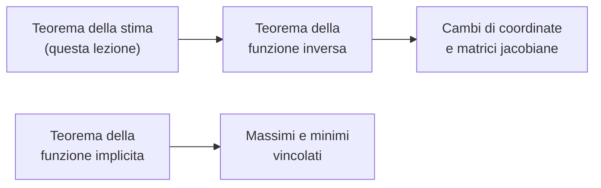

---

## corso: "Metodi Matematici per l'Ingegneria" lezione: 6 data: 2026-10-09 docente: Nicola Pinamonti argomenti: [curve di livello, teorema della funzione implicita, gradiente e curve di livello, norma di una matrice, teorema della stima, funzione inversa, iniettività e suriettività] fonti: [trascrizione, appunti manuali, note del docente] tags: [metodi-matematici, lezione]
---
# Lezione 6 — Funzioni implicite, teorema della stima, verso la funzione inversa

La lezione contiene tre argomenti. Il primo è il **teorema della funzione implicita**: dice quando l'insieme dei punti in cui una funzione di due variabili assume un valore fissato, cioè una curva di livello, si può descrivere localmente come grafico di una funzione di una variabile. Come sottoprodotto della dimostrazione si scopre che il gradiente è sempre perpendicolare alle curve di livello. Il secondo è il **teorema della stima**, che controlla la variazione di una funzione a valori vettoriali tra due punti qualsiasi vicini a un punto dato tramite la matrice jacobiana in quel punto. Il terzo è l'introduzione al problema della **funzione inversa**, che verrà sviluppato nella lezione successiva e serve a capire quando si possono cambiare le coordinate.

## Curve di livello e funzioni definite implicitamente

### Motivazione: la cartina e le curve di livello

Il docente parte da un esempio concreto. Si immagini una funzione $f : D \subseteq \mathbb{R}^2 \to \mathbb{R}$ definita sopra una cartina geografica, che in ogni punto $(x, y)$ dà l'altitudine del terreno: in un punto la funzione vale 5, in un altro 10, e così via. Interessa capire com'è fatto l'insieme dei punti in cui la funzione assume un valore preciso $a$: $$L_a = { (x, y) \in D \ : \ f(x, y) = a }.$$ Se la funzione descrive davvero una montagna, questo insieme è tipicamente una **curva di livello** (le isoipse delle carte topografiche): seguendo la curva l'altitudine non cambia.

<svg viewBox="0 0 520 345" width="520" style="display:block;margin:1em auto;max-width:100%;height:auto;font-family:inherit" xmlns="http://www.w3.org/2000/svg"><rect x="30" y="22.3" width="460" height="308.4" fill="currentColor" fill-opacity="0.03" stroke="currentColor" stroke-opacity="0.3"/><polyline points="368.5,330.7 370.1,329.9 371.3,329.4 372.4,328.8 373.6,328.2 374.7,327.6 376.1,326.8 377.5,326 378.9,325.3 380.2,324.5 381.5,323.7 382.7,323 383.9,322.2 385.1,321.4 386.2,320.7 387.4,319.9 388.5,319.1 389.6,318.3 390.7,317.5 391.7,316.8 392.8,316 393.8,315.2 394.7,314.4 395.7,313.7 396.7,312.9 397.8,312 398.9,311 400.1,310 401.1,309 402,308.3 402.8,307.5 403.6,306.7 404.7,305.7 405.8,304.6 406.8,303.6 407.6,302.9 408.3,302.1 409.3,301 410.5,299.8 411.2,299 411.8,298.2 412.8,297.2 413.8,295.9 414.5,295.1 415.1,294.4 416.2,293 417,292 417.6,291.3 418.5,290 419.3,288.9 419.9,288.2 420.8,286.8 421.5,285.9 422,285.1 423.1,283.5 423.6,282.8 424.3,281.7 425.1,280.4 425.5,279.7 426.5,278.1 426.9,277.3 427.7,275.9 428.2,275 428.9,273.8 429.5,272.7 430.1,271.7 430.7,270.4 431.2,269.4 431.8,268.1 432.4,267 432.9,265.8 433.5,264.5 434,263.4 434.6,261.9 435,261.1 435.6,259.6 435.9,258.8 436.5,257.3 437,255.9 437.3,254.9 437.9,253.4 438.1,252.6 438.6,251.1 439.1,249.5 439.4,248.7 439.8,247.2 440.2,245.7 440.5,244.9 440.9,243.3 441.3,241.8 441.6,240.4 441.8,239.5 442.1,237.9 442.4,236.4 442.7,234.9 442.9,234.1 443.2,232.5 443.4,231 443.6,229.4 443.9,227.9 444,227.1 444.1,225.6 444.3,224 444.5,222.5 444.6,220.9 444.7,219.4 444.8,217.8 444.9,216.3 444.9,214.7 445,213.2 445,211.6 445,210.1 445,208.6 445,207 444.9,205.5 444.8,203.9 444.8,202.4 444.7,200.8 444.5,199.3 444.4,197.7 444.2,196.2 444.1,194.6 443.9,193.3 443.8,192.3 443.5,190.8 443.3,189.2 443,187.7 442.8,186.1 442.6,185.4 442.3,183.8 442,182.3 441.6,180.7 441.5,180 441.1,178.4 440.7,176.9 440.4,175.9 440.1,174.5 439.6,173 439.3,171.9 438.9,170.7 438.4,169.1 438.1,168.3 437.6,166.8 437.1,165.3 436.8,164.5 436.2,163 435.8,161.9 435.3,160.6 434.7,159.1 434.3,158.3 433.7,156.8 433.3,156 432.6,154.4 432.2,153.7 431.5,152.1 431.1,151.4 430.3,149.8 429.9,149 429.1,147.5 428.7,146.7 427.8,145.2 427.4,144.4 426.6,143 426,142.1 425.4,141.1 424.6,139.8 424.1,139 423.1,137.5 422.6,136.7 422,135.7 421,134.4 420.5,133.6 419.7,132.5 418.8,131.3 418.2,130.5 417.4,129.4 416.4,128.2 415.8,127.4 415.1,126.5 413.9,125.1 413.2,124.3 412.6,123.5 411.6,122.4 410.5,121.2 409.8,120.4 409.1,119.7 408.1,118.7 407,117.5 406.1,116.6 405.3,115.8 404.5,115 403.5,114.1 402.4,113 401.2,111.9 400.4,111.2 399.5,110.4 398.6,109.6 397.7,108.8 396.6,108 395.5,107 394.3,106.1 393.2,105.2 392,104.3 390.9,103.5 389.7,102.7 388.6,101.9 387.5,101.1 386.4,100.3 385.2,99.6 384,98.8 382.8,98 381.6,97.3 380.5,96.6 379.3,95.9 378.2,95.2 377,94.6 375.9,94 374.7,93.3 373.3,92.6 371.8,91.8 370.3,91.1 368.9,90.4 367.8,89.9 366.6,89.4 365.2,88.7 363.4,88 362,87.4 360.9,86.9 359.5,86.4 357.5,85.7 356.3,85.2 355.1,84.8 352.9,84.1 351.7,83.7 350.5,83.3 348.2,82.7 347,82.4 344.9,81.8 343.6,81.5 341.7,81 340.1,80.7 338.1,80.2 336.7,80 334.4,79.6 333.2,79.4 330.9,79 328.6,78.7 327.4,78.6 325.1,78.3 322.8,78.1 320.5,77.9 319.4,77.9 317.1,77.7 314.8,77.7 312.5,77.6 310.2,77.6 307.8,77.6 305.5,77.7 303.2,77.8 301.4,77.9 299.8,78 297.5,78.2 295.2,78.4 292.9,78.7 291.7,78.8 289.4,79.1 287.1,79.4 285.9,79.6 283.6,80 281.8,80.2 280.2,80.5 277.9,80.9 276.7,81.1 274.4,81.5 273,81.8 271,82.2 268.7,82.6 267.5,82.8 265.2,83.2 264,83.4 261.7,83.7 259.4,84.1 258.3,84.3 256,84.5 253.7,84.8 252.5,84.9 250.2,85 247.9,85.1 245.6,85.1 243.3,85 241,84.9 239.8,84.8 237.5,84.4 235.6,84.1 234.1,83.8 232.2,83.3 230.6,82.9 229.4,82.6 227.1,81.8 226,81.4 224.8,81 222.9,80.2 221.4,79.6 220.2,79.1 219.1,78.6 217.6,77.9 215.9,77.2 214.5,76.4 213.3,75.9 212.2,75.3 211,74.7 209.6,74.1 208.1,73.3 206.5,72.5 205.2,71.9 204.1,71.3 202.9,70.7 201.8,70.1 200.3,69.4 198.7,68.7 197.2,67.9 196,67.4 194.9,66.9 193.7,66.3 191.9,65.6 190.3,64.8 189.1,64.4 187.9,63.9 186.3,63.2 184.5,62.5 183.3,62.1 182.1,61.7 179.9,60.9 178.7,60.5 177.5,60.1 175.3,59.5 174.1,59.2 172,58.6 170.7,58.2 168.9,57.8 167.2,57.5 165.2,57.1 163.7,56.8 161.4,56.4 160.3,56.2 158,55.9 155.7,55.7 153.6,55.5 152.2,55.4 149.9,55.3 147.6,55.2 145.3,55.2 143,55.3 140.7,55.4 138.7,55.5 137.2,55.6 134.9,55.9 132.6,56.2 131.5,56.3 129.1,56.7 127.4,57.1 125.7,57.4 123.9,57.8 122.2,58.2 120.9,58.6 118.8,59.2 117.6,59.6 115.8,60.1 114.2,60.7 113,61.1 111.6,61.7 109.7,62.5 108.4,63 107.2,63.5 106.1,64 104.5,64.8 103,65.6 101.5,66.3 100.3,67 99.2,67.6 98,68.3 96.9,69 95.7,69.7 94.6,70.5 93.4,71.2 92.3,72 91.1,72.8 89.9,73.7 88.8,74.6 87.6,75.5 86.5,76.4 85.6,77.2 84.7,77.9 83.8,78.7 82.9,79.5 81.9,80.4 80.7,81.5 79.7,82.6 78.9,83.3 78.2,84.1 77.3,85.1 76.1,86.4 75.4,87.2 74.7,88 73.8,89 72.8,90.3 72.2,91.1 71.5,92 70.4,93.4 69.9,94.2 69.2,95.1 68.3,96.5 67.8,97.2 66.9,98.6 66.3,99.6 65.7,100.5 64.9,101.9 64.5,102.7 63.7,104.2 63.2,105 62.5,106.5 62.1,107.3 61.3,108.8 61,109.6 60.3,111.2 60,111.9 59.3,113.5 58.8,114.8 58.4,115.8 57.9,117.3 57.6,118.1 57.1,119.7 56.6,121.2 56.4,122 56,123.5 55.6,125.1 55.4,125.9 55,127.4 54.7,128.9 54.4,130.5 54.2,131.4 54,132.8 53.7,134.4 53.5,135.9 53.3,137.4 53.2,139 53.1,140.2 53,141.3 52.9,142.9 52.8,144.4 52.8,145.9 52.7,147.5 52.7,149 52.8,150.6 52.8,152.1 52.9,153.7 53,155.2 53.1,156 53.3,157.5 53.4,159.1 53.6,160.6 53.9,162.2 54.1,163.7 54.3,164.5 54.6,166 54.9,167.6 55.2,169.1 55.4,169.9 55.8,171.5 56.3,173 56.5,173.9 56.9,175.3 57.4,176.9 57.7,177.6 58.2,179.2 58.8,180.7 59.1,181.5 59.7,183 60.1,183.8 60.7,185.4 61.1,186.2 61.8,187.7 62.3,188.7 62.9,190 63.4,190.9 64.2,192.3 64.6,193.1 65.5,194.6 65.9,195.4 66.9,196.9 67.4,197.7 68,198.7 68.9,200.1 69.5,200.8 70.4,202.1 71.1,203.1 71.7,203.9 72.7,205.2 73.5,206.2 74.1,207 75,208 76.1,209.3 76.8,210.1 77.5,210.9 78.4,211.8 79.6,213 80.5,214 81.3,214.7 82.1,215.5 83,216.4 84.2,217.4 85.3,218.4 86.4,219.4 87.4,220.1 88.3,220.9 89.3,221.7 90.3,222.5 91.4,223.2 92.4,224 93.5,224.8 94.6,225.6 95.8,226.3 97,227.1 98.2,227.9 99.5,228.7 100.8,229.4 102.1,230.2 103.5,231 104.9,231.7 106.1,232.3 107.2,232.9 108.4,233.5 109.7,234.1 111.4,234.8 113,235.6 114.2,236 115.3,236.5 116.9,237.2 118.8,237.9 119.9,238.3 121.1,238.7 123.2,239.5 124.5,239.9 125.7,240.3 128,241 129.1,241.4 130.6,241.8 132.6,242.4 133.8,242.7 136.1,243.3 137.2,243.6 139,244.1 140.7,244.5 142,244.9 144.1,245.4 145.3,245.7 147.6,246.3 148.7,246.6 150.8,247.2 152.2,247.6 153.5,248 155.7,248.6 156.8,249 158.5,249.5 160.3,250.1 161.4,250.6 162.7,251.1 164.6,251.8 166,252.5 167.2,253 168.3,253.6 169.5,254.2 170.9,254.9 172.2,255.7 173.5,256.5 174.6,257.3 175.8,258 176.8,258.8 177.8,259.6 178.8,260.3 179.9,261.2 181,262.3 182.2,263.3 183.1,264.2 183.9,265 184.7,265.8 185.6,266.8 186.8,268 187.6,268.8 188.2,269.6 189.1,270.6 190.3,271.9 190.9,272.7 191.5,273.5 192.6,274.7 193.4,275.8 194.1,276.6 194.9,277.6 195.9,278.9 196.6,279.7 197.2,280.4 198.3,281.9 199,282.8 199.6,283.5 200.6,284.8 201.5,285.9 202.1,286.6 202.9,287.6 204,288.9 204.7,289.7 205.3,290.5 206.4,291.7 207.3,292.8 208,293.6 208.7,294.4 209.8,295.7 210.7,296.7 211.4,297.4 212.2,298.2 213.3,299.4 214.4,300.5 215.1,301.3 215.9,302.1 216.8,303 217.9,304.1 219,305.2 219.8,305.9 220.7,306.7 221.5,307.5 222.5,308.4 223.7,309.5 224.8,310.5 225.9,311.4 226.8,312.1 227.8,312.9 228.7,313.7 229.7,314.4 230.7,315.2 231.8,316 232.9,316.9 234.1,317.7 235.2,318.6 236.4,319.4 237.5,320.2 238.7,320.9 239.8,321.7 241,322.4 242.1,323.2 243.3,323.9 244.4,324.6 245.7,325.3 247,326 248.4,326.8 249.8,327.6 251.3,328.4 252.5,329 253.7,329.5 254.8,330.1 256,330.7 256,330.7" fill="none" stroke="currentColor" stroke-width="1.0" stroke-opacity="0.5"/><polyline points="311.3,321.4 313.6,321.4 314.8,321.4 317.1,321.3 319.4,321.2 321.7,321 324,320.8 325.5,320.6 327.4,320.4 329.7,320 330.9,319.8 333.2,319.4 334.9,319.1 336.7,318.7 338.3,318.3 340.1,317.9 341.4,317.5 343.6,316.9 344.7,316.6 346.5,316 348.2,315.4 349.3,315 351,314.4 352.8,313.8 354,313.3 355.1,312.8 356.7,312.1 358.4,311.4 359.7,310.8 360.9,310.2 362,309.6 363.2,309 364.7,308.3 366.1,307.5 367.5,306.7 368.8,305.9 370.1,305.2 371.3,304.4 372.4,303.7 373.6,303 374.7,302.2 375.9,301.4 377,300.6 378.1,299.8 379.2,299 380.2,298.2 381.2,297.4 382.1,296.7 383.1,295.9 384,295.1 385.1,294.2 386.2,293.2 387.4,292.1 388.3,291.3 389.1,290.5 389.9,289.7 390.9,288.8 392,287.6 393,286.6 393.7,285.9 394.4,285.1 395.5,283.9 396.4,282.8 397.1,282 397.8,281.2 398.9,279.8 399.6,278.9 400.2,278.1 401.2,276.8 402,275.8 402.5,275 403.5,273.6 404.1,272.7 404.7,271.9 405.7,270.4 406.2,269.6 407,268.3 407.6,267.3 408.1,266.3 408.9,265 409.4,264.2 410.2,262.7 410.6,261.9 411.4,260.3 411.8,259.6 412.5,258 412.9,257.3 413.6,255.7 413.9,254.9 414.6,253.4 415.1,252.3 415.5,251.1 416.1,249.5 416.4,248.7 417,247.2 417.4,246.1 417.8,244.9 418.3,243.3 418.5,242.5 418.9,241 419.4,239.5 419.7,238.4 420,237.2 420.4,235.6 420.7,234.1 420.9,233.3 421.2,231.7 421.5,230.2 421.7,228.7 422,227.1 422.1,226.3 422.3,224.8 422.5,223.2 422.7,221.7 422.8,220.1 422.9,218.6 423,217.1 423.1,215.5 423.2,214.7 423.2,213.2 423.2,211.6 423.2,210.1 423.2,208.6 423.2,207 423.1,205.6 423.1,204.7 423,203.1 422.9,201.6 422.8,200.1 422.6,198.5 422.4,197 422.2,195.4 422,193.9 421.9,193.1 421.6,191.5 421.3,190 421,188.5 420.8,187.4 420.5,186.1 420.2,184.6 419.8,183 419.6,182.3 419.2,180.7 418.7,179.2 418.5,178.4 418,176.9 417.5,175.3 417.3,174.5 416.7,173 416.2,171.6 415.9,170.7 415.3,169.1 414.9,168.4 414.3,166.8 413.9,165.9 413.3,164.5 412.8,163.4 412.2,162.2 411.6,161 411,159.9 410.5,158.7 409.8,157.5 409.3,156.6 408.5,155.2 408.1,154.4 407.1,152.9 406.7,152.1 405.8,150.8 405.2,149.8 404.7,149 403.6,147.5 403.1,146.7 402.4,145.7 401.4,144.4 400.9,143.6 400.1,142.6 399.1,141.3 398.4,140.5 397.8,139.7 396.6,138.3 395.8,137.4 395.2,136.7 394.3,135.7 393.2,134.5 392.3,133.6 391.5,132.8 390.8,132 389.7,131 388.5,129.9 387.6,128.9 386.7,128.2 385.9,127.4 385,126.6 383.9,125.7 382.8,124.8 381.6,123.8 380.5,122.9 379.3,122 378.2,121.2 377.2,120.4 376.1,119.7 375,118.9 373.8,118.1 372.6,117.3 371.4,116.6 370.2,115.8 368.9,115.1 367.8,114.4 366.6,113.7 365.5,113.1 364.3,112.5 363.2,111.9 361.8,111.2 360.2,110.4 358.6,109.6 357.4,109.1 356.3,108.6 355.1,108.1 353.2,107.3 351.7,106.7 350.5,106.3 349,105.8 347,105.1 345.9,104.7 344.3,104.2 342.4,103.7 341.3,103.3 339,102.7 337.8,102.5 335.5,101.9 334.4,101.7 332.1,101.2 330.9,101 328.6,100.7 326.3,100.3 325.1,100.2 322.8,99.9 320.5,99.7 318.2,99.6 317.1,99.5 314.8,99.4 312.5,99.4 310.2,99.4 307.8,99.4 305.5,99.5 304.2,99.6 302.1,99.7 299.8,99.9 297.5,100.1 295.6,100.3 294,100.5 291.7,100.9 290.1,101.1 288.2,101.4 285.9,101.8 284.8,102.1 282.5,102.5 281.3,102.8 279,103.2 277.9,103.5 275.6,104 274.4,104.3 272.1,104.9 271,105.1 268.6,105.7 267.5,106 265.3,106.5 264,106.8 262.1,107.3 260.6,107.6 258.7,108.1 257.1,108.4 254.9,108.8 253.7,109.1 251.4,109.5 250.2,109.6 247.9,109.9 245.6,110.1 243.3,110.2 241,110.2 238.7,110.1 236.4,109.8 235.1,109.6 232.9,109.2 231.5,108.8 229.4,108.2 228.3,107.8 226.8,107.3 224.9,106.5 223.7,106 222.5,105.4 221.4,104.8 220.2,104.2 218.8,103.4 217.5,102.7 216.2,101.9 214.9,101.1 213.7,100.3 212.4,99.6 211.2,98.8 210.1,98 208.9,97.2 207.7,96.5 206.5,95.7 205.4,94.9 204.2,94.2 203,93.4 201.8,92.6 200.6,91.8 199.5,91.1 198.3,90.4 197.2,89.7 196,89 194.9,88.3 193.7,87.6 192.6,86.9 191.4,86.3 190.3,85.6 188.9,84.9 187.4,84.1 185.9,83.3 184.5,82.7 183.3,82.1 182.2,81.6 180.9,81 179.1,80.2 177.6,79.6 176.4,79.2 175.2,78.7 173,77.9 171.8,77.5 170.6,77.2 168.3,76.5 167.2,76.2 164.9,75.6 163.7,75.3 161.4,74.9 160.3,74.6 158,74.3 156.5,74.1 154.5,73.8 152.2,73.6 149.9,73.5 147.6,73.4 145.3,73.4 143,73.4 140.7,73.6 138.4,73.8 136.1,74 134.9,74.2 132.6,74.6 131.2,74.8 129.1,75.3 127.7,75.6 125.7,76.1 124.5,76.5 122.3,77.2 121.1,77.6 119.9,78 118,78.7 116.5,79.3 115.3,79.8 114.2,80.3 112.7,81 111.2,81.8 109.7,82.6 108.4,83.3 107.2,84 106.1,84.7 104.9,85.4 103.8,86.2 102.6,87 101.5,87.8 100.3,88.7 99.2,89.5 98.2,90.3 97.3,91.1 96.4,91.8 95.5,92.6 94.6,93.5 93.4,94.6 92.3,95.7 91.5,96.5 90.8,97.2 89.9,98.2 88.8,99.5 88.1,100.3 87.5,101.1 86.5,102.3 85.7,103.4 85.1,104.2 84.2,105.5 83.5,106.5 83,107.3 82,108.8 81.5,109.6 80.7,111 80.2,111.9 79.6,113.1 79,114.3 78.4,115.3 77.8,116.6 77.3,117.8 76.8,118.9 76.2,120.4 75.9,121.2 75.3,122.8 75,123.7 74.5,125.1 74,126.6 73.8,127.4 73.4,128.9 73,130.5 72.7,132 72.5,132.8 72.2,134.4 71.9,135.9 71.7,137.4 71.5,138.7 71.4,139.8 71.2,141.3 71.1,142.9 71,144.4 71,145.9 70.9,147.5 71,149 71,150.6 71.1,152.1 71.2,153.7 71.3,155.2 71.5,156.8 71.6,157.5 71.8,159.1 72.1,160.6 72.4,162.2 72.7,163.6 72.9,164.5 73.2,166 73.6,167.6 73.9,168.4 74.3,169.9 74.8,171.5 75.1,172.2 75.6,173.8 76.1,175 76.5,176.1 77.2,177.6 77.5,178.4 78.3,180 78.6,180.7 79.4,182.3 79.8,183 80.7,184.6 81.1,185.4 81.9,186.6 82.5,187.7 83,188.5 84.1,190 84.6,190.8 85.3,191.8 86.3,193.1 86.9,193.9 87.6,194.8 88.8,196.2 89.5,197 90.1,197.7 91.1,198.8 92.3,200 93.1,200.8 93.8,201.6 94.6,202.4 95.7,203.4 96.9,204.4 98,205.4 99.1,206.2 100,207 101,207.8 102,208.6 103.1,209.3 104.2,210.1 105.4,210.9 106.5,211.6 107.8,212.4 109.1,213.2 110.4,214 111.8,214.7 113,215.4 114.2,216 115.3,216.5 116.5,217.1 118.1,217.8 119.9,218.6 121.1,219.1 122.2,219.5 123.9,220.1 125.7,220.8 126.8,221.2 128.5,221.7 130.3,222.3 131.5,222.6 133.8,223.2 134.9,223.5 137.1,224 138.4,224.3 140.7,224.8 141.8,225 144.1,225.4 145.3,225.6 147.6,226 149.6,226.3 151.1,226.5 153.4,226.9 155.1,227.1 156.8,227.3 159.1,227.7 160.8,227.9 162.6,228.1 164.9,228.5 166.1,228.7 168.3,229 170.5,229.4 171.8,229.7 174,230.2 175.3,230.5 176.9,231 178.7,231.5 179.9,231.9 181.5,232.5 183.3,233.3 184.5,233.8 185.6,234.4 186.8,235.1 187.9,235.7 189.1,236.5 190.3,237.3 191.4,238.1 192.6,239 193.7,240 194.8,241 195.6,241.8 196.4,242.6 197.2,243.4 198.3,244.6 199.3,245.7 199.9,246.4 200.6,247.3 201.8,248.7 202.4,249.5 203,250.3 204.1,251.7 204.8,252.6 205.3,253.4 206.4,254.8 207,255.7 207.6,256.5 208.7,258 209.2,258.8 209.8,259.7 210.8,261.1 211.4,261.9 212.2,263 213,264.2 213.6,265 214.5,266.2 215.2,267.3 215.8,268.1 216.8,269.4 217.5,270.4 218.1,271.2 219.1,272.5 219.8,273.5 220.4,274.3 221.4,275.4 222.3,276.6 222.9,277.3 223.7,278.3 224.8,279.6 225.5,280.4 226.2,281.2 227.1,282.3 228.3,283.5 229,284.3 229.7,285.1 230.6,286 231.8,287.2 232.7,288.2 233.5,288.9 234.3,289.7 235.2,290.5 236.4,291.6 237.5,292.7 238.6,293.6 239.5,294.4 240.4,295.1 241.3,295.9 242.3,296.7 243.3,297.5 244.4,298.4 245.6,299.2 246.7,300.1 247.9,300.9 249,301.7 250.2,302.5 251.4,303.2 252.5,304 253.7,304.7 254.8,305.4 256,306.1 257.1,306.8 258.4,307.5 259.8,308.3 261.3,309 262.8,309.8 264,310.4 265.2,310.9 266.3,311.5 267.8,312.1 269.6,312.9 271,313.4 272.1,313.9 273.6,314.4 275.6,315.2 276.7,315.6 278,316 280.2,316.7 281.3,317 283.2,317.5 284.8,318 286.2,318.3 288.2,318.8 289.6,319.1 291.7,319.5 293.7,319.9 295.2,320.1 297.5,320.4 299.1,320.6 300.9,320.8 303.2,321.1 305.5,321.2 307.8,321.3 310.2,321.4 311.3,321.4 311.3,321.4" fill="none" stroke="currentColor" stroke-width="1.0" stroke-opacity="0.5"/><polyline points="303.2,306 305.5,306.2 307.8,306.3 310.2,306.4 312.5,306.4 314.8,306.4 317.1,306.3 319.4,306.2 321.7,306 322.8,305.8 325.1,305.6 327.4,305.2 328.6,305 330.9,304.6 332.1,304.4 334.4,303.9 335.5,303.6 337.8,303 339,302.6 340.8,302.1 342.4,301.6 343.6,301.2 345.4,300.5 347,299.9 348.2,299.5 349.3,299 351.1,298.2 352.8,297.5 354,296.9 355.1,296.3 356.3,295.8 357.5,295.1 358.9,294.4 360.2,293.6 361.6,292.8 362.8,292 364.1,291.3 365.2,290.5 366.4,289.7 367.5,288.9 368.6,288.2 369.6,287.4 370.7,286.6 371.7,285.9 372.6,285.1 373.6,284.3 374.7,283.3 375.9,282.3 377,281.3 377.9,280.4 378.8,279.7 379.6,278.9 380.5,278 381.6,276.8 382.6,275.8 383.3,275 384,274.3 385.1,273 386,271.9 386.6,271.2 387.4,270.2 388.4,268.8 389,268.1 389.7,267.2 390.7,265.8 391.3,265 392,263.9 392.8,262.7 393.3,261.9 394.3,260.3 394.7,259.6 395.5,258.3 396.1,257.3 396.6,256.3 397.3,254.9 397.8,254.1 398.5,252.6 398.9,251.7 399.6,250.3 400.1,249.2 400.6,248 401.2,246.5 401.6,245.7 402.2,244.1 402.4,243.3 403,241.8 403.5,240.2 403.8,239.5 404.2,237.9 404.7,236.4 404.9,235.6 405.3,234.1 405.7,232.5 405.9,231.7 406.2,230.2 406.5,228.7 406.8,227.1 407,225.9 407.2,224.8 407.4,223.2 407.6,221.7 407.8,220.1 407.9,218.6 408,217.1 408.1,215.5 408.2,214.7 408.2,213.2 408.2,211.6 408.2,210.1 408.2,208.6 408.2,207 408.1,206 408.1,204.7 408,203.1 407.8,201.6 407.7,200.1 407.5,198.5 407.3,197 407.1,195.4 406.9,194.6 406.7,193.1 406.4,191.5 406,190 405.8,189.1 405.5,187.7 405.1,186.1 404.7,184.6 404.5,183.8 404,182.3 403.5,180.7 403.3,180 402.7,178.4 402.4,177.4 401.9,176.1 401.3,174.5 401,173.8 400.3,172.2 400,171.5 399.3,169.9 398.9,169.1 398.1,167.6 397.8,166.8 396.9,165.3 396.5,164.5 395.7,163 395.2,162.2 394.3,160.6 393.8,159.9 393.2,158.8 392.3,157.5 391.8,156.8 390.9,155.3 390.2,154.4 389.7,153.7 388.5,152.2 387.9,151.4 387.3,150.6 386.2,149.3 385.4,148.3 384.7,147.5 383.9,146.6 382.8,145.3 381.9,144.4 381.2,143.6 380.4,142.9 379.3,141.8 378.2,140.7 377.2,139.8 376.3,139 375.5,138.2 374.6,137.4 373.6,136.6 372.4,135.7 371.3,134.7 370.1,133.9 368.9,133 367.8,132.2 366.6,131.4 365.5,130.6 364.3,129.8 363.2,129.1 362,128.4 360.9,127.7 359.7,127 358.6,126.4 357.4,125.8 356.1,125.1 354.6,124.3 353,123.5 351.7,122.9 350.5,122.4 349.3,121.9 347.6,121.2 345.9,120.5 344.7,120.1 343.4,119.7 341.3,119 340.1,118.6 338.5,118.1 336.7,117.6 335.5,117.3 333.2,116.8 332.1,116.5 329.7,116.1 328.3,115.8 326.3,115.5 324,115.1 322.8,115 320.5,114.8 318.2,114.6 315.9,114.5 313.6,114.4 311.3,114.4 309,114.4 306.7,114.5 304.4,114.6 302.1,114.8 299.8,115 298.6,115.1 296.3,115.4 294,115.8 292.9,116 290.6,116.4 289.4,116.6 287.1,117.1 285.8,117.3 283.6,117.9 282.5,118.2 280.2,118.7 279,119.1 276.9,119.7 275.6,120 274.3,120.4 272.1,121.1 271,121.5 269.3,122 267.5,122.6 266.3,123 264.6,123.5 262.9,124.1 261.7,124.5 260,125.1 258.3,125.6 257.1,126 255.2,126.6 253.7,127.1 252.5,127.4 250.2,128.1 249,128.4 246.8,128.9 245.6,129.2 243.3,129.7 242.1,129.8 239.8,130.1 237.5,130.3 235.2,130.3 232.9,130.1 230.6,129.7 229.4,129.5 227.6,128.9 226,128.4 224.8,127.9 223.7,127.4 222.2,126.6 220.8,125.8 219.5,125.1 218.4,124.3 217.2,123.5 216.2,122.8 215.1,122 214.1,121.2 213.2,120.4 212.2,119.6 211,118.7 209.8,117.7 208.7,116.7 207.7,115.8 206.8,115 205.9,114.3 205,113.5 204.1,112.7 202.9,111.7 201.8,110.7 200.6,109.7 199.6,108.8 198.6,108.1 197.7,107.3 196.7,106.5 195.8,105.8 194.8,105 193.7,104.2 192.6,103.3 191.4,102.5 190.3,101.6 189.1,100.8 187.9,100.1 186.8,99.3 185.6,98.6 184.5,97.9 183.3,97.2 182.1,96.5 180.8,95.7 179.3,94.9 177.8,94.2 176.4,93.5 175.3,93 174.1,92.4 172.7,91.8 170.7,91.1 169.5,90.6 168.3,90.2 166.2,89.5 164.9,89.1 163.5,88.7 161.4,88.2 160.3,88 158,87.5 156.1,87.2 154.5,87 152.2,86.7 149.9,86.5 147.6,86.5 145.3,86.4 143,86.5 140.7,86.7 138.4,86.9 136.3,87.2 134.9,87.4 132.6,87.9 131.5,88.1 129.1,88.7 128,89.1 126.6,89.5 124.5,90.2 123.4,90.6 122.2,91.1 120.5,91.8 118.8,92.6 117.6,93.2 116.5,93.8 115.3,94.4 114.2,95.1 113,95.8 111.9,96.5 110.7,97.3 109.5,98.1 108.4,99 107.2,99.9 106.1,100.8 104.9,101.8 104,102.7 103.1,103.4 102.3,104.2 101.5,105.1 100.3,106.3 99.4,107.3 98.7,108.1 98,108.9 96.9,110.4 96.3,111.2 95.7,111.9 94.6,113.5 94.1,114.3 93.4,115.3 92.6,116.6 92.2,117.3 91.3,118.9 90.9,119.7 90.1,121.2 89.8,122 89.1,123.5 88.8,124.3 88.1,125.8 87.6,127.2 87.3,128.2 86.8,129.7 86.5,130.7 86.1,132 85.7,133.6 85.4,135.1 85.2,135.9 84.9,137.4 84.7,139 84.5,140.5 84.3,142.1 84.2,143.6 84.2,144.4 84.1,145.9 84.1,147.5 84.1,149 84.1,150.6 84.2,151.7 84.3,152.9 84.4,154.4 84.6,156 84.8,157.5 85.1,159.1 85.3,160.3 85.6,161.4 86,163 86.4,164.5 86.6,165.3 87.1,166.8 87.6,168.4 87.9,169.1 88.5,170.7 88.8,171.5 89.5,173 89.9,174.1 90.6,175.3 91.1,176.4 91.8,177.6 92.3,178.5 93.1,180 93.6,180.7 94.6,182.2 95.2,183 95.7,183.8 96.8,185.4 97.4,186.1 98.1,186.9 99.2,188.2 100.1,189.2 100.8,190 101.5,190.8 102.6,191.9 103.8,193 104.7,193.9 105.5,194.6 106.4,195.4 107.4,196.2 108.4,197 109.5,197.9 110.7,198.7 111.9,199.5 113,200.3 114.2,201 115.3,201.7 116.5,202.4 117.8,203.1 119.3,203.9 120.9,204.7 122.2,205.3 123.4,205.8 124.5,206.3 126.3,207 128,207.6 129.1,208 130.7,208.6 132.6,209.1 133.8,209.5 136.1,210 137.2,210.3 139.5,210.8 140.7,211 143,211.4 144.4,211.6 146.4,211.9 148.7,212.2 151.1,212.4 152.2,212.5 154.5,212.7 156.8,212.8 159.1,212.9 161.4,212.9 163.7,213 166,213 168.3,213 170.7,213 173,213 175.3,213 177.6,213.1 179.9,213.2 181,213.2 183.3,213.4 185.6,213.7 187.2,214 189.1,214.3 190.7,214.7 192.6,215.3 193.7,215.7 195.1,216.3 196.7,217.1 198.1,217.8 199.3,218.6 200.4,219.4 201.4,220.1 202.3,220.9 203.2,221.7 204.1,222.6 205.2,223.7 206.2,224.8 206.8,225.6 207.5,226.4 208.7,227.9 209.2,228.7 209.8,229.5 210.9,231 211.4,231.7 212.2,232.9 212.9,234.1 213.4,234.8 214.3,236.4 214.8,237.2 215.6,238.5 216.2,239.5 216.8,240.5 217.5,241.8 218,242.6 218.9,244.1 219.4,244.9 220.2,246.3 220.7,247.2 221.4,248.3 222.1,249.5 222.6,250.3 223.5,251.8 224,252.6 224.8,253.9 225.5,254.9 226,255.7 227,257.3 227.5,258 228.3,259.2 229.1,260.3 229.6,261.1 230.6,262.5 231.3,263.4 231.9,264.2 232.9,265.6 233.6,266.5 234.2,267.3 235.2,268.5 236.1,269.6 236.8,270.4 237.5,271.3 238.7,272.6 239.5,273.5 240.2,274.3 241,275.1 242.1,276.3 243.1,277.3 243.9,278.1 244.7,278.9 245.6,279.7 246.7,280.8 247.9,281.8 249,282.8 249.9,283.5 250.8,284.3 251.8,285.1 252.8,285.9 253.8,286.6 254.8,287.4 256,288.3 257.1,289.1 258.3,289.9 259.4,290.6 260.6,291.4 261.7,292.1 262.9,292.8 264.2,293.6 265.6,294.4 267,295.1 268.5,295.9 269.8,296.5 271,297.1 272.1,297.6 273.4,298.2 275.2,299 276.7,299.6 277.9,300.1 279.1,300.5 281.3,301.3 282.5,301.7 283.7,302.1 285.9,302.8 287.1,303.1 289.2,303.6 290.6,303.9 292.6,304.4 294,304.7 296.3,305.1 297.5,305.3 299.8,305.6 302.1,305.9 303.2,306 303.2,306" fill="none" stroke="currentColor" stroke-width="1.0" stroke-opacity="0.5"/><polyline points="303.2,293.7 305.5,293.9 307.8,294.1 310.2,294.2 312.5,294.2 314.8,294.1 317.1,294 319.4,293.9 321.7,293.7 322.8,293.5 325.1,293.2 327.4,292.8 328.6,292.6 330.9,292.1 332.1,291.8 334.2,291.3 335.5,290.9 336.9,290.5 339,289.8 340.1,289.4 341.4,288.9 343.4,288.2 344.7,287.6 345.9,287.1 347,286.6 348.7,285.9 350.2,285.1 351.7,284.3 352.8,283.7 354,283.1 355.1,282.4 356.3,281.7 357.4,281 358.6,280.2 359.7,279.4 360.9,278.6 362,277.8 363.2,276.9 364.3,276 365.5,275.1 366.5,274.3 367.4,273.5 368.3,272.7 369.1,271.9 370.1,271 371.3,269.9 372.3,268.8 373,268.1 373.7,267.3 374.7,266.2 375.8,265 376.5,264.2 377.1,263.4 378.2,262.1 378.9,261.1 379.5,260.3 380.5,259 381.2,258 381.7,257.3 382.7,255.7 383.2,254.9 383.9,253.8 384.6,252.6 385.1,251.8 385.9,250.3 386.3,249.5 387.1,248 387.5,247.2 388.2,245.7 388.6,244.9 389.3,243.3 389.7,242.3 390.2,241 390.8,239.5 391.1,238.7 391.6,237.2 392,236 392.4,234.8 392.8,233.3 393.2,232.1 393.4,231 393.8,229.4 394.2,227.9 394.3,227.1 394.6,225.6 394.9,224 395.1,222.5 395.3,220.9 395.5,219.9 395.6,218.6 395.7,217.1 395.8,215.5 395.9,214 396,212.4 396,210.9 396,209.3 396,207.8 395.9,206.2 395.8,204.7 395.7,203.1 395.5,201.6 395.4,200.8 395.3,199.3 395,197.7 394.8,196.2 394.5,194.6 394.3,193.7 394,192.3 393.7,190.8 393.3,189.2 393.1,188.5 392.6,186.9 392.2,185.4 391.9,184.6 391.4,183 390.9,181.5 390.5,180.7 389.9,179.2 389.6,178.4 389,176.9 388.5,175.9 387.9,174.5 387.4,173.5 386.8,172.2 386.2,171.2 385.5,169.9 385.1,169.1 384.2,167.6 383.7,166.8 382.8,165.3 382.3,164.5 381.6,163.5 380.7,162.2 380.1,161.4 379.3,160.3 378.4,159.1 377.8,158.3 377,157.4 375.9,156 375.2,155.2 374.5,154.4 373.6,153.4 372.4,152.2 371.6,151.4 370.8,150.6 370,149.8 368.9,148.8 367.8,147.8 366.6,146.8 365.6,145.9 364.7,145.2 363.7,144.4 362.7,143.6 361.7,142.9 360.6,142.1 359.5,141.3 358.3,140.5 357.1,139.8 355.9,139 354.6,138.2 353.3,137.4 351.9,136.7 350.5,136 349.3,135.4 348.2,134.8 347,134.3 345.5,133.6 343.6,132.8 342.4,132.3 341.3,131.9 339.5,131.3 337.8,130.7 336.7,130.3 334.5,129.7 333.2,129.4 331.5,128.9 329.7,128.5 327.9,128.2 326.3,127.9 324,127.5 322.8,127.3 320.5,127.1 318.2,126.9 315.9,126.7 313.6,126.6 312.5,126.6 310.2,126.6 309,126.6 306.7,126.7 304.4,126.9 302.1,127.1 299.8,127.4 298.6,127.5 296.3,127.9 294.6,128.2 292.9,128.5 290.8,128.9 289.4,129.3 287.6,129.7 285.9,130.1 284.7,130.5 282.5,131.1 281.3,131.5 279.7,132 277.9,132.6 276.7,133.1 275.3,133.6 273.3,134.3 272.1,134.8 271,135.3 269.4,135.9 267.6,136.7 266.3,137.2 265.2,137.7 264,138.2 262.4,139 260.7,139.8 259.4,140.4 258.3,140.9 257.1,141.5 255.9,142.1 254.3,142.9 252.7,143.6 251.4,144.3 250.2,144.9 249,145.4 247.9,146 246.3,146.7 244.7,147.5 243.3,148.1 242.1,148.7 241,149.2 239.4,149.8 237.5,150.6 236.4,151 235.2,151.4 232.9,152 231.8,152.3 229.4,152.7 227.1,152.8 224.8,152.7 222.5,152.1 221.4,151.7 220.2,151.2 219.1,150.5 217.9,149.7 216.8,148.8 215.6,147.7 214.6,146.7 213.9,145.9 213.2,145.2 212.2,143.9 211.3,142.9 210.7,142.1 209.8,141 208.9,139.8 208.3,139 207.5,138 206.6,136.7 206,135.9 205.2,134.9 204.3,133.6 203.7,132.8 202.9,131.8 201.9,130.5 201.3,129.7 200.6,128.8 199.5,127.4 198.8,126.6 198.2,125.8 197.2,124.6 196.2,123.5 195.5,122.8 194.9,122 193.7,120.7 192.7,119.7 191.9,118.9 191.2,118.1 190.3,117.2 189.1,116.1 187.9,115.1 187,114.3 186.1,113.5 185.2,112.7 184.3,111.9 183.3,111.2 182.2,110.3 181,109.5 179.9,108.7 178.7,107.9 177.6,107.2 176.4,106.4 175.2,105.8 173.9,105 172.4,104.2 170.8,103.4 169.5,102.8 168.3,102.3 167.2,101.8 165.3,101.1 163.7,100.6 162.6,100.2 160.4,99.6 159.1,99.3 157,98.8 155.7,98.5 153.4,98.2 152,98 149.9,97.8 147.6,97.7 145.3,97.7 143,97.8 140.7,98 139.5,98.1 137.2,98.5 135.6,98.8 133.8,99.2 132.4,99.6 130.3,100.2 129.1,100.6 127.7,101.1 125.8,101.9 124.5,102.4 123.4,103 122.2,103.6 121.1,104.2 119.7,105 118.5,105.8 117.3,106.5 116.2,107.3 115.1,108.1 114.2,108.8 113,109.8 111.9,110.8 110.7,111.9 109.9,112.7 109.1,113.5 108.4,114.3 107.2,115.6 106.4,116.6 105.8,117.3 104.9,118.5 104.1,119.7 103.6,120.4 102.6,122 102.2,122.8 101.5,124 100.9,125.1 100.3,126.2 99.8,127.4 99.2,128.8 98.8,129.7 98.2,131.3 98,132 97.5,133.6 97,135.1 96.8,135.9 96.5,137.4 96.2,139 95.9,140.5 95.7,142.1 95.6,142.9 95.5,144.4 95.4,145.9 95.4,147.5 95.4,149 95.5,150.6 95.6,152.1 95.7,153.5 95.8,154.4 96.1,156 96.3,157.5 96.7,159.1 96.9,159.9 97.3,161.4 97.7,163 98,163.8 98.5,165.3 99.1,166.8 99.4,167.6 100.1,169.1 100.5,169.9 101.3,171.5 101.7,172.2 102.6,173.8 103.1,174.5 103.8,175.7 104.6,176.9 105.2,177.6 106.1,178.9 107,180 107.6,180.7 108.4,181.6 109.5,182.9 110.5,183.8 111.3,184.6 112.1,185.4 113,186.2 114.2,187.2 115.3,188.1 116.5,189 117.6,189.8 118.8,190.6 119.9,191.3 121.1,192 122.2,192.7 123.4,193.3 124.5,193.9 126,194.6 127.7,195.4 129.1,196 130.3,196.4 131.7,197 133.8,197.6 134.9,198 136.9,198.5 138.4,198.9 140.4,199.3 141.8,199.5 144.1,199.9 145.3,200.1 147.6,200.3 149.9,200.5 152.2,200.6 154.5,200.6 156.8,200.6 159.1,200.5 161.4,200.3 163.7,200.1 164.9,200 167.2,199.7 169.5,199.4 170.7,199.2 173,198.8 174.6,198.5 176.4,198.2 178.5,197.7 179.9,197.5 182.2,197 183.3,196.7 185.6,196.2 186.8,196 189.1,195.5 190.3,195.3 192.6,194.8 193.7,194.6 196,194.3 198.3,194.2 200.6,194.2 202.9,194.4 204.1,194.6 206.4,195.4 207.5,196 208.7,196.7 209.8,197.5 210.9,198.5 211.7,199.3 212.4,200.1 213.3,201.2 214.1,202.4 214.6,203.1 215.6,204.7 216,205.5 216.8,206.8 217.3,207.8 217.9,209.1 218.4,210.1 219.1,211.5 219.5,212.4 220.2,214 220.5,214.7 221.2,216.3 221.5,217.1 222.2,218.6 222.5,219.4 223.2,220.9 223.7,222.2 224.1,223.2 224.8,224.8 225.1,225.6 225.8,227.1 226.1,227.9 226.8,229.4 227.1,230.2 227.8,231.7 228.3,232.8 228.9,234.1 229.4,235.3 230,236.4 230.6,237.7 231.1,238.7 231.8,240 232.2,241 232.9,242.3 233.5,243.3 234.1,244.4 234.7,245.7 235.2,246.5 236.1,248 236.5,248.7 237.5,250.3 237.9,251.1 238.7,252.2 239.4,253.4 240,254.2 241,255.6 241.6,256.5 242.1,257.3 243.3,258.8 243.9,259.6 244.5,260.3 245.6,261.8 246.3,262.7 247,263.4 247.9,264.5 249,265.8 249.7,266.5 250.5,267.3 251.4,268.2 252.5,269.4 253.6,270.4 254.4,271.2 255.2,271.9 256.1,272.7 257.1,273.6 258.3,274.6 259.4,275.5 260.6,276.4 261.7,277.3 262.8,278.1 263.9,278.9 265.1,279.7 266.2,280.4 267.4,281.2 268.6,282 269.8,282.7 271,283.3 272.1,284 273.3,284.6 274.4,285.2 275.8,285.9 277.5,286.6 279,287.3 280.2,287.8 281.3,288.3 283.1,288.9 284.8,289.6 285.9,289.9 287.7,290.5 289.4,291 290.6,291.3 292.9,291.9 294,292.2 296.3,292.7 297.5,292.9 299.8,293.2 302.1,293.6 303.2,293.7 303.2,293.7" fill="none" stroke="#3b82f6" stroke-width="2.2" stroke-opacity="1"/><polyline points="304.4,282.9 306.7,283.1 309,283.2 311.3,283.3 313.6,283.3 315.9,283.2 318.2,283 320.5,282.8 321.7,282.7 324,282.3 325.9,282 327.4,281.7 329.5,281.2 330.9,280.9 332.4,280.4 334.4,279.8 335.5,279.5 337.2,278.9 339,278.2 340.1,277.7 341.3,277.3 342.8,276.6 344.4,275.8 345.9,275.1 347,274.4 348.2,273.8 349.3,273.1 350.5,272.4 351.7,271.7 352.8,271 354,270.2 355.1,269.3 356.3,268.5 357.4,267.6 358.6,266.7 359.7,265.8 360.5,265 361.4,264.2 362.2,263.4 363.2,262.5 364.3,261.4 365.3,260.3 366,259.6 366.7,258.8 367.8,257.6 368.7,256.5 369.3,255.7 370.1,254.7 371.1,253.4 371.7,252.6 372.4,251.5 373.2,250.3 373.7,249.5 374.7,248 375.1,247.2 375.9,245.9 376.4,244.9 377,243.8 377.6,242.6 378.2,241.4 378.7,240.2 379.3,238.9 379.7,237.9 380.3,236.4 380.6,235.6 381.2,234.1 381.6,232.7 381.9,231.7 382.4,230.2 382.8,228.7 383,227.9 383.3,226.3 383.7,224.8 383.9,223.4 384.1,222.5 384.3,220.9 384.5,219.4 384.7,217.8 384.9,216.3 385,214.7 385,213.2 385.1,211.6 385.1,210.9 385.1,209.4 385.1,208.6 385,207 384.9,205.5 384.8,203.9 384.6,202.4 384.5,200.8 384.2,199.3 384,197.7 383.8,197 383.5,195.4 383.2,193.9 382.8,192.3 382.6,191.5 382.2,190 381.7,188.5 381.4,187.7 380.9,186.1 380.5,184.9 380.1,183.8 379.4,182.3 379.1,181.5 378.4,180 378,179.2 377.3,177.6 376.9,176.9 376.1,175.3 375.6,174.5 374.7,173 374.3,172.2 373.6,171.1 372.8,169.9 372.2,169.1 371.3,167.7 370.6,166.8 370,166 368.9,164.7 368.1,163.7 367.5,163 366.6,162 365.5,160.7 364.6,159.9 363.9,159.1 363.1,158.3 362,157.3 360.9,156.2 359.7,155.2 358.8,154.4 357.9,153.7 356.9,152.9 355.9,152.1 354.8,151.4 353.7,150.6 352.6,149.8 351.4,149 350.2,148.3 348.9,147.5 347.5,146.7 346.1,145.9 344.7,145.3 343.6,144.7 342.4,144.2 341.2,143.6 339.4,142.9 337.8,142.2 336.7,141.8 335.2,141.3 333.2,140.7 332.1,140.3 329.9,139.8 328.6,139.5 326.5,139 325.1,138.7 322.8,138.3 321.7,138.2 319.4,137.9 317.1,137.7 314.8,137.6 312.5,137.5 310.2,137.5 307.8,137.6 305.5,137.7 303.2,138 301.1,138.2 299.8,138.4 297.5,138.8 296.3,139 294,139.5 292.9,139.8 290.6,140.3 289.4,140.7 287.2,141.3 285.9,141.7 284.8,142.1 282.7,142.9 281.3,143.4 280.2,143.8 278.8,144.4 277,145.2 275.6,145.8 274.4,146.4 273.3,146.9 272.1,147.5 270.7,148.3 269.2,149 267.9,149.8 266.5,150.6 265.2,151.4 264,152.1 262.9,152.8 261.7,153.6 260.6,154.4 259.4,155.1 258.3,156 257.2,156.8 256.1,157.5 255.1,158.3 254.1,159.1 253.2,159.9 252.3,160.6 251.4,161.4 250.2,162.4 249,163.5 248,164.5 247.2,165.3 246.4,166 245.6,166.9 244.4,168.2 243.6,169.1 242.9,169.9 242.1,170.9 241.1,172.2 240.6,173 239.8,174.1 239,175.3 238.6,176.1 237.7,177.6 237.3,178.4 236.6,180 236.3,180.7 235.7,182.3 235.2,183.7 234.9,184.6 234.5,186.1 234.2,187.7 234.1,188.5 233.8,190 233.6,191.5 233.5,193.1 233.4,194.6 233.3,196.2 233.3,197.7 233.4,199.3 233.5,200.8 233.6,202.4 233.7,203.9 233.9,205.5 234.1,206.9 234.2,207.8 234.4,209.3 234.7,210.9 235,212.4 235.2,213.5 235.5,214.7 235.8,216.3 236.2,217.8 236.4,218.6 236.8,220.1 237.3,221.7 237.5,222.6 238,224 238.5,225.6 238.7,226.3 239.3,227.9 239.8,229.4 240.1,230.2 240.7,231.7 241.1,232.5 241.7,234.1 242.1,235 242.8,236.4 243.3,237.5 243.9,238.7 244.4,239.8 245.1,241 245.6,242 246.3,243.3 246.8,244.1 247.7,245.7 248.2,246.4 249,247.8 249.6,248.7 250.2,249.6 251.2,251.1 251.8,251.8 252.5,252.8 253.6,254.2 254.2,254.9 254.8,255.7 256,257.1 256.8,258 257.5,258.8 258.3,259.6 259.4,260.8 260.5,261.9 261.3,262.7 262.1,263.4 262.9,264.2 264,265.2 265.2,266.2 266.3,267.1 267.5,268 268.6,268.8 269.7,269.6 270.8,270.4 272,271.2 273.2,271.9 274.4,272.7 275.6,273.4 276.7,274 277.9,274.7 279,275.3 280.2,275.9 281.7,276.6 283.4,277.3 284.8,277.9 285.9,278.4 287.4,278.9 289.4,279.6 290.6,280 292.1,280.4 294,281 295.2,281.2 297.5,281.8 298.6,282 300.9,282.4 303.2,282.7 304.4,282.9 304.4,282.9" fill="none" stroke="currentColor" stroke-width="1.0" stroke-opacity="0.5"/><polyline points="143,188.5 145.3,188.9 147.6,189.1 149.9,189.2 152.2,189.2 154.5,189.1 156.8,188.9 159.1,188.6 160.3,188.4 162.6,188 164.1,187.7 166,187.2 167.2,186.9 169.5,186.1 170.7,185.7 171.8,185.3 173.5,184.6 175.2,183.8 176.4,183.2 177.6,182.6 178.7,182 179.9,181.3 181,180.6 182.2,179.8 183.3,179 184.5,178.1 185.6,177.1 186.8,176.1 187.6,175.3 188.3,174.5 189.1,173.7 190.3,172.2 190.8,171.5 191.4,170.6 192.2,169.1 192.7,168.4 193.4,166.8 193.7,165.9 194.2,164.5 194.6,163 194.9,161.7 195,160.6 195.2,159.1 195.3,157.5 195.3,156 195.2,154.4 195,152.9 194.9,151.7 194.7,150.6 194.4,149 194,147.5 193.7,146.5 193.3,145.2 192.8,143.6 192.5,142.9 191.9,141.3 191.4,140.2 190.8,139 190.3,137.8 189.7,136.7 189.1,135.6 188.4,134.4 187.9,133.6 186.9,132 186.4,131.3 185.6,130.2 184.7,128.9 184.1,128.2 183.3,127.2 182.2,125.8 181.5,125.1 180.8,124.3 179.9,123.3 178.7,122.2 177.7,121.2 176.8,120.4 175.9,119.7 174.9,118.9 173.9,118.1 172.9,117.3 171.7,116.6 170.5,115.8 169.3,115 167.9,114.3 166.4,113.5 164.9,112.7 163.7,112.2 162.6,111.7 161,111.2 159.1,110.5 158,110.2 155.7,109.6 154.5,109.4 152.2,109 150.9,108.8 148.7,108.7 146.4,108.6 144.1,108.7 141.8,108.8 140.7,109 138.4,109.4 137.2,109.6 134.9,110.2 133.8,110.6 132,111.2 130.3,111.8 129.1,112.4 128,112.9 126.8,113.5 125.6,114.3 124.3,115 123.2,115.8 122.1,116.6 121.1,117.4 119.9,118.3 118.8,119.4 117.7,120.4 116.9,121.2 116.2,122 115.3,123 114.3,124.3 113.7,125.1 113,126.1 112.2,127.4 111.7,128.2 110.9,129.7 110.5,130.5 109.7,132 109.4,132.8 108.8,134.4 108.4,135.5 108,136.7 107.6,138.2 107.2,139.7 107.1,140.5 106.8,142.1 106.6,143.6 106.5,145.2 106.4,146.7 106.4,148.3 106.4,149.8 106.5,151.4 106.7,152.9 106.9,154.4 107.2,156 107.4,156.8 107.8,158.3 108.2,159.9 108.5,160.6 109.1,162.2 109.5,163.4 110.1,164.5 110.7,165.8 111.2,166.8 111.9,167.9 112.6,169.1 113.1,169.9 114.2,171.4 114.8,172.2 115.4,173 116.5,174.3 117.4,175.3 118.1,176.1 118.9,176.9 119.9,177.8 121.1,178.8 122.2,179.7 123.4,180.6 124.5,181.4 125.7,182.1 126.8,182.8 128,183.5 129.1,184.1 130.3,184.6 131.9,185.4 133.8,186.1 134.9,186.5 136.1,186.9 138.4,187.6 139.5,187.8 141.8,188.3 143,188.5 143,188.5" fill="none" stroke="currentColor" stroke-width="1.0" stroke-opacity="0.5"/><polyline points="306.7,272.7 309,272.9 311.3,273 313.6,273 315.9,272.9 318,272.7 319.4,272.6 321.7,272.3 323.6,271.9 325.1,271.6 327.2,271.2 328.6,270.8 330,270.4 332.1,269.8 333.2,269.4 334.6,268.8 336.5,268.1 337.8,267.5 339,267 340.1,266.4 341.4,265.8 342.8,265 344.2,264.2 345.5,263.4 346.7,262.7 347.8,261.9 348.9,261.1 349.9,260.3 350.9,259.6 351.9,258.8 352.8,258 354,257 355.1,256 356.2,254.9 357,254.2 357.7,253.4 358.6,252.5 359.7,251.2 360.4,250.3 361.1,249.5 362,248.3 362.8,247.2 363.4,246.4 364.3,245.1 365,244.1 365.5,243.3 366.4,241.8 366.8,241 367.6,239.5 368,238.7 368.8,237.2 369.2,236.4 369.8,234.8 370.2,234.1 370.8,232.5 371.3,231.2 371.6,230.2 372.1,228.7 372.4,227.5 372.7,226.3 373.1,224.8 373.5,223.2 373.6,222.5 373.9,220.9 374.1,219.4 374.4,217.8 374.5,216.3 374.6,214.7 374.7,213.5 374.8,212.4 374.8,210.9 374.8,209.3 374.7,207.8 374.7,207 374.6,205.5 374.4,203.9 374.3,202.4 374,200.8 373.8,199.3 373.6,198.1 373.3,197 373,195.4 372.5,193.9 372.3,193.1 371.9,191.5 371.3,190 371.1,189.2 370.5,187.7 370.1,186.7 369.5,185.4 368.9,184.1 368.5,183 367.8,181.7 367.3,180.7 366.6,179.6 366,178.4 365.5,177.6 364.5,176.1 364,175.3 363.2,174.2 362.3,173 361.7,172.2 360.9,171.1 359.9,169.9 359.2,169.1 358.5,168.4 357.4,167.2 356.3,166 355.5,165.3 354.7,164.5 353.8,163.7 352.8,162.9 351.7,161.9 350.5,161 349.3,160.1 348.2,159.3 347,158.5 345.9,157.7 344.7,157 343.6,156.3 342.4,155.7 341.3,155.1 340.1,154.4 338.5,153.7 336.7,152.9 335.5,152.4 334.4,152 332.7,151.4 330.9,150.8 329.7,150.4 327.6,149.8 326.3,149.5 324.2,149 322.8,148.8 320.5,148.4 319.3,148.3 317.1,148 314.8,147.9 312.5,147.8 310.2,147.8 307.8,147.9 305.5,148.1 304,148.3 302.1,148.5 299.8,148.9 298.6,149.1 296.3,149.6 295.2,149.9 292.9,150.5 291.7,150.9 290.2,151.4 288.2,152 287.1,152.5 285.9,152.9 284.2,153.7 282.5,154.4 281.3,155 280.2,155.6 279,156.2 277.9,156.8 276.5,157.5 275.2,158.3 274,159.1 272.8,159.9 271.7,160.6 270.6,161.4 269.5,162.2 268.5,163 267.5,163.8 266.3,164.7 265.2,165.7 264,166.8 263.1,167.6 262.4,168.4 261.6,169.1 260.6,170.2 259.5,171.5 258.8,172.2 258.1,173 257.1,174.3 256.4,175.3 255.8,176.1 254.8,177.5 254.3,178.4 253.7,179.4 252.9,180.7 252.5,181.5 251.7,183 251.3,183.8 250.6,185.4 250.2,186.4 249.7,187.7 249.2,189.2 249,190 248.5,191.5 248.1,193.1 247.9,194.3 247.7,195.4 247.4,197 247.2,198.5 247,200.1 246.9,201.6 246.9,203.1 246.8,204.7 246.8,206.2 246.9,207.8 247,209.3 247.1,210.9 247.3,212.4 247.5,214 247.7,215.5 247.9,216.5 248.1,217.8 248.5,219.4 248.8,220.9 249,221.8 249.4,223.2 249.9,224.8 250.2,225.7 250.7,227.1 251.2,228.7 251.5,229.4 252.1,231 252.5,232 253.1,233.3 253.7,234.5 254.2,235.6 254.8,236.9 255.4,237.9 256,239 256.7,240.2 257.1,241 258.1,242.6 258.6,243.3 259.4,244.6 260.1,245.7 260.7,246.4 261.7,247.8 262.5,248.7 263.1,249.5 264,250.6 265.1,251.8 265.8,252.6 266.6,253.4 267.5,254.3 268.6,255.4 269.8,256.5 270.6,257.3 271.5,258 272.5,258.8 273.4,259.6 274.5,260.3 275.6,261.2 276.7,262 277.9,262.7 279,263.5 280.3,264.2 281.6,265 283,265.8 284.6,266.5 285.9,267.2 287.1,267.7 288.2,268.2 289.9,268.8 291.7,269.5 292.9,269.9 294.5,270.4 296.3,270.9 297.5,271.2 299.8,271.7 300.9,271.9 303.2,272.3 305.5,272.6 306.7,272.7 306.7,272.7" fill="none" stroke="currentColor" stroke-width="1.0" stroke-opacity="0.5"/><polyline points="147.6,176.9 149.9,177 152.1,176.9 153.4,176.7 155.7,176.4 157.1,176.1 159.1,175.6 160.3,175.2 162,174.5 163.7,173.8 164.9,173.2 166,172.6 167.2,171.9 168.3,171.1 169.5,170.2 170.7,169.2 171.6,168.4 172.3,167.6 173,166.8 174.1,165.4 174.8,164.5 175.3,163.7 176.1,162.2 176.5,161.4 177.2,159.9 177.6,158.7 177.9,157.5 178.3,156 178.5,154.4 178.6,152.9 178.7,151.4 178.6,149.8 178.4,148.3 178.2,146.7 177.9,145.2 177.6,144.1 177.2,142.9 176.6,141.3 176.3,140.5 175.6,139 175.2,138.2 174.3,136.7 173.8,135.9 173,134.6 172.2,133.6 171.6,132.8 170.7,131.7 169.6,130.5 168.8,129.7 167.9,128.9 167.1,128.2 166,127.3 164.9,126.5 163.7,125.7 162.6,125 161.4,124.3 159.8,123.5 158.1,122.8 156.8,122.3 155.7,121.9 153.4,121.3 152.2,121 149.9,120.7 147.6,120.5 145.3,120.5 143,120.7 140.7,121.1 139.5,121.3 137.3,122 136.1,122.4 134.9,122.9 133.6,123.5 132.2,124.3 130.9,125.1 129.8,125.8 128.8,126.6 127.8,127.4 126.8,128.3 125.7,129.5 124.8,130.5 124.2,131.3 123.4,132.3 122.5,133.6 122.1,134.4 121.3,135.9 120.9,136.7 120.2,138.2 119.9,139.1 119.5,140.5 119.1,142.1 118.8,143.6 118.7,144.4 118.5,145.9 118.4,147.5 118.4,149 118.6,150.6 118.7,152.1 118.9,152.9 119.2,154.4 119.6,156 119.9,156.9 120.4,158.3 121.1,159.8 121.5,160.6 122.2,162 122.8,163 123.4,163.8 124.5,165.3 125.1,166 125.8,166.8 126.8,167.9 128,169 129,169.9 130,170.7 131.1,171.5 132.3,172.2 133.6,173 134.9,173.7 136.1,174.2 137.2,174.7 139,175.3 140.7,175.8 141.8,176.1 144.1,176.6 146.4,176.8 147.6,176.9 147.6,176.9" fill="none" stroke="currentColor" stroke-width="1.0" stroke-opacity="0.5"/><polyline points="311.3,262.7 313.6,262.7 314.8,262.6 317.1,262.5 319.4,262.2 321.4,261.9 322.8,261.6 325,261.1 326.3,260.8 327.8,260.3 329.7,259.7 330.9,259.3 332.1,258.8 333.9,258 335.5,257.3 336.7,256.6 337.8,256 339,255.4 340.1,254.6 341.3,253.9 342.4,253.1 343.6,252.3 344.7,251.4 345.9,250.4 347,249.5 347.8,248.7 348.6,248 349.4,247.2 350.5,246.1 351.6,244.9 352.2,244.1 352.9,243.3 354,241.9 354.6,241 355.2,240.2 356.2,238.7 356.7,237.9 357.4,236.7 358.1,235.6 358.6,234.6 359.3,233.3 359.7,232.3 360.3,231 360.9,229.6 361.2,228.7 361.8,227.1 362,226.3 362.5,224.8 362.9,223.2 363.2,222.2 363.5,220.9 363.7,219.4 364,217.8 364.2,216.3 364.3,214.7 364.4,214 364.5,212.4 364.5,210.9 364.5,209.3 364.4,207.8 364.3,206.2 364.3,205.5 364.1,203.9 363.9,202.4 363.6,200.8 363.3,199.3 363.1,198.5 362.7,197 362.3,195.4 362,194.5 361.5,193.1 361,191.5 360.7,190.8 360,189.2 359.7,188.5 358.9,186.9 358.5,186.1 357.7,184.6 357.2,183.8 356.3,182.3 355.8,181.5 355.1,180.6 354.1,179.2 353.5,178.4 352.8,177.5 351.7,176.1 350.9,175.3 350.2,174.5 349.3,173.6 348.2,172.5 347,171.5 346.1,170.7 345.2,169.9 344.2,169.1 343.2,168.4 342.1,167.6 341,166.8 339.8,166 338.5,165.3 337.1,164.5 335.7,163.7 334.4,163.1 333.2,162.6 332.1,162.1 330.3,161.4 328.6,160.8 327.4,160.4 325.4,159.9 324,159.5 322,159.1 320.5,158.8 318.2,158.5 316.6,158.3 314.8,158.2 312.5,158.1 310.2,158.1 307.8,158.2 306.7,158.3 304.4,158.6 302.1,159 300.9,159.2 298.6,159.7 297.5,160 295.3,160.6 294,161 292.9,161.5 291,162.2 289.4,162.8 288.2,163.4 287.1,163.9 285.9,164.5 284.5,165.3 283.2,166 281.9,166.8 280.7,167.6 279.6,168.4 278.5,169.1 277.5,169.9 276.5,170.7 275.6,171.5 274.4,172.5 273.3,173.6 272.3,174.5 271.5,175.3 270.8,176.1 269.8,177.2 268.8,178.4 268.2,179.2 267.5,180.1 266.5,181.5 266,182.3 265.2,183.5 264.6,184.6 264,185.5 263.3,186.9 262.9,187.8 262.2,189.2 261.7,190.4 261.3,191.5 260.8,193.1 260.5,193.9 260.1,195.4 259.7,197 259.4,198.1 259.2,199.3 258.9,200.8 258.7,202.4 258.6,203.9 258.5,205.5 258.4,207 258.4,208.6 258.5,210.1 258.5,211.6 258.7,213.2 258.9,214.7 259.1,216.3 259.4,217.8 259.5,218.6 259.8,220.1 260.2,221.7 260.6,222.9 260.9,224 261.4,225.6 261.7,226.5 262.3,227.9 262.9,229.4 263.2,230.2 263.9,231.7 264.3,232.5 265.1,234.1 265.5,234.8 266.3,236.2 266.9,237.2 267.5,238.1 268.4,239.5 269,240.2 269.8,241.3 270.8,242.6 271.4,243.3 272.1,244.2 273.3,245.5 274.2,246.4 274.9,247.2 275.7,248 276.7,248.9 277.9,249.9 279,250.9 280.2,251.8 281.3,252.6 282.4,253.4 283.5,254.2 284.8,254.9 285.9,255.6 287.1,256.3 288.2,256.9 289.4,257.5 290.6,258 292.4,258.8 294,259.4 295.2,259.8 296.7,260.3 298.6,260.9 299.8,261.2 302.1,261.7 303.2,261.9 305.5,262.3 307.8,262.5 310.2,262.7 311.3,262.7 311.3,262.7" fill="none" stroke="currentColor" stroke-width="1.0" stroke-opacity="0.5"/><polyline points="145.3,158.5 147.6,158.8 149.9,158.6 151.1,158.3 153,157.5 154.2,156.8 155.1,156 155.9,155.2 156.8,153.9 157.3,152.9 157.9,151.4 158,150.6 158.1,149 158,147.5 157.8,146.7 157.3,145.2 156.8,144.2 155.9,142.9 155.3,142.1 154.5,141.3 153.4,140.4 152.2,139.7 150.4,139 148.7,138.6 146.4,138.5 144.1,138.8 143,139.2 141.8,139.8 140.6,140.5 139.5,141.5 138.4,142.9 138,143.6 137.3,145.2 137.1,145.9 136.8,147.5 136.8,149 137.1,150.6 137.3,151.4 137.9,152.9 138.4,153.7 139.5,155.2 140.4,156 141.4,156.8 142.7,157.5 144.1,158.2 145.3,158.5 145.3,158.5" fill="none" stroke="currentColor" stroke-width="1.0" stroke-opacity="0.5"/><polyline points="305.5,251.2 307.8,251.6 310.2,251.7 312.5,251.8 314.8,251.7 317.1,251.5 319.4,251.2 320.5,250.9 322.8,250.4 324,250.1 325.7,249.5 327.4,248.9 328.6,248.4 329.7,247.9 331.2,247.2 332.6,246.4 333.9,245.7 335.1,244.9 336.2,244.1 337.3,243.3 338.3,242.6 339.2,241.8 340.1,241 341.3,239.9 342.4,238.7 343.1,237.9 343.8,237.2 344.7,236 345.6,234.8 346.2,234.1 347,232.8 347.7,231.7 348.2,230.9 349,229.4 349.4,228.7 350.1,227.1 350.5,226.1 351,224.8 351.6,223.2 351.8,222.5 352.2,220.9 352.6,219.4 352.8,218.5 353.1,217.1 353.3,215.5 353.4,214 353.5,212.4 353.6,210.9 353.6,209.3 353.5,207.8 353.4,206.2 353.2,204.7 352.9,203.1 352.8,202.4 352.5,200.8 352.1,199.3 351.7,197.9 351.3,197 350.8,195.4 350.4,194.6 349.8,193.1 349.3,192.2 348.6,190.8 348.2,190 347.3,188.5 346.8,187.7 345.9,186.4 345.1,185.4 344.5,184.6 343.6,183.5 342.5,182.3 341.8,181.5 341,180.7 340.1,179.9 339,178.9 337.8,178 336.7,177.1 335.5,176.3 334.4,175.5 333.2,174.8 332.1,174.2 330.9,173.5 329.7,173 328,172.2 326.3,171.5 325.1,171.1 323.6,170.7 321.7,170.2 320.5,169.9 318.2,169.5 315.9,169.2 314.8,169.1 312.5,169 310.2,169 308.7,169.1 306.7,169.3 304.4,169.7 303.2,169.9 300.9,170.4 299.8,170.8 297.6,171.5 296.3,171.9 295.2,172.4 293.8,173 292.2,173.8 290.8,174.5 289.5,175.3 288.2,176.1 287.1,176.9 286,177.6 285,178.4 284.1,179.2 283.2,180 282.4,180.7 281.3,181.8 280.2,183 279.4,183.8 278.8,184.6 277.9,185.8 277,186.9 276.5,187.7 275.6,189.2 275.1,190 274.4,191.3 273.9,192.3 273.3,193.7 272.9,194.6 272.3,196.2 272,197 271.5,198.5 271.1,200.1 270.9,200.8 270.6,202.4 270.4,203.9 270.2,205.5 270.1,207 270,208.6 270,210.1 270.1,211.6 270.2,213.2 270.4,214.7 270.6,216.3 270.9,217.8 271.1,218.6 271.5,220.1 271.9,221.7 272.2,222.5 272.7,224 273.3,225.4 273.6,226.3 274.4,227.9 274.8,228.7 275.6,230.2 276,231 276.7,232.1 277.5,233.3 278.1,234.1 279,235.4 279.8,236.4 280.5,237.2 281.3,238.1 282.5,239.3 283.4,240.2 284.3,241 285.2,241.8 286.1,242.6 287.1,243.3 288.2,244.2 289.4,245 290.6,245.7 291.8,246.4 293.3,247.2 294.9,248 296.3,248.6 297.5,249.1 298.7,249.5 300.9,250.2 302.1,250.5 304.4,251 305.5,251.2 305.5,251.2" fill="none" stroke="currentColor" stroke-width="1.0" stroke-opacity="0.5"/><polyline points="310.2,238.8 312.5,238.9 314.8,238.8 315.9,238.6 318.2,238.2 319.5,237.9 321.7,237.3 322.8,236.8 324,236.3 325.5,235.6 326.8,234.8 328.1,234.1 329.1,233.3 330.1,232.5 331.1,231.7 332.1,230.8 333.2,229.6 334.1,228.7 334.7,227.9 335.5,226.8 336.3,225.6 336.8,224.8 337.6,223.2 338,222.5 338.7,220.9 339,220.1 339.5,218.6 339.9,217.1 340.1,216 340.3,214.7 340.5,213.2 340.6,211.6 340.7,210.1 340.6,208.6 340.5,207 340.2,205.5 340.1,204.7 339.7,203.1 339.3,201.6 339,200.8 338.4,199.3 337.8,198 337.3,197 336.7,195.9 335.9,194.6 335.3,193.9 334.4,192.6 333.5,191.5 332.8,190.8 332,190 330.9,189 329.7,188 328.6,187.2 327.4,186.4 326.3,185.7 325.1,185.1 324,184.5 322.3,183.8 320.5,183.2 319.4,182.9 317.1,182.4 315.9,182.2 313.6,182 311.3,181.9 309,182.1 307.5,182.3 305.5,182.7 304,183 302.1,183.7 300.9,184.1 299.8,184.6 298.3,185.4 296.9,186.1 295.7,186.9 294.6,187.7 293.6,188.5 292.7,189.2 291.7,190.2 290.6,191.4 289.7,192.3 289.1,193.1 288.2,194.3 287.5,195.4 287,196.2 286.2,197.7 285.8,198.5 285.2,200.1 284.8,201.2 284.4,202.4 284,203.9 283.7,205.5 283.6,206.2 283.4,207.8 283.4,209.3 283.4,210.9 283.5,212.4 283.6,214 283.7,214.7 284.1,216.3 284.4,217.8 284.8,218.9 285.2,220.1 285.9,221.7 286.2,222.5 287,224 287.5,224.8 288.2,226 289,227.1 289.6,227.9 290.6,229 291.6,230.2 292.4,231 293.3,231.7 294.2,232.5 295.2,233.3 296.3,234.1 297.6,234.8 298.9,235.6 300.5,236.4 302.1,237 303.2,237.4 304.9,237.9 306.7,238.3 309,238.7 310.2,238.8 310.2,238.8" fill="none" stroke="currentColor" stroke-width="1.0" stroke-opacity="0.5"/><line x1="303.2" y1="293.7" x2="306.8" y2="260.4" stroke="#e05a47" stroke-width="1.8"/><polygon points="306.8,260.4 309.4,266.9 302.9,266.2" fill="#e05a47"/><line x1="384.2" y1="253.4" x2="355.4" y2="236.2" stroke="#e05a47" stroke-width="1.8"/><polygon points="355.4,236.2 362.4,236.6 359.1,242.2" fill="#e05a47"/><line x1="386.8" y1="172.2" x2="357" y2="187.5" stroke="#e05a47" stroke-width="1.8"/><polygon points="357,187.5 361,181.8 364,187.6" fill="#e05a47"/><line x1="313.2" y1="126.6" x2="312.5" y2="160.1" stroke="#e05a47" stroke-width="1.8"/><polygon points="312.5,160.1 309.4,153.8 316,154" fill="#e05a47"/><line x1="216.8" y1="148.8" x2="195" y2="174.1" stroke="#e05a47" stroke-width="1.8"/><polygon points="195,174.1 196.5,167.3 201.5,171.6" fill="#e05a47"/><line x1="151.1" y1="97.9" x2="148.1" y2="131.2" stroke="#e05a47" stroke-width="1.8"/><polygon points="148.1,131.2 145.3,124.8 151.9,125.4" fill="#e05a47"/><line x1="95.8" y1="154.4" x2="129" y2="150" stroke="#e05a47" stroke-width="1.8"/><polygon points="129,150 123.3,154.1 122.4,147.6" fill="#e05a47"/><line x1="168.3" y1="199.6" x2="163.6" y2="166.4" stroke="#e05a47" stroke-width="1.8"/><polygon points="163.6,166.4 167.8,172.1 161.3,173" fill="#e05a47"/><line x1="232.2" y1="241" x2="262" y2="225.7" stroke="#e05a47" stroke-width="1.8"/><polygon points="262,225.7 258,231.5 255,225.6" fill="#e05a47"/><line x1="311.3" y1="126.6" x2="347.9" y2="126.5" stroke="#2e9e6a" stroke-width="2.0"/><polygon points="347.9,126.5 341.7,129.8 341.7,123.3" fill="#2e9e6a"/><text x="353.9" y="122.5" font-size="12" text-anchor="start" fill="#2e9e6a">tangente</text><text x="40" y="40.3" font-size="11" text-anchor="start" fill="currentColor">curve di livello di un'altitudine; in blu: f = a</text><text x="40" y="56.3" font-size="11" text-anchor="start" fill="#e05a47">frecce rosse: ∇f, perpendicolare alla curva e verso la salita</text></svg>

Non sempre però l'insieme di livello è una curva. Se la funzione è costante su tutto il dominio, una pianura a 500 metri sul livello del mare, l'insieme dei punti a quota 500 è tutto il dominio; se è costante su una regione, l'insieme di livello contiene un'intera regione. Si cercano quindi condizioni che garantiscano di ottenere davvero una curva.

Il punto chiave è che, se $L_a$ è una curva, almeno localmente la relazione $f(x, y) = a$ definisce **implicitamente** una funzione di una variabile. Vicino a un punto della curva, a ogni $x$ corrisponde un solo $y$ sulla curva, e quindi la curva coincide con il grafico di una funzione $y = g(x)$, anche se nessuno ha scritto esplicitamente la formula di $g$. In altri tratti della curva questo può non funzionare, ad esempio dove la curva ha tangente verticale, perché lì a uno stesso $x$ corrispondono due punti della curva. Si può però guardare il problema dall'altro lato: fissata la $y$, si sa dire quanto vale la $x$, e la curva è il grafico di una funzione $x = \tilde{g}(y)$.

<svg viewBox="0 0 560 400" width="560" style="display:block;margin:1em auto;max-width:100%;height:auto;font-family:inherit" xmlns="http://www.w3.org/2000/svg"><line x1="27" y1="210" x2="440" y2="210" stroke="currentColor" stroke-width="1.1"/><polygon points="440,210 433.8,213.3 433.8,206.7" fill="currentColor"/><line x1="230" y1="399" x2="230" y2="21" stroke="currentColor" stroke-width="1.1"/><polygon points="230,21 233.3,27.2 226.7,27.2" fill="currentColor"/><text x="440" y="228" font-size="13" text-anchor="end" fill="currentColor" font-style="italic">x</text><text x="238" y="27" font-size="13" text-anchor="start" fill="currentColor" font-style="italic">y</text><polyline points="370,210 369.9,205.6 369.7,201.2 369.4,196.8 368.9,192.4 368.3,188 367.5,183.6 366.6,179.3 365.6,175 364.4,170.8 363.1,166.5 361.6,162.3 360.1,158.2 358.4,154.1 356.5,150.1 354.6,146.1 352.5,142.2 350.3,138.4 348,134.6 345.6,131 343,127.4 340.3,123.8 337.6,120.4 334.7,117 331.7,113.8 328.6,110.6 325.4,107.6 322.1,104.6 318.8,101.7 315.3,99 311.8,96.3 308.1,93.8 304.4,91.4 300.6,89.1 296.8,87 292.9,84.9 288.9,83 284.8,81.2 280.8,79.5 276.6,78 272.4,76.6 268.2,75.3 263.9,74.2 259.6,73.2 255.3,72.3 250.9,71.6 246.5,71 242.1,70.5 237.7,70.2 233.3,70 228.9,70 224.5,70.1 220.1,70.4 215.7,70.7 211.3,71.3 206.9,71.9 202.6,72.7 198.2,73.7 193.9,74.7 189.7,75.9 185.5,77.3 181.3,78.7 177.2,80.3 173.1,82.1 169.1,83.9 165.2,85.9 161.3,88 157.5,90.3 153.7,92.6 150.1,95.1 146.5,97.7 143,100.3 139.5,103.1 136.2,106.1 133,109.1 129.8,112.2 126.8,115.4 123.9,118.7 121,122.1 118.3,125.6 115.7,129.1 113.2,132.8 110.8,136.5 108.6,140.3 106.4,144.2 104.4,148.1 102.5,152.1 100.8,156.2 99.1,160.3 97.6,164.4 96.3,168.6 95,172.9 93.9,177.2 92.9,181.5 92.1,185.8 91.4,190.2 90.9,194.6 90.4,199 90.2,203.4 90,207.8 90,212.2 90.2,216.6 90.4,221 90.9,225.4 91.4,229.8 92.1,234.2 92.9,238.5 93.9,242.8 95,247.1 96.3,251.4 97.6,255.6 99.1,259.7 100.8,263.8 102.5,267.9 104.4,271.9 106.4,275.8 108.6,279.7 110.8,283.5 113.2,287.2 115.7,290.9 118.3,294.4 121,297.9 123.9,301.3 126.8,304.6 129.8,307.8 133,310.9 136.2,313.9 139.5,316.9 143,319.7 146.5,322.3 150.1,324.9 153.7,327.4 157.5,329.7 161.3,332 165.2,334.1 169.1,336.1 173.1,337.9 177.2,339.7 181.3,341.3 185.5,342.7 189.7,344.1 193.9,345.3 198.2,346.3 202.6,347.3 206.9,348.1 211.3,348.7 215.7,349.3 220.1,349.6 224.5,349.9 228.9,350 233.3,350 237.7,349.8 242.1,349.5 246.5,349 250.9,348.4 255.3,347.7 259.6,346.8 263.9,345.8 268.2,344.7 272.4,343.4 276.6,342 280.8,340.5 284.8,338.8 288.9,337 292.9,335.1 296.8,333 300.6,330.9 304.4,328.6 308.1,326.2 311.8,323.7 315.3,321 318.8,318.3 322.1,315.4 325.4,312.4 328.6,309.4 331.7,306.2 334.7,303 337.6,299.6 340.3,296.2 343,292.6 345.6,289 348,285.4 350.3,281.6 352.5,277.8 354.6,273.9 356.5,269.9 358.4,265.9 360.1,261.8 361.6,257.7 363.1,253.5 364.4,249.2 365.6,245 366.6,240.7 367.5,236.4 368.3,232 368.9,227.6 369.4,223.2 369.7,218.8 369.9,214.4 370,210" fill="none" stroke="currentColor" stroke-width="1.2" stroke-opacity="0.45"/><polyline points="361.6,162.1 360.5,159.4 359.5,156.8 358.4,154.1 357.2,151.5 356,148.9 354.7,146.3 353.3,143.8 352,141.2 350.5,138.8 349,136.3 347.5,133.9 345.9,131.5 344.3,129.1 342.6,126.8 340.9,124.5 339.1,122.2 337.2,120 335.4,117.8 333.5,115.7 331.5,113.6 329.5,111.5 327.5,109.5 325.4,107.5 323.3,105.6 321.1,103.7 318.9,101.8 316.6,100 314.4,98.3 312.1,96.6 309.7,94.9 307.3,93.3 304.9,91.7 302.5,90.2 300,88.8 297.5,87.3 295,86 292.4,84.7 289.8,83.4 287.2,82.2 284.6,81.1 281.9,80 279.2,78.9 276.5,78 273.8,77 271.1,76.2 268.3,75.3 265.5,74.6 262.8,73.9 260,73.2 257.1,72.7 254.3,72.1 251.5,71.7 248.6,71.2 245.8,70.9 242.9,70.6 240.1,70.4 237.2,70.2 234.3,70.1 231.4,70 228.6,70 225.7,70.1 222.8,70.2 219.9,70.4 217.1,70.6 214.2,70.9 211.4,71.2 208.5,71.7 205.7,72.1 202.9,72.7 200,73.2 197.2,73.9 194.5,74.6 191.7,75.3 188.9,76.2 186.2,77 183.5,78 180.8,78.9 178.1,80 175.4,81.1 172.8,82.2 170.2,83.4 167.6,84.7 165,86 162.5,87.3 160,88.8 157.5,90.2 155.1,91.7 152.7,93.3 150.3,94.9 147.9,96.6 145.6,98.3 143.4,100 141.1,101.8 138.9,103.7 136.7,105.6 134.6,107.5 132.5,109.5 130.5,111.5 128.5,113.6 126.5,115.7 124.6,117.8 122.8,120 120.9,122.2 119.1,124.5 117.4,126.8 115.7,129.1 114.1,131.5 112.5,133.9 111,136.3 109.5,138.8 108,141.2 106.7,143.8 105.3,146.3 104,148.9 102.8,151.5 101.6,154.1 100.5,156.8 99.5,159.4 98.4,162.1" fill="none" stroke="#3b82f6" stroke-width="3.0" stroke-opacity="1.0"/><polyline points="310.3,324.7 312.1,323.4 314,322 315.8,320.7 317.5,319.3 319.3,317.8 321,316.4 322.7,314.9 324.4,313.4 326,311.9 327.7,310.3 329.3,308.7 330.9,307.1 332.4,305.4 333.9,303.8 335.4,302.1 336.9,300.4 338.4,298.6 339.8,296.9 341.2,295.1 342.5,293.3 343.9,291.5 345.2,289.6 346.4,287.8 347.7,285.9 348.9,284 350,282 351.2,280.1 352.3,278.1 353.4,276.1 354.4,274.1 355.5,272.1 356.4,270.1 357.4,268 358.3,266 359.2,263.9 360.1,261.8 360.9,259.7 361.7,257.6 362.4,255.5 363.1,253.3 363.8,251.2 364.5,249 365.1,246.8 365.6,244.6 366.2,242.5 366.7,240.3 367.2,238 367.6,235.8 368,233.6 368.4,231.4 368.7,229.1 369,226.9 369.2,224.7 369.4,222.4 369.6,220.2 369.8,217.9 369.9,215.6 370,213.4 370,211.1 370,208.9 370,206.6 369.9,204.4 369.8,202.1 369.6,199.8 369.4,197.6 369.2,195.3 369,193.1 368.7,190.9 368.4,188.6 368,186.4 367.6,184.2 367.2,182 366.7,179.7 366.2,177.5 365.6,175.4 365.1,173.2 364.5,171 363.8,168.8 363.1,166.7 362.4,164.5 361.7,162.4 360.9,160.3 360.1,158.2 359.2,156.1 358.3,154 357.4,152 356.4,149.9 355.5,147.9 354.4,145.9 353.4,143.9 352.3,141.9 351.2,139.9 350,138 348.9,136 347.7,134.1 346.4,132.2 345.2,130.4 343.9,128.5 342.5,126.7 341.2,124.9 339.8,123.1 338.4,121.4 336.9,119.6 335.4,117.9 333.9,116.2 332.4,114.6 330.9,112.9 329.3,111.3 327.7,109.7 326,108.1 324.4,106.6 322.7,105.1 321,103.6 319.3,102.2 317.5,100.7 315.8,99.3 314,98 312.1,96.6 310.3,95.3" fill="none" stroke="#e05a47" stroke-width="3.0" stroke-opacity="1.0"/><text x="236" y="58" font-size="12" text-anchor="start" fill="#3b82f6">y = g(x) = √(1 − x²)</text><text x="378" y="123.2" font-size="12" text-anchor="start" fill="#e05a47">x = g̃(y) = √(1 − y²)</text><circle cx="370" cy="210" r="36" fill="none" stroke="currentColor" stroke-dasharray="4 3" stroke-opacity="0.7"/><circle cx="370" cy="210" r="4.5" fill="currentColor"/><text x="381.2" y="268.8" font-size="11" text-anchor="start" fill="currentColor">in (1, 0): ∂f/∂y = 0,</text><text x="381.2" y="284.8" font-size="11" text-anchor="start" fill="currentColor">la curva non è un grafico y = g(x)</text><line x1="160" y1="88.8" x2="128.5" y2="34.2" stroke="#2e9e6a" stroke-width="2.0"/><polygon points="128.5,34.2 135.3,38.4 128.8,42.2" fill="#2e9e6a"/><text x="122.5" y="28.2" font-size="12" text-anchor="end" fill="#2e9e6a">∇f = (2x, 2y)</text><circle cx="160" cy="88.8" r="3.5" fill="#2e9e6a"/></svg>

> [!example] Esempio (aggiunto) — La circonferenza Per $f(x, y) = x^2 + y^2$ e $a = 1$ l'insieme di livello è la circonferenza unitaria. Vicino al punto $(0, 1)$ la curva è il grafico di $g(x) = \sqrt{1 - x^2}$ (arco blu in figura). Vicino al punto $(1, 0)$ invece no: per ogni $x$ leggermente minore di 1 ci sono due punti della curva, $(x, \pm\sqrt{1 - x^2})$. Lì la curva è però il grafico di $x = \tilde{g}(y) = \sqrt{1 - y^2}$ (arco rosso). Si noti che $\nabla f = (2x, 2y)$: in $(0, 1)$ è $\frac{\partial f}{\partial y} = 2 \neq 0$, in $(1, 0)$ è $\frac{\partial f}{\partial y} = 0$ ma $\frac{\partial f}{\partial x} = 2 \neq 0$. È esattamente ciò che prevede il teorema seguente.

### Il teorema della funzione implicita

> [!important] Teorema — Funzione implicita (Dini) Sia $f : D \subseteq \mathbb{R}^2 \to \mathbb{R}$, con $D$ aperto, di classe $C^1(D)$. Sia $(x_0, y_0) \in D$ con $f(x_0, y_0) = a$ e $$\nabla f(x_0, y_0) \neq \mathbf{0}.$$ Allora esiste un intorno $B$ di $(x_0, y_0)$ tale che l'insieme ${ (x, y) \in B : f(x, y) = a }$ coincide con il grafico di una funzione di classe $C^1$, della forma $y = g(x)$ oppure $x = \tilde{g}(y)$. Più precisamente:
> 
> - se $\frac{\partial f}{\partial y}(x_0, y_0) \neq 0$, esistono un intervallo $I \ni x_0$ e $g : I \to \mathbb{R}$ con $g(x_0) = y_0$ tali che i punti della curva di livello in $B$ sono i punti $(x, g(x))$, $x \in I$;
> - se $\frac{\partial f}{\partial x}(x_0, y_0) \neq 0$, esistono un intervallo $J \ni y_0$ e $\tilde{g} : J \to \mathbb{R}$ con $\tilde{g}(y_0) = x_0$ tali che i punti della curva di livello in $B$ sono i punti $(\tilde{g}(y), y)$, $y \in J$.

Il teorema è noto anche come **teorema del Dini** (nome non usato a lezione). Poiché il gradiente ha due componenti, chiedere che sia non nullo significa che almeno una delle due derivate parziali è diversa da zero, e quale delle due decide quale descrizione è disponibile. L'ipotesi $\nabla f \neq \mathbf{0}$ esclude proprio le situazioni patologiche viste sopra: dove la funzione è costante su una regione, il gradiente è nullo.

> [!note] Ipotesi di regolarità Il teorema vale per $f$ di classe $C^1$, con $g$ (o $\tilde{g}$) di classe $C^1$. La dimostrazione svolta a lezione, come quella delle note del docente, aggiunge l'ipotesi che $f$ sia di classe $C^2$, che semplifica un passaggio; in questo caso anche $g$ risulta di classe $C^2$ [@pinamonti2026, Teor. 1.2.10].

### Dimostrazione (caso $\partial f / \partial y \neq 0$, con $f \in C^2$)

Il secondo caso è identico scambiando i ruoli di $x$ e $y$.

**Passo 1: una palla dove la derivata non si annulla.** La derivata $\frac{\partial f}{\partial y}$ è diversa da zero nel punto $(x_0, y_0)$; conviene isolare una regione in cui resta diversa da zero anche nei punti vicini, e questo servirà più avanti. Poiché $f \in C^1$, la funzione $\frac{\partial f}{\partial y}$ è continua, quindi il suo limite per $(x, y) \to (x_0, y_0)$ è il valore $\frac{\partial f}{\partial y}(x_0, y_0) \neq 0$. Per il **teorema della permanenza del segno** esiste una palla $B = B\big((x_0, y_0), r\big) \subseteq D$ in cui $\frac{\partial f}{\partial y}$ è sempre diversa da zero (e ha sempre lo stesso segno).

**Passo 2: un'equazione differenziale per $g$.** Si supponga di aver trovato $g : I \to \mathbb{R}$ tale che $f\big(x, g(x)\big) = a$ per ogni $x \in I$, cioè tale che la funzione $f$, valutata sul grafico di $g$, assuma sempre il valore $a$. Derivando rispetto a $x$, la parte destra è costante e ha derivata nulla. A sinistra c'è una funzione composta: la funzione interna è $x \mapsto \big(x, g(x)\big)$, quella esterna è $f$. Per la regola della catena (si deriva $f$ rispetto alle sue entrate e si moltiplica per le derivate delle entrate rispetto a $x$, che sono $1$ e $g'(x)$): $$\frac{d}{dx} f\big(x, g(x)\big) = \frac{\partial f}{\partial x}\big(x, g(x)\big) \cdot 1 + \frac{\partial f}{\partial y}\big(x, g(x)\big) \cdot g'(x) = 0 .$$ In questa equazione $f$ e le sue derivate sono note, mentre l'incognita è la funzione $g$, che compare insieme alla sua derivata prima: è un'**equazione differenziale ordinaria del primo ordine**. Per poterla trattare la si scrive in **forma normale**, cioè risolta rispetto alla derivata, dividendo per $\frac{\partial f}{\partial y}$. Aggiungendo il dato iniziale $g(x_0) = y_0$, che impone alla curva di passare per il punto di partenza (dove certamente $f = a$), si ottiene il **problema di Cauchy** $$\begin{cases} g'(x) = -\dfrac{\dfrac{\partial f}{\partial x}\big(x, g(x)\big)}{\dfrac{\partial f}{\partial y}\big(x, g(x)\big)} \mskip{45mu} g(x_0) = y_0 . \end{cases}$$

**Passo 3: il problema di Cauchy ha una e una sola soluzione.** Dal corso di Analisi è noto che un problema di Cauchy $g' = F(x, g)$, $g(x_0) = y_0$ ammette una e una sola soluzione locale se $F$ è continua e lipschitziana rispetto alla variabile incognita; molto spesso, invece di controllare la lipschitzianità, si verifica che $F$ sia derivabile con continuità. Qui $F(x, y) = -\frac{\partial_x f(x, y)}{\partial_y f(x, y)}$, e:

- non si divide mai per zero, almeno nella palla $B$: è per questo che è servito il passo 1;
- $F$ è continua, perché le derivate parziali di $f$ sono continue;
- $F$ è di classe $C^1$ in $B$: è qui che serve l'ipotesi aggiuntiva $f \in C^2$, perché le derivate di $F$ coinvolgono le derivate seconde di $f$, che sono continue.

Per il **teorema di Cauchy** esiste allora un intervallo $I$ contenente $x_0$ su cui il problema ha un'unica soluzione $g$.

**Passo 4: la soluzione descrive davvero la curva di livello.** Il passo 2 mostra che una $g$ con $f(x, g(x)) = a$ deve risolvere il problema di Cauchy; serve anche il viceversa. Ma se $g$ risolve il problema, la funzione $\varphi(x) = f\big(x, g(x)\big)$ ha derivata $\partial_x f + \partial_y f \cdot g' = 0$ per costruzione, quindi è costante su $I$, e vale $\varphi(x_0) = f(x_0, y_0) = a$. Dunque $f\big(x, g(x)\big) = a$ per ogni $x \in I$: il grafico di $g$ sta nella curva di livello. $\blacksquare$

> [!tip] Approfondimento — Perché la curva coincide con il grafico #approfondimento La dimostrazione mostra che il grafico di $g$ è **contenuto** nella curva di livello (è la formulazione delle note del docente [@pinamonti2026, Teor. 1.2.10]). Che vicino a $(x_0, y_0)$ non ci siano altri punti della curva segue dal passo 1. Nella palla $B$ la derivata $\frac{\partial f}{\partial y}$ ha segno costante, quindi su ogni segmento verticale contenuto in $B$ la funzione $y \mapsto f(x, y)$ è strettamente monotona e assume il valore $a$ al più una volta. Restringendosi a un rettangolo $I' \times J'$ contenuto in $B$, con $I'$ abbastanza piccolo che il grafico di $g$ resti dentro, per ogni $x \in I'$ l'unico punto della curva di livello sul segmento verticale è $(x, g(x))$: la curva di livello nel rettangolo coincide con il grafico.

### Come si ricostruisce tutta la curva

Il teorema fornisce $g$ solo su un intervallino attorno a $x_0$. Per ricostruire una porzione più grande della curva di livello ci si mette nell'estremo dell'intervallo trovato, lo si usa come nuovo punto di partenza $(x_0, y_0)$ e si ripete il procedimento. Così si copre tutta la curva di livello con funzioni, a volte rispetto alla $x$ (dove $\partial_y f \neq 0$) e a volte rispetto alla $y$ (dove $\partial_x f \neq 0$). Capita spesso, in pratica, che una funzione non venga assegnata con una formula esplicita $y = g(x)$, ma in modo implicito attraverso una relazione $f(x, y) = a$ tra più variabili. Il docente anticipa che questo teorema avrà un ruolo importante nella ricerca dei **massimi e minimi vincolati**.

Dalla stessa equazione si ottiene una formula per la derivata della funzione implicita, utile negli esercizi anche quando $g$ non si sa scrivere: $$g'(x_0) = -\frac{\dfrac{\partial f}{\partial x}(x_0, y_0)}{\dfrac{\partial f}{\partial y}(x_0, y_0)} .$$ Nell'esempio della circonferenza, con $g(x) = \sqrt{1 - x^2}$, si trova $g'(x) = -\frac{2x}{2y} = -\frac{x}{y}$, che coincide con la derivata diretta $-\frac{x}{\sqrt{1 - x^2}}$.

### Il gradiente è perpendicolare alle curve di livello

L'equazione ottenuta nel passo 2 ha un'interpretazione geometrica. Si può scrivere come un prodotto scalare: $$\frac{\partial f}{\partial x}\big(x, g(x)\big) \cdot 1 + \frac{\partial f}{\partial y}\big(x, g(x)\big) \cdot g'(x) = \nabla f\big(x, g(x)\big) \cdot \big(1, \ g'(x)\big) = 0 .$$ Il vettore $\big(1, g'(x)\big)$ si ottiene derivando rispetto a $x$ la curva $x \mapsto \big(x, g(x)\big)$, il grafico di $g$: la derivata $g'(x)$ dà la pendenza della retta tangente, e combinata con 1 nella direzione $x$ dà il **vettore tangente** alla curva di livello, come visto nella [[MM L02 - Derivate e differenziale|lezione 2]]. Al variare di $x$ il vettore tangente si sposta lungo la curva e cambia pendenza. La relazione dice allora che, punto per punto lungo la curva di livello, il vettore tangente ha prodotto scalare nullo con il gradiente.

> [!important] Proprietà — Gradiente e curve di livello Se $f \in C^1$ e $\nabla f(x_0, y_0) \neq \mathbf{0}$, il gradiente $\nabla f(x_0, y_0)$ è **perpendicolare** alla curva di livello di $f$ passante per $(x_0, y_0)$.

Il gradiente non punta quindi in una direzione qualsiasi rispetto alla curva: è proprio normale ad essa. In termini di montagna: se si cammina lungo una curva di livello l'altitudine non cambia; il percorso più ripido, quello di pendenza massima, è perpendicolare alla curva di livello, nella direzione del gradiente se si sale e in quella opposta se si scende. È coerente con quanto visto nella lezione 2: tra tutte le direzioni, quella del gradiente è quella di massima crescita. Il risultato servirà più avanti.

> [!warning] Discrepanza tra fonti: appunti sulla funzione implicita Negli appunti in Markdown il secondo caso del teorema è scritto, per refuso, con la stessa ipotesi del primo ("se $\partial f/\partial y \neq 0$ esiste $\tilde g$"): la condizione corretta per $x = \tilde{g}(y)$ è $\frac{\partial f}{\partial x}(x_0, y_0) \neq 0$. Inoltre nella dimostrazione compare "caso $f \in C$" al posto di $f \in C^2$.

## Il teorema della stima

### Approssimazione lineare e matrice jacobiana

Si torna alle funzioni a valori vettoriali $f : D \subseteq \mathbb{R}^n \to \mathbb{R}^m$. Se $f$ è differenziabile in un punto interno $\hat{\mathbf{x}}$, il differenziale è descritto dalla matrice jacobiana $J_{\hat{\mathbf{x}}} = d_{\hat{\mathbf{x}}} f$. È una matrice con **$m$ righe e $n$ colonne**, che, moltiplicata riga per colonna per un vettore colonna $\mathbf{v} \in \mathbb{R}^n$, restituisce un vettore colonna $J_{\hat{\mathbf{x}}}\mathbf{v} \in \mathbb{R}^m$ con componenti $(J_{\hat{\mathbf{x}}}\mathbf{v})_i$, $i = 1, \dots, m$. La Jacobiana fornisce la migliore approssimazione lineare di $f$ vicino a $\hat{\mathbf{x}}$: $$f(\mathbf{x}) = f(\hat{\mathbf{x}}) + J_{\hat{\mathbf{x}}}(\mathbf{x} - \hat{\mathbf{x}}) + o(\lVert \mathbf{x} - \hat{\mathbf{x}} \rVert), \qquad \lim_{\mathbf{x} \to \hat{\mathbf{x}}} \frac{o(\lVert \mathbf{x} - \hat{\mathbf{x}} \rVert)}{\lVert \mathbf{x} - \hat{\mathbf{x}} \rVert} = 0 .$$

Questa formula confronta il valore in un punto $\mathbf{x}$ con il valore nel **centro** $\hat{\mathbf{x}}$. Spesso però interessa confrontare tra loro due punti qualsiasi $\mathbf{x}$ e $\mathbf{y}$ vicini a $\hat{\mathbf{x}}$, usando sempre la Jacobiana calcolata in $\hat{\mathbf{x}}$. È ciò che fa il teorema della stima, un risultato preliminare che giocherà un ruolo fondamentale per capire quando si possono cambiare le coordinate in un dominio.

### La norma di una matrice

> [!important] Definizione — Norma di un'applicazione lineare Per una matrice $A$ di dimensione $m \times n$, vista come applicazione lineare da $\mathbb{R}^n$ in $\mathbb{R}^m$, si pone $$\lVert A \rVert = \sup_{\substack{\mathbf{z} \in \mathbb{R}^n \ \mathbf{z} \neq \mathbf{0}}} \frac{\lVert A\mathbf{z} \rVert}{\lVert \mathbf{z} \rVert} .$$

Questo numero dice "quanto è grossa" l'azione della matrice sui vettori: è il massimo fattore di allungamento che la matrice produce. Dalla definizione segue subito $$\lVert A\mathbf{z} \rVert \le \lVert A \rVert, \lVert \mathbf{z} \rVert \qquad \forall, \mathbf{z} \in \mathbb{R}^n .$$ Il docente osserva che, se le entrate della matrice sono finite, questo numero esiste sempre, e che per una matrice quadrata diagonalizzabile esso è legato agli autovalori.

> [!tip] Approfondimento — Quanto vale la norma di una matrice #approfondimento La finitezza si vede con Cauchy–Schwarz applicata riga per riga: $|(A\mathbf{z})_i| \le \lVert \text{riga } i \rVert, \lVert \mathbf{z} \rVert$, da cui $\lVert A\mathbf{z} \rVert \le \big( \sum_{i,j} a_{ij}^2 \big)^{1/2} \lVert \mathbf{z} \rVert$, quindi $\lVert A \rVert \le \big( \sum_{i,j} a_{ij}^2 \big)^{1/2}$. Per una matrice quadrata **simmetrica**, che ha una base ortonormale di autovettori, lo stesso calcolo del lemma della [[MM L05 - Massimi e minimi, derivazione sotto integrale|lezione 5]] dà $\lVert A\mathbf{v} \rVert^2 = \sum_i \lambda_i^2 c_i^2$, e quindi $\lVert A \rVert = \max_i |\lambda_i|$. Per una matrice diagonalizzabile ma non simmetrica l'uguaglianza in generale non vale: ad esempio $A = \begin{pmatrix} 1 & 1 \ 0 & 2 \end{pmatrix}$ ha autovalori $1$ e $2$, ma $\lVert A \rVert = \sqrt{3 + \sqrt{5}} \approx 2{,}29$. In generale $\lVert A \rVert$ è la radice del massimo autovalore della matrice simmetrica $A^{\mathsf T} A$; l'affermazione fatta a lezione va quindi intesa per matrici simmetriche, che sono il caso delle hessiane.

### L'enunciato

> [!important] Teorema — Stima Sia $f : D \subseteq \mathbb{R}^n \to \mathbb{R}^m$ differenziabile con continuità ($f \in C^1(B)$) in un intorno $B$ di $\hat{\mathbf{x}}$, e sia $J_{\hat{\mathbf{x}}} = d_{\hat{\mathbf{x}}} f$. Allora per ogni $\varepsilon > 0$ esiste $\delta_\varepsilon > 0$ tale che, per ogni $\mathbf{x}, \mathbf{y} \in B(\hat{\mathbf{x}}, \delta_\varepsilon)$ con $\mathbf{x} \neq \mathbf{y}$, $$\lVert f(\mathbf{x}) - f(\mathbf{y}) \rVert < \big( \lVert J_{\hat{\mathbf{x}}} \rVert + \varepsilon \big), \lVert \mathbf{x} - \mathbf{y} \rVert .$$ [@pinamonti2026, Teor. 1.2.11]

In parole: si decide quanto si è disposti a sbagliare, cioè si fissa $\varepsilon$, e una volta fissato si trova sempre una palla centrata in $\hat{\mathbf{x}}$, abbastanza piccola, in cui la variazione di $f$ tra **due punti qualsiasi** è controllata, a meno di $\varepsilon$, dalla norma della Jacobiana nel centro. La Jacobiana nel centro governa le differenze in tutto l'intorno: per questo si parla di teorema della stima.

### Dimostrazione

**Una funzione ausiliaria.** Si considera $$g(\mathbf{x}) = f(\mathbf{x}) - J_{\hat{\mathbf{x}}}, \mathbf{x}, \qquad g : B \to \mathbb{R}^m ,$$ dove $J_{\hat{\mathbf{x}}}\mathbf{x}$ è il prodotto della matrice costante $m \times n$ per il vettore colonna $\mathbf{x}$. La mappa $\mathbf{x} \mapsto J_{\hat{\mathbf{x}}}\mathbf{x}$ è lineare, quindi di classe $C^1$ (le sue derivate sono costanti); poiché anche $f$ è $C^1$ in $B$, lo è $g$, e le sue derivate parziali sono continue. Derivando rispetto a $x_j$: la derivata di $J_{\hat{\mathbf{x}}}\mathbf{x}$ è $J_{\hat{\mathbf{x}}}\mathbf{e}_j$ (derivando il vettore generico rispetto alla $j$-esima coordinata resta il $j$-esimo vettore della base), e $J_{\hat{\mathbf{x}}}\mathbf{e}_j$ è la $j$-esima colonna della Jacobiana, cioè $\partial_{x_j} f(\hat{\mathbf{x}})$. Quindi $$\partial_{x_j} g(\mathbf{x}) = \partial_{x_j} f(\mathbf{x}) - \partial_{x_j} f(\hat{\mathbf{x}}).$$

**Le derivate di $g$ sono piccole vicino a $\hat{\mathbf{x}}$.** Per la continuità delle derivate di $f$, $\lim_{\mathbf{x} \to \hat{\mathbf{x}}} \partial_{x_j} g(\mathbf{x}) = \mathbf{0}$, componente per componente. Questo è il punto in cui si seleziona l'intorno: per ogni $\varepsilon > 0$ esiste $\delta_\varepsilon > 0$ tale che, per $\mathbf{x} \in B(\hat{\mathbf{x}}, \delta_\varepsilon)$, $$\big| \partial_{x_j} g_i(\mathbf{x}) \big| < \frac{\varepsilon}{\sqrt{mn}} \qquad \forall, i = 1, \dots, m, \quad j = 1, \dots, n .$$ Il fattore $\frac{1}{\sqrt{mn}}$ è scelto "per ragioni future", per semplificare i conti che seguono; poiché $\varepsilon$ è arbitrario, non cambia nulla.

**Stima componente per componente.** Siano $\mathbf{x}, \mathbf{y} \in B(\hat{\mathbf{x}}, \delta_\varepsilon)$; il segmento che li congiunge sta nella palla. Per ogni componente $g_i$, che è a valori reali, il teorema del valor medio della [[MM L03 - Differenziabilità, Jacobiana e regola della catena|lezione 3]] fornisce un punto $\tilde{\mathbf{x}}_i$ sul segmento tale che $$g_i(\mathbf{x}) - g_i(\mathbf{y}) = \sum_{j=1}^{n} \frac{\partial g_i}{\partial x_j}(\tilde{\mathbf{x}}_i), (\mathbf{x} - \mathbf{y})_j = \nabla g_i(\tilde{\mathbf{x}}_i) \cdot (\mathbf{x} - \mathbf{y}).$$ Si tratta del modulo di un prodotto scalare, e viene in mente la disuguaglianza di Cauchy–Schwarz: $$|g_i(\mathbf{x}) - g_i(\mathbf{y})|^2 \le \lVert \nabla g_i(\tilde{\mathbf{x}}_i) \rVert^2, \lVert \mathbf{x} - \mathbf{y} \rVert^2 .$$ Il modulo al quadrato del gradiente è la somma dei quadrati delle sue componenti, che sono le derivate parziali, ciascuna controllata dalla stima precedente (il punto $\tilde{\mathbf{x}}_i$ sta nella palla): $$\lVert \nabla g_i(\tilde{\mathbf{x}}_i) \rVert^2 = \sum_{j=1}^{n} \big| \partial_{x_j} g_i(\tilde{\mathbf{x}}_i) \big|^2 < \sum_{j=1}^{n} \frac{\varepsilon^2}{mn} = n, \frac{\varepsilon^2}{mn} = \frac{\varepsilon^2}{m} .$$ Quindi, per $\mathbf{x} \neq \mathbf{y}$, $|g_i(\mathbf{x}) - g_i(\mathbf{y})|^2 < \frac{\varepsilon^2}{m}, \lVert \mathbf{x} - \mathbf{y} \rVert^2$.

**Somma sulle componenti.** Il modulo al quadrato del vettore $g(\mathbf{x}) - g(\mathbf{y})$ è la somma dei quadrati delle sue $m$ componenti: $$\lVert g(\mathbf{x}) - g(\mathbf{y}) \rVert^2 = \sum_{i=1}^{m} |g_i(\mathbf{x}) - g_i(\mathbf{y})|^2 < \sum_{i=1}^{m} \frac{\varepsilon^2}{m}, \lVert \mathbf{x} - \mathbf{y} \rVert^2 = \varepsilon^2, \lVert \mathbf{x} - \mathbf{y} \rVert^2 ,$$ e, poiché la radice quadrata è crescente, $\lVert g(\mathbf{x}) - g(\mathbf{y}) \rVert < \varepsilon, \lVert \mathbf{x} - \mathbf{y} \rVert$.

**Ritorno a $f$.** Dalla definizione di $g$ e dalla linearità della Jacobiana: $$f(\mathbf{x}) - f(\mathbf{y}) = g(\mathbf{x}) + J_{\hat{\mathbf{x}}}\mathbf{x} - g(\mathbf{y}) - J_{\hat{\mathbf{x}}}\mathbf{y} = g(\mathbf{x}) - g(\mathbf{y}) + J_{\hat{\mathbf{x}}}(\mathbf{x} - \mathbf{y}).$$ Per la disuguaglianza triangolare $$\lVert f(\mathbf{x}) - f(\mathbf{y}) \rVert \le \lVert g(\mathbf{x}) - g(\mathbf{y}) \rVert + \lVert J_{\hat{\mathbf{x}}}(\mathbf{x} - \mathbf{y}) \rVert < \varepsilon, \lVert \mathbf{x} - \mathbf{y} \rVert + \lVert J_{\hat{\mathbf{x}}}(\mathbf{x} - \mathbf{y}) \rVert .$$ Resta da stimare l'ultimo termine. Scrivendo $\mathbf{x} - \mathbf{y} = \lVert \mathbf{x} - \mathbf{y} \rVert, \mathbf{e}$ con $\lVert \mathbf{e} \rVert = 1$, per linearità $J_{\hat{\mathbf{x}}}(\mathbf{x} - \mathbf{y}) = \lVert \mathbf{x} - \mathbf{y} \rVert, J_{\hat{\mathbf{x}}}\mathbf{e}$ e $$\lVert J_{\hat{\mathbf{x}}}(\mathbf{x} - \mathbf{y}) \rVert = \lVert \mathbf{x} - \mathbf{y} \rVert, \lVert J_{\hat{\mathbf{x}}}\mathbf{e} \rVert \le \lVert \mathbf{x} - \mathbf{y} \rVert \sup_{\mathbf{z} \neq \mathbf{0}} \frac{\lVert J_{\hat{\mathbf{x}}}\mathbf{z} \rVert}{\lVert \mathbf{z} \rVert} = \lVert J_{\hat{\mathbf{x}}} \rVert, \lVert \mathbf{x} - \mathbf{y} \rVert .$$ Raccogliendo $\lVert \mathbf{x} - \mathbf{y} \rVert$ si ottiene la tesi: $$\lVert f(\mathbf{x}) - f(\mathbf{y}) \rVert < \big( \lVert J_{\hat{\mathbf{x}}} \rVert + \varepsilon \big) \lVert \mathbf{x} - \mathbf{y} \rVert \qquad \forall, \mathbf{x}, \mathbf{y} \in B(\hat{\mathbf{x}}, \delta_\varepsilon), \ \mathbf{x} \neq \mathbf{y}. \qquad \blacksquare$$

> [!tip] Approfondimento — Perché passare per la funzione ausiliaria e per le componenti #approfondimento Per una funzione a valori reali si potrebbe applicare direttamente il teorema del valor medio. Per una funzione a valori vettoriali, invece, non esiste un unico punto intermedio valido per tutte le componenti (si veda l'approfondimento finale della lezione 3): ciascuna componente $g_i$ ha il proprio $\tilde{\mathbf{x}}_i$. La dimostrazione aggira il problema lavorando componente per componente e usando solo il fatto che **tutti** i punti intermedi stanno nella palla, dove le derivate di $g$ sono piccole. Sottrarre $J_{\hat{\mathbf{x}}}\mathbf{x}$ serve proprio a rendere piccole le derivate vicino a $\hat{\mathbf{x}}$, perché la parte lineare "grande" viene stimata a parte con la norma della matrice.

> [!warning] Note sulle fonti della dimostrazione Nella trascrizione manca un tratto verso la fine della dimostrazione (la registrazione riprende quando il docente ha già scritto la conclusione); l'ultimo passaggio, la stima di $\lVert J_{\hat{\mathbf{x}}}(\mathbf{x} - \mathbf{y}) \rVert$ tramite il vettore unitario $\mathbf{e}$, è ripreso dagli appunti manuali e coincide con le note del docente. Negli appunti in Markdown, in un passaggio intermedio, manca il quadrato su $\lVert \mathbf{x} - \mathbf{y} \rVert$; nelle note del docente l'enunciato riporta per refuso $\lVert A_{\hat{\mathbf{x}}} + \varepsilon \rVert$ al posto di $\lVert A_{\hat{\mathbf{x}}} \rVert + \varepsilon$.

## Verso la funzione inversa

L'ultima parte della lezione introduce un argomento che verrà sviluppato nella lezione successiva. Interessa capire quando si possono **cambiare le coordinate**: ad esempio passare dalle coordinate cartesiane $(x, y)$ a nuove coordinate tramite una funzione da $\mathbb{R}^2$ in $\mathbb{R}^2$, come nel caso delle coordinate polari. Perché il cambio di coordinate abbia senso bisogna poter tornare indietro, cioè la funzione deve essere invertibile. Un primo requisito è che le dimensioni dello spazio di partenza e di arrivo coincidano: un sistema con tre coordinate deve essere trasformato in un sistema con altre tre coordinate. Si considerano quindi funzioni $$f : A \subseteq \mathbb{R}^n \to B \subseteq \mathbb{R}^n ,$$ che possono essere viste come trasformazioni, o deformazioni, del dominio $A$ in un sottoinsieme di $\mathbb{R}^n$.

L'immagine di $f$, detta anche **rango** di $f$, è $$f(A) = { \mathbf{y} \in \mathbb{R}^n \ : \ \exists, \mathbf{x} \in A, \ f(\mathbf{x}) = \mathbf{y} }.$$

<svg viewBox="0 0 560 290" width="560" style="display:block;margin:1em auto;max-width:100%;height:auto;font-family:inherit" xmlns="http://www.w3.org/2000/svg"><path d="M 50,150 C 50,70 130,40 190,70 C 250,100 240,210 180,235 C 120,260 50,230 50,150 Z" fill="currentColor" fill-opacity="0.06" stroke="currentColor" stroke-width="1.4"/><path d="M 330,140 C 330,55 430,35 490,75 C 545,110 535,215 470,240 C 405,265 330,225 330,140 Z" fill="currentColor" fill-opacity="0.04" stroke="currentColor" stroke-width="1.4"/><path d="M 360,140 C 360,95 420,80 455,100 C 490,120 485,180 450,200 C 415,220 360,190 360,140 Z" fill="#3b82f6" fill-opacity="0.14" stroke="#3b82f6" stroke-width="1.4" stroke-dasharray="5 3"/><text x="70" y="75" font-size="16" text-anchor="start" fill="currentColor" font-style="italic">A</text><text x="512" y="70" font-size="16" text-anchor="start" fill="currentColor" font-style="italic">B</text><text x="420" y="125" font-size="13" text-anchor="middle" fill="#3b82f6" font-style="italic">f(A)</text><circle cx="110" cy="110" r="4" fill="currentColor"/><text x="102" y="114" font-size="12" text-anchor="end" fill="currentColor">x₁</text><circle cx="120" cy="175" r="4" fill="currentColor"/><text x="112" y="179" font-size="12" text-anchor="end" fill="currentColor">x₂</text><circle cx="180" cy="200" r="4" fill="currentColor"/><text x="172" y="204" font-size="12" text-anchor="end" fill="currentColor">x₃</text><circle cx="390" cy="150" r="4" fill="currentColor"/><text x="394" y="168" font-size="12" text-anchor="start" fill="currentColor">y₁</text><circle cx="440" cy="175" r="4" fill="currentColor"/><text x="444" y="193" font-size="12" text-anchor="start" fill="currentColor">y₂</text><path d="M 110,110 Q 250.0,65 384,148" fill="none" stroke="currentColor" stroke-width="1.6"/><polygon points="384,148 376,147.5 380,141.1" fill="currentColor"/><path d="M 120,175 Q 280.0,130 434,173" fill="none" stroke="#e05a47" stroke-width="1.6"/><polygon points="434,173 426.2,174.7 428.2,167.5" fill="#e05a47"/><path d="M 180,200 Q 310.0,130 434,173" fill="none" stroke="#e05a47" stroke-width="1.6"/><polygon points="434,173 426.1,174.2 428.6,167.1" fill="#e05a47"/><circle cx="505" cy="205" r="4" fill="#2e9e6a"/><text x="513" y="210" font-size="12" text-anchor="start" fill="#2e9e6a">y₃</text><text x="280" y="272" font-size="11" text-anchor="middle" fill="#e05a47">rosso: x₂ ≠ x₃ con la stessa immagine (f non iniettiva)</text><text x="280" y="288" font-size="11" text-anchor="middle" fill="#2e9e6a">verde: y₃ ∈ B non è raggiunto, y₃ ∉ f(A) (f non suriettiva su B)</text></svg>

Il disegno del docente mostra le due cose che possono andare storte quando si vuole tornare indietro.

**Punti non raggiunti.** Se un punto di $B$ sta fuori dall'immagine $f(A)$, nessun punto di $A$ viene mandato lì, e non si sa da dove "tornare". I punti di cui si può sperare di dire da dove arrivano sono solo quelli dell'immagine. Serve quindi che l'immagine coincida con tutto l'insieme di arrivo.

**Punti con la stessa immagine.** Se due punti diversi di $A$ vengono mandati nello stesso punto di $B$, tornando indietro non si sa quale scegliere. Serve quindi che punti diversi abbiano immagini diverse.

> [!important] Definizione — Suriettività, iniettività, invertibilità Sia $f : A \subseteq \mathbb{R}^n \to B \subseteq \mathbb{R}^n$.
> 
> - $f$ è **suriettiva** se $f(A) = B$.
> - $f$ è **iniettiva** se per ogni $\mathbf{x}, \mathbf{y} \in A$ con $\mathbf{x} \neq \mathbf{y}$ si ha $f(\mathbf{x}) \neq f(\mathbf{y})$.
> - $f$ è **invertibile** se è suriettiva e iniettiva (cioè biiettiva). In tal caso esiste l'inversa $f^{-1} : B \to A$, che a ogni $\mathbf{y} \in B$ associa l'unico $\mathbf{x} \in A$ con $f(\mathbf{x}) = \mathbf{y}$: l'esistenza di $\mathbf{x}$ è garantita dalla suriettività, l'unicità dall'iniettività.

Delle due proprietà, la suriettività è quella facile da ottenere: basta **restringere il codominio** all'immagine. Se $f$ è iniettiva, la funzione $\tilde{f} : A \to f(A)$, $\tilde{f}(\mathbf{x}) = f(\mathbf{x})$, ha gli stessi valori di $f$ ma è suriettiva per costruzione, e quindi invertibile [@pinamonti2026, §1.2.8]. La questione vera è l'iniettività. La prossima lezione mostrerà quali condizioni, legate alla matrice jacobiana e al teorema della stima, la garantiscono, almeno localmente.

