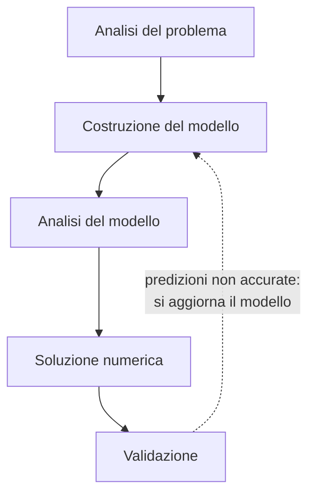

---

## corso: Ricerca Operativa lezione: 1 data: 2026-09-22 docente: Silvia Villa argomenti: [presentazione del corso, definizione di ricerca operativa, storia della ricerca operativa, approccio modellistico, modello matematico, esempio di Dantzig, problema di assegnamento, programmazione lineare intera] fonti: [trascrizione, appunti manuali, dispense] tags: [ricerca-operativa, lezione]

---

# Lezione 1 — Che cos'è la Ricerca Operativa

## Il corso in breve

Il corso è tenuto da Silvia Villa (Dipartimento di Matematica, si occupa di ottimizzazione per problemi di machine learning e intelligenza artificiale) insieme a Cesare Molinari, che terrà una decina di ore. Il programma si divide in due parti nettamente distinte. La **prima parte** è dedicata alla **programmazione lineare** e in particolare all'**algoritmo del simplesso**, a cui saranno dedicate molte lezioni (la docente parla di una ventina di ore): lo si studierà in dettaglio, cercando di capire perché funziona. La **seconda parte** riguarda la **programmazione non lineare**, con un'attenzione particolare agli **algoritmi del primo ordine**, cioè gli algoritmi più semplici, quelli che usano soltanto la derivata prima della funzione da ottimizzare.

La docente chiarisce subito lo spirito del corso, anche alla luce dei recenti successi dei modelli linguistici applicati alla matematica. L'obiettivo non è diventare esecutori rapidi di un algoritmo, così come a scuola non si impara l'algoritmo della divisione per eseguire a mano divisioni a sette cifre. L'obiettivo è **capire** come funziona l'algoritmo, perché restituisce la risposta giusta, se e come si può migliorare, quali domande porsi e come applicarlo. Le applicazioni viste a lezione saranno quindi "giocattolo", svolte alla lavagna, utili per capire più che per il loro interesse reale.

Per quanto riguarda l'esame: sarà **principalmente scritto**, con la possibilità che i docenti pongano anche domande orali (le modalità sono ancora da definire). L'esame è **identico** per gli studenti di Informatica e di Ingegneria Informatica. Poiché negli anni precedenti alcuni studenti hanno avuto difficoltà con gli strumenti di analisi in più variabili (in particolare il gradiente), che gli ingegneri hanno già visto in Analisi 2 ma non tutti gli informatici, il corso dedicherà una settimana all'introduzione di questi concetti. I temi d'esame degli anni passati sono disponibili su AulaWeb, ma vanno usati con cautela: gli esercizi di programmazione lineare restano rappresentativi, mentre quelli sulla seconda parte non lo sono più, perché quella parte del programma è cambiata.

Il materiale (calendario indicativo, dispense di programmazione lineare seguite piuttosto fedelmente nella prima metà del corso, un testo classico di ricerca operativa) è su AulaWeb; il materiale della seconda parte arriverà più avanti.

## Il nome e la definizione

"Ricerca operativa" è la traduzione letterale dell'inglese _Operational Research_ (uso britannico) o _Operations Research_ (uso statunitense). Come molte traduzioni letterali non è felicissima: il senso originario sarebbe piuttosto "ricerca _nelle_ operazioni", e più precisamente nelle **operazioni militari**, perché la disciplina nasce in quel contesto e ha una data di nascita abbastanza precisa (si veda più avanti). Esistono sinonimi che forse rendono meglio l'idea:

- **Management Science**, che ha il pregio di contenere la parola _scienza_: la ricerca operativa adotta un **metodo scientifico** per gestire una situazione;
- **Teoria delle decisioni**, che sottolinea il carattere di supporto teorico a scelte che vanno effettivamente prese.

Oggi la ricerca operativa è una disciplina matematica a pieno titolo (e in Italia anche un settore scientifico-disciplinare), ma nasce da problemi fortemente applicativi.

> [!important] Definizione — Ricerca Operativa 
> La ricerca operativa è la disciplina che studia lo **sviluppo** e l'**applicazione** di **metodi scientifici** per la **soluzione** di **problemi di decisione**.

Vale la pena soffermarsi sulle parole chiave della definizione.

L'oggetto di studio sono i **problemi di decisione**: le scelte che deve compiere un capoprogetto, chi gestisce gli ordini di un magazzino, chi organizza un servizio sanitario, e così via. Per risolverli si vogliono usare **metodi scientifici**, non il buon senso o l'esperienza. L'esempio della docente è quello di un supermercato che deve decidere quanti barattoli di pesto ordinare: non ci si vuole affidare alla persona che "sa" che intorno al 22 settembre se ne vendono un centinaio, ma a un procedimento scientifico.

Per **soluzione** si intende trovare una decisione che porti a una situazione migliore di quella di partenza, possibilmente la **soluzione ottima**, cioè la migliore possibile. In senso lato, poiché il metodo è scientifico, avere una soluzione significa anche poter **prevedere** che cosa accadrà in seguito alle proprie decisioni.

Infine, la definizione parla di **sviluppo** e di **applicazione**. Il processo è circolare: si parte da un'applicazione, si sviluppa un metodo scientifico e un metodo di soluzione, si supporta la decisione e si torna all'applicazione da cui si era partiti. In questo corso il termine "ricerca operativa" sarà usato in modo molto inclusivo, comprendendo tutti gli algoritmi che si occupano di ottimizzare, cioè di fornire soluzioni ottimizzate.

## Perché serve un approccio quantitativo

La ricerca operativa è nata piuttosto di recente, intorno alla metà del secolo scorso. Il passaggio da un'analisi qualitativa, fondata sul buon senso e sull'opinione di esperti del settore, a un **approccio quantitativo** ha certamente motivazioni culturali, ma soprattutto nasce da un cambiamento nella **struttura dei problemi di decisione**. I problemi di oggi presentano tre caratteristiche.

La prima è l'**alta dimensionalità**: le decisioni dipendono da moltissime variabili. Già il riordino del pesto dipende da molti fattori, ma l'esempio più eloquente è quello dei modelli linguistici di grandi dimensioni, il cui addestramento usa proprio algoritmi di ottimizzazione come quelli della seconda parte del corso. In quel caso le variabili sono i parametri del modello: per GPT-3 erano dell'ordine di $10^{11}$, e la docente riporta stime dell'ordine di $10^{14}$ parametri per i modelli più recenti. Si tratta di numeri che nessuno può gestire a mano.

La seconda è l'**alta complessità** strutturale: reti con enormi volumi di traffico, liste d'attesa in ambito sanitario e molte altre applicazioni in cui la difficoltà sta nella struttura stessa del problema.

La terza, conseguenza delle prime due, è che le **decisioni** stesse diventano **complesse**.

Affrontare un problema di decisione con un approccio quantitativo significa articolare il lavoro in due passi fondamentali, su cui il corso tornerà più volte:

1. lo **sviluppo del modello**, cioè la rappresentazione matematica del problema;
2. lo sviluppo di **algoritmi per la soluzione** del modello.

Lo sviluppo del modello è una delle fasi più delicate, perché **non esiste un procedimento sistematico** per costruirlo. Bisogna parlare con l'esperto e capire quali aspetti del problema reale sono superflui e quali sono essenziali per fare previsioni sensate. Se si includono tutti gli aspetti possibili si ottiene un modello molto fedele alla realtà, ma probabilmente impossibile da risolvere. Per costruire un modello utile bisogna aver compreso bene il problema; spesso però la comprensione arriva proprio risolvendo il modello. Si osserva la soluzione, ci si accorge di aver sbagliato qualcosa, si torna indietro e si raffina il modello, aggiungendo ciò che mancava o togliendo variabili ritenute importanti che non lo erano. Un modello non è mai una rappresentazione perfetta della realtà, ma deve permettere di prevedere qualcosa di simile a ciò che accadrà davvero. È quello che la fisica fa da secoli: se si trascura l'attrito dell'aria nella caduta di un gessetto si commette un errore piccolo, e si prevede comunque bene dove e in quanto tempo cadrà.

## Breve storia della ricerca operativa

La nascita della ricerca operativa è legata al **Regno Unito** negli anni immediatamente precedenti la Seconda guerra mondiale e a una tecnologia allora nuovissima, il **radar**. Nel **1936** viene fondata la **Bawdsey Research Station**, un centro di ricerca sulla costa orientale inglese che ha sede in un castello. Lì si conducono esperimenti per integrare le informazioni fornite dalle stazioni radar a terra con quelle dei piloti in volo, allo scopo di guidare gli aerei da terra. I primi esperimenti vanno male; si decide allora di aggiungere **quattro nuove stazioni radar**, e il problema diventa decidere **dove posizionarle**, con l'aiuto di matematici e ingegneri. Dal punto di vista tecnico le apparecchiature funzionavano bene; ciò che non funzionava era l'**integrazione delle informazioni** a supporto delle decisioni. In un rapporto del **1938** sugli esperimenti compare per la prima volta l'espressione _operational research_, intesa come disciplina di supporto alle decisioni. Un'esercitazione successiva mostra che, grazie a questo approccio scientifico, l'integrazione dei dati da terra permette una difesa aerea molto migliore. Nel **1941** nasce formalmente la **Operational Research Section**.

> [!warning] Discrepanza tra fonti — cronologia A lezione la docente ha avvertito che le date citate "non sono precise". Le dispense [@roma2023, §1.2], fonte più autorevole, danno una cronologia in parte diversa: primi esperimenti della Royal Air Force a Bawdsey nel **1937**; aggiunta di quattro stazioni radar lungo la costa nel **luglio 1938**; esercitazione pre-bellica con netto miglioramento della difesa aerea nell'**estate 1939** (a lezione si è detto 1940); nome formale di _Operational Research Section_ nel **1941**. Le dispense precisano anche che fu il sovrintendente della Bawdsey Research Station a proporre un programma di ricerca sugli aspetti _operativi_ (e non solo tecnici) del sistema. Su questi punti conviene seguire le dispense.

L'aspetto davvero innovativo della Operational Research Section era la sua **interdisciplinarità**: riuniva matematici, statistici e ingegneri, cosa per nulla scontata all'epoca. Oltre alla difesa aerea, il gruppo si occupava di problemi logistici, di approvvigionamento e in generale di gestione di **risorse scarse**: cibo, medicinali, persone. Il successo fu tale che approcci simili si diffusero in Canada e negli Stati Uniti; durante la guerra e negli anni immediatamente successivi questi gruppi interdisciplinari arrivarono a coinvolgere centinaia di studiosi (la docente cita un ordine di grandezza di 700 persone).

Finita la guerra, la ricerca operativa trova applicazione in **ambito civile**, negli ambiti che le sono oggi più tipici, e viene usata in modo simile a come era stata usata in contesto militare: per la gestione e l'utilizzo efficiente di risorse scarse. All'entusiasmo iniziale per metodi quantitativi in grado di risolvere "tutti" i problemi di gestione si oppone però un ostacolo concreto. Negli anni '40 e '50 i calcolatori stanno appena nascendo: i problemi crescono in complessità e numero di variabili, i metodi teorici e gli algoritmi arrivano prima o contemporaneamente ai calcolatori, ma manca la **potenza di calcolo**. L'entusiasmo cala, ma cresce una consapevolezza importante: non basta avere un modello e cercare di risolverlo "con la forza bruta", servono **algoritmi efficienti**. L'esempio che segue lo mostra in modo molto efficace.

## L'esempio di Dantzig: perché l'enumerazione non basta

George B. Dantzig (1914–2005), matematico statunitense, è l'inventore del **metodo del simplesso** (1947), su cui si concentrerà la prima parte del corso. Per far capire che problemi semplici da formulare possono diventare proibitivi da risolvere, usava questo esempio.

Un'azienda ha **70 lavoratori** e **70 lavori**. Si vuole assegnare a ogni lavoratore esattamente un lavoro, in modo che ogni lavoro sia svolto esattamente da un lavoratore. I lavoratori hanno competenze diverse; con un'ipotesi semplificativa, si suppone che ciascuno impieghi un **tempo diverso** per svolgere ciascun lavoro. Questi tempi sono raccolti in una tabella, con i lavoratori (risorse $R_i$) sulle righe e i lavori $L_j$ sulle colonne:

||$L_1$|$L_2$|$\dots$|$L_{70}$|
|---|---|---|---|---|
|$R_1$|$1$|$10$|$\dots$||
|$R_2$|$3$|$1$|$\dots$||
|$\vdots$|||||
|$R_{70}$|||||

Il lavoratore $R_1$, per esempio, è molto bravo nel lavoro $L_1$ (un'ora) ma lento nel lavoro $L_2$ (dieci ore). L'obiettivo è trovare un'assegnazione lavoratori–lavori che **minimizzi il tempo totale** di svolgimento di tutti i lavori.

Se i lavori e i lavoratori fossero solo due, basterebbe guardare la tabella: assegnando $L_1$ a $R_1$ e $L_2$ a $R_2$ si spendono $1+1=2$ ore, mentre l'alternativa costa $10+3=13$ ore. In sostanza si sono provate tutte le assegnazioni possibili e si è scelta la migliore: si è proceduto per **enumerazione**.

Quante sono le assegnazioni possibili con 70 lavoratori e 70 lavori? Al primo lavoratore si può assegnare uno qualsiasi dei 70 lavori. Fissato questo, al secondo ne restano 69, al terzo 68, e così via fino all'ultimo, che riceve l'unico lavoro rimasto. Il numero di assegnazioni è quindi

$$ 70 \cdot 69 \cdot 68 \cdots 2 \cdot 1 = 70! \approx 1.198 \times 10^{100}. $$

Per dare un'idea di quanto sia grande, Dantzig osservava che un calcolatore in grado di eseguire $10^6$ operazioni al secondo, acceso dal Big Bang a oggi, non avrebbe ancora finito di esaminarle tutte. Non ce la farebbe nemmeno un calcolatore che esamina $10^9$ assegnazioni **ogni nanosecondo**, e neppure ricoprendo la Terra di calcolatori di questo tipo. Il problema **non si può risolvere per enumerazione**. Servono metodi diversi, e il corso mostrerà che esistono.

> [!example] Verifica numerica (calcolo aggiunto, non svolto a lezione) Prendendo come età dell'universo circa $13.8$ miliardi di anni, cioè circa $4.4 \times 10^{17}$ secondi:
> 
> - a $10^6$ assegnazioni al secondo se ne esaminano circa $4.4 \times 10^{23}$;
> - a $10^9$ assegnazioni al nanosecondo, cioè $10^{18}$ al secondo, circa $4.4 \times 10^{35}$;
> - ricoprendo l'intera superficie terrestre (circa $5.1 \times 10^{14}\ \text{m}^2$) con un calcolatore di questo tipo per metro quadrato, circa $2.2 \times 10^{50}$.
> 
> Anche nell'ultimo caso mancano una cinquantina di ordini di grandezza per arrivare a $10^{100}$. Le dispense riportano l'esempio quasi negli stessi termini [@roma2023, §1.3]; la frase in cui datano il Big Bang a "15 milioni di anni fa" contiene un evidente refuso per _miliardi_.

> [!tip] Approfondimento — Le fonti dell'esempio di Dantzig #approfondimento A lezione la docente ha rimandato a un'intervista a Dantzig del 1986, reperibile online cercando "intervista Dantzig"; un'intervista di quell'anno ampiamente citata è quella di D. J. Albers e C. Reid sul _College Mathematics Journal_ [@albers1986]. Le dispense attribuiscono invece l'esempio dei 70 lavoratori all'articolo retrospettivo di Dantzig _Linear Programming_, pubblicato su _Operations Research_ nel 2002 [@dantzig2002]. Il problema dell'esempio, l'**assegnamento**, viene formalizzato alla fine di questa lezione.

## Le fasi dell'approccio modellistico

Il fatto che anche un problema "piccolo" (un'azienda con 70 dipendenti non è certo grande) sia irrisolvibile per enumerazione rende essenziale, ed è il cuore del corso, **sviluppare un modello** e trovare **algoritmi efficienti** per risolverlo, anche se non sempre sarà possibile. L'approccio quantitativo si articola in cinque fasi.



**Analisi del problema.** È la fase in cui si analizza la struttura del problema reale, e richiede il contatto con chi il problema lo conosce bene: l'utente finale, gli esperti del settore, chi ne conosce caratteristiche e criticità. È inutile mettersi a pianificare la gestione di un magazzino senza sapere quali sono le vendite. È anche la fase in cui si vede perché la ricerca operativa richiede competenze di settori diversi.

**Costruzione del modello** (o _formulazione_). Comincia la parte matematica. È una fase molto delicata per due motivi. Il primo è che non esistono ricette da seguire, e ciò che non si può ridurre a un procedimento algoritmico è sempre la parte più difficile. Il secondo è che vi agiscono due tensioni opposte: da un lato l'**accuratezza**, cioè il desiderio di una descrizione fedele della realtà; dall'altro la **semplicità**, cioè la capacità di cogliere gli elementi essenziali senza dimenticare quelli importanti.

**Analisi del modello.** Una volta costruito il modello, bisogna assicurarsi che abbia senso dal punto di vista matematico. Per esempio, deve ammettere una soluzione: un modello bellissimo in cui la soluzione non esiste è inutile, e sarà comunque molto difficile calcolarla. In questa fase si studiano anche le **caratterizzazioni** della soluzione, cioè proprietà che la soluzione deve avere. Un esempio tipico è che in un punto di minimo di una funzione derivabile la derivata si annulla. Le dispense elencano tra gli obiettivi di questa fase anche l'unicità della soluzione e la sua stabilità rispetto ai dati [@roma2023, §1.4].

**Soluzione numerica.** Solo a questo punto ci si occupa di calcolare effettivamente la soluzione, e la parola chiave è _numerica_. Al giorno d'oggi si è di fatto **rinunciato a risolvere i problemi in modo esatto**: ci si accontenta di **soluzioni approssimate**, calcolate con algoritmi. L'esempio della docente è volutamente elementare: un sistema lineare quadrato

$$ A x = b, \qquad A \in \mathbb{R}^{n \times n},\ x, b \in \mathbb{R}^n. $$

Se $A$ è invertibile la soluzione esiste, è unica ed è data dalla formula chiusa $x = A^{-1} b$. Siamo nel mondo ideale. Ma se $A$ ha dimensioni $10^6 \times 10^6$, la matrice $A^{-1}$ non si riesce nemmeno a tenere in memoria, e la formula, per quanto bella, non serve a calcolare la soluzione. Bisogna ricorrere a **metodi iterativi** che approssimano numericamente la soluzione. Anche nel modello più semplice che si possa immaginare, quindi, la soluzione in forma chiusa può non essere praticabile.

**Validazione.** Avere un modello matematico permette di calcolare una soluzione **senza metterla subito in pratica**. Se ne possono analizzare le caratteristiche, prevedere l'evoluzione del sistema (se è dinamico), simulare condizioni iniziali diverse o piccole variazioni dei dati per vedere se la soluzione è **stabile**. Se le predizioni non sono accurate, o non si ottiene ciò che ci si aspettava, si torna alla costruzione del modello, e magari a parlare con gli esperti, perché forse si è dimenticato qualcosa di fondamentale. Il ciclo si chiude.

Nel corso ci si concentrerà soprattutto sulla **costruzione del modello**, in parte sull'**analisi del modello** e sulla **soluzione numerica**.

## Il modello matematico: i tre ingredienti

I modelli della ricerca operativa sono **modelli astratti di tipo matematico** (non modelli concreti come un prototipo in scala). Descrivono un problema di decisione per mezzo di tre ingredienti.

**1. Le variabili.** Sono le incognite del problema, cioè le grandezze su cui si decide. Di solito sono associate a grandezze reali: quantità di prodotto, ore lavorate, numero di automobili prodotte. Possono avere natura diversa: **continue**, quando ha senso considerare anche valori come $1.5$ o $1.3$; **intere**, quando ciò non ha senso (non si produce mezza automobile).

**2. La funzione obiettivo.** Serve un criterio per stabilire se una configurazione delle variabili è una soluzione del problema, e per **confrontare** una scelta delle variabili con un'altra. Questo criterio è interamente espresso dalla funzione obiettivo, in cui si mette tutto ciò che interessa. Va **massimizzata** se rappresenta un guadagno, un benessere o la stima di un benessere; va **minimizzata** se rappresenta un costo.

**3. I vincoli.** Sono le restrizioni sulle scelte possibili delle variabili, cioè **relazioni tra le variabili**: negli esempi del corso, **equazioni** e **disequazioni**. Esprimono limitazioni concrete. Possono essere vincoli di budget (le materie prime non si possono acquistare in quantità infinita), di capacità (si vogliono produrre più pacchi di pasta possibile, ma le ore macchina e i lavoratori sono limitati) o vincoli fisici (la velocità non può superare un certo valore).

In termini formali, alla fine della lezione la docente scrive:

> [!important] Problema di ottimizzazione (forma generale) Siano
> 
> - $x \in X$ le **variabili**, dove $X$ è un insieme che per ora può essere qualunque (a seconda di come è fatto si distinguono classi diverse di problemi);
> - $f : X \to \mathbb{R}$ la **funzione obiettivo**, che a ogni scelta delle variabili associa un numero reale;
> - $S \subseteq X$ l'insieme dei punti che soddisfano i **vincoli**.
> 
> Il problema di ottimizzazione si scrive $$ \min_{x \in S} f(x) \qquad \text{oppure} \qquad \max_{x \in S} f(x), $$ a seconda che $f$ rappresenti un costo o un guadagno.

Tutta l'introduzione serve ad arrivare qui: partire da un problema reale ed esistente e arrivare a una formulazione di questo tipo. Quando si introducono le variabili è sempre bene **dichiarare esplicitamente che cosa rappresentano**. Le si può chiamare come si vuole (quasi sempre $x$), ma il loro significato va precisato.

## Vantaggi e limiti dell'approccio modellistico

Una volta formulato il problema in termini matematici si hanno molti **vantaggi**. Il primo è che dell'esperto non c'è più bisogno: entrano in campo informatici, ingegneri e matematici, che risolvono il problema in modo intelligente. Poi ci sono tutti i vantaggi tipici dell'approccio scientifico: una soluzione trovata in un contesto si può esportare in un altro, e un metodo sviluppato per un problema si può riusare per un altro. Si **comprende meglio** il problema, si possono studiare **proprietà** che senza modello non si sarebbero notate, e si possono fare **simulazioni**, utili eventualmente ad aggiornare il modello.

Ci sono però anche dei **limiti**. Non sempre i modelli sono risolvibili, ma questo, più che uno svantaggio, è "un fatto triste della vita". La critica più seria è la **difficoltà di quantificare** certe grandezze, rivolta in particolare ai modelli usati in economia o in ambito sociale. Come si quantifica il benessere di una persona o di una società (_social welfare_)? Quanto vale la vita di una persona? Eppure, se si stipula un'assicurazione, un numero bisogna mettercelo. Le dispense aggiungono una seconda critica: la qualità delle risposte di un modello può dipendere molto dall'**accuratezza dei dati** introdotti [@roma2023, §1.5.3]. È il problema che emerge anche in una domanda posta a lezione e discussa più avanti.

## Dove si usa la ricerca operativa

Le applicazioni **tradizionali** sono soprattutto in ambito industriale. L'elenco seguente riprende quello della lezione.

- **Problemi industriali**: pianificazione della produzione; gestione ottima delle risorse, per esempio dei magazzini; localizzazione degli impianti (se a Genova ci sono già molti panifici e se ne deve aprire uno nuovo, dove conviene metterlo, supponendo una pianificazione dall'alto?).
- **Progettazione**: progettazione di reti (stradali, di telecomunicazione, elettriche); progettazione strutturale, per esempio di un'ala d'aereo che massimizzi una certa prestazione.
- **Organizzazione**: turni del personale; gestione di progetti (_project planning_); manutenzione dei beni, cioè prevedere quando un componente sta per guastarsi; instradamento dei veicoli e problemi di traffico; gestione delle **liste d'attesa**, soprattutto in ambito sanitario; localizzazione delle ambulanze (dove conviene posizionarle e come organizzare il sistema di soccorso, oggi il 112, per minimizzare il tempo di intervento).
- **Problemi scientifici**: diagnostica per immagini (ecografie, tomografie, TAC).

I **temi più attuali** sono tre. Il primo è l'**intelligenza artificiale**, e in particolare il suo nocciolo matematico e informatico, il _machine learning_. Il secondo sono i **mercati dell'energia**: il prezzo viene aggiornato molto spesso (secondo la docente, se ricorda bene, giornalmente a livello europeo), quindi per i produttori è complesso decidere quanto e quando produrre e quando vendere. Il terzo è la **logistica**: catene di approvvigionamento (_supply chain_), consegne di "ultimo miglio" (_last-mile delivery_), consegne con droni, _bike sharing_, trasporto pubblico. Anche in Italia c'è un gruppo di ricerca piuttosto grande che lavora su questi temi.

La ricerca operativa è trasversale a molte discipline, al punto che diversi studiosi che possiamo considerare "ricercatori operativi" hanno vinto il premio Nobel per l'economia: Markowitz (teoria del portafoglio, cioè come comporre gli investimenti), Nash, Shapley (teoria dei giochi, peso di una coalizione all'interno di coalizioni più grandi, per esempio politiche), Aumann (teoria dei giochi), Roth e, fra i più antichi, Kantorovich, che si è occupato di trasporto e di programmazione lineare. Di Roth la docente cita il lavoro sul _design_ di meccanismi di incentivo, cioè su come costruire le regole perché le persone facciano spontaneamente ciò che è desiderabile per il benessere sociale. L'esempio banale è la multa per divieto di sosta: nessuno deve sorvegliare chi parcheggia, perché è la prospettiva della multa a scoraggiare il comportamento.

> [!tip] Approfondimento — I premi Nobel citati a lezione #approfondimento Anni e motivazioni ufficiali dei premi (Premio della Banca di Svezia per le scienze economiche in memoria di Alfred Nobel), secondo [nobelprize.org](https://www.nobelprize.org/):
> 
> |Anno|Laureati|Motivazione (in sintesi)|
> |---|---|---|
> |1975|L. V. Kantorovich, T. C. Koopmans|contributi alla teoria dell'allocazione ottima delle risorse|
> |1990|H. Markowitz, M. Miller, W. Sharpe|lavori pionieristici sulla teoria dell'economia finanziaria|
> |1994|J. Harsanyi, J. Nash, R. Selten|analisi degli equilibri nella teoria dei giochi non cooperativi|
> |2005|R. Aumann, T. Schelling|comprensione di conflitto e cooperazione tramite la teoria dei giochi|
> |2012|A. Roth, L. Shapley|teoria delle allocazioni stabili e pratica del _market design_|
> 
> Una precisazione terminologica: il premio di Roth e Shapley riguarda il _market design_, cioè la progettazione di "mercati" in cui le assegnazioni si fanno tramite regole di abbinamento anziché tramite prezzi. Il _mechanism design_ in senso stretto è stato premiato separatamente nel 2007 (Hurwicz, Maskin, Myerson). Kantorovich è citato anche dalle dispense come precursore della programmazione lineare, con una monografia del 1939 rimasta a lungo ignorata in Occidente [@roma2023, §4.1].

> [!tip] Approfondimento — Il rapporto sulle _Grand Challenges_ #approfondimento La docente ha segnalato un rapporto per l'agenzia di ricerca statunitense sulle grandi sfide della ricerca operativa (da cercare come "OR Grand Challenges"). Si tratta del rapporto alla National Science Foundation _Operations Research – A Catalyst for Engineering Grand Challenges_, redatto da un comitato coordinato da Suvrajeet Sen (University of Southern California). Il rapporto è stato diffuso nel 2014 e ripreso nel 2015–2016 da una serie di articoli su _OR/MS Today_ [@morton2016]; la docente lo data al 2015. Prende come riferimento le _Grand Challenges for Engineering_ della National Academy of Engineering e individua come aree la ricerca operativa per la **sostenibilità**, la **sicurezza**, la **salute umana** e la _joy of living_ (la qualità della vita), oltre alla ricerca operativa come teoria generale dell'analisi dei dati (_analytics_). Secondo la docente gran parte dei problemi delineati nel rapporto è ancora aperta.

## Primo modello — il problema di assegnamento

Si torna ora all'esempio di Dantzig per scriverlo nella forma $\min_{x \in S} f(x)$, individuando variabili, vincoli e funzione obiettivo. Come spesso accade, non esiste un'unica descrizione possibile. Ciò che serve sapere è **se un dato lavoratore svolgerà un dato lavoro oppure no**, quindi serve una variabile che dipende **sia dal lavoratore sia dal lavoro**.

### Variabili

Per ogni $i = 1, \dots, 70$ (lavoratori) e per ogni $j = 1, \dots, 70$ (lavori) si definisce la variabile

$$ x_{ij} = \begin{cases} 1 & \text{se il lavoratore } R_i \text{ svolge il lavoro } L_j,\ 0 & \text{altrimenti.} \end{cases} $$

Le variabili sono tutte le possibili coppie $(i,j)$, cioè $70^2 = 4900$. Per un problema di ottimizzazione non sono tantissime. Si possono immaginare disposte in una tabella con la stessa struttura di quella dei tempi: righe per i lavoratori, colonne per i lavori, e in ogni casella uno $0$ o un $1$. Il fatto che ogni $x_{ij}$ valga $0$ oppure $1$ è già un primo vincolo, incluso nella definizione: $x_{ij} \in {0, 1}$.

### Vincoli

**Ogni lavoro deve essere svolto esattamente da un lavoratore.** Fissato il lavoro $j$, cioè una colonna della tabella, tra le variabili di quella colonna deve esserci un solo $1$ e tutti gli altri valori devono essere $0$. Per esempio, se nella colonna di $L_1$ l'unico $1$ si trova nella riga di $R_{69}$, il lavoro 1 è svolto dal lavoratore 69. Poiché le variabili valgono $0$ o $1$, questa condizione equivale a chiedere che la **somma della colonna** sia esattamente $1$:

$$ \sum_{i=1}^{70} x_{ij} = 1 \qquad \forall, j = 1, \dots, 70. $$

**Ogni lavoratore deve svolgere esattamente un lavoro.** Lo stesso ragionamento sulle righe dà

$$ \sum_{j=1}^{70} x_{ij} = 1 \qquad \forall, i = 1, \dots, 70. $$

Questi vincoli descrivono esattamente tutte le **assegnazioni ammissibili**, che sono $70!$.

### Funzione obiettivo

Sia $c_{ij}$ il tempo impiegato dal lavoratore $i$ per svolgere il lavoro $j$ (un dato del problema). Si fissa il lavoratore $i$. Delle variabili $x_{i1}, \dots, x_{i,70}$ una sola vale $1$, quella del lavoro che gli è stato assegnato. Quindi

$$ \sum_{j=1}^{70} c_{ij}, x_{ij} $$

è esattamente il tempo che il lavoratore $i$ impiega per il lavoro che gli è stato assegnato: tutti gli altri addendi sono nulli. Sommando su tutti i lavoratori si ottiene il **tempo totale** necessario a svolgere tutti i lavori, che è la quantità da minimizzare.

### Il modello completo

> [!important] Modello del problema di assegnamento (70 lavoratori, 70 lavori) $$ \begin{aligned} \min \quad & \sum_{i=1}^{70} \sum_{j=1}^{70} c_{ij}, x_{ij} \ \text{s.t.} \quad & \sum_{i=1}^{70} x_{ij} = 1 && \forall, j = 1, \dots, 70 \ & \sum_{j=1}^{70} x_{ij} = 1 && \forall, i = 1, \dots, 70 \ & x_{ij} \in {0, 1} && \forall, i, j = 1, \dots, 70 \end{aligned} $$ L'**insieme ammissibile**, cioè l'insieme dei punti che soddisfano tutti i vincoli, è $$ S = \Big{ x = (x_{ij}) : x_{ij} \in {0,1},\ \sum_{i=1}^{70} x_{ij} = 1\ \forall j,\ \sum_{j=1}^{70} x_{ij} = 1\ \forall i \Big}. $$

Durante la lezione uno studente ha chiesto come si tengano in conto altri vincoli, per esempio un lavoratore che non può svolgere un certo lavoro. La risposta è che informazioni di questo tipo sono contenute nei **dati del problema**, i tempi $c_{ij}$, che si suppongono assegnati e corretti. La docente ha però sottolineato che la domanda tocca un problema reale: se chi ha compilato la tabella ha commesso un errore (per esempio un tempo negativo), che cosa succede al modello? Domande di questo tipo emergono continuamente quando si analizzano grandi quantità di dati.

### Classificazione del modello

Il nome di un modello dipende dalla struttura della funzione obiettivo e dei vincoli e dal tipo di variabili.

- Le variabili compaiono sempre **al primo grado**, sia nei vincoli sia nella funzione obiettivo (non ci sono termini come $x_{ij}^2$): funzione obiettivo e vincoli sono **lineari**. Si parla quindi di **programmazione lineare**.
- Le variabili non possono assumere valori frazionari, ma solo i valori $0$ o $1$: si tratta di **programmazione intera**, e più precisamente le variabili sono **binarie**.

Il problema di assegnamento è dunque un problema di **programmazione lineare intera** (con variabili binarie). Il termine "programmazione", come si vedrà nella lezione successiva, va inteso nel senso di _pianificazione_.

> [!tip] Approfondimento — Il problema di assegnamento si può risolvere in modo efficiente #approfondimento A lezione la docente ha lasciato aperta la domanda: "vedremo se ci sono altri metodi". Due fatti, in parte anticipati dalle dispense, mostrano che la risposta è positiva.
> 
> **Il vincolo di interezza si può rilassare.** Le dispense [@roma2023, Oss. 8.2.2] osservano che il problema di assegnamento ha la stessa struttura di un problema di trasporto (si veda la lezione 3) con tante origini quante destinazioni e con tutte le disponibilità e le richieste pari a $1$. Per i problemi di trasporto con dati interi vale un teorema di interezza: se esiste una soluzione ottima, ne esiste una a componenti intere [@roma2023, Teorema 3.4.2]. Di conseguenza il vincolo $x_{ij} \in {0,1}$ si può sostituire con il semplice $x_{ij} \ge 0$, ottenendo un problema di **programmazione lineare continua** che ammette comunque una soluzione ottima a componenti $0$–$1$. Problemi di questo tipo si risolvono con il metodo del simplesso.
> 
> **Esiste un algoritmo specifico.** Il _metodo ungherese_, pubblicato da H. W. Kuhn nel 1955 [@kuhn1955] e così chiamato perché basato su lavori dei matematici ungheresi Kőnig ed Egerváry, risolve il problema di assegnamento con un numero di operazioni che cresce in modo polinomiale con $n$ (nelle versioni successive dell'algoritmo, come $n^3$).
> 
> Il grafico mostra la differenza tra le due strategie in termini di numero di cifre, cioè $\log_{10}$ del numero di operazioni: per $n = 70$ l'enumerazione richiede circa $10^{100}$ casi, un algoritmo che ne richiede $n^3$ circa $3.4 \times 10^5$ operazioni.
> 
> ```chart
> type: line
> labels: [10, 20, 30, 40, 50, 60, 70]
> series:
>   - title: "log10(n!) — enumerazione"
>     data: [6.56, 18.39, 32.42, 47.91, 64.48, 81.92, 100.08]
>   - title: "log10(n^3) — algoritmo polinomiale"
>     data: [3.00, 3.90, 4.43, 4.81, 5.10, 5.33, 5.54]
> tension: 0.2
> width: 80%
> labelColors: false
> fill: false
> beginAtZero: true
> ```

## Riepilogo

- La ricerca operativa studia lo sviluppo e l'applicazione di metodi scientifici per la soluzione di problemi di decisione. Nasce in ambito militare nel Regno Unito alla fine degli anni '30 (radar, Bawdsey) e si diffonde poi in ambito civile.
- I problemi di decisione moderni sono ad alta dimensionalità e complessità; l'esempio di Dantzig ($70! \approx 10^{100}$ assegnazioni) mostra che l'enumerazione è impraticabile anche per problemi piccoli e che servono **modelli** e **algoritmi efficienti**.
- L'approccio modellistico ha cinque fasi: analisi del problema, costruzione del modello, analisi del modello, soluzione numerica, validazione (con ritorno alla costruzione).
- Un modello di ottimizzazione ha tre ingredienti: **variabili** $x \in X$, **funzione obiettivo** $f: X \to \mathbb{R}$, **vincoli** che definiscono $S \subseteq X$; il problema è $\min_{x \in S} f(x)$ oppure $\max_{x \in S} f(x)$.
- Il problema di assegnamento si modella con variabili binarie $x_{ij}$, vincoli di somma uguale a $1$ su righe e colonne e funzione obiettivo $\sum_{i,j} c_{ij} x_{ij}$: è un problema di **programmazione lineare intera**.