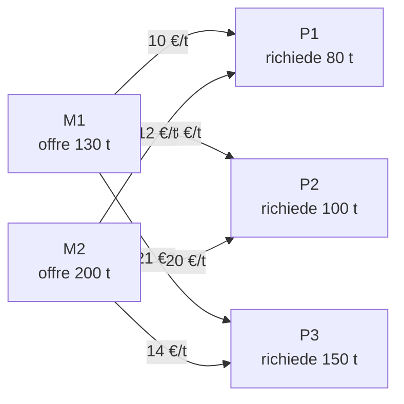

---

## corso: Ricerca Operativa lezione: 3 data: 2026-09-29 docente: Cesare Molinari argomenti: [problemi di miscelazione, vincolo ridondante, forma matriciale, rette e semipiani, curve di livello, risoluzione grafica, vertici, vincoli attivi, problemi di trasporto, allocazione ottima di risorse] fonti: [appunti manuali, dispense] tags: [ricerca-operativa, lezione]

---

# Lezione 3 — Miscelazione, trasporto e risoluzione grafica

> [!warning] Fonti di questa nota — trascrizione assente Per questa lezione (29/09/2026, prof. Cesare Molinari) **non è disponibile la trascrizione**. La nota si basa su due fonti: gli **appunti manuali** (scansione della lezione 3 e nota Obsidian _Miniere_; la nota _Trasporto_ è vuota) e le **dispense** [@roma2023], che riportano gli stessi esempi con gli stessi dati (Esempi 3.4.1, 3.4.12, 3.4.17) e ne svolgono la risoluzione grafica nel capitolo 4. Secondo la gerarchia delle fonti, dove le due fonti differiscono valgono le dispense, e le discrepanze sono segnalate. L'esposizione discorsiva è ricostruita a partire da queste fonti. Sono indicati esplicitamente i contenuti che vengono **solo** dalle dispense (e quindi potrebbero non essere stati trattati a lezione) e i calcoli aggiunti per verifica.

## Programma della lezione

La lezione riprende la **programmazione lineare** con tre classi di modelli:

1. **allocazione ottima di risorse scarse**, con la risoluzione grafica svolta alla fine della lezione;
2. **miscelazione**, cioè il problema dei succhi di frutta lasciato come esercizio nella lezione precedente: modello e risoluzione grafica;
3. **trasporto**: solo il modello.

Le tre classi sono le stesse con cui le dispense organizzano i modelli di programmazione lineare [@roma2023, §3.4]. Nei modelli di allocazione le risorse vanno **ripartite** tra usi in competizione; nei modelli di miscelazione le risorse vanno **combinate** tra loro per ottenere un prodotto con certi requisiti; nei modelli di trasporto bisogna pianificare lo spostamento di merce da località di origine a località di destinazione.

## Il modello del problema di miscelazione

Si riprendono i dati della [[Lezione 02 - Modelli di programmazione matematica#Problemi di miscelazione — impostazione|lezione 2]]. Un succo si ottiene miscelando **polpa** ($P$) e **dolcificante** ($D$), che costano rispettivamente $4$ €/hg e $6$ €/hg. Il contenuto per ettogrammo è:

||$P$|$D$|
|---|---|---|
|vitamina C|$140\ \text{mg}$|$0\ \text{mg}$|
|sali minerali|$20\ \text{mg}$|$10\ \text{mg}$|
|zuccheri|$25\ \text{g}$|$50\ \text{g}$|

I **requisiti minimi** del succo sono: almeno $70\ \text{mg}$ di vitamina C, almeno $30\ \text{mg}$ di sali minerali, almeno $75\ \text{g}$ di zucchero.

**Variabili.**

$$ x_1 = \text{ettogrammi di polpa}, \qquad x_2 = \text{ettogrammi di dolcificante}. $$

**Funzione obiettivo.** Il costo d'acquisto dei due componenti, in euro, da **minimizzare**:

$$ f(x_1, x_2) = 4x_1 + 6x_2 . $$

Le dispense esprimono lo stesso costo in centesimi, $400x_1 + 600x_2$. Il problema è lo stesso: moltiplicare la funzione obiettivo per una costante positiva non cambia il punto di ottimo.

**Vincoli.** Un ettogrammo di polpa contiene $140$ mg di vitamina C e il dolcificante non ne contiene, quindi il contenuto di vitamina C del succo è $140x_1$, che deve essere almeno $70$. Allo stesso modo si scrivono i vincoli su sali e zuccheri, e poi i vincoli di non negatività:

$$ \begin{cases} 140,x_1 \ge 70 & \text{(vitamina C)} \ 20,x_1 + 10,x_2 \ge 30 & \text{(sali minerali)} \ 25,x_1 + 50,x_2 \ge 75 & \text{(zuccheri)} \ x_1 \ge 0,\ x_2 \ge 0 \end{cases} $$

### Un vincolo ridondante

> [!important] Osservazione — $x_1 \ge 0$ è ridondante 
> Dal primo vincolo, $140x_1 \ge 70$, segue $x_1 \ge \tfrac{1}{2}$, che è più restrittivo di $x_1 \ge 0$. Ogni punto che soddisfa il primo vincolo soddisfa automaticamente anche $x_1 \ge 0$: eliminando il vincolo di non negatività su $x_1$ l'insieme ammissibile non cambia. Il vincolo è quindi **ridondante**, secondo la definizione data nella lezione 2.

### Forma matriciale

Come per l'allocazione di risorse, il modello si può scrivere in forma compatta. Qui il problema è di **minimo** e i vincoli sono di tipo "$\ge$", cioè nella forma $g(x) \ge b$ adottata come standard nella lezione 2:

$$ \min_{x_1, x_2} f(x_1, x_2) \quad \text{s.t.} \quad A x \ge b, \qquad A = \begin{pmatrix} 140 & 0 \ 20 & 10 \ 25 & 50 \ 0 & 1 \end{pmatrix}, \quad b = \begin{pmatrix} 70 \ 30 \ 75 \ 0 \end{pmatrix}. $$

Le prime tre righe di $A$ sono i vincoli di qualità; l'ultima riga, $(0, 1)$ con termine noto $0$, è il vincolo $x_2 \ge 0$. Negli appunti compariva anche la riga $(1, 0)$ con termine noto $0$, cioè $x_1 \ge 0$, poi cancellata proprio perché ridondante. La funzione obiettivo si scrive $c^T x$ con $c = (4, 6)^T$.

> [!note] Formulazione generale della miscelazione (dalle dispense) Le dispense generalizzano il modello [@roma2023, §3.4.2]. Si hanno $n$ sostanze $S_1, \dots, S_n$ con costi unitari $c_1, \dots, c_n$, e $m$ componenti utili $C_1, \dots, C_m$. Sia $a_{ij}$ la quantità di componente $C_i$ contenuta in un'unità di sostanza $S_j$, e $b_i$ la quantità minima di $C_i$ richiesta nella miscela. Con $x_j$ = quantità di sostanza $S_j$ usata, il problema è $$ \min\ c^T x \qquad \text{s.t.} \quad A x \ge b, \quad x \ge 0 . $$ Rispetto all'allocazione ($\max, c^T x$, $Ax \le b$) si invertono sia il verso dell'ottimizzazione (si minimizza un costo) sia il verso dei vincoli (requisiti minimi anziché disponibilità massime). Eventuali requisiti massimi su un componente si aggiungono come vincoli $\sum_j a_{ij} x_j \le d_i$.

## Breve parentesi: rette, semipiani e direzione di crescita

Per risolvere graficamente un problema in due variabili serve un po' di geometria di rette e semipiani nel piano $\mathbb{R}^2$.

L'equazione

$$ a_1 x_1 + a_2 x_2 = b $$

rappresenta una **retta**, che divide il piano in due **semipiani**. La disequazione

$$ a_1 x_1 + a_2 x_2 \ge b $$

individua uno dei due **semipiani chiusi**, retta compresa (chiuso perché la disuguaglianza non è stretta). Ogni vincolo lineare in due variabili individua quindi un semipiano, e l'insieme ammissibile è l'**intersezione** dei semipiani di tutti i vincoli. In $\mathbb{R}^n$ le stesse equazioni $a^T x = b$ descrivono **iperpiani** e le disequazioni $a^T x \ge b$ semispazi, ma nel piano l'intuizione geometrica è immediata.

Il ruolo chiave è svolto dal vettore dei coefficienti

$$ a = \begin{pmatrix} a_1 \ a_2 \end{pmatrix}. $$

Al variare di $b$, le rette $a_1x_1 + a_2x_2 = b$ formano una **famiglia di rette parallele**. Il vettore $a$ è **ortogonale** a tutte queste rette ed è **orientato verso le rette con valori di $b$ crescenti**, cioè verso il semipiano $a_1 x_1 + a_2 x_2 \ge b$.

> [!important] Lemma (dispense, Lemma 4.3.1) 
> Data la famiglia di rette parallele $a^T x = b$, con $a \in \mathbb{R}^2$ fissato e $b \in \mathbb{R}$, il vettore $a$ è ortogonale alle rette della famiglia ed è orientato dalla parte in cui si trovano le rette con valori di $b$ crescenti, cioè verso il semipiano $a^T x \ge b$.
> 
> _Dimostrazione_ [@roma2023, Lemma 4.3.1]. Siano $\bar x, \bar z$ due punti della retta $a^T x = b$. Sottraendo $a^T \bar z = b$ e $a^T \bar x = b$ si ottiene $a^T(\bar z - \bar x) = 0$: il vettore $a$ è ortogonale a $\bar z - \bar x$, che dà la direzione della retta. Sia ora $\bar y$ un punto con $a^T \bar y \ge b$. Allora $a^T(\bar y - \bar x) \ge 0$: l'angolo tra $a$ e $\bar y - \bar x$ è acuto (o retto), quindi $a$ punta verso il semipiano che contiene $\bar y$.

Un modo pratico per capire quale semipiano corrisponde a una disequazione è sceglierne un punto di prova, di solito l'origine, e valutarvi $a_1x_1 + a_2x_2$. Se il valore soddisfa la disequazione, il semipiano è quello che contiene il punto; altrimenti è l'altro.

Lo stesso fatto si legge in termini di funzioni. Se si considera

$$ g(x_1, x_2) = a_1 x_1 + a_2 x_2, $$

le rette $a_1x_1 + a_2x_2 = b$ sono le sue **curve di livello**, cioè gli insiemi in cui $g$ assume il valore costante $b$. Il vettore $a$ indica la **direzione di (massima) crescita** di $g$: spostandosi nel verso di $a$ si passa a rette di livello con valore più alto, mentre nel verso opposto, $-a$, $g$ decresce. Per una funzione obiettivo lineare $c_1x_1 + c_2x_2$ si ha quindi:

- in un problema di **massimo** si traslano le rette di livello nel verso di $c$;
- in un problema di **minimo** si traslano nel verso di $-c$.

> [!tip] Approfondimento — Perché "massima" crescita #approfondimento 
> Il fatto che $a$ sia la direzione di crescita _più rapida_ si dimostra con la disuguaglianza di Cauchy–Schwarz. Spostandosi da un punto $x$ nella direzione di un vettore unitario $d$ ($|d| = 1$) per un passo $t > 0$, la funzione lineare varia di $$ g(x + t d) - g(x) = t, a^T d \le t, |a|, |d| = t, |a|, $$ con uguaglianza se e solo se $d = a / |a|$. Tra tutte le direzioni unitarie, quella di $a$ produce quindi l'aumento maggiore. In termini di analisi in più variabili, che il corso richiamerà più avanti, $a$ è il **gradiente** di $g$: $\nabla g(x) = a$ in ogni punto. Il gradiente indica sempre la direzione di massima crescita di una funzione differenziabile, ed è proprio questa proprietà che sfruttano gli algoritmi del primo ordine della seconda parte del corso.

> [!tip] Schema da disegnare Negli appunti c'è uno schizzo di tre rette parallele $a_1x_1 + a_2x_2 = b$ nel primo quadrante, con il vettore $a$ disegnato perpendicolare a una di esse e rivolto verso le rette con $b$ maggiore. Vale la pena rifarlo in Excalidraw, perché è la figura su cui si basa tutta la risoluzione grafica.

## Risoluzione grafica del problema di miscelazione

Dividendo ogni vincolo per un fattore comune (operazione che non cambia l'insieme dei punti che lo soddisfano) ed eliminando il vincolo ridondante $x_1 \ge 0$, il problema diventa

$$ \begin{aligned} \min \quad & 4x_1 + 6x_2 \ \text{s.t.} \quad & x_1 \ge \tfrac{1}{2} \ & 2x_1 + x_2 \ge 3 \ & x_1 + 2x_2 \ge 3 \ & x_2 \ge 0 \end{aligned} $$

### L'insieme ammissibile

Ogni vincolo individua un semipiano delimitato da una retta:

|vincolo|retta di bordo|intersezioni con gli assi|semipiano ammissibile|
|---|---|---|---|
|$x_1 \ge \tfrac12$|$x_1 = \tfrac12$ (verticale)|$(\tfrac12, 0)$|a destra della retta|
|$2x_1 + x_2 \ge 3$|$2x_1 + x_2 = 3$|$(0, 3)$ e $(\tfrac32, 0)$|dalla parte opposta all'origine|
|$x_1 + 2x_2 \ge 3$|$x_1 + 2x_2 = 3$|$(0, \tfrac32)$ e $(3, 0)$|dalla parte opposta all'origine|
|$x_2 \ge 0$|asse $x_1$|—|sopra l'asse|

Per gli ultimi due vincoli il test dell'origine dà $0 \ge 3$, che è falso: il semipiano ammissibile è quello che non contiene l'origine.

L'insieme ammissibile $S$ è l'intersezione di questi semipiani: una regione **illimitata** che si estende verso l'alto e verso destra, a differenza di quella che si vedrà per il problema di allocazione. Partendo dall'alto, il suo bordo è formato da:

- la semiretta verticale $x_1 = \tfrac12$ per $x_2 \ge 2$;
- il segmento della retta $2x_1 + x_2 = 3$ tra $A$ e $B$;
- il segmento della retta $x_1 + 2x_2 = 3$ tra $B$ e $C$;
- la semiretta $x_2 = 0$ per $x_1 \ge 3$.

I **vertici** del bordo si trovano intersecando a due a due le rette che si incontrano:

$$ \begin{aligned} A &: \begin{cases} x_1 = \tfrac12 \ 2x_1 + x_2 = 3 \end{cases} \Rightarrow A = \left(\tfrac12,\ 2\right), \[4pt] B &: \begin{cases} 2x_1 + x_2 = 3 \ x_1 + 2x_2 = 3 \end{cases} \Rightarrow B = (1,\ 1), \[4pt] C &: \begin{cases} x_1 + 2x_2 = 3 \ x_2 = 0 \end{cases} \Rightarrow C = (3,\ 0). \end{aligned} $$

Per $B$ basta sottrarre le due equazioni, ottenendo $x_1 - x_2 = 0$, cioè $x_1 = x_2$, e poi sostituire: $3x_1 = 3$.

> [!note] Sul disegno negli appunti Negli appunti scansionati, accanto al grafico della regione ammissibile, è annotato che il grafico "non è accurato" e contiene un errore. Le coordinate esatte sono quelle riportate sopra; la figura corretta è anche nelle dispense [@roma2023, Figg. 4.3.13 e 4.3.14].

### Le curve di livello e la soluzione ottima

Le curve di livello della funzione obiettivo sono le rette parallele

$$ 4x_1 + 6x_2 = k, \qquad k \in \mathbb{R}. $$

Il vettore $c = (4, 6)^T$ è la direzione di crescita del costo. Poiché si **minimizza**, si traslano le rette di livello nel verso di $-c$, cioè verso l'origine, finché continuano a intersecare $S$. L'ultimo punto di $S$ toccato è il vertice $B = (1, 1)$, dove

$$ f(1, 1) = 4 + 6 = 10 . $$

> [!example] Verifica sui vertici (valori calcolati per controllo)
> 
> |vertice|$(x_1, x_2)$|$f = 4x_1 + 6x_2$|
> |---|---|---|
> |$A$|$(\tfrac12, 2)$|$2 + 12 = 14$|
> |$B$|$(1, 1)$|$4 + 6 = \mathbf{10}$|
> |$C$|$(3, 0)$|$12 + 0 = 12$|
> 
> Il valore più basso tra i vertici è in $B$, coerente con la costruzione grafica. Che basti guardare i vertici non è ovvio, ed è proprio ciò che il corso dimostrerà (si veda l'ultima sezione).

> [!important] Soluzione del problema di miscelazione La soluzione ottima è $x^\star = (1, 1)$: si usano **1 hg di polpa** e **1 hg di dolcificante**, con un costo minimo di **10 €** (1000 centesimi nelle dispense). Il succo ottenuto contiene:
> 
> - $140\ \text{mg}$ di vitamina C, più dei $70$ richiesti: il vincolo è soddisfatto ma **non attivo**;
> - $20 + 10 = 30\ \text{mg}$ di sali minerali, esattamente il minimo: vincolo **attivo**;
> - $25 + 50 = 75\ \text{g}$ di zuccheri, esattamente il minimo: vincolo **attivo**.

Ha senso che i vincoli attivi siano proprio quelli delle due rette che si incrociano in $B$: nel punto di ottimo i requisiti su sali e zuccheri sono soddisfatti "al limite", mentre quello sulla vitamina C ha margine.

> [!tip] Approfondimento — Un certificato di ottimalità #approfondimento C'è un modo per convincersi, senza disegno, che nessun punto di $S$ costa meno di 10. Si scrive la funzione obiettivo come combinazione a coefficienti **non negativi** dei due vincoli attivi: $$ 4x_1 + 6x_2 = \tfrac{2}{3},(2x_1 + x_2) + \tfrac{8}{3},(x_1 + 2x_2). $$ Per ogni $x \in S$ si ha $2x_1 + x_2 \ge 3$ e $x_1 + 2x_2 \ge 3$, quindi $$ 4x_1 + 6x_2 \ge \tfrac{2}{3} \cdot 3 + \tfrac{8}{3} \cdot 3 = 10, $$ e il valore $10$ è raggiunto in $B$. I moltiplicatori $\tfrac23$ e $\tfrac83$ non sono casuali: sono un'anticipazione della **teoria della dualità**, che le dispense trattano nel capitolo 7 [@roma2023, cap. 7]. Il ragionamento è aggiunto qui per verifica e non risulta dagli appunti della lezione.

> [!tip] Schema da disegnare Figura consigliata in Excalidraw: assi $x_1, x_2$ tra $0$ e $4$; la retta verticale $x_1 = \tfrac12$; la retta per $(0,3)$ e $(\tfrac32, 0)$; la retta per $(0, \tfrac32)$ e $(3,0)$; la regione illimitata in alto a destra, con bordo $A$–$B$–$C$; le rette di livello $4x_1 + 6x_2 = 10$ (passante per $B$, tangente alla regione) e $4x_1 + 6x_2 = 14$ (passante per $A$); il vettore $-c$ che punta verso l'origine.

## Il modello di trasporto

Nei **problemi di trasporto** ci sono alcune località di **origine**, ciascuna con una quantità fissata di merce disponibile, e alcune località di **destinazione**, ciascuna con una richiesta precisa. Noto il costo unitario di trasporto da ogni origine a ogni destinazione, bisogna pianificare quanta merce spedire lungo ogni collegamento in modo da soddisfare le richieste **minimizzando il costo complessivo** [@roma2023, §3.4.3].

### L'esempio delle miniere

Un'industria dell'acciaio dispone di **due miniere** $M_1, M_2$ e di **tre impianti di produzione** $P_1, P_2, P_3$. Ogni giorno:

- le miniere producono $M_1$: $130$ t e $M_2$: $200$ t di minerale;
- gli impianti richiedono $P_1$: $80$ t, $P_2$: $100$ t, $P_3$: $150$ t.

Il costo (in euro) del trasporto di una tonnellata da ciascuna miniera a ciascun impianto è:

|€/t|$P_1$|$P_2$|$P_3$|
|---|---|---|---|
|$M_1$|$10$|$8$|$21$|
|$M_2$|$12$|$20$|$14$|

La struttura del problema è quella di un grafo con le **origini** da una parte e le **destinazioni** dall'altra; ogni arco è un possibile collegamento, etichettato con il suo costo unitario. Negli appunti questa struttura è schizzata come un grafo con due nodi "origini" e tre nodi "destinazioni".

**Variabili.** Una variabile per ogni arco del grafo:

$$ x_{ij} = \text{tonnellate di minerale trasportate ogni giorno dalla miniera } M_i \text{ all'impianto } P_j, \qquad i = 1, 2,\ j = 1, 2, 3 . $$

Le variabili sono sei. Negli appunti erano state inizialmente numerate con un solo indice, $x_1, \dots, x_6$ (per esempio $x_1$ per il collegamento $M_1 \to P_1$ e $x_2$ per $M_2 \to P_1$). La notazione a due indici è però più comoda perché rispecchia la tabella dei costi: riga = origine, colonna = destinazione.

**Funzione obiettivo.** Il costo totale dei trasporti, da minimizzare, è la somma su tutti gli archi del costo unitario per la quantità trasportata:

$$ f(x) = 10x_{11} + 8x_{12} + 21x_{13} + 12x_{21} + 20x_{22} + 14x_{23}. $$

**Vincoli di origine.** Tutto il minerale prodotto da una miniera deve essere spedito:

$$ x_{11} + x_{12} + x_{13} = 130, \qquad x_{21} + x_{22} + x_{23} = 200 . $$

**Vincoli di destinazione.** Ogni impianto deve ricevere esattamente quanto richiede:

$$ x_{11} + x_{21} = 80, \qquad x_{12} + x_{22} = 100, \qquad x_{13} + x_{23} = 150 . $$

**Non negatività.** $x_{ij} \ge 0$ per ogni $i, j$: non si trasportano quantità negative.

> [!warning] Discrepanze tra fonti — vincoli del trasporto
> 
> - Negli appunti scansionati il vincolo dell'impianto $P_2$ è scritto $x_{12} + x_{22} = 200$, ma la richiesta di $P_2$ è $100$ t (dati dello stesso foglio, nota _Miniere_ e dispense [@roma2023, Es. 3.4.17]). Il vincolo corretto è $x_{12} + x_{22} = 100$.
> - Né gli appunti né la nota _Miniere_ riportano i **vincoli di non negatività** $x_{ij} \ge 0$, che invece fanno parte del modello nelle dispense. Vanno aggiunti: senza di essi il modello ammetterebbe trasporti "all'indietro" con quantità negative.

> [!important] Modello di trasporto (miniere–impianti) $$ \begin{aligned} \min \quad & 10x_{11} + 8x_{12} + 21x_{13} + 12x_{21} + 20x_{22} + 14x_{23} \ \text{s.t.} \quad & x_{11} + x_{12} + x_{13} = 130 \ & x_{21} + x_{22} + x_{23} = 200 \ & x_{11} + x_{21} = 80 \ & x_{12} + x_{22} = 100 \ & x_{13} + x_{23} = 150 \ & x_{ij} \ge 0, \quad i = 1, 2,\ j = 1, 2, 3 \end{aligned} $$

Si noti che **disponibilità totale e richiesta totale coincidono**: $130 + 200 = 330 = 80 + 100 + 150$. È questo che rende compatibili vincoli tutti di uguaglianza. Se le miniere producessero in totale più (o meno) di quanto gli impianti richiedono, non si potrebbe spedire tutto ciò che si produce e insieme consegnare esattamente quanto richiesto.

### Formulazione generale (dalle dispense)

Le dispense generalizzano il modello [@roma2023, §3.4.3]. Ci sono $m$ origini $O_1, \dots, O_m$ con disponibilità $a_i \ge 0$, $n$ destinazioni $D_1, \dots, D_n$ con richieste $b_j \ge 0$, e costi unitari $c_{ij}$ (spesso legati alle distanze). Si suppone che la disponibilità complessiva uguagli la richiesta complessiva, $\sum_i a_i = \sum_j b_j$, e che non siano ammesse giacenze né nelle origini né nelle destinazioni. Con $x_{ij}$ = quantità trasportata da $O_i$ a $D_j$:

$$ \begin{aligned} \min \quad & \sum_{i=1}^{m} \sum_{j=1}^{n} c_{ij}, x_{ij} \ \text{s.t.} \quad & \sum_{j=1}^{n} x_{ij} = a_i, && i = 1, \dots, m \quad \text{(vincoli di origine)} \ & \sum_{i=1}^{m} x_{ij} = b_j, && j = 1, \dots, n \quad \text{(vincoli di destinazione)} \ & x_{ij} \ge 0, && i = 1, \dots, m,\ j = 1, \dots, n \end{aligned} $$

Il modello ha $mn$ variabili, $m + n$ vincoli di uguaglianza e $mn$ vincoli di non negatività. Nell'esempio, $m = 2$ e $n = 3$: $6$ variabili, $5$ vincoli di uguaglianza.

> [!tip] Approfondimento — Ammissibilità e interezza nel problema di trasporto #approfondimento Le dispense [@roma2023, Teoremi 3.4.1 e 3.4.2] riportano due risultati che giustificano la formulazione.
> 
> **Ammissibilità.** Il problema (con $a_i, b_j \ge 0$) ammette una soluzione ammissibile **se e solo se** $\sum_i a_i = \sum_j b_j$. La necessità si vede sommando tutti i vincoli di origine e tutti quelli di destinazione: entrambe le somme valgono $\sum_{i,j} x_{ij}$, quindi $\sum_i a_i = \sum_j b_j$. Per la sufficienza, posto $A = \sum_i a_i = \sum_j b_j$ (con $A > 0$), la scelta $\bar x_{ij} = a_i b_j / A$ è non negativa e soddisfa tutti i vincoli: per esempio $\sum_j \bar x_{ij} = a_i \sum_j b_j / A = a_i$.
> 
> **Interezza.** Se le $a_i$ e le $b_j$ sono intere e il problema ha soluzione ottima, allora ha anche una soluzione ottima **intera** (enunciato senza dimostrazione nelle dispense). È il risultato che permette di risolvere il problema di assegnamento della [[Lezione 01 - Introduzione alla Ricerca Operativa#Primo modello — il problema di assegnamento|lezione 1]] come un problema di programmazione lineare continua: l'assegnamento è un trasporto con $n$ origini, $n$ destinazioni e tutte le disponibilità e richieste pari a $1$.
> 
> **Varianti.** Se la disponibilità supera la richiesta si possono ammettere giacenze nelle origini, sostituendo i vincoli di origine con $\sum_j x_{ij} \le a_i$. In alternativa si può introdurre una **destinazione fittizia** con richiesta $\sum_i a_i - \sum_j b_j$ e costo di trasporto nullo, tornando così alla forma con sole uguaglianze. Un collegamento non disponibile si rappresenta per convenzione con costo $c_{ij} = \infty$.

## Risoluzione grafica del problema di allocazione

A fine lezione si è risolto graficamente un problema di **allocazione ottima di risorse** in due variabili. La nota _Miniere_ lo indica come "altro esercizio":

$$ \begin{aligned} \max \quad & 7x_1 + 10x_2 \ \text{s.t.} \quad & x_1 + x_2 \le 750 \ & x_1 + 2x_2 \le 1000 \ & x_2 \le 400 \ & x_1 \ge 0,\ x_2 \ge 0 \end{aligned} $$

I dati coincidono con quelli dell'Esempio 3.4.1 delle dispense [@roma2023], un **colorificio** che produce due coloranti $C_1, C_2$ (in litri, $x_1$ e $x_2$) a partire da tre preparati base $P_1, P_2, P_3$. Le disponibilità giornaliere dei preparati sono $750$, $1000$ e $400$ ettogrammi; il colorante $C_1$ richiede 1 hg di $P_1$ e 1 hg di $P_2$ per litro, il colorante $C_2$ 1 hg di $P_1$, 2 hg di $P_2$ e 1 hg di $P_3$ per litro; i prezzi di vendita sono $7$ €/l e $10$ €/l. Dagli appunti non risulta se a lezione l'esercizio sia stato presentato con questo contesto.

### L'insieme ammissibile

|vincolo|retta di bordo|intersezioni con gli assi|semipiano ammissibile|
|---|---|---|---|
|$x_1 + x_2 \le 750$|$x_1 + x_2 = 750$|$(750, 0)$ e $(0, 750)$|dalla parte dell'origine|
|$x_1 + 2x_2 \le 1000$|$x_1 + 2x_2 = 1000$|$(1000, 0)$ e $(0, 500)$|dalla parte dell'origine|
|$x_2 \le 400$|$x_2 = 400$ (orizzontale)|$(0, 400)$|sotto la retta|
|$x_1, x_2 \ge 0$|gli assi|—|primo quadrante|

L'intersezione di questi semipiani è un **poligono convesso limitato**, colorato negli appunti. Percorrendone il bordo a partire dall'origine si incontrano i vertici:

$$ \begin{aligned} O &= (0, 0), \ A &= (0, 400) && \text{da } x_1 = 0,\ x_2 = 400, \ B &= (200, 400) && \text{da } x_2 = 400,\ x_1 + 2x_2 = 1000, \ P &= (500, 250) && \text{da } x_1 + x_2 = 750,\ x_1 + 2x_2 = 1000, \ C &= (750, 0) && \text{da } x_1 + x_2 = 750,\ x_2 = 0 . \end{aligned} $$

Per $P$, sottraendo la prima equazione dalla seconda si ottiene $x_2 = 250$, e quindi $x_1 = 500$. La retta $x_1 + 2x_2 = 1000$ incontra l'asse $x_2$ in $(0, 500)$, cioè fuori dalla regione, che lì è limitata da $x_2 \le 400$. Per questo il bordo superiore è formato dal segmento orizzontale $A$–$B$.

### La soluzione ottima

Le curve di livello sono le rette $7x_1 + 10x_2 = k$, dove $k$ è il ricavo totale. Per $k = 0$ la retta passa per l'origine. Poiché si **massimizza**, si traslano le rette nel verso del vettore $c = (7, 10)^T$, la direzione di crescita del ricavo, finché intersecano la regione ammissibile. L'ultimo punto toccato è il vertice

$$ P = (500, 250), \qquad f(P) = 7 \cdot 500 + 10 \cdot 250 = 6000 . $$

> [!example] Verifica sui vertici (valori calcolati per controllo)
> 
> |vertice|$(x_1, x_2)$|$f = 7x_1 + 10x_2$|
> |---|---|---|
> |$O$|$(0, 0)$|$0$|
> |$A$|$(0, 400)$|$4000$|
> |$B$|$(200, 400)$|$5400$|
> |$P$|$(500, 250)$|$\mathbf{6000}$|
> |$C$|$(750, 0)$|$5250$|
> 
> Anche qui vale il "certificato": $7x_1 + 10x_2 = 4(x_1 + x_2) + 3(x_1 + 2x_2) \le 4 \cdot 750 + 3 \cdot 1000 = 6000$ per ogni punto ammissibile, con uguaglianza in $P$.

> [!important] Soluzione del problema di allocazione La soluzione ottima è $x^\star = (500, 250)$, con valore ottimo $6000$. In $P$ sono **attivi** i vincoli $x_1 + x_2 \le 750$ e $x_1 + 2x_2 \le 1000$, mentre $x_2 \le 400$ è soddisfatto ma **non attivo** ($250 < 400$). Nel linguaggio del colorificio: si producono 500 litri di $C_1$ e 250 di $C_2$, si esauriscono i preparati $P_1$ e $P_2$ e avanzano 150 hg di $P_3$.

> [!tip] Schema da disegnare Figura consigliata in Excalidraw (o da confrontare con le dispense, Figg. 4.3.7 e 4.3.8): assi tra $0$ e $1000$; le tre rette di bordo; il pentagono $O$–$A$–$B$–$P$–$C$ ombreggiato; le rette di livello $7x_1 + 10x_2 = 2000, 4000, 6000$, con l'ultima che tocca la regione solo in $P$; il vettore $c = (7, 10)^T$ come freccia di crescita.

## Che cosa insegnano gli esempi grafici (dalle dispense)

> [!note] Contenuto dalle dispense Le considerazioni di questa sezione sono tratte dalle dispense [@roma2023, §4.3.3]. Non risulta dagli appunti se siano state discusse a lezione, ma anticipano il risultato centrale della prima parte del corso.

In entrambi gli esempi la soluzione ottima si trova in un **vertice** della regione ammissibile, e in entrambi nel punto di ottimo sono attivi i vincoli che definiscono quel vertice. Le dispense sottolineano che **non è un caso**: è una caratteristica generale della programmazione lineare.

La soluzione ottima, però, non è necessariamente unica. Se la funzione obiettivo dell'allocazione fosse $c,x_1 + 2c,x_2$ con $c > 0$, le sue rette di livello sarebbero parallele al lato $B$–$P$, che giace sulla retta $x_1 + 2x_2 = 1000$. Tutti i punti di quel lato sarebbero allora soluzioni ottime. Anche in questo caso, comunque, **esiste un vertice ottimo**.

Un problema di programmazione lineare può anche **non avere** soluzione ottima, per due motivi:

- **regione ammissibile vuota**: per esempio, sostituendo nell'allocazione il vincolo $x_2 \le 400$ con $x_2 \ge 1000$, nessun punto soddisfa tutti i vincoli (servirebbe $x_1 + 2x_2 \ge 2000 > 1000$) e il problema è **inammissibile**, qualunque sia la funzione obiettivo;
- **regione illimitata e obiettivo illimitato**: se nel problema di miscelazione si volesse **massimizzare** $4x_1 + 6x_2$ invece di minimizzarlo, sulla regione illimitata $S$ la funzione potrebbe assumere valori arbitrariamente grandi. Il problema sarebbe **illimitato** (superiormente).

Ne segue una congettura: se la regione ammissibile non è vuota, allora o il problema ammette una soluzione ottima in un vertice, oppure è illimitato. Questo enunciato, ricavato qui solo per via intuitiva nel piano, vale in generale. È il **teorema fondamentale della programmazione lineare**, che verrà enunciato e dimostrato più avanti [@roma2023, §5.2] ed è alla base del metodo del simplesso.

## Riepilogo

- **Miscelazione**: $\min, c^T x$ con $Ax \ge b$, $x \ge 0$. Nell'esempio dei succhi l'ottimo è $(1, 1)$ con costo $10$ €; i vincoli su sali e zuccheri sono attivi, quello sulla vitamina C no; $x_1 \ge 0$ è ridondante.
- **Geometria**: $a_1x_1 + a_2x_2 = b$ è una retta, $a_1x_1 + a_2x_2 \ge b$ un semipiano chiuso. Il vettore $a$ è ortogonale alla retta e indica la direzione di crescita di $a_1x_1 + a_2x_2$. Per un problema di massimo si trasla nel verso di $c$, per uno di minimo nel verso di $-c$.
- **Risoluzione grafica**: si disegna $S$ come intersezione di semipiani, si calcolano i vertici e si traslano le rette di livello della funzione obiettivo fino all'ultimo contatto con $S$.
- **Trasporto**: variabili $x_{ij}$ (quantità da origine $i$ a destinazione $j$), vincoli di origine $\sum_j x_{ij} = a_i$, vincoli di destinazione $\sum_i x_{ij} = b_j$, $x \ge 0$; ammissibile se e solo se $\sum_i a_i = \sum_j b_j$.
- **Allocazione** (colorificio): l'ottimo è $(500, 250)$ con valore $6000$, nel vertice dove si incontrano i due vincoli attivi.