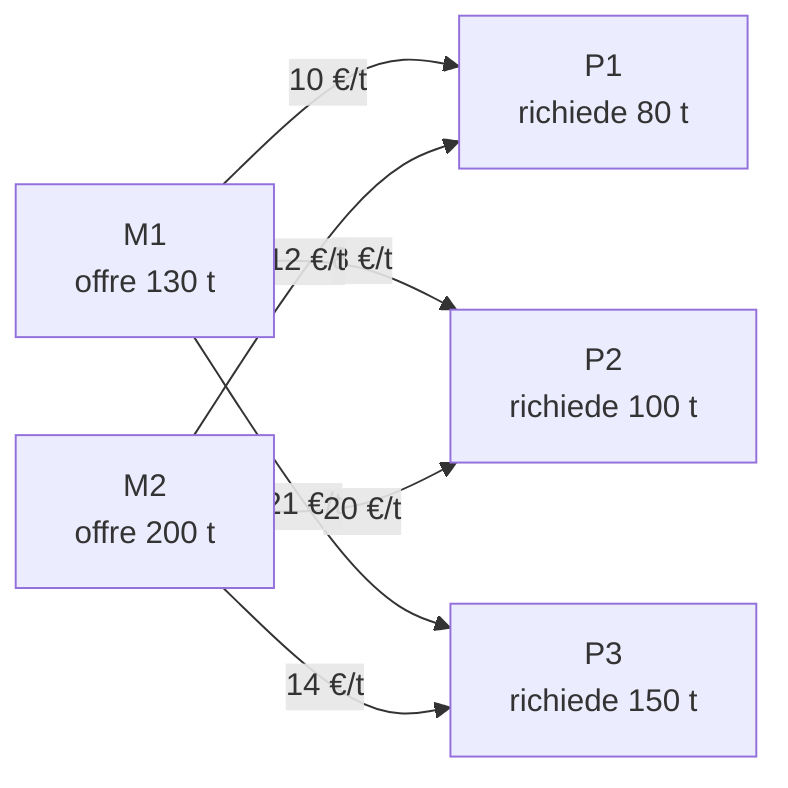

---

## corso: Ricerca Operativa lezione: 3 data: 2026-10-01 docente: Cesare Molinari argomenti: [problemi di miscelazione, vincolo ridondante, forma matriciale, rette e semipiani, curve di livello, direzione di crescita, risoluzione grafica, poliedro, vertici, vincoli attivi, problemi di trasporto, allocazione ottima di risorse] fonti: [trascrizione, appunti manuali, dispense] tags: [ricerca-operativa, lezione]
---
# Lezione 3 — Miscelazione, trasporto e risoluzione grafica

> [!warning] Discrepanza tra fonti — data della lezione 
> La scansione degli appunti è datata 29/09/2026, mentre la trascrizione riporta come data di registrazione il **01/10/2026**. Nella lezione 4 (02/10) la docente si riferisce a questa lezione dicendo "avete visto **ieri**", il che conferma la data della trascrizione. Nel front-matter è indicato il 01/10.

## Programma della lezione

Molinari riprende il quadro generale. Il corso sta affrontando il grande capitolo della **programmazione lineare**, che occupa tutta la prima parte. Con la prof. Villa si è visto che cosa sono la programmazione matematica e la programmazione lineare e un primo modello di **allocazione ottima di risorse scarse**, che Molinari chiama "il colorificio" (si veda la nota sull'ultimo esempio). La lezione introduce altri due modelli e poi torna al primo per risolverlo graficamente, nell'ordine:

1. **miscelazione**: modello e soluzione grafica;
2. **trasporto**: solo il modello. Anche con pochi dati un problema di trasporto ha subito "dimensione alta": l'esempio della lezione ha già **sei variabili**, e in dimensione 6 la soluzione grafica non si può fare né alla lavagna, né su carta, né al computer;
3. **allocazione ottima di risorse scarse**: soluzione grafica.

Gli esempi sono casi reali molto semplificati in cui la programmazione lineare descrive un fenomeno. Come nella lezione precedente, il docente legge il testo, scrive i dati e lascia agli studenti qualche minuto per provare a scrivere il modello prima di svolgerlo insieme. Le dispense organizzano i modelli di programmazione lineare nelle stesse tre classi [@roma2023, §3.4]. Nei modelli di allocazione le risorse vanno **ripartite** tra usi in competizione; in quelli di miscelazione vanno **combinate** per ottenere un prodotto con certi requisiti; in quelli di trasporto bisogna pianificare lo spostamento di merce da origini a destinazioni.

## Il modello del problema di miscelazione

Il testo, letto a lezione, riprende l'esercizio impostato nella [[Lezione 02 - Modelli di programmazione matematica#Problemi di miscelazione — impostazione|lezione 2]]. Un'industria produce succhi di frutta mescolando due ingredienti, **polpa di frutta** ($P$) e **dolcificante** ($D$). Si vogliono rispettare requisiti minimi sul contenuto di vitamina C, sali minerali e zucchero, minimizzando il costo. La polpa costa $4$ € all'ettogrammo e il dolcificante $6$ € all'ettogrammo (un ettogrammo è 100 grammi). La composizione **per ettogrammo** di ciascun ingrediente è:

||$P$|$D$|
|---|---|---|
|vitamina C|$140\ \text{mg}$|$0\ \text{mg}$|
|sali minerali|$20\ \text{mg}$|$10\ \text{mg}$|
|zuccheri|$25\ \text{g}$|$50\ \text{g}$|

La miscela deve contenere **almeno** $70\ \text{mg}$ di vitamina C, $30\ \text{mg}$ di sali minerali e $75\ \text{g}$ di zucchero. Le soglie sono **quantità totali nella miscela**. Il docente avverte che questi esercizi sono semplificazioni spinte e a volte si capiscono male perché assumono cose irrealistiche. Qui non si vuole preparare un litro di succo né una quantità prefissata di ettogrammi: si vuole un succo, di qualunque quantità, che soddisfi i requisiti al costo minimo.

**Variabili.** Le variabili sono sempre una **scelta modellistica**, e due persone possono sceglierle in modo diverso. Qui il buon senso suggerisce

$$ x_1 = \text{ettogrammi di polpa nel preparato}, \qquad x_2 = \text{ettogrammi di dolcificante nel preparato}. $$

**Funzione obiettivo.** Il costo del preparato finale, da **minimizzare**:

$$ f(x_1, x_2) = 4x_1 + 6x_2 . $$

Conviene sempre controllare le unità di misura: $4$ €/hg moltiplicato per $x_1$ hg dà euro, perché gli ettogrammi si semplificano. Le dispense esprimono lo stesso costo in centesimi, $400x_1 + 600x_2$. Il problema è identico: moltiplicare la funzione obiettivo per una costante positiva non cambia il punto di ottimo.

**Vincoli.** Il contenuto di vitamina C del succo è $140x_1 + 0 \cdot x_2$, e deve essere almeno $70$. Anche qui le unità tornano: mg/hg per hg dà mg, la stessa unità del termine noto. Allo stesso modo si scrivono i vincoli sui sali e sugli zuccheri (g/hg per hg dà g). A lezione ci si è accorti che mancavano i **vincoli di non negatività**, che vanno aggiunti: le quantità non possono essere negative.

$$ \begin{cases} 140,x_1 \ge 70 & \text{(vitamina C)} \ 20,x_1 + 10,x_2 \ge 30 & \text{(sali minerali)} \ 25,x_1 + 50,x_2 \ge 75 & \text{(zuccheri)} \ x_1 \ge 0,\ x_2 \ge 0 \end{cases} $$

È un problema di **programmazione lineare**: la funzione obiettivo è lineare ("un numerino per $x_1$ più un numerino per $x_2$, non ci sono altre possibilità") e lo sono anche tutti i vincoli. Le variabili $x_1, x_2$ sono reali.

### Forma matriciale

Il problema si scrive come

$$ \min_{x_1, x_2} f(x_1, x_2) \quad \text{s.t.} \quad A x \ge b, $$

dove $x = (x_1, x_2)^T$. La matrice $A$ ha tante **righe** quanti sono i vincoli (cinque) e tante **colonne** quante sono le variabili (due), perché deve moltiplicare il vettore $x$ di dimensione $2 \times 1$. Un vincolo come $x_1 \ge 0$ si legge come $1 \cdot x_1 + 0 \cdot x_2 \ge 0$, quindi la sua riga è $(1, 0)$:

$$ A = \begin{pmatrix} 140 & 0 \ 20 & 10 \ 25 & 50 \ 1 & 0 \ 0 & 1 \end{pmatrix}, \qquad b = \begin{pmatrix} 70 \ 30 \ 75 \ 0 \ 0 \end{pmatrix}, \qquad c = \begin{pmatrix} 4 \ 6 \end{pmatrix}, \quad f(x) = c^T x . $$

Il problema è già nella forma $Ax \ge b$ adottata come standard nella lezione 2: non serve nessuna trasformazione.

> [!important] Osservazione — $x_1 \ge 0$ è ridondante Il primo vincolo, diviso per $140$, dice che $x_1 \ge \tfrac{70}{140} = \tfrac12$. Ma se $x_1 \ge \tfrac12$, allora automaticamente $x_1 \ge 0$. Rispetto al primo vincolo, quello di non negatività su $x_1$ è quindi **ridondante**: si può eliminare senza cambiare l'insieme ammissibile. Il vantaggio è che si lavora con un problema leggermente più piccolo, togliendo la riga $(1, 0)$ da $A$ e lo $0$ corrispondente da $b$. Negli appunti questa riga compare infatti cancellata.

> [!note] Formulazione generale della miscelazione (dalle dispense) Le dispense generalizzano il modello [@roma2023, §3.4.2]; a lezione la formulazione generale non è stata scritta. Si hanno $n$ sostanze $S_1, \dots, S_n$ con costi unitari $c_1, \dots, c_n$ e $m$ componenti utili $C_1, \dots, C_m$. Sia $a_{ij}$ la quantità di componente $C_i$ in un'unità di sostanza $S_j$ e $b_i$ la quantità minima di $C_i$ richiesta nella miscela. Con $x_j$ = quantità di sostanza $S_j$ usata, il problema è $$ \min\ c^T x \qquad \text{s.t.} \quad A x \ge b, \quad x \ge 0 . $$ Rispetto all'allocazione ($\max, c^T x$, $Ax \le b$) si invertono sia il verso dell'ottimizzazione (si minimizza un costo) sia il verso dei vincoli (requisiti minimi anziché disponibilità massime).

## Breve ripasso: rette, semipiani e direzione di crescita

Prima della risoluzione grafica il docente ripassa alcuni concetti di geometria nel piano $\mathbb{R}^2$, con coordinate $x_1, x_2$ (base canonica). Il piano è l'ambito in cui si può parlare di risoluzione grafica, perché è quello che si può disegnare alla lavagna.

Una **retta** è il **luogo geometrico** dei punti $(x_1, x_2)$ che soddisfano un'equazione del tipo

$$ a_1 x_1 + a_2 x_2 = b , $$

cioè "numerino per $x_1$ più numerino per $x_2$ uguale a numerino". Sono **tutti e soli** i punti della retta: un punto della retta soddisfa l'equazione, un punto fuori no.

Un **semipiano** ha la stessa struttura, ma con una disuguaglianza al posto dell'uguaglianza:

$$ a_1 x_1 + a_2 x_2 \ge b \qquad \text{oppure} \qquad a_1 x_1 + a_2 x_2 \le b . $$

La presenza dell'"uguale" nella disuguaglianza significa che la retta che separa i due semipiani **appartiene** al semipiano, che quindi si dice **chiuso**. Ogni vincolo lineare in due variabili individua dunque un semipiano chiuso, e l'insieme ammissibile è l'**intersezione** dei semipiani di tutti i vincoli.

**Il vettore dei coefficienti.** Il vettore

$$ a = \begin{pmatrix} a_1 \ a_2 \end{pmatrix}, $$

che ha come componenti i coefficienti della prima e della seconda variabile, è **perpendicolare** alla retta: i coefficienti della retta sono le componenti di un vettore ortogonale alla retta. Il motivo è semplice. Se $\bar x$ e $\bar z$ sono due punti della retta, sottraendo $a^T \bar z = b$ e $a^T \bar x = b$ si ottiene $a^T(\bar z - \bar x) = 0$, e $\bar z - \bar x$ dà la direzione della retta [@roma2023, Lemma 4.3.1].

Il vettore $a$ è importante per questo motivo. Facendo variare il termine noto, l'equazione $a_1x_1 + a_2x_2 = b$ descrive una **famiglia di rette parallele**. Se nel disegno si hanno tre rette della famiglia con termini noti $\underline b$, $b$, $\overline b$ e $a$ punta verso l'alto, allora $\underline b < b < \overline b$: spostandosi nel verso di $a$, il termine noto cresce.

Per dirlo in termini di funzioni, si definisce la funzione lineare (che per ora non c'entra con la funzione obiettivo)

$$ g(x_1, x_2) = a_1 x_1 + a_2 x_2 = a^T x . $$

La retta $a^T x = b$ è l'**insieme di livello** $b$ di $g$, cioè l'insieme di tutti e soli i punti di $\mathbb{R}^2$ in cui $g$ vale $b$. Gli insiemi di livello di $g$ sono quindi le rette parallele $a_1x_1 + a_2x_2 = \text{cost.}$: se il livello cresce la retta si sposta in un verso, se decresce nell'altro.

> [!important] Il vettore $a$ indica la direzione di (massima) crescita di $g(x) = a^T x$ Sia $x \in \mathbb{R}^2$ un punto qualunque e sia $t > 0$. Spostandosi da $x$ di $t$ volte il vettore $a \ne 0$, per la linearità del prodotto scalare si ha $$ g(x + t a) = a^T (x + t a) = a^T x + t, a^T a = g(x) + t, |a|^2 > g(x), $$ perché $t,|a|^2$ è una quantità strettamente positiva. Quindi, **da qualunque punto** e per **qualunque** spostamento positivo nella direzione di $a$, la funzione $g$ cresce. Nella direzione opposta, $-a$, decresce.

> [!tip] Approfondimento — Perché "massima" crescita #approfondimento Il calcolo precedente mostra che $g$ cresce lungo $a$. Che $a$ sia la direzione di crescita _più rapida_ si dimostra con la disuguaglianza di Cauchy–Schwarz. Spostandosi da $x$ nella direzione di un vettore unitario $d$ ($|d| = 1$) per un passo $t > 0$, la funzione varia di $$ g(x + t d) - g(x) = t, a^T d \le t, |a|, |d| = t, |a|, $$ con uguaglianza se e solo se $d = a / |a|$. Tra tutte le direzioni unitarie, quella di $a$ dà l'aumento maggiore. In termini di analisi in più variabili, che il corso richiamerà più avanti, $a$ è il **gradiente** di $g$: $\nabla g(x) = a$ in ogni punto. Il gradiente indica sempre la direzione di massima crescita di una funzione differenziabile, ed è la proprietà che sfruttano gli algoritmi del primo ordine della seconda parte del corso.

Per una funzione obiettivo lineare $c_1x_1 + c_2x_2$ ne segue la regola pratica della risoluzione grafica:

- in un problema di **massimo** si traslano le rette di livello nel verso di $c$;
- in un problema di **minimo** si traslano nel verso di $-c$.

Per capire quale semipiano corrisponde a una disequazione si può anche scegliere un punto di prova, di solito l'origine, e valutarvi $a_1x_1 + a_2x_2$: se la disequazione è soddisfatta il semipiano è quello che contiene il punto, altrimenti l'altro [@roma2023, §4.3.1].

## Risoluzione grafica del problema di miscelazione

Dividendo il primo vincolo per $140$, il secondo per $10$ e il terzo per $25$ (operazioni che non cambiano l'insieme dei punti che li soddisfano) ed eliminando il vincolo ridondante $x_1 \ge 0$, il problema diventa

$$ \begin{aligned} \min \quad & 4x_1 + 6x_2 \ \text{s.t.} \quad & x_1 \ge \tfrac{1}{2} \ & 2x_1 + x_2 \ge 3 \ & x_1 + 2x_2 \ge 3 \ & x_2 \ge 0 \end{aligned} $$

### L'insieme ammissibile

Si disegna solo il primo quadrante, perché le variabili sono non negative, e si traccia una retta per ogni vincolo:

|vincolo|retta di bordo|intersezioni con gli assi|semipiano ammissibile|
|---|---|---|---|
|$x_1 \ge \tfrac12$|$x_1 = \tfrac12$ (verticale)|$(\tfrac12, 0)$|a destra della retta|
|$2x_1 + x_2 \ge 3$|$2x_1 + x_2 = 3$|$(0, 3)$ e $(\tfrac32, 0)$|sopra la retta|
|$x_1 + 2x_2 \ge 3$|$x_1 + 2x_2 = 3$|$(0, \tfrac32)$ e $(3, 0)$|sopra la retta|
|$x_2 \ge 0$|asse $x_1$|—|sopra l'asse|

> [!warning] Discrepanza tra fonti — intersezioni con gli assi Nella trascrizione le intersezioni delle rette $2x_1 + x_2 = 3$ e $x_1 + 2x_2 = 3$ con gli assi sono indicate come "due terzi". I valori corretti sono $\tfrac{3}{2}$: per $x_2 = 0$ la prima dà $2x_1 = 3$, cioè $x_1 = \tfrac32$; per $x_1 = 0$ la seconda dà $2x_2 = 3$, cioè $x_2 = \tfrac32$. Gli appunti scansionati riportano correttamente $\tfrac32$ e le dispense confermano [@roma2023, §4.3.3]. Se nel disegno si è usato $\tfrac23$, è probabilmente questo l'"errore" annotato negli appunti accanto al grafico.

Devono valere tutti i vincoli insieme, quindi si prende l'**intersezione** dei semipiani. Si ottiene una regione **illimitata**, che si estende verso l'alto e verso destra. Partendo dall'alto, il suo bordo è formato da:

- la semiretta verticale $x_1 = \tfrac12$ per $x_2 \ge 2$;
- il segmento della retta $2x_1 + x_2 = 3$ tra $A$ e $B$;
- il segmento della retta $x_1 + 2x_2 = 3$ tra $B$ e $C$;
- la semiretta $x_2 = 0$ per $x_1 \ge 3$.

I tre **vertici** del bordo si trovano intersecando a due a due le rette che vi si incontrano:

$$ \begin{aligned} A &: \begin{cases} x_1 = \tfrac12 \ 2x_1 + x_2 = 3 \end{cases} \Rightarrow A = \left(\tfrac12,\ 2\right), \[4pt] B &: \begin{cases} 2x_1 + x_2 = 3 \ x_1 + 2x_2 = 3 \end{cases} \Rightarrow B = (1,\ 1), \[4pt] C &: \begin{cases} x_1 + 2x_2 = 3 \ x_2 = 0 \end{cases} \Rightarrow C = (3,\ 0). \end{aligned} $$

Per $B$ basta sottrarre le due equazioni, ottenendo $x_1 = x_2$, e poi sostituire: $3x_1 = 3$. Non tutte le intersezioni tra rette di bordo sono vertici. Per esempio, la retta $x_1 = \tfrac12$ incontra la retta $x_1 + 2x_2 = 3$ nel punto $(\tfrac12, \tfrac54)$, che però **non sta** nella regione ammissibile ($2 \cdot \tfrac12 + \tfrac54 < 3$) e quindi non è un vertice.

### Un'anticipazione: poliedri e vertici

Il docente anticipa due concetti che verranno formalizzati nella [[Lezione 04 - Convessità, poliedri e vertici|lezione 4]].

L'insieme ammissibile trovato è un **poliedro**: l'intersezione di un numero **finito** di semipiani (in generale, semispazi), che qui sono tutti di questo tipo perché i vincoli sono lineari. Un poliedro può essere **limitato** o **illimitato**; questo è illimitato, perché in una direzione si può andare all'infinito. Ciò che caratterizza un poliedro è che ha i **bordi dritti**: un cerchio, per esempio, non è un poliedro, perché non si ottiene intersecando un numero finito di semipiani.

I **vertici** di un poliedro sono i punti che non si possono ottenere "combinando" altri due punti dell'insieme. Un punto di un lato si scrive come combinazione di due punti dello stesso lato, mentre $A$, $B$ e $C$ no. A lezione si è detto "combinazione lineare"; la definizione precisa, data nella lezione 4, dice che un vertice non può trovarsi **all'interno di un segmento** che congiunge due punti dell'insieme diversi da esso (in termini tecnici, non è combinazione _convessa_ di due altri punti).

### Le curve di livello e la soluzione ottima

Il vettore dei coefficienti della funzione obiettivo è $c = (4, 6)^T$, il vettore $a$ del ripasso. Disegnato nell'origine, punta "un po' più in alto che a destra". Conta solo la direzione: $(2, 3)$ andrebbe altrettanto bene. È la direzione di **massima crescita** della funzione obiettivo, quindi nella direzione opposta la funzione **decresce**, ed è quello che si vuole.

Le **curve di livello** della funzione obiettivo sono le rette

$$ 4x_1 + 6x_2 = z, \qquad z \in \mathbb{R}. $$

Il livello si chiama $z$ e non $b$, perché $b$ indica di solito i termini noti dei vincoli. Le curve di livello sono perpendicolari a $c$. Alcuni esempi:

- per $z = 5$ o $z = 7$ il costo sarebbe migliore, ma la retta **non ha alcun punto** nella regione ammissibile;
- per $z = 12$ la retta **ha** punti ammissibili, e in quei punti il costo vale $12$.

Si vuole il costo più basso possibile restando nella regione ammissibile. Facendo crescere i livelli a partire da valori bassi, la soluzione è il **primo punto della regione ammissibile toccato** da una curva di livello. Detto altrimenti, è la curva di livello più bassa che ha almeno un punto nell'insieme ammissibile. Se infatti si sale a una curva di livello più alta si trovano ancora punti ammissibili, ma con costo maggiore. Graficamente il primo punto toccato è il vertice $B = (1, 1)$, dove

$$ f(1, 1) = 4 + 6 = 10 . $$

Il docente avverte che con la risoluzione grafica bisogna **fare bene il disegno**, rispettando le proporzioni (meglio su carta a quadretti). Alla lavagna il disegno era corretto solo qualitativamente, copiato da un foglio preparato in modo che la prima curva di livello a toccare la regione passasse per $B$.

> [!example] Verifica sui vertici (valori calcolati per controllo)
> 
> |vertice|$(x_1, x_2)$|$f = 4x_1 + 6x_2$|
> |---|---|---|
> |$A$|$(\tfrac12, 2)$|$2 + 12 = 14$|
> |$B$|$(1, 1)$|$4 + 6 = \mathbf{10}$|
> |$C$|$(3, 0)$|$12 + 0 = 12$|
> 
> Il valore più basso tra i vertici è in $B$, coerente con la costruzione grafica. Che basti confrontare i vertici non è ovvio: è il contenuto del teorema fondamentale della programmazione lineare, che il corso vedrà più avanti.

> [!important] Soluzione del problema di miscelazione La soluzione ottima è $x^\star = (1, 1)$: mettendo **1 hg di polpa** e **1 hg di dolcificante** si ottiene un succo che soddisfa i requisiti e fa spendere il meno possibile in materiali, cioè **10 €** (1000 centesimi nelle dispense). Il succo ottenuto contiene:
> 
> - $140\ \text{mg}$ di vitamina C, contro i $70$ richiesti: il vincolo è soddisfatto "in maniera abbondante", e infatti $B$ **non** sta sulla retta del vincolo sulla vitamina C;
> - $20 + 10 = 30\ \text{mg}$ di sali minerali, esattamente il minimo;
> - $25 + 50 = 75\ \text{g}$ di zuccheri, esattamente il minimo.
> 
> I vincoli soddisfatti "giusti giusti", cioè con l'uguaglianza, sono i **vincoli attivi**: qui quelli su sali e zuccheri. Graficamente $B$ giace esattamente su entrambe le rette corrispondenti.

Il docente aggiunge un'osservazione intuitiva. Se si minimizza un costo rispettando dei requisiti minimi, ci si aspetta che **qualche requisito sia soddisfatto giusto giusto**. Se nessuno lo fosse, ogni requisito avrebbe un margine, e si potrebbero ridurre un po' le quantità restando ammissibili e spendendo ancora meno. Soddisfare un vincolo giusto giusto significa stare **sul bordo** della regione, sulla retta di quel vincolo. Nel punto ottimo $B$, che è un vertice, ne sono attivi due.

> [!tip] Approfondimento — Un certificato di ottimalità #approfondimento C'è un modo per convincersi, senza disegno, che nessun punto ammissibile costa meno di 10. Si scrive la funzione obiettivo come combinazione a coefficienti **non negativi** dei due vincoli attivi: $$ 4x_1 + 6x_2 = \tfrac{2}{3},(2x_1 + x_2) + \tfrac{8}{3},(x_1 + 2x_2). $$ Per ogni punto ammissibile $2x_1 + x_2 \ge 3$ e $x_1 + 2x_2 \ge 3$, quindi $$ 4x_1 + 6x_2 \ge \tfrac{2}{3} \cdot 3 + \tfrac{8}{3} \cdot 3 = 10, $$ e il valore $10$ è raggiunto in $B$. I moltiplicatori $\tfrac23$ e $\tfrac83$ anticipano la **teoria della dualità**, trattata nel capitolo 7 delle dispense [@roma2023, cap. 7]. Il ragionamento è aggiunto qui per verifica e non è stato svolto a lezione.

> [!tip] Schema da disegnare Figura consigliata in Excalidraw, su carta a quadretti: assi $x_1, x_2$ tra $0$ e $4$; la retta verticale $x_1 = \tfrac12$; la retta per $(0,3)$ e $(\tfrac32, 0)$; la retta per $(0, \tfrac32)$ e $(3,0)$; la regione illimitata in alto a destra, con bordo $A$–$B$–$C$; le rette di livello $4x_1 + 6x_2 = 7$ (che non tocca la regione), $= 10$ (che tocca la regione solo in $B$) e $= 12$ (che passa per $C$); il vettore $c = (4,6)$ e il verso opposto $-c$ di decrescita.

## Il modello di trasporto

Il docente legge il testo. Un'industria dell'acciaio dispone di **due miniere** $M_1, M_2$ e di **tre impianti di produzione** $P_1, P_2, P_3$. Il minerale estratto deve essere trasportato ogni giorno dalle miniere agli impianti, soddisfacendo le rispettive richieste. Le miniere producono ogni giorno $130$ t ($M_1$) e $200$ t ($M_2$); gli impianti richiedono $80$ t ($P_1$), $100$ t ($P_2$) e $150$ t ($P_3$). Il costo in euro del trasporto di una tonnellata di minerale da ciascuna miniera a ciascun impianto è:

|€/t|$P_1$|$P_2$|$P_3$|
|---|---|---|---|
|$M_1$|$10$|$8$|$21$|
|$M_2$|$12$|$20$|$14$|

Il costo di $21$ €/t da $M_1$ a $P_3$, per esempio, riflette il fatto che le due località sono molto distanti. Si chiede un modello che descriva il trasporto dalle miniere agli impianti minimizzando il costo globale.

**Una prima osservazione.** Tutto ciò che viene prodotto nelle miniere è richiesto dagli impianti:

$$ 130 + 200 = 330 = 80 + 100 + 150 . $$

È una semplificazione del caso reale, ma ragionevole: tutto ciò che esce dalle miniere entra negli impianti, una sorta di **conservazione del flusso**. Nel modello si suppone infatti che non sia possibile **stoccare** materiale né alle miniere né agli impianti: tutto il minerale prodotto deve arrivare in giornata agli impianti.

**Variabili.** A lezione è stato proposto di usare due variabili, una per miniera. Non bastano: da $M_1$ devono comunque uscire tutte le $130$ t e da $M_2$ tutte le $200$ t, perché non c'è stoccaggio. Ciò che va deciso è **quanta merce far viaggiare su ciascun percorso**. Disegnando le miniere da una parte (**origini**) e gli impianti dall'altra (**destinazioni**), ogni miniera è collegata a ogni impianto, con costi diversi:

Serve una variabile per ogni **arco** del grafo, quindi $2 \cdot 3 = 6$ variabili:

$$ x_{ij} = \text{tonnellate trasportate ogni giorno dalla miniera } M_i \text{ all'impianto } P_j, \qquad i = 1, 2,\ j = 1, 2, 3 . $$

Il primo indice si riferisce all'origine, il secondo alla destinazione. Già con due origini e tre destinazioni il numero di variabili cresce rapidamente, ed è per questo che il problema non si risolve graficamente. Negli appunti le variabili erano state inizialmente numerate con un solo indice, $x_1, \dots, x_6$; la notazione a due indici è più comoda perché rispecchia la tabella dei costi.

**Funzione obiettivo.** È il costo del trasporto, da minimizzare. Su ogni arco il costo è il costo unitario per le tonnellate trasportate (€/t per t dà €). Leggendo la tabella riga per riga:

$$ f(x) = 10x_{11} + 8x_{12} + 21x_{13} + 12x_{21} + 20x_{22} + 14x_{23}. $$

**Vincoli di origine.** Tutto ciò che esce dalla miniera 1 viaggia sugli archi $x_{11}, x_{12}, x_{13}$ e deve essere pari alla produzione; lo stesso vale per la miniera 2:

$$ x_{11} + x_{12} + x_{13} = 130, \qquad x_{21} + x_{22} + x_{23} = 200 . $$

**Vincoli di destinazione.** Ciò che arriva a ogni impianto, da una miniera o dall'altra, deve essere pari alla richiesta:

$$ x_{11} + x_{21} = 80, \qquad x_{12} + x_{22} = 100, \qquad x_{13} + x_{23} = 150 . $$

**Perché uguaglianze.** I vincoli sono uguaglianze perché non c'è possibilità di stoccaggio. Se si potesse stoccare merce **nelle miniere**, i vincoli di origine diventerebbero $\le$: si trasporta al massimo quanto si produce, e il resto si stocca. Se si potesse stoccare **negli impianti**, i vincoli di destinazione diventerebbero $\ge$: se arriva più del necessario, l'eccedenza va in magazzino. Nel modello semplice della lezione si chiede che tutto esca e tutto entri.

**Non negatività.** $x_{ij} \ge 0$ per ogni $i, j$: non si trasportano quantità negative.

> [!warning] Discrepanze tra fonti — vincoli del trasporto
> 
> - Negli appunti scansionati il vincolo dell'impianto $P_2$ è scritto $x_{12} + x_{22} = 200$, ma la richiesta di $P_2$ è $100$ t (trascrizione, nota _Miniere_ e dispense [@roma2023, Es. 3.4.17]). Il vincolo corretto è $x_{12} + x_{22} = 100$.
> - I **vincoli di non negatività** $x_{ij} \ge 0$ non compaiono né nella trascrizione né negli appunti, ma fanno parte del modello nelle dispense. Vanno aggiunti: senza di essi il modello ammetterebbe trasporti "all'indietro" con quantità negative.

> [!important] Modello di trasporto (miniere–impianti) $$ \begin{aligned} \min \quad & 10x_{11} + 8x_{12} + 21x_{13} + 12x_{21} + 20x_{22} + 14x_{23} \ \text{s.t.} \quad & x_{11} + x_{12} + x_{13} = 130 \ & x_{21} + x_{22} + x_{23} = 200 \ & x_{11} + x_{21} = 80 \ & x_{12} + x_{22} = 100 \ & x_{13} + x_{23} = 150 \ & x_{ij} \ge 0, \quad i = 1, 2,\ j = 1, 2, 3 \end{aligned} $$

### Formulazione generale (dalle dispense)

A lezione la formulazione generale non è stata scritta; le dispense la riportano [@roma2023, §3.4.3]. Ci sono $m$ origini $O_1, \dots, O_m$ con disponibilità $a_i \ge 0$, $n$ destinazioni $D_1, \dots, D_n$ con richieste $b_j \ge 0$, e costi unitari $c_{ij}$ (spesso legati alle distanze). Si suppone che la disponibilità complessiva uguagli la richiesta complessiva, $\sum_i a_i = \sum_j b_j$, senza giacenze. Con $x_{ij}$ = quantità trasportata da $O_i$ a $D_j$:

$$ \begin{aligned} \min \quad & \sum_{i=1}^{m} \sum_{j=1}^{n} c_{ij}, x_{ij} \ \text{s.t.} \quad & \sum_{j=1}^{n} x_{ij} = a_i, && i = 1, \dots, m \quad \text{(vincoli di origine)} \ & \sum_{i=1}^{m} x_{ij} = b_j, && j = 1, \dots, n \quad \text{(vincoli di destinazione)} \ & x_{ij} \ge 0, && i = 1, \dots, m,\ j = 1, \dots, n \end{aligned} $$

Il modello ha $mn$ variabili, $m + n$ vincoli di uguaglianza e $mn$ vincoli di non negatività. Nell'esempio, $m = 2$ e $n = 3$: $6$ variabili e $5$ vincoli di uguaglianza.

> [!tip] Approfondimento — Ammissibilità e interezza nel problema di trasporto #approfondimento Le dispense [@roma2023, Teoremi 3.4.1 e 3.4.2] riportano due risultati che giustificano la formulazione.
> 
> **Ammissibilità.** Il problema (con $a_i, b_j \ge 0$) ammette una soluzione ammissibile **se e solo se** $\sum_i a_i = \sum_j b_j$. La necessità si vede sommando tutti i vincoli di origine e tutti quelli di destinazione: entrambe le somme valgono $\sum_{i,j} x_{ij}$, quindi $\sum_i a_i = \sum_j b_j$. Per la sufficienza, posto $A = \sum_i a_i = \sum_j b_j$ (con $A > 0$), la scelta $\bar x_{ij} = a_i b_j / A$ è non negativa e soddisfa tutti i vincoli: per esempio $\sum_j \bar x_{ij} = a_i \sum_j b_j / A = a_i$.
> 
> **Interezza.** Se le $a_i$ e le $b_j$ sono intere e il problema ha soluzione ottima, allora ha anche una soluzione ottima **intera** (enunciato senza dimostrazione nelle dispense). È il risultato che permette di risolvere il problema di assegnamento della [[Lezione 01 - Introduzione alla Ricerca Operativa#Primo modello — il problema di assegnamento|lezione 1]] come un problema di programmazione lineare continua: l'assegnamento è un trasporto con $n$ origini, $n$ destinazioni e tutte le disponibilità e richieste pari a $1$.
> 
> **Destinazione fittizia.** Se la disponibilità supera la richiesta, oltre alle varianti con "$\le$" e "$\ge$" viste a lezione si può introdurre una destinazione fittizia con richiesta $\sum_i a_i - \sum_j b_j$ e costo di trasporto nullo, tornando così alla forma con sole uguaglianze. Un collegamento non disponibile si rappresenta per convenzione con costo $c_{ij} = \infty$.

## Risoluzione grafica del problema di allocazione

Si torna al modello di allocazione ottima di risorse "che avete visto con la professoressa Villa", senza rifare il passaggio dal racconto alla matematica:

$$ \begin{aligned} \max_{x_1, x_2} \quad & 7x_1 + 10x_2 \ \text{s.t.} \quad & x_1 + x_2 \le 750 \ & x_1 + 2x_2 \le 1000 \ & x_2 \le 400 \ & x_1 \ge 0,\ x_2 \ge 0 \end{aligned} $$

> [!note] Sul contesto dell'esempio Molinari si riferisce a questo modello come al "colorificio". Nelle registrazioni delle lezioni 1 e 2 il colorificio non compare: lì gli esempi di allocazione erano i fertilizzanti e le automobili. Testo e dati sono quelli dell'Esempio 3.4.1 delle dispense [@roma2023]. Un colorificio produce due coloranti $C_1, C_2$ ($x_1$, $x_2$ litri al giorno) da tre preparati base $P_1, P_2, P_3$, con disponibilità giornaliere di $750$, $1000$ e $400$ ettogrammi. Il colorante $C_1$ richiede, per litro, 1 hg di $P_1$ e 1 hg di $P_2$; il colorante $C_2$ richiede 1 hg di $P_1$, 2 hg di $P_2$ e 1 hg di $P_3$. I prezzi di vendita sono $7$ €/l e $10$ €/l.

La risoluzione grafica è possibile perché il problema è **in dimensione 2**: le variabili sono $x_1$ e $x_2$, quindi si lavora in $\mathbb{R}^2$ e si può disegnare. Si disegna solo il primo quadrante, perché le variabili sono non negative.

### L'insieme ammissibile

Come in tutti i problemi lineari, i vincoli sono semipiani delimitati da rette:

|vincolo|retta di bordo|intersezioni con gli assi|semipiano ammissibile|
|---|---|---|---|
|$x_2 \le 400$|$x_2 = 400$ (orizzontale)|$(0, 400)$|sotto la retta|
|$x_1 + 2x_2 \le 1000$|$x_1 + 2x_2 = 1000$|$(1000, 0)$ e $(0, 500)$|sotto la retta|
|$x_1 + x_2 \le 750$|$x_1 + x_2 = 750$|$(750, 0)$ e $(0, 750)$|sotto la retta|
|$x_1, x_2 \ge 0$|gli assi|—|primo quadrante|

L'intersezione è ancora un **poliedro**, ma stavolta **limitato**: non c'è nessuna direzione in cui si possa andare all'infinito. Percorrendone il bordo dall'origine si incontrano i vertici

$$ \begin{aligned} O &= (0, 0), \ A &= (0, 400) && \text{da } x_1 = 0,\ x_2 = 400, \ B &= (200, 400) && \text{da } x_2 = 400,\ x_1 + 2x_2 = 1000, \ P &= (500, 250) && \text{da } x_1 + x_2 = 750,\ x_1 + 2x_2 = 1000, \ C &= (750, 0) && \text{da } x_1 + x_2 = 750,\ x_2 = 0 . \end{aligned} $$

Per $P$, sottraendo la prima equazione dalla seconda si ottiene $x_2 = 250$, e quindi $x_1 = 500$. La retta $x_1 + 2x_2 = 1000$ incontra l'asse $x_2$ in $(0, 500)$, fuori dalla regione, che lì è tagliata da $x_2 \le 400$: per questo il bordo superiore è formato dal segmento orizzontale $A$–$B$.

### La soluzione ottima

Il vettore associato alla funzione obiettivo $7x_1 + 10x_2$ è $c = (7, 10)^T$, che di nuovo punta "un po' più su che a destra". Le curve di livello $7x_1 + 10x_2 = z$ sono rette ortogonali a $c$. Poiché si **massimizza**, le si fa crescere nel verso di $c$. La soluzione è l'**ultima** curva di livello che, crescendo, ha ancora almeno un punto nell'insieme ammissibile, e il punto di contatto è il vertice

$$ P = (500, 250), \qquad f(P) = 7 \cdot 500 + 10 \cdot 250 = 6000 . $$

Il docente ha ammesso che il disegno alla lavagna era venuto male: la retta $x_1 + x_2 = 750$ ha pendenza $-1$, perché i suoi coefficienti sono $(1, 1)$, e non era disegnata con l'inclinazione giusta. Ha invitato a **rifarlo su carta a quadretti**, in modo che risulti chiaro che l'ultimo punto toccato è $P$.

> [!example] Verifica sui vertici (valori calcolati per controllo)
> 
> |vertice|$(x_1, x_2)$|$f = 7x_1 + 10x_2$|
> |---|---|---|
> |$O$|$(0, 0)$|$0$|
> |$A$|$(0, 400)$|$4000$|
> |$B$|$(200, 400)$|$5400$|
> |$P$|$(500, 250)$|$\mathbf{6000}$|
> |$C$|$(750, 0)$|$5250$|
> 
> Vale anche qui un "certificato" come quello della miscelazione: $7x_1 + 10x_2 = 4(x_1 + x_2) + 3(x_1 + 2x_2) \le 4 \cdot 750 + 3 \cdot 1000 = 6000$ per ogni punto ammissibile, con uguaglianza in $P$.

> [!important] Soluzione del problema di allocazione La soluzione ottima è $x^\star = (500, 250)$, con valore ottimo $6000$. In $P$ sono **attivi** i vincoli $x_1 + x_2 \le 750$ e $x_1 + 2x_2 \le 1000$, mentre $x_2 \le 400$ è soddisfatto ma **non attivo** ($250 < 400$). Nel linguaggio del colorificio: si producono 500 litri di $C_1$ e 250 di $C_2$, si esauriscono i preparati $P_1$ e $P_2$ e avanzano 150 hg di $P_3$.

> [!tip] Schema da disegnare Figura da rifare su carta a quadretti, come chiesto a lezione (o da confrontare con le dispense, Figg. 4.3.7 e 4.3.8): assi tra $0$ e $1000$; le tre rette di bordo con le pendenze corrette ($-1$ per $x_1 + x_2 = 750$, $-\tfrac12$ per $x_1 + 2x_2 = 1000$, orizzontale per $x_2 = 400$); il pentagono $O$–$A$–$B$–$P$–$C$ ombreggiato; le rette di livello $7x_1 + 10x_2 = 2000, 4000, 6000$, con l'ultima che tocca la regione solo in $P$; il vettore $c = (7, 10)$ come freccia di crescita.

## Che cosa insegnano gli esempi grafici (dalle dispense)

> [!note] Contenuto dalle dispense A inizio lezione il docente aveva annunciato "commenti ulteriori" sulla soluzione grafica dell'allocazione, ma la lezione si è chiusa subito dopo aver trovato $P$. Le considerazioni di questa sezione sono tratte dalle dispense [@roma2023, §4.3.3] e anticipano il risultato centrale della prima parte del corso.

In entrambi gli esempi la soluzione ottima si trova in un **vertice** della regione ammissibile, e nel punto ottimo sono attivi i vincoli che definiscono quel vertice. Le dispense sottolineano che **non è un caso**: è una caratteristica generale della programmazione lineare.

La soluzione ottima però non è necessariamente unica. Se la funzione obiettivo dell'allocazione fosse $c,x_1 + 2c,x_2$ con $c > 0$, le sue rette di livello sarebbero parallele al lato $B$–$P$, che giace sulla retta $x_1 + 2x_2 = 1000$, e tutti i punti di quel lato sarebbero soluzioni ottime. Anche in questo caso, comunque, **esiste un vertice ottimo**.

Un problema di programmazione lineare può anche **non avere** soluzione ottima, in due modi:

- **regione ammissibile vuota**: per esempio, sostituendo nell'allocazione il vincolo $x_2 \le 400$ con $x_2 \ge 1000$, nessun punto soddisfa tutti i vincoli (servirebbe $x_1 + 2x_2 \ge 2000 > 1000$) e il problema è **inammissibile**, qualunque sia la funzione obiettivo;
- **regione illimitata e obiettivo illimitato**: se nel problema di miscelazione si volesse **massimizzare** $4x_1 + 6x_2$, sulla regione illimitata la funzione potrebbe assumere valori arbitrariamente grandi e il problema sarebbe **illimitato** (superiormente).

Ne segue una congettura: se la regione ammissibile non è vuota, allora o il problema ammette una soluzione ottima in un vertice, oppure è illimitato. Questo enunciato, ricavato qui per via intuitiva nel piano, vale in generale. È il **teorema fondamentale della programmazione lineare** [@roma2023, §5.2], preparato dai risultati sui poliedri della [[Lezione 04 - Convessità, poliedri e vertici|lezione 4]].

## Riepilogo

- **Miscelazione**: $\min, c^T x$ con $Ax \ge b$. Nell'esempio dei succhi $A$ è $5 \times 2$ (righe = vincoli, colonne = variabili); $x_1 \ge 0$ è ridondante e si può eliminare. L'ottimo è $(1, 1)$ con costo $10$ €: i vincoli su sali e zuccheri sono attivi, quello sulla vitamina C no.
- **Geometria**: $a_1x_1 + a_2x_2 = b$ è una retta, $a_1x_1 + a_2x_2 \ge b$ un semipiano chiuso. Le rette $a^T x = \text{cost.}$ sono gli insiemi di livello di $g(x) = a^T x$, e $a$ è ortogonale a esse. Poiché $g(x + ta) = g(x) + t|a|^2$, la funzione cresce nel verso di $a$: per massimizzare si trasla nel verso di $c$, per minimizzare nel verso di $-c$.
- **Risoluzione grafica**: si disegna l'insieme ammissibile come intersezione di semipiani (un **poliedro**, limitato o illimitato), se ne calcolano i **vertici** e si cerca il primo o l'ultimo punto toccato dalle curve di livello. Il disegno va fatto con le proporzioni corrette.
- **Trasporto**: variabili $x_{ij}$ (una per arco origine–destinazione), vincoli di origine e di destinazione con uguaglianze se non c'è stoccaggio ($\le$ alle origini e $\ge$ alle destinazioni se c'è), e $x \ge 0$. Ha già 6 variabili, quindi non si risolve graficamente.
- **Allocazione** (colorificio): poliedro limitato; l'ottimo è $(500, 250)$ con valore $6000$, nel vertice dove si incontrano i due vincoli attivi.