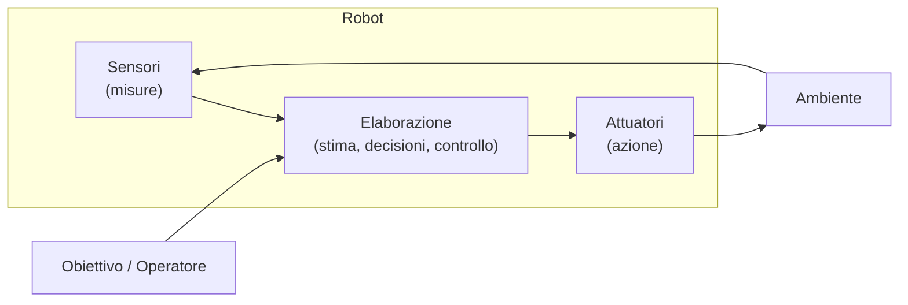
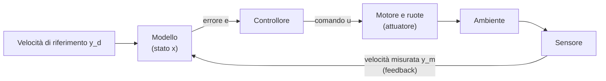

---

## lezione: 1 data: 2026-09-28 argomenti: [definizione di robot, autonomia, ciclo sense-plan-act, sensori propriocettivi, sensori esterocettivi, controllo in retroazione, classificazione dei robot, dominio operativo, manipolatori, gradi di libertà, spazio di lavoro, robot collaborativi, robot mobili terrestri, differential drive]

---
# Lezione 1 — Introduzione alla robotica: definizioni, elementi e tipologie

## 1. Il corso: obiettivi e percorso

Il modulo è tenuto da Francesco Wanderlingh, dottore di ricerca in robotica, che lavora presso il laboratorio GRAAL del DIBRIS (Università di Genova). Le sue attività di ricerca riguardano principalmente la **manipolazione** e la **robotica marina**, quest'ultima anche nell'ambito del centro ISME (_Integrated Systems for Marine Environment_). Molti esempi del corso vengono da questi due ambiti.

Dalla presentazione emerge che la materia è suddivisa con un'altra parte del corso, tenuta da un altro docente. Questo modulo è più legato al **controllo** e al modo in cui si opera concretamente su un robot: con quali rappresentazioni, quali modelli e quali limiti. Gli aspetti di **percezione** e di **pianificazione di alto livello** sono trattati più nel dettaglio nell'altra parte.

### 1.1 Obiettivi

La slide 3 fissa quattro obiettivi formativi, ognuno espresso da un verbo che indica una competenza da acquisire.

- **Classificare**: saper descrivere un robot usando più criteri, non un'unica etichetta.
- **Riconoscere**: collegare tra loro sensori, elaborazione e attuatori, cioè capire come le parti di un robot cooperano.
- **Confrontare**: motivare la scelta di una piattaforma rispetto a un'altra.
- **Progettare**: definire requisiti e caratteristiche di un'architettura software per la robotica.

L'ultimo obiettivo è il punto d'arrivo del corso. Il docente vorrebbe arrivare, nelle ultime lezioni, a un livello minimo di progettazione di architetture software robotiche. A questo scopo ha citato una piattaforma di robotica marina del laboratorio, presso la sede della Spezia. È già dotata di librerie e interfacce grafiche predisposte per sperimentare con l'architettura software.

### 1.2 Il percorso

Il percorso del corso segue questa sequenza:

$$\text{Tipologie} \rightarrow \text{Riferimenti} \rightarrow \text{Moto e controllo} \rightarrow \text{Sensori} \rightarrow \text{Manipolatori}$$

**Tipologie.** È l'argomento della prima lezione. È una panoramica del mondo della robotica, che spazia da robot subacquei e aerei a umanoidi e manipolatori industriali. Raccoglie le caratteristiche che distinguono un robot dall'altro: sensori, strutture, modi di muoversi.

**Riferimenti.** Il blocco successivo, che occuperà una o due lezioni, riguarda i sistemi di riferimento (_terne_ o _frame_). Il docente lo ha indicato come uno degli aspetti più delicati della robotica. Bisogna decidere dove collocare gli assi $x, y$ (o $x, y, z$) per ciascun oggetto di interesse, per esempio la base di un manipolatore o la sua estremità. Poi bisogna saper passare da una terna all'altra. A questo serve un'algebra dedicata, con le sue regole e le sue convenzioni.

**Moto e controllo.** Una volta acquisiti gli strumenti matematici dei riferimenti, si studia come far muovere effettivamente il robot. Per esempio, che cosa bisogna comandare ai motori per portare il robot da un punto a un altro.

**Sensori.** Si studieranno la scelta del sensore e, soprattutto, il trattamento dei dati che fornisce. Il dato grezzo è raramente pronto all'uso: va ripulito dagli effetti di rumore e imprecisione. Un esempio sono i punti spuri che un sensore laser può restituire e che, se non filtrati, generano letture anomale.

**Manipolatori.** L'ultimo blocco applica gli strumenti precedenti ai bracci robotici. Si introdurrà lo **Jacobiano**, lo strumento matematico che lega le velocità dei giunti alla velocità dell'organo terminale.


## 2. Che cos'è un robot

### 2.1 Un criterio per riconoscere un robot

La lezione si è aperta con una domanda (slide 4): quali di questi sistemi chiameremmo robot?

- **A.** Un braccio che salda in una cella industriale.
- **B.** Un aspirapolvere che si muove in casa.
- **C.** Un veicolo subacqueo comandato da un pilota.
- **D.** Un programma che risponde ai messaggi in chat.

La slide invita a esplicitare il criterio: forma, movimento, autonomia o azione sul mondo? I primi tre sistemi hanno in comune una caratteristica che manca al quarto: possiedono un **corpo fisico** e **agiscono fisicamente** sull'ambiente. Il programma di chat, per quanto sofisticato, non ha un corpo e non modifica lo spazio fisico. Per questo non è un robot.

Questa è la distinzione fondamentale. Per la robotica conta la capacità di **agire fisicamente nello spazio**, non la forma né la sofisticazione del software.

### 2.2 Origine del termine

Il termine ha un'origine letteraria. Secondo il vocabolario Treccani (slide 5), _robot_ viene dal ceco _robota_, «lavoro», e più precisamente «lavoro servile», «servizio della gleba» (le prestazioni di lavoro obbligatorie dei servi della gleba). Lo scrittore ceco Karel Čapek lo usò come nome degli automi che lavorano al posto degli operai nel suo dramma fantascientifico _R.U.R._ del 1920. Da lì il termine si è diffuso, anche attraverso il francese, nelle lingue occidentali.

La prima accezione Treccani descrive il robot come apparato meccanico ed elettronico programmabile, usato nell'industria al posto dell'uomo. Esegue automaticamente e autonomamente lavorazioni ripetitive, complesse, pesanti o pericolose: manipolazione, montaggio, saldatura, verniciatura.

### 2.3 La definizione normativa: ISO 8373:2021

Una definizione più rigorosa viene dagli **standard ISO** (_International Organization for Standardization_). L'ISO è l'organismo internazionale che pubblica le norme tecniche di riferimento in moltissimi settori, robotica compresa. La slide 6 riporta alcune delle norme più consultate.

|Norma|Oggetto|
|---|---|
|ISO 8373:2021|Vocabolario della robotica|
|ISO 10218-1:2025|Requisiti di sicurezza, parte 1: robot industriali|
|ISO 10218-2:2025|Requisiti di sicurezza, parte 2: applicazioni e celle robotizzate|
|ISO/TS 15066:2016|Robot collaborativi|
|ISO 9283:1998|Robot industriali di manipolazione: criteri di prestazione e metodi di prova|
|ISO 18646-5:2026|Robot di servizio: prestazioni, parte 5 (locomozione dei robot con zampe)|
|ISO/TS 25213:2026|Metodi di prova per il consumo energetico dei robot industriali articolati a 6 assi|

Il docente ha sottolineato che esistono norme specifiche per la **robotica collaborativa**, quella in cui il robot interagisce con l'essere umano, e per i relativi **requisiti di sicurezza**. Sono tecnologie in rapida diffusione e verranno riprese più avanti.

La definizione di riferimento è quella del vocabolario ISO 8373:2021 (slide 7).

> [!important] Definizioni ISO 8373:2021 
> **Robot** (3.1): _programmed actuated mechanism with a degree of autonomy to perform locomotion, manipulation or positioning_. In italiano: un meccanismo attuato e programmato, dotato di un certo grado di autonomia, che svolge compiti di locomozione, manipolazione o posizionamento.
> 
> - Nota 1: il robot comprende anche il proprio **sistema di controllo**.
> - Nota 2: esempi di struttura meccanica sono il **manipolatore**, la **piattaforma mobile** e il **robot indossabile**.
> 
> **Autonomia** (3.2): _ability to perform intended tasks based on current state and sensing, without human intervention_. In italiano: la capacità di svolgere i compiti previsti sulla base dello stato corrente e delle percezioni, senza intervento umano. Il grado di autonomia si valuta in base alla qualità delle decisioni e all'indipendenza dall'essere umano.

Secondo questa norma, un robot dovrebbe avere sempre un certo grado di autonomia. Il docente ha precisato che nel corso non sarà sempre così. La robotica si occupa anche delle **piattaforme teleoperate**: sistemi che restano fermi se nessuno li comanda e si muovono appena ricevono un comando dall'operatore.

L'**autonomia**, al contrario, significa che il robot prende iniziative da sé. Questo apre molti problemi: un sistema autonomo deve essere consapevole di ciò che sta facendo e del contesto in cui si trova. Una delle questioni più difficili, nella pratica, è **definire i limiti dell'autonomia**, cioè stabilire fin dove il robot può decidere da solo.


## 3. Il robot come sistema: percepire, elaborare, agire

### 3.1 Il paradigma Sense–Plan–Act

La slide 8 dà una definizione operativa: _un sistema robotico combina un corpo fisico, attuatori e calcolo per svolgere un compito nell'ambiente_. Più in dettaglio, un robot è fatto di un corpo fisico, di **attuatori** (i motori), di **sensori** (da cui nasce la percezione) e di una capacità di **elaborazione** che produce un movimento nell'ambiente.

Questo funzionamento si riassume nel paradigma **Sense–Plan–Act** (percepire, pianificare, agire). È utile per inquadrare qualunque cosa faccia un robot. Le tre fasi sono interconnesse e si influenzano a vicenda in modo ciclico.

1. **Percezione** (_sense_): misure del robot e dell'ambiente. Prima di tutto il robot deve capire dove si trova, che cosa ha intorno e quali possibilità ha: per esempio, vedere un ostacolo prima di decidere come comportarsi.
2. **Elaborazione** (_plan_): stima, decisioni e controllo. Sulla base delle percezioni il robot stima la propria posizione e quella degli oggetti, poi decide che cosa fare. Se deve andare da un punto $A$ a un punto $B$ con un ostacolo in mezzo, decide se aggirarlo e da che parte. Infine traduce la decisione in comandi.
3. **Azione** (_act_): movimento o interazione fisica con l'ambiente, attraverso gli attuatori.

### 3.2 Il ciclo di un sistema robotico

La slide 9 propone uno schema più standard e dettagliato, analogo al precedente.



In alto c'è l'**obiettivo** o l'**operatore**, cioè la parte di pianificazione di alto livello: la definizione di che cosa il robot deve fare, più o meno autonoma a seconda dei casi. Il robot percepisce con i sensori, elabora (si stima, prende decisioni, calcola i comandi) e trasmette i comandi agli attuatori. Questi agiscono sull'ambiente, che cambia: per esempio, il robot si è spostato. I sensori registrano il nuovo stato e il ciclo ricomincia.

### 3.3 Le funzioni operano a frequenze diverse

La slide 9 sottolinea anche che **le varie funzioni possono svolgersi a frequenze diverse**. Il docente ha detto che, per ora, basta enunciarlo, ma a livello implementativo ha grandi conseguenze.

Le frequenze in gioco sono molto diverse.

- **Calcolo.** Il processore di bordo è spesso molto meno potente di quello di un computer da tavolo. Può lavorare da centinaia di megahertz a pochi gigahertz, magari con un solo core.
- **Attuazione.** Gli anelli di controllo dei motori lavorano tipicamente a frequenze dell'ordine dei kilohertz.
- **Sensori.** Molti sensori forniscono informazioni utili a frequenze molto più basse, dell'ordine delle decine (al più centinaia) di hertz. Una telecamera può acquisire molti fotogrammi al secondo; una telecamera ad alta velocità arriva per esempio a 150 fps. Su un robot, però, la frequenza con cui l'immagine diventa **informazione utile** è più bassa, perché bisogna elaborare tutti i pixel. Per esempio va eseguita una **segmentazione**, cioè la suddivisione dell'immagine in regioni (lo sfondo, i singoli oggetti).

Mettere insieme componenti così diversi significa gestirne le diverse velocità. Bisogna **mantenere una stima dello stato** anche negli intervalli in cui non arrivano nuove misure. Bisogna anche evitare di inviare comandi a una frequenza o con una dinamica che un'altra parte del sistema non è in grado di seguire.

---

## 4. Gli elementi fondamentali di un robot

La slide 10 riassume gli elementi che compongono un robot.

|Elemento|Esempi|Informazione o funzione|
|---|---|---|
|Sensori propriocettivi|Encoder, accelerometro, giroscopio (IMU)|Rotazione delle ruote, velocità e accelerazioni|
|Sensori esterocettivi|Camera, LiDAR, sonar|Immagini, distanze, ostacoli|
|Attuatori|Motori, pistoni, propulsori|Forze e movimenti|
|Calcolo|Computer, microcontrollore|Elaborazione|
|Energia|Batterie, elettronica di potenza|Alimentazione e potenza|

La slide si chiude con un'idea che attraversa tutto il corso: **una misura diventa utile quando la interpretiamo con un modello**.

### 4.1 Sensori propriocettivi

I sensori si dividono in due grandi famiglie. I **sensori propriocettivi** misurano lo **stato interno** del robot: come si è mosso, come è orientato, quanto hanno girato le sue ruote o i suoi giunti. Il termine richiama la propriocezione biologica, cioè la percezione che un organismo ha della posizione e del movimento del proprio corpo.

**Encoder.** È un dispositivo montato sull'asse di una ruota o di un motore che conta di quanto l'asse ha ruotato. Traduce cioè un movimento rotatorio in una misura. L'encoder da solo misura un **angolo**, non una distanza percorsa. Per passare alla distanza serve un modello, in questo caso la conoscenza del raggio $r$ della ruota. Se la ruota ha ruotato di un angolo $\Delta\varphi$ (in radianti) e rotola senza strisciare, il tratto percorso è

$$\Delta s = r,\Delta\varphi.$$

> [!example] Esempio: dall'angolo misurato alla distanza 
> Una ruota di raggio $r = 0{,}1\ \text{m}$ compie due giri completi, cioè $\Delta\varphi = 2 \cdot 2\pi = 4\pi$ rad. In ipotesi di puro rotolamento il robot ha percorso $$\Delta s = 0{,}1 \cdot 4\pi \approx 1{,}26\ \text{m}.$$ Se la ruota slitta, l'encoder registra comunque i due giri, ma lo spostamento reale è minore. L'encoder misura la rotazione della ruota, non lo spostamento del robot.

**IMU (_Inertial Measurement Unit_, unità di misura inerziale).** Se il robot non ha ruote, per esempio un drone o un veicolo subacqueo, l'encoder non serve. Si ricorre allora all'IMU, che misura accelerazioni e velocità angolari. Contiene tipicamente:

- un **accelerometro**, che misura le accelerazioni lineari;
- un **giroscopio**, che misura le velocità angolari, cioè le rotazioni.

Un'IMU è presente in ogni smartphone: è ciò che permette al telefono di capire come lo stiamo ruotando. Come esempio biologico, il docente ha citato l'orecchio interno, dove l'apparato vestibolare svolge un ruolo analogo nel percepire accelerazioni e rotazioni della testa.

L'IMU non misura direttamente la posizione. Per ricavarla bisogna **integrare**: l'accelerazione integrata nel tempo dà la velocità, e la velocità integrata dà la posizione. Se il corpo è fermo, l'IMU non registra nulla che indichi dove si trovi.

$$v(t) = v(0) + \int_0^t a(\tau),d\tau, \qquad p(t) = p(0) + \int_0^t v(\tau),d\tau.$$

Ogni piccolo errore di misura viene integrato insieme al segnale, quindi gli errori **si accumulano**. È il fenomeno della **deriva** (_drift_), che verrà ripreso più avanti.

> [!example] Esempio: effetto di un piccolo errore costante dell'accelerometro 
> Supponiamo che l'accelerometro abbia un errore costante (_bias_) $b = 0{,}01\ \text{m/s}^2$, mentre il corpo è in realtà fermo. Integrando due volte si ottiene un errore di posizione $$e_p(t) = \tfrac{1}{2},b,t^2 .$$ Dopo 10 s l'errore è di 0,5 m; dopo 60 s è già di 18 m. L'errore cresce con il **quadrato** del tempo.
> 
> ```chart
> type: line
> labels: [0, 10, 20, 30, 40, 50, 60]
> series:
>   - title: Errore di posizione [m] con bias 0,01 m/s²
>     data: [0, 0.5, 2, 4.5, 8, 12.5, 18]
> tension: 0.3
> width: 80%
> beginAtZero: true
> fill: false
> ```
> 
> Asse orizzontale: tempo in secondi. Per questo l'IMU da sola non basta a stimare la posizione per tempi lunghi.

### 4.2 Sensori esterocettivi

I **sensori esterocettivi** misurano l'**ambiente esterno**: che cosa c'è intorno al robot e a che distanza. Sono più facili da intuire, perché sono l'analogo della nostra vista.

- **Telecamere RGB**: forniscono immagini a colori. RGB indica i tre canali rosso, verde e blu.
- **Telecamere RGB-D**: alle immagini a colori aggiungono un canale di profondità (_depth_), cioè la distanza di ciascun pixel dalla camera. Un esempio noto è il sensore Kinect, nato come periferica per videogiochi.
- **LiDAR**: usa impulsi laser per misurare distanze.
- **Sonar**: usa onde acustiche invece della luce.

LiDAR e sonar si basano sul principio del **tempo di volo** (_time of flight_). Il sensore emette un segnale (un impulso laser, luminoso o acustico) e misura il tempo $\Delta t$ dopo cui l'eco riflessa da un oggetto ritorna. Il segnale percorre la distanza due volte, andata e ritorno. Nota la velocità di propagazione $c$ del segnale, la distanza è quindi

$$d = \frac{c,\Delta t}{2}.$$

> [!example] Esempio: tempo di volo di un sonar 
> In acqua il suono si propaga a circa $1500\ \text{m/s}$. Se l'eco ritorna dopo $\Delta t = 0{,}02\ \text{s}$, l'oggetto si trova a $$d = \frac{1500 \cdot 0{,}02}{2} = 15\ \text{m}.$$

### 4.3 Attuatori, calcolo ed energia

Gli **attuatori** sono ciò che fa muovere il robot: motori, pistoni, ruote, eliche, propulsori.

Per il **calcolo**, nella maggior parte delle applicazioni si usano componenti piccoli e a basso consumo, spesso **microcontrollori**. Sono versioni semplificate di una CPU, integrate in un singolo chip, con consumi bassissimi e prestazioni corrispondentemente limitate. La scelta dipende dall'applicazione e soprattutto da quanto a lungo il robot deve operare senza ricaricarsi. Un robot che deve restare in giro per un mese non può montare un processore desktop di fascia alta: assorbirebbe una potenza di un altro ordine di grandezza (il docente ha citato le centinaia di watt) rispetto a un microcontrollore.

Da qui un'osservazione che riguarda direttamente chi scrive software. Anche le scelte di programmazione hanno un **costo energetico**. Il numero di processi creati, le elaborazioni eseguite e l'efficienza di ciascuna funzione si traducono in occupazione della CPU, e quindi in consumo. Se un'operazione impegna cinquanta volte più risorse del necessario, il consumo cresce di conseguenza. La batteria che doveva durare un giorno può durare un'ora. Programmando per la robotica bisogna sempre tenere presente l'**efficienza**.

### 4.4 Dalle misure alle rappresentazioni

La slide 11 mostra due rappresentazioni della realtà ottenute da sensori.

- Una **nuvola di punti** tridimensionale (_point cloud_) di un ambiente interno. È ricostruita combinando le distanze misurate da un sensore laser con le immagini di una camera. Conoscendo la posizione reciproca dei due sensori, si applica il colore (la texture) ai punti misurati dal laser e si ricostruisce lo spazio.
- Una **scansione laser** in pianta: il robot emette raggi in molte direzioni e ricava, dai ritorni, la posizione degli ostacoli intorno a sé.

La domanda della slide è: _come interpretarle?_ Per noi queste immagini hanno un senso, anche se alcune zone sono difficili da leggere. Un sistema autonomo, però, deve capire **che cosa è che cosa**: dove è un tavolo, dove una persona, quale oggetto deve spostare. Oggi questo problema si affronta spesso con modelli di **machine learning**, addestrati fornendo loro moltissimi esempi annotati.

Questi modelli hanno un costo computazionale elevato. Richiedono processori potenti e molta memoria, e il docente ha ricordato anche l'aumento dei prezzi della memoria RAM legato alla diffusione di questi modelli. Su un robot reale bisogna spesso **ridurre gli obiettivi** del sistema di percezione. Altrimenti servirebbe un ingombrante carico di batterie e unità di calcolo solo per eseguire tutte le elaborazioni. C'è sempre un **compromesso** da valutare.


## 5. Modello, stato e controllo in retroazione

### 5.1 Il modello e lo stato

Per parlare di controllo bisogna prima definire il **modello** del sistema. Quando si progetta un qualunque sistema, si parte da un modello **semplificato**. Ogni modello è un'approssimazione della realtà: si scelgono le variabili più importanti e si descrive come sono collegate tra loro.

Le variabili che compaiono nel modello costituiscono lo **stato**, indicato con $x$. Il docente ha usato come esempio un robot a **trazione differenziale**, con due ruote motorizzate. Il modello tiene conto dei due motori e del loro effetto sul moto, della distanza tra le ruote e delle loro velocità. Lo stato comprende per esempio le velocità angolari delle ruote e la posizione del robot.

Alcune variabili di stato si possono controllare, altre no. Lo studio sistematico di questi aspetti (**controllabilità** e **osservabilità**) è stato nominato ma esula da questo modulo. Nella pratica si cerca di lavorare con sistemi in cui le grandezze che interessano siano controllabili.

### 5.2 Lo schema in retroazione

La slide 12 mostra lo schema del **controllo con retroazione** (_feedback_) nel caso della regolazione della velocità di una ruota. In generale, quasi tutto ciò che si progetta su un robot è un **controllo con regolazione**: un controllo in cui si **confronta** continuamente dove si è con dove si vorrebbe arrivare. Per farlo serve un'informazione proveniente dal mondo esterno, cioè un **feedback**. Integrare le informazioni esterne nel modello di controllo non è scontato e richiede un progetto accurato.



Le grandezze in gioco sono quattro.

- $y_d$ è il **riferimento** (_desired_), cioè la velocità che si vuole ottenere.
- $y_m$ è la grandezza **misurata** dal sensore, che chiude l'anello.
- $e$ è l'**errore**, cioè la discrepanza tra ciò che si vuole e ciò che si ottiene. Nel caso più semplice è $e = y_d - y_m$.
- $u$ è il **comando** che il controllore calcola a partire dall'errore e invia all'attuatore.

Supponiamo che il robot sia in $x = 1$ e debba arrivare in $x = 2$. Il controllore calcola la velocità da comandare per ridurre la distanza. Il comando di velocità diventa, tramite il motore, una rotazione della ruota. Il robot si sposta e l'ambiente cambia. Il sensore misura la nuova situazione e il confronto si ripete. Come dice la slide, **la misura permette di correggere gli effetti di carico, attrito e disturbi**.

### 5.3 Perché la retroazione è indispensabile

> [!example] Esempio: raggiungere il termosifone a occhi chiusi 
> Il docente ha proposto un esperimento mentale. Conosco perfettamente la stanza e devo andare da dove sono fino al termosifone. In teoria potrei calcolare in anticipo l'intera sequenza di comandi («ruota di 90 gradi, avanza di 5 metri, …») ed eseguirla senza usare alcun sensore. È il cosiddetto controllo **ad anello aperto**, come camminare a occhi chiusi. Che cosa può andare storto?
> 
> 1. **L'ambiente cambia.** Nel frattempo qualcuno può mettere un ostacolo lungo il percorso. Senza percezione il robot non se ne accorge.
> 2. **L'esecuzione non corrisponde al comando.** Se il pavimento è più liscio del previsto, le ruote slittano. I motori ruotano esattamente come comandato, ma il robot percorre 4 metri invece di 5, oppure ruota di un angolo diverso da quello voluto.
> 
> Senza confronto con il mondo esterno, questi errori di rotazione e di avanzamento **si sommano uno sull'altro**, e dopo poco la situazione degenera. Errori durante l'esecuzione ce ne saranno sempre. La percezione serve a capire dove si è arrivati realmente e a correggere: è il feedback.


## 6. Classificare un robot su più assi

La parola «robot» indica cose molto diverse. Un'unica etichetta non basta a descriverlo, quindi si usa una classificazione su più **assi** indipendenti (slide 13).

|Asse|Domanda|Esempi|
|---|---|---|
|Struttura e mobilità|Come si muove e agisce?|Braccio, ruote, zampe, propulsori|
|Ambiente|Dove opera?|Fabbrica, casa, aria, acqua, spazio|
|Compito|Che cosa deve fare?|Trasporto, assemblaggio, ispezione|
|Autonomia|Quali decisioni prende?|Teleoperazione, assistenza, missione autonoma|
|Interazione|Con chi condivide il lavoro?|Cella separata, persone, altri robot|

Le categorie **si sovrappongono**: un robot mobile può essere anche industriale. Descrivere bene un robot significa collocarlo lungo tutti gli assi.

**Struttura e mobilità** riguarda come il robot si muove e agisce nello spazio: con ruote, eliche, propulsori, zampe, e con quale tipo specifico di ciascuno. Le varianti sono molte.

**Ambiente** è spesso la prima domanda da porsi: dove andrà a operare il robot?

**Compito.** Lo stesso compito cambia natura a seconda del contesto. Un trasporto in fabbrica avviene in un ambiente **strutturato**, organizzato e prevedibile. Un trasporto in casa avviene in un ambiente molto meno strutturato. Il docente ha commentato le dimostrazioni video di umanoidi domestici che caricano la lavatrice o aprono porte. Secondo lui, molte di queste sono sequenze preprogrammate (_scripted_) e non mostrano una vera autonomia. Oggi è ancora molto difficile **generalizzare** in un ambiente destrutturato come la casa. Ogni abitazione è diversa e gli oggetti sono in posti diversi. Riconoscere gli spazi e afferrare oggetti, che per noi sono gesti banali, restano problemi aperti di percezione e di interazione.

**Autonomia** e **interazione** sono gli assi più specifici della robotica e vengono approfonditi nelle sezioni seguenti.


## 7. Autonomia riferita a un compito

### 7.1 Tre modalità

L'autonomia non è una proprietà «tutto o niente» del robot: si riferisce a un **compito**. La slide 14 individua tre modalità, ordinate per autonomia crescente.

|Modalità|Decisioni della persona|Funzioni del sistema|
|---|---|---|
|Teleoperazione|Comanda i movimenti|Esegue i comandi e fornisce feedback|
|Assistenza|Guida l'attività|Stabilizza o limita alcuni movimenti|
|Autonomia di missione|Assegna obiettivo e vincoli|Sceglie le azioni e gestisce i casi previsti|

- Nella **teleoperazione** l'operatore muove il robot, per esempio con un joystick, e il robot esegue i comandi.
- Nell'**assistenza** il lavoro è condiviso: alcune operazioni le fa il robot, altre la persona.
- Nell'**autonomia di missione** la persona assegna solo l'obiettivo. L'esempio è il robot aspirapolvere: lo si avvia e da quel momento pulisce la casa in autonomia.

La domanda guida della slide è: _quale funzione è autonoma, e in quali condizioni?_

Più si sale lungo la scala dell'autonomia, più il **software diventa complesso**. Si aggiungono componenti come la pianificazione della missione (_mission planner_), la gestione dei rischi e la gestione delle anomalie. Nei sistemi assistiti o teleoperati molte di queste funzioni sono svolte dall'operatore.

### 7.2 Le modalità possono coesistere: l'esempio del ROV

Le modalità non sono alternative rigide: **possono coesistere** nello stesso sistema, su sottocompiti diversi. La slide 15 lo mostra con un **ROV** (_Remotely Operated Vehicle_), un veicolo subacqueo comandato a distanza. I ROV si usano per lavorare a profondità di centinaia o migliaia di metri, irraggiungibili per un essere umano. Un compito tipico è l'ispezione di condotte posate sul fondale, per verificare che non abbiano danni o che non vi siano rimaste impigliate reti.

|Compito del ROV|Ruolo della persona|Ruolo del sistema|
|---|---|---|
|Scegliere il punto da ispezionare|Assegna l'obiettivo|Riceve l'obiettivo|
|Muoversi attorno alla struttura|Pilota il veicolo|Esegue i comandi|
|Mantenere la profondità|Imposta il riferimento|Corregge automaticamente i disturbi|

Il terzo compito è istruttivo. Il pilota imposta la profondità desiderata e da quel momento il veicolo la mantiene da solo. A bordo c'è un sensore di **pressione**, e in acqua la pressione cresce con la profondità in modo regolare. Se la pressione misurata indica che il veicolo sta scendendo, il sistema comanda una spinta verso l'alto, e viceversa. Su questa funzione il sistema è autonomo, mentre sulla navigazione attorno alla struttura è teleoperato. Il grado di autonomia è quindi **sfumato** e va valutato funzione per funzione.


## 8. L'ambiente cambia i requisiti

### 8.1 Il dominio operativo

L'ambiente in cui il robot opera cambia profondamente i requisiti di progetto (slide 16–17). Per esprimere questa idea in modo preciso si introduce il dominio operativo.

> [!important] Dominio operativo 
> Il **dominio operativo** descrive l'insieme delle **condizioni** entro cui è previsto che una determinata funzione autonoma operi.

|Ambiente|Vincolo tipico|Conseguenza progettuale|
|---|---|---|
|Cella industriale|Compito e geometria controllabili|Attrezzature, precisione, ciclo ripetibile|
|Casa o ospedale|Persone e oggetti in movimento|Percezione e gestione degli imprevisti|
|Terreno aperto|Pendenze, fondo variabile, meteo|Trazione, stabilità, protezione|
|Aria e acqua|Moto tridimensionale e disturbi|Stima dell'assetto, energia, comunicazioni|

Come nota la slide, **la struttura dell'ambiente dipende anche da quanto possiamo prepararlo**. Una cella industriale si può progettare attorno al robot; una casa o un fondale marino no.

> [!tip] Approfondimento — Il dominio operativo nella guida autonoma #approfondimento Il concetto corrisponde a quello di _Operational Design Domain_ (ODD), formalizzato nel settore della guida automatizzata dalla norma SAE J3016 [@sae2021]. La norma lo definisce come l'insieme delle condizioni operative per cui un sistema di automazione della guida, o una sua funzione, è specificamente progettato. Comprende, per esempio, restrizioni ambientali, geografiche e di orario, e la presenza o l'assenza di determinate caratteristiche della strada o del traffico. Fuori dal proprio ODD, il sistema non è progettato per funzionare.

### 8.2 Esempi dalla slide 16

La slide 16 mostra sei robot in ambienti diversi, ognuno con requisiti propri.

**Robot agricolo su terreno aperto** (FieldWorks). Il terreno è irregolare, fangoso, in pendenza. Il robot deve avere trazione e stabilità e deve essere protetto dagli agenti atmosferici.

**Zampe o ruote?** Per muoversi su terreni accidentati le zampe sembrano la scelta naturale: noi esseri umani ci adattiamo bene ai terreni difficili perché con le gambe superiamo gli ostacoli. Le zampe però portano altri problemi:

- l'**equilibrio** e la gestione del baricentro;
- la **manutenzione**, perché una gamba è una piccola catena meccanica con più motori e quindi è molto più complessa di una ruota;
- il **controllo**, che è più difficile.

La ruota è più semplice, ed è per questo che molti robot da campo la preferiscono.

**Robot marini** (OceanAlpha, veicolo di superficie; GEOMAR, veicolo subacqueo che mappa il fondale). In acqua tutto deve essere **impermeabile**, e non solo nel senso di resistere a qualche schizzo. Il docente ha citato un progetto con un robot modulare a forma idrodinamica, fatto di moduli separati (CPU, motori, ecc.). La tenuta tra i moduli è affidata a **O-ring**, guarnizioni ad anello in materiale elastico compresse tra due superfici. Per verificare la tenuta si usa una prova a vuoto: si aspira l'aria dall'interno del modulo e si controlla che la pressione resti stabile. Se la pressione risale, c'è un'infiltrazione.

**Robot chirurgico** (Intuitive Surgical, sistema da Vinci). Il controllo è molto complesso, con molti bracci che operano in uno spazio ristretto. Il medico comanda tutto, ma il sistema aiuta a rendere i movimenti più precisi. I bracci hanno una forma particolare, ripresa nella lezione successiva, pensata per garantire rigidità e precisione.

**Robot aereo con braccio** (LAAS-CNRS, un multirotore con un braccio articolato). Nei robot aerei l'**efficienza energetica** è critica, perché la batteria deve sostenere il volo e qualunque carico. L'autonomia di volo è molto limitata, sia per il peso del velivolo sia per quello del braccio.

**Robot aspirapolvere** in un ambiente domestico, con persone (e animali) che si muovono.

### 8.3 Aria e acqua: moto nello spazio e comunicazioni

Aria e acqua hanno molto in comune. In entrambe il robot si muove in **tre dimensioni** ed è soggetto a molti **disturbi** (vento, correnti). In entrambe può mancare un collegamento affidabile per comunicare.

Sott'acqua il Wi-Fi e le comunicazioni radio non funzionano. Si ricorre a due alternative con caratteristiche opposte.

- **Comunicazione acustica**: ha una portata ampia ma una larghezza di banda molto bassa, quindi pochi dati al secondo.
- **Comunicazione ottica** (laser o LED): ha una banda molto elevata ma funziona solo su distanze molto brevi. Se un veicolo sottomarino deve scaricare molti dati, conviene avvicinarlo a una stazione e trasferirli otticamente.


## 9. Un caso di studio: la consegna in ospedale

La slide 18 applica questi concetti a un robot di consegna in ospedale. Confronta un prototipo di ricerca del 2012 con un prodotto commerciale del 2026. Il prototipo del 2012 trasportava i rifiuti dei reparti: il personale li caricava, il robot raggiungeva l'area di raccolta e li scaricava.

|Aspetto|Descrizione|
|---|---|
|Funzione autonoma|Raggiungere una destinazione e gestire gli ostacoli lungo il percorso|
|Condizioni operative previste|Piano mappato, pavimento regolare, passaggi compatibili con l'ingombro del robot|
|Situazioni previste|Persona che attraversa il corridoio, carrello temporaneamente fermo|
|Capacità non comprese|Aprire porte manuali, salire scale, caricare o scaricare materiale|
|Intervento umano|Assegnazione della consegna, carico e scarico, assistenza quando il sistema non può proseguire|

Questa tabella è esattamente la descrizione di un **dominio operativo**. Dice per quali condizioni il robot è progettato, quali imprevisti sa gestire, che cosa non sa fare e quando serve una persona. Per costruire una mappa e pianificare il percorso tra $A$ e $B$ basta una rappresentazione più astratta dell'edificio, adatta all'obiettivo di movimento.

Se volessimo che il robot aprisse anche le porte o salisse le scale, servirebbe almeno un **braccio**. Questo complica di molto il progetto: dove montarlo, come gestirne la sicurezza in presenza di persone. Oggi il problema delle porte si aggira in un altro modo. Con la diffusione delle reti e delle porte automatiche, il robot si **integra con il sistema dell'edificio** e comanda direttamente porte e ascensori.

La slide si chiude con un'osservazione importante: _«di servizio», «mobile» e «autonomo» descrivono aspetti diversi_. Sono collocazioni su assi diversi della classificazione e non vanno confuse.


## 10. Panoramica delle tipologie di robot

La slide 19 elenca le principali famiglie, che verranno esaminate una alla volta:

- manipolatori (seriali e paralleli);
- robot mobili terrestri (su ruote o su zampe);
- robot aerei;
- robotica medica;
- umanoidi;
- robotica indossabile;
- _soft robotics_;
- robotica marina;
- sistemi multi-robot e _swarm robotics_.

Esistono anche robot **bio-ispirati**, come un robot aereo leggerissimo dotato di un tentacolo per afferrare oggetti.

I **sistemi multi-robot** comprendono, per esempio, le flotte di robot dei magazzini automatizzati. La **swarm robotics** (robotica a sciame) è qualcosa di diverso. Si ispira agli insetti sociali come formiche e api: molti piccoli robot semplici cooperano e il **comportamento complessivo emerge** dall'insieme delle interazioni, senza che un singolo robot lo «conosca».


## 11. Manipolatori

### 11.1 Struttura di un manipolatore

Il manipolatore è probabilmente l'immagine più comune di robot. È anche la prima soluzione che viene in mente quando si vuole automatizzare un processo industriale. La **saldatura** robotizzata, soprattutto nell'industria automobilistica, è tra le applicazioni più diffuse.

Secondo la slide 20 un manipolatore è composto da tre parti.

- **Catena meccanica**: corpi rigidi (_link_, bracci) collegati da **giunti**. Un giunto è il vincolo che permette un movimento relativo tra due corpi, per esempio una rotazione.
- **Azionamenti e sensori**: muovono e misurano i giunti. Gli azionamenti sono i motori, che svolgono un ruolo analogo a quello dei muscoli, pur con un comportamento diverso.
- **Organo terminale** (_end effector_ o _tool_, utensile): pinza, saldatrice, utensile o sonda, montato all'estremità della catena per agire sull'ambiente.

Base, giunti e utensile contribuiscono tutti al movimento finale.

### 11.2 Configurazione, gradi di libertà e posa

La slide 21 schematizza un manipolatore **planare a due giunti rotoidali**. È una base fissa con due giunti che ruotano di angoli $q_1$ e $q_2$, collegati da due bracci, con un utensile all'estremità. Le variabili dei giunti si indicano convenzionalmente con $q$.

> [!important] Configurazione e gradi di libertà La **configurazione** descrive completamente la disposizione del sistema. I **gradi di libertà** (DOF, _Degrees Of Freedom_) sono il **numero minimo di coordinate indipendenti** necessarie per descriverla.

Nel manipolatore della slide, la coppia $(q_1, q_2)$ basta a determinare completamente come è disposto il braccio. Il robot ha quindi **2 gradi di libertà**, e la sua configurazione è il vettore

$$\mathbf{q} = \begin{bmatrix} q_1 \ q_2 \end{bmatrix}.$$

Nella slide questo vettore compare come stato $\mathbf{x} = [q_1 ;; q_2]$: le variabili di giunto sono proprio le variabili di stato del modello.

Della configurazione interessa soprattutto la **posa dell'utensile**, cioè la sua **posizione e il suo orientamento rispetto a un riferimento**. È l'organo terminale che deve raggiungere il punto da saldare o l'oggetto da afferrare. Tutta la matematica dei riferimenti e della cinematica serve a stabilire come muovere i giunti per portarlo nel punto giusto. La slide mostra anche una terna $x, y, z$ associata al sistema: il tema dei riferimenti verrà sviluppato nelle lezioni successive.

La slide aggiunge: _raggiungere un punto e raggiungerlo con l'orientamento richiesto sono compiti diversi_. Il ragionamento sui gradi di libertà lo rende evidente. Nel piano la posa di un oggetto è descritta da tre numeri: due coordinate di posizione e un angolo di orientamento. Un braccio con soli due gradi di libertà può portare l'utensile in un punto, ma in generale non può imporgli anche un orientamento arbitrario in quel punto.

### 11.3 Spazio di lavoro e manipolabilità

> [!important] Spazio di lavoro Lo **spazio di lavoro** (_workspace_) è l'insieme delle pose, o delle posizioni, che l'organo terminale può raggiungere.

Il braccio non può raggiungere qualunque punto: alcuni sono troppo lontani, altri impediti dalla struttura. La slide distingue tre spazi, che il docente ha descritto così.

- **Spazio delle configurazioni**: lo spazio delle variabili di giunto ($q_1, q_2$), cioè lo spazio «interno» del robot.
- **Spazio operativo**: lo spazio in cui il robot agisce effettivamente sull'ambiente, dove si descrive la posa dell'utensile. Il docente lo ha caratterizzato come la zona in cui il robot può agire senza difficoltà.
- **Spazio di lavoro raggiungibile**: l'insieme dei punti che l'utensile riesce a raggiungere, anche se magari non in modo agevole.

> [!example] Esempio: lo spazio raggiungibile del braccio planare a due bracci Siano $l_1$ e $l_2$ le lunghezze dei due bracci, con $l_1 \ge l_2$, e si trascurino i limiti meccanici dei giunti. Il punto più lontano dalla base si ottiene con il braccio completamente disteso, a distanza $l_1 + l_2$. Il più vicino si ottiene con il secondo braccio ripiegato sul primo, a distanza $l_1 - l_2$. Lo spazio raggiungibile è quindi la **corona circolare** compresa tra le circonferenze di raggio $l_1 - l_2$ e $l_1 + l_2$ centrate nella base. Se $l_1 = l_2$ la corona diventa un disco pieno. Con $l_1 = 0{,}5$ m e $l_2 = 0{,}3$ m l'utensile raggiunge i punti a distanza dalla base compresa tra 0,2 m e 0,8 m.

> [!tip] Approfondimento — Spazio raggiungibile e spazio destro #approfondimento Nei testi di riferimento si distingue lo **spazio di lavoro raggiungibile** (_reachable workspace_), cioè la regione che l'origine della terna dell'organo terminale può raggiungere con almeno un orientamento, dallo **spazio di lavoro destro** (_dexterous workspace_), cioè la regione che può raggiungere con orientamenti diversi [@siciliano2009]. Questa distinzione formalizza l'osservazione della slide 21: raggiungere un punto e raggiungerlo con l'orientamento richiesto sono compiti diversi.

Lo spazio di lavoro si analizza con strumenti software, per esempio in MATLAB (slide 22, che rimanda alla documentazione MathWorks sull'analisi del workspace). Si campiona lo spazio raggiungibile e, in ciascun punto, si calcolano **indici di manipolabilità**: numeri che dicono quanto bene il robot può agire in quella configurazione. La slide ne confronta due, calcolati per un braccio reale e visualizzati con una scala di colori (blu per i valori alti, rosso per quelli bassi).

- **Indice di Yoshikawa**: misura la capacità del manipolatore di **muoversi in qualunque direzione** a partire da una data configurazione. Il docente ha chiesto se, con il braccio completamente disteso, si possa muovere l'utensile in qualunque direzione. La risposta è no: non si può allungarsi ulteriormente verso l'esterno. Per questo l'indice è basso (rosso) ai **bordi** dello spazio di lavoro e più alto nelle zone interne, dove ci si può muovere in tutte le direzioni.
- **Indice di condizionamento inverso** (_inverse condition_): misura la **sensibilità** della velocità dell'utensile alle variazioni delle velocità dei giunti. Il docente ha fatto l'esempio pratico. Se il braccio è raccolto vicino alla base, muovere un giunto sposta poco l'estremità. Se il braccio è disteso, la stessa rotazione del giunto viene «amplificata» da tutta la lunghezza del braccio e l'estremità si sposta molto.

I due indici danno mappe simili ma non identiche, perché rispondono a domande diverse. Quale privilegiare dipende dal compito. Per raggiungere un oggetto conta poter arrivare al punto. Per agire su qualcosa, per esempio esercitare una spinta, conta poter muoversi bene nella direzione richiesta.

> [!tip] Approfondimento — La misura di manipolabilità di Yoshikawa #approfondimento L'indice è stato proposto da Tsuneo Yoshikawa nel 1985 [@yoshikawa1985]. Nella sua forma classica vale $w(\mathbf{q}) = \sqrt{\det!\big(J(\mathbf{q}),J(\mathbf{q})^{T}\big)}$. Qui $J(\mathbf{q})$ è lo **Jacobiano** del manipolatore, la matrice che lega le velocità dei giunti alla velocità dell'organo terminale e che verrà introdotta più avanti nel corso. L'indice è proporzionale al volume dell'**ellissoide di manipolabilità** e si annulla nelle configurazioni singolari (§ 11.6), dove il robot perde la capacità di muoversi in qualche direzione.

### 11.4 Le principali geometrie

I manipolatori si costruiscono secondo poche geometrie fondamentali e loro combinazioni (slide 23).

|Geometria|Caratteristica|Esempio di impiego|
|---|---|---|
|Cartesiano|Traslazioni lungo assi ortogonali|Movimentazione su un volume regolare|
|SCARA (_Selective Compliance Assembly Robot Arm_)|Moto nel piano e asse verticale|Assemblaggio e inserimento|
|Articolato|Catena di giunti rotativi|Saldatura, verniciatura, manipolazione|
|Delta / parallelo|Più catene collegano base e piattaforma|Prelievo rapido di oggetti leggeri|

La geometria si sceglie in funzione del **compito**, degli **ingombri** e delle **prestazioni** richieste.

**Cartesiano.** Si muove per traslazioni lungo gli assi $x$, $y$, $z$, come una stampante 3D. I vantaggi sono la semplicità e la capacità di raggiungere tutto il volume di lavoro con grande **precisione**. Ogni asse si muove indipendentemente, quindi non servono calcoli cinematici complessi per capire come arrivare a un punto. Il movimento è **uniforme** in tutto lo spazio di lavoro, senza zone a bassa manipolabilità.

**SCARA.** Ha giunti rotoidali con assi verticali, che muovono l'utensile nel piano orizzontale, più un asse verticale. Somiglia già a una catena cinematica (una catena di corpi e giunti) e garantisce **elevata precisione** nelle operazioni di assemblaggio e inserimento.

**Articolato.** È il tipo più comune: una catena di giunti rotativi, simile a un braccio umano. Qui la precisione comincia a calare. Ogni giunto deve sostenere il peso di tutti i bracci e i motori a valle, e più il braccio è disteso più cresce il **momento** di queste masse rispetto al giunto. Mantenere esattamente la posizione diventa più difficile, soprattutto per i giunti vicini alla base.

**Parallelo (Delta).** I bracci sono piccoli e collegati tutti alla stessa piattaforma mobile. Il collegamento reciproco crea una **rigidità** elevata che aumenta la precisione. In un certo senso combina la versatilità di un braccio articolato con la precisione di un cartesiano. La meccanica è però delicata, perché molti componenti devono lavorare insieme.

### 11.5 Catene seriali e parallele

La slide 24 distingue le due architetture di fondo.

- **Seriale**: un'unica catena va dalla base all'utensile.
- **Parallela**: più catene collegano la base a una piattaforma che porta l'utensile.

Il confronto dettagliato è nella slide 25.

|Caratteristica|Robot seriali|Robot paralleli|
|---|---|---|
|Struttura|Link e giunti in catena, dalla base all'end effector|Più catene cinematiche collegano base ed end effector|
|Spazio di lavoro|Ampio e facilmente sfruttabile|Più limitato e con geometria complessa|
|Rigidezza|Minore|Elevata|
|Precisione|Gli errori dei giunti si accumulano|Generalmente maggiore, perché i carichi si distribuiscono|
|Carico utile|Inferiore a parità di massa|Elevato rispetto alla massa mobile|
|Velocità|Moderata: i motori a monte muovono anche quelli a valle|Molto elevata grazie alle basse masse mobili|
|Controllo|Relativamente semplice|Più complesso per l'accoppiamento tra le catene|
|Cinematica|Diretta semplice, inversa spesso più complessa|Inversa semplice, diretta spesso più complessa|
|Singolarità|Presenti, generalmente più intuitive|Più numerose e difficili da analizzare|

Il docente ha commentato alcune righe.

- Se serve **rigidezza elevata**, conviene un robot parallelo, con tante catene cinematiche collegate tra loro.
- Il **controllo** del parallelo è più complesso perché le catene sono accoppiate. Se una si muove, in generale devono muoversi anche le altre, altrimenti la struttura si forzerebbe.
- Il parallelo dà il meglio con **carichi leggeri** e movimenti rapidi, grazie alla piccola massa mobile.

Numero di giunti, rigidità e spazio di lavoro vanno sempre valutati **insieme**.

### 11.6 Cinematica e singolarità

Le ultime due righe della tabella introducono due concetti che torneranno nel corso.

**Cinematica.** È lo studio delle relazioni matematiche tra le posizioni dei giunti e la posa dell'utensile. La **cinematica diretta** risponde alla domanda: noti gli angoli dei giunti, dove si trova l'utensile? La **cinematica inversa** risponde alla domanda opposta: quali angoli servono per portare l'utensile in una posa desiderata? Per i robot seriali la cinematica diretta è semplice e l'inversa più complessa; per i paralleli vale il contrario.

**Singolarità.** Sono le configurazioni in cui, nei calcoli, si finisce per **dividere per zero**. Fisicamente sono configurazioni in cui il robot **non può muovere l'utensile in certe direzioni**. Il braccio completamente disteso dell'esempio precedente è una configurazione singolare: non può muovere l'estremità verso l'esterno. Se si cerca di imporre al robot un movimento in una direzione «proibita», i comandi calcolati per i giunti crescono in modo incontrollato.

Le singolarità vanno quindi **analizzate e gestite** con cura. Nelle loro vicinanze, anche piccoli movimenti dell'utensile richiedono velocità dei giunti molto elevate, con rischi per il sistema e per chi gli sta intorno.

### 11.7 Utensile e prestazioni

La scelta dell'utensile e la valutazione delle prestazioni chiudono il quadro (slide 26).

|Aspetto|Significato|
|---|---|
|Presa e contatto|Pinza, ventosa o utensile dipendono da oggetto e processo|
|Carico e sbraccio|Massa dell'utensile e del pezzo influenzano il compito|
|Accuratezza|Quanto il risultato si avvicina al valore desiderato|
|Precisione|Quanto i risultati ripetuti restano vicini tra loro (ripetibilità)|

Gli utensili variano molto. Ci sono pinze a due o tre dita, ventose per afferrare oggetti lisci, pinze morbide per oggetti delicati. Nella ricerca si arriva fino alle **mani robotiche** antropomorfe. Ogni dito di una mano robotica è una piccola catena cinematica che deve muoversi in modo coordinato con le altre, con molti motori in poco spazio. È un campo di ricerca complesso.

**Accuratezza** e **precisione** sono concetti distinti e vanno tenuti separati.

> [!important] Accuratezza e precisione
> 
> - L'**accuratezza** misura quanto il risultato si avvicina al valore desiderato.
> - La **precisione** (o **ripetibilità**) misura quanto i risultati di prove ripetute restano vicini tra loro.
> 
> Un robot **preciso ma non accurato** ripete molto bene una posizione che però contiene un **errore sistematico**. Si pensi ai colpi su un bersaglio tutti raggruppati in un punto lontano dal centro.


## 12. Robot collaborativi

### 12.1 Che cosa rende un robot collaborativo

Un robot industriale classico lavora in una **cella separata**, recintata, dove le persone non entrano durante il funzionamento. Un **robot collaborativo** (_cobot_) è progettato per condividere lo spazio di lavoro con le persone.

Secondo la slide 27, sono le **funzioni del robot** a permettere di progettare una collaborazione con la persona. Tra queste:

- la **cedevolezza** (_compliance_): il robot «cede» se incontra una resistenza invece di opporsi rigidamente;
- l'**arresto di sicurezza** (_safety stop_): il robot si blocca se si verifica una condizione pericolosa;
- la **sensibilità al contatto** (_touch sensing_): il robot rileva quando tocca qualcosa.

Il progetto di un'applicazione collaborativa considera tre livelli.

|Livello|Aspetti da considerare|
|---|---|
|Robot|Forze, velocità, arresti e sensori|
|Utensile e pezzo|Forma, massa, bordi e temperature|
|Ambiente e attività|Spazi, possibili contatti e sequenza di lavoro|

Il secondo livello è importante: la sicurezza non dipende solo dal robot. Un utensile tagliente o un pezzo caldo restano pericolosi anche se il robot è intrinsecamente sicuro.

> [!important] Cooperazione e collaborazione
> 
> - **Cooperativo** (_cooperative_): cooperazione tra più entità, anche tra robot.
> - **Collaborativo** (_collaborative_): collaborazione **con le persone**.

### 12.2 Le modalità collaborative secondo ISO 10218:2025

La norma ISO 10218 definisce le modalità con cui robot e persona possono collaborare (slide 28).

|Modalità|Principio|
|---|---|
|**Guida manuale** (_Hand-Guided Controls_, HGC)|L'operatore guida fisicamente il movimento del robot mediante comandi e dispositivi dedicati|
|**Monitoraggio di velocità e separazione** (_Speed and Separation Monitoring_, SSM)|Il sistema mantiene la distanza protettiva dalla persona, adeguando la velocità o arrestando il robot|
|**Limitazione di potenza e forza** (_Power and Force Limiting_, PFL)|Progettazione e controllo limitano gli effetti del contatto con la persona, considerando anche utensile e pezzo|

Il docente ha spiegato le tre modalità in modo intuitivo.

- Nella **guida manuale** si sposta il robot con le mani, e i suoi sensori rilevano che lo si sta guidando.
- Nel **monitoraggio di velocità e separazione** il robot vede dove si trova la persona e rallenta sempre di più man mano che questa si avvicina, fino a fermarsi.
- Nella **limitazione di potenza e forza** il robot continua a muoversi, ma controlla quanta forza esercita sulla persona in caso di contatto.

Le illustrazioni della slide rappresentano anche, come primo livello, l'**arresto monitorato di sicurezza** (_safety-rated monitored stop_): il robot si ferma, in modo controllato e certificato, quando una persona entra nella sua area. In ogni applicazione industriale deve comunque esserci un **arresto di sicurezza programmato** per qualunque situazione anomala. Un esempio è una velocità troppo elevata dovuta alla vicinanza a una singolarità.

### 12.3 Dove si collocano i cobot

La slide 29 (grafico IDTechEx) colloca le diverse soluzioni rispetto a due assi: la **produttività** (_throughput_, cioè quantità di lavoro per unità di tempo) e la **complessità del compito**.

- Le **macchine dedicate** (per esempio le macchine a controllo numerico, CNC) offrono altissima produttività su compiti semplici.
- I **robot industriali** coprono compiti di complessità media con produttività elevata.
- I **robot cooperativi** si spostano verso compiti più complessi.
- I **cobot** sono adatti a compiti piuttosto complessi ma con carichi e produttività contenuti, dove la collaborazione con l'essere umano è un valore aggiunto.
- Il **lavoro manuale** resta la soluzione per i compiti più complessi.


## 13. Robot mobili terrestri

### 13.1 Ruote, cingoli, zampe

Per i robot che si muovono sul terreno ci sono tre soluzioni principali, ciascuna con un vantaggio e un limite (slide 30).

|Soluzione|Vantaggio|Svantaggio|
|---|---|---|
|Ruote|Efficienti su fondi adatti|Sensibili a gradini e aderenza|
|Cingoli|Ampio contatto con il terreno|Slittamento durante le svolte|
|Zampe|Appoggi selezionabili|Equilibrio e controllo più complessi|

Le **zampe** permettono di scegliere dove appoggiarsi e quindi di affrontare terreni molto irregolari. Consumano però più batteria e il loro controllo è più complesso. I **cingoli** offrono una superficie di contatto e un'aderenza molto maggiori delle ruote, che su un fondo cedevole o scivoloso potrebbero slittare. Per curvare, però, i cingoli devono strisciare lateralmente sul terreno. La scelta dipende, come sempre, dal **terreno** e dalla **missione**.

### 13.2 Configurazioni dei robot su ruote

Anche tra i robot su ruote ci sono soluzioni diverse (slide 31).

|Configurazione|Comandi principali|Vincolo di movimento|
|---|---|---|
|Differenziale|Velocità della ruota sinistra e destra|Avanza e ruota, senza traslazione laterale istantanea|
|Sterzante|Velocità e angolo di sterzo|Curva con un raggio limitato dalla geometria|
|Omnidirezionale|Velocità di più ruote speciali|Può traslare lateralmente entro i propri limiti|

Il confronto è qualitativo e assume un rotolamento ideale su un fondo adatto.

La **trazione differenziale**, vista nell'esempio del controllo, è facile da controllare. Le **ruote omnidirezionali** sono ruote speciali, di vari tipi, con rulli liberi disposti lungo la circonferenza. Permettono di fare ciò che un'automobile non può fare: **muoversi lateralmente**.

> [!important] Piattaforme olonome e non olonome
> 
> - Una piattaforma come l'automobile o il robot differenziale non può muoversi istantaneamente in qualunque direzione: non può traslare di lato. Si dice **non olonoma**.
> - Una piattaforma con ruote omnidirezionali può muoversi istantaneamente in tutte le direzioni del piano. Si dice **olonoma**.
> 
> In senso rigoroso, «non olonomo» indica la presenza di vincoli sulle **velocità** che non si possono ridurre a vincoli sulle sole posizioni. Il robot differenziale può comunque raggiungere qualunque posizione e orientamento del piano, ma per farlo deve compiere delle **manovre**.

Il caso tipico è il parcheggio. Un'auto che deve spostarsi di 10 cm di lato deve fare retromarcia e avanzare più volte. Una piattaforma omnidirezionale trasla direttamente.

### 13.3 Il robot a trazione differenziale

Il **differential drive** ha due ruote motorizzate coassiali, una a sinistra e una a destra, a distanza $b$ tra loro (_interasse_). Spesso ci sono anche ruote o appoggi passivi per la stabilità. I due comandi sono le velocità lineari delle due ruote, $v_R$ (destra) e $v_L$ (sinistra). Se una ruota di raggio $r$ ruota con velocità angolare $\dot\varphi$, la sua velocità lineare è $r\dot\varphi$.

> [!important] Cinematica del robot differenziale In ipotesi di **puro rotolamento** e **assenza di slittamento**: $$v = \frac{v_R + v_L}{2}, \qquad \omega = \frac{v_R - v_L}{b}.$$ Qui $v$ è la velocità di avanzamento del punto medio tra le ruote e $\omega$ la velocità angolare del robot, positiva in senso antiorario.

**Da dove vengono queste formule.** Il robot è un corpo rigido che si muove nel piano con velocità di avanzamento $v$ e velocità angolare $\omega$. Ogni ruota dista $b/2$ dal centro. Se il robot ruota in senso antiorario, la ruota destra (esterna alla curva) va più veloce del centro e la sinistra (interna) più lenta:

$$v_R = v + \omega,\frac{b}{2}, \qquad v_L = v - \omega,\frac{b}{2}.$$

Sommando le due equazioni si ottiene $v_R + v_L = 2v$; sottraendole si ottiene $v_R - v_L = \omega,b$. Sono le due formule del riquadro.

**I tre casi della slide 32.**

1. **Avanzamento**: $v_R = v_L > 0$ dà $\omega = 0$. Il robot va dritto.
2. **Curva a sinistra**: $v_R > v_L > 0$ dà $\omega > 0$. Il robot avanza e intanto ruota in senso antiorario. Il raggio di curvatura (la distanza del centro di istantanea rotazione dal punto medio delle ruote) è $R = v/\omega$.
3. **Rotazione sul posto**: $v_R = -v_L$ dà $v = 0$. Il robot ruota attorno al punto medio delle ruote senza spostarsi.

> [!warning] Segno di $\omega$ nella rotazione sul posto (slide 32) La slide 32 contiene un'incoerenza interna nel caso della rotazione sul posto. Il disegno mostra la ruota destra che avanza (freccia verso l'alto) e la sinistra che arretra (freccia verso il basso), cioè $v_R > 0 > v_L$. Dalla formula $\omega = (v_R - v_L)/b = 2v_R/b$ questo dà $\omega > 0$, una rotazione antioraria. L'etichetta della slide riporta invece $\omega < 0$, e anche l'icona al centro indica una rotazione oraria. Il valore $\omega < 0$ corrisponde al caso opposto, con la ruota destra che arretra e la sinistra che avanza ($v_R < 0 < v_L$). Vale in ogni caso la regola generale: con $v_R = -v_L$ il robot ruota sul posto, e il verso della rotazione dipende da quale ruota va avanti.

> [!example] Esempio numerico Un robot differenziale ha interasse $b = 0{,}5\ \text{m}$ e le ruote si muovono con $v_R = 0{,}6\ \text{m/s}$ e $v_L = 0{,}4\ \text{m/s}$. Allora $$v = \frac{0{,}6 + 0{,}4}{2} = 0{,}5\ \text{m/s}, \qquad \omega = \frac{0{,}6 - 0{,}4}{0{,}5} = 0{,}4\ \text{rad/s}.$$ Il robot curva a sinistra su una circonferenza di raggio $R = v/\omega = 0{,}5/0{,}4 = 1{,}25\ \text{m}$.

**Lo stato del robot.** Per un robot mobile nel piano non basta sapere dove si trova: conta anche **come è orientato**. Lo stato diventa

$$\mathbf{x} = \begin{bmatrix} x \ y \ \theta \end{bmatrix},$$

dove $(x, y)$ è la posizione e $\theta$ l'orientamento (l'angolo di rotta). L'orientamento è a tutti gli effetti una variabile di stato.

Due comandi alle ruote determinano avanzamento e rotazione della base. Per ricostruire il moto, l'**odometria**, servono due **encoder**, uno per ruota. Misurando le rotazioni delle ruote si ricavano $v_R$ e $v_L$, quindi $v$ e $\omega$, e integrando nel tempo si stima come sono cambiati $x$, $y$ e $\theta$. Anche l'odometria è soggetta all'accumulo di errori, per esempio quando le ruote slittano.

> [!tip] Approfondimento — Il modello cinematico dell'uniciclo #approfondimento Il legame tra le velocità $(v, \omega)$ e la variazione dello stato $(x, y, \theta)$ è descritto dal **modello cinematico dell'uniciclo**, standard nella robotica mobile [@siciliano2009]: $$\dot x = v\cos\theta, \qquad \dot y = v\sin\theta, \qquad \dot\theta = \omega.$$ Il robot avanza nella direzione in cui è orientato e $\omega$ ne modifica l'orientamento. La velocità laterale è nulla, ed è proprio questo il vincolo non olonomo. Combinando questo modello con le formule della slide 32 si ottiene il modello cinematico completo del robot differenziale, che è alla base dell'odometria.