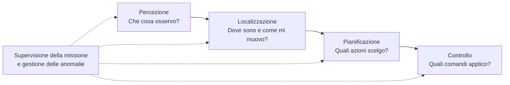
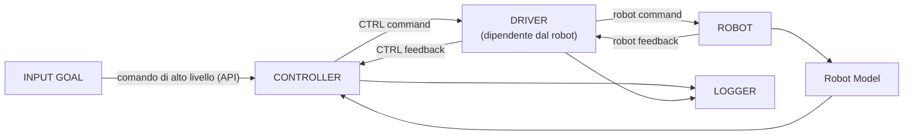
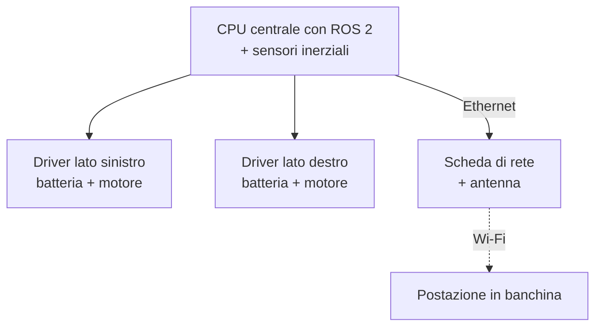

---

## lezione: 2 data: 2026-10-05 argomenti: [AGV e AMR, manipolatori mobili, robot aerei, field robotics, robotica medica, robotica indossabile, umanoidi, soft robotics, robotica marina, navigazione subacquea, deriva, sistemi multi-robot, ROS 2, sistemi di riferimento, punti e vettori, matrici di rotazione, SO(2), interpretazione attiva e passiva]

---
# Lezione 2 — Completamento della panoramica e introduzione ai sistemi di riferimento

## 1. Informazioni pratiche: attività per studenti

In apertura il docente ha segnalato alcune occasioni per fare esperienza pratica di robotica in dipartimento. I link verranno messi a disposizione online.

- Il laboratorio **GRAAL** (al secondo piano) partecipa a competizioni di robotica marina. Al momento non ce ne sono di attive, ma potrebbero aprirsene durante l'anno.
- Il **team Elettra** è uno _student team_ dell'Università di Genova composto quasi interamente da studenti. Progetta **veicoli autonomi marini di superficie** e partecipa a gare in cui si misurano tempo, precisione ed energia utilizzata. È complementare al GRAAL, che lavora soprattutto sulla robotica sottomarina.
- Un secondo gruppo studentesco dell'ateneo porta avanti progetti di vario tipo: robotica aerea, meccatronica, un braccio robotico.

Partecipare a uno _student team_ è un buon modo per «mettere le mani in pasta». Come anticipa il corso, passare «dalla carta al ferro» complica decisamente le cose.

## 2. Riepilogo della lezione precedente

Il docente ha riassunto rapidamente quanto visto nella [[Zen/Anno 2/Robotica/Modulo 1/generated/Lezione 1 - CLAUDE|Lezione 1 - CLAUDE]]:

- le definizioni di robot e di autonomia;
- il ciclo di controllo e il feedback;
- la classificazione su più assi;
- i primi tipi di robot, con i manipolatori seriali e paralleli, la manipolabilità e gli utensili;
- la robotica collaborativa con le sue modalità.

La lezione completa la panoramica sulle tipologie di robot e poi avvia il tema dei **sistemi di riferimento**.

## 3. Robot mobili in logistica: AGV e AMR

### 3.1 _Automated_ non significa _autonomous_

Nella robotica mobile per la logistica si distinguono due famiglie (slide 33). La differenza sta nell'**autonomia nella navigazione**.

- **AGV** (_Automated Guided Vehicle_): veicolo **automatizzato** a guida vincolata.
- **AMR** (_Autonomous Mobile Robot_): robot mobile **autonomo**.

Il docente ha insistito sulla differenza tra _automated_ e _autonomous_.

Un AGV esegue in cascata una serie di operazioni programmate **a priori**, ma **non prende decisioni autonome**. In particolare, non aggira gli ostacoli: se ne incontra uno si ferma o esegue una risposta prevista in anticipo. Un AMR, invece, pianifica il proprio percorso e lo **ripianifica** quando trova un ostacolo.

|Specifica|AGV|AMR|
|---|---|---|
|Percorso|Predisposto e vincolato|Pianificato e aggiornabile|
|Navigazione|Guide o riferimenti, anche naturali|Mappa e sensori di bordo|
|Ostacolo|Arresto o risposta prevista|Arresto, attesa o ripianificazione|
|Workflow|Flussi ripetitivi e ben organizzati|Maggiore flessibilità di percorso|

### 3.2 Vantaggi e costi delle due soluzioni

Le due soluzioni servono scopi diversi.

**AGV.** La configurazione è più semplice e strutturata, quindi la programmazione è più facile. Il veicolo è anche più **spedito**, perché deve solo seguire un percorso predefinito. È adatto a flussi di lavoro ripetitivi, molto organizzati e statici.

**AMR.** Il veicolo è più «intelligente» e si adatta ad ambienti meno strutturati. In cambio bisogna gestire percezione e ripianificazione, e le criticità aumentano. Se due veicoli decidono contemporaneamente di cambiare strada, possono finire per scontrarsi, e anche questa casistica va gestita. Gli AMR sono inoltre più lenti, perché a volte devono fermarsi e ripianificare.

Più autonomia significa più adattabilità ma anche più complessità. È un compromesso che si ritrova a tutti i livelli della robotica. La slide avverte che si tratta di una **distinzione pratica**: i confini tra prodotti commerciali possono sovrapporsi.

## 4. Manipolatori mobili

Se si combinano una base mobile e un braccio si ottiene un **manipolatore mobile** (slide 35). Ne sono esempi il KUKA youBot e le piattaforme di Agile Robots. Sono molto usati oggi nei grandi magazzini della logistica per catalogare, prelevare e preparare le spedizioni.

|Componente|Funzione|
|---|---|
|Base mobile|Porta il robot vicino al luogo di lavoro|
|Braccio|Posiziona l'utensile rispetto all'oggetto|
|Coordinamento|Collega navigazione, percezione e presa|

La caratteristica chiave è il **coordinamento**. Per un essere umano coordinare gambe e braccia è automatico. Per un robot base e braccio sono due sistemi separati, ciascuno con il proprio controllo, e le due informazioni vanno messe insieme.

Supponiamo che l'oggetto da prendere sia fuori portata. Il robot deve spostare la base, sapere dove si trova il proprio utensile rispetto alla base e la base rispetto al mondo, e solo allora afferrare l'oggetto. Tutti questi passaggi da un riferimento all'altro (base, braccio, utensile) sono l'oggetto della seconda parte di questa lezione.

Ne segue un'osservazione importante: **l'errore di localizzazione della base influisce anche sulla manipolazione**. Se la base crede di essere in un punto diverso da quello reale, anche il braccio mancherà l'oggetto.

## 5. Robot aerei

### 5.1 Multirotori, ala fissa e configurazioni ibride

I robot aerei hanno sigle diverse (slide 36): **UAV** (_Unmanned Aerial Vehicle_, velivolo senza pilota a bordo), **AAV** (_Autonomous Aerial Vehicle_, velivolo aereo autonomo) e **UAS** (_Unmanned Aircraft System_, il sistema completo di velivolo e componenti di supporto).

Rispetto alla robotica terrestre cambia un aspetto fondamentale. Un robot a terra, per quanto complesso, se si ferma resta fermo. Un robot aereo deve **vincere continuamente la gravità**.

|Tipo|Vantaggi|Limiti|
|---|---|---|
|Multirotore|Decollo verticale e volo stazionario|Consumo continuo per sostenersi|
|Ala fissa|Portanza durante il volo in avanti|Richiede una strategia di lancio e recupero|
|Configurazioni ibride|Combinano modalità di volo|Aggiungono complessità meccanica e di controllo|

**Multirotori.** Hanno una grande mobilità, ma anche un **grande consumo energetico**, perché le eliche devono sostenere il velivolo in ogni istante. Un drone di questo tipo vola in genere da un quarto d'ora a mezz'ora al massimo, e la missione va pianificata con cura in base a questo limite. Non basta montare una batteria più grande: più il drone è grande, più pesa e più consuma. Esiste una dimensione intermedia ottimale. Si evitano così i micro-droni che non riescono a fare nulla di utile e i velivoli troppo pesanti che volano solo pochi minuti.

Lo stesso vale per il **carico utile** (_payload_), cioè quanto il drone può trasportare. Per droni di circa 45–50 cm di lato il docente ha indicato un ordine di grandezza di circa un chilogrammo. Caricarne cinque significherebbe ridurre l'autonomia a pochi istanti.

**Ala fissa.** È in qualche modo più facile da controllare: il moto è più «direzionato» e la portanza si genera con il volo in avanti. La manovrabilità però è ridotta. Il velivolo non può spostarsi in tutte le direzioni né restare fermo in aria. La differenza ricorda quella tra un veicolo con ruote sterzanti e una piattaforma olonoma.

La scelta dipende da **missione, durata, carico e spazio disponibile**.

### 5.2 Lo stato di un multirotore

Per un robot nello spazio lo stato si allarga (slide 37). Le **variabili di stato** sono il numero minimo di variabili che descrivono adeguatamente il sistema. Nello spazio un corpo rigido ha **6 gradi di libertà**: 3 di posizione e 3 di orientamento. Quindi

$$\mathbf{x} = \begin{bmatrix} x & y & z & \phi & \theta & \psi \end{bmatrix}^{T}.$$

Le prime tre componenti danno la posizione. Gli angoli $\phi$, $\theta$, $\psi$ danno l'orientamento e sono comunemente associati a rollio, beccheggio e imbardata (_roll, pitch, yaw_). Nel piano, invece, bastavano $x$, $y$ e un solo angolo attorno a $z$.

Questo è un modello molto semplificato. Nella realtà il vettore di stato comprende spesso anche le **velocità** (le derivate prime $\dot x, \dot y, \dot z, \dots$) e magari le **accelerazioni** (le derivate seconde $\ddot x, \dots$). Con le velocità le variabili diventano 12, con anche le accelerazioni 18.

Un multirotore deve svolgere tre funzioni:

- **stima**: ricostruire assetto e movimento da sensori e modelli;
- **controllo**: regolare rapidamente le velocità dei rotori;
- **missione**: gestire il percorso, i punti da osservare, l'atterraggio.

> [!important] L'IMU da sola non basta L'IMU non fornisce da sola una stima **assoluta, completa e priva di deriva**. Per stimare assetto e posizione bisogna **fondere** le sue misure con quelle di altri sensori.

Per i vincoli energetici, il calcolo a bordo si affida a **microcontrollori** ben calibrati, non a processori potenti e affamati di energia. Esistono piattaforme dedicate al controllo dei velivoli, come **ArduPilot**, nata da Arduino e ottimizzata per il controllo di veicoli aerei. Queste soluzioni commerciali si montano sul drone e gestiscono, almeno in prima istanza, gran parte delle funzioni di base.

## 6. Robotica sul campo (_field robotics_)

La robotica sul campo riguarda robot che operano all'aperto, in ambienti non preparati (slide 38).

|Scenario|Compito|Problema caratteristico|
|---|---|---|
|Agricoltura|Osservare colture o intervenire sulle piante|Terreno variabile, vegetazione, delicatezza|
|Ispezione e soccorso|Raccogliere dati in luoghi difficili|Accesso, robustezza, comunicazione|
|Esplorazione planetaria|Muoversi e acquisire misure scientifiche|Terreno incerto, supervisione a distanza|

L'**esplorazione planetaria** è il caso più estremo. Una volta su Marte non si può tornare indietro a prendere qualcosa di dimenticato: tutto deve essere progettato perché funzioni da solo, con una supervisione remota e lontanissima.

L'esempio della slide 39 è il rover **Perseverance** della NASA, un sistema molto complesso con a bordo tutti i tipi di sensori discussi finora:

- telecamere di navigazione e per evitare gli ostacoli;
- telecamere e strumenti che operano anche al di fuori dello spettro visibile;
- sensori inerziali;
- un braccio robotico con strumenti aggiuntivi, tra cui un trapano che preleva campioni di roccia e li conserva in tubi sigillati.

Perseverance usa un sistema chiamato **AutoNav** per scegliere autonomamente percorsi locali e aggirare gli ostacoli. La slide 39 è un'infografica dettagliata degli strumenti: è utile consultarla.

Il rover è stato accompagnato da un piccolo elicottero (Ingenuity) con due rotori coassiali, cioè sovrapposti sullo stesso asse.

> [!warning] Discrepanza tra trascrizione e slide sull'elicottero marziano A lezione il docente ha detto che l'elicottero era pensato per recuperare o trasportare eventualmente dei campioni. La slide 39 lo descrive invece come un **volo di prova**: un dimostratore tecnologico non essenziale per gli obiettivi scientifici principali della missione, pensato per verificare la possibilità del volo nell'atmosfera marziana. Secondo la gerarchia delle fonti vale la descrizione della slide.

## 7. Robotica medica e di servizio

### 7.1 Robotica medica

La slide 40 distingue due usi principali.

- **Medicina** (chirurgia): il chirurgo guida gli strumenti da una console. Il sistema **da Vinci** è un esempio di **teleoperazione assistita**.
- **Riabilitazione**: il robot assiste o misura il movimento del paziente.

Il robot chirurgico si usa perché la mano umana è soggetta a **tremori** e a **stanchezza**. Alcune operazioni, per esempio quelle cerebrali, possono durare anche 12 ore, e a un certo punto anche il medico si esaurisce. Il robot, se ben progettato, **sta fermo**. Toglie così carico al chirurgo e permette di eseguire con grande precisione anche operazioni molto lunghe.

I bracci del da Vinci (già visti nella lezione 1) combinano giunti disposti in modo parallelo con altri giunti. Rispetto a una catena seriale semplice, questa configurazione è più rigida e restituisce posizioni più precise, cosa indispensabile in chirurgia.

### 7.2 Robotica di servizio

La **robotica di servizio** (slide 41) comprende robot per pulizia, consegna, assistenza e interazione con le persone. Un esempio sono i robot camerieri come SERVI+ di Bear Robotics.

Le slide 40 e 41 si chiudono con la stessa frase: **il settore d'uso descrive lo scopo, non determina l'autonomia**. Un robot «medico» o «di servizio» può essere teleoperato, assistito o autonomo. Il settore e l'autonomia sono assi diversi della classificazione.

## 8. Umanoidi, robot indossabili e _soft robotics_

La slide 42 raccoglie tre famiglie distinte da criteri diversi: **forma, materiali e relazione con il corpo**.

### 8.1 Robotica indossabile

Nella **robotica indossabile** il sistema si accoppia alla persona. L'esempio tipico è l'**esoscheletro motorizzato** usato in riabilitazione. È una ricerca di frontiera con problemi di sicurezza molto seri: si stanno accoppiando motori, anche potenti, allo scheletro di una persona. Un errore di progettazione o di software può causare lesioni, per esempio rompere una gamba.

Il sistema deve quindi:

- **limitare le forze**, senza mai applicarne di eccessive;
- **bloccarsi** in caso di anomalia;
- rispettare **limiti** di movimento.

A questo si aggiunge la programmazione del moto, che deve essere davvero **riabilitativa**.

### 8.2 Umanoidi e _uncanny valley_

Un **umanoide** ha una forma che richiama il corpo umano. La ricerca su questi robot è attiva da tempo: la slide mostra ASIMO di Honda, del 2000. Oggi è una delle frontiere della robotica. Si cerca di riprogettare le meccaniche del corpo umano per costruire robot con la nostra forma. Le motivazioni sono diverse; una è rendere il robot più simile a noi e quindi **meno estraneo**. Le implicazioni etiche non sono state approfondite.

La slide precisa che **la forma umanoide non implica intelligenza generale**.

Il docente ha introdotto il grafico della _**uncanny valley**_ (_uncanny_ significa inquietante, perturbante). È un grafico qualitativo, che non va preso alla lettera ma descrive un fenomeno reale.

- Sull'asse orizzontale c'è la **somiglianza del robot all'essere umano**.
- Sull'asse verticale c'è la **familiarità** o il **gradimento** che suscita in noi.

La curva ha tre tratti.

1. **Bassa somiglianza.** Un robot che non ha nulla di umano non mette a disagio: è semplicemente diverso da noi.
2. **La valle.** Aumentando la somiglianza il gradimento cresce, fino a un punto in cui il robot è **simile, ma non abbastanza**. Lì il gradimento crolla. Capita vedendo robot quasi umani in cui si scorgono parti meccaniche: il nostro cervello percepisce che «qualcosa non torna».
3. **Somiglianza quasi perfetta.** Quando il robot diventa indistinguibile da un essere umano il disagio scompare. Questo tratto è però difficilissimo da raggiungere.

Molti umanoidi cadono proprio nella valle. Con silicone e metallo è difficile riprodurre un corpo biologicamente vivo: il colorito della pelle, le microespressioni del volto.

> [!tip] Excalidraw Il grafico della _uncanny valley_ è stato disegnato alla lavagna e non compare nelle slide. Uno schizzo a mano della curva (somiglianza sull'asse orizzontale, familiarità sull'asse verticale, con la valle poco prima della somiglianza piena) aiuterebbe a fissarlo.

> [!tip] Approfondimento — L'origine della _uncanny valley_ #approfondimento L'ipotesi fu formulata dal robotico giapponese Masahiro Mori in un saggio del 1970 (_Bukimi no tani_), pubblicato sulla rivista giapponese _Energy_. La prima traduzione inglese autorizzata e rivista dall'autore, a cura di K. F. MacDorman e N. Kageki, è apparsa nel 2012 su _IEEE Robotics & Automation Magazine_ [@mori2012]. Nel saggio Mori osserva anche che il **movimento** accentua l'effetto: rende più ripidi i due versanti della valle.

### 8.3 _Soft robotics_

Nella _**soft robotics**_ parti deformabili, fatte di **materiali morbidi**, contribuiscono al movimento. Spesso l'azionamento sfrutta le **differenze di pressione**.

La slide mostra una pinza a forma di stella in silicone (Princeton Engineering, 2021). È collegata a un sistema pneumatico che aspira l'aria: aspirandola la stella si chiude e afferra un oggetto delicato senza danneggiarlo.

Lo scopo della _soft robotics_ è **interagire con oggetti che non devono essere forzati**. Per questo ha implicazioni anche nella robotica umanoide e in quella chirurgica, dove si cerca di essere il meno invasivi possibile. Un esempio ancora più esotico è un drone con un «tentacolo di polpo» morbido, che aspirando l'aria si avvolge attorno a un oggetto e lo trasporta.

Uno studente ha chiesto dei sistemi **a cavi** (_tendon-driven_). Sono robot azionati da tendini, usati soprattutto nelle mani robotiche: un dito di questo tipo, ingrandito, potrebbe svolgere la stessa funzione del tentacolo. Il confronto mostra il compromesso.

- **Pinza morbida pneumatica**: una struttura di silicone stampata con un solo azionamento, l'aspirazione dell'aria, e quindi un solo grado di libertà (aperta/chiusa). È molto semplice.
- **Mano a tendini**: tanti piccoli motori collegati. È più complessa, ma anche più funzionale.

## 9. Robotica marina

### 9.1 Tre piattaforme del GRAAL

Le tre piattaforme della slide 43, usate nel laboratorio del docente, coprono i principali ambiti della robotica marina. Sono ordinate per profondità e autonomia crescenti.

|Sigla|Piattaforma|Tipo|Modalità|
|---|---|---|---|
|ASV / USV|Ulisse|Veicolo di superficie (catamarano)|Missioni di rilievo e supporto|
|ROV|BlueROV|Veicolo subacqueo con cavo|Teleoperazione e assistenza|
|AUV|X300|Veicolo subacqueo senza cavo|Missione autonoma a bordo|

Le sigle stanno per _Autonomous/Unmanned Surface Vehicle_, _Remotely Operated Vehicle_ e _Autonomous Underwater Vehicle_.

**Ulisse (superficie).** È un catamarano che si muove **sul piano**. Il suo stato essenziale è $(x, y, \psi)$, dove per l'angolo di rotta attorno a $z$ si usa spesso $\psi$. Si muove con lo stesso principio del robot differenziale, con due motori a poppa.

Già qui la situazione è più complessa che a terra, perché sotto c'è l'acqua. A terra stimare lo spostamento dagli encoder delle ruote non è banale e non è mai preciso. In acqua capire di quanto è avanzato il veicolo dalla rotazione di un'elica è ancora più difficile, perché l'acqua non offre un punto di appoggio fisso. In superficie aiuta molto il **GPS**, che però ha un'accuratezza tipica attorno al mezzo metro o al metro. Può bastare oppure no, a seconda dell'applicazione.

Servono comunque **modelli molto più complessi**, che tengano conto degli effetti idrodinamici:

- la **spinta di Archimede**;
- le cosiddette **masse aggiunte**. Un corpo che accelera in acqua deve mettere in moto anche una parte dell'acqua circostante, e dinamicamente si comporta come se avesse una massa maggiore.

**BlueROV (ROV).** Il primo passo sott'acqua è un veicolo **con cavo**. I ROV tradizionali, usati per esempio per ispezionare le piattaforme petrolifere, sono oggetti grandi: un metro e mezzo per un metro e mezzo, tutti in metallo, pesanti. Per metterli in acqua servono una nave d'appoggio e un argano.

Da qualche anno sono comparse piattaforme molto più piccole, come il BlueROV, di circa 60 × 50 cm. Si mettono in acqua facilmente e vi si può montare molta sensoristica per esperimenti interessanti. Il laboratorio lo sta usando per la **mappatura dei fondali** con un sensore acustico. La difficoltà è ricostruire una mappa completa a partire da osservazioni istantanee, un tema che verrà approfondito nell'altra parte del corso.

**X300 (AUV).** Lo stadio successivo è la robotica **autonoma** sott'acqua. Il filo visibile nella foto non è un cavo di comunicazione, ma una semplice cima per maneggiare il veicolo. Gli AUV hanno a bordo tutti i sensori necessari a muoversi da soli. La loro forma è adatta a **missioni a lungo raggio**: affusolata, con un attrito idrodinamico molto minore di quello del BlueROV. Il BlueROV ha la forma di un parallelepipedo che oppone molta resistenza, ma è modulare e permette di montare i sensori dove si vuole.

Con gli AUV si possono svolgere operazioni autonome complesse. Il docente ha citato un progetto per la **batimetria**, cioè la misura della profondità del fondale, in contesti oceanici e non solo costieri. Diversi AUV navigano in formazione, si scambiano dati sott'acqua e costruiscono la mappa del fondale un pezzo alla volta. È molto più difficile da gestire: una volta che il veicolo si è immerso, si comunica solo per via acustica e con pochissima banda.

### 9.2 Sott'acqua cambiano sensori e comunicazione

La slide 44 riassume i vincoli dell'ambiente subacqueo.

|Vincolo|Effetto|Alternativa|
|---|---|---|
|Attenuazione elettromagnetica|GNSS e sistemi radio non funzionano in immersione|Stima inerziale, DVL, riferimenti acustici|
|Visibilità e illuminazione|La camera può osservare poco lontano|Sonar, illuminazione e sensori complementari|
|Collegamento acustico|Banda e latenza limitano lo scambio dati|Decisioni a bordo e supervisione|
|Correnti ed energia|Il movimento reale differisce dalla pianificazione|Controllo, riserva energetica e recupero|

GNSS (_Global Navigation Satellite System_) è il nome generico dei sistemi di posizionamento satellitare, di cui il GPS è il più noto.

**Attenuazione elettromagnetica.** L'acqua assorbe fortemente le onde elettromagnetiche: quasi tutte le radiofrequenze vengono assorbite. Un segnale radio sott'acqua arriva a circa un metro, forse due. Quindi niente GPS, niente Wi-Fi: tutto ciò su cui ci si appoggia normalmente a terra non è più disponibile. Servono sistemi e **modelli molto accurati**.

Il posizionamento si basa allora sulla **stima inerziale**, cioè sui sensori propriocettivi (accelerometri e giroscopi). Questi misurano le forze apparenti dovute al moto: è la stessa sensazione che si prova cadendo, quando si percepisce una forza apparente verso l'alto. Il robot capisce così di muoversi in una certa direzione anche senza riferimenti esterni.

Un'eccezione è il **DVL** (_Doppler Velocity Log_), che misura la **velocità del veicolo rispetto al fondale**. Il sensore, rivolto verso il basso, emette **quattro fasci acustici**. Dal ritorno dei fasci, sfruttando l'**effetto Doppler** (lo spostamento di frequenza dell'onda riflessa dovuto al moto relativo), ricava la velocità relativa. Se il fondale è fermo, quella è la velocità del veicolo.

Il DVL funziona solo con il fondale in vista (_bottom lock_). Anche allora le misure hanno grandi incertezze, per riflessioni anomale o attenuazioni del fondale.

**Collegamento acustico.** La banda acustica è **molto minore** di quella radio o Wi-Fi, dell'ordine dei kilobit al secondo. Bisogna scegliere con cura che cosa trasmettere a una stazione di superficie o al porto:

- informazioni compatte come posizione, orientamento, un bersaglio individuato, lo stato del sistema;
- non uno stream video, ma al più qualche immagine molto piccola (per esempio 32 × 32 pixel in bianco e nero) ogni tanto.

Lo **stream video** è possibile solo con un ROV, che ha un cavo (fibra ottica o Ethernet) collegato alla superficie. Il cavo può portare anche l'**alimentazione**. Senza cavo, invece, si comunica solo acusticamente e l'energia è solo quella a bordo, da ottimizzare al massimo.

**Correnti ed energia.** Esiste un'intera branca di studio sul **muoversi sott'acqua tenendo conto delle correnti**. Se si conosce la corrente, si può scegliere un percorso più lungo che però va meno controcorrente e consuma meno energia.

La slide conclude: **lo stesso compito può richiedere sensori diversi in ambienti diversi**.

### 9.3 La deriva e come correggerla

Uno studente ha chiesto se i sensori di movimento siano per definizione «accumulatori di errore». Il docente ha risposto che sì, è uno dei problemi principali della **localizzazione**, cioè del sapere dove ci si trova. Si chiama **deriva** (_drift_).

> [!example] Esempio: come si accumula la deriva Supponiamo che la stima di spostamento abbia un errore di 1 mm per ogni metro percorso, cioè lo 0,1%. Dopo 100 m l'errore è di 10 cm. Continuando a muoversi l'errore cresce ancora: dopo 1 km è di 1 m. Senza correzioni dall'esterno non smette di aumentare.

**In superficie e a terra** la deriva si corregge con **riferimenti fissi** di posizione nota.

- **GPS**: usato in modo intelligente, fornisce aggiustamenti periodici della posizione stimata.
- **Marker visivi**: al chiuso il GPS non c'è. Si possono applicare alle pareti marker simili ai QR code, di posizione nota. Quando il robot ne inquadra uno, sapendo dov'è la camera rispetto al robot ricava dove si trova e corregge l'errore. I marker sul ponte di Ulisse, nella slide 43, servono allo stesso scopo per l'atterraggio del drone.
- **Beacon**: piccoli trasmettitori radio che comunicano la propria posizione, rispetto alla quale il robot si localizza.

In ogni caso un **modello accurato** è indispensabile. Se il modello è sbagliato, la stima deriva fin dall'inizio.

**Sott'acqua** nessuno di questi sistemi è disponibile, e il problema della deriva nella navigazione subacquea è **tuttora aperto**. Una soluzione è una **catena di posizionamento**.

1. Un veicolo di superficie (anche un'imbarcazione) conosce la propria posizione grazie al GPS.
2. Con un sensore acustico immerso, misura la posizione del veicolo subacqueo rispetto a sé e gliela comunica insieme alla propria posizione GPS.
3. Combinando le due informazioni, il veicolo subacqueo ricava dove si trova.

Più raramente si posano sul fondale dei **transponder** di posizione nota, che svolgono lo stesso ruolo. A grandi profondità, per esempio 2000 m, comunicare in modo affidabile con la superficie è difficile. Le onde acustiche non viaggiano in linea retta ma **si incurvano** propagandosi, perché le proprietà dell'acqua cambiano con la profondità.

## 10. Sistemi multi-robot

Nei **sistemi multi-robot** al coordinamento interno di un singolo robot (per esempio tra base e braccio) si aggiunge il **coordinamento tra più robot** (slide 45). I robot comunicano e si coordinano tra loro.

|Applicazione|Esempio di problema|
|---|---|
|Logistica|Assegnazione dei compiti e gestione del traffico, per esempio in un magazzino con molti oggetti e molti robot|
|Monitoraggio|Copertura di un'area e fusione delle osservazioni, come nella mappatura con più veicoli|
|Intervento|Coordinamento tra veicolo di supporto e ROV|

La robotica di **intervento** è particolarmente interessante e difficile. Riguarda applicazioni di frontiera in territori molto inospitali, come zone terremotate o fondali dove qualcosa o qualcuno è rimasto bloccato. Lì i robot vanno coordinati con grande cura.

Come nota la slide, con più robot **aumentano le risorse disponibili, ma anche i problemi di coordinamento**.

## 11. Il contributo dell'ingegneria informatica

### 11.1 Le funzioni di un'architettura software robotica

Per un ingegnere informatico conoscere tutte queste tipologie serve a capire il contesto in cui si lavora. L'obiettivo è costruire **architetture software adatte allo scopo**. La slide 46 organizza le funzioni software di un robot in una catena, dalle misure ai comandi fisici.

- La **percezione** lavora sulle misure.
- **Localizzazione** e **pianificazione** costituiscono l'elaborazione.
- Il **controllo**, di più basso livello, decide come comandare i motori per realizzare ciò che la pianificazione ha scelto. Produce i comandi fisici.
- La **supervisione della missione** e la **gestione delle anomalie** sovrintendono a tutto, perché il sistema funzioni correttamente.

La slide aggiunge: **dati incerti, tempi di esecuzione e guasti influenzano il comportamento fisico**. Un errore software, in robotica, si traduce in un movimento sbagliato nel mondo reale.

### 11.2 Middleware: ROS 2

Per implementare tutto questo si usano architetture software già esistenti. Lo strumento standard in robotica, che nel corso verrà visto marginalmente, è **ROS** (_Robot Operating System_), oggi nella versione **ROS 2**. Non è un sistema operativo in senso stretto ma un **middleware**: uno strato di software tra il sistema operativo e l'applicazione, che fornisce un'infrastruttura comune.

Secondo la slide 47, ROS si basa su tre elementi.

|Elemento|Significato|
|---|---|
|Nodo|Un'unità software del sistema, che può realizzare una o più funzioni; per esempio, leggere un sensore|
|Messaggi|Dati con significato, unità di misura e riferimento dichiarati|
|Interfacce|Flussi di dati, richieste, obiettivi con feedback|

Ogni funzione (percezione, localizzazione, pianificazione, controllo) è realizzata da uno o più **nodi**, cioè processi, che comunicano tra loro scambiandosi **messaggi** attraverso **interfacce**. Lo schema della slide mostra due modalità di comunicazione.

- Il _**topic**_: un nodo **pubblica** (_publisher_) messaggi su un canale con nome, e uno o più nodi vi si **iscrivono** (_subscriber_) per riceverli. È il flusso continuo di dati.
- Il _**service**_: un nodo **client** invia una **richiesta** (_request_) a un nodo **server**, che restituisce una **risposta** (_response_).

Il terzo tipo di interfaccia citato nella slide, gli «obiettivi con feedback», corrisponde in ROS 2 alle _**action**_. Sono richieste di lunga durata che forniscono aggiornamenti durante l'esecuzione.

Il vantaggio di un middleware è avere già **un'infrastruttura pronta**. Altrimenti bisognerebbe costruirsi da zero:

- la comunicazione tra processi;
- il meccanismo di scambio dei messaggi;
- la loro codifica e decodifica.

ROS offre anche **strumenti di compilazione**. Ogni componente usa CMake per ottimizzare la compilazione, e più componenti si raggruppano in un'unica build. Con un solo comando si possono compilare decine di eseguibili; il docente ha citato il caso di 40. Nei sistemi robotici complessi capita spesso.

La slide si chiude con questa sintesi: **ROS 2 offre strumenti per collegare moduli e costruire applicazioni robotiche**.

> [!tip] Approfondimento — ROS 2 #approfondimento Il riferimento ufficiale per ROS 2 è l'articolo di Macenski, Foote, Gerkey, Lalancette e Woodall pubblicato su _Science Robotics_ nel 2022 [@macenski2022]. L'articolo spiega perché ROS 1 non era adatto a molte esigenze di produzione e descrive la riprogettazione di ROS 2: modularità, scalabilità, affidabilità. Presenta anche casi di studio su terra, aria, mare e spazio. Nella documentazione ufficiale di ROS 2, lo strumento che raggruppa e compila più pacchetti in un'unica build è **colcon**.

### 11.3 Un esempio di architettura

La slide 48 mostra un'architettura generica, tratta dal lavoro di dottorato del docente.

Ogni blocco è un nodo ROS (o un gruppo di nodi) e i blocchi comunicano attraverso **API** (_Application Programming Interface_), cioè interfacce ben definite, e messaggi.

- L'**input goal** fornisce il comando di alto livello, per esempio da joystick o da un'interfaccia.
- Il **controller** calcola i comandi di controllo e li invia al **driver**.
- Il driver, l'unico componente **dipendente dal robot specifico**, traduce i comandi in comandi per il **robot** e ne riceve il feedback.
- Un **modello del robot** simula che cosa succederebbe dando un certo comando.
- Un nodo di **logging** registra tutto ciò che accade.

### 11.4 Un esempio concreto: il catamarano Ulisse

La slide 49 mostra un «esploso» del catamarano Ulisse, per far vedere come tutto ciò si traduce in un sistema reale. Gli elementi essenziali sono:

- una **CPU** centrale, alloggiata in un contenitore stagno, insieme ai sensori inerziali e alle schede di controllo delle altre parti del robot;
- il **pacco batterie**;
- l'**attuazione**: due motori marini, uno per scafo;
- un'**antenna di comunicazione**, per parlare con il robot via Wi-Fi dalla banchina.

Sul veicolo gira **ROS 2**. Ci sono due scafi, quindi due batterie e due motori, e per ciascun lato c'è un driver dedicato che gestisce batteria e motore. I comandi ai due lati vanno però decisi in modo congiunto. Una scheda di rete, collegata via Ethernet all'antenna, permette la comunicazione con la terraferma.

Nella pratica, mettere insieme un sistema così è molto complesso, ma è la prassi in qualunque piattaforma robotica. Bisogna:

1. capire come collegare i componenti hardware;
2. conoscere le interfacce di batterie e motori e i **protocolli** con cui comunicano;
3. passare dal basso livello fino alla CPU, un passo alla volta.

### 11.5 La scelta parte dalla missione

La panoramica si chiude con una sintesi metodologica (slide 50). La scelta di una piattaforma parte sempre dalla **missione**, che è il «faro guida». Subito dopo viene l'**ambiente**, perché a seconda di dove si opera le soluzioni cambiano completamente.

|Aspetto|Domanda|
|---|---|
|Compito|Che cosa deve fare, e con quale criterio di successo?|
|Ambiente|Quali superfici, ostacoli, persone e disturbi incontrerà?|
|Risorse|Quali energia, carico utile e comunicazioni sono disponibili?|
|Autonomia|Quali decisioni può prendere, e quando chiede aiuto?|

> [!important] Criterio di progetto Una soluzione è **motivata** quando ogni scelta risponde a un requisito.

Il glossario essenziale della slide 51 fissa la terminologia del corso.

|Termine|Significato nel corso|
|---|---|
|Posa / configurazione|Posizione e orientamento / variabili indipendenti del robot|
|Stima / pianificazione|Ricostruire lo stato / scegliere azioni o percorsi|
|Controllo / supervisione|Realizzare i riferimenti / gestire missione e anomalie|
|AGV / AMR|_Automated Guided Vehicle_ / _Autonomous Mobile Robot_|
|ROV / AUV / ASV|_Remotely Operated_ / _Autonomous Underwater_ / _Autonomous Surface Vehicle_|

## 12. Perché servono i sistemi di riferimento

La slide 54 introduce il nuovo tema con una domanda: «_L'oggetto è un metro davanti._» Davanti **a chi**? La camera, la base del robot e il mondo possono descrivere **lo stesso punto con coordinate diverse**.

Nella scena della slide compaiono quattro terne:

- il **mondo** $\langle w\rangle$;
- la base del **robot** $\langle b\rangle$;
- la **camera** $\langle c\rangle$ montata sul robot;
- l'**oggetto** $\langle o\rangle$ osservato dalla camera.

Nel mondo si può fissare un riferimento a piacere, al centro di una stanza o in un angolo, e dichiararlo origine $(0,0)$. Ma il robot dove si trova, e rispetto a che cosa sono espresse le sue coordinate?

- **All'aperto**, con il GPS, le coordinate sono latitudine e longitudine, universali rispetto alla Terra.
- **Più spesso** si usano coordinate **locali** $x, y, z$ in metri.

In ogni caso bisogna decidere dove sta la terna del mondo e dove quella del robot. Il robot ha poi un sensore, per esempio una camera: dove sta la camera rispetto al robot? La camera osserva un oggetto: dove sta l'oggetto rispetto alla camera, che è rispetto al robot, che è rispetto al mondo?

Nasce così una **catena di trasformazioni** che bisogna saper gestire. Come dice la slide, servirà collegare riferimenti e trasformazioni per percepire e agire.

> [!warning] La fonte più frequente di errori Secondo il docente, nelle applicazioni robotiche il problema principale è quasi sempre l'**applicazione scorretta dei sistemi di coordinate**. Quando il robot va in un punto sbagliato o ruota in modo strano, la causa è spesso una terna definita male. Se per esempio la terna della camera è montata ruotata di 90° rispetto a come si crede, il robot «vede» l'oggetto in un'altra direzione e ci va. Capire bene sistemi di riferimento e coordinate è un obiettivo fondamentale per capire la robotica in generale.

Lo stesso vale per un **manipolatore**. Si colloca una terna su ogni giunto (giunto 0, giunto 1, …) e una terna sull'utensile, il _tool frame_. Per sapere dove si trova l'utensile bisogna **concatenare** tutte le trasformazioni tra terne successive. C'è poi la terna del mondo, rispetto alla quale si trova il robot. Per afferrare un oggetto che è in un punto dello spazio bisogna sapere come sono disposte tutte queste terne nello spazio. Entra quindi in gioco tutta una serie di **cambi di coordinate**.

## 13. Sistemi di riferimento nel piano: notazione e strumenti

### 13.1 Strumenti e convenzioni

Il docente darà per note le basi del calcolo matriciale. Ripeterà alcune nozioni soprattutto per fissare la **notazione**, che in robotica è essenziale per capire che cosa si sta facendo.

Per esercitarsi è previsto un piccolo simulatore pubblicato dal docente su GitHub, l'**EBR Simulator** (Elementi di Robotica). Il link verrà fornito quando lo si inizierà a usare.

- È scritto in **Python**, così non c'è nulla da compilare; serve solo un'installazione di Python. Il docente usa la versione 3.12, abbastanza comune e stabile.
- Gli esercizi consistono nel **completare delle funzioni** e vederne l'effetto in un **ambiente 3D**, confrontandolo con il comportamento di riferimento atteso.
- Il focus è sugli aspetti più tecnici e di basso livello: sistemi di riferimento, sensoristica, attuazione.

> [!important] Convenzioni del corso
> 
> - Gli angoli si esprimono sempre in **radianti** nei calcoli; i gradi si useranno solo per comodità di lettura.
> - Le lunghezze sono in **metri**, secondo il Sistema Internazionale.
> - Gli angoli sono **positivi in senso antiorario**, come è convenzione in fisica.

### 13.2 La terna di riferimento

Una terna (_frame_) ${a}$ nel piano è definita da un'**origine** e da due **versori** (vettori di lunghezza unitaria) che individuano gli assi:

$${a} = \big(O_a,; {}^{a}\mathbf{i}_a,; {}^{a}\mathbf{j}_a\big).$$

- $O_a$ è l'origine.
- ${}^{a}\mathbf{i}_a$ è il versore dell'asse $x_a$ e ${}^{a}\mathbf{j}_a$ quello dell'asse $y_a$, entrambi **espressi nella terna $a$ stessa**. Valgono banalmente $(1,0)^T$ e $(0,1)^T$.

> [!important] Lettura degli indici
> 
> - Il **pedice** (in basso a destra) indica **a che cosa si riferisce** la grandezza. ${}^{a}\mathbf{i}_b$ è il versore $x$ **della terna $b$**.
> - L'**apice a sinistra** (in alto a sinistra) indica **in quale sistema di riferimento** la grandezza è espressa, o proiettata. ${}^{a}\mathbf{i}_b$ è quel versore **espresso nelle coordinate della terna $a$**.
> 
> Nella definizione di ${a}$ la doppia indicazione può sembrare superflua. In seguito, però, quasi tutto avrà un apice che dice in che terna è espresso.

**Nomenclatura delle terne.** Nelle applicazioni si useranno nomi parlanti:

- $w$ per il mondo (_world_);
- $b$ per la base del robot;
- $s$ per un sensore (nella slide 54, $c$ per la camera e $o$ per l'oggetto).

Nelle derivazioni matematiche si useranno invece $a$, $b$, $c$. Così, in una concatenazione di trasformazioni, gli indici si seguono in ordine alfabetico ($c \to b \to a$ o viceversa) invece di sigle come $s$, $b$, $w$.

### 13.3 Il punto geometrico e le sue coordinate

Un **punto geometrico** $P$ è un oggetto fisico che sta in un certo posto dello spazio, indipendentemente da qualunque riferimento. Di per sé, però, non dice nulla di utilizzabile: per usarlo bisogna esprimerlo **rispetto a una terna**. Nella terna $a$ il punto ha le coordinate

$$ {}^{a}P = \begin{bmatrix} x_{P,a} \ y_{P,a} \end{bmatrix},$$

cioè l'ascissa e l'ordinata di $P$ misurate lungo gli assi di $a$, a partire da $O_a$.

Lo stesso punto ha in generale coordinate **diverse** in terne diverse:

$${}^{w}P ;\neq; {}^{b}P ;\neq; {}^{s}P .$$

Le coordinate coincidono solo nel caso in cui le terne coincidono, con robot e sensore entrambi nell'origine del mondo e orientati allo stesso modo. Nella pratica non capita mai.

## 14. Posizioni e spostamenti

### 14.1 La distinzione

In robotica bisogna distinguere con cura tra **posizioni** e **spostamenti**.

- Una **posizione** (un punto) identifica dove si trova qualcosa: il robot, un oggetto. È legata a un'**origine**: se si cambia sistema di riferimento, le sue coordinate cambiano.
- Uno **spostamento** è un **vettore**. Indica soprattutto una **direzione** (con un verso e un'intensità) ed è definito come **differenza tra due punti**. Non dipende dall'origine.

> [!important] Spostamento tra due punti Dati due punti $P$ e $Q$ espressi nella **stessa** terna $a$, il vettore spostamento che va **da $Q$ a $P$** è $${}^{a}(P - Q) ;=; {}^{a}\mathbf{v}_{P/Q} ;=; {}^{a}P - {}^{a}Q .$$ Invertendo la relazione si ottiene la regola per spostare un punto: $${}^{a}P ;=; {}^{a}Q + {}^{a}(P - Q).$$ Si parte da $Q$, si applica lo spostamento e si arriva in $P$. Il pedice $P/Q$ si legge «$P$ rispetto a $Q$», cioè la posizione di $P$ relativa a $Q$.

> [!warning] Verso del vettore $P - Q$ Nella trascrizione il docente descrive $P - Q$ come «il vettore che da $P$ va a $Q$». Si tratta di un lapsus: le formule della lezione e degli appunti, ${}^{a}P = {}^{a}Q + {}^{a}(P-Q)$, mostrano che $P - Q$ va **da $Q$ a $P$**. L'esempio seguente lo conferma.

> [!example] Esempio: spostamento di un utensile Un utensile si trova inizialmente in $Q$ e deve raggiungere $P$, con $${}^{a}Q = \begin{bmatrix} 1 \ 2 \end{bmatrix}, \qquad {}^{a}P = \begin{bmatrix} 3 \ 3 \end{bmatrix}.$$ Lo spostamento necessario è $${}^{a}\mathbf{v} = {}^{a}P - {}^{a}Q = \begin{bmatrix} 3 - 1 \ 3 - 2 \end{bmatrix} = \begin{bmatrix} 2 \ 1 \end{bmatrix}.$$ Verifica: ${}^{a}Q + {}^{a}\mathbf{v} = (1+2,; 2+1)^T = (3,3)^T = {}^{a}P$.

> [!warning] Mai sommare grandezze espresse in terne diverse Tutte le grandezze che compaiono in una somma o in una differenza devono essere **proiettate nella stessa terna**. Il docente ha raccomandato di non dimenticare mai l'apice: sommare coordinate di terne diverse non ha senso, matematicamente non torna. È un errore tipico e va segnalato subito.

### 14.2 Il vettore non dipende dall'origine

Il vettore ${}^{a}\mathbf{v}$ ottenuto come differenza di due punti si può **applicare** in punti diversi. Un punto, invece, è sempre ancorato all'origine della propria terna.

Si consideri una seconda terna ${b}$ con origine $O_b$ diversa da $O_a$ ma con **assi paralleli** a quelli di $a$. Il vettore spostamento ha in $b$ **le stesse componenti** che in $a$: è una differenza tra due punti e la scelta dell'origine si cancella nella sottrazione. Le coordinate dei singoli punti, invece, cambiano.

Se gli assi di $b$ sono **ruotati** rispetto a quelli di $a$, anche le componenti del vettore cambiano. Per passare dalle une alle altre serve la matrice di rotazione, introdotta tra poco.

> [!example] Esempio: coordinate di un punto in una terna traslata Siano ${w}$ il mondo e ${b}$ la terna del robot, con assi paralleli a quelli del mondo e origine in ${}^{w}O_b = (2, 1)^T$. Un oggetto ha coordinate ${}^{w}P = (5, 3)^T$. Le coordinate di $P$ nella terna del robot coincidono con le componenti del vettore che va da $O_b$ a $P$. Poiché gli assi sono paralleli, queste componenti sono le stesse calcolate nel mondo: $${}^{b}P = {}^{w}(P - O_b) = {}^{w}P - {}^{w}O_b = \begin{bmatrix} 5-2 \ 3-1 \end{bmatrix} = \begin{bmatrix} 3 \ 2 \end{bmatrix}.$$ Il punto è lo stesso ma le coordinate sono diverse: ${}^{w}P \neq {}^{b}P$. Se gli assi di $b$ fossero ruotati servirebbe anche una rotazione; il caso generale (rototraslazione) sarà trattato nella prossima lezione.

I vettori vanno trattati con attenzione anche quando si sceglie **chi** realizza uno spostamento. Il docente ha fatto l'esempio di un manipolatore mobile che deve raggiungere un oggetto spostandosi lungo una certa direzione. Lo spostamento si può realizzare tutto con il braccio. Oppure lo si può **scomporre** in due componenti: una affidata alla base mobile e una al braccio. È possibile proprio perché lo spostamento è un vettore e si può scomporre e applicare dove serve, purché si badi a dove lo si applica.

## 15. Il prodotto matrice-vettore come combinazione di colonne

Tutto ciò che seguirà consiste nel mettere in **forma matriciale** certe operazioni. Conviene allora rileggere il prodotto matrice-vettore come **combinazione lineare delle colonne** della matrice:

$$\begin{bmatrix} a & b \ c & d \end{bmatrix} \begin{bmatrix} x \ y \end{bmatrix} = \begin{bmatrix} ax + by \ cx + dy \end{bmatrix} = x \begin{bmatrix} a \ c \end{bmatrix} + y \begin{bmatrix} b \ d \end{bmatrix}.$$

Il vettore «pesa» le colonne: $x$ modula la prima colonna, $y$ la seconda. Ne segue un fatto importante. Una **trasformazione lineare è determinata dalle immagini dei versori della base**. La prima colonna è ciò in cui la matrice trasforma il versore $(1,0)^T$, la seconda ciò in cui trasforma $(0,1)^T$.

Vale inoltre la proprietà associativa del prodotto:

$$(AB),\mathbf{v} = A,(B,\mathbf{v}).$$

Applicare il prodotto $AB$ a un vettore equivale ad applicare **prima $B$ e poi $A$**: la matrice più vicina al vettore agisce per prima. Il docente l'ha richiamata in vista della composizione di più trasformazioni per ottenere una posizione finale.

## 16. Cambio di base e matrice di rotazione

### 16.1 Derivazione

Siano date due terne ${a}$ e ${b}$ con la stessa origine e un vettore $\mathbf{v}$ di cui si conoscono le componenti in $b$:

$${}^{b}\mathbf{v} = \begin{bmatrix} v_{x,b} \ v_{y,b} \end{bmatrix}.$$

Le componenti dicono quanto il vettore si estende lungo gli assi di $b$. Il vettore è quindi la combinazione lineare dei versori di $b$, pesati con le sue componenti. Questa relazione vale per il vettore come oggetto geometrico. Se la si **esprime nella terna $a$**, rappresentando i versori di $b$ con le loro coordinate in $a$, si ottiene

$${}^{a}\mathbf{v} = v_{x,b};{}^{a}\mathbf{i}_b + v_{y,b};{}^{a}\mathbf{j}_b .$$

Per quanto visto sul prodotto matrice-vettore, questa combinazione lineare si scrive in forma matriciale:

$${}^{a}\mathbf{v} = \begin{bmatrix} {}^{a}\mathbf{i}_b & {}^{a}\mathbf{j}_b \end{bmatrix} \begin{bmatrix} v_{x,b} \ v_{y,b} \end{bmatrix} = {}^{a}_{b}R;{}^{b}\mathbf{v}.$$

> [!important] Matrice di rotazione ${}^{a}_{b}R$ $${}^{a}_{b}R = \begin{bmatrix} {}^{a}\mathbf{i}_b & {}^{a}\mathbf{j}_b \end{bmatrix}, \qquad {}^{a}\mathbf{v} = {}^{a}_{b}R;{}^{b}\mathbf{v}.$$
> 
> - **Le colonne** di ${}^{a}_{b}R$ sono i versori degli assi di $b$ espressi nella terna $a$. La matrice descrive l'orientamento di $b$ rispetto ad $a$.
> - **Applicata** a un vettore espresso in $b$, la matrice restituisce **lo stesso vettore espresso in $a$**.
> - **Regola di lettura**: l'indice in basso della matrice deve coincidere con l'apice del vettore a cui si applica. Si «semplificano» e resta l'apice in alto della matrice: $${}^{a}_{\color{red}{b}}R ;; {}^{\color{red}{b}}\mathbf{v} ;=; {}^{a}\mathbf{v}.$$

Il docente ha sottolineato un aspetto che a prima vista può sembrare **controintuitivo**. ${}^{a}_{b}R$ è la rotazione che porta la terna $a$ a sovrapporsi alla terna $b$, e in questo senso è la «matrice di rotazione da $a$ a $b$». Applicata a un vettore, però, **porta le sue coordinate da $b$ ad $a$**. Matematicamente torna: le colonne sono gli assi di $b$ visti da $a$, quindi la matrice traduce in linguaggio di $a$ ciò che era scritto in linguaggio di $b$.

> [!tip] Approfondimento — L'origine della notazione #approfondimento La notazione con apice e pedice a sinistra, ${}^{A}_{B}R$ e ${}^{A}P = {}^{A}_{B}R,{}^{B}P$, è quella adottata nel testo di J. J. Craig [@craig2005], in cui ${}^{A}_{B}R$ descrive l'orientamento della terna ${B}$ rispetto a ${A}$. Altri testi usano notazioni diverse per lo stesso oggetto, per esempio $R^{a}_{b}$ [@siciliano2009]. Il contenuto matematico non cambia.

### 16.2 La matrice di rotazione nel piano

Se la terna $b$ è ruotata di un angolo $\theta$, in senso antiorario, rispetto alla terna $a$, le sue colonne si ricavano geometricamente.

- Il versore $\mathbf{i}_b$ forma un angolo $\theta$ con l'asse $x_a$, quindi in $a$ vale ${}^{a}\mathbf{i}_b = (\cos\theta,\ \sin\theta)^T$.
- Il versore $\mathbf{j}_b$ è ruotato di altri $90^\circ$, quindi ${}^{a}\mathbf{j}_b = (\cos(\theta + \tfrac{\pi}{2}),\ \sin(\theta + \tfrac{\pi}{2}))^T = (-\sin\theta,\ \cos\theta)^T$.

Mettendo i due versori in colonna si ottiene la matrice di rotazione elementare nel piano.

> [!important] Rotazione piana $$R(\theta) = \begin{bmatrix} \cos\theta & -\sin\theta \ \sin\theta & \cos\theta \end{bmatrix}.$$

Due casi particolari aiutano a visualizzarla.

**Rotazione nulla.**

$$R(0) = \begin{bmatrix} 1 & 0 \ 0 & 1 \end{bmatrix} = I.$$

Le due terne sono orientate allo stesso modo, quindi un vettore ha in $b$ le stesse componenti che in $a$. Il «cambio di base» non cambia nulla e la matrice è l'identità.

**Rotazione di un angolo retto.**

$$R!\left(\tfrac{\pi}{2}\right) = \begin{bmatrix} 0 & -1 \ 1 & 0 \end{bmatrix}.$$

Il docente ha invitato a leggere la matrice **per colonne**. Disegnando $x_a, y_a$ e la terna $b$ ruotata di $90^\circ$ in senso antiorario, si vede che:

- la prima colonna $(0, 1)^T$ è il nuovo asse $x_b$ espresso in $a$. L'unico 1 sta nella posizione della $y$: **il nuovo asse $x$ coincide con il vecchio asse $y$**;
- la seconda colonna $(-1, 0)^T$ è il nuovo asse $y_b$: **il nuovo asse $y$ coincide con il vecchio asse $x$ cambiato di segno**.

> [!example] Esempio: cambio di coordinate con $\theta = \pi/2$ La terna $b$ è ruotata di $\pi/2$ rispetto ad $a$ e un vettore ha in $b$ le componenti ${}^{b}\mathbf{v} = (1, 2)^T$. In $a$: $${}^{a}\mathbf{v} = R!\left(\tfrac{\pi}{2}\right) {}^{b}\mathbf{v} = \begin{bmatrix} 0 & -1 \ 1 & 0 \end{bmatrix}\begin{bmatrix} 1 \ 2 \end{bmatrix} = \begin{bmatrix} -2 \ 1 \end{bmatrix}.$$ Verifica geometrica. Il vettore vale 1 volta $\mathbf{i}_b$ più 2 volte $\mathbf{j}_b$. Ma $\mathbf{i}_b$ coincide con $\mathbf{j}_a$ e $\mathbf{j}_b$ con $-\mathbf{i}_a$. Quindi $\mathbf{v} = \mathbf{j}_a - 2,\mathbf{i}_a$, cioè ${}^{a}\mathbf{v} = (-2, 1)^T$.

Secondo il docente questa lettura «per colonne» è molto utile nella pratica. Per un manipolatore si definiscono le matrici che legano le terne dei giunti quando tutti i giunti sono in posizione zero. Ragionando su «dove va a finire» ciascun nuovo asse rispetto ai vecchi, la matrice di rotazione si costruisce rapidamente. Conviene quindi allenarsi ad **avere un'intuizione visiva** del risultato.

> [!tip] Excalidraw Uno schizzo delle due terne $a$ e $b$, con $b$ ruotata di $\pi/2$ e le colonne di $R(\pi/2)$ disegnate come frecce, aiuta molto a fissare la lettura «per colonne».

## 17. Proprietà delle matrici di rotazione e gruppo SO(2)

### 17.1 Proprietà

Una matrice di rotazione deve soddisfare due proprietà. Vanno verificate soprattutto quando la matrice è ottenuta in modi diversi da quelli appena visti.

**1. Determinante uguale a $+1$.** Non $\pm 1$: esattamente $+1$. Per la rotazione piana

$$\det R(\theta) = \cos^2\theta + \sin^2\theta = 1.$$

Nel caso di $R(\pi/2)$: $\det = 0 \cdot 0 - (-1)(1) = +1$.

**2. Colonne ortonormali.** Le colonne hanno norma unitaria e sono ortogonali tra loro, perché sono i versori di una terna. In forma compatta questo si scrive

$$R^{T} R = I.$$

Per la rotazione piana si verifica direttamente:

$$R(\theta)^{T} R(\theta) = \begin{bmatrix} \cos\theta & \sin\theta \ -\sin\theta & \cos\theta \end{bmatrix}\begin{bmatrix} \cos\theta & -\sin\theta \ \sin\theta & \cos\theta \end{bmatrix} = \begin{bmatrix} \cos^2\theta + \sin^2\theta & 0 \ 0 & \sin^2\theta + \cos^2\theta \end{bmatrix} = I.$$

Dall'ortonormalità discende una conseguenza fondamentale: **l'inversa coincide con la trasposta**. Nel piano, entrambe coincidono con la rotazione dell'angolo opposto:

$$R(\theta)^{-1} = R(\theta)^{T} = R(-\theta) = \begin{bmatrix} \cos\theta & \sin\theta \ -\sin\theta & \cos\theta \end{bmatrix}.$$

Ne segue che per **tornare indietro**, cioè esprimere in $b$ un vettore noto in $a$, basta trasporre:

$${}^{b}_{a}R = \big({}^{a}_{b}R\big)^{-1} = \big({}^{a}_{b}R\big)^{T}, \qquad {}^{b}\mathbf{v} = \big({}^{a}_{b}R\big)^{T},{}^{a}\mathbf{v}.$$

Invertire una matrice di rotazione costa quanto trasporla, cioè praticamente nulla.

> [!warning] Refuso negli appunti manuali Negli appunti manuali la relazione è scritta come «$R^{-1} R^{T} = R(-\theta)$», senza segno di uguaglianza tra i primi due termini. La forma corretta, coerente con la trascrizione, è $R^{-1} = R^{T} = R(-\theta)$.

### 17.2 Un controesempio: la riflessione

Il docente ha mostrato una matrice con colonne ortonormali ma **determinante $-1$**. Non è una rotazione: è una **riflessione**, cioè una trasformazione che ribalta gli assi. Non verrà usata direttamente in robotica, ma compare per esempio nella _computer vision_.

> [!warning] Sezione ricostruita — inizio (la trascrizione non permette di identificare con certezza la matrice scritta alla lavagna) Una matrice coerente con quanto descritto (determinante $-1$, assi riflessi e scambiati di ordine) è $$F = \begin{bmatrix} 0 & 1 \ 1 & 0 \end{bmatrix}, \qquad \det F = 0 \cdot 0 - 1 \cdot 1 = -1.$$ Le sue colonne sono ortonormali, quindi vale $F^T F = I$, ma il determinante è $-1$. Letta per colonne, $F$ manda l'asse $x$ nel vecchio asse $y$ e l'asse $y$ nel vecchio asse $x$. È la riflessione rispetto alla bisettrice del primo quadrante, che **inverte l'ordine** degli assi.
> 
> Sezione ricostruita — fine

La differenza sostanziale è questa: **le matrici di rotazione non cambiano mai l'ordine degli assi**. Se una terna ha assi $x, y$ disposti in un certo modo (con $y$ a $90^\circ$ in senso antiorario da $x$), dopo una rotazione continua ad averli disposti così. Lo stesso varrà per le terne $x, y, z$ nello spazio, che si studieranno dopo aver concluso il caso piano. Per distinguere una rotazione da una riflessione bisogna controllare il **determinante**.

### 17.3 Il gruppo speciale ortogonale SO(2)

> [!important] Definizione di SO(2) L'insieme di tutte le matrici di rotazione piane è il **gruppo speciale ortogonale** di dimensione 2: $$SO(2) = \left{ R \in \mathbb{R}^{2\times 2} ;:; R^{T}R = I,\ \det(R) = +1 \right}.$$

- **Ortogonale** si riferisce alla condizione $R^T R = I$, cioè colonne ortonormali, equivalente a $R^{-1} = R^T$.
- **Speciale** si riferisce alla condizione $\det R = +1$, che esclude le riflessioni.
- **2** indica che si tratta di matrici $2 \times 2$, cioè rotazioni nel piano.

È un **gruppo** in senso matematico perché, con l'operazione di prodotto tra matrici, soddisfa le proprietà richieste.

- **Chiusura**: il prodotto di due rotazioni è ancora una rotazione (lo si mostra nella sezione seguente).
- **Elemento neutro**: l'identità $I = R(0)$ appartiene all'insieme.
- **Elemento inverso**: ogni $R$ ha l'inversa $R^{-1} = R^T$, che è ancora una rotazione.
- **Associatività**: è ereditata dal prodotto di matrici.

## 18. Composizione di rotazioni nel piano

Che cosa succede componendo due rotazioni? Si calcola il prodotto:

$$ \begin{aligned} R(\alpha),R(\beta) &= \begin{bmatrix} \cos\alpha & -\sin\alpha \ \sin\alpha & \cos\alpha \end{bmatrix}\begin{bmatrix} \cos\beta & -\sin\beta \ \sin\beta & \cos\beta \end{bmatrix} \[4pt] &= \begin{bmatrix} \cos\alpha\cos\beta - \sin\alpha\sin\beta & -\cos\alpha\sin\beta - \sin\alpha\cos\beta \ \sin\alpha\cos\beta + \cos\alpha\sin\beta & -\sin\alpha\sin\beta + \cos\alpha\cos\beta \end{bmatrix}. \end{aligned} $$

Il risultato sembra complicato, ma basta ricordare le formule di addizione:

$$\cos(\alpha+\beta) = \cos\alpha\cos\beta - \sin\alpha\sin\beta, \qquad \sin(\alpha+\beta) = \sin\alpha\cos\beta + \cos\alpha\sin\beta.$$

Gli elementi diagonali sono entrambi $\cos(\alpha+\beta)$. L'elemento in basso a sinistra è $\sin(\alpha+\beta)$ e quello in alto a destra è $-\sin(\alpha+\beta)$. Quindi:

> [!important] Composizione di rotazioni piane $$R(\alpha),R(\beta) = R(\alpha + \beta).$$

Ne segue anche la chiusura di SO(2): il prodotto di due rotazioni è una rotazione.

**Commutatività nel piano.** L'addizione degli angoli è commutativa ($\alpha + \beta = \beta + \alpha$), quindi

$$R(\alpha),R(\beta) = R(\alpha+\beta) = R(\beta),R(\alpha).$$

Le **rotazioni piane godono della proprietà commutativa**: l'ordine in cui si applicano non conta. Il motivo è che nel piano c'è **un solo grado di libertà rotazionale**: tutte le rotazioni avvengono attorno allo stesso asse, perpendicolare al piano, e si limitano a sommare angoli. Il docente ha avvertito che **in generale non è così**. Per le rotazioni nello spazio l'ordine conta, e lo si vedrà più avanti.

> [!example] Esempio: due rotazioni in sequenza Applicando una rotazione di $\pi/6$ e poi una di $\pi/3$, in qualunque ordine, si ottiene $$R!\left(\tfrac{\pi}{6}\right)R!\left(\tfrac{\pi}{3}\right) = R!\left(\tfrac{\pi}{3}\right)R!\left(\tfrac{\pi}{6}\right) = R!\left(\tfrac{\pi}{2}\right) = \begin{bmatrix} 0 & -1 \ 1 & 0 \end{bmatrix}.$$

**Composizione di cambi di base.** Il docente ha anticipato che la proprietà associativa servirà a **concatenare** trasformazioni. Con tre terne $a$, $b$, $c$, applicando due volte la regola di lettura degli indici:

$${}^{a}\mathbf{v} = {}^{a}_{b}R;{}^{b}\mathbf{v} = {}^{a}_{b}R;{}^{b}_{c}R;{}^{c}\mathbf{v}, \qquad\text{cioè}\qquad {}^{a}_{c}R = {}^{a}_{b}R;{}^{b}_{c}R.$$

Gli indici interni si «semplificano» a catena. È lo stesso meccanismo che, con le trasformazioni omogenee, permetterà di passare dalla terna dell'utensile a quella del mondo.

## 19. Interpretazione passiva e attiva di una rotazione

La stessa matrice di rotazione si può interpretare in **due modi**, che il docente ha chiamato rotazione **passiva** e rotazione **attiva**.

**Interpretazione passiva: cambia il riferimento.** Il vettore resta **fermo** e cambia la terna in cui lo si descrive: da una terna $a$ a una terna $b$ ruotata rispetto ad $a$. La matrice esprime nella nuova terna lo stesso vettore. È l'uso visto finora:

$${}^{a}\mathbf{v} = {}^{a}_{b}R;{}^{b}\mathbf{v}.$$

Un esempio tipico è esprimere una direzione nota nella terna del robot nella terna del sensore, o viceversa. Il vettore è sempre lo stesso; cambiano solo le sue componenti.

**Interpretazione attiva: cambia il vettore.** La matrice **agisce sul vettore** e lo trasforma in un vettore nuovo, ruotato, espresso nella stessa terna:

$$\mathbf{v}' = R(\theta),\mathbf{v}.$$

Un esempio: il robot ruota e con lui ruota la direzione della sua velocità. Se prima la velocità puntava in una certa direzione, dopo la rotazione del robot punta in un'altra. Qui è il vettore a muoversi.

> [!example] Esempio: stessa matrice, due significati Si prenda $R(\pi/2)$ e il vettore di componenti $(1, 0)^T$.
> 
> - **Passiva.** Il vettore ha componenti $(1,0)^T$ nella terna $b$, ruotata di $\pi/2$ rispetto ad $a$, quindi coincide con l'asse $x_b$. Nella terna $a$ le sue componenti sono $R(\pi/2)(1,0)^T = (0,1)^T$: il vettore è fermo e lo si descrive in un'altra terna.
> - **Attiva.** Nella terna $a$ si ruota il vettore $(1,0)^T$, che punta lungo $x_a$, di $\pi/2$ in senso antiorario. Il nuovo vettore $(0,1)^T$ punta lungo $y_a$: il vettore si è mosso.
> 
> I numeri coincidono, ma il significato fisico è diverso.

Bisogna sempre chiarire in quale dei due casi ci si trova. Nel primo, tra virgolette, «si muove il mondo» (il riferimento) e il vettore resta fermo; nel secondo è il vettore a spostarsi. Le implicazioni sono diverse. Ruotare il riferimento di $+\theta$ equivale, in termini di componenti, a ruotare il vettore di $-\theta$. Per esprimere in $b$ un vettore noto in $a$ si usa infatti $\big({}^{a}_{b}R\big)^{T} = R(-\theta)$.

## 20. Prossima lezione

Nella prossima lezione si introdurranno le **trasformazioni omogenee**. Sono lo strumento che permette di concatenare **rototraslazioni**, cioè combinazioni di rotazioni e traslazioni come quelle tra le terne di mondo, robot, sensore e utensile viste nella slide 54.