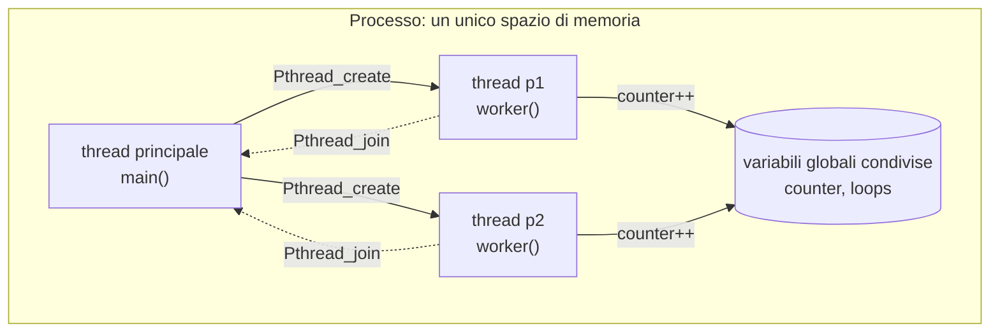
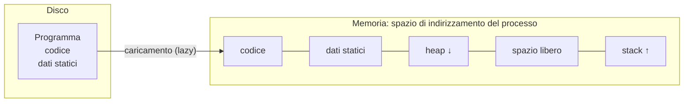
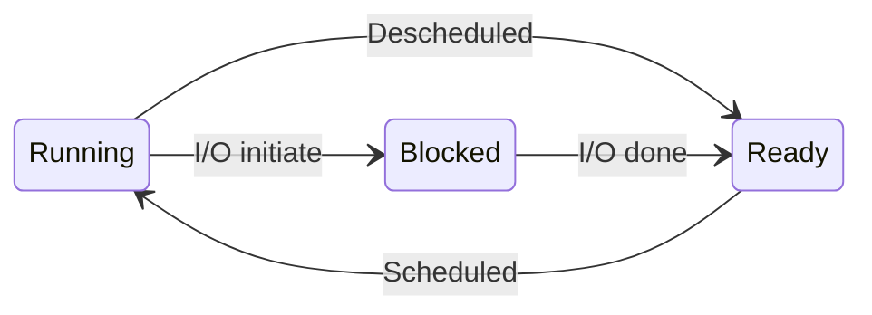

---

## corso: Sistemi Operativi lezione: 1 data: 2026-09-21 argomenti: [introduzione ai sistemi operativi, virtualizzazione, system call, concorrenza, persistenza, obiettivi di progetto, thread, time sharing, processo, creazione di un processo, stati di un processo, PCB, context switch] slide: ["02 - Introduction to Operating Systems", "04 - The Abstraction: The Process"] tags: [sistemi-operativi]

---

# Lezione 1 — Introduzione ai sistemi operativi e astrazione di processo

La lezione si divide in due parti. La prima presenta il sistema operativo nel suo insieme: che cosa fa, perché esiste e quali sono i tre grandi temi su cui è costruito il corso, cioè **virtualizzazione**, **concorrenza** e **persistenza**. La seconda entra nel primo e più importante di questi temi, la virtualizzazione della CPU, e introduce l'astrazione su cui si regge: il **processo**. Il linguaggio di riferimento per gli esempi è il C.

> [!tip] Approfondimento — Il libro di riferimento #approfondimento 
> Le slide del corso provengono da un corso della Hanyang University costruito sul libro _Operating Systems: Three Easy Pieces_ (OSTEP) di Remzi H. e Andrea C. Arpaci-Dusseau (University of Wisconsin–Madison). La versione attuale del libro (1.10, novembre 2023) è scaricabile gratuitamente, capitolo per capitolo, dal sito degli autori. La numerazione delle slide coincide con quella dei capitoli: cap. 2 _Introduction_, cap. 4 _Processes_, cap. 5 _Process API_, cap. 6 _Direct Execution_. Molti capitoli si chiudono con esercizi basati su piccoli simulatori in Python, utili per verificare la comprensione [@arpacidusseau2023ostep].

## Parte I — Che cos'è un sistema operativo

> [!warning] Sezione ricostruita — inizio La registrazione di questa lezione comincia dopo la pausa, quindi per la prima parte non c'è trascrizione. Il testo che segue sviluppa le slide _02 – Introduction to Operating Systems_ e gli appunti manuali, con spiegazioni tecniche aggiunte dove le slide sono solo schematiche. Non riporta quindi esempi o commenti specifici del professore, salvo quelli che lui stesso richiama nella seconda parte.

### Che cosa succede quando un programma è in esecuzione

Un programma in esecuzione fa, in fondo, una cosa sola: esegue istruzioni. Il processore ripete sempre lo stesso ciclo. Preleva (_fetch_) un'istruzione dalla memoria e la decodifica (_decode_) per capire di quale istruzione si tratta. Poi la esegue (_execute_): sommare due numeri, accedere alla memoria, verificare una condizione, saltare a una funzione. Infine passa all'istruzione successiva. Questo ciclo si ripete milioni o miliardi di volte al secondo ed è il modello che ogni programma dà per scontato: istruzioni eseguite una alla volta, in ordine.

Mentre il programma esegue, però, accadono molte altre cose, tutte con lo stesso scopo: rendere il sistema facile da usare. Il software che se ne occupa è il sistema operativo.

### Definizione e compiti del sistema operativo

> [!important] Sistema operativo Il sistema operativo (SO, in inglese _operating system_, OS) è il software responsabile di:
> 
> - rendere facile **eseguire** i programmi;
> - permettere ai programmi di **condividere** la memoria;
> - consentire ai programmi di **interagire** con i dispositivi.
> 
> In sintesi, il SO deve garantire che il sistema funzioni in modo **corretto** ed **efficiente**.

#### Virtualizzazione

Lo strumento principale con cui il SO svolge questi compiti è la **virtualizzazione**. Il SO prende una risorsa fisica, come il processore, la memoria o il disco, e la trasforma in una _forma virtuale di sé stessa_. Questa versione virtuale è più generale, più potente e più semplice da usare dell'originale. Per esempio, un'unica CPU fisica appare come tante CPU, una per programma. Allo stesso modo, un'unica memoria fisica appare a ciascun programma come una memoria privata tutta sua. Per questo il SO viene talvolta chiamato **macchina virtuale**: offre ai programmi una macchina astratta più comoda di quella reale su cui girano.

#### Le chiamate di sistema

Per sfruttare la macchina virtuale, l'utente e i programmi devono poter dire al SO che cosa fare. A questo servono le **chiamate di sistema** (_system call_). Il SO mette a disposizione un'interfaccia di programmazione (API, _Application Programming Interface_), spesso sotto forma di libreria standard. Un SO tipico esporta alcune centinaia di chiamate di sistema, che servono per eseguire programmi, accedere alla memoria e accedere ai dispositivi. Le chiamate di sistema sono quindi il canale attraverso cui un programma parla con il **kernel**, il nucleo del sistema operativo.

Gli appunti manuali riportano anche una distinzione fondamentale. I programmi ordinari girano nello **spazio utente** (_user space_), con privilegi limitati. Il SO lavora invece nello **spazio kernel** (_kernel space_), dove può fare tutto. Una chiamata di sistema, vista dal programma, ha l'aspetto di una normale funzione, ma fa eseguire operazioni che solo il SO è autorizzato a compiere: muovere la testina del disco, leggere e scrivere dati, ripartire la CPU tra più programmi. Il meccanismo che rende possibile questo passaggio controllato è spiegato in dettaglio in [[Lezione 02 - Process API e Limited Direct Execution#Le system call|Lezione 2]].

> [!warning] Discrepanza con gli appunti manuali Negli appunti si parla della chiamata di sistema "systemCall", al singolare, come se fosse un'unica funzione. Le slide chiariscono che _system call_ è il nome di una categoria. Un SO tipico ne esporta alcune centinaia (per esempio `fork`, `open`, `read`, `write`, `exit`), e ciascuna ha una funzione specifica.

#### Il SO come gestore di risorse

Visto da un'altra angolazione, il SO è un **gestore di risorse** (_resource manager_). CPU, memoria e disco sono risorse del sistema, e la virtualizzazione permette di condividerle:

- molti programmi possono essere in esecuzione → si condivide la **CPU**;
- molti programmi possono accedere _contemporaneamente_ alle proprie istruzioni e ai propri dati → si condivide la **memoria**;
- molti programmi possono accedere ai dispositivi → si condividono i **dischi**.

Il SO gestisce queste risorse inseguendo obiettivi diversi a seconda dei casi: efficienza, equità tra i programmi, e altri.

### Virtualizzare la CPU

Il primo esempio delle slide è un programma volutamente banale, `cpu.c`:

```c
#include <stdio.h>
#include <stdlib.h>
#include <sys/time.h>
#include <assert.h>
#include "common.h"

int
main(int argc, char *argv[])
{
    if (argc != 2) {
        fprintf(stderr, "usage: cpu <string>\n");
        exit(1);
    }
    char *str = argv[1];
    while (1) {
        Spin(1); // Repeatedly checks the time and returns once it has run for a second
        printf("%s\n", str);
    }
    return 0;
}
```

Il programma riceve una stringa dalla riga di comando (`argv[1]`) ed entra in un ciclo infinito. A ogni iterazione chiama `Spin(1)`, una funzione di supporto che controlla ripetutamente l'orologio e ritorna dopo un secondo di esecuzione, e poi stampa la stringa. Lanciato da solo, stampa la stessa lettera una volta al secondo per sempre. Si ferma solo premendo Control-C:

```text
prompt> gcc -o cpu cpu.c -Wall
prompt> ./cpu "A"
A
A
A
^C
prompt>
```

L'esperimento interessante è lanciare quattro istanze dello stesso programma contemporaneamente. Il simbolo `&` dice alla shell di eseguire il comando in background e di restituire subito il prompt:

```text
prompt> ./cpu A & ./cpu B & ./cpu C & ./cpu D &
[1] 7353
[2] 7354
[3] 7355
[4] 7356
A
B
D
C
A
B
D
C
A
C
B
D
...
```

I numeri tra parentesi quadre sono gli identificatori dei quattro processi creati. Le lettere si alternano: **anche con un solo processore, i quattro programmi sembrano eseguire tutti nello stesso momento**. Questa illusione è opera del SO, aiutato dall'hardware. Il sistema sembra disporre di un numero enorme di CPU virtuali: una singola CPU viene trasformata in un numero apparentemente infinito di CPU, e molti programmi sembrano eseguire insieme. È questo che si intende per **virtualizzazione della CPU**.

L'ordine delle lettere non è regolare: dopo A B D C compare A C B D. Quale programma esegue in un dato momento lo decide il SO, secondo una sua **politica** (l'algoritmo di scheduling). È un primo esempio del SO come gestore di risorse, che deve decidere a chi assegnare la CPU.

### Virtualizzare la memoria

Il modello di memoria fisica offerto dall'hardware è molto semplice: la memoria è un **array di byte**. Per leggere (_load_) bisogna specificare un **indirizzo**; per scrivere (_store_) bisogna specificare il dato da scrivere e l'indirizzo in cui scriverlo. Un programma tiene in memoria tutte le sue strutture dati, e anche le sue istruzioni stanno in memoria. La memoria quindi viene usata continuamente, a ogni istruzione eseguita.

Il secondo esempio, `mem.c`, alloca un intero e lo incrementa in un ciclo infinito:

```c
#include <unistd.h>
#include <stdio.h>
#include <stdlib.h>
#include "common.h"

int
main(int argc, char *argv[])
{
    int *p = malloc(sizeof(int));          // a1: allocate some memory
    assert(p != NULL);
    printf("(%d) address of p: %08x\n",
           getpid(), (unsigned) p);         // a2: print out the address of the memory
    *p = 0;                                 // a3: put zero into the first slot of the memory
    while (1) {
        Spin(1);
        *p = *p + 1;
        printf("(%d) p: %d\n", getpid(), *p); // a4
    }
    return 0;
}
```

Il programma alloca memoria con `malloc` (a1) e ne stampa l'indirizzo (a2) insieme al **PID**, l'identificatore del processo restituito da `getpid()`. Poi scrive zero nella cella allocata (a3) e, ogni secondo, incrementa il valore e lo stampa (a4). Eseguito da solo, il comportamento è quello atteso:

```text
prompt> ./mem
(2134) memory address of p: 00200000
(2134) p: 1
(2134) p: 2
(2134) p: 3
(2134) p: 4
(2134) p: 5
^C
```

Lanciando due istanze insieme succede qualcosa di sorprendente:

```text
prompt> ./mem & ./mem &
[1] 24113
[2] 24114
(24113) memory address of p: 00200000
(24114) memory address of p: 00200000
(24113) p: 1
(24114) p: 1
(24114) p: 2
(24113) p: 2
(24113) p: 3
(24114) p: 3
...
```

Entrambi i processi hanno allocato memoria **allo stesso indirizzo**, `00200000`. Eppure ciascuno aggiorna il proprio valore in modo indipendente: se condividessero davvero la stessa cella, i contatori si pesterebbero i piedi. È come se ogni programma avesse una **memoria privata**. Il professore lo richiama nella seconda parte della lezione: lo stesso indirizzo, in due processi diversi, indica due cose diverse grazie al sistema operativo.

> [!important] Spazio di indirizzamento virtuale Ogni processo accede al proprio **spazio di indirizzamento virtuale** (_virtual address space_), privato. Il SO si occupa di **mappare** questo spazio sulla memoria fisica della macchina. Un riferimento alla memoria fatto da un programma non influisce sullo spazio di indirizzamento degli altri processi, né su quello del SO. La memoria fisica resta però una **risorsa condivisa**, gestita dal sistema operativo.

> [!tip] Approfondimento — Perché sul proprio computer l'esperimento potrebbe non riuscire #approfondimento OSTEP avverte che l'esempio di `mem.c` mostra lo stesso indirizzo nei due processi solo se è disattivata la **randomizzazione dello spazio di indirizzamento** (ASLR, _Address Space Layout Randomization_). Si tratta di una difesa di sicurezza, attiva di default nei sistemi moderni, che colloca le aree di memoria di ogni processo in posizioni diverse a ogni esecuzione, così da rendere più difficili alcuni attacchi (per esempio quelli basati sulla sovrascrittura dello stack). Con l'ASLR attiva i due processi stampano indirizzi diversi. Il principio però non cambia: ciascuno lavora nel proprio spazio di indirizzamento virtuale [@arpacidusseau2023ostep, cap. 2].

### Il problema della concorrenza

Il terzo tema del corso è la **concorrenza**. Con questo termine si indica l'insieme dei problemi che nascono quando si fanno più cose "contemporaneamente" nello stesso programma. Il primo a doverli affrontare è il SO stesso, che si destreggia tra molte attività insieme: esegue un processo, poi un altro, e così via. Gli stessi problemi però si presentano anche nei moderni **programmi multi-thread**.

Un **thread** è, in prima approssimazione, una funzione che esegue nello _stesso spazio di memoria_ di altre funzioni del programma, con più di un thread attivo nello stesso momento. L'esempio delle slide, `thread.c`, crea due thread che incrementano un contatore condiviso:

```c
#include <stdio.h>
#include <stdlib.h>
#include "common.h"

volatile int counter = 0;
int loops;

void *worker(void *arg) {
    int i;
    for (i = 0; i < loops; i++) {
        counter++;
    }
    return NULL;
}

int
main(int argc, char *argv[])
{
    if (argc != 2) {
        fprintf(stderr, "usage: threads <value>\n");
        exit(1);
    }
    loops = atoi(argv[1]);
    pthread_t p1, p2;
    printf("Initial value : %d\n", counter);

    Pthread_create(&p1, NULL, worker, NULL);
    Pthread_create(&p2, NULL, worker, NULL);
    Pthread_join(p1, NULL);
    Pthread_join(p2, NULL);
    printf("Final value : %d\n", counter);
    return 0;
}
```

Il `main` legge da riga di comando il numero di iterazioni (`atoi` converte la stringa in intero) e lo salva nella variabile globale `loops`. Poi crea due thread con `Pthread_create`, ognuno dei quali esegue la funzione `worker`, e li attende entrambi con `Pthread_join`. Ogni `worker` incrementa `loops` volte il contatore globale `counter`. La parola chiave `volatile` impone al compilatore di leggere e scrivere davvero la variabile in memoria a ogni accesso, invece di tenerla in un registro. Ci si aspetta quindi che il valore finale sia il doppio di `loops`. Con valori piccoli è così:

```text
prompt> gcc -o thread thread.c -Wall -pthread
prompt> ./thread 1000
Initial value : 0
Final value : 2000
```

Con valori grandi invece il risultato è sbagliato, e per di più cambia da un'esecuzione all'altra:

```text
prompt> ./thread 100000
Initial value : 0
Final value : 143012 // huh??
prompt> ./thread 100000
Initial value : 0
Final value : 137298 // what the??
```

La causa sta nell'istruzione apparentemente innocua `counter++`. A livello macchina l'incremento di un contatore condiviso richiede **tre istruzioni**:

1. caricare (_load_) il valore del contatore dalla memoria in un registro;
2. incrementare il registro;
3. salvare (_store_) il nuovo valore in memoria.

Queste tre istruzioni **non vengono eseguite in modo atomico**, cioè come un'unica operazione indivisibile. Il SO può sospendere un thread tra una e l'altra e far eseguire l'altro thread. Se succede nel momento sbagliato, un incremento va perso.

> [!example] Come si perde un incremento 
> Si supponga che `counter` valga 50. Ogni thread ha i propri registri, che vengono salvati e ripristinati quando il thread viene sospeso e ripreso.
> 
> |Passo|Thread 1|Thread 2|`counter` in memoria|
> |---|---|---|---|
> |1|carica `counter` nel registro (50)||50|
> |2|incrementa il registro (51)||50|
> |3|_sospeso dal SO_||50|
> |4||carica `counter` (50)|50|
> |5||incrementa (51)|50|
> |6||salva in memoria (51)|51|
> |7|_riprende_: salva in memoria (51)||51|
> 
> I due thread hanno eseguito un incremento ciascuno, ma il contatore è aumentato di uno solo. Con pochi incrementi la probabilità di un'interruzione nel punto critico è bassa, quindi il risultato è quasi sempre giusto. Con centinaia di migliaia di incrementi gli errori si accumulano, e il risultato dipende dai tempi esatti con cui il SO alterna i thread.

Per evitare il problema bisogna fare in modo che la sequenza "carica–incrementa–salva" non possa essere interrotta a metà da un altro thread che accede allo stesso dato. Gli appunti manuali e il professore, nella seconda parte della lezione, citano a questo scopo i **meccanismi di semaforizzazione**. Un _semaforo_ protegge una porzione di codice e impedisce a un thread di entrarvi se un altro la sta già eseguendo. La concorrenza è il tema della seconda parte del corso.

### Persistenza

Il terzo tema è la **persistenza**. Dispositivi come la DRAM, cioè la memoria centrale, conservano i dati in modo **volatile**: se manca l'alimentazione o il sistema va in crash, il contenuto si perde. Per conservare i dati nel tempo servono sia hardware sia software:

- **hardware**: un dispositivo di input/output (I/O) come un disco rigido (_hard drive_) o un'unità a stato solido (SSD);
- **software**: il **file system**, la parte del SO che gestisce il disco ed è responsabile di memorizzare i file creati dall'utente.

L'esempio delle slide crea il file `/tmp/file` contenente la stringa "hello world":

```c
#include <stdio.h>
#include <unistd.h>
#include <assert.h>
#include <fcntl.h>
#include <sys/types.h>

int
main(int argc, char *argv[])
{
    int fd = open("/tmp/file", O_WRONLY | O_CREAT | O_TRUNC, S_IRWXU);
    assert(fd > -1);
    int rc = write(fd, "hello world\n", 13);
    assert(rc == 13);
    close(fd);
    return 0;
}
```

Il programma fa tre chiamate al SO. `open()` apre il file, creandolo se non esiste, e restituisce un intero detto **descrittore di file** (_file descriptor_). Il programma userà questo descrittore per riferirsi al file nelle operazioni successive. `write()` scrive 13 byte: gli 11 caratteri di "hello world", il ritorno a capo `\n` e il terminatore di stringa `\0`. `close()` chiude il file, segnalando che non verranno scritti altri dati. Queste chiamate di sistema vengono indirizzate alla parte del SO chiamata file system, che gestisce le richieste.

Dietro una semplice `write()` il SO fa un lavoro considerevole. Deve stabilire **dove** collocare i nuovi dati sul disco e poi **emettere le richieste di I/O** verso il dispositivo di memorizzazione. Deve anche gestire il caso di un crash nel mezzo di una scrittura. Per questo i file system adottano protocolli di scrittura accurati: il **journaling** registra prima in un giornale le modifiche che si stanno per fare, così da poterle completare o annullare dopo un guasto. Il **copy-on-write** non sovrascrive mai i dati sul posto, ma scrive la nuova versione altrove e solo alla fine la rende quella valida. In entrambi i casi è essenziale l'**ordine** in cui le scritture raggiungono il disco. Questi temi saranno trattati nella parte del corso dedicata alla persistenza.

### Obiettivi di progetto

Nel progettare un sistema operativo si perseguono alcuni obiettivi generali, spesso in tensione tra loro.

Il primo è costruire **astrazioni**, cioè rendere il sistema comodo e facile da usare nascondendo i dettagli dell'hardware dietro concetti più semplici, come il processo, lo spazio di indirizzamento o il file. Il secondo è garantire **alte prestazioni**, cioè ridurre al minimo l'_overhead_ del SO: il tempo e lo spazio in più che il SO consuma per svolgere il proprio lavoro. La virtualizzazione è preziosa, ma va fornita senza un costo eccessivo. Il terzo è la **protezione** tra le applicazioni, e tra le applicazioni e il SO. Il principio cardine è l'**isolamento**: il comportamento scorretto di un programma, accidentale o malevolo, non deve danneggiare gli altri programmi né il sistema operativo.

A questi si aggiunge un alto grado di **affidabilità**: il SO deve funzionare senza interruzioni, perché se si guasta lui si fermano tutte le applicazioni. Esistono infine altri obiettivi, la cui importanza dipende dal contesto d'uso: l'**efficienza energetica**, la **sicurezza** e la **mobilità**, cioè la capacità di funzionare su dispositivi sempre più piccoli.

> [!warning] Sezione ricostruita — fine

## Parte II — Dalla CPU virtuale al processo

### Thread e processi: che cosa viene schedulato

Dopo la pausa il professore torna sui thread, perché il concetto era stato presentato in modo sintetico. Nei modelli precedenti all'introduzione dei thread, l'entità che veniva **schedulata**, cioè mandata in esecuzione sulla CPU, era il processo. Con due processi, la CPU ne eseguiva un po' dell'uno, poi un po' dell'altro, e così via. Ognuno eseguiva il proprio programma e l'utente aveva l'impressione che girassero contemporaneamente. I processi hanno anche un'altra caratteristica forte: **memoria completamente separata**, come mostrato da `mem.c`.

Con l'introduzione dei thread il modello è cambiato:

> [!important] Thread e processo 
> Il **thread** è l'unità di scheduling: è ciò che la CPU esegue. Il **processo** è il contenitore che raggruppa le risorse, in primo luogo lo spazio di memoria, e le tiene separate da quelle degli altri processi. I thread di uno stesso processo **condividono la memoria**; processi diversi no.

Il nome _thread_ significa "filo, trama": è il filo dell'esecuzione. Quando si lancia un programma si crea un processo con **un solo thread**, che esegue il `main`. A quel punto non c'è nulla di contemporaneo, solo un'attività. Nell'esempio `thread.c`, la prima chiamata a `Pthread_create` crea un secondo thread, che esegue la funzione `worker`. La seconda chiamata ne crea un terzo. Ora il processo ha tre thread e la CPU li alterna: un po' il principale, un po' il primo `worker`, un po' il secondo. Il thread principale arriva poi alle `Pthread_join` e si mette ad aspettare che gli altri due terminino (_join_, "ricongiungere"). I tre thread condividono la memoria del processo: `counter` e `loops`, dichiarate come variabili globali, sono le stesse per tutti. Proprio questo rende possibile l'errore visto sopra.



Il modo corretto di descrivere un programma che non crea thread è quindi: _un processo con un solo thread di esecuzione_. Nel seguito il professore, per semplicità, continua a dire "si esegue un processo", ma la formulazione esatta è "si esegue un thread di un processo".

### Time sharing: l'illusione delle tante CPU

Come anticipato, il SO crea l'illusione che esistano molte CPU virtuali. Il meccanismo che lo permette si chiama **time sharing** (condivisione del tempo). Anche con una sola CPU, e il principio non cambia se ce ne sono di più, il SO esegue un processo per un po', poi lo ferma ed esegue un altro processo, e così via.

L'alternativa sarebbe eseguire un processo dall'inizio alla fine e solo dopo passare al successivo. Così però non si potrebbero fare due cose insieme, per esempio guardare le slide in PowerPoint e ascoltare la musica. Prima si guarderebbero le slide e poi si ascolterebbe la musica.

Quale delle due strategie è più efficiente? Se l'unico criterio è il tempo totale per completare tutte le attività, l'esecuzione **sequenziale è migliore**. Ogni passaggio da un'attività all'altra costa tempo, e questo tempo è perso.

> [!example] Stirare la camicia e fare la doccia 
> Bisogna stirare una camicia e fare la doccia. In modo **sequenziale** si stira, si mette via il ferro e poi si fa la doccia: si perde un po' di tempo nel passaggio, ma una volta sola. In modo **alternato** si stira per 30 secondi, poi 30 secondi di doccia, poi di nuovo 30 secondi di ferro, e così via. Alla fine si è stirato e si è fatta la doccia, ma il tempo perso nei passaggi (asciugarsi, riprendere il ferro, rimetterlo via) è enorme.
> 
> In informatica il tempo perso per passare da un'attività all'altra si chiama **context switch** (cambio di contesto). Non produce lavoro utile.

Lo stesso vale per i processi: il context switch, che passa da un thread (o processo) all'altro, ha un costo. Il time sharing quindi **non è la soluzione più efficiente**. È però quella che, dal punto di vista dell'utente, dà l'illusione della contemporaneità, ed è per questo che viene adottata. La slide lo riassume così: il costo potenziale del time sharing sono le **prestazioni**.

### Il processo

> [!important] Processo 
> Un **processo** è un **programma in esecuzione**.

Il programma in sé è inerte: una sequenza di istruzioni, con qualche dato statico, che sta sul disco in attesa di essere eseguita. Il processo è attivo: è il programma che gira e sta facendo qualcosa. Per definirlo con precisione bisogna elencare ciò di cui ha bisogno per eseguire, cioè ciò che il programma può leggere o modificare mentre è in esecuzione.

Il primo elemento è la **memoria**, detta anche **spazio di indirizzamento** (_address space_): l'insieme di tutti gli indirizzi a cui il processo può accedere. Come si è visto con `mem.c`, il processo "pensa" di avere a disposizione tutta la memoria del mondo. In questo spazio stanno le **istruzioni** (il codice del programma) e la **sezione dati**, cioè le variabili globali dichiarate nel programma. Ci sono poi l'area per la memoria allocata dinamicamente, l'**heap**, in cui finisce ciò che si alloca con `malloc`, e lo **stack**, discusse nel paragrafo sulla creazione.

Il secondo elemento sono i **registri**: piccole locazioni di memoria vicinissime al processore, che contengono informazioni indispensabili per eseguire le istruzioni del processo. Due sono fondamentali.

Il **program counter** (PC), chiamato anche _instruction pointer_ (IP), indica l'istruzione corrente da eseguire. È essenziale già in un programma singolo, perché per eseguire le istruzioni una dopo l'altra bisogna sempre sapere a che punto si è. Diventa ancora più importante con l'esecuzione concorrente. Se la CPU esegue un programma, lo mette da parte per eseguirne un altro e poi ci torna, deve sapere dove era rimasta. Il PC quindi non è solo un registro che dice al processore quale istruzione prelevare: quando il programma viene tolto dalla CPU, il suo valore va salvato da qualche parte. Se la CPU stava per eseguire l'istruzione numero 18, quando il programma tornerà in esecuzione dovrà ripartire proprio da lì.

Lo **stack pointer** indica la cima dello stack. Lo stack è l'area di memoria in cui vengono messe le variabili locali delle funzioni, i loro parametri e gli indirizzi di ritorno. Quando una funzione ne chiama un'altra, le variabili locali della chiamata finiscono sopra quelle della chiamante. Quando le funzioni terminano, vengono tolte a partire dall'ultima: lo stack cresce e si svuota come una pila. Anche la posizione della cima va salvata e ripristinata quando il processo viene sospeso e ripreso.

Questi registri, e gli altri che la CPU usa (nella realtà sono più di due), formano il **contesto** del processo. Il contesto è ciò che crea il costo del context switch. Quando si toglie un processo dalla CPU per metterne un altro, i suoi registri vanno salvati da qualche parte e quelli del nuovo processo vanno ripristinati.

### L'API dei processi

Qualunque SO moderno offre un insieme di chiamate di sistema per gestire i processi. Le slide le raggruppano in cinque categorie:

- **Create**: creare un nuovo processo per eseguire un programma. Anche quando si lancia un programma digitandone il nome nella shell viene invocata, senza che lo si veda, una chiamata di sistema di questo tipo.
- **Destroy**: terminare forzatamente un processo, per esempio uno che non risponde più. Molti processi terminano da soli; quando non lo fanno, l'utente deve poterli fermare.
- **Wait**: attendere che un processo termini. È una funzionalità indispensabile, già vista con `Pthread_join`, che per i thread ha lo stesso significato: il thread principale aspetta che gli altri finiscano.
- **Miscellaneous Control**: altri controlli, per esempio sospendere un processo e farlo poi riprendere. Il professore cita in questa categoria anche i meccanismi di semaforizzazione.
- **Status**: ottenere informazioni sullo stato di un processo, come lo stato in cui si trova o da quanto tempo esegue.

Il professore aggiunge una chiamata di sistema che permette di **sostituire il codice** eseguito da un processo con quello di un altro programma. Il processo resta lo stesso, ma da quel momento esegue un codice diverso. Queste chiamate sono il tema di [[Lezione 02 - Process API e Limited Direct Execution|Lezione 2]].

### Creazione di un processo

Quando un programma viene mandato in esecuzione, il SO compie cinque passi.

**1. Caricamento del codice.** Il SO carica in memoria, nello spazio di indirizzamento del processo, il codice del programma e i suoi dati statici. I programmi risiedono inizialmente su disco in un **formato eseguibile**. I SO moderni eseguono questo caricamento in modo **pigro** (_lazy_): non caricano tutto il programma prima di avviarlo, ma solo i pezzi di codice o di dati che servono man mano durante l'esecuzione. Il motivo è che i processi da caricare sono molti. Se ognuno venisse caricato per intero all'avvio, la memoria si esaurirebbe in fretta. In un dato momento la memoria può contenere un pezzetto di un processo e un pezzetto di un altro. Il meccanismo che lo rende possibile (paginazione e swapping) verrà studiato con la memoria.

**2. Allocazione dello stack.** Il SO alloca lo stack di esecuzione del programma, usato per le variabili locali, i parametri delle funzioni e gli indirizzi di ritorno. Lo inizializza con gli argomenti del `main()`: `argc`, il numero di argomenti, e `argv`, l'array delle stringhe passate da riga di comando.

**3. Creazione dell'heap.** Il SO crea l'heap, usato per i dati allocati dinamicamente su richiesta esplicita del programma. Il programma chiede spazio con `malloc()` e lo libera con `free()`. In C++ l'equivalente è `new`, citato dal professore nel richiamo iniziale della lezione successiva.

**4. Altre inizializzazioni.** Il SO svolge altri compiti, in particolare legati all'input/output. Ogni processo parte con tre **descrittori di file** già aperti: **standard input**, **standard output** e **standard error**. Il loro ruolo sarà chiaro con la redirezione dell'I/O, vista nella [[Lezione 02 - Process API e Limited Direct Execution#Redirezione dell'input e dell'output|lezione successiva]].

**5. Avvio del programma.** Il SO avvia l'esecuzione dal punto d'ingresso, cioè dal `main()`, trasferendo il controllo della CPU al processo appena creato. Il professore sottolinea che questo avviene "potenzialmente": il processo prima o poi verrà eseguito, ma _quando_ dipende da quali altri processi sono in esecuzione.



> [!important] Rappresentazione standard di un processo in memoria 
> Il professore chiede di ricordare questa figura, perché sarà il modo standard di rappresentare l'area di memoria di un processo per tutto il corso. Dall'alto verso il basso ci sono il **codice**, i **dati statici**, l'**heap**, che cresce verso il basso, uno spazio libero e lo **stack**, che parte dal fondo e cresce verso l'alto. Heap e stack crescono quindi uno verso l'altro. In un processo reale, a ciascuna di queste aree corrisponde un intervallo di indirizzi di memoria.

### Gli stati di un processo

Una volta mandato in esecuzione e caricato in memoria (almeno in parte, per esempio il pezzo che contiene il punto d'ingresso), un processo non è necessariamente in esecuzione: potrebbero esserci altri processi che stanno usando la CPU. Per gestire questa situazione il SO introduce il concetto di **stato** di un processo. Gli stati reali sono più di tre, ma i tre principali sono questi.

> [!important] Stati di un processo
> 
> - **Running** (in esecuzione): il processo sta eseguendo istruzioni su un processore.
> - **Ready** (pronto): il processo potrebbe eseguire, ma per qualche motivo il SO ha scelto di non eseguirlo in questo momento. Il motivo principale è che la CPU sta eseguendo qualcos'altro.
> - **Blocked** (bloccato): il processo ha eseguito un'operazione che non può concludere subito e non può ripartire finché non si verifica un certo evento. L'esempio tipico è una richiesta di I/O al disco: mentre il processo è bloccato, un altro può usare il processore.

Con una sola CPU **un solo processo alla volta può essere running**. I processi ready e blocked invece possono essere in numero qualsiasi. Il professore insiste sulla distinzione tra ready e blocked. Un processo ready è pronto e chiede solo di essere eseguito. Un processo blocked non potrebbe eseguire nemmeno se la CPU fosse libera, perché aspetta qualcosa: per esempio, deve leggere tre byte da una porta di I/O e i byte non sono ancora arrivati. Leggere dal disco richiede molto più tempo che fare una somma tra variabili. Il processo quindi fa la richiesta tramite una chiamata di sistema, passa nello stato blocked e ci resta finché i dati non arrivano. Il fatto che si blocchi è prezioso, perché nel frattempo la CPU può servire un altro processo.



Il professore consiglia di imparare questo schema delle transizioni. I processi pronti attendono in una **coda ready**, tipicamente organizzata in modalità **FIFO** (_first in, first out_): un processo viene accodato in fondo e prelevato dalla testa. In base all'**algoritmo di scheduling**, il SO prende il primo processo della coda e lo manda in esecuzione (transizione _scheduled_). Dopo un certo tempo, secondo criteri che dipendono dall'algoritmo, lo toglie dalla CPU e lo rimette in fondo alla coda (transizione _descheduled_), poi prende il successivo. Se invece il processo in esecuzione avvia un'operazione di I/O che non può essere soddisfatta subito, passa in blocked e il SO schedula immediatamente un altro processo. Quando l'I/O termina, il processo bloccato **non torna running ma ready**: viene rimesso in coda e aspetta il proprio turno.

> [!example] Domanda in aula: chi ha finito l'I/O dovrebbe avere la precedenza? 
> Uno studente chiede se un processo che ha appena terminato un'operazione di I/O debba tornare in fondo alla coda o possa essere messo in testa, visto che prima era in esecuzione. Il professore risponde che, per quanto ricorda, va in fondo, ma ammette di non esserne certo. Aggiunge che la scelta è legittima e che sistemi operativi diversi potrebbero adottare politiche diverse. L'idea dello studente, dare priorità a chi era in esecuzione prima di bloccarsi, ha senso.

> [!tip] Approfondimento — È una decisione dello scheduler #approfondimento 
> OSTEP conferma che la questione non ha una risposta univoca. Nel suo esempio di due processi, quando l'I/O del primo termina il SO decide di _non_ ripassargli subito la CPU, e il libro osserva esplicitamente che non è chiaro se sia una buona decisione: è una scelta dello scheduler. Il simulatore `process-run.py` che accompagna il capitolo permette di confrontare proprio le due politiche: con `IO_RUN_LATER` il processo che ha completato l'I/O aspetta il proprio turno, con `IO_RUN_IMMEDIATE` viene eseguito subito. L'esercizio chiede di riflettere sul perché la seconda possa convenire. Un processo che fa molto I/O tende a usare la CPU per poco tempo prima di bloccarsi di nuovo, quindi rieseguirlo subito permette di sovrapporre il suo prossimo I/O al calcolo degli altri processi [@arpacidusseau2023ostep, cap. 4].

Un processo può diventare blocked anche per un secondo motivo, che il professore propone come domanda alla classe: i **semafori**. Come anticipato a proposito di `counter++`, per impedire incoerenze si protegge una porzione di codice con un semaforo, che ne blocca l'accesso se qualcuno la sta già eseguendo. Questo non impedisce allo scheduler di togliere la CPU al processo che possiede il semaforo, perché gli altri processi non c'entrano nulla con quella sezione e devono poter eseguire.

> [!example] Bloccati da un semaforo
> 
> |Evento|Processo A|Processo B|
> |---|---|---|
> |A entra nella sezione protetta (il semaforo era libero) e incrementa il contatore|running|ready|
> |Il quanto di A scade **prima** che A rilasci il semaforo|ready|running|
> |B prova a entrare nella stessa sezione, ma il semaforo è occupato|ready|**blocked**|
> |A torna in esecuzione, completa l'operazione e rilascia il semaforo|running|ready|
> 
> B resta bloccato finché il processo che ha preso il semaforo non viene rimandato in esecuzione e lo rilascia. I processi che non usano quel semaforo, invece, continuano a eseguire normalmente.

### Process list e PCB

Per gestire tutto questo il SO, che è a sua volta un programma, mantiene alcune strutture dati chiave. La **process list** tiene traccia dei processi pronti, di quelli bloccati e di quello attualmente in esecuzione. Il **contesto dei registri** (_register context_) conserva i valori dei registri di ogni processo sospeso. Le informazioni su ciascun processo sono raccolte in un **PCB**.

> [!important] Process Control Block (PCB) 
> Il **Process Control Block** è una struttura C che contiene le informazioni relative a **un singolo processo**: tra le altre cose, il suo stato e il suo contesto (i registri). Per il SO, il nome conta meno del fatto che una struttura del genere esista: per ogni processo deve ricordare che esiste, in che stato si trova e a che punto è arrivato.

Le slide mostrano come esempio la struttura usata da **xv6**, un piccolo sistema operativo didattico:

```c
// the registers xv6 will save and restore
// to stop and subsequently restart a process
struct context {
    int eip;  // Instruction pointer register
    int esp;  // Stack pointer register
    int ebx;  // Called the base register
    int ecx;  // Called the counter register
    int edx;  // Called the data register
    int esi;  // Source index register
    int edi;  // Destination index register
    int ebp;  // Base pointer register
};

// the different states a process can be in
enum proc_state { UNUSED, EMBRYO, SLEEPING,
                  RUNNABLE, RUNNING, ZOMBIE };

// the information xv6 tracks about each process
// including its register context and state
struct proc {
    char *mem;                  // Start of process memory
    uint sz;                    // Size of process memory
    char *kstack;               // Bottom of kernel stack for this process
    enum proc_state state;      // Process state
    int pid;                    // Process ID
    struct proc *parent;        // Parent process
    void *chan;                 // If non-zero, sleeping on chan
    int killed;                 // If non-zero, have been killed
    struct file *ofile[NOFILE]; // Open files
    struct inode *cwd;          // Current directory
    struct context context;     // Switch here to run process
    struct trapframe *tf;       // Trap frame for the current interrupt
};
```

La struttura `context` è proprio il **contesto** del processo: i valori dei registri che il SO salva quando toglie il processo dalla CPU e ricopia nei registri del processore quando lo rimanda in esecuzione. Il primo campo, `eip` (_instruction pointer_), è il program counter: dice dove il processo era arrivato. Il secondo, `esp`, è lo stack pointer. Gli altri sono registri di uso generale dell'architettura x86.

L'enumerazione `proc_state` elenca gli stati possibili, che corrispondono in parte a quelli visti sopra. `RUNNING` è running, `RUNNABLE` equivale a ready e `SLEEPING` corrisponde a blocked. In più compare lo stato `ZOMBIE`.

> [!warning] Precisazione — lo stato _zombie_ A lezione il professore, dichiarandosi incerto, descrive lo zombie come un processo "chiuso male, in attesa di essere eliminato del tutto". La definizione corretta è più precisa. Un processo è **zombie** quando ha **terminato** la propria esecuzione ma il processo **padre non ha ancora raccolto** il suo stato di uscita con una `wait()`. Il kernel conserva di lui solo poche informazioni (PID, stato di terminazione, dati sull'uso delle risorse), proprio perché il padre possa recuperarle e verificare, per esempio, se il figlio ha concluso con successo. Finché resta zombie, il processo occupa comunque un posto nella tabella dei processi. Quando il padre esegue la `wait()`, il SO libera anche queste ultime strutture. Se il padre termina senza farlo, gli zombie vengono adottati dal processo `init`, che li rimuove automaticamente. Non si tratta quindi di una terminazione anomala: è la condizione normale di un processo terminato che aspetta che il padre ne raccolga lo stato [@arpacidusseau2023ostep, cap. 4; @linuxman2wait].

Tra gli altri campi della `struct proc`, il professore richiama il **`pid`** (_process ID_), l'identificatore numerico assegnato a ogni processo al momento della creazione. È il numero che compare quando si lancia un programma ed è quello da specificare per terminarlo (per esempio con il comando `kill`). Richiama poi il **`kstack`**, il **kernel stack** del processo. Oltre al proprio stack per le variabili locali, ogni processo ha una piccola porzione di memoria del kernel, usata quando il processo viene schedulato e deschedulato; il suo ruolo verrà chiarito nella [[Lezione 02 - Process API e Limited Direct Execution#Il context switch|lezione successiva]]. I campi `mem` e `sz` indicano dove si trova e quanto è grande la memoria del processo, cioè a che cosa corrisponde nella memoria fisica: ogni processo è caricato in un punto diverso. Gli altri campi registrano il processo padre (`parent`), i file aperti (`ofile`), la directory corrente (`cwd`), l'evento su cui il processo è eventualmente in attesa (`chan`) e se è stato terminato (`killed`). Il professore precisa che non è necessario ricordarli tutti: lo scopo dell'esempio è mostrare che il contesto è una cosa complessa, e va salvato e ripristinato ogni volta che un processo viene tolto e rimesso sulla CPU.

> [!tip] Approfondimento — xv6 e i due stati non commentati #approfondimento **xv6** è una reimplementazione didattica della versione 6 di Unix, scritta da Dennis Ritchie e Ken Thompson. Ne segue a grandi linee struttura e stile, ma è scritta in ANSI C per un moderno multiprocessore x86. È stata sviluppata al MIT per l'insegnamento. La versione x86, quella da cui provengono gli esempi delle slide e di OSTEP, non è più mantenuta: gli autori sono passati a una versione per architettura RISC-V [@xv6public]. OSTEP precisa inoltre che le strutture dei sistemi operativi "reali" come Linux, macOS o Windows sono analoghe, ma molto più complesse [@arpacidusseau2023ostep, cap. 4]. Dei sei stati di `proc_state`, due non sono stati commentati a lezione. `UNUSED` indica una voce libera della tabella dei processi. `EMBRYO` è lo stato _iniziale_ di un processo in fase di creazione: OSTEP osserva che alcuni sistemi prevedono proprio uno stato di questo tipo, così come prevedono uno stato _finale_, lo zombie.

### Il costo del context switch

Il professore chiude collegando il PCB al context switch. Quando un processo viene messo in esecuzione, il SO copia nei registri fisici della CPU i valori salvati nella sua struttura: per esempio, il valore di `eip` va nel registro che il processore usa come program counter. Quando il processo viene tolto, i valori correnti dei registri vanno salvati di nuovo nella struttura, e vanno caricati quelli del processo successivo. Questa operazione richiede tempo.

Copiare qualche registro sembra un'operazione da poco, e in effetti lo è. Bisogna però considerare che in un sistema time sharing lo scheduling avviene con una **frequenza altissima**: oggi i processi vengono alternati anche sotto il millisecondo. Su intervalli così brevi, il tempo necessario per salvare e ripristinare il contesto non è più trascurabile, soprattutto quando i processi sono molti. Il context switch non provoca rallentamenti esagerati, ma esiste, e il SO deve tenerne conto.

> [!tip] Approfondimento — Ammortizzare il costo del context switch #approfondimento 
> OSTEP propone un modo semplice per quantificare il problema [@arpacidusseau2023ostep, cap. 7]. Si supponga che ogni context switch costi un tempo fisso $c$ e che ogni processo esegua per un **quanto** di tempo $q$ prima di essere sostituito. La frazione di tempo sprecata nei cambi di contesto è $$\text{overhead} = \frac{c}{q + c}.$$ Con $q = 10$ ms e $c = 1$ ms se ne va circa il 9% del tempo (il libro arrotonda a "circa il 10%"). Allungando il quanto a 100 ms si scende sotto l'1%. Il prezzo è la reattività: con un quanto lungo i processi in coda aspettano di più prima di essere serviti. La scelta del quanto è quindi un compromesso. Il libro nota anche che il costo reale di un cambio di contesto va oltre il salvataggio dei registri: il processo che entra trova le cache e le altre strutture interne del processore piene dei dati di quello precedente, e paga un ulteriore rallentamento finché non le ha "riscaldate". Il grafico mostra l'andamento dell'overhead in funzione del quanto (in ms), per $c = 1$ ms.
> 
> ```chart
> type: line
> labels: [1, 2, 5, 10, 20, 50, 100]
> series:
>   - title: Overhead del context switch (%)
>     data: [50, 33.3, 16.7, 9.1, 4.8, 2.0, 1.0]
> tension: 0.2
> width: 80%
> labelColors: false
> fill: false
> beginAtZero: true
> ```

## Indicazioni pratiche: il simulatore del corso

Al termine della lezione il professore chiede di scaricare dal sito del corso un software di simulazione. Nella trascrizione il nome è "Interactive OS Lab"; va verificato sul sito, perché la registrazione in quel punto è poco chiara. Il simulatore rappresenta i diversi componenti di un sistema operativo e verrà usato per mostrare in azione i concetti visti a lezione. Per esempio, nella sezione _processi_ si può caricare un _pattern_, cioè una configurazione didattica preimpostata, come "processo con due thread". Si può poi osservare come cambia lo stato del processo durante l'esecuzione, e visualizzarne il codice: in quel caso un `main` con due `pthread_create`, simile all'esempio `thread.c`.

Dalla registrazione, che in questo punto è frammentaria, emergono le seguenti indicazioni:

- il software prevede la connessione a un server con registrazione (matricola, nome e cognome). Una volta registrati, non ci si può più collegare con le stesse credenziali da un altro PC, quindi conviene scegliere con cura il computer da usare. Prima della registrazione il software si può comunque provare liberamente;
- il simulatore servirà anche per gli esercizi, che faranno guadagnare punti. Sembra che conti l'averli svolti più che l'esattezza della soluzione;
- per ora il professore chiede soltanto di installarlo e verificare che funzioni sul proprio sistema (Linux, Windows o macOS), segnalando eventuali problemi da correggere nelle prime settimane. Non chiede ancora di svolgere gli esercizi.