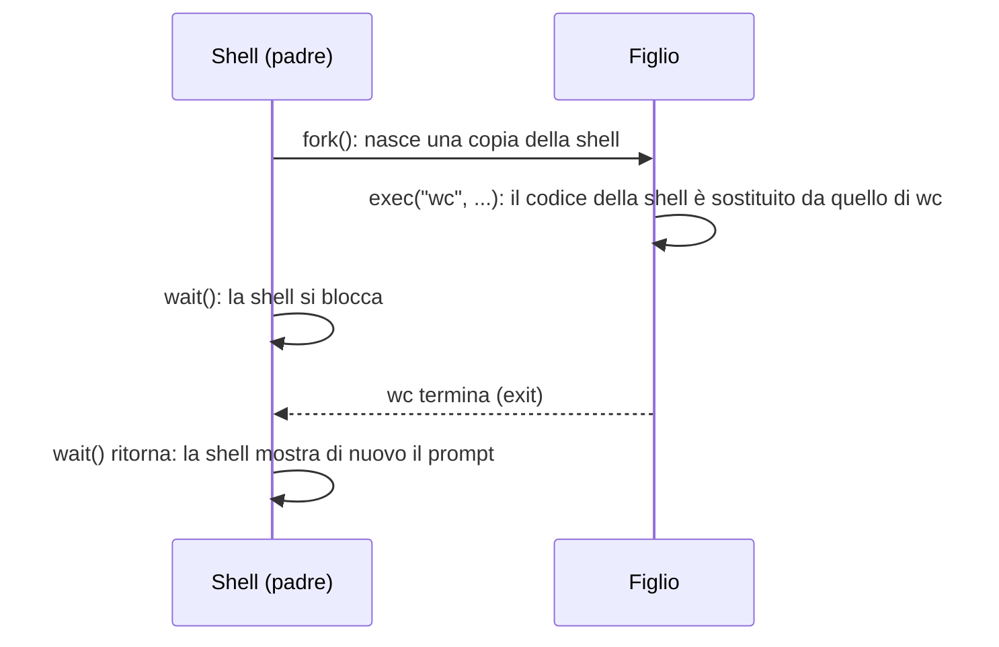
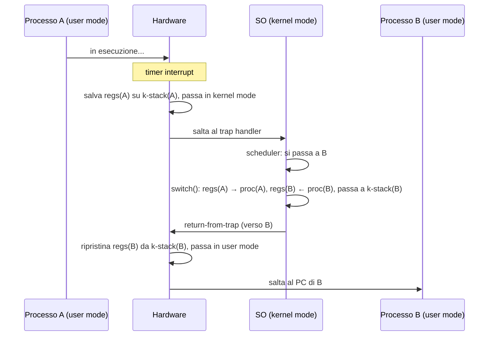

---

## corso: Sistemi Operativi lezione: 2 data: 2026-09-22 argomenti: [fork, wait, exec, shell, redirezione, descrittori di file, limited direct execution, user mode, kernel mode, system call, trap, trap table, timer interrupt, scheduler, context switch] slide: ["05 - Interlude: Process API", "06 - Mechanism: Limited Direct Execution"] tags: [sistemi-operativi]

---

# Lezione 2 — Process API e Limited Direct Execution

La lezione affronta i processi da due punti di vista complementari. Nella prima parte si guarda il processo **dal punto di vista dell'utente**: quali chiamate di sistema ha a disposizione un programma Unix per creare un processo (`fork`), attenderne la terminazione (`wait`), fargli eseguire un altro programma (`exec`) e ridirigerne l'input e l'output. Nella seconda parte si guarda il processo **dal punto di vista del sistema operativo**. Si vede con quale meccanismo, detto _limited direct execution_, il SO riesce a far girare i programmi direttamente sulla CPU senza perderne il controllo, e come riesce a passare da un processo all'altro.

## Riepilogo della lezione precedente

Il professore apre con un breve richiamo ai processi; per i dettagli si veda [[Lezione 01 - Introduzione ai SO e processi]]. Il sistema operativo implementa il concetto di **CPU virtuale**: anche con una sola CPU fisica, ogni processo ha l'illusione di eseguire su un processore tutto suo. A decidere di volta in volta quale processo debba eseguire è l'algoritmo di **scheduling**.

Un processo è l'esecuzione di un programma. Quando il SO lo manda in esecuzione, predispone un'area di memoria con il codice e i dati statici, l'**heap** per la memoria allocata dinamicamente (`malloc` in C, `new` in C++) e lo **stack** per le variabili locali. Heap e stack crescono in direzioni opposte. Lo stack si comporta come una pila: le variabili locali di una funzione chiamata vanno sopra quelle della funzione chiamante e vengono tolte per prime quando la funzione termina.

Il punto davvero importante sono gli **stati**: _running_, _ready_ e _blocked_. Il passaggio da ready a running avviene quando l'algoritmo di scheduling sceglie il processo. Il SO può anche decidere che il processo in esecuzione ha avuto abbastanza tempo e rimetterlo nella coda ready. Se un processo deve leggere, per esempio, tre byte da una porta di I/O e i dati non ci sono, non può proseguire e passa in blocked. Quando i byte arrivano, torna nella coda ready.

Per gestire tutto questo il SO tiene per ogni processo un **process control block** (PCB). Il PCB contiene lo stato, il **contesto** (i registri, primo fra tutti il program counter), il **PID** (l'identificatore usato, per esempio, per terminare un processo) e un riferimento al **kernel stack**, una piccola porzione di memoria del kernel dedicata al processo. Il contesto è complesso, e va salvato e ripristinato ogni volta che il processo viene tolto e rimesso sulla CPU.

## Parte I — L'API dei processi in Unix

Dopo aver visto i processi dal lato del sistema operativo, il professore passa al lato dell'utente. Per le operazioni critiche, come creare un processo, il kernel mette a disposizione delle **chiamate di sistema**, accessibili tramite un'API. Gli esempi che seguono sono **tipici dei sistemi Unix**: Windows offre funzionalità analoghe, ma con chiamate di sistema diverse. Ogni meccanismo viene presentato due volte: prima con il codice C delle slide, poi con il simulatore del corso, che rende visibile cosa accade.

Per seguire gli esempi serve il concetto di **shell**: l'interfaccia testuale da cui l'utente lancia i programmi digitandone il nome. Su Windows ne è un esempio il Prompt dei comandi. I sistemi Windows si usano tipicamente tramite finestre e clic, mentre nei sistemi Unix e Linux è ancora molto comune eseguire i programmi dall'interno di una shell. Quando lo si fa, nasce un processo che esegue il programma. Programma e processo non sono la stessa cosa: il processo comprende anche i registri, lo stato, la memoria.

### La chiamata `fork()`

La chiamata di sistema più nota e importante per la gestione dei processi è **`fork()`**, che _crea un nuovo processo_. Il nome significa "forchetta", nel senso di biforcazione. Il primo esempio delle slide è `p1.c`:

```c
#include <stdio.h>
#include <stdlib.h>
#include <unistd.h>

int main(int argc, char *argv[]){
    printf("hello world (pid:%d)\n", (int) getpid());
    int rc = fork();
    if (rc < 0) {           // fork failed; exit
        fprintf(stderr, "fork failed\n");
        exit(1);
    } else if (rc == 0) {   // child (new process)
        printf("hello, I am child (pid:%d)\n", (int) getpid());
    } else {                // parent goes down this path (main)
        printf("hello, I am parent of %d (pid:%d)\n",
               rc, (int) getpid());
    }
    return 0;
}
```

Il programma stampa prima "hello world" insieme al proprio PID, ottenuto con `getpid()`. Poi chiama `fork()`, e qui succede la cosa strana. La `fork()` crea in memoria una **copia identica del processo**: il codice, lo stack, tutto ciò che il processo contiene in quel momento. Appena dopo la `fork()` non c'è più un solo processo, ma **due processi uguali** che eseguono lo stesso programma. Quello che ha chiamato la `fork()` si chiama **padre** (_parent_), quello creato si chiama **figlio** (_child_). Il nuovo processo ha la propria copia dello **spazio di indirizzamento**, dei **registri** e del **program counter**.

Proprio perché viene copiato anche il program counter, i due processi si trovano esattamente nello stesso punto del codice. Il figlio non riparte dall'inizio del `main()`: si ritrova lì come se avesse chiamato la `fork()` lui stesso.

> [!example] Domanda in aula: la copia non va avanti all'infinito? 
> Uno studente chiede se il processo copiato, essendo identico, non finisca per rieseguire a sua volta la `fork()`, generando copie all'infinito. La risposta è no. Insieme a tutto il resto viene copiato anche il program counter, quindi il figlio si ritrova nel punto in cui si trovava il padre, cioè subito dopo la `fork()`, e prosegue da lì. Infatti il messaggio "hello world", stampato prima della `fork()`, compare una sola volta.

I due processi sono identici con una sola differenza, che è anche ciò che permette di distinguerli: il **valore di ritorno della `fork()`**.

> [!important] Valore di ritorno di `fork()`
> 
> - Nel **figlio**, `fork()` restituisce **0**.
> - Nel **padre**, `fork()` restituisce il **PID del figlio** appena creato.
> - Se la creazione fallisce, `fork()` restituisce un valore **negativo** (−1) nel padre e nessun figlio viene creato.

Il padre riceve il PID del figlio, come accade per ogni ritorno della `fork()`. Il figlio, che non ha figli, riceve zero. Il codice usa questo valore per far seguire ai due processi strade diverse. Il primo ramo (`rc < 0`) gestisce l'errore: la creazione del processo non è riuscita. Concettualmente interessa poco, ma va previsto. Se `rc == 0` si è nel figlio, che stampa il proprio PID. Altrimenti si è nel padre: `rc` contiene il PID del figlio, anche se il codice non lo verifica, e il padre lo stampa per curiosità.

Il ramo d'errore mostra anche la chiamata **`exit()`**, che termina esplicitamente il processo. L'argomento è un **codice di uscita**: per convenzione `exit(0)` significa "tutto è andato come doveva", mentre un valore diverso da zero, come l'`exit(1)` dell'esempio, segnala una terminazione con problemi.

L'output del programma **non è deterministico**:

```text
prompt> ./p1
hello world (pid:29146)
hello, I am parent of 29147 (pid:29146)
hello, I am child (pid:29147)
prompt>
```

oppure

```text
prompt> ./p1
hello world (pid:29146)
hello, I am child (pid:29147)
hello, I am parent of 29147 (pid:29146)
prompt>
```

Dopo la `fork()` i processi pronti a eseguire sono due, e quale dei due stampi per primo lo decide lo scheduler. Non è possibile prevederlo a priori.

#### A che cosa serve una copia?

Ci si può chiedere a che cosa serva, nella pratica, creare una copia identica di un processo. In realtà questo meccanismo è **alla base dell'esecuzione di qualunque programma**. Anche la shell è un programma, quindi c'è un processo che la esegue. Quando nella shell si digita il nome di un programma da lanciare, la shell **crea una copia di sé stessa** con `fork()`, e poi la copia **sostituisce il proprio codice** con quello del nuovo programma. Nell'esempio `p1.c` la copia resta tale, quindi l'esempio di per sé dice poco. Nei casi reali, dopo la copia il codice viene sostituito con quello di un altro programma, ed è ciò che accade ogni volta che il SO lancia un programma. La sostituzione del codice è il compito della chiamata `exec()`, vista più avanti.

> [!tip] Approfondimento — La copia non è davvero immediata #approfondimento 
> Copiare l'intero spazio di indirizzamento a ogni `fork()` sarebbe costoso, tanto più se subito dopo il figlio chiamerà `exec()` e butterà via quella copia. Per questo Linux implementa `fork()` con la tecnica **copy-on-write**. Alla creazione, padre e figlio condividono le stesse pagine fisiche di memoria, marcate in sola lettura. Una pagina viene effettivamente duplicata solo quando uno dei due prova a modificarla. Il costo della `fork()` si riduce così alla duplicazione delle tabelle delle pagine e alla creazione della struttura che descrive il nuovo processo. Dal punto di vista del programmatore nulla cambia: i due processi hanno spazi di memoria separati, e le scritture dell'uno non sono visibili all'altro [@linuxman2fork].

> [!warning] Discrepanza con gli appunti manuali (`Process API.md`) Il primo blocco di codice degli appunti mescola i due esempi delle slide `p1.c` e `p2.c`. Contiene una `wait(NULL)`, che nelle slide compare solo in `p2.c`, senza includere `<sys/wait.h>`. Inoltre passa a `printf` tre argomenti (`rc, wc, getpid()`) con una stringa di formato che ne prevede due. Il blocco è anche etichettato come C++, mentre il codice è C. Per lo studio fanno fede le versioni delle slide riportate in questa nota.

#### La `fork()` nel simulatore

Il professore mostra lo stesso concetto con il simulatore indicato nella lezione precedente. Nel simulatore ogni processo compare con una sigla come **P1 T1**, cioè processo 1, thread 1. Il thread è l'unità di scheduling: all'interno di un processo possono esserci più thread, ma un processo appena creato ne ha uno solo. Invece di scrivere codice, si compongono i programmi con dei pulsanti che aggiungono istruzioni. Il professore spiega che il corso non vuole formare programmatori, ma far conoscere le funzionalità principali per gestire i processi. Il programma costruito in aula è questo:

```pseudo
pid = fork()
work(3)          // entrambi i processi lavorano per 3 unità
if pid > 0:      // solo il padre...
    wait()       // ...aspetta il figlio
exit()
```

`work` non fa nulla di particolare: è un'istruzione fittizia che rappresenta un certo numero di cicli di lavoro. Il codice è lo stesso per i due processi. L'unica differenza è l'`if`: solo il padre (`pid > 0`) esegue la `wait()`, perché il figlio non ha nessuno da aspettare.

L'esecuzione passo passo mostra quanto segue. All'inizio esiste solo P1 T1; il colore giallo indica che è in corso un cambio di contesto verso di lui, cioè che gli viene data la CPU. Al passo successivo compare **P2 T1**: la `fork()` è stata eseguita ed è nato un processo identico. Aprendo il codice dei due processi si vede che entrambi si trovano nello stesso punto, cioè quello indicato dal program counter, ma in esecuzione c'è ancora P1. Al passo seguente P1 viene messo nella coda dei pronti e P2 va in esecuzione. Succede perché il **quanto di esecuzione** è impostato a 2. Il quanto è legato al meccanismo di virtualizzazione: per dare l'illusione della contemporaneità, il sistema assegna un po' di tempo a ciascun processo. Nel simulatore, per semplicità, il tempo si misura in istruzioni. Esaurito il quanto, c'è un nuovo context switch, e così via.

Rieseguendo l'esempio con più attenzione emerge un dettaglio interessante: a un certo punto **P1 risulta bloccato**. È la `wait()` ad averlo bloccato: il padre aspetta il figlio, che per definizione non ha ancora finito perché è partito dopo. Il padre resta quindi in stato blocked. Quando il figlio termina, P1 torna nella coda dei pronti, va in esecuzione e termina anche lui. Il professore sottolinea che **l'ordine di esecuzione dipende dalla coda ready** e da eventuali blocchi. Se nessuno si bloccasse mai, i processi si alternerebbero regolarmente. Attese di I/O o `wait()` invece modificano l'ordine.

Il simulatore offre anche pattern già pronti. Per esempio, "due processi CPU + input/output" mostra un processo che attende dati dall'I/O per due unità di tempo e che, quando viene eseguito, crea un'altra situazione di blocco.

### La chiamata `wait()`

La seconda chiamata è **`wait()`**. Un processo che la chiama **aspetta che uno dei suoi figli termini**. La chiamata non ritorna finché il figlio non ha eseguito ed è uscito. L'esempio `p2.c` aggiunge una `wait()` al ramo del padre:

```c
#include <stdio.h>
#include <stdlib.h>
#include <unistd.h>
#include <sys/wait.h>

int main(int argc, char *argv[]){
    printf("hello world (pid:%d)\n", (int) getpid());
    int rc = fork();
    if (rc < 0) {           // fork failed; exit
        fprintf(stderr, "fork failed\n");
        exit(1);
    } else if (rc == 0) {   // child (new process)
        printf("hello, I am child (pid:%d)\n", (int) getpid());
    } else {                // parent goes down this path (main)
        int wc = wait(NULL);
        printf("hello, I am parent of %d (wc:%d) (pid:%d)\n",
               rc, wc, (int) getpid());
    }
    return 0;
}
```

Ora l'output è **deterministico**:

```text
prompt> ./p2
hello world (pid:29266)
hello, I am child (pid:29267)
hello, I am parent of 29267 (wc:29267) (pid:29266)
prompt>
```

Il motivo è questo. Se dopo la `fork()` esegue per primo il figlio, il figlio stampa per primo. Se invece esegue per primo il padre, il padre chiama subito `wait()` e si blocca finché il figlio non ha stampato ed è terminato. In entrambi i casi il messaggio del figlio precede quello del padre. Il valore restituito da `wait()`, salvato in `wc`, è il **PID del figlio terminato**: infatti coincide con `rc`.

> [!important] Semantica di `wait()`
> 
> - `wait()` blocca il chiamante finché **uno** dei suoi figli non termina, e restituisce il PID di quel figlio.
> - Una `wait()` attende **un solo** figlio. Un processo con tre figli che voglia aspettarli tutti deve chiamare `wait()` tre volte; altrimenti la prima chiamata raccoglie un figlio e gli altri non vengono attesi.
> - Concettualmente è l'analogo per i processi di `pthread_join` per i thread.

L'argomento `NULL` permette, in generale, di ricevere informazioni dal figlio che ha terminato. Se il figlio vuole comunicare qualcosa al padre, può passarlo come parametro della `exit()`, e il padre lo raccoglie tramite la `wait()`. Passando `NULL`, il padre dichiara che questa informazione non gli interessa.

> [!tip] Approfondimento — Raccogliere il codice di uscita e attendere un figlio preciso #approfondimento 
> Se all'argomento di `wait()` si passa l'indirizzo di un intero, per esempio `wait(&status)`, il kernel vi scrive lo stato di terminazione del figlio. Questo stato si interpreta con apposite macro: `WIFEXITED(status)` dice se il figlio è terminato normalmente, con `exit()` o tornando dal `main()`; in quel caso `WEXITSTATUS(status)` restituisce il codice passato a `exit()`. La variante `waitpid(pid, &status, options)` permette di aspettare **uno specifico figlio**, indicato dal PID, invece che il primo che termina. Con l'opzione `WNOHANG` la chiamata non si blocca se nessun figlio ha ancora terminato. È proprio la `wait()` a liberare le ultime informazioni di un figlio terminato: finché il padre non la esegue, il figlio resta nello stato _zombie_ descritto in [[Lezione 01 - Introduzione ai SO e processi#Process list e PCB|Lezione 1]] [@linuxman2wait].

### La chiamata `exec()`

La `fork()` da sola permette solo di eseguire copie dello stesso programma. Per eseguire un programma **diverso** da quello chiamante serve **`exec()`**. L'esempio `p3.c` fa eseguire al figlio il programma `wc` (_word count_):

```c
#include <stdio.h>
#include <stdlib.h>
#include <unistd.h>
#include <string.h>
#include <sys/wait.h>

int main(int argc, char *argv[]){
    printf("hello world (pid:%d)\n", (int) getpid());
    int rc = fork();
    if (rc < 0) {                       // fork failed; exit
        fprintf(stderr, "fork failed\n");
        exit(1);
    } else if (rc == 0) {               // child (new process)
        printf("hello, I am child (pid:%d)\n", (int) getpid());
        char *myargs[3];
        myargs[0] = strdup("wc");       // program: "wc" (word count)
        myargs[1] = strdup("p3.c");     // argument: file to count
        myargs[2] = NULL;               // marks end of array
        execvp(myargs[0], myargs);      // runs word count
        printf("this shouldn't print out");
    } else {                            // parent goes down this path (main)
        int wc = wait(NULL);
        printf("hello, I am parent of %d (wc:%d) (pid:%d)\n",
               rc, wc, (int) getpid());
    }
    return 0;
}
```

Il figlio vuole eseguire `wc`, che dalla shell si userebbe scrivendo `wc` seguito dal nome di un file per contarne il contenuto. Qui però lo si vuole lanciare dall'interno del programma. Per farlo il figlio prepara gli argomenti in `myargs`, un **array di stringhe**. La prima stringa è il nome del programma, `"wc"`. La seconda è l'argomento, cioè il file da elaborare (`"p3.c"`). La terza è `NULL`, che marca la fine dell'array. `strdup` crea una copia della stringa in memoria allocata dinamicamente.

L'array viene passato a **`execvp()`**, una delle chiamate della **famiglia** `exec`. Il primo parametro è il nome del programma da eseguire (`myargs[0]`); il secondo è l'array completo degli argomenti, che per convenzione contiene di nuovo, come primo elemento, il nome del programma. Quando `execvp()` viene eseguita, **il codice del processo figlio viene sostituito con il codice di `wc`**: il programma `wc` viene caricato al posto di quello corrente e l'heap e lo stack vengono reinizializzati. Il processo resta lo stesso, con lo stesso PID, ma da quel momento esegue un altro programma. Per questo la riga `printf("this shouldn't print out")` non viene mai eseguita: dopo una `exec()` riuscita, il vecchio codice non esiste più e non c'è nessun punto in cui "ritornare".

```text
prompt> ./p3
hello world (pid:29383)
hello, I am child (pid:29384)
29 107 1030 p3.c
hello, I am parent of 29384 (wc:29384) (pid:29383)
prompt>
```

La riga `29 107 1030 p3.c` è l'output di `wc`, che stampa nell'ordine il numero di **righe**, di **parole** e di **byte** del file. A lezione il professore non lo ha precisato; il significato dei tre numeri è quello indicato in OSTEP [@arpacidusseau2023ostep, cap. 5]. Il padre, nel frattempo, ha atteso con `wait()` che il figlio terminasse, e solo dopo stampa il proprio messaggio.

> [!important] `exec()` Una chiamata della famiglia `exec()` **sostituisce il programma** in esecuzione nel processo chiamante con un altro programma: carica il nuovo codice e i nuovi dati statici, reinizializza heap e stack e avvia il nuovo programma passandogli gli argomenti indicati. **Non crea un nuovo processo** e, se ha successo, **non ritorna**.

> [!tip] Approfondimento — La famiglia `exec` #approfondimento Su Linux le varianti di `exec` sono sei: `execl`, `execlp`, `execle`, `execv`, `execvp` ed `execvpe`. Le lettere che seguono il prefisso indicano come vengono passati i parametri. Con **`l`** (_list_) gli argomenti si passano uno per uno, come lista di parametri terminata da `NULL`. Con **`v`** (_vector_) si passa un array di stringhe, come `myargs` nell'esempio. Con **`p`** (_path_) il programma, se il nome non contiene `/`, viene cercato nelle directory elencate nella variabile d'ambiente `PATH`, come farebbe la shell: per questo nell'esempio basta scrivere `"wc"` invece del percorso completo. Con **`e`** (_environment_) si passa esplicitamente anche l'ambiente del nuovo programma. Tutte queste funzioni ritornano solo in caso di errore, restituendo −1 [@linuxman3exec].

#### La `exec()` nel simulatore

Nel simulatore il professore modifica il programma precedente. Dopo la `fork()`, questa volta è **solo il figlio** a eseguire una `exec()`, cioè a caricare un codice diverso, mentre il padre esegue una `wait()`. Cliccando sulla `exec()` si può definire il nuovo programma; in aula il figlio viene fatto semplicemente "lavorare a vuoto" per un po'. Eseguendo passo passo si vede il padre arrivare alla `wait()` e mettersi in attesa del figlio, che nel frattempo esegue l'altro programma, finché entrambi terminano. Il professore invita a ripetere l'esperimento da soli in caso di dubbi.

#### Lo schema della shell: `fork()` + `exec()` + `wait()`

L'idea che un processo crei una copia identica di sé stesso e che poi la copia sostituisca il proprio codice è **il motivo per cui la `fork()` esiste**. È la base dell'uso dei processi in un sistema operativo: si crea un figlio e poi gli si cambia il codice. La shell fa esattamente questo ogni volta che si lancia un comando:



> [!tip] Approfondimento — Perché `fork()` ed `exec()` sono separate #approfondimento 
> Si potrebbe pensare che sarebbe più semplice un'unica chiamata del tipo "crea un processo che esegue il programma X". OSTEP spiega che la separazione tra `fork()` ed `exec()` è invece essenziale per costruire una shell Unix. Permette infatti alla shell di eseguire del codice **dopo** la `fork()` ma **prima** della `exec()`. In quel momento il figlio può modificare l'ambiente in cui girerà il nuovo programma, per esempio chiudendo e riaprendo descrittori di file, senza che il programma lanciato debba saperne nulla. Funziona perché i descrittori di file aperti restano aperti attraverso la `exec()`. È così che si realizzano la redirezione, vista nel paragrafo seguente, e le _pipe_. Una pipe collega l'output di un processo all'input di un altro tramite una coda nel kernel: per esempio `grep -o foo file | wc -l` conta quante volte compare la parola `foo` nel file [@arpacidusseau2023ostep, cap. 5].

### Redirezione dell'input e dell'output

L'ultima funzionalità presentata è la **redirezione** (_redirection_). Ogni processo ha tre flussi standard, aperti in automatico al momento della creazione:

|Descrittore|Costante C|Flusso|Uso tipico|C++|Python|
|---|---|---|---|---|---|
|0|`STDIN_FILENO`|standard input|ciò che l'utente scrive da tastiera|`cin`|`input()`|
|1|`STDOUT_FILENO`|standard output|ciò che il programma stampa a schermo|`cout`|`print()`|
|2|`STDERR_FILENO`|standard error|messaggi di errore|`cerr`|`sys.stderr`|

Il professore cita esplicitamente `cin`, `cout` e `input()`; le altre corrispondenze completano la tabella.

L'aspetto interessante è che, dal punto di vista del SO, **standard input, standard output, standard error e file vengono gestiti in modo molto simile**. Il professore precisa che questo non vale per tutti i sistemi operativi, ma certamente per buona parte di essi, e che l'esempio è tipico dei sistemi Unix. Un file aperto è identificato da un numero intero, il **descrittore di file**, e per leggere o scrivere su un file aperto si passa quel descrittore alle chiamate di lettura e scrittura. Con molti file aperti, ognuno ha il suo descrittore. Anche i tre flussi standard hanno un descrittore, e per default sono **0, 1 e 2**. Di conseguenza è possibile, in modo molto semplice, mandare l'output di un programma su un file invece che sullo schermo, oppure prendere l'input da un file invece che dalla tastiera. È ciò che fa `p4.c`:

```c
#include <stdio.h>
#include <stdlib.h>
#include <unistd.h>
#include <string.h>
#include <fcntl.h>
#include <sys/wait.h>

int
main(int argc, char *argv[]){
    int rc = fork();
    if (rc < 0) {                   // fork failed; exit
        fprintf(stderr, "fork failed\n");
        exit(1);
    } else if (rc == 0) {           // child: redirect standard output to a file
        close(STDOUT_FILENO);
        open("./p4.output", O_CREAT|O_WRONLY|O_TRUNC, S_IRWXU);
        // now exec "wc"...
        char *myargs[3];
        myargs[0] = strdup("wc");   // program: "wc" (word count)
        myargs[1] = strdup("p4.c"); // argument: file to count
        myargs[2] = NULL;           // marks end of array
        execvp(myargs[0], myargs);  // runs word count
    } else {                        // parent goes down this path (main)
        int wc = wait(NULL);
    }
    return 0;
}
```

Il meccanismo funziona così:

1. dopo la `fork()`, il figlio **chiude lo standard output** con `close(STDOUT_FILENO)`, come si chiuderebbe un qualunque file. Anche `close` e `open` sono chiamate di sistema. Il descrittore 1 torna libero;
2. il figlio apre (e, se non esiste, crea) il file `p4.output`. Il SO assegna al nuovo file **il primo descrittore libero**, che è proprio **1**. Da questo momento il descrittore 1 non è più associato allo standard output, ma al file;
3. il figlio esegue `wc` con `execvp`. Come si è visto con `p3.c`, `wc` stampa il proprio risultato sullo standard output, cioè scrive sul descrittore 1. Ma il descrittore 1 è stato cambiato "sotto i piedi" del programma e ora punta al file.

Nella chiamata `open`, i flag `O_CREAT`, `O_WRONLY` e `O_TRUNC` chiedono rispettivamente di creare il file se non esiste, di aprirlo in sola scrittura e di svuotarlo se esiste già. `S_IRWXU` assegna al proprietario i permessi di lettura, scrittura ed esecuzione sul file creato.

```text
prompt> ./p4
prompt> cat p4.output
32 109 846 p4.c
prompt>
```

Lanciando `p4` sullo schermo non compare nulla, e sembra che non sia successo niente. In realtà il programma ha creato un figlio e ha eseguito `wc`. Guardando il contenuto di `p4.output` con `cat` si trova proprio il risultato di `wc`. In pratica si è "giocato" con lo standard output, cambiandolo all'insaputa del programma, per farlo scrivere su file. Lo stesso si potrebbe fare con lo standard input per leggere dati da un file invece che dalla tastiera.

Il professore conclude la prima parte sottolineando che quelli visti sono i **meccanismi di base della gestione dei processi**: creare un processo, aspettarlo, sostituirne il codice, leggere, scrivere, redirigere. Sopra questi meccanismi si può costruire molto altro.

> [!important] Riepilogo delle chiamate viste
> 
> |Chiamata|Effetto|Valore di ritorno|
> |---|---|---|
> |`fork()`|crea un processo figlio, copia del chiamante|0 nel figlio, PID del figlio nel padre, −1 in caso di errore|
> |`wait(&s)`|blocca il chiamante finché un figlio non termina|PID del figlio terminato, −1 in caso di errore|
> |`exec*()`|sostituisce il programma eseguito dal processo chiamante|non ritorna in caso di successo, −1 in caso di errore|
> |`exit(n)`|termina il processo con codice di uscita `n`|non ritorna|
> |`getpid()`|restituisce il PID del processo chiamante|PID del chiamante|
> |`close(fd)`|chiude il descrittore `fd`, che torna libero|0 in caso di successo, −1 in caso di errore|
> |`open(...)`|apre (o crea) un file assegnandogli il primo descrittore libero|il nuovo descrittore, −1 in caso di errore|

## Parte II — Il meccanismo: Limited Direct Execution

Dopo la pausa la lezione passa a guardare le chiamate di sistema e la gestione dei processi dal punto di vista del sistema operativo.

> [!warning] Sezione ricostruita — inizio La registrazione riprende dopo la pausa a discorso già avviato. Manca l'introduzione al capitolo (slide 2–3 di _06 – Mechanism: Limited Direct Execution_), che il professore richiama poco dopo come "quello che abbiamo visto prima". Il contenuto di questa sezione la ricostruisce a partire dalle slide.

### Virtualizzare la CPU con efficienza e controllo

Per virtualizzare la CPU il SO deve condividerla tra i processi tramite **time sharing**: esegue un processo per un po', poi un altro, e così via. Costruire questo meccanismo pone due problemi:

- **Prestazioni**: come realizzare la virtualizzazione senza aggiungere un overhead eccessivo al sistema?
- **Controllo**: come eseguire i processi in modo efficiente _mantenendo il controllo_ della CPU?

Il controllo è cruciale, perché il SO è responsabile delle risorse. Senza controllo, un processo potrebbe eseguire per sempre e impadronirsi della macchina, oppure accedere a informazioni che non dovrebbe vedere.

### Esecuzione diretta

Il modo più veloce per eseguire un programma è anche il più semplice: **farlo girare direttamente sulla CPU** (_direct execution_). Il SO prepara il processo e poi salta al suo `main()` come si chiama una normale funzione:

|OS|Program|
|---|---|
|Create entry for process list||
|Allocate memory for program||
|Load program into memory||
|Set up stack with `argc` / `argv`||
|Clear registers||
|Execute call `main()`||
||Run `main()`|
||Execute `return` from `main()`|
|Free memory of process||
|Remove from process list||

Il SO crea una voce nella lista dei processi, alloca la memoria, carica il programma, prepara lo stack con gli argomenti, azzera i registri e chiama `main()`. Il programma esegue e, al termine, ritorna. Il SO libera allora la memoria e rimuove il processo dalla lista. È veloce, perché il programma gira nativamente sull'hardware. Ma pone due problemi. Come può il SO impedire al programma di fare ciò che non deve, se gli cede completamente la CPU? E come può fermarlo per passare a un altro processo, come richiede il time sharing?

> [!important] Il problema dell'esecuzione diretta 
> **Senza limiti** sull'esecuzione dei programmi, il SO non avrebbe il controllo di nulla e sarebbe **"solo una libreria"**. Da qui il nome del meccanismo che si costruisce nel seguito: esecuzione diretta, ma **limitata** (_Limited Direct Execution_, LDE).

> [!warning] Sezione ricostruita — fine

### Problema 1: le operazioni ristrette

Il primo problema riguarda il caso in cui un processo voglia eseguire un'**operazione ristretta**: qualcosa che va fatto con cura, sotto controllo. Calcolare l'area di un triangolo non è un'operazione ristretta: il programma la implementa nel proprio codice e la esegue da solo. Lo sono invece **emettere una richiesta di I/O verso il disco** oppure **ottenere più risorse di sistema**, come CPU o memoria. Il SO richiede che queste operazioni vengano svolte in modo sicuro.

La soluzione, adottata da tutti i sistemi operativi, è il **trasferimento di controllo protetto** (_protected control transfer_). Si distingue tra spazio utente e spazio kernel, e soprattutto tra due **modalità di esecuzione** del processore.

> [!important] User mode e kernel mode
> 
> - **User mode** (modalità utente): le applicazioni **non hanno pieno accesso** alle risorse hardware.
> - **Kernel mode** (modalità kernel): il sistema operativo ha **accesso completo** a tutte le risorse della macchina.

### Le system call

Si definiscono così due modi di operare con diritti di accesso diversi. Qui il concetto di **chiamata di sistema** (_system call_) trova la sua vera motivazione. Una system call permette al kernel di **esporre con cura** alcune **funzionalità chiave** ai programmi utente:

- accedere al file system;
- creare e distruggere processi;
- comunicare con altri processi;
- allocare più memoria.

Normalmente il programma esegue in user mode. Quando invoca una chiamata di sistema, però, esegue codice del kernel, il nucleo del sistema operativo, **in kernel mode**, e quindi può fare tutto ciò che serve. Accedere al file system, creare o distruggere processi, comunicare con altri processi, ottenere più memoria di quella disponibile: tutto passa attraverso una chiamata di sistema eseguita in kernel mode.

#### Le istruzioni `trap` e `return-from-trap`

Ogni chiamata di sistema ha un codice diverso: quella che crea un processo fa cose diverse da quella che legge un file. Tutte però passano per una stessa istruzione speciale del processore, la **trap**.

> [!important] `trap` e `return-from-trap`
> 
> - L'istruzione **trap** **salta dentro il kernel**, nel punto in cui è implementata la chiamata di sistema richiesta, e **alza il livello di privilegio** a kernel mode.
> - L'istruzione **return-from-trap** **restituisce il controllo** al programma utente che aveva fatto la chiamata e **riporta il livello di privilegio** a user mode.

#### La trap table

Resta da capire come la trap sappia **quale** codice del kernel eseguire. Al momento dell'avvio (_boot_), quando la macchina si trova in kernel mode, il SO inizializza la **trap table**. È una tabella che contiene le corrispondenze tra le chiamate di sistema (e, in generale, gli eventi eccezionali che richiedono l'intervento del SO) e il codice del kernel che le gestisce, detto **trap handler**. L'hardware **si ricorda gli indirizzi** di questi gestori e, quando viene eseguita una trap, sa dove saltare. Il professore precisa che "indirizzo" (_address_) significa sempre indirizzo di memoria: codice e dati, qualunque cosa sia, si trovano da qualche parte in memoria e hanno quindi un indirizzo. Gli indirizzi verranno approfonditi con la gestione della memoria.

> [!tip] Approfondimento — Perché una system call sembra una normale funzione #approfondimento 
> Una chiamata come `open()` o `read()` si scrive in C esattamente come una normale funzione. OSTEP spiega che in effetti **è** una chiamata di procedura, ma verso la libreria C. Il codice della libreria, scritto a mano in assembly, rispetta una convenzione concordata con il kernel. Colloca gli argomenti in posizioni prestabilite (sullo stack o in specifici registri) e mette in una posizione nota il **numero della system call**. Poi esegue l'istruzione trap e, al ritorno, recupera i valori restituiti. Il programma non può indicare un indirizzo arbitrario del kernel a cui saltare: può solo chiedere un servizio tramite il suo numero, che il kernel controlla prima di eseguire il codice corrispondente. Questo livello di indirezione è esso stesso una forma di protezione. Allo stesso modo, l'istruzione che comunica all'hardware la posizione della trap table è **privilegiata**: un programma in user mode che provasse a eseguirla verrebbe fermato dall'hardware. Se così non fosse, potrebbe installare la propria trap table e prendere il controllo dell'intera macchina [@arpacidusseau2023ostep, cap. 6].

### Il protocollo Limited Direct Execution

Mettendo insieme questi elementi si ottiene una versione più completa dello schema di esecuzione diretta. Da qui in poi gli schemi hanno **tre colonne**: il **sistema operativo**, l'**hardware** (le operazioni svolte direttamente dal processore, come salvare dati nei registri fisici o in aree di memoria dedicate) e il **programma**. Le slide intitolano lo schema _Limited Direction Execution Protocol_: "Direction" è un refuso per _Direct_.

**Fase di avvio:**

|OS @ boot (kernel mode)|Hardware|
|---|---|
|**initialize trap table**||
||remember address of… syscall handler|

**Fase di esecuzione:**

| OS @ run (kernel mode)        | Hardware                       | Program (user mode)     |
| ----------------------------- | ------------------------------ | ----------------------- |
| Create entry for process list |                                |                         |
| Allocate memory for program   |                                |                         |
| Load program into memory      |                                |                         |
| Setup user stack with argv    |                                |                         |
| Fill kernel stack with reg/PC |                                |                         |
| **return-from-trap**          |                                |                         |
|                               | restore regs from kernel stack |                         |
|                               | move to user mode              |                         |
|                               | jump to main                   |                         |
|                               |                                | Run `main()`            |
|                               |                                | …                       |
|                               |                                | Call system call        |
|                               |                                | **trap** into OS        |
|                               | save regs to kernel stack      |                         |
|                               | move to kernel mode            |                         |
|                               | jump to trap handler           |                         |
| Handle trap                   |                                |                         |
| Do work of syscall            |                                |                         |
| **return-from-trap**          |                                |                         |
|                               | restore regs from kernel stack |                         |
|                               | move to user mode              |                         |
|                               | jump to PC after trap          |                         |
|                               |                                | …                       |
|                               |                                | return from main        |
|                               |                                | **trap** (via `exit()`) |
| Free memory of process        |                                |                         |
| Remove from process list      |                                |                         |

All'avvio il SO inizializza la trap table e l'hardware memorizza l'indirizzo del gestore delle system call. Quando deve creare un processo, il SO compie gli stessi passi dell'esecuzione diretta, con un'aggiunta importante. Ogni processo ha un proprio **kernel stack**, uno stack dedicato alla gestione del passaggio da e verso il kernel. Il SO vi deposita i registri iniziali del programma, tra cui il program counter, che all'inizio punta al `main`.

A questo punto il SO esegue una **return-from-trap**, anche se nessuna trap è ancora avvenuta. Il motivo è che si parte dal lato del sistema operativo: la prima cosa da fare è proprio "ritornare" al programma, cedendogli il controllo. L'hardware ripristina i registri del processo dal suo kernel stack, passa in user mode e salta al `main`.

Il programma esegue normalmente finché non invoca una chiamata di sistema, che esegue l'istruzione trap. L'hardware **salva i registri del processo sul suo kernel stack**, perché al termine dovrà riprenderli per far ripartire il programma esattamente da dove si era fermato. Poi passa in kernel mode e salta al trap handler corretto, cioè al codice specifico di quella system call. Il SO gestisce la trap ed esegue il lavoro richiesto, che varia a seconda della chiamata: leggere da un file, aumentare la memoria, creare un processo. Poi esegue una return-from-trap. L'hardware riprende i registri dal kernel stack, torna in user mode e salta all'istruzione successiva alla trap.

Quando il programma termina con il `return` dal `main`, viene invocata implicitamente un'altra chiamata di sistema, **`exit()`**: spesso non la si scrive, ma viene chiamata comunque. Anche questa passa per una trap, e il SO, gestendola, libera la memoria del processo e lo rimuove dalla lista.

Il professore precisa che i dettagli specifici di ogni passo non vanno imparati a memoria. Il concetto da ricordare è che il meccanismo richiede **l'intervento coordinato di tutti e tre i componenti**: sistema operativo, hardware e programma.

### Problema 2: commutare tra processi

Il protocollo appena visto lascia aperta una questione: non si capisce come il SO possa **passare da un processo all'altro**. Dopo la return-from-trap, il controllo è nelle mani del processo, che restituisce la CPU al SO solo se, di sua iniziativa, esegue una trap. Si potrebbe pensare di decidere il cambio di processo all'interno della gestione della trap. Ma se il `main` non facesse mai chiamate di sistema e continuasse a calcolare per vent'anni, quanto ha impiegato Ulisse per combattere a Troia e tornare a Itaca, in questo modello non ci sarebbe alcun modo di eseguire un altro processo. Rispetto all'esecuzione diretta il SO non è più una semplice libreria, perché la trap fa passare da user mode a kernel mode. Il kernel però resta **puramente passivo**: segue ciò che fa il processo.

> [!important] Il problema 
> Come può il sistema operativo **riprendere il controllo** della CPU per poter commutare da un processo all'altro? Le strade sono due:
> 
> - **approccio cooperativo**: _aspettare_ le chiamate di sistema;
> - **approccio non cooperativo**: è il **SO a prendere il controllo**.

#### Approccio cooperativo

Nell'approccio cooperativo il SO si fida dei processi. I processi **cedono periodicamente la CPU** facendo chiamate di sistema. In particolare, esiste una chiamata come **`yield`** che non fa nient'altro che restituire il controllo al SO, anche se al processo spetterebbe ancora tempo. Quando riceve il controllo, il SO può decidere di eseguire un altro task. Le applicazioni trasferiscono il controllo al SO anche quando fanno qualcosa di **illegale**, come una divisione per zero o un accesso a memoria a cui non dovrebbero accedere. Il SO, riottenuta la CPU, può decidere che ora tocca a un altro processo, e probabilmente terminerà quello colpevole.

> [!warning] Precisazione terminologica 
> A lezione si dice che la divisione per zero "va a chiamare una system call". Più precisamente, l'operazione illegale fa sì che **l'hardware generi una trap** (un'eccezione), che trasferisce il controllo al SO esattamente come farebbe una chiamata di sistema, ma senza che il programma l'abbia richiesta [@arpacidusseau2023ostep, cap. 6].

Questo approccio è stato usato davvero: per esempio dalle prime versioni del sistema operativo del Macintosh e dal vecchio sistema Xerox Alto. Funziona però solo con programmatori abbastanza accorti e disposti a cooperare, che si ricordino di inserire ogni tanto una chiamata per "mollare l'osso". Il professore osserva che non si può contare sull'onestà di tutti i programmatori: è un'impostazione pericolosa. Il problema di fondo resta quello del processo che esegue per vent'anni. Se un processo, per malizia o per un errore, entra in un **ciclo infinito** senza mai fare chiamate di sistema, l'unico rimedio è **riavviare la macchina**.

#### Approccio non cooperativo: il timer interrupt

L'idea risolutiva, forse banale ma la più diffusa, è il **timer interrupt**. Durante la sequenza di avvio il SO fa partire un **timer**, un dispositivo hardware che **solleva un interrupt**, cioè un segnale che interrompe la CPU, ogni tot millisecondi. Quando l'interrupt scatta:

1. il processo in esecuzione viene fermato;
2. viene salvato abbastanza stato del programma, cioè i registri che servono, da poterlo riprendere in seguito;
3. viene eseguito un **interrupt handler**, un gestore dell'interrupt preconfigurato nel SO.

> [!important] Timer interrupt Il timer interrupt dà al sistema operativo la possibilità di **tornare a eseguire sulla CPU** a intervalli regolari, anche se i processi non cooperano. È questo meccanismo hardware che garantisce al SO il controllo della macchina.

Ogni quanto scatta il timer? Il professore racconta che quando programmava robot su Linux l'intervallo era tipicamente di **10 ms**, e che in seguito Linux è passato a **1 ms**. Precisa che il valore **non dipende dal clock della CPU**: è una scelta di chi progetta il sistema operativo, che nel tempo ha seguito l'evoluzione delle prestazioni dell'hardware.

> [!tip] Approfondimento — Frequenza del timer e quanto di scheduling #approfondimento Nel kernel Linux attuale la frequenza del timer interrupt (`HZ`) si sceglie al momento della compilazione. Le opzioni previste sono 100, 250, 300 e 1000 Hz, cioè un interrupt ogni 10, 4, circa 3,3 e 1 ms. Il valore predefinito proposto dalla configurazione è **250 Hz**. La documentazione indica 1000 Hz come scelta preferibile per i desktop, che richiedono risposte rapide, e 100 Hz per server con molti processori, dove troppi interrupt peggiorano le prestazioni. Il valore effettivo dipende quindi da come ciascuna distribuzione compila il kernel [@linuxkconfighz]. Conviene anche distinguere due grandezze che a lezione vengono accostate: il **periodo del timer**, cioè ogni quanto il SO riprende il controllo, e il **quanto di scheduling**, cioè per quanto tempo un processo esegue prima di essere sostituito. OSTEP osserva che il quanto deve essere un multiplo del periodo del timer: con un interrupt ogni 10 ms, il quanto potrà essere di 10, 20, 30 ms e così via [@arpacidusseau2023ostep, cap. 7].

Il professore chiede alla classe che cosa faccia, nella sostanza, il codice dell'interrupt handler. Una risposta plausibile è che gestisca il cambio di contesto, ed è vero in parte: salvare lo stato fa parte del lavoro. Il cuore della questione però è un altro. Il timer serve perché ogni tanto il SO deve poter dire "fermiamoci, applichiamo le regole e vediamo a chi tocca adesso". In altre parole, **l'interrupt handler del timer esegue l'algoritmo di scheduling**. Il timer interrupt restituisce la CPU al SO, che altrimenti potrebbe non riaverla mai, e lo scheduler prende la sua decisione.

### Lo scheduler e la decisione di commutare

Una volta riottenuto il controllo, che sia per una chiamata di sistema o per il timer, si deve decidere se **continuare a eseguire il processo corrente** o **passare a uno diverso**. A prendere questa decisione è lo **scheduler**, in base alle sue regole, e la risposta dipende interamente dall'algoritmo usato. In un sistema time sharing con politica _round robin_ ("un po' per uno"), se il quanto del processo corrente è finito si passa a un altro, altrimenti si continua con lo stesso. **Se la decisione è di commutare, il SO esegue un context switch.**

### Il context switch

Il **context switch** (cambio di contesto) non è solo un concetto: è un **pezzo di codice di basso livello**, scritto in assembly. Fa tre cose:

- **salva alcuni valori di registro** del processo corrente sul **suo kernel stack**: i registri di uso generale, il PC e il puntatore al kernel stack;
- **ripristina** i corrispondenti valori del processo che sta per andare in esecuzione, dal **suo** kernel stack;
- **passa al kernel stack** del processo che sta per andare in esecuzione.

Il professore sottolinea che il kernel stack è diverso dallo stack del processo che contiene le variabili locali. Quest'ultimo serve al buon funzionamento del codice. Il kernel stack, invece, serve proprio alla gestione del passaggio da e verso il kernel e del cambio di contesto. Aggiunge che i dettagli sui diversi stack non sono così rilevanti, e ammette che lui stesso, rivedendo il diagramma, ha dovuto riorientarsi. Il concetto fondamentale è che il task in esecuzione ha dei registri, che vanno salvati da qualche parte. Quando riparte un altro task, si prende la copia dei suoi registri salvata l'ultima volta e la si rimette nei registri fisici, così che il processore possa usarla.

### Il protocollo LDE con timer interrupt

Lo schema completo coinvolge questa volta **due processi**, A e B, per mostrare il meccanismo nel caso che interessa davvero. La parte iniziale, con la creazione dei processi e l'avvio del `main`, non è più rappresentata ed è identica a prima.

**Fase di avvio:**

|OS @ boot (kernel mode)|Hardware|
|---|---|
|**initialize trap table**||
||remember address of… syscall handler, timer handler|
|**start interrupt timer**||
||start timer; interrupt CPU in X ms|

**Fase di esecuzione:**

|OS @ run (kernel mode)|Hardware|Program (user mode)|
|---|---|---|
|||Process A …|
||**timer interrupt**||
||save regs(A) to k-stack(A)||
||move to kernel mode||
||jump to trap handler||
|Handle the trap|||
|Call `switch()` routine:|||
|— save regs(A) to proc-struct(A)|||
|— restore regs(B) from proc-struct(B)|||
|— switch to k-stack(B)|||
|**return-from-trap (into B)**|||
||restore regs(B) from k-stack(B)||
||move to user mode||
||jump to B's PC||
|||Process B …|

All'avvio, oltre a inizializzare la trap table, il SO **avvia il timer**. L'hardware ora ricorda anche l'indirizzo del gestore del timer e farà scattare un interrupt ogni X millisecondi. A un certo punto il processo A è in esecuzione e scatta il timer interrupt. L'hardware salva i registri di A nel kernel stack di A, passa in kernel mode, operazione importante perché tutto ciò che segue avviene in kernel mode, e salta al trap handler che corrisponde all'interrupt del timer.

Il professore sottolinea un punto che nelle slide non è scritto. Nel caso del timer, _Handle the trap_ è proprio **l'esecuzione dell'algoritmo di scheduling**. Se si trattasse della trap di una lettura da file, il gestore leggerebbe dal disco; qui invece decide chi deve eseguire. In questo esempio lo scheduler decide di passare a B, quindi viene chiamata la routine **`switch()`**. Questa salva i registri di A nella struttura del processo A, ripristina quelli di B dalla struttura del processo B e passa al kernel stack di B. Infine il SO esegue una **return-from-trap**, che però "ritorna" in B. L'hardware riprende i registri di B dal kernel stack di B, passa in user mode e salta al program counter di B, cioè al punto in cui B era stato interrotto l'ultima volta.



Il professore conclude che questo non esclude le altre chiamate di sistema, che continuano a fare il loro lavoro. Mostra però che ne esiste una particolarissima, quella associata al timer. Anche se un processo non facesse mai nient'altro, questa viene invocata periodicamente e permette di eseguire l'algoritmo di scheduling e decidere che cosa fare.

> [!tip] Approfondimento — Kernel stack e struttura del processo: due salvataggi diversi #approfondimento 
> Il professore ammette che il ruolo dei diversi stack nello schema crea confusione. OSTEP lo chiarisce: nel protocollo avvengono **due tipi distinti** di salvataggio e ripristino dei registri. Il primo avviene **quando scatta il timer interrupt**. A salvare sono i registri **utente** del processo in esecuzione, e lo fa **implicitamente l'hardware**, usando il **kernel stack** di quel processo. È lo stesso salvataggio che avviene per qualunque trap e serve a poter tornare al punto esatto in cui il processo è stato interrotto. Il secondo avviene **quando il SO decide di passare da A a B**. A salvare sono i registri **del kernel**, cioè quelli che il SO stava usando mentre gestiva la trap per conto di A, e lo fa **esplicitamente il software**, nella routine `switch()`, scrivendoli nella **struttura del processo** in memoria. L'effetto del secondo salvataggio è sottile. Prima di `switch()` il sistema si trova nella situazione "sono entrato nel kernel con una trap da A". Dopo `switch()` si trova nella situazione "sono entrato nel kernel con una trap da B". La return-from-trap finale, di conseguenza, ritorna in B [@arpacidusseau2023ostep, cap. 6].

> [!tip] Schema consigliato In questo punto sarebbe utile uno schema disegnato a mano (per esempio con Excalidraw). Lo schema dovrebbe mostrare, per ciascuno dei due processi, lo stack utente, il kernel stack e la struttura `proc`, con frecce numerate che seguono i due salvataggi (hardware → k-stack(A); `switch()` → proc(A)) e i due ripristini (proc(B) → registri; k-stack(B) → registri).

Il simulatore del corso offre una modalità _system call / trap_ che, caricando i processi creati dall'utente nel blocco processi, genera automaticamente questi stessi schemi a tre colonne (OS, hardware, programma) per quei processi. Il professore suggerisce di provare a creare due processi e osservare che cosa succede a livello di chiamate di sistema.

### Il codice di context switch di xv6

L'ultima slide di contenuto mostra il codice reale del context switch di xv6. Il professore non lo ha commentato a lezione; la spiegazione che segue serve a leggerlo:

```asm
# void swtch(struct context **old, struct context *new);
#
# Save current register context in old
# and then load register context from new.
.globl swtch
swtch:
    # Save old registers
    movl 4(%esp), %eax      # put old ptr into eax
    popl 0(%eax)            # save the old IP
    movl %esp, 4(%eax)      # and stack
    movl %ebx, 8(%eax)      # and other registers
    movl %ecx, 12(%eax)
    movl %edx, 16(%eax)
    movl %esi, 20(%eax)
    movl %edi, 24(%eax)
    movl %ebp, 28(%eax)

    # Load new registers
    movl 4(%esp), %eax      # put new ptr into eax
    movl 28(%eax), %ebp     # restore other registers
    movl 24(%eax), %edi
    movl 20(%eax), %esi
    movl 16(%eax), %edx
    movl 12(%eax), %ecx
    movl 8(%eax), %ebx
    movl 4(%eax), %esp      # stack is switched here
    pushl 0(%eax)           # return addr put in place
    ret                     # finally return into new ctxt
```

La routine riceve due argomenti: dove salvare il contesto corrente (_old_) e da dove caricare quello nuovo (_new_). Nella slide il primo parametro è dichiarato come `struct context **`, mentre la versione attuale di OSTEP lo riporta come `struct context *`. Il codice in ogni caso lo usa come indirizzo della struttura in cui salvare. Gli offset usati (0, 4, 8, …, 28) corrispondono esattamente all'ordine dei campi della `struct context` vista in [[Lezione 01 - Introduzione ai SO e processi#Process list e PCB|Lezione 1]]: `eip` a offset 0, `esp` a 4, poi `ebx`, `ecx`, `edx`, `esi`, `edi`, `ebp`. Ogni registro occupa 4 byte.

Al momento della chiamata, in cima allo stack c'è l'indirizzo di ritorno, cioè il punto del chiamante in cui riprendere. Sotto ci sono i due argomenti: _old_ a `4(%esp)` e _new_ a `8(%esp)`. La routine procede così:

1. carica in `eax` l'indirizzo della struttura _old_;
2. con `popl 0(%eax)` estrae dallo stack l'indirizzo di ritorno e lo salva nel campo `eip` di _old_. Questo è il punto da cui il processo vecchio ripartirà. L'estrazione sposta anche lo stack pointer di 4 byte, quindi ora _new_ si trova a `4(%esp)`;
3. salva lo stack pointer e gli altri registri nei campi successivi di _old_;
4. carica in `eax` l'indirizzo di _new_, che ora sta a `4(%esp)`, e ripristina da lì i registri `ebp`…`ebx`;
5. con `movl 4(%eax), %esp` carica lo stack pointer del nuovo contesto. **Qui avviene il cambio di stack**: da questo momento si lavora sullo stack del nuovo processo;
6. con `pushl 0(%eax)` mette in cima al nuovo stack l'`eip` salvato del nuovo contesto, e con `ret` lo estrae e vi salta.

L'effetto è che si **entra** in `swtch` nel contesto di un processo e se ne **esce** nel contesto di un altro.

### Concorrenza durante la gestione degli interrupt

Il professore accenna a un ulteriore problema, senza approfondirlo. Che cosa succede se, durante la gestione di un interrupt o di una trap (per esempio mentre è in esecuzione lo scheduler), arriva **un altro interrupt**, magari perché sono arrivati dati da leggere su un dispositivo? Il SO gestisce queste situazioni in due modi:

- **disabilitando gli interrupt** durante l'elaborazione di un interrupt. È una delle soluzioni più semplici, ma non sempre una buona idea: finché il gestore è in esecuzione gli altri interrupt non vengono gestiti, e se la disabilitazione dura troppo alcuni possono andare **persi**;
- usando schemi di **locking** (blocco) sofisticati per proteggere l'accesso concorrente alle strutture dati interne del kernel.

Per ora basta sapere che il problema esiste; verrà affrontato nella parte del corso dedicata alla concorrenza.

### Domande finali: quando avviene un context switch?

Nella discussione conclusiva il professore distingue due questioni. La prima è **in base a che cosa si decide se cambiare processo o continuare con lo stesso**. Qui una risposta generale non c'è: dipende dall'algoritmo di scheduling, e ogni sistema operativo può averne uno diverso. Chi programma il kernel, per esempio quello di Linux, può trovare dove è implementato l'algoritmo e scriverne uno proprio. Si potrebbe usare un algoritmo che esegue ogni processo dall'inizio alla fine prima di passare al successivo: si chiama **First Come, First Served** (FCFS) e non alterna i processi. Oppure si può far eseguire ogni processo per un certo tempo e poi passare a un altro.

La seconda è **quando si parla tecnicamente di context switch**. Il context switch avviene quando il contesto cambia, cioè quando cambia il processo in esecuzione. In quel caso bisogna per forza sostituire i registri usati dalla CPU, perché valori come il program counter o lo stack pointer sono diversi da un processo all'altro. Il professore aggiunge che, a seconda delle scelte implementative, la routine di context switch potrebbe essere invocata anche quando si rimettono i registri dello stesso processo. In ogni caso, si parla di context switch quando il processo in esecuzione non è più lo stesso.