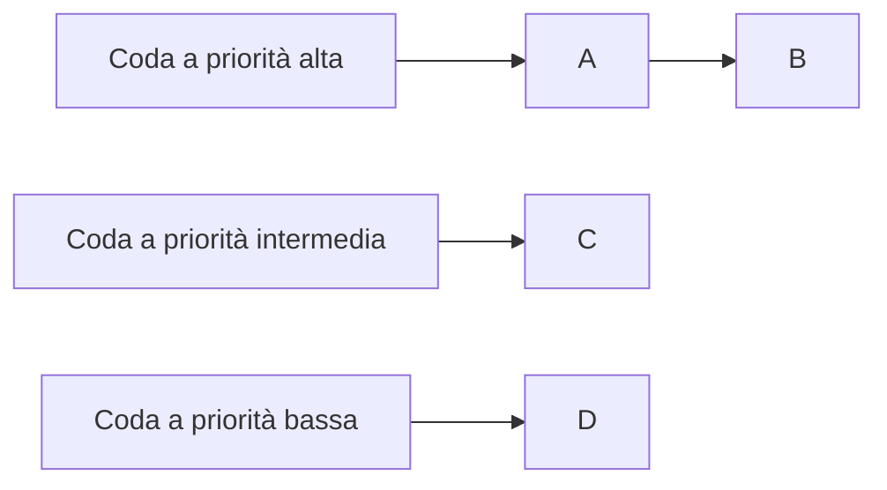
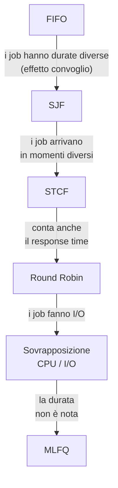

---

## corso: Sistemi Operativi lezione: 3 data: 2026-09-28 argomenti: [limited direct execution, scheduling, workload, turnaround time, response time, fairness, FIFO, convoy effect, SJF, preemption, STCF, round robin, time slice, I/O, interrupt, MLFQ] slide: ["06 - Mechanism: Limited Direct Execution (ripasso)", "07 - Scheduling: Introduction"] tags: [sistemi-operativi]

---
# Lezione 3 — Introduzione allo scheduling

La lezione si apre con un ripasso dei processi, dell'API Unix per gestirli e del meccanismo di _limited direct execution_. Nel ripasso il professore chiarisce anche un punto rimasto ambiguo la volta scorsa. Poi si entra nel tema principale: lo **scheduling**, cioè le regole con cui il sistema operativo decide quale processo mandare in esecuzione e per quanto tempo.

Lo scheduling viene costruito per gradi. Si parte da ipotesi molto semplificate sul carico di lavoro e le si abbandona una alla volta. Ogni volta che un'ipotesi cade, l'algoritmo del passo precedente mostra un difetto e ne serve uno migliore. Il percorso tocca **FIFO**, **SJF**, **STCF** e **Round Robin**, introduce due metriche (_turnaround time_ e _response time_) e arriva al **Multi-Level Feedback Queue**, un algoritmo vicino a quelli usati nei sistemi reali. La trattazione del MLFQ si interrompe a metà e prosegue nella lezione successiva.

## Ripasso delle lezioni precedenti

### Processi, stati e API

Il professore riprende la definizione di processo: un processo è un programma a cui sono unite tutte le informazioni aggiuntive che gli permettono di andare in esecuzione. Il sistema operativo può far eseguire più processi in modo **concorrente**, cioè facendoli "gareggiare" per l'accesso alle risorse, e in particolare alla CPU. Quando un programma viene lanciato, il SO prende dal disco il codice e i dati statici e costruisce il processo. Il processo comprende anche l'**heap** per la memoria allocata dinamicamente, lo **stack** per le variabili locali e i parametri delle funzioni, e il **program counter**, che dice in quale punto del programma ci si trova. Per i dettagli si veda [[Lezione 01 - Introduzione ai SO e processi#Creazione di un processo|Lezione 1]].

Un processo creato si trova in uno dei tre stati _ready_, _running_ o _blocked_. I processi pronti aspettano nella coda ready, che può contenerne moltissimi. Con una sola CPU, invece, un solo processo alla volta è running. Il passaggio da ready a running (_scheduled_) e quello inverso (_descheduled_) seguono le regole dell'algoritmo di scheduling, che è proprio l'argomento di questa lezione. Un processo che aspetta una risorsa, per esempio dati in input che non sono ancora arrivati, passa in blocked: è inutile che resti running senza fare nulla, e nel frattempo la CPU può servire un altro processo pronto. Quando i dati arrivano, il processo **non torna direttamente running**, ma rientra nella coda ready. Lo schema completo delle transizioni è in [[Zen/Anno 2/Sistemi Operativi/generated/Lezione 1 - CLAUDE|Lezione 1 - CLAUDE]].

Dal lato dell'utente, il ripasso riprende lo schema `fork()` + `exec()` + `wait()` visto in [[Zen/Anno 2/Sistemi Operativi/generated/Lezione 2 - CLAUDE|Lezione 2 - CLAUDE]]. Il professore lo riassume togliendo i dettagli:

```c
int rc = fork();          // nasce un processo figlio, copia identica del padre
if (rc == 0) {
    // codice del figlio: qui potrebbe chiamare exec() per eseguire un altro programma
    exit(0);              // uscita regolare, senza errori
} else {
    wait(NULL);           // il padre attende che il figlio sia terminato
}
```

La `fork()` crea una copia identica del processo, con la stessa memoria, gli stessi dati statici e lo stesso program counter. Il figlio quindi non riesegue la `fork()` all'infinito, ma riparte da subito dopo la chiamata. Padre e figlio si distinguono dal valore restituito: il padre riceve il PID del figlio, il figlio riceve zero. Con `exec()`, che in realtà è una famiglia di chiamate, il figlio sostituisce il proprio codice e i propri dati statici con quelli di un altro programma. La shell lancia ogni comando proprio così: fa una `fork()` e il figlio esegue il programma richiesto. È il modo di fare tipico dei sistemi Unix-like come Linux; su Windows il meccanismo è leggermente diverso, ma i concetti sono simili.

### Chiamate di sistema e limited direct execution

Un programma non deve poter mettere le mani nella memoria degli altri processi. Ciò che lo impedisce sono le **chiamate di sistema**. `fork()` ed `exec()` hanno l'interfaccia di normali funzioni, ma in realtà richiedono servizi al kernel. Resta il secondo problema: come fa il SO a togliere la CPU a un processo per darla a un altro? Il professore lo descrive con un'immagine: il processo è come qualcuno che stringe una banconota da 50 euro e non la vuole mollare, e il sistema operativo deve "dargli le sberle sulle mani" per fargli lasciare la CPU. Il meccanismo che lo permette è la **limited direct execution**, descritta in dettaglio in [[Lezione 02 - Process API e Limited Direct Execution#Il protocollo Limited Direct Execution|Lezione 2]].

Il professore ripercorre la tabella del protocollo, che ha tre attori. A sinistra c'è il sistema operativo, al centro le operazioni svolte direttamente dall'hardware, a destra il processo, che lavora nello spazio utente. Nella versione con un solo processo, il SO inizializza all'avvio la **trap table**, che associa a ogni chiamata di sistema l'indirizzo di memoria del codice del kernel che la implementa. Poi crea la voce del processo, alloca la memoria, carica il programma, inizializza lo stack con i parametri e chiama la **return-from-trap**.

> [!example] Domanda in aula: perché la return-from-trap viene prima della trap? 
> La tabella va letta tenendo conto che il SO, all'inizio, è già in kernel mode. La return-from-trap è l'istruzione che porta nello spazio utente, e il processo nello spazio utente non c'è ancora mai stato. La prima cosa da fare è quindi proprio "ritornare" verso il programma, cedendogli il controllo.

Ogni processo ha un proprio **kernel stack**, uno stack del kernel dedicato a quel processo. Non ha niente a che vedere con lo stack utente delle variabili locali: serve a conservare le informazioni legate al passaggio da e verso il kernel. Quando il programma esegue una chiamata di sistema, l'hardware salva sul kernel stack i registri del processo, tra cui il program counter. Poi passa in kernel mode e salta al **trap handler**, cioè al codice che gestisce quella chiamata, che può trovare grazie alla trap table. _Handler_ è un termine generico che significa "gestore": un _interrupt handler_, per esempio, è il pezzo di codice che gestisce un interrupt. Finito il lavoro, una return-from-trap riprende i registri dal kernel stack, torna in user mode e fa ripartire il programma.

Con più processi entra in gioco il **timer**. Per ora si immagina una regola di scheduling semplicissima: passato un certo tempo, il processo in esecuzione viene tolto. All'avvio il SO inizializza la trap table indicando all'hardware anche il **timer handler**, cioè il codice da eseguire ogni volta che il timer scatta, e poi avvia il timer. A un certo punto il processo A sta eseguendo e il timer scatta. L'hardware salva i registri di A sul kernel stack di A, passa in kernel mode e salta al gestore. Questa volta non è il gestore di una chiamata di sistema, perché A non ha chiamato nulla: è il gestore del timer. Il SO esegue l'algoritmo di scheduling, che sceglie il processo B, ed esegue il **context switch**. Alla fine una return-from-trap fa ripartire B dal punto in cui si era fermato. Il professore lo riassume così: il sistema operativo ha fatto il suo lavoro ed è contento, B è contento, un po' meno contento è A, che è finito nella coda dei pronti.

#### Perché i registri di B vengono ripristinati due volte

La tabella del protocollo con il timer può confondere. Durante il context switch compare "restore regs(B) from proc-struct(B)", cioè il ripristino dei registri di B dalla struttura del processo. Poco dopo la return-from-trap esegue "restore regs(B) from k-stack(B)", cioè il ripristino dei registri di B dal suo kernel stack. Sembra la stessa operazione fatta due volte, ma **i registri sono diversi**.

Sul **kernel stack** ci sono i registri che servono all'esecuzione del programma, primo fra tutti il program counter: sono quelli salvati dall'hardware nel momento in cui il processo è stato interrotto, e dicono in che punto era arrivato. Nella **struttura del processo**, invece, ci sono informazioni che servono al kernel per gestire più processi. Un esempio è proprio l'indirizzo del kernel stack di B. Il SO legge quindi dalla struttura di B dove si trova il suo kernel stack e passa a usarlo al posto di quello di A. A quel punto la return-from-trap può recuperare da quello stack i registri che dicono dove B si era fermato.

Il professore precisa che non è importante ricordare questo dettaglio: lo spiega solo perché la slide non dia l'impressione di un'operazione ripetuta inutilmente. La distinzione è approfondita in [[Lezione 02 - Process API e Limited Direct Execution#Il protocollo LDE con timer interrupt|Lezione 2]]. Lì è riportato anche il codice di xv6, nel quale si vede che il puntatore allo stack (`esp`) fa parte dei registri salvati nella struttura del processo, e che il cambio di stack avviene proprio quando quel valore viene ripristinato.

## Che cos'è lo scheduling

Chiarito il meccanismo, resta da stabilire la **politica**: in base a quali regole si decide chi deve andare in esecuzione e chi no. È lo **scheduling**, un problema grande, per il quale nel corso della storia sono stati proposti molti algoritmi diversi: si parla di _algoritmi_ perché si tratta di una sequenza di passi che porta alla decisione. L'algoritmo di scheduling viene eseguito proprio all'interno del gestore del timer.

Il problema è talmente rilevante che esiste un intero settore dedicato a una sua variante più severa, quello dei **sistemi in tempo reale**. In questi sistemi non basta che un processo venga eseguito: deve essere eseguito rispettando vincoli temporali stretti. Il professore fa un esempio. Un processo acquisisce dati da un sensore che ne fornisce dieci al secondo. Non basta mandarlo in esecuzione: bisogna garantire che esegua dieci volte al secondo, altrimenti i dati vanno persi. Per questi sistemi esistono algoritmi di scheduling specifici, che però non fanno parte di questo corso.

## Il carico di lavoro e le ipotesi semplificative

Il **workload** (carico di lavoro) è l'insieme dei processi che lo scheduler deve mandare in esecuzione. Nel seguito i termini _job_, _task_ e _processo_ vengono usati come sinonimi. Per costruire gli algoritmi si parte da quattro ipotesi semplificative sul workload, volutamente irrealistiche, che verranno abbandonate una alla volta:

1. **ogni job esegue per la stessa quantità di tempo**. Si intende la durata che il job avrebbe se eseguisse da solo, che non va confusa con il tempo totale che impiega quando condivide la CPU con altri;
2. **tutti i job arrivano nello stesso momento**;
3. **tutti i job usano solo la CPU**, cioè non fanno input/output. È un'ipotesi importante: un processo che fa I/O può finire nello stato blocked e liberare la CPU per gli altri. Per ora si immaginano processi "ingordi" di CPU, che vogliono solo calcolare;
4. **la durata di ogni job è nota** in anticipo.

L'ultima ipotesi fa capire che tipo di programmi si sta immaginando. Non programmi come Word o un browser, che durano finché l'utente non li chiude e quindi non hanno una durata definita. Piuttosto programmi che fanno un calcolo e poi terminano. Gli esempi del professore sono un programma di machine learning che riceve un'immagine e risponde se contiene un gatto, oppure una simulazione del flusso d'aria sull'ala di un aereo. Anche per programmi di questo tipo, osserva, non è detto che la durata sia così prevedibile.

> [!tip] Approfondimento — Le ipotesi in OSTEP sono cinque #approfondimento 
> OSTEP elenca cinque ipotesi, non quattro. Tra quella sugli arrivi e quella sull'I/O ne compare una in più: **una volta avviato, ogni job esegue fino al completamento**. È esattamente l'ipotesi di algoritmo _non preemptive_ discussa più avanti, e cade con l'introduzione di STCF. Le slide la tralasciano, quindi la loro numerazione differisce da quella del libro: l'ipotesi 3 delle slide (niente I/O) è la 4 di OSTEP, e la 4 delle slide (durata nota) è la 5. Il libro osserva anche che l'ipotesi sulla durata nota è la più irrealistica di tutte: renderebbe lo scheduler "onnisciente" [@arpacidusseau2023ostep, cap. 7].

## Le metriche

Per confrontare gli algoritmi serve un criterio. Il professore ne cita più d'uno. Un utente, per esempio, vuole che un programma lanciato parta presto: chi apre Word non vuole aspettare tre ore. Questa idea di tempo di risposta verrà formalizzata più avanti. La prima metrica considerata è invece il **turnaround time**.

> [!important] Turnaround time Il **turnaround time** di un job è il tempo in cui il job termina meno il tempo in cui è arrivato nel sistema: $$T_{\text{turnaround}} = T_{\text{completion}} - T_{\text{arrival}}$$ Se tutti i job arrivano all'istante zero (ipotesi 2), allora $T_{\text{arrival}} = 0$ e il turnaround coincide con l'istante di completamento.

Il turnaround time non coincide con la durata del job. Se il job fosse l'unico nel sistema le due grandezze sarebbero uguali. Con più job e un algoritmo di scheduling in mezzo, invece, nessuno garantisce che il job venga eseguito subito e senza interruzioni: il turnaround include anche il tempo passato ad aspettare. Gli algoritmi vengono confrontati sul **turnaround medio** dei job del workload.

La seconda metrica è la **fairness** (equità). Un algoritmo è _fair_ se, a fronte di $N$ processi che chiedono di eseguire, li fa eseguire un po' tutti. È _unfair_ se, per esempio, ci sono un processo del professore e uno di uno studente e viene eseguito solo quello del professore. **Prestazioni ed equità sono spesso in conflitto**: un algoritmo può ottimizzare le prestazioni a costo di non far eseguire per molto tempo alcuni job, e quindi diventare meno equo.

## First In, First Out (FIFO)

L'algoritmo più semplice è il **FIFO** (_First In, First Out_), chiamato anche **FCFS** (_First Come, First Served_): i job vengono serviti nell'ordine in cui arrivano. È ciò che succede in un ristorante ben gestito, dove i clienti vengono serviti nell'ordine di arrivo e qualcuno si irrita se vede servire prima un tavolo arrivato dopo. Il FIFO è molto semplice e facile da implementare.

Nell'esempio delle slide i tre job A, B e C arrivano "quasi" insieme: A _just before_ B, che arriva _just before_ C. Il professore spiega che "appena prima" indica una distanza temporale trascurabile, che non va quantificata. Serve solo a stabilire un ordine di arrivo, così che si possa dire chi è arrivato prima. Ogni job esegue per 10 secondi.

```mermaid
gantt
    title FIFO con tre job da 10 s (tempo in secondi)
    dateFormat x
    axisFormat %Q
    section A
    A : fa, 0, 10
    section B
    B : fb, 10, 20
    section C
    C : fc, 20, 30
```



A termina a 10 secondi, B a 20, C a 30. In realtà B e C sono arrivati con un ritardo di $\varepsilon$ e $2\varepsilon$, che però si trascura. Il turnaround medio è

$$\overline{T}_{\text{turnaround}} = \frac{10 + 20 + 30}{3} = 20\ \text{s}.$$

### L'effetto convoglio

Si abbandona ora l'ipotesi 1: i job non hanno più tutti la stessa durata. A, B e C arrivano nello stesso ordine, ma **A dura 100 secondi** mentre B e C durano 10 secondi ciascuno.

```mermaid
gantt
    title FIFO con un job lungo in testa (tempo in secondi)
    dateFormat x
    axisFormat %Q
    section A
    A : ca, 0, 100
    section B
    B : cb, 100, 110
    section C
    C : cc, 110, 120
```



$$\overline{T}_{\text{turnaround}} = \frac{100 + 110 + 120}{3} = 110\ \text{s}.$$

Il turnaround medio sale a 110 secondi, e la colpa non è solo della lunghezza di A. B e C, che da soli impiegherebbero 10 secondi ciascuno, ne aspettano più di 100 perché sono rimasti in coda dietro un job lungo. Le slide chiamano questo fenomeno **effetto convoglio** (_convoy effect_): un gruppo di consumatori "leggeri" di una risorsa resta bloccato in coda dietro un consumatore "pesante". È la situazione di chi, al supermercato, si trova davanti una persona con tre carrelli pieni.

## Shortest Job First (SJF)

Il professore chiede alla classe come si potrebbe migliorare l'algoritmo. La risposta di uno studente è "fare il contrario", cioè mandare avanti i job brevi. È l'idea dello **Shortest Job First** (SJF): si esegue prima il job più breve, poi il successivo più breve, e così via.

```mermaid
gantt
    title SJF con lo stesso workload (tempo in secondi)
    dateFormat x
    axisFormat %Q
    section B
    B : sb, 0, 10
    section C
    C : sc, 10, 20
    section A
    A : sa, 20, 120
```



$$\overline{T}_{\text{turnaround}} = \frac{10 + 20 + 120}{3} = 50\ \text{s}.$$

Il turnaround medio scende da 110 a 50 secondi, più che dimezzato. Resta un job che termina dopo 120 secondi, ma ora è uno solo, e "guarda caso" è proprio quello che chiede più tempo. Il professore nota scherzosamente che sembra quasi esserci una morale: chi pretende di più finisce per ultimo.

### Algoritmi preemptive e non preemptive

Le slide precisano che SJF è uno scheduler **non preemptive**. Il professore si ferma su questa distinzione, che non aveva ancora introdotto.

> [!important] Preemptive e non preemptive
> 
> - Un algoritmo di scheduling è **preemptive** se può **interrompere** un processo in esecuzione: il processo viene tolto dallo stato running, rimesso in ready e riprende più tardi da dove si era fermato.
> - Un algoritmo è **non preemptive** se, una volta scelto il processo da mandare in esecuzione, lo lascia eseguire **fino alla fine**.
> 
> FIFO e SJF sono entrambi non preemptive.

Lo schema di limited direct execution visto finora presupponeva in realtà algoritmi preemptive. Altrimenti non avrebbe senso tutto il lavoro di salvare i registri, cambiare kernel stack e ricordare il program counter di chi viene interrotto. Lo si è dato per scontato perché nei sistemi operativi moderni gli algoritmi di scheduling sono preemptive. Gli algoritmi non preemptive erano molto diffusi in passato e nascono dai **sistemi batch**: si consegnava al calcolatore una serie di programmi da eseguire, e il calcolatore li eseguiva uno dopo l'altro. Anche SJF nasce in quel mondo. Non per questo sono inutili: si usano ancora oggi, in aggiunta ad altri algoritmi.

### Quando viene presa la decisione

Il professore sottolinea un dettaglio. Se la decisione di scheduling venisse presa rigorosamente nel momento in cui arriva ogni job, quando arriva A nel sistema ci sarebbe solo A, e SJF lo manderebbe in esecuzione. Quando arrivano B e C, A è già in esecuzione e, dato che l'algoritmo è non preemptive, non può essere interrotto. Si otterrebbe lo stesso risultato del FIFO.

L'esempio va quindi letto così: A, B e C arrivano in sequenza, ma talmente vicini che lo scheduler prende la decisione quando sono già arrivati tutti e tre. Anche l'algoritmo di scheduling, osserva il professore, ha una sua "risoluzione" e non prende decisioni in continuazione. B e C sono entrambi più corti di A, quindi vengono eseguiti per primi. L'ordine tra B e C è irrilevante: hanno la stessa durata, e l'algoritmo potrebbe sceglierne uno anche tirando un dado.

### Arrivi in istanti diversi

Si abbandona ora l'ipotesi 2: i job possono arrivare in qualunque momento. A arriva all'istante $t = 0$ e deve eseguire per 100 secondi. B e C arrivano a $t = 10$ e devono eseguire per 10 secondi ciascuno. Dieci secondi non sono più un ritardo trascurabile: quando arrivano B e C, A è già in esecuzione da un pezzo e, con un algoritmo non preemptive, non c'è modo di interromperlo.

```mermaid
gantt
    title SJF con B e C in arrivo a t = 10 (tempo in secondi)
    dateFormat x
    axisFormat %Q
    section A
    A : la, 0, 100
    section B
    B : lb, 100, 110
    section C
    C : lc, 110, 120
```



La situazione è simile a quella del FIFO, con una differenza: ora l'istante di arrivo di B e C è 10 e non più 0, e va sottratto.

$$\overline{T}_{\text{turnaround}} = \frac{(100 - 0) + (110 - 10) + (120 - 10)}{3} = \frac{310}{3} \approx 103{,}33\ \text{s}.$$

SJF sembrava una grande idea, ma funziona bene solo se i job arrivano tutti insieme. Con arrivi distanziati perde gran parte del vantaggio, e intuitivamente la maggior parte delle situazioni reali è proprio di questo tipo. Il problema si può risolvere solo introducendo la **preemption**, cioè la possibilità di interrompere un job in esecuzione.

## Shortest Time-to-Completion First (STCF)

Aggiungendo la preemption a SJF si ottiene lo **Shortest Time-to-Completion First** (STCF), noto anche come **Preemptive Shortest Job First** (PSJF).

> [!important] STCF Ogni volta che un nuovo job entra nel sistema, lo scheduler:
> 
> 1. determina il **tempo rimanente** di ciascun job presente, compreso quello nuovo;
> 2. manda in esecuzione il job con il **minor tempo rimanente**, interrompendo, se necessario, quello in esecuzione.

Il nuovo job deve ancora eseguire tutto, perché è appena arrivato. Gli altri, invece, hanno già eseguito in parte: conta quanto manca loro, non la durata complessiva. Con lo stesso esempio di prima, all'istante $t = 10$ la situazione è questa.

|Job|Durata totale|Già eseguito a $t = 10$|Tempo rimanente|
|---|--:|--:|--:|
|A|100 s|10 s|90 s|
|B|10 s|0 s|10 s|
|C|10 s|0 s|10 s|

B ha un tempo rimanente minore di quello di A, quindi **A viene interrotto** e torna nella coda dei pronti, mentre B va in esecuzione. È la prima volta che si vede in azione la transizione _running → ready_ del diagramma degli stati. In realtà a $t = 10$ arrivano sia B sia C, entrambi con 10 secondi da eseguire: vengono eseguiti uno dopo l'altro, e solo alla fine riprende A.

```mermaid
gantt
    title STCF con B e C in arrivo a t = 10 (tempo in secondi)
    dateFormat x
    axisFormat %Q
    section A
    A (prima parte) : sa1, 0, 10
    A (ripresa)     : sa2, 30, 120
    section B
    B : sb, 10, 20
    section C
    C : sc, 20, 30
```



$$\overline{T}_{\text{turnaround}} = \frac{(120 - 0) + (20 - 10) + (30 - 10)}{3} = \frac{150}{3} = 50\ \text{s}.$$

Il turnaround medio torna basso. A termina molto tardi, a 120 secondi, ma B e C impiegano rispettivamente 10 e 20 secondi dal loro arrivo. Il professore insiste su un punto: l'ordine tra B e C non conta, perché l'algoritmo non prevede una regola ulteriore per i casi di parità. Si potrebbe aggiungerne una, per esempio usare il FIFO tra job con lo stesso tempo rimanente, ma qui non lo si fa.

> [!warning] Discrepanza con gli appunti manuali (`Scheduling.md`) Negli appunti il turnaround medio di STCF è scritto come $\frac{100 + (20-10) + (30-10)}{3} = 50$. Il primo termine è sbagliato. A termina a 120 secondi, non a 100, perché viene interrotto per 20 secondi mentre eseguono B e C. Con 100 la somma darebbe 130, e la media sarebbe circa 43,3 secondi e non 50. La formula corretta, quella delle slide, è $\frac{(120-0) + (20-10) + (30-10)}{3} = 50$. Sempre negli appunti, l'esempio di SJF con arrivi sfalsati dice che A arriva "say, $T = 10$": in realtà A arriva a $t = 0$, e sono B e C ad arrivare a $t = 10$.

> [!tip] Approfondimento — Da dove vengono questi algoritmi #approfondimento OSTEP ricorda che lo scheduling ha radici più antiche dei calcolatori: i primi approcci vengono dalla gestione delle operazioni industriali. SJF, in particolare, è un'idea presa dalla **ricerca operativa**. Il lavoro pionieristico è di Cobham (1954) e riguarda l'ordine con cui riparare macchinari guasti. STCF compare nell'analisi di Coffman e Kleinrock del 1968. Il termine _convoy effect_ viene invece dal mondo dei database (Blasgen e colleghi, 1979). Il libro aggiunge due risultati teorici, senza dimostrarli. Se tutti i job arrivano insieme, SJF è **ottimo** rispetto al turnaround medio. Se i job possono arrivare in momenti diversi ed essere interrotti, lo è STCF [@arpacidusseau2023ostep, cap. 7].

## I limiti degli algoritmi visti

Dopo la pausa il professore mette in guardia: gli algoritmi visti finora hanno grossi limiti, e **nessuno di essi, preso così com'è, è l'algoritmo principale di un sistema operativo in uso oggi**. Il primo problema lo aveva sollevato uno studente: come si fa a sapere quanto dura un processo? Non è facile. Per un processo che fa calcoli, come la simulazione o il riconoscimento di immagini, si può fare una stima per eccesso e usarla. Per un browser la domanda non ha nemmeno senso: termina quando l'utente lo chiude. Questi algoritmi non funzionano con programmi del genere, quindi non possono essere quelli che stanno girando sul nostro computer.

Restano comunque interessanti, per ragioni didattiche e storiche e perché alcune loro idee tornano utili. Il FIFO, per esempio, si usa nei sistemi in tempo reale **in aggiunta** all'algoritmo principale, per decidere tra task che hanno la stessa priorità secondo le altre regole. In quel caso ha senso, ma non è l'algoritmo principale.

## Una nuova metrica: il response time

Per capire meglio perché questi algoritmi non vanno bene si introduce una seconda metrica di prestazione.

> [!important] Response time Il **response time** (tempo di risposta) di un job è il tempo che passa dal suo arrivo alla **prima** volta in cui viene schedulato: $$T_{\text{response}} = T_{\text{firstrun}} - T_{\text{arrival}}$$ Non conta quando il job termina, ma quando ottiene la CPU per la prima volta.

Questa metrica nasce con i sistemi a condivisione di tempo, in cui un utente seduto al terminale si aspetta che il sistema reagisca subito ai suoi comandi. STCF e gli algoritmi simili **non sono adatti** a ottimizzare il response time. Nell'esempio di prima, A viene eseguito subito e B appena arriva. C invece, pur essendo arrivato insieme a B, deve aspettare che B finisca:

$$T^{A}_{\text{response}} = 0 - 0 = 0, \qquad T^{B}_{\text{response}} = 10 - 10 = 0, \qquad T^{C}_{\text{response}} = 20 - 10 = 10,$$

$$\overline{T}_{\text{response}} = \frac{0 + 0 + 10}{3} \approx 3{,}33\ \text{s}.$$

In questo caso C se la cava ancora bene, ma la sua prima esecuzione dipende interamente dalla durata del job che lo precede. Il professore propone di immaginare che B duri 80 secondi: dato che 80 è meno dei 90 secondi che restano ad A, B verrebbe comunque mandato in esecuzione, e C slitterebbe molto più avanti.

> [!warning] Precisazione sull'esempio con B da 80 secondi Se C durasse ancora 10 secondi, STCF eseguirebbe per primo C, che ha il tempo rimanente minore, e non B. Il ragionamento del professore funziona se **sia B sia C** durano 80 secondi, entrambi meno dei 90 rimanenti di A. In quel caso B esegue da 10 a 90 e C ottiene la CPU per la prima volta solo a $t = 90$, con un response time di 80 secondi. Il punto resta valido: con STCF chi arriva insieme ad altri job brevi può aspettare a lungo prima di eseguire anche una sola istruzione.

Serve quindi uno scheduler sensibile al response time.

## Round Robin (RR)

Un algoritmo adatto al response time è il **Round Robin** (RR). Il professore precisa che nemmeno RR è usato in questa forma sui nostri computer. In buona approssimazione, però, è molto simile agli algoritmi reali, ed è quello che si immaginava quando si è introdotto il timer che esegue lo scheduling.

> [!important] Round Robin Il Round Robin si basa sul **time slicing** (suddivisione del tempo in fette):
> 
> - esegue un job per una **fetta di tempo** (_time slice_), poi passa al job successivo nella coda di esecuzione;
> - ripete il giro finché tutti i job non sono terminati.
> 
> La fetta di tempo si chiama anche **quanto di scheduling** (_scheduling quantum_). La sua durata deve essere un **multiplo del periodo del timer interrupt**.

Il nome _quanto_ indica che la fetta è indivisibile: una volta fissata la sua durata, nessun processo può essere schedulato per un tempo minore. Che il quanto sia un multiplo del periodo del timer è inevitabile: il SO riprende il controllo solo quando il timer scatta, e quindi può decidere di cambiare processo solo ogni $n$ scatti. Il professore sottolinea che il quanto **non coincide necessariamente** con il periodo del timer. Nello schema di limited direct execution, il timer può scattare e lo scheduler può decidere di lasciare in esecuzione lo stesso processo di prima, perché il suo quanto non è ancora finito (si veda [[Lezione 02 - Process API e Limited Direct Execution#Lo scheduler e la decisione di commutare|Lezione 2]]).

### SJF e Round Robin a confronto

Tre job A, B e C arrivano nello stesso istante e devono eseguire per 5 secondi ciascuno. Con SJF hanno tutti la stessa durata, quindi l'ordine è arbitrario. Si tratta dello SJF classico, non di quello preemptive.

```mermaid
gantt
    title SJF con tre job da 5 s (tempo in secondi)
    dateFormat x
    axisFormat %Q
    section A
    A : ja, 0, 5
    section B
    B : jb, 5, 10
    section C
    C : jc, 10, 15
```



A esegue subito, B esegue per la prima volta a 5 secondi e C a 10, pur essendo arrivati tutti a zero:

$$\overline{T}_{\text{response}} = \frac{0 + 5 + 10}{3} = 5\ \text{s}.$$

Con Round Robin e un quanto di 1 secondo, invece, i job si alternano a ogni secondo. Ogni cella della tabella seguente corrisponde a un quanto, e il numero in intestazione è l'istante in cui il quanto inizia.

|Istante (s)|0|1|2|3|4|5|6|7|8|9|10|11|12|13|14|
|---|---|---|---|---|---|---|---|---|---|---|---|---|---|---|---|
|CPU|A|B|C|A|B|C|A|B|C|A|B|C|A|B|C|

$$\overline{T}_{\text{response}} = \frac{0 + 1 + 2}{3} = 1\ \text{s}.$$

Tutti cominciano a fare qualcosa quasi subito. Nei sistemi reali il quanto è molto più piccolo di un secondo, e il professore cita valori dell'ordine dei millisecondi, quindi l'effetto è ancora più marcato. Si intuisce però subito che c'è un prezzo. Ogni job viene "stirato" il più possibile: A termina a 13 secondi, B a 14, C a 15.

$$\overline{T}^{,\text{RR}}_{\text{turnaround}} = \frac{13 + 14 + 15}{3} = 14\ \text{s}, \qquad \overline{T}^{,\text{SJF}}_{\text{turnaround}} = \frac{5 + 10 + 15}{3} = 10\ \text{s}.$$

Il valore per SJF non è stato calcolato a lezione, ma segue dallo stesso schema e rende evidente il compromesso.

```chart
type: bar
labels: [Turnaround medio (s), Response time medio (s)]
series:
  - title: SJF
    data: [10, 5]
  - title: Round Robin (quanto 1 s)
    data: [14, 1]
width: 80%
labelColors: false
beginAtZero: true
```

Le slide riassumono così: **RR è equo, ma ha prestazioni scarse su metriche come il turnaround time**. C'è un compromesso inevitabile. Chi è disposto a essere poco equo può eseguire fino in fondo i job brevi e ottenere un buon turnaround, a scapito del response time. Chi privilegia l'equità ottiene un buon response time, a scapito del turnaround.

> [!warning] Precisazione — equità e response time non sono la stessa cosa 
> A lezione si dice che RR è _fair_ "perché minimizza il response time medio", come se l'equità consistesse nel minimizzare il tempo di risposta. La definizione corretta è un'altra. Una politica è **equa** se divide la CPU in modo uniforme tra i processi attivi su una scala di tempo breve. Il buon response time del RR è una **conseguenza** di questa equità, non la sua definizione. OSTEP osserva anche che qualunque politica equa in questo senso ha prestazioni scarse sul turnaround, ed è proprio questo il compromesso descritto sopra [@arpacidusseau2023ostep, cap. 7].

### La lunghezza del quanto

Uno studente fa notare che nell'esempio non si tiene conto del costo del context switch. L'osservazione è corretta. Con un quanto di un secondo il tempo per salvare e ripristinare i registri è davvero trascurabile, ma più il quanto si accorcia, più aumentano i context switch e più il loro costo pesa. Le slide lo dicono esplicitamente: **la lunghezza del quanto è critica**.

- Un **quanto più corto** migliora il response time: al limite, la prima esecuzione di ogni job diventa vicinissima al suo arrivo. Però il costo dei context switch finisce per **dominare** le prestazioni complessive.
- Un **quanto più lungo** permette di **ammortizzare** il costo dei context switch, che avvengono più di rado. Però il response time **peggiora**.

La scelta del quanto è quindi una decisione di progetto, presa dagli ingegneri in base al costo del context switch sul sistema considerato. Per questo non ha una risposta unica, e cambia nel tempo: su un sistema più veloce di oggi la risposta sarà diversa da quella che si sarebbe data vent'anni fa. Un modo per quantificare la frazione di tempo sprecata, con il relativo grafico, è in [[Lezione 01 - Introduzione ai SO e processi#Il costo del context switch|Lezione 1]].

## Includere l'input/output

Si abbandona ora l'ipotesi 3: i programmi possono fare I/O, e anzi tutti i programmi reali lo fanno. L'esempio delle slide considera due job A e B, ciascuno dei quali ha bisogno di **50 ms di CPU**. A esegue per 10 ms e poi emette una richiesta di I/O, che dura a sua volta 10 ms. Poi esegue altri 10 ms di CPU, un altro I/O, e così via. B invece usa la CPU per 50 ms di fila, senza fare I/O. Un task come A, che alterna brevi fasi di calcolo e fasi di I/O, si dice **interattivo**. Lo scheduler esegue prima A e poi B.

Se lo scheduler ignorasse l'I/O e lasciasse finire A prima di passare a B, durante ogni I/O di A la CPU resterebbe inutilizzata. Nelle tabelle seguenti ogni cella corrisponde a un intervallo di 10 ms, e il numero in intestazione è l'istante in cui l'intervallo inizia.

|Istante (ms)|0|10|20|30|40|50|60|70|80|90|100|110|120|130|
|---|---|---|---|---|---|---|---|---|---|---|---|---|---|---|
|CPU|A|–|A|–|A|–|A|–|A|B|B|B|B|B|
|Disco|–|A|–|A|–|A|–|A|–|–|–|–|–|–|

È un **cattivo uso delle risorse**: il lavoro complessivo termina dopo 140 ms, e per 40 di questi la CPU resta ferma. Il comportamento ragionevole è un altro. Mentre A aspetta il disco, la CPU esegue B; quando l'I/O di A termina, A riprende:

|Istante (ms)|0|10|20|30|40|50|60|70|80|90|
|---|---|---|---|---|---|---|---|---|---|---|
|CPU|A|B|A|B|A|B|A|B|A|B|
|Disco|–|A|–|A|–|A|–|A|–|–|

La **sovrapposizione** (_overlap_) tra il calcolo di un processo e l'I/O dell'altro permette di **massimizzare l'utilizzo della CPU**. Lo stesso lavoro si conclude in 100 ms invece che in 140, e la CPU non resta mai ferma. Nel primo caso era occupata per 100 ms su 140, circa il 71% del tempo. Questi valori si ricavano dai diagrammi della slide e non sono stati calcolati a lezione.

È esattamente ciò che descrive il diagramma degli stati. Mentre A fa I/O si trova nello stato _blocked_, e B, che è pronto, può andare in esecuzione. L'algoritmo a cui si arriva è quello che si era immaginato parlando degli stati, con un processo running e, nello stesso momento, un altro che fa I/O.

Ne segue una conseguenza importante: **un task non usa necessariamente tutto il suo quanto**. Con un quanto di 20 ms, A eseguirebbe per 10 ms e poi lascerebbe la CPU **di sua iniziativa**, perché si blocca in attesa dell'I/O. Nello schema con sovrapposizione anche B esegue solo 10 ms alla volta: quando l'I/O di A termina, la CPU torna ad A. La CPU, quindi, non viene tolta solo dal timer. Ci sono situazioni in cui è il task stesso a cederla per fare qualcos'altro.

> [!tip] Approfondimento — Come si ottiene la sovrapposizione #approfondimento 
> OSTEP spiega come uno scheduler STCF possa produrre lo schema con sovrapposizione: ogni fase di calcolo di 10 ms di A viene trattata come un **job indipendente**. All'inizio lo scheduler deve scegliere tra un job A da 10 ms e un job B da 50 ms, e sceglie A, che è più corto. Quando A si blocca sull'I/O, resta solo B, che va in esecuzione. Quando l'I/O termina arriva un nuovo "job" A da 10 ms, che ha un tempo rimanente minore di quello di B e quindi lo interrompe. Trattando ogni fase di calcolo come un job, lo scheduler fa eseguire spesso i processi interattivi, e mentre questi fanno I/O la CPU serve i processi che calcolano [@arpacidusseau2023ostep, cap. 7].

### Che cosa succede quando l'I/O termina: l'interrupt

Le slide riassumono il comportamento dello scheduler in presenza di I/O. Quando un job avvia una richiesta di I/O, si **blocca** in attesa del completamento, e lo scheduler dovrebbe mandare in esecuzione un altro job. Quando l'I/O si completa, viene sollevato un **interrupt** e il SO sposta il processo dallo stato _blocked_ allo stato _ready_.

Il professore insiste sul fatto che l'interrupt non è solo un concetto astratto, ma qualcosa di **fisico**. Lo mostra con la **porta parallela**, una porta di I/O nata per le stampanti e oggi scomparsa dai computer, almeno esternamente. È un connettore con una serie di pin, su cui arrivano i segnali elettrici. Una porta pensata per l'uscita, come quella della stampante, può comunque ricevere qualche dato in ingresso: idealmente, la stampante potrebbe segnalare "ho ricevuto la prima pagina, sono pronta per la seconda". Il professore precisa che non funziona esattamente così, ma rende l'idea. Uno dei pin della porta è collegato alla linea di interrupt del calcolatore. Quando arrivano dati, su quel pin viaggia un segnale elettrico che raggiunge la CPU sotto forma di interrupt e indica che **i dati sono pronti per essere letti**.

> [!warning] Precisazione — chi riceve l'interrupt
>  A lezione si dice che il processo bloccato "riceve l'interrupt, va a leggere i dati e poi si rimette nella coda dei pronti". Più precisamente, come indica la slide, l'interrupt trasferisce il controllo al **sistema operativo**. È il suo gestore dell'interrupt (_interrupt handler_) a occuparsi del dispositivo e a spostare il processo in attesa dallo stato _blocked_ allo stato _ready_. Il processo riprenderà a eseguire solo quando lo scheduler lo sceglierà di nuovo.

## Multi-Level Feedback Queue (MLFQ)

Le slide di questa parte (capitolo 8 di OSTEP) non sono tra il materiale fornito. Il contenuto che segue si basa sulla trascrizione e sugli appunti manuali, verificati sul libro.

Dato tutto questo, il professore presenta un algoritmo che si avvicina molto di più a uno scheduler reale: il **Multi-Level Feedback Queue** (MLFQ), cioè "coda a più livelli con retroazione". Racconta che in passato nello scheduler di Linux c'era qualcosa di questo tipo, anche se non sa se sia ancora così, e si aspetta che qualcosa di simile ci sia anche in Windows, perché l'idea è molto interessante.

### L'obiettivo

Il MLFQ risponde in parte alla domanda dello studente su come conoscere la durata di un task. L'idea è di non cercare di sapere **quanto** dura un task, ma di capire **se** è un task lungo o breve, per trattare le due categorie in modo diverso. Gli obiettivi sono due:

- **ottimizzare il turnaround time**, il che significa eseguire prima i job più corti. Ma senza conoscere a priori la durata, e in un sistema in cui un browser o Word una durata non ce l'hanno nemmeno;
- **minimizzare il response time**, perché il sistema sia reattivo per gli utenti interattivi.

Come si è visto, i due obiettivi sono in conflitto: per il response time conviene qualcosa come il Round Robin, per il turnaround qualcosa come SJF. Il MLFQ è uno scheduler che **impara dal passato per prevedere il futuro**.

### La struttura

Il MLFQ non ha più un'unica coda dei pronti, ma **più code distinte**, ciascuna con un diverso **livello di priorità**. Nella convenzione del professore, un numero più alto indica una priorità più alta: per esempio code con priorità 2, 1 e 0. Ogni job pronto a eseguire si trova in **una sola** di queste code. Lo scheduler privilegia la coda a priorità più alta, e tra i job di quella coda usa il **Round Robin**. Il Round Robin quindi si usa ancora, ma non fra tutti i task: solo fra quelli della coda a priorità più alta.

> [!important] Regole base del MLFQ
> 
> - **Regola 1**: se la priorità di A è maggiore della priorità di B, esegue A (B no).
> - **Regola 2**: se la priorità di A è uguale alla priorità di B, A e B eseguono in Round Robin.



Nell'esempio, A e B si trovano nella coda a priorità più alta, C in una coda intermedia e D in quella più bassa. Applicando le due regole, A e B eseguono in Round Robin e, finché restano lì, C e D sembrano non eseguire mai. Chi è un po' più smaliziato vede subito il problema: con le sole regole 1 e 2, i task nelle code basse rischiano di non eseguire mai finché c'è qualcuno nelle code alte.

Il professore osserva però che le cose non stanno proprio così. Per restare nella coda più alta, A e B devono avere una caratteristica precisa, chiarita fra poco: devono essere task che **non usano tutta la CPU** e che si bloccano spesso. Quando vogliono eseguire lo fanno presto, con un tempo di risposta molto breve, ma fanno qualcosa e poi si mettono in attesa. Ogni volta che sia A sia B sono bloccati, C può eseguire. C a sua volta si blocca più spesso di D, e ogni volta che C è bloccato può eseguire D. Il meccanismo conserva così, per i task a bassa priorità, la possibilità di fare qualcosa.

### Come cambia la priorità

Resta la domanda centrale: come si decide in quale coda mettere un job, se non se ne conosce la durata? L'idea del MLFQ è di **far variare la priorità di un job in base al comportamento osservato**, in modo dinamico. Da qui il termine _feedback_, cioè retroazione.

- Un job che **cede spesso la CPU da solo**, perché si blocca in attesa di I/O, **mantiene una priorità alta**: è il comportamento tipico di un processo interattivo.
- Un job che **usa la CPU in modo intensivo** per lunghi periodi, e consuma sempre tutto il proprio quanto, fa molti calcoli: la sua **priorità viene ridotta**.

Le regole 1 e 2 dicono chi esegue a parità di code; servono altre regole per decidere in quale coda si trova ogni job.

> [!important] Regole di aggiustamento della priorità
> 
> - **Regola 3**: quando un job entra nel sistema, viene messo nella coda a **priorità più alta**.
> - **Regola 4a**: se un job usa **l'intero quanto** mentre è in esecuzione, la sua priorità viene **ridotta**: scende di una coda.
> - **Regola 4b**: se un job **cede la CPU prima che il quanto sia finito**, resta allo **stesso livello** di priorità.

La regola 3, nelle parole del professore, consiste nel "dare fiducia" al nuovo arrivato. Un job che usa sempre tutto il quanto è un task "ingordo", non uno che fa spesso I/O, e quindi scende di coda.

In questo modo **il MLFQ approssima SJF**, pur senza conoscere la durata dei job. Ogni job entra nella coda più alta, come se fosse breve. Se lo è davvero, termina in fretta, prima di essere sceso molto. Se è lungo, scende di coda in coda e finisce fra i job a bassa priorità, dove esegue quando i job brevi e interattivi non hanno bisogno della CPU.

> [!example] Le regole in azione (esempio costruito, non svolto a lezione) Si considerino tre code Q2 (priorità alta), Q1 e Q0 (priorità bassa) e un quanto di 10 ms. Il job A è lungo e usa solo la CPU, e arriva a $t = 0$. Il job B usa solo la CPU per 20 ms in tutto e arriva a $t = 100$ ms.
> 
> |Intervallo (ms)|In esecuzione|Coda di A|Coda di B|Regola applicata|
> |---|---|---|---|---|
> |0 – 10|A|Q2|–|3: A entra nella coda più alta|
> |10 – 20|A|Q1|–|4a: A ha usato tutto il quanto e scende|
> |20 – 100|A|Q0|–|4a: A scende ancora; nella coda più bassa esegue da solo|
> |100 – 110|B|Q0|Q2|3 e 1: B entra in Q2 e ha priorità maggiore di A|
> |110 – 120|B|Q0|Q1|4a: B scende in Q1, che è comunque sopra Q0|
> |da 120|A|Q0|terminato|B ha finito; A riprende|
> 
> B, che è breve, ha un response time nullo e un turnaround di 20 ms, come con SJF: termina prima di scendere fino alla coda di A. Se fosse stato lungo, avrebbe continuato a scendere e avrebbe finito per condividere Q0 con A in Round Robin. Un terzo job interattivo che eseguisse 1 ms e poi facesse I/O cederebbe sempre la CPU prima della fine del quanto. Per la regola 4b resterebbe stabilmente in Q2, con un ottimo tempo di risposta.

### Un problema aperto

Le regole 1–4b non bastano. Il professore chiude la lezione con un problema in sospeso: che cosa succede con i task "furbastri"? Un programmatore potrebbe scrivere un task che esegue quasi tutto il suo quanto e poi, appena prima della fine, fa un accesso all'I/O. Per la regola 4b cederebbe la CPU prima della fine del quanto e conserverebbe la priorità alta, pur essendo di fatto un task che calcola senza sosta. Servono meccanismi che lo impediscano. A questo si aggiunge il rischio, già notato, che i task nelle code basse restino a lungo senza CPU se nelle code alte ci sono molti job. Le soluzioni saranno il tema della lezione successiva.

> [!tip] Approfondimento — Le origini del MLFQ e il suo uso reale #approfondimento Il MLFQ fu descritto per la prima volta da Corbató e colleghi nel 1962, nel **Compatible Time-Sharing System** (CTSS) del MIT. Questo lavoro, insieme a quello successivo su Multics, valse a Corbató il Premio Turing. Secondo OSTEP, varianti del MLFQ sono usate come scheduler di base in molti sistemi: i derivati di BSD UNIX, Solaris, Windows NT e i Windows successivi. Nella versione 1.10 il libro generalizza leggermente le regole 4a e 4b introducendo l'**allotment**. È il tempo che un job può trascorrere a un certo livello di priorità prima di essere retrocesso; inizialmente si assume uguale a un solo quanto, come nella versione delle slide [@arpacidusseau2023ostep, cap. 8].

> [!tip] Approfondimento — Che cosa usa oggi Linux #approfondimento Il professore ricordava che "tempo fa" lo scheduler di Linux somigliava al MLFQ, senza sapere se fosse ancora così. La documentazione del kernel permette di precisare. Dalla versione **2.6.23** lo scheduler principale di Linux è il **CFS** (_Completely Fair Scheduler_) di Ingo Molnar. CFS ha sostituito lo scheduler precedente, che gestiva l'interattività con apposite euristiche. CFS non è un MLFQ: cerca di modellare una CPU "ideale" capace di eseguire tutti gli $n$ task pronti contemporaneamente, ciascuno a $1/n$ della velocità [@linuxdoccfs]. A partire dalla versione **6.6** il kernel è passato a **EEVDF** (_Earliest Eligible Virtual Deadline First_). Anche EEVDF punta a ripartire equamente il tempo di CPU tra i task con la stessa priorità, usando tempi di esecuzione virtuali e scadenze virtuali [@linuxdoceevdf]. Gli scheduler di questo tipo, detti _a quote proporzionali_, sono l'argomento del capitolo 9 di OSTEP.

## Quadro riassuntivo

|Algoritmo|Preemptive|Serve conoscere la durata|Turnaround medio|Response time|
|---|---|---|---|---|
|FIFO / FCFS|No|No|Buono solo con job di durata simile; soffre l'effetto convoglio|Scarso|
|SJF|No|Sì|Ottimo se i job arrivano insieme; peggiora con arrivi sfalsati|Scarso|
|STCF (PSJF)|Sì|Sì|Ottimo anche con arrivi sfalsati|Scarso|
|Round Robin|Sì|No|Tra i peggiori|Ottimo, con un quanto piccolo|
|MLFQ|Sì|No: osserva il comportamento|Approssima SJF|Buono per i job interattivi|

Il grafico riporta il turnaround medio negli esempi delle slide e mostra l'effetto convoglio, il recupero ottenuto da SJF, la sua perdita di efficacia con arrivi sfalsati e il ritorno a 50 secondi con la preemption.

```chart
type: bar
labels: [FIFO 10/10/10, FIFO 100/10/10, SJF, SJF arrivi a t=10, STCF arrivi a t=10]
series:
  - title: Turnaround medio (s)
    data: [20, 110, 50, 103.33, 50]
width: 80%
labelColors: false
beginAtZero: true
```

Il filo logico della lezione si può riassumere così: ogni ipotesi abbandonata mette in crisi l'algoritmo precedente e ne richiede uno nuovo.



## Indicazioni pratiche

Durante il ripasso il professore annuncia alcune attività per le lezioni successive.

**Esercizi di programmazione su Linux.** In una delle prossime lezioni il professore vuole dedicare del tempo a esercizi in cui si programmano davvero le chiamate viste (`fork`, `exec`, `wait` e simili). Chiede quindi a tutti di procurarsi un sistema Linux. Le strade sono due: installarlo sul proprio PC in _dual boot_, accanto al sistema esistente, oppure usare una **macchina virtuale** su Windows o macOS. Il professore usa di solito VirtualBox, ma ne esistono altre. Ritiene utile, per degli studenti di ingegneria, avere Linux installato; chi non vuole può ricorrere alla macchina virtuale. Pubblicherà le istruzioni.

**Esercizi con il simulatore e connessione al server.** Nella lezione successiva il professore vuole fare esercizi con il simulatore mostrato in [[Zen/Anno 2/Sistemi Operativi/generated/Lezione 1 - CLAUDE|Lezione 1 - CLAUDE]]. Nessuno sembra aver ancora provato a collegarsi al server, forse per timore del vincolo di non poter poi cambiare computer. Alcuni studenti che ci hanno provato non ci sono riusciti perché hanno indicato `localhost`. È sbagliato: `localhost` presuppone che il server giri sul proprio PC, e non è così. Vanno inseriti **l'indirizzo IP e la porta del server indicati sul sito del corso**; nella registrazione i numeri dettati dal professore non sono comprensibili. Gli esercizi in classe si possono fare anche senza connessione. Però il professore assegnerà esercizi da svolgere nei giorni successivi che fanno guadagnare punti per l'esame, e per quelli la connessione al server è necessaria. Consiglia quindi di provare subito e di scrivergli in caso di problemi.
