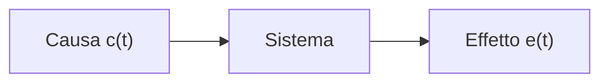
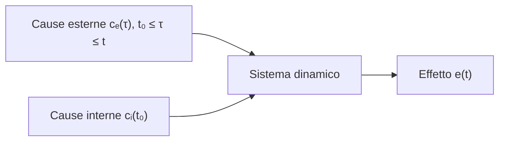
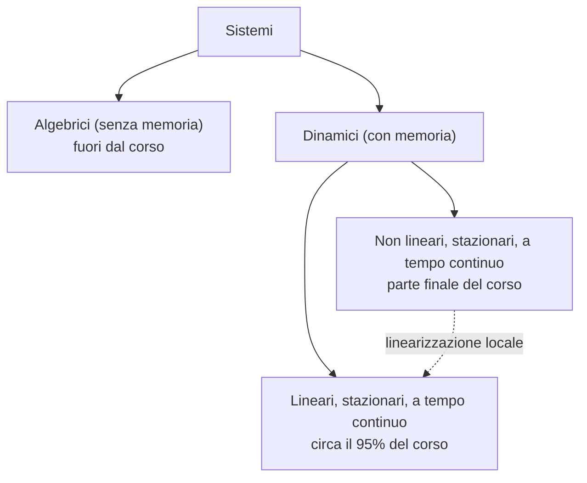
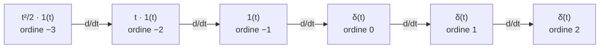

---

## corso: Teoria dei Sistemi lezione: 1 data: 2026-09-22 argomenti: [organizzazione del corso, sistemi algebrici, sistemi dinamici, cause interne ed esterne, linearità, stazionarietà, tempo continuo, linearizzazione, funzioni generalizzate, delta di Dirac, impulsi di ordine k, gradino unitario, rampa unitaria] fonti: [trascrizione parte 1, appunti manuali, dispensa del docente] tags: [teoria-dei-sistemi, lezione]
---
# Lezione 1 — Sistemi dinamici e funzioni generalizzate

Questa nota ricostruisce la prima lezione del corso. Le fonti sono la trascrizione della registrazione (parte 1), gli appunti personali (note Obsidian e appunti a mano) e la dispensa del docente («Appunti di Teoria dei sistemi», cap. 1, pp. 10–12). La lezione ha due parti. Nella prima il docente presenta l'organizzazione del corso, il concetto di sistema e le proprietà che delimitano il perimetro del corso. Nella seconda introduce il primo strumento matematico, le funzioni generalizzate, che saranno indispensabili per la trasformata di Laplace e per lo studio delle risposte dei sistemi.

## 1. Organizzazione del corso e modalità d'esame

### 1.1 Struttura del corso

Nell'anno accademico in corso Teoria dei Sistemi è un insegnamento **annuale**. Il docente ha comunicato che questo sarà l'ultimo anno in cui lo terrà; l'organizzazione futura (chi lo terrà, e se resterà annuale) non è ancora definita. La scelta dell'annualità è motivata didatticamente: nelle materie con una componente matematica consistente i contenuti hanno bisogno di un tempo di «sedimentazione» prima di essere davvero assimilati. Un corso semestrale può essere più comodo per superare l'esame, ma è meno efficace per la comprensione, che è ciò di cui il docente dichiara di doversi preoccupare.

Il corso non è diviso in moduli e **non sono previste prove intermedie**: l'esame si sostiene alla fine. Non è più possibile nemmeno «congelare» un voto, cioè chiedere di tenerlo in sospeso per migliorarlo in seguito. La pratica era consentita in passato ed è stata abbandonata dopo che alcuni studenti si sono presentati a registrare voti di quattro o cinque anni prima. Per la stessa ragione non si fanno prove intermedie: obbligherebbero a conservare per un anno intero esiti parziali.

### 1.2 L'esame orale

L'esame è **esclusivamente orale**. Il docente lo giustifica così: la capacità più importante da sviluppare all'università è difendere una tesi davanti a un interlocutore. Nello scritto conta solo ciò che è scritto; all'orale una tesi o la si sa sostenere o no, e chi la sostiene deve esserne convinto.

La prova parte di norma da un **esercizio**. Durante la soluzione, in un momento scelto a caso, il docente chiede il _perché_ di un passaggio. A metà della risposta può arrivare un secondo perché, e poi un terzo («i tre perché in cascata»), risalendo fino ai concetti di base. Lo scopo è distinguere chi ripete a memoria esercizi già visti da chi capisce i passaggi che giustificano ciò che sta facendo. Il voto proposto si può soltanto accettare o rifiutare. La decisione si può prendere fino alla conclusione dell'appello, cioè finché non è stato esaminato l'ultimo studente in elenco.

Nella valutazione conta molto il **tipo di risposta**. Una risposta logicamente sensata, anche se imbocca una strada sbagliata, mostra che lo studente ha ragionato. Viene considerata in modo ben diverso dallo scrivere cose a caso nella speranza che «magari servono»: un passaggio o serve, o si pensa che serva, o si pensa che non serva.

Due ulteriori indicazioni completano il quadro. La prima: molti esercizi che sembrano richiedere calcoli lunghi si risolvono quasi senza calcoli, concatenando i concetti («se vale questo, allora quest'altro, quindi la soluzione è questa»). L'esempio citato è l'inversione di una matrice $4\times4$, dove le probabilità di arrivare in fondo senza errori sono basse. La seconda: bisogna distinguere gli errori da cui non ci si può difendere da quelli che si devono riconoscere. Se un problema chiede una massa e i conti danno $10{,}3\ \mathrm{kg}$ invece di $10\ \mathrm{kg}$, entrambi i valori sono plausibili e l'errore non si vede a occhio. Se invece per un oggetto di circa un chilo il risultato è sette tonnellate, o se esce negativa una grandezza che deve essere positiva, lo studente deve accorgersi da solo che il risultato è sbagliato, anche senza sapere dove sia l'errore.

### 1.3 Che cosa vuol dire «capire»

Per chiarire la differenza tra sapere e capire, il docente propone una domanda: _perché meno per meno fa più?_ Senza ricorrere ai numeri complessi, la risposta sta nella proprietà distributiva della moltiplicazione. Scrivendo $3 = 5-2$ si ha

$$9 = 3\cdot 3 = (5-2)(5-2) = 25 - 10 - 10 + (-2)(-2),$$

e affinché il risultato sia $9$ deve necessariamente essere $(-2)(-2) = +4$. La regola dei segni non è un dogma: è imposta dalla coerenza con la distributività.

Nel corso, «capire» significa la stessa cosa. Quando si afferma che un sistema è stabile, si deve avere un'idea della catena di passaggi che ha portato a studiare quella proprietà, invece di recitarla come una poesia imparata a memoria. È esattamente ciò che i «perché» dell'esame vanno a verificare.

### 1.4 Materiale di studio e comunicazioni

Secondo il docente, il materiale che mette a disposizione è sufficiente per l'esame. Comprende:

- una **dispensa in italiano**, non recente ma valida (le derivate «si fanno sempre allo stesso modo»);
- un **fascicolo di esercizi**, con alcuni errori già noti, quasi tutti refusi e non errori concettuali;
- **dispense in inglese** più recenti, che coprono gran parte di ciò che serve.

Bisogna iscriversi al corso su **AulaWeb**, l'unico canale con cui il docente comunica con gli studenti. Lì si trova anche il codice del team Microsoft Teams del corso, che contiene ancora le lezioni registrate nel periodo Covid. Le esposizioni non sono identiche a quelle di quest'anno, ma i contenuti sono gli stessi e possono servire a recuperare una lezione persa. Con il codice si entra direttamente nel team: le richieste di partecipazione non vengono prese in considerazione.

Altre indicazioni pratiche. Il docente tende a parlare in fretta e chiede di essere avvisato quando succede. In alcuni momenti chiederà di non prendere appunti e di limitarsi ad ascoltare, perché scrivere mentre si ascolta riduce la probabilità di capire ciò che si scrive. Motori di ricerca, Wikipedia e assistenti basati sull'intelligenza artificiale si possono usare liberamente, ma con diffidenza: il docente avverte, ad esempio, che le definizioni di stabilità che si trovano in rete sono spesso imprecise.

## 2. Il concetto di sistema

### 2.1 Causa ed effetto

La teoria dei sistemi studia oggetti nei quali si possono riconoscere relazioni di **causa ed effetto**. Per tutto il corso li rappresenteremo nello stesso modo: una scatola (il _blocco_) che racchiude il sistema, frecce entranti che rappresentano le cause e frecce uscenti che rappresentano gli effetti. In prima battuta non interessa la natura fisica di ciò che sta dentro la scatola, ma la legge che lega le cause agli effetti.



Questa legge si formalizza con un **operatore** $O$: una regola, di natura per ora non specificata, che ricevuta la causa restituisce l'effetto. I sistemi si distinguono a seconda di _quali_ valori della causa l'operatore ha bisogno di conoscere.

### 2.2 Sistemi algebrici

In un sistema algebrico l'effetto a un certo istante dipende soltanto dalla causa nello stesso istante.

> [!important] Sistema algebrico 
> Un sistema è **algebrico** se l'effetto all'istante $t$ è determinato dalla sola causa allo stesso istante: $$e(t) = O\big(c(t)\big).$$ Non tiene conto dell'attività passata: è un sistema **privo di memoria**.

Il legame è «algebrico» nel senso che esiste una relazione diretta, istante per istante, tra causa ed effetto. L'esempio più semplice è la calcolatrice: si digita $3+5$, si preme «=» e il risultato è $8$. Non importa se la macchina abbia eseguito prima una sola operazione o cento miliardi: la storia passata non ha alcuna influenza. Per gli scopi del corso questi sistemi hanno un interesse teorico praticamente nullo.

### 2.3 Sistemi dinamici: cause esterne e cause interne

In un **sistema dinamico** l'effetto dipende dalla **storia** del sistema. Le cause sono di due tipi. Le **cause esterne** $c_e$ agiscono dall'esterno durante l'esperimento (sono quelli che più avanti chiameremo _ingressi_). Le **cause interne** $c_i$ riassumono la condizione in cui si trova il sistema quando si comincia a osservarlo.



> [!important] Sistema dinamico 
> In un sistema **dinamico** l'effetto all'istante $t$ dipende dalle cause interne all'istante iniziale $t_0$ e dalle cause esterne su tutto l'intervallo $[t_0, t]$: $$e(t) = O\big(c_i(t_0),\ c_e(\tau)\big), \qquad t_0 \le \tau \le t .$$

L'asimmetria tra i due argomenti dell'operatore (un solo istante per le cause interne, un intervallo per quelle esterne) è il punto chiave. L'esempio seguente la rende concreta.

### 2.4 Esempio: il riempimento di un recipiente

Si consideri un recipiente cilindrico (una pentola) privo di perdite, con sezione di area unitaria, nel quale un rubinetto versa del liquido. Indichiamo con $h(t)$ il livello del liquido e con $u(t)$ la **portata** del rubinetto, cioè il volume immesso per unità di tempo (ad esempio in litri al secondo). Il volume di un cilindro è base per altezza, $V = A,h$. Poiché la sezione non varia, il liquido che entra può soltanto far crescere il livello; con $A = 1$ volume e livello coincidono numericamente.

Il bilancio del recipiente afferma che la variazione nel tempo del volume è uguale alla portata entrante:

$$\dot h(t) = u(t).$$

Il punto sopra la lettera indica la derivata rispetto al tempo. È la notazione universale nei problemi di evoluzione temporale, al posto dell'apice usato in analisi per la derivata rispetto a una generica variabile indipendente. L'equazione ha un'interpretazione immediata: se il rubinetto è chiuso ($u=0$) il livello resta costante, se la portata è positiva il livello cresce. In linea di principio si potrebbe ammettere anche $u<0$ (una pompa che aspira), ma solo finché nel recipiente c'è liquido; inoltre il recipiente ha un volume finito, oltre il quale trabocca. Il docente trascura deliberatamente questi casi limite e assume che il modello sia valido così com'è.

Si tratta di un'equazione differenziale del primo ordine, che si risolve integrando. Scegliamo come istante iniziale $t_0 = 0$ (quello in cui si comincia a osservare il recipiente) e indichiamo con $\tau$ la variabile di integrazione:

$$\int_0^t \dot h(\tau),d\tau = h(t) - h(0) = \int_0^t u(\tau),d\tau \qquad\Longrightarrow\qquad h(t) = h(0) + \int_0^t u(\tau),d\tau .$$

La relazione ha esattamente la struttura di un sistema dinamico. L'effetto $h(t)$ dipende dalla causa interna $h(0)$, cioè da quanto liquido c'era all'inizio, e dalla causa esterna $u(\tau)$ su tutto l'intervallo $[0,t]$.

> [!example] Bilancio numerico 
> Il recipiente contiene inizialmente $5$ litri e il rubinetto eroga $2\ \mathrm{l/s}$ per $5\ \mathrm{s}$. Allora $$h(5\ \mathrm s) = 5 + \int_0^5 2,d\tau = 5 + 10 = 15 \ \text{litri},$$ che è proprio il risultato a cui si arriverebbe a buon senso, senza scrivere alcuna equazione.
> 
> Lo stesso risultato si ottiene con un profilo di portata diverso, ad esempio $4\ \mathrm{l/s}$ per il primo secondo e $1{,}5\ \mathrm{l/s}$ nei quattro secondi successivi: $4 + 6 = 10$ litri immessi, $15$ in totale. Per questo sistema conta solo l'integrale della portata, non il modo in cui è stata erogata.

L'esempio chiarisce l'asimmetria tra i due tipi di causa. La causa interna va conosciuta **soltanto all'istante iniziale**: il valore $h(0)$ racchiude tutta la storia del sistema da $-\infty$ fino a quel momento. Qualcuno, prima, ha messo nel recipiente quel liquido; a noi basta sapere quanto ne ha messo. La causa esterna va invece conosciuta **su tutto l'intervallo** dell'esperimento, perché deve essere integrata: deve essere una funzione definita su $[t_0, t]$, costante o variabile che sia.

> [!warning] Discrepanza negli appunti (nota «Sistemi») 
> Nella nota $h(t)$ è indicato come «causa interna» e $u(t)$ come «velocità di alzamento del livello». Più precisamente, $h(t)$ è l'**effetto**: la causa interna è il valore iniziale $h(0)$. Inoltre $u(t)$ è una **portata** (volume nell'unità di tempo) e coincide con la velocità di salita del livello solo perché la sezione è unitaria.
> 
> Analogamente, l'equivalenza «5 l → 5 cm» vale solo scegliendo le unità in modo che la sezione valga 1: ad esempio $A = 1\ \mathrm{dm^2}$ con $h$ in decimetri, oppure $A = 1000\ \mathrm{cm^2}$ con $h$ in centimetri.

### 2.5 Il legame con le equazioni differenziali

Quanto detto dà un significato preciso a due concetti già incontrati in analisi. Se un'equazione differenziale rappresenta matematicamente un oggetto che evolve in base a ciò che gli accade, allora:

- le **condizioni iniziali** riassumono ciò che è successo a quell'oggetto da $-\infty$ fino all'istante iniziale (le cause interne);
- il **termine forzante** a secondo membro, la $f(t)$ di un'equazione del tipo $a_n y^{(n)} + \dots + a_0 y = f(t)$, rappresenta le cause esterne.

Il docente ha richiamato il metodo di soluzione delle equazioni lineari visto in analisi: si sommano la soluzione dell'omogenea associata e un integrale particolare che dipende dal solo termine forzante. Ha osservato che le condizioni iniziali e la forzante sono del tutto indipendenti: le une non dipendono da come è fatta l'altra.

> [!tip] Collegamento con il seguito del corso 
> La separazione rigorosa dei due contributi verrà formalizzata più avanti; la dispensa la tratta nel paragrafo sulla risoluzione delle equazioni differenziali. Si distingue tra **risposta libera**, dovuta alle sole condizioni iniziali con ingresso nullo, e **risposta forzata**, dovuta al solo ingresso a partire da condizioni iniziali nulle («stato zero»). Nel recipiente sono i due addendi $h(0)$ e $\int_0^t u(\tau),d\tau$.

## 3. Proprietà dei sistemi dinamici

### 3.1 Linearità

Nel recipiente i contributi della causa interna e della causa esterna si **sommano**, senza combinarsi in modi più complicati. Questo accade perché il sistema è lineare.

> [!important] Sistema lineare 
> Un sistema è **lineare** se vale il **principio di sovrapposizione degli effetti**. In presenza di più cause, interne o esterne, si può calcolare l'effetto di ciascuna come se agisse da sola; l'effetto complessivo è la somma degli effetti così calcolati.
> 
> In forma compatta (formalizzazione standard dell'enunciato dato a lezione): se le cause $\big(c_i^{(1)}, c_e^{(1)}\big)$ producono l'effetto $e^{(1)}$ e le cause $\big(c_i^{(2)}, c_e^{(2)}\big)$ producono $e^{(2)}$, allora per ogni coppia di costanti $\alpha,\beta$ le cause $\big(\alpha c_i^{(1)}+\beta c_i^{(2)},\ \alpha c_e^{(1)}+\beta c_e^{(2)}\big)$ producono $\alpha e^{(1)}+\beta e^{(2)}$.

Nell'esempio numerico la sovrapposizione si vede direttamente. Con il rubinetto sempre chiuso agisce solo la causa interna: dopo $5$ secondi nel recipiente ci sono ancora i $5$ litri iniziali. Con il recipiente inizialmente vuoto agisce solo la causa esterna: dopo $5$ secondi ci sono $10$ litri. Messe insieme, le due cause producono $5 + 10 = 15$ litri, esattamente la somma dei due effetti calcolati separatamente.

Lo stesso vale con più cause esterne. Se nel recipiente versassero molti rubinetti, l'effetto complessivo sarebbe la somma degli effetti dei singoli rubinetti, perché l'integrale di una somma è la somma degli integrali. In generale, la relazione $h(t) = h(0) + \int_0^t u(\tau),d\tau$ è lineare rispetto alla coppia $\big(h(0), u\big)$.

### 3.2 Stazionarietà (tempo-invarianza)

> [!important] Sistema stazionario (tempo-invariante)
>  Un sistema è **stazionario**, o **tempo-invariante**, se il risultato di un esperimento non dipende dalla sua collocazione sull'asse assoluto dei tempi. Ripetendo lo stesso esperimento traslato nel tempo, con le stesse condizioni iniziali e gli stessi ingressi, si ottiene lo stesso effetto, traslato della stessa quantità.

In termini concreti: se si esegue un esperimento adesso e lo si ripete identico domani mattina, il risultato deve essere lo stesso. L'asse assoluto dei tempi va dal Big Bang a chissà quando; spostare l'esperimento su quell'asse, lasciando tutto il resto invariato, non deve cambiarne l'esito. Il recipiente è stazionario perché nella legge $\dot h = u$ nulla dipende esplicitamente dal tempo. Non lo sarebbe, ad esempio, se la sezione del recipiente cambiasse nel tempo secondo una legge assegnata.

### 3.3 Tempo continuo e tempo discreto

Nei sistemi **a tempo continuo** il tempo è una variabile reale e le relazioni tra cause ed effetti sono descritte da **equazioni differenziali**, come $\dot h = u$.

Un calcolatore, al contrario, si può vedere come un sistema in cui lo stato cambia solo a ogni colpo di clock. Lo si osserva «a scatti», un istante dopo l'altro, e la sua evoluzione si descrive scrivendo come varia lo stato da un colpo di clock al successivo, cioè con relazioni tra valori in istanti discreti consecutivi (in termini tecnici, equazioni alle differenze). Questi sono sistemi **a tempo discreto**.

### 3.4 Il perimetro del corso

Per circa il 95% del corso si studieranno sistemi **dinamici, lineari, stazionari e a tempo continuo**. La parte restante riguarda sistemi ancora dinamici, stazionari e a tempo continuo, ma **non lineari**.



Il motivo per cui si dedica tanto spazio ai sistemi lineari è che quasi tutti i sistemi reali **non** sono lineari. Però anche quelli più «cattivi» hanno quasi sempre una buona proprietà: localmente ammettono una rappresentazione lineare. Ciò che si impara sui sistemi lineari si può quindi riciclare, con attenzione a ciò che si afferma, anche per quelli non lineari.

### 3.5 Pendolo e Segway

Il primo esempio di questo riciclo è il **pendolo**, che per piccole oscillazioni si comporta come un sistema lineare. L'equazione del pendolo contiene il seno dell'angolo, e il seno non è una funzione lineare (non vale $\sin(a+b) = \sin a + \sin b$). Per angoli piccoli però il seno si può approssimare con il suo argomento, e l'equazione diventa lineare. Il docente avverte che questa giustificazione è corretta ma non sufficiente. Per sapere se l'approssimazione dice il vero serviranno le conoscenze sulla stabilità: costruire il modello non basta, e quando si tratterà la stabilità si vedrà perché.

L'esempio che il docente porta ogni anno è il **Segway**: la pedana a due ruote su cui si sta in piedi, che si guida spostando il peso del corpo. Il conducente con la sua testa costituisce un **pendolo rovesciato** montato sulla base mobile. La differenza tra pendolo diritto e rovesciato sta nella natura del punto di equilibrio:

- con la massa in basso (pendolo diritto), dopo una piccola spinta il pendolo continua a oscillare attorno all'equilibrio senza allontanarsene;
- con la massa in alto (pendolo rovesciato), se lo si posiziona esattamente in equilibrio e nessuno lo tocca resta fermo, ma una spinta anche minima lo fa cadere. Rovesciare il pendolo equivale a invertire la gravità.

Per farsi un'idea del controllo si può fare un esperimento: tenere in equilibrio un ombrello verticale sul palmo della mano. Si scopre che si muove la mano nella direzione in cui l'ombrello sta cadendo: in avanti se cade in avanti, indietro se cade indietro. È esattamente ciò che fa il Segway, il cui sistema di controllo ha un solo scopo: non far cadere il conducente. Se il conducente si sbilancia in avanti la base deve avanzare, altrimenti cade; se si sbilancia indietro deve arretrare. Il Segway è un sistema fortemente non lineare (le equazioni contengono seni e coseni). Ciononostante, con le conoscenze sui sistemi lineari e il loro riciclo locale si riesce a capire come farlo funzionare senza sapere nulla di controllo non lineare.

> [!tip] Approfondimento: la linearizzazione del pendolo #approfondimento 
> Derivazione standard, non svolta a lezione, che rende concreto il discorso precedente. Per un pendolo ideale di lunghezza $\ell$, senza attrito, con angolo $\theta$ misurato dalla verticale verso il basso, la seconda legge della dinamica dà $$\ddot\theta = -\frac{g}{\ell},\sin\theta .$$ Per angoli piccoli si usa lo sviluppo di Taylor $\sin\theta = \theta - \theta^3/6 + \dots \approx \theta$ e si ottiene l'equazione lineare $\ddot\theta = -\frac{g}{\ell},\theta$. Le sue soluzioni sono oscillazioni sinusoidali di pulsazione $\sqrt{g/\ell}$, limitate nel tempo: è il comportamento del pendolo diritto.
> 
> Per il pendolo rovesciato si misura l'angolo $\varphi = \theta - \pi$ dalla verticale verso l'alto. Poiché $\sin(\varphi + \pi) = -\sin\varphi$, si ha $\ddot\varphi = \frac{g}{\ell}\sin\varphi \approx \frac{g}{\ell},\varphi$. Le soluzioni contengono l'esponenziale crescente $e^{\sqrt{g/\ell},t}$: una piccola perturbazione cresce e il pendolo cade.
> 
> Si nota anche il limite della linearizzazione: quando $\varphi$ cresce, l'ipotesi «angolo piccolo» non vale più. Per questo dire «l'angolo è piccolo» non basta, e la giustificazione rigorosa richiede la teoria della stabilità.

## 4. Funzioni generalizzate

### 4.1 Perché servono

Prima di affrontare i sistemi servono alcuni strumenti matematici. Per un periodo, avverte il docente, si accumuleranno concetti di cui si capirà l'utilità solo più avanti. Il primo strumento sono le **funzioni generalizzate**, dette anche **distribuzioni**. Non sono funzioni nel senso ordinario. Su di esse cercheremo di applicare, per quanto possibile, le stesse regole che valgono per le funzioni ordinarie: somma, prodotto per una costante, derivazione, integrazione. Il loro ruolo diventerà chiaro con la trasformata di Laplace e con lo studio di sistemi sollecitati da ingressi discontinui.

### 4.2 La delta di Dirac: definizione

La funzione generalizzata fondamentale è la **delta di Dirac** $\delta(t)$, detta anche **impulso unitario**.

> [!important] Delta di Dirac (impulso unitario) 
> La delta di Dirac $\delta(t)$ non è definita assegnandone il valore punto per punto, ma **solo attraverso il suo integrale**: $$\int_{-\infty}^{t}\delta(\tau),d\tau = 0 \quad \forall, t<0, \qquad \int_{0^-}^{0^+}\delta(\tau),d\tau = 1, \qquad \int_{t}^{+\infty}\delta(\tau),d\tau = 0 \quad \forall, t>0 .$$

A parole: l'integrale della delta su qualunque intervallo interamente a sinistra dell'origine, lungo o corto che sia, vale zero; lo stesso vale per qualunque intervallo interamente a destra. Non appena l'intervallo di integrazione scavalca l'origine, l'integrale vale $1$. Tutta l'«area» della delta è concentrata nell'origine ed è unitaria. I simboli $0^-$ e $0^+$ indicano lo zero raggiunto da sinistra e da destra: $\int_{0^-}^{0^+}$ è l'integrale su un intervallo piccolo a piacere che contiene l'origine.

### 4.3 Come «immaginare» la delta: famiglie approssimanti

Ci sono moltissimi modi di rappresentare la delta. Tutti soddisfano la definizione, e sono «tutti sbagliati e tutti giusti», a seconda dell'uso. Il più semplice è un **rettangolo** di base $2\varepsilon$ centrato nell'origine e di altezza $1/(2\varepsilon)$ (negli appunti la semiampiezza è indicata con $T$):

$$p_\varepsilon(t) = \begin{cases} \dfrac{1}{2\varepsilon}, & -\varepsilon < t < \varepsilon \[6pt] 0, & \text{altrove}\end{cases} \qquad \int_{-\infty}^{+\infty} p_\varepsilon(t),dt = 2\varepsilon\cdot\frac{1}{2\varepsilon} = 1 \quad \forall,\varepsilon>0 .$$

Qualunque sia $\varepsilon$, l'area è sempre unitaria. Facendo tendere $\varepsilon$ a zero il rettangolo diventa sempre più stretto e sempre più alto, ma conserva l'area. La delta si disegna come il «limite» di questo processo: una **freccia** verticale nell'origine. L'altezza della freccia non rappresenta un valore: per indicare l'area si scrive un numero accanto alla punta.

> [!important] Il limite va inteso sugli integrali 
> Negli appunti compare il limite puntuale $\lim_{\varepsilon\to 0}p_\varepsilon(t)$, che varrebbe $0$ per $t\neq0$ e $\infty$ per $t=0$, annotato come «non applica». L'annotazione è corretta. Una funzione nulla ovunque tranne che in un punto ha integrale nullo, perché il valore in un singolo punto non contribuisce all'area; inoltre $\infty$ non è un numero. Il limite puntuale perde quindi proprio la proprietà che definisce la delta.
> 
> Ciò che si conserva al tendere di $\varepsilon$ a zero è l'**integrale**: $\delta$ è l'oggetto che, dentro gli integrali, si comporta come $p_\varepsilon$ con $\varepsilon$ piccolissimo. È questo il senso dell'espressione «limite nel senso delle distribuzioni».

Un'altra rappresentazione utile è il **triangolo** con base da $-\varepsilon$ a $\varepsilon$ e altezza $1/\varepsilon$. L'area è $\tfrac{1}{2}\cdot 2\varepsilon\cdot\tfrac{1}{\varepsilon} = 1$, e al tendere di $\varepsilon$ a zero si ottiene ancora la delta. Il triangolo servirà per costruire la derivata dell'impulso (§4.6).

La dispensa (p. 10) propone un terzo punto di vista, che anticipa il legame tra impulso e gradino. Il gradino «vero», che salta istantaneamente da $0$ a $1$, fisicamente non esiste: ogni variazione reale richiede un tempo di transizione. Lo si approssima allora con una rampa che, in un intervallo di durata $\Delta$, porta il valore da $0$ a $1$ con coefficiente angolare $1/\Delta$. La derivata di questo gradino approssimato è un rettangolo di base $\Delta$ e altezza $1/\Delta$, cioè di area unitaria. Per $\Delta\to 0$ il gradino approssimato tende al gradino e il rettangolo tende all'impulso: **la delta è, in senso generalizzato, la derivata del gradino**. Il §4.7 mostrerà la relazione inversa.

### 4.4 Impulsi di area qualsiasi e impulsi traslati

Moltiplicando la delta per una costante $A$ si ottiene un impulso di area $A$:

$$\int_{-\infty}^{t}A,\delta(\tau),d\tau = 0 \ \ \forall, t<0, \qquad \int_{0^-}^{0^+}A,\delta(\tau),d\tau = A, \qquad \int_{t}^{+\infty}A,\delta(\tau),d\tau = 0 \ \ \forall, t>0 .$$

Il coefficiente che moltiplica la delta è quindi la sua **area**. Il modulo di $A$ dà l'area; il segno indica il verso della freccia, verso l'alto se $A>0$ e verso il basso se $A<0$. È come se, nella rappresentazione con il rettangolo, l'altezza fosse $A/(2\varepsilon)$ invece di $1/(2\varepsilon)$, e quindi «rovesciata» quando $A$ è negativo. Accanto alla freccia si annota il valore dell'area; senza annotazione si intende area unitaria.

L'impulso si può anche **traslare**. $\delta(t-T)$ è concentrato nel punto in cui il suo argomento si annulla, cioè $t = T$: la regola generale è che **la freccia sta dove l'argomento della delta vale zero**. Lo si verifica con il cambio di variabile $\sigma = \tau - T$ (quindi $d\tau = d\sigma$, e gli estremi si spostano di $T$):

$$\int_{T^-}^{T^+}\delta(\tau-T),d\tau = \int_{0^-}^{0^+}\delta(\sigma),d\sigma = 1, \qquad \int_{-\infty}^{t}\delta(\tau-T),d\tau = \int_{-\infty}^{t-T}\delta(\sigma),d\sigma = 0 \ \ \forall, t<T .$$

Graficamente, $\delta(t-T)$ è la stessa freccia di $\delta(t)$, spostata nel punto $T$.

> [!example] Disegnare $-3,\delta(t+2)$ L'argomento $t+2$ si annulla per $t=-2$: la freccia sta in $t=-2$. Il coefficiente $-3$ dice che l'area vale $3$ in modulo e che la freccia è rivolta **verso il basso**. Accanto alla punta si annota $3$ (o $-3$).

### 4.5 La proprietà del campionamento

La proprietà più importante della delta è quella del **campionamento** (in inglese _sifting_, «setacciamento»).

> [!important] Proprietà del campionamento Sia $f$ una funzione regolare (per semplicità $f\in C^\infty$). Allora $$\int_{-\infty}^{+\infty} f(\tau),\delta(\tau - T),d\tau = f(T).$$ In forma «estesa», valida nel senso degli integrali: $$f(t),\delta(t-T) = f(T),\delta(t-T).$$

Integrare una funzione moltiplicata per un impulso centrato in $T$ restituisce il valore della funzione in $T$: l'impulso «preleva» un campione della funzione nel punto in cui è concentrato. La forma estesa dice la stessa cosa senza l'integrale. Poiché l'impulso esiste solo in $T$, il prodotto $f(t),\delta(t-T)$ è un impulso centrato in $T$ con area pari a $f(T)$. Negli appunti la formula è scritta distinguendo il caso $f(T)\neq0$ (dove vale $f(T),\delta(t-T)$) dal caso $f(T)=0$ (dove il prodotto è nullo). Il secondo caso è già contenuto nel primo, perché $0\cdot\delta(t-T) = 0$.

Va notata la differenza tra le due scritture. In $f(t),\delta(t-T)$ la funzione dipende dalla variabile; in $f(T),\delta(t-T)$ compare un **numero**, cioè una costante che moltiplica l'impulso. La proprietà dice che, ai fini degli integrali, le due cose sono equivalenti.

Una giustificazione intuitiva (non svolta a lezione) si ottiene con il rettangolo $p_\varepsilon$:

$$\int_{-\infty}^{+\infty} f(\tau),p_\varepsilon(\tau - T),d\tau = \frac{1}{2\varepsilon}\int_{T-\varepsilon}^{T+\varepsilon} f(\tau),d\tau ;\xrightarrow[\ \varepsilon\to0\ ]{}; f(T).$$

Il secondo membro è la **media** di $f$ su un intervallo sempre più piccolo attorno a $T$. Per una funzione continua, per il teorema della media integrale, questa media tende al valore $f(T)$.

> [!warning] Validità La proprietà del campionamento vale per l'**impulso di ordine zero**, cioè per $\delta$. Per le derivate dell'impulso (§4.6) il prodotto con una funzione si comporta diversamente: lo si vedrà nella lezione 2.

### 4.6 Le derivate dell'impulso: impulsi di ordine positivo

Che cosa succede se si cerca di derivare la delta? Si parte dalla rappresentazione con il triangolo di base $[-\varepsilon, \varepsilon]$ e altezza $1/\varepsilon$, che è una funzione ordinaria, e se ne calcola la derivata tratto per tratto.

Una funzione è derivabile in un punto se il limite del rapporto incrementale esiste e i limiti da destra e da sinistra coincidono. Il triangolo è derivabile ovunque tranne nei tre punti angolosi $-\varepsilon$, $0$ e $\varepsilon$. In quei punti esistono la derivata destra e la derivata sinistra, ma sono diverse. Negli altri tratti la derivata è il coefficiente angolare dei segmenti, cioè il rapporto tra il cateto opposto all'angolo (l'altezza, $1/\varepsilon$) e il cateto su cui l'angolo poggia (la base, $\varepsilon$):

$$\frac{d}{dt},q_\varepsilon(t) = \begin{cases} 0, & t < -\varepsilon \[2pt] +\dfrac{1}{\varepsilon^2}, & -\varepsilon < t < 0 \[8pt] -\dfrac{1}{\varepsilon^2}, & 0 < t < \varepsilon \[6pt] 0, & t > \varepsilon \end{cases}$$

dove $q_\varepsilon$ indica il triangolo. La derivata è formata da due rettangoli, uno positivo e uno negativo, ciascuno di base $\varepsilon$ e altezza $1/\varepsilon^2$, quindi di area $\pm 1/\varepsilon$. Al tendere di $\varepsilon$ a zero i due rettangoli si stringono e crescono in altezza. Il limite si rappresenta con una freccia verso l'alto e una verso il basso affiancate nell'origine, ed è chiamato **doppietto**: $\dot\delta(t)$.

Il doppietto **non** è la somma di due impulsi. Le aree dei due lobi, $\pm 1/\varepsilon$, non restano finite ma divergono. Si tratta di un oggetto nuovo: l'**impulso di ordine 1**. La dispensa osserva che il suo integrale è l'impulso.

> [!important] Impulsi di ordine positivo La delta $\delta(t)$ è l'**impulso di ordine 0**. Le sue derivate successive sono gli **impulsi di ordine positivo**: $$\dot\delta(t) = \frac{d}{dt}\delta(t) \ \ (\text{ordine } 1,\ \text{doppietto}), \qquad \ddot\delta(t) = \frac{d^2}{dt^2}\delta(t) \ \ (\text{ordine } 2), \qquad \dots$$ In generale si indica con $\delta_k(t)$ l'impulso di ordine $k$. Ogni derivazione aumenta l'ordine di uno: $\dfrac{d}{dt}\delta_k(t) = \delta_{k+1}(t)$. Nella notazione con i punti, l'ordine coincide con il numero di punti.

Il procedimento si può iterare all'infinito: rappresentando il doppietto con triangoli e derivando ancora si ottiene un «tripletto», e così via. Tutti gli impulsi di ordine $\geq 0$ sono concentrati in un punto (nell'origine, oppure in $T$ se traslati). Quelli di ordine positivo non hanno una rappresentazione grafica significativa: sono frecce che salgono e scendono, di cui non si riesce a dire molto.

> [!tip] Schema consigliato La costruzione del doppietto (triangolo, derivata a due rettangoli, limite a due frecce) si capisce molto meglio vedendola disegnata in tre pannelli affiancati, come negli appunti a mano. Se si vuole, la si può ridisegnare con Excalidraw in questo punto della nota.

### 4.7 Gli integrali dell'impulso: impulsi di ordine negativo

Se derivare aumenta l'ordine, integrare lo diminuisce. Il primo integrale della delta è il **gradino unitario**.

> [!important] Gradino unitario (impulso di ordine −1) $$1(t) = \int_{-\infty}^{t}\delta(\tau),d\tau = \begin{cases} 0, & t < 0 \ 1, & t \ge 0 \end{cases}$$ È l'**impulso di ordine $-1$**. Il simbolo $1(t)$ è quello usato nei controlli automatici; altri testi usano $u(t)$ o $H(t)$, da Heaviside. Il gradino traslato $1(t-T)$ vale $1$ quando il suo argomento è non negativo, cioè per $t \ge T$, e $0$ prima.

Il valore del gradino esattamente in $t=0$ è una **convenzione**. L'integrale della delta da $-\infty$ a $0$ esatto non è determinato dalla definizione, che parla solo di $0^-$ e $0^+$, quindi si può scegliere qualunque valore tra $0$ e $1$. Il docente cita software che pongono $1(0) = 1/2$; altri pongono $0$. Nel corso, per comodità (tornerà utile più avanti), si adotta la **continuità da destra** (_right continuity_): $1(0) = 1$.

Il gradino è prezioso anche come «interruttore». Per qualunque funzione $f(t)$, il prodotto $f(t)\cdot 1(t)$ ha lo stesso andamento di $f(t)$ per $t\ge0$ ed è nullo prima. Questo uso verrà sviluppato nella lezione 2.

Integrando ancora si ottiene la **rampa unitaria**:

$$\int_{-\infty}^{t} 1(\tau),d\tau = \begin{cases} 0, & t < 0 \ t, & t \ge 0 \end{cases} = t\cdot 1(t).$$

Per $t<0$ si integra una funzione nulla. Per $t\ge0$ si calcola l'area di un rettangolo di altezza $1$ e base $t$, cioè $t$. La scrittura compatta $t\cdot1(t)$ evita la parentesi graffa: per $t<0$ il gradino annulla il prodotto (ad esempio in $t=-5$ si ha $(-5)\cdot 1(-5) = (-5)\cdot 0 = 0$), mentre per $t\ge0$ resta $t$. La rampa si dice «unitaria» perché il suo coefficiente angolare è $1$. È l'**impulso di ordine $-2$**, ottenuto integrando due volte l'impulso di ordine zero.

Proseguendo, ogni integrazione aumenta di uno il grado della potenza di $t$:

$$\int_{-\infty}^{t}\tau,1(\tau),d\tau = \frac{t^2}{2},1(t) \ \ (\text{ordine } -3), \qquad \int_{-\infty}^{t}\frac{\tau^2}{2},1(\tau),d\tau = \frac{t^3}{6},1(t) \ \ (\text{ordine } -4),$$

e in generale

$$\frac{t^k}{k!},1(t) \quad\text{è l'impulso di ordine } -(k+1).$$

Ogni integrazione rende il raccordo nell'origine **più dolce**:

- il gradino non è nemmeno continuo;
- la rampa è continua ($C^0$) ma non derivabile nell'origine;
- la parabola $\tfrac{t^2}{2}1(t)$ è continua con derivata prima continua ($C^1$), mentre la derivata seconda salta;
- la cubica $\tfrac{t^3}{6}1(t)$ è $C^2$, e così via.

In generale $\tfrac{t^k}{k!},1(t)$ è di classe $C^{k-1}$: ogni integrazione aggiunge un grado di regolarità. Il grafico seguente mostra le prime tre funzioni continue della famiglia.

```chart
type: line
labels: [-1, -0.75, -0.5, -0.25, 0, 0.25, 0.5, 0.75, 1, 1.25, 1.5, 1.75, 2]
series:
  - title: "t·1(t), ordine −2, classe C0"
    data: [0, 0, 0, 0, 0, 0.25, 0.5, 0.75, 1, 1.25, 1.5, 1.75, 2]
  - title: "t²/2·1(t), ordine −3, classe C1"
    data: [0, 0, 0, 0, 0, 0.031, 0.125, 0.281, 0.5, 0.781, 1.125, 1.531, 2]
  - title: "t³/6·1(t), ordine −4, classe C2"
    data: [0, 0, 0, 0, 0, 0.003, 0.021, 0.07, 0.167, 0.326, 0.562, 0.893, 1.333]
tension: 0.2
width: 80%
labelColors: false
fill: false
beginAtZero: true
```

### 4.8 Quadro d'insieme

> [!important] Regola dell'ordine
> 
> - **Derivando** un impulso di qualsiasi ordine, l'ordine **aumenta di uno**: $\dfrac{d}{dt}\delta_k(t) = \delta_{k+1}(t)$.
> - **Integrando** un impulso di qualsiasi ordine, l'ordine **diminuisce di uno**: $\displaystyle\int_{0^-}^{t}\delta_k(\tau),d\tau = \delta_{k-1}(t)$.

La catena seguente riassume le relazioni: da sinistra a destra si deriva, da destra a sinistra si integra.



|Ordine|Oggetto|Come si ottiene|Caratteristiche|
|:-:|:--|:--|:--|
|$2$|$\ddot\delta(t)$|derivata del doppietto|concentrato nell'origine, non rappresentabile|
|$1$|$\dot\delta(t)$ (doppietto)|derivata dell'impulso|freccia su e freccia giù affiancate|
|$0$|$\delta(t)$|per definizione|area unitaria concentrata nell'origine|
|$-1$|$1(t)$ (gradino)|integrale dell'impulso|discontinuo nell'origine|
|$-2$|$t\cdot1(t)$ (rampa)|integrale del gradino|continuo ($C^0$), non derivabile in $0$|
|$-3$|$\tfrac{t^2}{2},1(t)$|integrale della rampa|classe $C^1$|
|$-(k+1)$|$\tfrac{t^k}{k!},1(t)$|$k+1$ integrazioni dell'impulso|classe $C^{k-1}$|

Si nota una netta asimmetria. Gli impulsi di ordine positivo sono oggetti concentrati in un punto, di cui non si capisce molto guardandoli. Quelli di ordine negativo sono invece funzioni ordinarie: nulle fino all'origine e poi potenze del tempo, sempre più regolari.

Il prossimo strumento, che il docente raccomanda di conoscere «come la tabellina del due», è la **trasformata di Laplace**, trattata nella lezione successiva.

## Domande di autoverifica

Domande nello stile dei «perché» d'esame, con una traccia di risposta.

1. _Perché il recipiente è un sistema dinamico e non algebrico?_ Il livello in $t$ dipende da quanto liquido c'era all'inizio e da tutta la portata erogata in $[0,t]$, non solo dalla portata in $t$.
2. _Perché la causa interna basta conoscerla in un istante, mentre la causa esterna va conosciuta su un intervallo?_ La causa interna riassume tutta la storia passata in un valore. La causa esterna agisce lungo tutto l'esperimento e il suo effetto si accumula (nel recipiente, attraverso l'integrale).
3. _Perché la delta non può essere definita come limite puntuale del rettangolo?_ Il limite puntuale è nullo quasi ovunque e ha quindi integrale nullo; si perderebbe l'area unitaria, che è la proprietà che definisce la delta.
4. _Perché il doppietto non è la somma di due impulsi?_ Le aree dei due lobi della derivata del triangolo valgono $\pm1/\varepsilon$ e divergono per $\varepsilon\to0$: il limite non è una coppia di impulsi di area finita.
5. _Perché la rampa si scrive $t\cdot1(t)$ e non semplicemente $t$?_ Perché per $t<0$ deve valere zero; il gradino annulla il prodotto prima dell'origine e lo lascia invariato dopo.