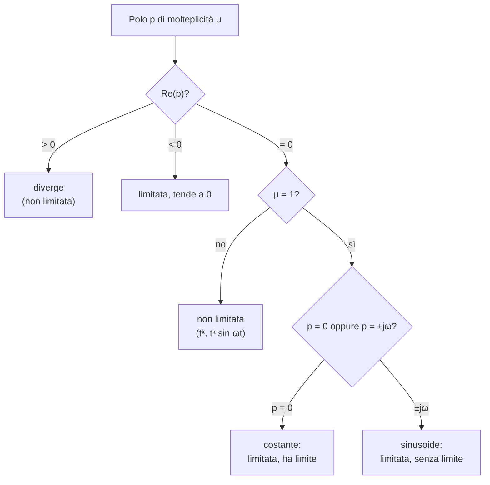

---

## corso: Teoria dei Sistemi lezione: 3 data: 2026-09-29 argomenti: [trasformata degli impulsi di ordine k, moltiplicazione per t, struttura delle trasformate, traslazione nel tempo, esercizi sulla trasformata, poli e zeri, molteplicità, funzioni limitate, funzioni con limite, legame poli-andamento nel tempo] fonti: [trascrizione parte 1, appunti manuali, dispensa del docente (italiano), dispensa del docente (inglese)] tags: [teoria-dei-sistemi, lezione]

---
# Lezione 3 — Trasformate notevoli, poli e andamento nel tempo

## Intro

Questa nota ricostruisce la terza lezione. Le fonti sono:

- la trascrizione della registrazione (parte 1);
- la nota personale «Trasformata di Laplace»;
- la dispensa italiana del docente («Appunti di Teoria dei sistemi», cap. 1, pp. 13–15);
- la dispensa in inglese del docente («Notes on (Mostly Linear) Continuous Time Stationary Dynamic Systems», §2.2.1, pp. 12–15).

La registrazione è frammentaria. Una parte consistente della lezione è stata dedicata a esercizi che gli studenti hanno svolto da soli in aula: in quei tratti la trascrizione riporta soprattutto conversazioni tra studenti, che sono state escluse.

La lezione si articola in tre parti:

1. completamento della tabella delle trasformate (impulsi di ogni ordine, moltiplicazione per $t$, struttura generale delle trasformate che si incontrano nel corso);
2. esercizi svolti in aula;
3. introduzione di **poli** e **zeri** e del legame tra i poli e l'andamento nel tempo della funzione che ha generato la trasformata. Il docente lo indica come il risultato più importante da sapere sulla trasformata di Laplace.

## 1. Trasformate degli impulsi di ordine qualsiasi

### 1.1 Impulsi di ordine non negativo

Nella [[Zen/Anno 2/Teoria dei Sistemi/generated/Lezione 3 - CLAUDE|Lezione 3 - CLAUDE]] si è visto che $\mathcal{L}{\delta(t)} = 1$. Per gli impulsi di ordine superiore basta la proprietà della derivata. L'impulso di ordine $1$ è la derivata dell'impulso di ordine zero, quindi

$$\mathcal{L}{\dot\delta(t)} = s,\mathcal{L}{\delta(t)} - \delta(0^-) = s\cdot 1 - 0 = s .$$

Il termine $\delta(0^-)$ è nullo perché l'impulso è concentrato in $0$ e in $0^-$ non c'è ancora nulla. Lo stesso vale per tutti gli impulsi di ordine superiore: nessuno di essi «esiste» in $0^-$. Quindi passare da un ordine al successivo significa soltanto **moltiplicare per $s$**. La trasformata dell'impulso di ordine $54$ è $s$ volte quella dell'impulso di ordine $53$, e così via:

$$\mathcal{L}{\delta_k(t)} = s^k, \qquad k = 0, 1, 2, \dots$$

### 1.2 Impulsi di ordine negativo

Per gli ordini negativi si usa la proprietà dell'integrale. L'impulso di ordine $-1$ è il gradino, integrale dell'impulso di ordine zero, quindi $\mathcal{L}{1(t)} = 1/s$. L'impulso di ordine $-2$, la rampa, è l'integrale del gradino: un altro fattore $1/s$, e così via. Ogni integrazione divide per $s$.

Conviene ricordare com'è fatto l'impulso di ordine $-k$. Mentre gli impulsi di ordine positivo sono «frecce che salgono e scendono» concentrate in un punto, quelli di ordine negativo sono funzioni che si possono disegnare: nulle fino all'origine e, da lì in avanti, potenze del tempo. Integrando ripetutamente si ottiene

$$\delta_{-k}(t) = \frac{t^{k-1}}{(k-1)!},1(t), \qquad \mathcal{L}{\delta_{-k}(t)} = \frac{1}{s^k}, \qquad k = 1, 2, \dots$$

Come osserva il docente, c'è sempre una **coincidenza tra l'ordine dell'impulso e la potenza di $s$**: l'impulso di ordine $-k$ ha trasformata $s^{-k}$. Per costruire queste funzioni non c'è nulla da capire: basta saper integrare una potenza del tempo.

> [!important] Trasformata degli impulsi di ogni ordine Per ogni intero $k$, positivo, nullo o negativo: $$\mathcal{L}{\delta_k(t)} = s^k, \qquad\qquad \mathcal{L}{\delta_k(t-T)} = s^k,e^{-sT}.$$ La seconda formula, per $T>0$, segue dalla proprietà di traslazione nel tempo.

### 1.3 Attenzione alla traslazione

Per applicare la regola della traslazione, l'impulso traslato deve essere scritto **interamente** in funzione di $t-T$. Il docente lo sottolinea: «ovunque compaia l'argomento temporale, ci deve essere scritto $t-T$». Per gli ordini negativi questo significa che la rampa traslata, ad esempio, è $(t-T)\cdot1(t-T)$, la cui trasformata è $e^{-sT}/s^2$. La funzione $t\cdot1(t-T)$ è un'altra cosa: in essa il tempo compare una volta come $t$ e una volta come $t-T$. Si torna su questo punto negli esercizi del §4.

## 2. Moltiplicazione per $t$ e struttura del denominatore

### 2.1 Un esempio

Si parte dalla trasformata della sinusoide smorzata, già nota:

$$\mathcal{L}{e^{at}\sin\omega t} = \frac{\omega}{(s-a)^2+\omega^2}.$$

Moltiplicando la funzione per $t$, la proprietà della moltiplicazione per $t$ richiede di derivare rispetto a $s$ e cambiare segno. Il docente raccomanda di non farsi intimidire dal fatto che $s$ sia una variabile complessa: «le derivate si fanno sempre allo stesso modo». La derivata di un quoziente si scrive come sempre: derivata del numeratore per il denominatore così com'è, meno la derivata del denominatore per il numeratore, tutto diviso il denominatore al quadrato. Qui il numeratore $\omega$ è costante, e la derivata del denominatore è $2(s-a)$:

$$\mathcal{L}{t,e^{at}\sin\omega t} = -\frac{d}{ds},\frac{\omega}{(s-a)^2+\omega^2} = -\frac{0 - 2(s-a),\omega}{\big[(s-a)^2+\omega^2\big]^2} = \frac{2\omega(s-a)}{\big[(s-a)^2+\omega^2\big]^2}.$$

Il segno meno della proprietà e quello del quoziente si elidono. È lo stesso risultato ottenuto alla fine della lezione 2. Più si applica la regola (moltiplicando per $t^2$, $t^3$, ...), più i numeratori diventano espressioni impossibili da ricordare. Il denominatore, invece, segue una regola semplicissima.

### 2.2 La regola generale

Sia $F(s) = N(s)/D(s)$ un rapporto di polinomi, come in tutti i casi visti finora. Allora

$$\mathcal{L}{t,f(t)} = -\frac{d}{ds},\frac{N}{D} = -\frac{N'D - D'N}{D^2} = \frac{D'N - N'D}{D^2}.$$

Partendo da un denominatore $D$ ci si ritrova un denominatore $D^2$. Il numeratore è completamente diverso, anche se è «parente» di quello di partenza.

Il docente generalizza il caso in cui il denominatore sia già elevato a una potenza, ad esempio un polinomio di secondo grado al quadrato. Sia $F(s) = N/D^\alpha$:

$$-\frac{d}{ds},\frac{N}{D^\alpha} = -\frac{N'D^\alpha - \alpha D^{\alpha-1}D'N}{D^{2\alpha}} .$$

Al numeratore si può raccogliere $D^{\alpha-1}$ e semplificarlo con il denominatore, dove l'esponente diventa $2\alpha - (\alpha - 1) = \alpha+1$:

$$-\frac{D^{\alpha-1}\big(N'D - \alpha D'N\big)}{D^{2\alpha}} = \frac{\alpha D'N - N'D}{D^{\alpha+1}} .$$

> [!important] Moltiplicazione per $t$ e denominatore Ogni volta che una funzione viene moltiplicata per $t$, la potenza del denominatore della sua trasformata **aumenta di uno**: da $D^\alpha$ si passa a $D^{\alpha+1}$. Il numeratore cambia in modo poco prevedibile; il denominatore, invece, si riconosce subito.

Questa regola è il primo mattone del discorso che chiude la lezione (§6). La potenza del tempo che moltiplica una funzione si legge direttamente nella potenza del denominatore della sua trasformata.

> [!warning] Nota personale «Trasformata di Laplace» La formula generale in fondo alla nota, $\mathcal{L}\big{\frac{t^k}{k!}e^{at}\sin/\cos,\omega t\big} = \frac{\cdots}{[(s-a)^2+\omega^2]^{k+1}}$, ha il numeratore vuoto. Questo è coerente con quanto detto a lezione: il denominatore ha una forma generale semplice, il numeratore no. Per $k=0$ e $k=1$ i numeratori sono nella tabella della lezione 2; per $k$ maggiori si ricavano applicando ripetutamente $-\frac{d}{ds}$.

### 2.3 Perché questa regola è importante

Il docente chiarisce lo scopo di tutto questo lavoro. Data una trasformata di Laplace di cui non si conosce l'origine, si vuole avere un'idea di come sia fatta la funzione che l'ha generata. Non serve necessariamente saperla trovare esplicitamente, ma si vuole sapere se:

- parte da zero;
- contiene impulsi;
- diverge;
- oscilla;
- tende a zero.

Tutto questo si ottiene «senza fare niente», guardando soltanto alcune caratteristiche della trasformata: i suoi **poli**. Questo è, nelle parole del docente, «la cosa più importante che dovete imparare con la trasformata di Laplace».

## 3. Com'è fatta una trasformata di Laplace nel corso

Prima di definire i poli, il docente fa il punto su quali trasformate si incontrano davvero.

- Gli **impulsi di ordine $\ge 0$** hanno per trasformata un polinomio, $s^k$: solo numeratore, nessun denominatore.
- Gli **impulsi di ordine negativo** hanno trasformata $1/s^k$. È già un rapporto di polinomi, con un numeratore banale ($1$) e un denominatore $s^k$.
- **Tutte le altre funzioni della tabella** hanno trasformate che sono rapporti di polinomi: $1/(s-a)$ ha un denominatore di primo grado, $\omega/(s^2+\omega^2)$ uno di secondo grado, e così via.
- Il caso peggiore è una funzione **traslata nel tempo**: alla trasformata si aggiunge un fattore $e^{-sT}$.
- Se la funzione è una **somma** di funzioni di questo tipo, eventualmente moltiplicate per costanti, per linearità la trasformata è la somma delle singole trasformate.

> [!important] Forma generale delle trasformate considerate Le trasformate che si incontrano nel corso sono rapporti di polinomi a coefficienti reali, eventualmente moltiplicati per esponenziali dovuti a traslazioni nel tempo. In generale: $$F(s) = \frac{N_0(s) + N_1(s),e^{-sT_1} + \dots + N_q(s),e^{-sT_q}}{D(s)}.$$ Sotto c'è sempre un polinomio; sopra c'è una combinazione di polinomi, ciascuno moltiplicato per un esponenziale (dispensa inglese, §2.2.2).

Il fattore esponenziale ha un'interpretazione precisa. $e^{-3s}$ può nascere **solo** dall'applicazione della proprietà di traslazione nel tempo, non da altro. Se in una trasformata compare $e^{-5s}$, nella funzione che l'ha generata doveva esserci qualcosa che inizia (o è traslato) all'istante $t=5$. Come ritrovare quella funzione si vedrà con l'antitrasformata, ma l'interpretazione si può dare subito.

Il docente aggiunge un'osservazione che servirà più avanti. Capiterà di avere **matrici** i cui elementi sono trasformate di Laplace. La trasformata di una matrice di funzioni del tempo è la matrice delle trasformate degli elementi (dispensa inglese, proprietà P/2.2/9). Il fatto che gli elementi siano ordinati in una matrice non aggiunge alcun significato particolare: ciascun elemento si interpreta da solo, come qualunque altra trasformata.

> [!tip] Consiglio di studio Il docente suggerisce di costruirsi, man mano che si procede, la propria tabella di trasformate: funzione del tempo a sinistra, trasformata a destra. Sapere bene come sono fatte le trasformate degli elementi base è ciò che permetterà di tornare indietro con l'antitrasformata.

> [!warning] Le due raccomandazioni del docente Durante gli esercizi il docente ha richiamato due errori frequenti:
> 
> 1. **Il prodotto di funzioni non diventa il prodotto delle trasformate**: $\mathcal{L}{f,g} \neq F,G$.
> 2. Moltiplicare una funzione ordinaria per $1(t)$ è **irrilevante** per la trasformata, perché la trasformata non vede nulla prima di zero. Non è irrilevante, invece, moltiplicare per un gradino **traslato**.

## 4. Esercizi svolti in aula

Il docente propone periodicamente un esercizio da svolgere da soli durante la lezione. Lascia dieci minuti o un quarto d'ora per provarci senza guardare la soluzione, poi lo risolve alla lavagna. L'invito è a provarci davvero, invece di guardare sempre il docente che risolve.

> [!note] Ricollocazione I tre esercizi seguenti compaiono anche nella nota personale «Trasformata di Laplace». In una prima versione degli appunti erano stati riportati nella [[Lezione 02 - Funzioni generalizzate e trasformata di Laplace|lezione 2]] con provenienza incerta; la trascrizione mostra che sono stati svolti in questa lezione.

### 4.1 Somma di termini e interpretazione dell'esponenziale

> [!example] $\mathcal{L}{1(t-3) + \delta(t) + t\cdot1(t)}$ Per linearità si trasforma un termine alla volta:
> 
> - il gradino traslato dà $e^{-3s}\cdot\mathcal{L}{1} = e^{-3s}/s$. Il docente ricorda che la trasformata della costante $1$ e quella del gradino coincidono, perché l'integrale non vede nulla prima di $0$;
> - l'impulso dà $1$;
> - la rampa dà $1/s^2$.
> 
> Quindi $$\mathcal{L}{\dots} = \frac{e^{-3s}}{s} + 1 + \frac{1}{s^2} = \frac{s,e^{-3s} + s^2 + 1}{s^2} = 1 + \frac{s,e^{-3s}+1}{s^2}.$$ Al numeratore non c'è un vero polinomio, perché compare $e^{-3s}$. L'interpretazione però si sa dare: quell'esponenziale indica che nella funzione d'origine qualcosa è traslato in $t=3$. Il termine $1$ isolato nell'ultima scrittura corrisponde all'impulso.

### 4.2 Funzione interamente traslata

> [!example] $\mathcal{L}{e^{a(t-T)}\cos\omega(t-T)\cdot1(t-T)}$ Prima di applicare la traslazione bisogna verificare che **ovunque** compaia il tempo ci sia $t-T$. Qui è così: la funzione è $g(t-T),1(t-T)$ con $g(t) = e^{at}\cos\omega t$. Quindi $$\mathcal{L}{\dots} = e^{-sT},\frac{s-a}{(s-a)^2+\omega^2}.$$ Nel codice LaTeX della nota personale la parentesi graffa dell'esponente racchiude per errore tutta la funzione, che risulta così stampata come esponente; il risultato è comunque corretto.

### 4.3 La funzione a tratti della lezione 2

In aula è stata trasformata anche la funzione a tratti costruita nella lezione precedente (§3.3 della lezione 2):

$$f(t) = \cos t,\Big[1(t) - 1\big(t-\tfrac{\pi}{2}\big)\Big] + \frac{t-\pi}{4-\pi},\Big[1(t-\pi) - 1(t-4)\Big].$$

Il docente avverte che, scritta così, la funzione **non** si può trasformare direttamente. Solo il primo termine, $\cos t\cdot1(t)$, ha già la forma giusta. Negli altri il tempo compare in modo misto: $\cos t$ moltiplica un gradino traslato in $\pi/2$, $(t-\pi)$ moltiplica un gradino traslato in $4$. La tecnica è **aggiungere e togliere** la quantità che serve, in modo che ogni funzione dipenda dallo stesso argomento del proprio gradino.

> [!example] Svolgimento Si separano i quattro termini: $$f(t) = \underbrace{\cos t\cdot1(t)}_{(a)} - \underbrace{\cos t\cdot1\big(t-\tfrac{\pi}{2}\big)}_{(b)} + \frac{1}{4-\pi}\Big[\underbrace{(t-\pi)\cdot1(t-\pi)}_{(c)} - \underbrace{(t-\pi)\cdot1(t-4)}_{(d)}\Big].$$ La costante $\frac{1}{4-\pi}$ resta una costante e si porta fuori per linearità.
> 
> **(a)** Coseno con $\omega=1$: $\dfrac{s}{s^2+1}$.
> 
> **(b)** Bisogna far comparire $t-\frac{\pi}{2}$ nell'argomento del coseno: $\cos t = \cos\big((t-\tfrac{\pi}{2}) + \tfrac{\pi}{2}\big)$. Per la formula di addizione, $\cos(x+\frac{\pi}{2}) = \cos x\cos\frac{\pi}{2} - \sin x\sin\frac{\pi}{2} = -\sin x$, perché il coseno di $\pi/2$ è zero e il termine relativo sparisce. Quindi $(b) = -\sin\big(t-\frac{\pi}{2}\big),1\big(t-\frac{\pi}{2}\big)$. È un seno traslato, la cui trasformata è $-e^{-\pi s/2}\dfrac{1}{s^2+1}$. Nel risultato finale compare con il segno opposto, per via del segno meno davanti a (b).
> 
> **(c)** È già una rampa traslata in $\pi$: $\dfrac{e^{-\pi s}}{s^2}$.
> 
> **(d)** Bisogna far comparire $t-4$: si aggiunge e si toglie $4$, cioè $t-\pi = (t-4) + (4-\pi)$. Allora $(d) = (t-4),1(t-4) + (4-\pi),1(t-4)$: una rampa traslata in $4$ più un gradino traslato in $4$ di ampiezza $4-\pi$. La trasformata è $\dfrac{e^{-4s}}{s^2} + (4-\pi)\dfrac{e^{-4s}}{s}$. Come osserva il docente, (d) è «la stessa scena identica» di (c), solo con $4$ al posto di $\pi$, più il gradino che avanza.
> 
> Mettendo insieme, con i segni: $$F(s) = \frac{s}{s^2+1} + \frac{e^{-\pi s/2}}{s^2+1} + \frac{e^{-\pi s} - e^{-4s}}{(4-\pi),s^2} - \frac{e^{-4s}}{s}.$$
> 
> Il risultato ha la forma generale del §3: sotto ci sono sempre polinomi, sopra polinomi moltiplicati per esponenziali, uno per ciascun istante in cui la funzione «cambia tratto» ($\pi/2$, $\pi$, $4$).
> 
> **Verifica con la proprietà della derivata** (non svolta in aula). Poiché $f(0^-) = 0$, deve valere $\mathcal{L}{\dot f} = s,F(s)$. La derivata calcolata nella lezione 2 è $$\dot f(t) = -\sin t,\Big[1(t) - 1\big(t-\tfrac{\pi}{2}\big)\Big] + \delta(t) + \frac{1}{4-\pi}\Big[1(t-\pi) - 1(t-4)\Big] - \delta(t-4).$$ Trasformandola termine per termine, con $\sin t = \cos(t-\frac{\pi}{2})$ nel termine traslato, si ottiene $$\mathcal{L}{\dot f} = -\frac{1}{s^2+1} + \frac{s,e^{-\pi s/2}}{s^2+1} + 1 + \frac{e^{-\pi s} - e^{-4s}}{(4-\pi),s} - e^{-4s}.$$ Moltiplicando $F(s)$ per $s$ e usando $\frac{s^2}{s^2+1} = 1 - \frac{1}{s^2+1}$ si ottiene esattamente la stessa espressione: «se due cose sono uguali, sono uguali».

> [!warning] Errori nel tentativo della nota personale (segnato «RIFARE»)
> 
> - Il fattore $\frac{t-\pi}{4-\pi}$ viene portato fuori dalla trasformata. Per linearità si possono portare fuori solo le **costanti** (qui $\frac{1}{4-\pi}$), non quantità che dipendono da $t$.
> - La trasformata del coseno è scritta $\frac{s}{s^2+\omega^2}$ anziché $\frac{s}{s^2+1}$ (qui $\omega=1$).
> - Il termine $\cos t\cdot1(t-\frac{\pi}{2})$ è rimasto incompleto: va prima riscritto come $-\sin(t-\frac{\pi}{2}),1(t-\frac{\pi}{2})$.
> - Le rampe traslate danno $\frac{1}{s^2}$, non $\frac{1}{s}$.

## 5. Poli e zeri

### 5.1 Definizioni

Lasciando da parte gli esponenziali dovuti alle traslazioni, che il docente chiama «questo fastidio», tutte le trasformate considerate appartengono alla famiglia delle **funzioni razionali**, cioè dei rapporti di polinomi. Per gli impulsi di ordine $\ge0$ c'è solo il numeratore; negli altri casi ci sono sia numeratore sia denominatore.

> [!important] Poli e zeri Sia $F(s) = \dfrac{N(s)}{D(s)}$ una funzione razionale.
> 
> - Le radici del **denominatore** $D(s)$ si chiamano **poli** di $F(s)$.
> - Le radici del **numeratore** $N(s)$ si chiamano **zeri** di $F(s)$.

Il significato è intuitivo. Gli zeri sono i valori di $s$ in cui la funzione si annulla. I poli sono i valori in cui il denominatore si annulla e la funzione, complessa o no, «va all'infinito»: in quei punti non ha nemmeno un valore. La definizione presuppone che numeratore e denominatore non abbiano radici in comune; se ne avessero, andrebbero prima semplificate (lo si approfondirà nella lezione 4).

> [!example] Poli e zeri di $\dfrac{s}{s^2+\omega^2}$ Per $s=0$ il numeratore si annulla: $s=0$ è uno **zero**. Il denominatore si annulla per $s^2 = -\omega^2$, cioè $s = \pm j\omega$: sono due **poli** puramente immaginari, complessi coniugati.

### 5.2 Riconoscere i poli a colpo d'occhio

Il docente insiste: le radici di un polinomio di secondo grado vanno sapute calcolare (lezione 2). Per le forme della tabella, però, non serve nemmeno la formula: i poli si devono **vedere**.

- $s^2 + \omega^2$ ha radici puramente immaginarie $\pm j\omega$.
- $(s-a)^2 + \omega^2$ ha radici con parte reale $a$ e parte immaginaria $\pm\omega$, cioè $a \pm j\omega$. Infatti si annulla quando $(s-a)^2 = -\omega^2$, ossia $s - a = \pm j\omega$.
- $\big[(s-a)^2+\omega^2\big]^2$ ha **gli stessi poli** $a\pm j\omega$, ma ciascuno con **molteplicità 2**.

### 5.3 La molteplicità

Anche la molteplicità di una radice è una nozione che «dovete sapere bene». Una radice ha molteplicità $\mu$ se il polinomio contiene il fattore $(s-p)^\mu$ e non $(s-p)^{\mu+1}$: è come se la stessa radice comparisse $\mu$ volte. Il docente propone un esempio per mettere in guardia da un errore frequente.

> [!example] $s^3 - 1$ e $(s-1)^3$ non hanno le stesse radici
> 
> - Il polinomio $s^3 - 1$ **non** ha la radice $1$ con molteplicità $3$. Le soluzioni di $s^3 = 1$ nel campo complesso sono le tre radici cubiche dell'unità: $1$ e $-\frac{1}{2} \pm j\frac{\sqrt3}{2}$. Sono **tre punti distinti** del piano di Gauss, sulla circonferenza di raggio $1$, a $120°$ l'uno dall'altro, ciascuno di molteplicità $1$.
> - Il polinomio $(s-1)^3$ ha invece **tre radici coincidenti** in $s=1$: un solo punto, di molteplicità $3$.
> 
> Nella rappresentazione grafica abituale, in cui i poli si segnano con una croce sul piano di Gauss, nel primo caso si disegnano tre croci in tre punti diversi. Nel secondo caso si disegnano tre croci sovrapposte nello stesso punto.

Il docente suggerisce di associare la molteplicità proprio a questo: quante volte si dovrebbe disegnare la croce nello stesso punto del piano di Gauss.

## 6. Dai poli all'andamento nel tempo

### 6.1 Come i parametri della funzione finiscono nei poli

Osservando la tabella delle trasformate, ci si accorge che i parametri che definiscono l'andamento nel tempo della funzione diventano i **coefficienti** del denominatore della trasformata, e in particolare i **valori dei poli** e la loro **molteplicità** (dispensa inglese, p. 14). Le funzioni chiave sono due.

> [!important] Il dizionario funzione ↔ poli $$\frac{t^k}{k!},e^{at} ;\longleftrightarrow; \frac{1}{(s-a)^{k+1}} \qquad\text{polo reale } s = a \text{ con molteplicità } k+1$$ $$\frac{t^k}{k!},e^{at}\left{\begin{matrix}\sin\omega t\ \cos\omega t\end{matrix}\right. ;\longleftrightarrow; \frac{\cdots}{\big[(s-a)^2+\omega^2\big]^{k+1}} \qquad\text{poli complessi } s = a\pm j\omega \text{ con molteplicità } k+1$$
> 
> - Il **coefficiente dell'esponenziale** $a$ diventa la **parte reale** del polo.
> - La **pulsazione** $\omega$ dell'oscillazione diventa la **parte immaginaria** del polo.
> - La **potenza del tempo** $k$ che moltiplica la funzione determina la **molteplicità** del polo, che vale $k+1$.

Il caso del polo reale è quello dell'esponenziale: il coefficiente $a$, reale, è esattamente il polo. È «parente» della parte reale dei poli complessi, che è anch'essa il coefficiente di un esponenziale. Il legame con la molteplicità discende dal §2: ogni moltiplicazione per $t$ aumenta di uno la potenza del denominatore.

Ad esempio, se si vede $\frac{1}{(s-a)^4}$, c'è un polo in $s=a$ di molteplicità $4$; quindi $k = 3$, e la funzione è un esponenziale $e^{at}$ moltiplicato per $t^3$ (diviso $3!$).

Il dizionario è coerente con quanto già visto:

- con $a=0$, la prima riga dà $\frac{t^k}{k!}1(t) \leftrightarrow \frac{1}{s^{k+1}}$, cioè l'impulso di ordine $-(k+1)$ del §1.2, con un polo nell'origine di molteplicità $k+1$;
- con $k=0$ e $a=0$ si ritrova il gradino, $\frac{1}{s}$: polo semplice nell'origine;
- gli impulsi di ordine $\ge0$ hanno trasformata polinomiale e quindi **nessun polo**.

> [!warning] Convenzioni diverse sugli indici Le fonti del corso indicizzano la stessa famiglia in modi diversi:
> 
> - a lezione si scrive $\frac{t^k}{k!}e^{at} \leftrightarrow \frac{1}{(s-a)^{k+1}}$, con molteplicità $k+1$;
> - la dispensa italiana usa la stessa convenzione con la lettera $n$ (p. 18);
> - la tabella 2.1 della dispensa inglese scrive $\frac{t^{k-1}}{(k-1)!}e^{\sigma t} \leftrightarrow \frac{1}{(s-\sigma)^k}$, con molteplicità $k$.
> 
> Nella proprietà P/2.2/10 della dispensa inglese, la condizione «limitata se e solo se $k=0$, cioè polo di molteplicità 1» è scritta nella convenzione della lezione, non in quella della tabella che la precede. Il significato è comunque univoco: **molteplicità 1**.

### 6.2 Poli reali

Si studia la funzione $\frac{t^k}{k!}e^{at}$, che corrisponde a un polo reale $s=a$ di molteplicità $k+1$. Si distinguono tre casi a seconda del segno di $a$.

**$a > 0$.** L'esponenziale cresce. Moltiplicarlo per una potenza del tempo lo fa crescere ancora più velocemente. La funzione **diverge**, qualunque sia $k$.

**$a < 0$.** L'esponenziale decresce. Il prodotto $t^k e^{at}$ può crescere all'inizio, perché la potenza del tempo parte da zero e sale, ma **prima o poi decresce** fino a zero. L'esponenziale, che lo si consideri crescente o decrescente, varia più velocemente di qualsiasi potenza del tempo, qualunque coefficiente ci sia davanti: «un milione» o «$10^{-40}$». La funzione è **limitata e tende a zero**, qualunque sia $k$.

**$a = 0$.** L'esponenziale vale $1$ e resta solo $\frac{t^k}{k!}$:

- se $k=0$ si ottiene la costante $1$ (con la convenzione $t^0 = 1$ anche per $t=0$), che è **limitata**;
- se $k \ge 1$ si ottengono $t$, $t^2/2$, $t^3/6$, ..., che **divergono** (polinomialmente).

Il grafico mostra il caso $a=-1$ per $k = 0, 1, 2, 3$. All'aumentare di $k$ il massimo si sposta in avanti, ma tutte le curve finiscono per annullarsi.

```chart
type: line
labels: [0, 0.5, 1, 1.5, 2, 2.5, 3, 3.5, 4, 4.5, 5, 5.5, 6, 6.5, 7, 7.5, 8, 8.5, 9, 9.5, 10]
series:
  - title: "e^(-t), k = 0"
    data: [1.0, 0.607, 0.368, 0.223, 0.135, 0.082, 0.05, 0.03, 0.018, 0.011, 0.007, 0.004, 0.002, 0.002, 0.001, 0.001, 0, 0, 0, 0, 0]
  - title: "t·e^(-t), k = 1"
    data: [0, 0.303, 0.368, 0.335, 0.271, 0.205, 0.149, 0.106, 0.073, 0.05, 0.034, 0.022, 0.015, 0.01, 0.006, 0.004, 0.003, 0.002, 0.001, 0.001, 0]
  - title: "t²/2·e^(-t), k = 2"
    data: [0, 0.076, 0.184, 0.251, 0.271, 0.257, 0.224, 0.185, 0.147, 0.112, 0.084, 0.062, 0.045, 0.032, 0.022, 0.016, 0.011, 0.007, 0.005, 0.003, 0.002]
  - title: "t³/6·e^(-t), k = 3"
    data: [0, 0.013, 0.061, 0.126, 0.18, 0.214, 0.224, 0.216, 0.195, 0.169, 0.14, 0.113, 0.089, 0.069, 0.052, 0.039, 0.029, 0.021, 0.015, 0.011, 0.008]
tension: 0.3
width: 80%
labelColors: false
fill: false
beginAtZero: true
```

> [!tip] Dimostrazione: l'esponenziale «vince» su ogni potenza (non svolta a lezione) Per $c > 0$ e $k$ intero positivo, $\displaystyle\lim_{t\to\infty} t^k e^{-ct} = \lim_{t\to\infty}\frac{t^k}{e^{ct}} = 0$. Applicando $k$ volte la regola di de l'Hôpital, il numeratore diventa la costante $k!$, mentre il denominatore diventa $c^k e^{ct}$, che tende all'infinito. Il coefficiente davanti non cambia la conclusione, perché moltiplica un limite nullo.

### 6.3 Funzione limitata e funzione con limite

Prima di proseguire, il docente richiama due nozioni da non confondere.

> [!important] Limitatezza e limite
> 
> - Una funzione è **limitata** se esiste un «tubo», cioè una fascia orizzontale di ampiezza finita (grande o piccola, non importa), che la contiene **tutta**, non solo da un certo punto in poi. In simboli: esiste $M$ tale che $|f(t)| \le M$ per ogni $t \ge 0$.
> - Una funzione **ha limite** (finito) per $t\to\infty$ se, prima o poi, si avvicina indefinitamente a un valore costante: $\lim_{t\to\infty} f(t) = \ell$.

Le due nozioni sono legate in un solo verso. Una funzione che ha limite, se non contiene impulsi, è limitata: da un certo punto in poi sta vicino al limite, e nel tratto precedente (finito) resta comunque in un tubo. Una funzione limitata, invece, **non** ha necessariamente limite: una sinusoide sta nel tubo $[-1, 1]$ ma oscilla per sempre senza avvicinarsi a nessun valore.

La precisazione sugli impulsi non è un dettaglio. Un impulso non sta in nessun tubo. Per questo la dispensa in inglese (p. 12) separa una funzione nella sua parte priva di impulsi di ordine $\ge0$, $\tilde f(t)$, e negli impulsi stessi, ed enuncia i risultati di limitatezza per $\tilde f(t)$.

Nei termini appena definiti, le funzioni del §6.2 sono:

- **non limitate** (divergenti) per $a>0$, qualunque sia $k$;
- **limitate e convergenti a zero** per $a<0$, qualunque sia $k$;
- per $a=0$: **limitate solo se $k=0$**, cioè se il polo nell'origine è **semplice** (molteplicità $1$); non limitate se la molteplicità è maggiore di $1$.

Nel caso del polo semplice nell'origine la funzione è la costante, che è limitata **e** ha limite. Le due condizioni coincidono, ma solo perché è un caso speciale: in generale non è così, come mostra il caso dei poli complessi.

### 6.4 Poli complessi coniugati

Si studia ora $\frac{t^k}{k!}e^{at}\sin\omega t$ (per il coseno il discorso è identico), che corrisponde ai poli $a\pm j\omega$ di molteplicità $k+1$. Il docente suggerisce un trucco per disegnarla: vederla come il prodotto di due fattori.

- Il primo fattore, $\frac{t^k}{k!}e^{at}$, è una delle funzioni del §6.2. Lo si disegna insieme al suo opposto: insieme formano un «tubo», detto **inviluppo**.
- Il secondo fattore, $\sin\omega t$, è una sinusoide che oscilla tra $-1$ e $1$. Nel prodotto la si fa «ballare» dentro l'inviluppo.

Il comportamento complessivo è quindi deciso dall'inviluppo, cioè dalla parte reale $a$ del polo e dalla molteplicità. La pulsazione $\omega$ stabilisce soltanto quanto rapidamente si oscilla dentro il tubo.

**$a > 0$.** L'inviluppo si allarga sempre di più, e l'oscillazione al suo interno cresce senza controllo. Per $k>0$ il tubo cresce ancora più rapidamente. La funzione **diverge**, qualunque siano $k$ e $\omega$.

**$a < 0$.** L'inviluppo è un esponenziale decrescente, eventualmente moltiplicato per una potenza del tempo: all'inizio può crescere un po', ma prima o poi si stringe a zero. La funzione «farà schifo», nelle parole del docente, ma è **limitata e converge a zero**, qualunque siano $k$ e $\omega$.

```chart
type: line
labels: [0, 0.2, 0.4, 0.6, 0.8, 1, 1.2, 1.4, 1.6, 1.8, 2, 2.2, 2.4, 2.6, 2.8, 3, 3.2, 3.4, 3.6, 3.8, 4, 4.2, 4.4, 4.6, 4.8, 5, 5.2, 5.4, 5.6, 5.8, 6, 6.2, 6.4, 6.6, 6.8, 7, 7.2, 7.4, 7.6, 7.8, 8, 8.2, 8.4, 8.6, 8.8, 9, 9.2, 9.4, 9.6, 9.8, 10]
series:
  - title: "e^(-0,3t)·sin(3t)"
    data: [0, 0.532, 0.827, 0.813, 0.531, 0.105, -0.309, -0.573, -0.616, -0.45, -0.153, 0.161, 0.386, 0.458, 0.369, 0.168, -0.067, -0.252, -0.333, -0.294, -0.162, 0.01, 0.158, 0.237, 0.229, 0.145, 0.023, -0.093, -0.165, -0.174, -0.124, -0.038, 0.05, 0.112, 0.13, 0.102, 0.044, -0.023, -0.074, -0.095, -0.082, -0.043, 0.005, 0.047, 0.068, 0.064, 0.04, 0.004, -0.028, -0.048, -0.049]
  - title: "inviluppo +e^(-0,3t)"
    data: [1.0, 0.942, 0.887, 0.835, 0.787, 0.741, 0.698, 0.657, 0.619, 0.583, 0.549, 0.517, 0.487, 0.458, 0.432, 0.407, 0.383, 0.361, 0.34, 0.32, 0.301, 0.284, 0.267, 0.252, 0.237, 0.223, 0.21, 0.198, 0.186, 0.176, 0.165, 0.156, 0.147, 0.138, 0.13, 0.122, 0.115, 0.109, 0.102, 0.096, 0.091, 0.085, 0.08, 0.076, 0.071, 0.067, 0.063, 0.06, 0.056, 0.053, 0.05]
  - title: "inviluppo −e^(-0,3t)"
    data: [-1.0, -0.942, -0.887, -0.835, -0.787, -0.741, -0.698, -0.657, -0.619, -0.583, -0.549, -0.517, -0.487, -0.458, -0.432, -0.407, -0.383, -0.361, -0.34, -0.32, -0.301, -0.284, -0.267, -0.252, -0.237, -0.223, -0.21, -0.198, -0.186, -0.176, -0.165, -0.156, -0.147, -0.138, -0.13, -0.122, -0.115, -0.109, -0.102, -0.096, -0.091, -0.085, -0.08, -0.076, -0.071, -0.067, -0.063, -0.06, -0.056, -0.053, -0.05]
tension: 0.3
width: 80%
labelColors: false
fill: false
beginAtZero: false
```

**$a = 0$, $k = 0$.** Non c'è esponenziale né potenza del tempo: resta la sinusoide pura, $\sin\omega t$, corrispondente a una coppia di poli **semplici** sull'asse immaginario, $\pm j\omega$. La funzione è **limitata ma non ha limite**: è il caso in cui le due nozioni del §6.3 si separano.

**$a = 0$, $k > 0$.** L'inviluppo è $\pm\frac{t^k}{k!}$, che cresce indefinitamente. La sinusoide oscilla in un tubo sempre più largo e la funzione **non è limitata**. Corrisponde a poli puramente immaginari di molteplicità maggiore di $1$.

```chart
type: line
labels: [0, 0.2, 0.4, 0.6, 0.8, 1, 1.2, 1.4, 1.6, 1.8, 2, 2.2, 2.4, 2.6, 2.8, 3, 3.2, 3.4, 3.6, 3.8, 4, 4.2, 4.4, 4.6, 4.8, 5, 5.2, 5.4, 5.6, 5.8, 6, 6.2, 6.4, 6.6, 6.8, 7, 7.2, 7.4, 7.6, 7.8, 8, 8.2, 8.4, 8.6, 8.8, 9, 9.2, 9.4, 9.6, 9.8, 10]
series:
  - title: "sin(3t): poli ±3j semplici"
    data: [0, 0.565, 0.932, 0.974, 0.675, 0.141, -0.443, -0.872, -0.996, -0.773, -0.279, 0.312, 0.794, 0.999, 0.855, 0.412, -0.174, -0.7, -0.981, -0.919, -0.537, 0.034, 0.592, 0.944, 0.966, 0.65, 0.108, -0.472, -0.888, -0.993, -0.751, -0.247, 0.343, 0.814, 1.0, 0.837, 0.381, -0.207, -0.723, -0.987, -0.906, -0.508, 0.067, 0.619, 0.954, 0.956, 0.624, 0.074, -0.502, -0.903, -0.988]
  - title: "t·sin(3t): poli ±3j doppi"
    data: [0, 0.113, 0.373, 0.584, 0.54, 0.141, -0.531, -1.22, -1.594, -1.391, -0.559, 0.685, 1.905, 2.596, 2.393, 1.236, -0.558, -2.38, -3.531, -3.493, -2.146, 0.141, 2.605, 4.341, 4.635, 3.251, 0.56, -2.551, -4.97, -5.757, -4.506, -1.531, 2.197, 5.37, 6.799, 5.857, 2.745, -1.534, -5.499, -7.698, -7.245, -4.165, 0.565, 5.322, 8.398, 8.607, 5.744, 0.698, -4.817, -8.845, -9.88]
tension: 0.3
width: 80%
labelColors: false
fill: false
beginAtZero: false
```

### 6.5 La regola: comanda la parte reale

Il riassunto del docente è una frase sola. Data una trasformata di Laplace della classe considerata, con un polo reale, immaginario o complesso, di qualunque molteplicità, ciò che decide la limitatezza e l'esistenza del limite della funzione che l'ha generata è **soltanto la parte reale del polo**. La parte immaginaria non conta nulla dal punto di vista della limitatezza.

> [!important] Poli e andamento nel tempo (dispensa inglese, P/2.2/10) Per le funzioni della tabella, con polo $p$ di molteplicità $\mu$:
> 
> - se $\mathrm{Re}(p) > 0$ la funzione **diverge**, indipendentemente dalla pulsazione e dalla molteplicità;
> - se $\mathrm{Re}(p) < 0$ la funzione è **limitata e tende a zero**, indipendentemente dalla pulsazione e dalla molteplicità;
> - se $\mathrm{Re}(p) = 0$ la funzione è **limitata se e solo se il polo è semplice** ($\mu = 1$). Se $\mu > 1$ non è limitata.
> 
> Nel caso $\mathrm{Re}(p)=0$, $\mu=1$ si distinguono due sottocasi: il polo reale $p = 0$ dà la costante, che ha limite; la coppia $\pm j\omega$ dà una sinusoide, che è limitata ma non ha limite.



|Posizione del polo nel piano di Gauss|Funzione nel tempo|Comportamento|
|:--|:--|:--|
|semiasse reale positivo, $p=a>0$|$\frac{t^k}{k!}e^{at}$|diverge|
|semiasse reale negativo, $p=a<0$|$\frac{t^k}{k!}e^{at}$|limitata, $\to 0$|
|origine, semplice|$1(t)$|limitata, ha limite|
|origine, multiplo|$\frac{t^k}{k!}$, $k\ge1$|diverge|
|semipiano destro, $a\pm j\omega$ con $a>0$|$\frac{t^k}{k!}e^{at}\sin/\cos,\omega t$|diverge oscillando|
|semipiano sinistro, $a\pm j\omega$ con $a<0$|$\frac{t^k}{k!}e^{at}\sin/\cos,\omega t$|oscilla smorzandosi, $\to 0$|
|asse immaginario, $\pm j\omega$ semplici|$\sin/\cos,\omega t$|limitata, senza limite|
|asse immaginario, $\pm j\omega$ multipli|$\frac{t^k}{k!}\sin/\cos,\omega t$, $k\ge1$|diverge oscillando|

> [!tip] Schema consigliato La tabella si memorizza molto meglio con un disegno: il piano di Gauss diviso in semipiano sinistro (convergenza a zero), asse immaginario (caso delicato, decide la molteplicità) e semipiano destro (divergenza). Accanto a ciascuna zona si può schizzare l'andamento tipico. In questo punto può essere utile uno schema con Excalidraw.

### 6.6 Il passo successivo

Il docente chiude anticipando dove porta questo discorso. Una trasformata di Laplace qualunque, tra quelle considerate, è composta da una **somma** di tante trasformate di questo tipo, come negli esercizi del §4. Una volta capito il legame tra un singolo polo e il suo contributo nel tempo, si sarà in grado di dire com'è fatta l'antitrasformata dal punto di vista della limitatezza e della convergenza **senza calcolarla**. È l'argomento della [[Lezione 04 - Antitrasformata di Laplace e fratti semplici|lezione 4]].

> [!tip] Collegamento con il seguito del corso Il docente anticipa che questo risultato è «quello che mi permette di capire tutta la parte sulla stabilità dei sistemi». La dispensa in inglese lo riprende nei capitoli sulla stabilità ingresso-uscita (§3.1, _BIBO stability_) e sulla stabilità interna (§4.2). Le proprietà di un sistema verranno lette dalla posizione nel piano di Gauss dei poli di opportune trasformate.

## Domande di autoverifica

Domande nello stile dei «perché» d'esame, con una traccia di risposta.

1. _Perché la trasformata di un impulso di ordine $k\ge1$ è semplicemente $s$ volte quella dell'impulso di ordine $k-1$?_ Per la regola della derivata, $\mathcal{L}{\dot f} = sF - f(0^-)$, e nessun impulso «esiste» in $0^-$, quindi il termine $f(0^-)$ è nullo.
2. _Perché $t\cdot1(t-T)$ non ha trasformata $e^{-sT}/s^2$?_ Perché il tempo non compare ovunque come $t-T$. Bisogna scrivere $t = (t-T) + T$, ottenendo una rampa traslata più un gradino traslato di ampiezza $T$: $e^{-sT}\big(\frac{1}{s^2} + \frac{T}{s}\big)$.
3. _Perché moltiplicare per $t$ aumenta la potenza del denominatore?_ La proprietà richiede di derivare rispetto a $s$, e la derivata di $N/D^\alpha$ ha denominatore $D^{\alpha+1}$.
4. _$s^3-1$ e $(s-1)^3$ hanno gli stessi poli?_ No. Il primo ha tre radici distinte sulla circonferenza unitaria; il secondo una sola radice, $1$, con molteplicità $3$.
5. _Perché la parte immaginaria del polo non conta per la limitatezza?_ Determina solo la pulsazione della sinusoide, che è sempre compresa tra $-1$ e $1$. L'ampiezza del «tubo» in cui oscilla è data da $\frac{t^k}{k!}e^{at}$, che dipende dalla parte reale e dalla molteplicità.
6. _Una funzione limitata ha sempre limite?_ No: $\sin\omega t$ è limitata ma non ha limite. Il viceversa vale per funzioni prive di impulsi.
7. _Perché un polo semplice nell'origine dà una funzione limitata, mentre uno doppio no?_ Il polo semplice corrisponde al gradino (costante), quello doppio alla rampa $t\cdot1(t)$, che cresce indefinitamente.