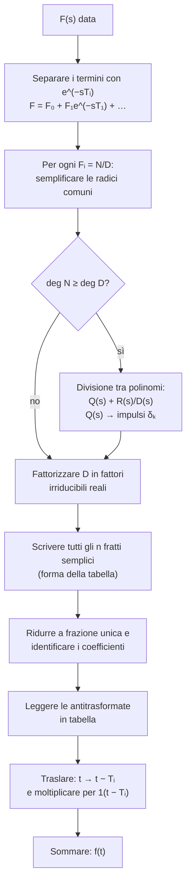

---

## corso: Teoria dei Sistemi lezione: 4 data: 2026-10-01 argomenti: [poli di una somma di trasformate, antitrasformata di Laplace, principio di identità dei polinomi, fratti semplici, traslazione nel tempo, divisione tra polinomi, impulsi nell'antitrasformata, fattorizzazione del denominatore, espansione in fratti semplici, interpretazione dell'antitrasformata] fonti: [trascrizione parte 1, appunti manuali, dispensa del docente (italiano), dispensa del docente (inglese)] tags: [teoria-dei-sistemi, lezione]
---
# Lezione 4 — Antitrasformata di Laplace e fratti semplici

Questa nota ricostruisce la quarta lezione. Le fonti sono:

- la trascrizione della registrazione (parte 1);
- la nota personale «Antitrasformata di Laplace»;
- la dispensa italiana del docente («Appunti di Teoria dei sistemi», cap. 1, pp. 15–21: antitrasformazione, metodo di espansione in fratti semplici, «caso 1» e «caso 2»);
- la dispensa in inglese («Notes on (Mostly Linear) Continuous Time Stationary Dynamic Systems», §2.2.2–2.2.3, pp. 15–22).

Dopo un riepilogo del legame tra poli e andamento nel tempo, la lezione affronta il problema inverso: data una trasformata, risalire alla funzione del tempo che l'ha generata. Il metodo è sempre lo stesso: **scomporre** la trasformata in pezzi di cui si conosce l'antitrasformata, leggendoli dalla tabella. Il messaggio di fondo del docente, però, è un altro: più ancora che calcolare l'antitrasformata, conta saperla **interpretare**.

## 1. Riepilogo: poli e andamento nel tempo

L'ultima riga della tabella delle trasformate è, per il docente, «multiuso»:

$$$$
$$\frac{t^k}{k!} e^{at} \left\{ \begin{matrix} \sin(\omega t) \\ \cos(\omega t) \end{matrix} \right. \quad \longleftrightarrow \quad \frac{\cdots}{\big[(s-a)^2+\omega^2\big]^{k+1}}$$

Il denominatore è lo stesso sia per il seno sia per il coseno, e si ricava indifferentemente da una strada o dall'altra. La differenza sta nel numeratore. Il docente dichiara di non ricordarlo e, se gli serve, lo ricava applicando $-\frac{d}{ds}$ tante volte quante sono necessarie (vedi [[Lezione 03 - Trasformate notevoli, poli e andamento nel tempo#2. Moltiplicazione per $t$ e struttura del denominatore|lezione 3, §2]]).

Il punto da mettere bene a fuoco è la relazione tra queste funzioni e i poli della loro trasformata. Il coefficiente dell'esponenziale, la pulsazione della sinusoide e la potenza del tempo sono «mappati» nelle caratteristiche del denominatore. Ad esempio, un polo reale $s=3$ con molteplicità $4$, cioè $\frac{1}{(s-3)^4}$, rivela una funzione $\frac{t^3}{3!}e^{3t}$.

Da qui la regola vista alla fine della lezione 3: nella classe di funzioni considerata **comanda la parte reale del polo**.

- **Parte reale positiva**, per poli reali o complessi: la funzione non è limitata.
- **Parte reale negativa**, per qualunque molteplicità (1, 2 o 1000): la funzione è limitata e tende a zero. L'esponenziale decrescente prima o poi «si mangia» qualsiasi potenza del tempo.
- **Parte reale nulla**: la funzione è limitata solo se il polo è semplice. Con molteplicità maggiore compaiono $t$, $t^2$, ..., che divergono.

## 2. I poli di una somma di trasformate

### 2.1 Un esempio

Si consideri la somma di due esponenziali. Per linearità la trasformata della somma è la somma delle trasformate, e ciascuna si legge dalla tabella:

$$\mathcal{L}{e^{2t} + e^{-3t}} = \frac{1}{s-2} + \frac{1}{s+3} = \frac{(s+3) + (s-2)}{(s-2)(s+3)} = \frac{2s+1}{(s-2)(s+3)} .$$

Il docente fa tre osservazioni.

1. Partendo dalla somma di due frazioni si arriva a **una sola frazione**. Lo stesso accadrebbe partendo da mille frazioni.
2. Quello che succede al denominatore della somma è **figlio** di ciò che succede nei denominatori dei singoli pezzi. Il denominatore comune è il minimo comune multiplo dei denominatori, quindi **i poli dei singoli pezzi si trasferiscono pari pari nella somma**: qui il polo positivo $s=2$ e il polo negativo $s=-3$.
3. Si legga ora l'esempio al contrario. Qualcuno fornisce la trasformata $\frac{2s+1}{(s-2)(s+3)}$ senza dire da quale funzione provenga, e non si dispone ancora di un metodo per tornare indietro. Si vede comunque un polo con parte reale positiva. Viene allora il sospetto fondato che la funzione d'origine **non fosse limitata**: se la trasformata è composta da «mattoncini», uno di essi è la trasformata di qualcosa che diverge.

L'immagine dei mattoncini è quella del docente: mettendo insieme i mattoncini si ottiene una costruzione più grande, ma sempre fatta degli stessi mattoncini.

### 2.2 La proprietà generale

La dispensa in inglese formalizza l'osservazione (p. 15, con l'esempio $\mathcal{L}{3e^{-2t} + e^t\sin 2t + t}$, il cui denominatore è $s^2,[(s-1)^2+4],(s+2)$). L'insieme dei poli di una combinazione di funzioni è la riunione dei poli delle trasformate dei singoli addendi. Unendo questa osservazione alla regola del §1 si ottiene il risultato seguente.

> [!important] Poli e andamento nel tempo per una trasformata razionale qualsiasi (dispensa inglese, P/2.2/11) Sia $F(s) = N(s)/D(s)$ la trasformata di una funzione $f(t)$, e si consideri la parte di $f$ priva di impulsi.
> 
> - Se **tutti** i poli hanno parte reale negativa, la funzione è limitata e tende a zero.
> - Se **almeno un** polo ha parte reale positiva, oppure **almeno un** polo ha parte reale nulla con molteplicità maggiore di $1$, la funzione non è limitata.
> - Altrimenti, cioè nessun polo nel semipiano destro e quelli sull'asse immaginario tutti semplici (ed eventualmente altri con parte reale negativa), la funzione è limitata.

La dispensa (esempio E/2.2/7) precisa il terzo caso. Se sull'asse immaginario c'è soltanto il polo semplice $s=0$, la funzione tende a un valore costante. Se invece c'è una coppia $\pm j\omega$, la funzione contiene una sinusoide che non si smorza e non ha limite.

Il docente annuncia che, studiando come si torna indietro, si capirà perché questo risultato «non può che essere vero».

## 3. L'antitrasformata

### 3.1 Che cosa si cerca

L'**antitrasformata** di Laplace, indicata con $\mathcal{L}^{-1}$, è l'operazione inversa della trasformata: data $F(s)$, trovare la funzione $f(t)$ tale che $\mathcal{L}{f(t)} = F(s)$.

$$F(s) ;\longrightarrow; \mathcal{L}^{-1}{\cdot} ;\longrightarrow; f(t)$$

Cercando la definizione formale, si trova che l'antitrasformata è un **integrale nel campo complesso**. Il docente osserva però di non ricordare nessuno che abbia mai calcolato un'antitrasformata in quel modo. Le funzioni che si maneggiano sono più o meno sempre le stesse, e per esse non serve. Allo stesso modo, quasi nessuno calcola la trasformata con l'integrale della definizione, se non come esercizio: si usano sempre le proprietà. Le proprietà dell'antitrasformata sono quelle della trasformata lette da destra verso sinistra (dispensa inglese, p. 16). In particolare l'antitrasformata è **lineare**: l'antitrasformata di una somma è la somma delle antitrasformate.

> [!tip] Approfondimento: la formula di inversione #approfondimento Per completezza, la definizione formale a cui allude il docente è la formula di inversione (detta anche integrale di Bromwich): $$f(t) = \frac{1}{2\pi j}\int_{\sigma - j\infty}^{\sigma + j\infty} F(s),e^{st},ds ,$$ dove l'integrale è calcolato lungo una retta verticale $\mathrm{Re}(s) = \sigma$ contenuta nella regione di convergenza [@oppenheim1997, cap. 9]. Come detto a lezione, nel corso non verrà mai usata.

La dispensa in inglese aggiunge una precisazione (pp. 15–16). L'antitrasformata è unica solo «quasi»: due funzioni che differiscono in punti isolati, ad esempio $e^{-t}$ e la funzione uguale a $e^{-t}$ ovunque tranne in $t=1$ dove vale $3$, hanno la stessa trasformata. La loro differenza è una **funzione nulla**, cioè con integrale nullo su qualunque intervallo, e la trasformata non può vederla. Nel corso si considera questa quasi unicità come un'unicità a tutti gli effetti.

### 3.2 La strategia: spacchettare

L'idea è quella del metodo di integrazione delle funzioni razionali visto in analisi: prendere una frazione e **spacchettarla** in una somma di frazioni più semplici. Una volta fatto, l'antitrasformata è banale. Si applica la linearità al contrario, si va a vedere a quale funzione corrisponde ciascuna frazione e si somma.

Le frazioni in cui spacchettare **non si possono scegliere a caso**. Devono essere frazioni che, rimesse insieme con il minimo comune multiplo, restituiscono esattamente la frazione di partenza.

> [!example] Prima espansione: $\dfrac{3s+4}{(s-2)(s+3)}$ Si modifica leggermente l'esempio del §2: al numeratore, al posto di $2s+1$, c'è $3s+4$. Al denominatore di ciascuna frazione si deve mettere ciò che si vede nel denominatore di partenza: $s-2$ in una e $s+3$ nell'altra. Il numeratore di ciascuna, guardando la tabella, è una costante. Le costanti non si conoscono e valgono quello che devono valere affinché la somma sia uguale alla frazione data: $$\frac{3s+4}{(s-2)(s+3)} = \frac{A}{s-2} + \frac{B}{s+3} = \frac{A(s+3) + B(s-2)}{(s-2)(s+3)} = \frac{(A+B),s + 3A - 2B}{(s-2)(s+3)} .$$ I denominatori coincidono. Perché le due frazioni siano uguali devono coincidere anche i numeratori, coefficiente per coefficiente: $$\begin{cases} A + B = 3 \ 3A - 2B = 4 \end{cases} \quad\Longrightarrow\quad \begin{cases} A = 2 \ B = 1 \end{cases}$$ Quindi $$\frac{3s+4}{(s-2)(s+3)} = \frac{2}{s-2} + \frac{1}{s+3} \qquad\Longrightarrow\qquad f(t) = 2e^{2t} + e^{-3t}.$$ Verifica: $2(s+3) + (s-2) = 3s + 4$.

> [!important] Il principio di identità dei polinomi Il docente ripete la sua frase: «se due cose sono uguali, sono uguali **sempre**», non in un punto. L'uguaglianza tra i due numeratori **non è un'equazione in $s$** da risolvere trovando particolari valori di $s$. È un'identità che deve valere per ogni $s$, altrimenti i due polinomi non sono uguali. Due polinomi sono identici se e solo se hanno gli stessi coefficienti: si impone quindi l'uguaglianza **coefficiente per coefficiente**. Questa operazione si chiama **identificazione dei polinomi**.

Il procedimento, concettualmente, è tutto qui, quale che sia il numero dei pezzi. Il resto della lezione serve a stabilire **quando** lo si può applicare e **quali** frazioni bisogna mettere.

### 3.3 Che cos'è, per noi, un «fratto semplice»

Escluse le trasformate degli impulsi di ordine $\ge0$, che hanno solo il numeratore, tutte le voci della tabella sono **fratti**. Il docente adotta una definizione pratica.

> [!important] Fratto semplice (convenzione del corso) Un fratto è **semplice** se appartiene alla tabella delle trasformate note, cioè se se ne può leggere l'antitrasformata direttamente dalla tabella, senza fare nulla.

Questa definizione è compatibile con quasi tutte quelle usate dai matematici, ma non coincide con la più comune. Per i matematici un fratto semplice è di solito una costante, eventualmente complessa, divisa per un polinomio di primo grado elevato a una potenza: $\frac{c}{(s-p)^k}$ con $p$ anche complesso. Nel corso questa scrittura non serve. Se si sa che $\frac{\omega}{(s-a)^2+\omega^2}$ è la trasformata di $e^{at}\sin\omega t$, non c'è bisogno di scomporla in due frazioni con poli complessi: si scrive così com'è e se ne legge l'antitrasformata.

Ne segue anche una regola di **forma** per i numeratori. Ciascuna frazione dell'espansione deve avere la forma esatta della tabella, a meno di una costante moltiplicativa incognita. Per una sinusoide di pulsazione $2$ si scrive

$$B,\frac{2}{s^2+4}\quad(\to\ B\sin 2t) \qquad\text{e non}\qquad \frac{B}{s^2+4}.$$

Anche la seconda scrittura sarebbe corretta, ma la sua antitrasformata non si legge direttamente: con $\omega=2$ la tabella ha $2$ al numeratore, non $1$. Si vuole guardare le due colonne della tabella e riconoscere subito la corrispondenza.

La tabella non è un elenco arbitrario. Le sue voci sono **tutte e sole** quelle che servono per maneggiare qualsiasi trasformata che si incontrerà. Volendo, si potrebbe compilare un archivio con le trasformate di una «tonnellata» di funzioni, ma non sarebbe mai completo e non insegnerebbe come trattare la prima funzione che non vi compare.

> [!example] Completare il quadrato (dispensa italiana, p. 16) Per antitrasformare $\dfrac{1}{s^2+4s+13}$ si riconosce nel denominatore la forma $(s-a)^2+\omega^2$ completando il quadrato: $s^2+4s+13 = (s^2+4s+4) + 9 = (s+2)^2 + 9$. Quindi $a=-2$ e $\omega=3$. Per avere al numeratore la forma della tabella ($\omega=3$) si moltiplica e si divide per $3$: $$\frac{1}{s^2+4s+13} = \frac{1}{3}\cdot\frac{3}{(s+2)^2+9} \qquad\Longrightarrow\qquad \frac{1}{3},e^{-2t}\sin 3t\cdot1(t).$$ Nella dispensa l'esempio è la somma $\frac{1}{s+2} + \frac{1}{s^2+4s+13} + \frac{e^{-3s}}{s}$, che dà $e^{-2t} + \frac{1}{3}e^{-2t}\sin 3t + 1(t-3)$. La prima riga dell'esempio riporta per refuso $\frac{1}{s+1}$ al posto di $\frac{1}{s+2}$.

## 4. Il fattore esponenziale: antitrasformare con le traslazioni

Si considera ora una trasformata contenente un esponenziale. In casi come questo non serve alcuna procedura particolare: basta spezzarla.

> [!example] $F(s) = \dfrac{1 + 3e^{-2s}}{s+2}$ $$F(s) = \frac{1}{s+2} + 3,\frac{1}{s+2},e^{-2s}.$$
> 
> - Il primo termine si legge in tabella ($k=0$, $a=-2$): $e^{-2t}$.
> - Il secondo è una $G(s) = \frac{3}{s+2}$ moltiplicata per $e^{-2s}$. Si antitrasforma prima $G$ **senza traslazione**: per linearità, $3$ volte l'antitrasformata di $\frac{1}{s+2}$, cioè $3e^{-2t}$. Poi si trasla tutto di $2$: al posto di $t$ si mette $t-2$ e si moltiplica per $1(t-2)$, «altrimenti è sbagliato», come visto con la proprietà di traslazione.
> 
> In conclusione $$f(t) = e^{-2t} + 3,e^{-2(t-2)}\cdot1(t-2).$$ Il termine non traslato si può scrivere con o senza $1(t)$, perché la trasformata non vede ciò che accade prima di zero. Per il termine traslato, invece, il gradino $1(t-2)$ è indispensabile.

Durante l'esempio il docente ha scritto per un attimo $e^{-2t}$ al posto di $e^{-2s}$ nella trasformata, correggendosi subito («scusate, qui c'è una $s$»). È un errore da evitare: nel dominio di $s$ non può comparire $t$.

> [!example] Un esempio con due traslazioni (dispensa italiana, p. 17) $$F(s) = \frac{3 + 3e^{-2s}}{s^2+3s+2} = \frac{3}{(s+1)(s+2)} + \frac{3}{(s+1)(s+2)},e^{-2s}.$$ Con l'espansione $\frac{3}{(s+1)(s+2)} = \frac{3}{s+1} - \frac{3}{s+2}$ (sistema $A+B=0$, $2A+B=3$): $$f(t) = 3e^{-t} - 3e^{-2t} + 3e^{-(t-2)},1(t-2) - 3e^{-2(t-2)},1(t-2).$$

Il ragionamento vale in generale. Se una trasformata è la somma di un rapporto di polinomi e di altri rapporti di polinomi moltiplicati per $e^{-sT_1}$, $e^{-sT_2}$, ..., non c'è nulla da inventare. Ciascun rapporto si antitrasforma da solo, ignorando l'esponenziale, e poi si trasla della quantità corrispondente. Che l'esponenziale sia $e^{-2s}$ o $e^{-27s}$ non complica nulla: al posto di $t$ si mette $t-27$ e si moltiplica per $1(t-27)$. Se i termini sono dieci, se ne antitrasforma uno per volta e poi si somma.

> [!important] Riduzione del problema Se $$F(s) = F_0(s) + F_1(s),e^{-sT_1} + \dots + F_q(s),e^{-sT_q}, \qquad F_i(s) = \frac{N_i(s)}{D_i(s)},$$ e $f_i(t) = \mathcal{L}^{-1}{F_i(s)}$, allora $$f(t) = f_0(t) + f_1(t-T_1),1(t-T_1) + \dots + f_q(t-T_q),1(t-T_q).$$ L'unica cosa che bisogna davvero saper antitrasformare è un **rapporto di polinomi** qualsiasi, a coefficienti reali.

> [!warning] Refuso nella dispensa inglese Nella formula (2.18) della dispensa in inglese (p. 16) gli esponenziali compaiono come $e^{sT_i}$, senza il segno meno. Per la proprietà di traslazione, e coerentemente con la (2.19) che segue, devono essere $e^{-sT_i}$.

## 5. Numeratore di grado maggiore o uguale al denominatore: la divisione

### 5.1 Perché la divisione è il primo passo

Nella tabella, a parte gli impulsi, compaiono solo fratti con il numeratore di **grado inferiore** al denominatore. Sommandoli o moltiplicandoli per costanti, il numeratore resta di grado inferiore al denominatore comune. Se quindi una trasformata ha il numeratore di grado **maggiore o uguale** a quello del denominatore, è impossibile ottenerla combinando soltanto quei fratti. Deve esserci per forza dell'altro, cioè termini senza denominatore: **impulsi** di ordine $\ge0$.

La prima operazione è quindi la **divisione tra polinomi**: si divide il numeratore per il denominatore e si scrive

$$\frac{N(s)}{D(s)} = Q(s) + \frac{R(s)}{D(s)}, \qquad \deg R < \deg D .$$

Il quoziente $Q(s) = c_m s^m + \dots + c_1 s + c_0$ è un polinomio, la cui antitrasformata è una combinazione di impulsi: $c_m,\delta_m(t) + \dots + c_1,\delta_1(t) + c_0,\delta(t)$. Resta un fratto con il numeratore di grado inferiore al denominatore, detto **strettamente proprio**, a cui si applica il procedimento del §6.

### 5.2 Un esempio svolto per esteso

> [!example] $F(s) = \dfrac{s^2}{s+1}$ Il docente esegue la divisione con il suo metodo, «come si fa con i numeri».
> 
> - $s$ sta in $s^2$ esattamente $s$ volte: si scrive $s$ nel quoziente, si moltiplica $s\cdot(s+1) = s^2 + s$ e lo si sottrae dal dividendo, ottenendo $-s$.
> - $s$ sta in $-s$ esattamente $-1$ volte: si scrive $-1$ nel quoziente, si moltiplica $-1\cdot(s+1) = -s - 1$ e lo si sottrae, ottenendo il resto $1$.
> 
> Quindi quoziente $s-1$ e resto $1$. Ricordando che il dividendo è uguale al divisore per il quoziente più il resto: $$s^2 = (s+1)(s-1) + 1 ,$$ e dividendo tutto per $s+1$: $$\frac{s^2}{s+1} = s - 1 + \frac{1}{s+1}.$$ In altre parole, la frazione originale è uguale al quoziente più il resto diviso il divisore. Ora si ha la somma di tre trasformate, e ciascuna si legge in tabella:
> 
> - $s$ è l'impulso di ordine $1$ ($s^k$ con $k=1$);
> - $-1$ è l'impulso di ordine zero, moltiplicato per $-1$;
> - $\frac{1}{s+1}$ è l'esponenziale con $k=0$, $a=-1$.
> 
> $$f(t) = \delta_1(t) - \delta(t) + e^{-t}.$$

> [!example] Divisione con un polo doppio (dispensa italiana, Esempio PM 8, p. 21) $$\frac{s^3}{(s+2)^2} = s - 4 + \frac{12s+16}{(s+2)^2} = s - 4 + \frac{12}{s+2} - \frac{8}{(s+2)^2},$$ da cui $$\mathcal{L}^{-1}\left\{\frac{s^3}{(s+2)^2}\right} = \delta_1(t) - 4,\delta(t) + 12,e^{-2t},1(t) - 8,t,e^{-2t},1(t).$$ L'espansione del resto si ottiene con $\frac{12s+16}{(s+2)^2} = \frac{A}{s+2} + \frac{B}{(s+2)^2}$, cioè $A(s+2) + B = 12s + 16$: $A = 12$, $B = 16 - 24 = -8$.

### 5.3 Esercizio proposto in aula

> [!example] $F(s) = \dfrac{s^3 + s^2,e^{-3s} + 1}{s^2+1}$ Si spezza prima secondo gli esponenziali, poi si tratta ogni rapporto di polinomi: $$F(s) = \frac{s^3}{s^2+1} + \frac{s^2}{s^2+1},e^{-3s} + \frac{1}{s^2+1}.$$
> 
> - Il termine $\frac{1}{s^2+1}$ è l'unico già in tabella ($\omega=1$, $a=0$): $\sin t$.
> - $\frac{s^3}{s^2+1}$ va diviso: $s^3 = s,(s^2+1) - s$, quindi $\frac{s^3}{s^2+1} = s - \frac{s}{s^2+1}$. Si ottiene $\delta_1(t) - \cos t$.
> - Anche $\frac{s^2}{s^2+1}$ va diviso: $s^2 = (s^2+1) - 1$, quindi $\frac{s^2}{s^2+1} = 1 - \frac{1}{s^2+1}$, cioè $\delta(t) - \sin t$. Il termine però era moltiplicato per $e^{-3s}$, quindi va traslato di $3$: $\delta(t-3) - \sin(t-3),1(t-3)$.
> 
> In conclusione $$f(t) = \delta_1(t) - \cos t + \sin t + \delta(t-3) - \sin(t-3),1(t-3).$$

> [!warning] Nota personale «Antitrasformata di Laplace» La soluzione riportata nella nota è corretta, ma nella riga che definisce $F(s)$ il numeratore è scritto `s^3+^2e^{3s}+1`. Mancano la $s$ del secondo termine e il segno meno all'esponente: va letto $s^3 + s^2e^{-3s} + 1$, come nel passaggio successivo della nota. Per coerenza con il resto degli appunti conviene scrivere $1(t-3)$ anziché $u(t-3)$.

### 5.4 Verificare con il calcolatore

Durante l'esercizio il docente ha citato il software di riferimento del settore, invitando gli studenti a procurarselo e a usarlo per controllare i risultati: «fate `ilaplace` e vi dice il risultato». Il nome non si sente chiaramente nella registrazione, ma il comando citato è quello di **MATLAB** (Symbolic Math Toolbox), che offre `laplace`, `ilaplace` e, per le espansioni, `partfrac` (disponibile dalla versione R2015a). Le condizioni di licenza per gli studenti vanno verificate sui canali dell'ateneo.

```matlab
syms s t

% Esercizio proposto in aula (§5.3)
F = (s^3 + s^2*exp(-3*s) + 1)/(s^2 + 1);
f = ilaplace(F, s, t)

% Espansione in fratti semplici ed antitrasformata (§6.4)
G = 1/((s - 1)^2*(s^2 + 4));
partfrac(G, s)
g = ilaplace(G, s, t)

% Trasformata diretta, per controllo (§2.1)
laplace(exp(2*t) + exp(-3*t), t, s)
```

Nei risultati di MATLAB il gradino compare come `heaviside`, l'impulso come `dirac` e le sue derivate come `dirac` con un argomento aggiuntivo che ne indica l'ordine. Chi non dispone di MATLAB può ottenere gli stessi controlli con la libreria gratuita SymPy di Python:

```python
import sympy as sp

s, t = sp.symbols('s t')
G = 1/((s - 1)**2*(s**2 + 4))
print(sp.apart(G, s))                          # espansione in fratti semplici
print(sp.inverse_laplace_transform(G, s, t))   # antitrasformata
```

Il calcolatore serve a **controllare**: all'esame i conti vanno fatti e, soprattutto, giustificati.

## 6. Il caso strettamente proprio: espansione in fratti semplici

### 6.1 Prima di tutto: semplificare

Prima di applicare qualunque procedura bisogna assicurarsi che numeratore e denominatore **non abbiano radici in comune**. Se ne avessero, andrebbero fattorizzati e semplificati. Il docente avverte che questa verifica, oltre che necessaria, permetterà di interpretare alcuni risultati che verranno fuori più avanti nel corso.

La verifica non è banale. Con un denominatore di secondo grado e un numeratore di primo le radici si calcolano subito. Già con un polinomio di terzo grado, dice il docente, «non so quanta gente sa la formula risolutiva», figuriamoci quella del quarto. Per il quinto grado la formula non esiste nemmeno.

> [!tip] Approfondimento: il teorema di Abel-Ruffini #approfondimento L'affermazione del docente sul quinto grado è un risultato classico dell'algebra. Non esiste una formula generale che esprima le radici di un'equazione polinomiale di grado $5$ o superiore a partire dai coefficienti con sole operazioni algebriche ed estrazioni di radice. Paolo Ruffini ne diede una dimostrazione incompleta nel 1799; Niels Henrik Abel ne pubblicò una corretta nel 1824 [@britannica_quintic]. Ciò non significa che le radici non esistano: per il teorema fondamentale dell'algebra un polinomio di grado $n$ ha sempre $n$ radici complesse, contate con la molteplicità. Significa che in generale vanno calcolate per via numerica.

D'ora in poi si suppone che $N$ e $D$ siano **coprimi**, cioè primi fra loro: nessuna radice in comune.

### 6.2 La fattorizzazione del denominatore

Il denominatore è un polinomio a coefficienti reali e ha le sue radici nel campo complesso: reali o complesse, ciascuna con la sua molteplicità. Le radici complesse compaiono sempre in **coppie coniugate**, perché i coefficienti sono reali.

Se si conoscessero tutte le radici, il polinomio si potrebbe **fattorizzare**, cioè scrivere come prodotto di tanti polinomi più piccoli, ciascuno legato a una radice o a una coppia di radici. Il docente scherza che le radici, a quel punto, le ha «portate Babbo Natale». Ad esempio, radici in $-1$ e in $3\pm4j$ corrispondono ai fattori $(s+1)$ e $(s-3)^2+16$. Questi fattori sono detti **irriducibili nel campo reale**, perché non si possono scomporre ulteriormente con coefficienti reali. Sono di due soli tipi:

- $(s-p)^\mu$ per una radice reale $p$ di molteplicità $\mu$;
- $\big[(s-\sigma)^2+\omega^2\big]^\mu$ per una coppia di radici complesse coniugate $\sigma\pm j\omega$ di molteplicità $\mu$.

L'esponente non sposta la radice nel piano di Gauss. Indica soltanto **quante volte** quella radice, o coppia di radici, compare nel polinomio. Ad esempio, un polinomio di grado $5$ con tre radici distinte, una reale semplice e una coppia complessa doppia, si scrive come prodotto di un fattore di grado $1$ e di due fattori di grado $2$, cioè del quadrato di un fattore di secondo grado.

### 6.3 Quali fratti mettere, e quanti

Il primo vincolo è che i denominatori delle frazioni dell'espansione devono essere **tutti fattori del denominatore di partenza**, o loro potenze compatibili con la molteplicità. Non se ne possono inventare. Se si aggiungesse una frazione con denominatore $s+2$ quando $s+2$ non divide $D$, il minimo comune multiplo conterrebbe un fattore che il denominatore originale non ha. L'identificazione costringerebbe allora quella frazione ad avere coefficiente nullo: è come non averla messa.

Il secondo vincolo riguarda il numero. A priori non si sa quante frazioni serviranno, e la soluzione «sicura» indicata dal docente è **metterle tutte**: tutte quelle che possono comparire, ciascuna con il suo coefficiente incognito. Se qualcuna era superflua, sarà il sistema a dirlo, assegnandole coefficiente zero. Ce ne si accorge dopo, non si può saperlo prima.

> [!important] La regola di conteggio Se il denominatore ha grado $n$, nell'espansione ci sono **esattamente $n$ fratti semplici**:
> 
> - per ogni radice reale $p$ di molteplicità $\mu$, i $\mu$ fratti $$\frac{c_1}{s-p},\ \frac{c_2}{(s-p)^2},\ \dots,\ \frac{c_\mu}{(s-p)^\mu};$$
> - per ogni coppia complessa $\sigma\pm j\omega$ di molteplicità $\mu$, i $2\mu$ fratti di tipo «seno» e di tipo «coseno» $$\frac{c^s_m,P^s_m(s)}{\big[(s-\sigma)^2+\omega^2\big]^m},\ \ \frac{c^c_m,P^c_m(s)}{\big[(s-\sigma)^2+\omega^2\big]^m}, \qquad m = 1, \dots, \mu,$$ dove $P^s_m$ e $P^c_m$ sono i numeratori della tabella per $\frac{t^{m-1}}{(m-1)!}e^{\sigma t}\sin\omega t$ e $\frac{t^{m-1}}{(m-1)!}e^{\sigma t}\cos\omega t$.
> 
> In totale i fratti sono $\sum \mu_{\text{reali}} + \sum 2\mu_{\text{complessi}} = n$. Questa è la forma (2.24) della dispensa inglese e l'«Equazione 2» della dispensa italiana (p. 18).

Una volta trovati i coefficienti, l'antitrasformata si legge termine per termine:

$$f(t) = \sum_{\text{poli reali}}\ \sum_{k=1}^{\mu} c_k,\frac{t^{k-1}}{(k-1)!},e^{pt} ;+ \sum_{\text{coppie complesse}}\ \sum_{m=1}^{\mu}\left[c^s_m,\frac{t^{m-1}}{(m-1)!},e^{\sigma t}\sin\omega t + c^c_m,\frac{t^{m-1}}{(m-1)!},e^{\sigma t}\cos\omega t\right].$$

### 6.4 Esempio svolto: perché non si può risparmiare

> [!example] $F(s) = \dfrac{1}{(s-1)^2,(s^2+4)}$ Il denominatore ha grado $4$: un polo reale $s=1$ doppio e una coppia di poli immaginari $\pm2j$ semplici.
> 
> **Tentativo incompleto.** Si mettono solo due frazioni, una per fattore, con la forma della tabella: $$\frac{A}{(s-1)^2} + B,\frac{2}{s^2+4} = \frac{A(s^2+4) + 2B(s-1)^2}{(s-1)^2(s^2+4)} = \frac{(A+2B),s^2 - 4B,s + 4A + 2B}{(s-1)^2(s^2+4)}.$$ Il numeratore deve essere identicamente uguale a $1$: $$A + 2B = 0, \qquad -4B = 0, \qquad 4A + 2B = 1 .$$ La seconda dà $B=0$, la prima allora $A=0$, e la terza diventa $0 = 1$: impossibile. Queste due frazioni da sole **non possono** rappresentare $F(s)$. Ne mancano alcune, ma quante non lo si sa a priori. Le si mette tutte e si lascia decidere al sistema.
> 
> **Espansione completa.** Quattro frazioni per un denominatore di grado $4$ (qui $D$ indica un coefficiente, non il denominatore): $$F(s) = \frac{A}{s-1} + \frac{B}{(s-1)^2} + C,\frac{2}{s^2+4} + D,\frac{s}{s^2+4}.$$ Riducendo allo stesso denominatore, il numeratore è $$A(s-1)(s^2+4) + B(s^2+4) + 2C(s-1)^2 + D,s(s-1)^2 .$$ Raccogliendo le potenze di $s$ e identificando con il numeratore $1$: $$\begin{cases} A + D = 0 & (s^3)\ -A + B + 2C - 2D = 0 & (s^2)\ 4A - 4C + D = 0 & (s^1)\ -4A + 4B + 2C = 1 & (s^0) \end{cases} \qquad\Longleftrightarrow\qquad \begin{bmatrix} 1 & 0 & 0 & 1\ -1 & 1 & 2 & -2\ 4 & 0 & -4 & 1\ -4 & 4 & 2 & 0 \end{bmatrix}\begin{bmatrix} A\ B\ C\ D\end{bmatrix} = \begin{bmatrix} 0\ 0\ 0\ 1\end{bmatrix}.$$ A lezione il docente si è fermato all'impostazione del sistema, osservando che basta che la matrice sia invertibile («vi giuro che vi verrà invertibile»). Il determinante vale $-50 \neq 0$, quindi la soluzione esiste ed è unica.
> 
> **Completamento dei conti** (non svolto a lezione, verificato anche con il calcolo simbolico): $$A = -\frac{2}{25}, \qquad B = \frac{1}{5}, \qquad C = -\frac{3}{50}, \qquad D = \frac{2}{25}.$$ L'antitrasformata si legge in tabella. $\frac{1}{(s-1)^2}$ ha $k=1$: non c'è solo $e^t$ ma anche $t,e^t$. Le ultime due frazioni danno $\sin 2t$ e $\cos 2t$: $$f(t) = -\frac{2}{25},e^{t} + \frac{1}{5},t,e^{t} - \frac{3}{50}\sin 2t + \frac{2}{25}\cos 2t .$$ Prima ancora dei numeri, la struttura si poteva prevedere guardando i poli. Il polo $s=1$ ha parte reale positiva, quindi la funzione non è limitata.

> [!tip] Una scorciatoia che si vedrà più avanti La dispensa in inglese (§2.2.2, formula 2.23) presenta anche un metodo per calcolare direttamente i coefficienti relativi ai poli reali, tramite limiti e derivate, senza risolvere l'intero sistema. Il docente ha annunciato che l'antitrasformata occuperà ancora un paio di lezioni. Il metodo verrà inserito negli appunti quando sarà presentato a lezione.

## 7. La cosa davvero importante: leggere l'antitrasformata senza calcolarla

Il docente conclude con un esempio di grado elevato, scelto apposta per non fare i conti.

> [!example] $F(s) = \dfrac{N(s)}{(s-1)^2,(s+2)^4,(s^2+1)^3}$ con $N$ coprimo con il denominatore Il denominatore ha grado $2 + 4 + 6 = 12$, quindi l'espansione contiene $12$ fratti:
> 
> |Fattore|Fratti|Funzioni nell'antitrasformata|
> |:--|:--|:--|
> |$(s-1)^2$|$\frac{1}{s-1}$, $\frac{1}{(s-1)^2}$|$e^{t}$, $t,e^{t}$|
> |$(s+2)^4$|$\frac{1}{s+2}$, ..., $\frac{1}{(s+2)^4}$|$e^{-2t}$, $t,e^{-2t}$, $\frac{t^2}{2}e^{-2t}$, $\frac{t^3}{6}e^{-2t}$|
> |$(s^2+1)^3$|6 fratti (seno e coseno per $m=1,2,3$)|$\sin t$, $\cos t$, $t\sin t$, $t\cos t$, $\frac{t^2}{2}\sin t$, $\frac{t^2}{2}\cos t$|
> 
> Quanto varranno i coefficienti non lo sa nessuno, e alcuni potrebbero essere nulli. Alcune frazioni però ci devono essere **per forza**: quelle con la potenza più alta di ciascun fattore. Senza $\frac{1}{(s-1)^2}$, rimettendo insieme le frazioni non si otterrebbe mai il fattore $(s-1)^2$ al denominatore. Poiché $N$ e $D$ sono coprimi, non ci sono semplificazioni che possano farlo «sparire». Quindi nell'antitrasformata ci sono sicuramente:
> 
> - $t,e^{t}$;
> - $\frac{t^3}{6},e^{-2t}$;
> - almeno uno tra $\frac{t^2}{2}\sin t$ e $\frac{t^2}{2}\cos t$, cioè una funzione oscillante moltiplicata per $t^2$.
> 
> Senza calcolare nulla si sa che la funzione **non è limitata**, per due motivi indipendenti: il polo $s=1$ ha parte reale positiva, e i poli $\pm j$ hanno parte reale nulla con molteplicità $3$.

Il docente aggiunge due varianti. Se mancasse il fattore $(s-1)^2$, la funzione resterebbe comunque non limitata a causa della molteplicità dei poli immaginari. Se invece anche i poli immaginari fossero semplici, cioè $s^2+1$ invece di $(s^2+1)^3$, nessun termine esploderebbe: la funzione sarebbe limitata, ma senza limite, perché rimarrebbe una sinusoide che non si smorza.

> [!important] Il messaggio della lezione Quando si deve antitrasformare, la cosa più importante è **interpretare**. Guardando soltanto il denominatore di una trasformata di cui non si sa nulla, si deve sapere quali funzioni comparirebbero nell'antitrasformata, indipendentemente dai numeri che avranno davanti. Da lì segue subito se la funzione è limitata, se tende a zero, se oscilla. Il metodo con cui si calcolano i coefficienti viene dopo.

## 8. Quadro riassuntivo della procedura



1. Separare i termini che contengono $e^{-sT_i}$ e trattare ciascun rapporto di polinomi da solo.
2. Controllare che numeratore e denominatore non abbiano radici in comune; se le hanno, semplificare.
3. Se il grado del numeratore è maggiore o uguale a quello del denominatore, dividere. Il quoziente dà impulsi di ordine $\ge0$.
4. Fattorizzare il denominatore in fattori reali irriducibili: $(s-p)^\mu$ e $\big[(s-\sigma)^2+\omega^2\big]^\mu$.
5. Scrivere tutti gli $n$ fratti semplici, nella forma della tabella, con coefficienti incogniti.
6. Ridurre a un'unica frazione e identificare i numeratori coefficiente per coefficiente.
7. Antitrasformare ogni fratto leggendo la tabella; traslare i termini che erano moltiplicati per $e^{-sT_i}$; sommare.

## 9. Esercizi consigliati

Nel materiale del corso ci sono esercizi adatti a quanto visto finora.

- **Dispensa italiana**, cap. 1, pp. 16–21: Esempi PM 4–8 (espansioni con poli multipli, poli immaginari e divisione). Nell'Esempio PM 6, $F(s) = \frac{1}{(s+1)(s^2+1)}$, il primo polo è indicato per refuso come $s=1$: è $s=-1$. Il risultato riportato, $\frac{1}{2}e^{-t} + \frac{1}{2}\sin t - \frac{1}{2}\cos t$, è corretto.
- **Raccolta di esercizi svolti** di D. Giglio (`esercizi.pdf`):
    - Esercizio 1.1 (p. 7): tre antitrasformate in cui numeratore e denominatore hanno lo stesso grado, quindi si parte dalla divisione. La terza richiede anche un'espansione con poli complessi.
    - Esercizi 3.1, 3.3 e 3.4, primo punto: trasformate di segnali a tratti e di funzioni come $t,e^{t},1(t-1)$. Quest'ultima va riscritta tutta in funzione di $t-1$, come visto nella [[Lezione 03 - Trasformate notevoli, poli e andamento nel tempo#4.3 La funzione a tratti della lezione 2|lezione 3]].

## Domande di autoverifica

Domande nello stile dei «perché» d'esame, con una traccia di risposta.

1. _Perché, guardando $\frac{2s+1}{(s-2)(s+3)}$, si può dire che la funzione d'origine non è limitata?_ Il denominatore della somma è il minimo comune multiplo dei denominatori dei pezzi: il polo $s=2$, con parte reale positiva, viene da un «mattoncino» divergente.
2. _Perché l'uguaglianza dei numeratori nell'espansione non è un'equazione in $s$?_ Due frazioni uguali devono esserlo per ogni $s$. Due polinomi sono identici solo se hanno gli stessi coefficienti, e si impone quindi l'uguaglianza coefficiente per coefficiente.
3. _Perché se il numeratore ha grado maggiore o uguale al denominatore bisogna dividere?_ Combinando fratti della tabella si ottiene sempre un numeratore di grado inferiore al denominatore. L'eccedenza può venire solo da termini polinomiali, cioè impulsi.
4. _Perché nell'espansione di $\frac{1}{(s-1)^2(s^2+4)}$ non bastano due frazioni?_ Il denominatore ha grado $4$ e servono $4$ fratti. Con due soli l'identificazione porta a un sistema impossibile ($0=1$).
5. _Perché non si può inserire nell'espansione un fratto con denominatore $s+2$ se $D(s)$ non contiene $s+2$?_ Comparirebbe nel minimo comune multiplo un fattore assente in $D$; l'identificazione gli assegnerebbe coefficiente nullo.
6. _Perché nell'espansione si scrive $B\frac{2}{s^2+4}$ e non $\frac{B}{s^2+4}$?_ Per avere esattamente la forma della tabella e leggere subito l'antitrasformata $B\sin 2t$.
7. _In un'antitrasformata con fattore $(s+2)^4$ al denominatore, quale termine c'è sicuramente?_ $\frac{t^3}{6}e^{-2t}$. Senza il fratto $\frac{1}{(s+2)^4}$ il fattore alla quarta non comparirebbe mai nel denominatore comune.